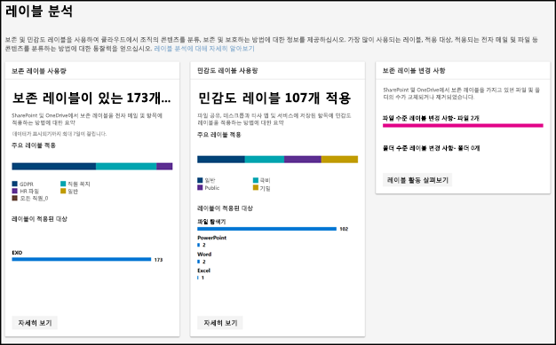
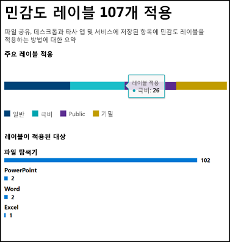
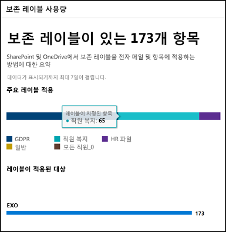
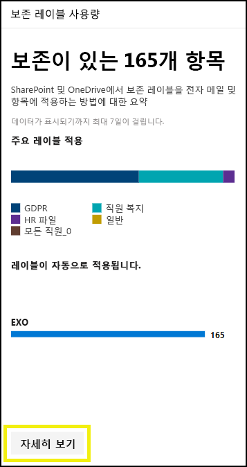
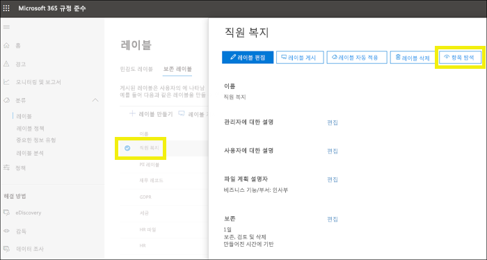
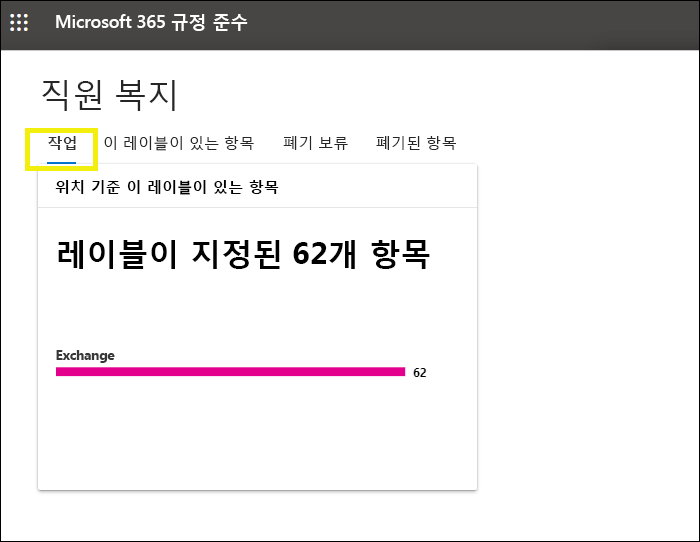
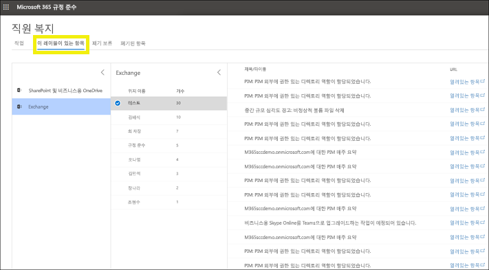

# 레이블 분석을 통한 레이블 사용량 보기

보존 레이블 및 민감도 레이블을 만든 이후 테넌트 전체에서 얼마나 사용되는지 알고자 할 것입니다. Microsoft 365 규정 준수 센터 및 Microsoft 365 보안 센터의 레이블 분석을 사용하여 어떤 레이블이 사장 많이 사용되고 레이블이 적용된 위치를 빠르게 알 수 있습니다.

예를 들어 레이블 분석을 사용하여 다음을 볼 수 있습니다.

- 콘텐츠에 적용된 보존 레이블 및 민감도 레이블의 총 수.
- 상단 레이블 및 각 레벨이 적용된 횟수.
- 레이블이 적용된 위치와 각 위치의 수.
- 보존 레이블이 변경 또는 제거된 파일 및 폴더의 수.

[Microsoft 365 규정 준수 센터](https://compliance.microsoft.com/labelanalytics) 또는 [Microsoft 365 보안 센터](https://security.microsoft.com/labelanalytics) > **분류** > **레이블 분석**에서 레이블 분석을 찾을 수 있습니다.

## 민감도 레이블 사용량

민감도 레이블 사용량에 대한 데이터는 Azure Information Protection 보고서에서 가져옵니다. 자세한 내용은 [Azure Information Protection에 대한 중앙 보고](https://docs.microsoft.com/ko-KR/azure/information-protection/reports-aip)를 참조하세요.

Azure Information Protection 보고서에는 Microsoft 365 규정 준수 센터 및 Microsofot 365 보안 센터의 민감도 레이블에 레이블 분석을 적용하는 [필수 조건](https://docs.microsoft.com/ko-KR/azure/information-protection/reports-aip#prerequisites-for-azure-information-protection-analytics)이 있습니다. 예를 들어 Log Analytics를 포함한 Azure 구독이 필요한데, 이러한 보고서가 Azure Information Protection 클라이언트 및 스캐너에서 Azure Log Analytics 서비스를 기준으로 중앙화된 위치로 정보 보호 감사 이벤트를 전송한 결과이기 때문입니다.

민감도 레이블 사용량:

- 데이터에 대기 시간이 없습니다. 실시간 보고서입니다.
- 각 상단 레이블의 수를 보려면 막대 그래프를 가리킨 다음 표시되는 도구 설명을 확인합니다.
- 보고서는 앱별로 민감도 레이블이 적용된 위치를 보여줍니다(보존 레이블은 위치별로 표시됨).

## 보존 레이블 사용량

이 보고서는 상단 레이블과 적용된 위치를 간단하게 보여줍니다. SharePoint 및 OneDrive에서 콘텐츠에 레이블이 지정되는 방법에 대한 자세한 내용은 [문서에 대한 레이블 지정 활동 보기](view-label-activity-for-documents.md)를 참조하세요.

보존 레이블 사용량:

- 데이터는 주 단위로 집계되므로 데이터가 보고서에 표시되려면 최대 7일이 소요될 수 있습니다.
- 각 상단 레이블의 수를 보려면 막대 그래프를 가리킨 다음 표시되는 도구 설명을 확인합니다.
- 보고서는 위치별로 보존 레이블이 적용된 위치를 보여줍니다(민감도 레이블은 앱별로 표시됨).
- 보존 레이블의 경우 특정 날짜 범위로 필터링되지 않은 테넌트의 전체 시간 데이터 요약입니다. 반대로 [레이블 활동 탐색기](view-label-activity-for-documents.md)는 지난 30일 동안만의 데이터를 보여줍니다.

## 특정 보존 레이블이 포함된 모든 콘텐츠를 봅니다.

보존 레이블 사용량 보고서에서 해당 레이블이 적용된 모든 콘텐츠를 탐색할 수 있습니다. (현재 이 기능을 개선하는 중이며 레이블 지정된 모든 콘텐츠를 보는 단계가 감소할 것입니다.)

먼저 보고서 하단에서 **자세히 보기**를 선택합니다.

그런 다음 오른쪽 창에 있는 보존 레이블 > **항목 탐색**을 선택합니다.

해당 레이블에 대해 **활동** 탭을 선택하고 위치별로 레이블이 포함된 항목 수를 확인합니다.

**이 레이블이 포함된 항목** 탭을 선택할 수도 있습니다. 그런 다음 특정 위치를 선택할 수 있습니다.

- Exchange Online의 경우 각 사서함에서 레이블 지정된 항목 수를 포함하여 사서함의 목록이 표시됩니다.
- SharePoint Online 및 비즈니스용 OneDrive의 경우 사이트 모음 및 OneDrive 계정 목록과 각 위치에 레이블 지정된 항목의 수가 포함되어 있습니다.

사서함 또는 사이트 모음을 선택하면 해당 위치의 해당 보존 레이블이 포함된 항목의 목록을 볼 수 있습니다.

## 사용 권한

레이블 분석을 보려면 Azure Active Directory에서 다음 역할 중 하나가 할당되어야 합니다.

- 전역 관리자
- 준수 관리자
- 보안 관리자
- 보안 읽기 권한자

또한 이러한 보고서는 Azure Monitor를 사용하여 조직이 소유한 Log Analytics 작업 영역에 있는 데이터를 저장합니다. 따라서 사용자가 데이터를 보유한 Azure Monitor 작업 영역에 읽기 권한자로 추가되어야 합니다. 자세한 내용은 [Azure Information Protection 분석에 대해 필요한 권한](https://docs.microsoft.com/ko-KR/azure/information-protection/reports-aip#permissions-required-for-azure-information-protection-analytics)을 참조하세요.

