# <a name="overview-of-retention-labels"></a><span data-ttu-id="098c2-105">보존 레이블 개요</span><span class="sxs-lookup"><span data-stu-id="098c2-105">Overview of retention labels</span></span>

<span data-ttu-id="098c2-p102">조직 전체에서 산업 규정 및 내부 정책을 준수하기 위해 다른 작업이 수행되어야 하는 다음과 같은 다른 형식의 콘텐츠가 있을 수 있습니다.</span><span class="sxs-lookup"><span data-stu-id="098c2-p102">Across your organization, you probably have different types of content that require different actions taken on them in order to comply with industry regulations and internal policies. For example, you might have:</span></span>
  
- <span data-ttu-id="098c2-108">최소 기간 동안 **보존**해야 하는 세금 양식</span><span class="sxs-lookup"><span data-stu-id="098c2-108">Tax forms that need to be **retained** for a minimum period of time.</span></span> 
    
- <span data-ttu-id="098c2-109">특정 기간에 도달할 때 **영구적으로 삭제**되어야 하는 보도 자료</span><span class="sxs-lookup"><span data-stu-id="098c2-109">Press materials that need to be **permanently deleted** when they reach a certain age.</span></span> 
    
- <span data-ttu-id="098c2-110">**보존**되었다가 **영구적으로 삭제**되어야 하는 경쟁업체 연구 자료</span><span class="sxs-lookup"><span data-stu-id="098c2-110">Competitive research that needs to be both **retained** and then **permanently deleted**.</span></span> 
    
- <span data-ttu-id="098c2-111">편집하거나 삭제할 수 없게 **기록으로 표시**해야 하는 취업 비자</span><span class="sxs-lookup"><span data-stu-id="098c2-111">Work visas that must be **marked as a record** so that they can't be edited or deleted.</span></span> 
    
<span data-ttu-id="098c2-p103">이러한 모든 경우에 Office 365에서 보존 레이블은 올바른 콘텐츠에 대해 올바른 작업을 수행하는 데 도움이 될 수 있습니다. 보존 레이블을 사용하여 거버넌스를 위해 조직의 데이터를 분류하고 해당 분류에 따라 보존 규칙을 적용할 수 있습니다.</span><span class="sxs-lookup"><span data-stu-id="098c2-p103">In all of these cases, retention labels in Office 365 can help you take the right actions on the right content. With retention labels, you can classify data across your organization for governance, and enforce retention rules based on that classification.</span></span>
  
<span data-ttu-id="098c2-114">보존 레이블을 사용하여 다음을 수행할 수 있습니다.</span><span class="sxs-lookup"><span data-stu-id="098c2-114">With retention labels, you can:</span></span>
  
- <span data-ttu-id="098c2-p104">**조직의 사용자가 웹용 Outlook, Outlook 2010 이상, OneDrive, SharePoint 및 Office 365 그룹에서 Outlook 콘텐츠에 보존 레이블을 수동으로 적용할 수 있게 합니다**. 사용자는 종종 자신이 사용하고 있는 콘텐츠의 형식을 가장 잘 알고 있기 때문에 콘텐츠를 분류하여 적절한 정책을 적용할 수 있습니다.</span><span class="sxs-lookup"><span data-stu-id="098c2-p104">**Enable people in your organization to apply a retention label manually** to content in Outlook on the web, Outlook 2010 and later, OneDrive, SharePoint, and Office 365 groups. Users often know best what type of content they're working with, so they can classify it and have the appropriate policy applied.</span></span> 
    
- <span data-ttu-id="098c2-117">콘텐츠에 다음이 포함된 경우처럼 특정 조건과 일치하는 경우 **콘텐츠에 보존 레이블을 자동으로 적용**합니다.</span><span class="sxs-lookup"><span data-stu-id="098c2-117">**Apply retention labels to content automatically** if it matches specific conditions, such as when the content contains:</span></span> 
    
  - <span data-ttu-id="098c2-118">특정 중요한 정보 유형</span><span class="sxs-lookup"><span data-stu-id="098c2-118">Specific types of sensitive information.</span></span>
    
  - <span data-ttu-id="098c2-119">만든 쿼리와 일치하는 특정 키워드</span><span class="sxs-lookup"><span data-stu-id="098c2-119">Specific keywords that match a query you create.</span></span>
    
    <span data-ttu-id="098c2-120">콘텐츠에 자동으로 보존 레이블을 적용하는 기능도 다음과 같은 이유로 중요합니다.</span><span class="sxs-lookup"><span data-stu-id="098c2-120">The ability to apply retention labels to content automatically is important because:</span></span>
    
  - <span data-ttu-id="098c2-121">사용자에게 모든 분류를 교육할 필요가 없습니다.</span><span class="sxs-lookup"><span data-stu-id="098c2-121">You don't need to train your users on all of your classifications.</span></span>
    
  - <span data-ttu-id="098c2-122">모든 콘텐츠를 올바르게 분류하기 위해 사용자에게 의존할 필요가 없습니다.</span><span class="sxs-lookup"><span data-stu-id="098c2-122">You don't need to rely on users to classify all content correctly.</span></span>
    
  - <span data-ttu-id="098c2-123">사용자가 더 이상 데이터 거버넌스 정책을 알아야 할 필요가 없으며, 그 대신 업무에 집중할 수 있습니다.</span><span class="sxs-lookup"><span data-stu-id="098c2-123">Users no longer need to know about data governance policies - they can instead focus on their work.</span></span>

  > [!NOTE]
  > <span data-ttu-id="098c2-p105">자동으로 레이블을 적용하는 기능을 사용하려면 사이트 또는 사서함에서 자동으로 레이블이 지정된 콘텐츠를 편집할 수 있는 권한이 있는 각 사용자에 대해 Office 365 Enterprise E5 라이선스가 있어야 합니다. 읽기 전용 액세스 권한만 있는 사용자에게는 라이선스가 필요하지 않습니다.</span><span class="sxs-lookup"><span data-stu-id="098c2-p105">The capability to apply labels automatically requires an Office 365 Enterprise E5 license for each user who has permissions to edit content that's been automatically labeled in a site or mailbox. Users who simply have read-only access do not require a license.</span></span>
      
- <span data-ttu-id="098c2-126">SharePoint 및 Office 365 그룹 사이트의 **문서 라이브러리에 기본 보존 레이블을 적용**하여 해당 라이브러리의 모든 문서에서 기본 보존 레이블을 사용할 수 있도록 합니다.</span><span class="sxs-lookup"><span data-stu-id="098c2-126">**Apply a default retention label to a document library** in SharePoint and Office 365 group sites, so that all documents in that library get the default retention label.</span></span> 
    
- <span data-ttu-id="098c2-p106">전자 메일 문서를 포함하는 **기록 관리를 Office 365에서 구현**합니다. 보존 레이블을 사용하여 콘텐츠를 기록으로 분류할 수 있습니다. 이 경우 레이블을 변경하거나 제거할 수 없으며 콘텐츠를 편집하거나 삭제할 수 없습니다.</span><span class="sxs-lookup"><span data-stu-id="098c2-p106">**Implement records management across Office 365**, including both email and documents. You can use a retention label to classify content as a record. When this happens, the label can't be changed or removed, and the content can't be edited or deleted.</span></span> 
    
<span data-ttu-id="098c2-130">Office 365 보안 및 준수 센터의 **레이블** 페이지에 있는 **보존** 탭에서 보존 레이블을 만들고 관리합니다.</span><span class="sxs-lookup"><span data-stu-id="098c2-130">You create and manage retention labels on the **Retention** tab on the **Labels** page in the Office 365 Security &amp; Compliance Center.</span></span> 
  
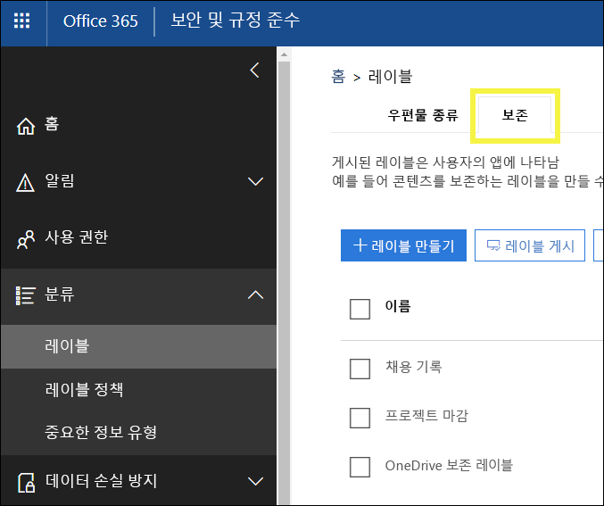
 
## <a name="how-retention-labels-work-with-label-policies"></a><span data-ttu-id="098c2-132">보존 레이블이 레이블 정책에 작동하는 방식</span><span class="sxs-lookup"><span data-stu-id="098c2-132">How retention labels work with label policies</span></span>

<span data-ttu-id="098c2-p107">콘텐츠를 분류할 수 있도록 조직의 사용자들이 보존 레이블을 사용할 수 있게 하는 과정은 2단계 프로세스로 진행됩니다. 즉, 먼저 레이블을 만든 후에 선택한 위치에 게시합니다. 보존 레이블을 게시할 때 레이블 정책이 만들어집니다.</span><span class="sxs-lookup"><span data-stu-id="098c2-p107">Making retention labels available to people in your organization so that they can classify content is a two-step process: first you create the labels, and then you publish them to the locations you choose. When you publish retention labels, a label policy gets created.</span></span>
  
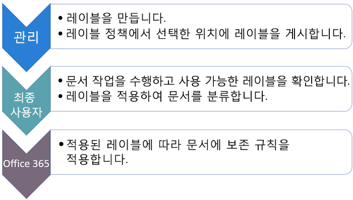
  
<span data-ttu-id="098c2-p108">보존 레이블은 레이블 정책에 포함되고 여러 다른 위치에 게시되는 독립적인 재사용 가능한 구성 요소입니다. 보존 레이블은 많은 정책에서 다시 사용될 수 있습니다. 레이블 정책의 주 목적은 보존 레이블 집합을 그룹화하고 해당 레이블을 표시할 위치를 지정하는 것입니다.</span><span class="sxs-lookup"><span data-stu-id="098c2-p108">Retention labels are independent, reusable building blocks that are included in a label policy and published to different locations. Retention labels can be reused across many policies. The primary purpose of the label policy is to group a set of retention labels and specify the locations where you want those labels to appear.</span></span>
  
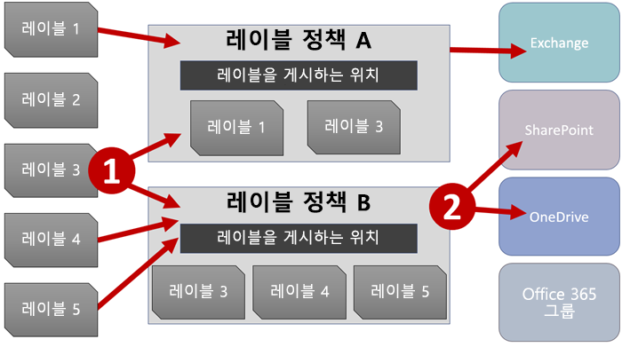
  
1. <span data-ttu-id="098c2-p109">보존 레이블을 게시하면 레이블 정책에 포함됩니다. 단일 보존 레이블을 여러 정책에 포함할 수 있습니다.</span><span class="sxs-lookup"><span data-stu-id="098c2-p109">When you publish retention labels, they're included in a label policy. A single retention label can be included in many policies.</span></span>
    
2. <span data-ttu-id="098c2-142">레이블 정책은 보존 레이블을 게시할 위치를 지정합니다.</span><span class="sxs-lookup"><span data-stu-id="098c2-142">Label policies specify the locations to publish the retention labels.</span></span>
    
## <a name="only-one-retention-label-at-a-time"></a><span data-ttu-id="098c2-143">한 번에 하나의 보존 레이블만</span><span class="sxs-lookup"><span data-stu-id="098c2-143">Only one retention label at a time</span></span>

<span data-ttu-id="098c2-144">전자 메일 또는 문서와 같은 콘텐츠에는 한 번에 하나씩 단일 보존 레이블만 할당될 수 있다는 점에 유의합니다.</span><span class="sxs-lookup"><span data-stu-id="098c2-144">It's important to know that content like an email or document can have only a single retention label assigned to it at a time:</span></span>
  
- <span data-ttu-id="098c2-145">최종 사용자가 수동으로 할당한 레이블의 경우, 할당된 보존 레이블을 제거하거나 변경할 수 있습니다.</span><span class="sxs-lookup"><span data-stu-id="098c2-145">For labels assigned manually by end users, people can remove or change the retention label that's assigned.</span></span>
    
- <span data-ttu-id="098c2-146">콘텐츠에 자동 적용 레이블이 할당된 경우 최종 사용자가 자동 적용 레이블을 수동 할당 보존 레이블로 바꿀 수 있습니다.</span><span class="sxs-lookup"><span data-stu-id="098c2-146">If content has an auto-apply label assigned, an auto-apply label can be replaced by a retention label assigned manually by an end user.</span></span>
    
- <span data-ttu-id="098c2-147">최종 사용자가 콘텐츠에 수동으로 보존 레이블을 할당한 경우 자동 적용 레이블로 수동 할당 보존 레이블을 대신할 수 없습니다.</span><span class="sxs-lookup"><span data-stu-id="098c2-147">If content has a retention label assigned manually by an end user, an auto-apply label cannot replace the manually assigned retention label.</span></span>
    
- <span data-ttu-id="098c2-148">자동 적용 레이블을 할당하는 여러 규칙이 있고 콘텐츠가 여러 규칙의 조건을 충족하는 경우 가장 오래된 규칙에 대한 보존 레이블이 할당됩니다.</span><span class="sxs-lookup"><span data-stu-id="098c2-148">If there are multiple rules that assign an auto-apply label and content meets the conditions of multiple rules, the retention label for the oldest rule is assigned.</span></span>
    
<span data-ttu-id="098c2-p110">수동으로 할당된 레이블은 명시적으로 할당되고, 자동 적용 레이블은 암시적으로 할당됩니다. 또한 명시적 보존 레이블은 암시적 레이블보다 우선합니다. 자세한 내용은 아래 섹션에서 [보존 원칙 또는 우선 순위](labels.md#principles)를 참조하세요.</span><span class="sxs-lookup"><span data-stu-id="098c2-p110">Manually assigned labels are explicitly assigned; auto-apply labels are implicitly assigned; an explicit retention label takes precedence over an implicit label. For more information, see the below section on [The principles of retention, or what takes precedence?](labels.md#principles).</span></span>

<span data-ttu-id="098c2-p111">이 섹션의 모든 정보는 보존 레이블에만 적용됩니다. 하나의 콘텐츠 항목에 보존 레이블 1개 외에 민감도 레이블이 1개만 적용될 수 있습니다.</span><span class="sxs-lookup"><span data-stu-id="098c2-p111">All of the information in this section applies only to retention labels. Note that an item of content can also have one sensitivity label applied to it, in addition to one retention label.</span></span>
  
## <a name="how-long-it-takes-for-retention-labels-to-take-effect"></a><span data-ttu-id="098c2-153">보존 레이블이 적용되는 데 걸리는 시간</span><span class="sxs-lookup"><span data-stu-id="098c2-153">How long it takes for retention labels to take effect</span></span>

<span data-ttu-id="098c2-154">보존 레이블을 게시하거나 자동 적용할 경우 즉시 적용되지 않습니다.</span><span class="sxs-lookup"><span data-stu-id="098c2-154">When you publish or auto-apply retention labels, they don't take effect immediately:</span></span>
  
1. <span data-ttu-id="098c2-155">먼저 레이블 정책을 보안 및 준수 센터에서 정책의 위치로 동기화해야 합니다.</span><span class="sxs-lookup"><span data-stu-id="098c2-155">First the label policy needs to be synced from the Security &amp; Compliance Center to the locations in the policy.</span></span>
    
2. <span data-ttu-id="098c2-p112">그러면 해당 위치에서 최종 사용자가 수동 레이블을 사용하거나 콘텐츠에 레이블이 자동으로 적용되는 데 다소 시간이 걸릴 수 있습니다. 걸리는 시간은 레이블의 위치 및 유형에 따라 다릅니다.</span><span class="sxs-lookup"><span data-stu-id="098c2-p112">Then the location may require time to make manual labels available to end users or auto-apply labels to content. How long this takes depends on the location and type of label.</span></span>
    
### <a name="manual-retention-labels"></a><span data-ttu-id="098c2-158">수동 보존 레이블</span><span class="sxs-lookup"><span data-stu-id="098c2-158">Manual retention labels</span></span>

<span data-ttu-id="098c2-p113">SharePoint 또는 OneDrive에 보존 레이블을 게시하면 해당 보존 레이블이 최종 사용자에 게 표시되기까지 하루가 걸릴 수 있습니다. 또한 보존 레이블을 Exchange에 게시하는 경우 해당 보존 레이블이 최종 사용자에게 표시되기까지 7일이 걸릴 수 있으며, 사서함에는 10MB 이상의 데이터가 포함되어야 합니다.</span><span class="sxs-lookup"><span data-stu-id="098c2-p113">If you publish retention labels to SharePoint or OneDrive, it can take one day for those retention labels to appear for end users. In addition, if you publish retention labels to Exchange, it can take 7 days for those retention labels to appear for end users, and the mailbox needs to contain at least 10 MB of data.</span></span>
  
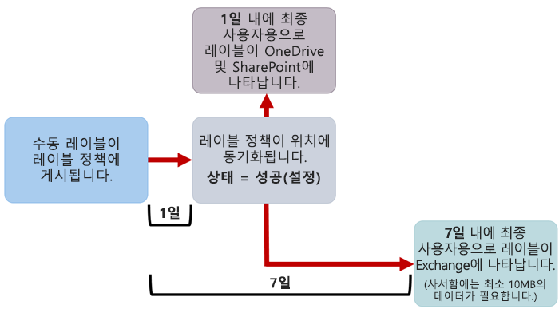
  
### <a name="auto-apply-retention-labels"></a><span data-ttu-id="098c2-162">보존 레이블 작동 적용</span><span class="sxs-lookup"><span data-stu-id="098c2-162">Auto-apply retention labels</span></span>

<span data-ttu-id="098c2-163">특정 조건과 일치하는 콘텐츠에 보존 레이블을 자동으로 적용하는 경우 보존 레이블이 조건과 일치하는 모든 콘텐츠에 적용되는 데 7일이 걸릴 수 있습니다.</span><span class="sxs-lookup"><span data-stu-id="098c2-163">If you auto-apply retention labels to content matching specific conditions, it can take seven days for the retention labels to be applied to all content that matches the conditions.</span></span>
  
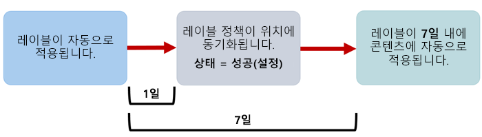
  
### <a name="how-to-check-on-the-status-of-exchange-labels"></a><span data-ttu-id="098c2-165">Exchange 레이블의 상태를 확인하는 방법</span><span class="sxs-lookup"><span data-stu-id="098c2-165">How to check on the status of Exchange labels</span></span>

<span data-ttu-id="098c2-p114">Exchange Online에서는 7일 간격으로 실행되는 프로세스를 통해 최종 사용자가 보존 레이블을 사용할 수 있게 됩니다. Powershell을 사용하여 이 프로세스가 마지막으로 실행된 시간 및 다시 실행될 시간을 확인할 수 있습니다.</span><span class="sxs-lookup"><span data-stu-id="098c2-p114">In Exchange Online, retention labels are made available to end users by a process that runs every seven days. By using Powershell, you can see when this process last ran and thus determine when it will run again.</span></span>
  
1. <span data-ttu-id="098c2-168">[Exchange Online PowerShell에 연결합니다](https://go.microsoft.com/fwlink/?linkid=799773).</span><span class="sxs-lookup"><span data-stu-id="098c2-168">[Connect to Exchange Online PowerShell](https://go.microsoft.com/fwlink/?linkid=799773).</span></span>
    
2. <span data-ttu-id="098c2-169">다음 명령을 실행합니다.</span><span class="sxs-lookup"><span data-stu-id="098c2-169">Run these commands.</span></span>
    
  ```
  $logProps = Export-MailboxDiagnosticLogs <user> -ExtendedProperties
  ```

  ```
  $xmlprops = [xml]($logProps.MailboxLog)
  ```

  ```
  $xmlprops.Properties.MailboxTable.Property | ? {$_.Name -like "ELC*"}
  ```

<span data-ttu-id="098c2-p115">결과에서 `ELCLastSuccessTimeStamp`(UTC) 속성은 시스템이 사서함을 마지막으로 처리한 시간이 표시됩니다. 정책을 만든 이후로 이러한 처리가 발생하지 않은 경우 레이블이 표시되지 않습니다. 강제로 처리를 진행하려면 `Start-ManagedFolderAssistant -Identity <user>`를 실행합니다.</span><span class="sxs-lookup"><span data-stu-id="098c2-p115">In the results, the  `ELCLastSuccessTimeStamp` (UTC) property shows when the system last processed your mailbox. If it has not happened since the time you created the policy, the labels are not going to appear. To force processing, run  `Start-ManagedFolderAssistant -Identity <user>`.</span></span>
    
<span data-ttu-id="098c2-173">웹용 Outlook에 레이블이 나타나야 하는데 나타나지 않으면 브라우저에서 캐시를 지워야 합니다(Ctrl + F5).</span><span class="sxs-lookup"><span data-stu-id="098c2-173">If labels aren't appearing in Outlook on the web and you think they should be, make sure to clear the cache in your browser (CTRL+F5).</span></span>
    
## <a name="label-policies-and-locations"></a><span data-ttu-id="098c2-174">레이블 정책 및 위치</span><span class="sxs-lookup"><span data-stu-id="098c2-174">Label policies and locations</span></span>

<span data-ttu-id="098c2-175">보존 레이블이 수행하는 작업에 따라, 다양한 유형의 보존 레이블을 여러 다른 위치에 게시할 수 있습니다.</span><span class="sxs-lookup"><span data-stu-id="098c2-175">Different types of retention labels can be published to different locations, depending on what the retention label does.</span></span>
  
|<span data-ttu-id="098c2-176">**보존 레이블...**</span><span class="sxs-lookup"><span data-stu-id="098c2-176">**If the retention label is…**</span></span>|<span data-ttu-id="098c2-177">**레이블 정책을 적용할 수 있는 대상...**</span><span class="sxs-lookup"><span data-stu-id="098c2-177">**Then the label policy can be applied to…**</span></span>|
|:-----|:-----|
|<span data-ttu-id="098c2-178">최종 사용자에게 게시</span><span class="sxs-lookup"><span data-stu-id="098c2-178">Published to end users</span></span>  <br/> |<span data-ttu-id="098c2-179">Exchange, SharePoint, OneDrive, Office 365 그룹</span><span class="sxs-lookup"><span data-stu-id="098c2-179">Exchange, SharePoint, OneDrive, Office 365 groups</span></span>  <br/> |
|<span data-ttu-id="098c2-180">중요한 정보 유형에 따라 자동으로 적용</span><span class="sxs-lookup"><span data-stu-id="098c2-180">Auto-applied based on sensitive information types</span></span>  <br/> |<span data-ttu-id="098c2-181">Exchange(모든 사서함만), SharePoint, OneDrive</span><span class="sxs-lookup"><span data-stu-id="098c2-181">Exchange (all mailboxes only), SharePoint, OneDrive</span></span>  <br/> |
|<span data-ttu-id="098c2-182">쿼리에 따라 자동 적용</span><span class="sxs-lookup"><span data-stu-id="098c2-182">Auto-applied based on a query</span></span>  <br/> |<span data-ttu-id="098c2-183">Exchange, SharePoint, OneDrive, Office 365 그룹</span><span class="sxs-lookup"><span data-stu-id="098c2-183">Exchange, SharePoint, OneDrive, Office 365 groups</span></span>  <br/> |
   
<span data-ttu-id="098c2-p116">Exchange에서 자동 적용 보존 레이블(쿼리 및 중요한 정보 유형 둘 다에 해당)은 현재 사서함에 있는 모든 항목(미사용 데이터)이 아니라 새로 전송된 메시지(전송 중인 데이터)에만 적용됩니다. 또한 중요한 정보 유형에 대한 자동 적용 보존 레이블은 모든 사서함에만 적용될 수 있으며 특정 사서함을 선택할 수 없습니다.</span><span class="sxs-lookup"><span data-stu-id="098c2-p116">Note that in Exchange, auto-apply retention labels (for both queries and sensitive information types) are applied only to messages newly sent (data in transit), not to all items currently in the mailbox (data at rest). Also, auto-apply retention labels for sensitive information types can apply only to all mailboxes; you can't select the specific mailboxes.</span></span>
  
<span data-ttu-id="098c2-186">Exchange 공용 폴더 및 Skype는 레이블을 지원하지 않습니다.</span><span class="sxs-lookup"><span data-stu-id="098c2-186">Note that Exchange public folders and Skype do not support labels.</span></span>
  
## <a name="how-retention-labels-enforce-retention"></a><span data-ttu-id="098c2-187">보존 레이블이 보존을 적용하는 방법</span><span class="sxs-lookup"><span data-stu-id="098c2-187">How retention labels enforce retention</span></span>

<span data-ttu-id="098c2-p117">보존 레이블은 보존 정책이 수행할 수 있는 동일한 보존 작업을 적용할 수 있습니다. 보존 레이블을 사용하여 정교한 콘텐츠 계획(또는 파일 계획)을 구현할 수 있습니다. 보존 작업이 작동하는 방식에 대한 자세한 내용은 [보존 정책 개요](retention-policies.md)를 참조하세요.</span><span class="sxs-lookup"><span data-stu-id="098c2-p117">Retention labels can enforce exactly the same retention actions that a retention policy can. You can use retention labels to implement a sophisticated content plan (or file plan). For more information on how retention works, see [Overview of retention policies](retention-policies.md).</span></span>
  
<span data-ttu-id="098c2-p118">또한 보존 레이블에는 보존 정책이 아니라 보존 레이블에서만 사용할 수 있는 2가지 보존 옵션이 있습니다. 보존 레이블을 사용하면 다음과 같은 작업을 수행할 수 있습니다.</span><span class="sxs-lookup"><span data-stu-id="098c2-p118">In addition, a retention label has two retention options that are available only in a retention label and not in a retention policy. With a retention label, you can:</span></span>
  
- <span data-ttu-id="098c2-p119">SharePoint 및 OneDrive 문서가 삭제되기 전에 검토될 수 있도록 보존 기간이 끝나면 처리 검토를 트리거합니다. 자세한 내용은 [처리 검토 개요](disposition-reviews.md)를 참조하세요.</span><span class="sxs-lookup"><span data-stu-id="098c2-p119">Trigger a disposition review at the end of the retention period, so that SharePoint and OneDrive documents must be reviewed before they can be deleted. For more information, see [Overview of disposition reviews](disposition-reviews.md).</span></span>
    
- <span data-ttu-id="098c2-195">보존 기간은 콘텐츠 사용 기간이나 마지막으로 수정되었을 때가 아니라 콘텐츠에 레이블이 지정될 때 시작됩니다.</span><span class="sxs-lookup"><span data-stu-id="098c2-195">Start the retention period from when the content was labeled, instead of the age of the content or when it was last modified.</span></span>
    
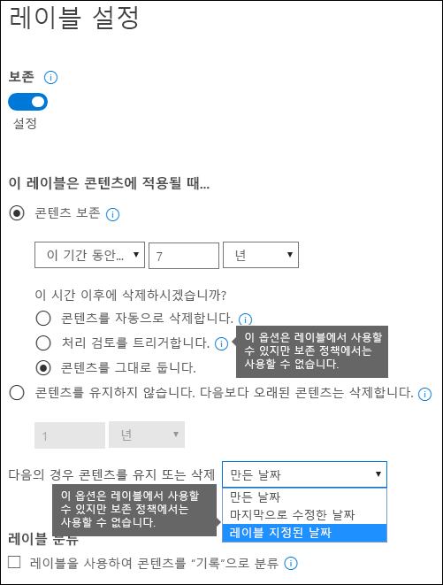
  
## <a name="where-published-retention-labels-can-appear-to-end-users"></a><span data-ttu-id="098c2-197">게시된 보존 레이블이 최종 사용자에게 표시될 수 있는 위치</span><span class="sxs-lookup"><span data-stu-id="098c2-197">Where published retention labels can appear to end users</span></span>

<span data-ttu-id="098c2-198">최종 사용자가 콘텐츠에 보존 레이블을 할당하면 해당 레이블을 다음에 게시할 수 있습니다.</span><span class="sxs-lookup"><span data-stu-id="098c2-198">If your retention label will be assigned to content by end users, you can publish it to:</span></span>
  
- <span data-ttu-id="098c2-199">웹용 Outlook</span><span class="sxs-lookup"><span data-stu-id="098c2-199">Outlook on the web</span></span>
    
- <span data-ttu-id="098c2-200">Outlook 2010 이상</span><span class="sxs-lookup"><span data-stu-id="098c2-200">Outlook 2010 and later</span></span>
    
- <span data-ttu-id="098c2-201">OneDrive</span><span class="sxs-lookup"><span data-stu-id="098c2-201">OneDrive</span></span>
    
- <span data-ttu-id="098c2-202">SharePoint</span><span class="sxs-lookup"><span data-stu-id="098c2-202">SharePoint</span></span>
    
- <span data-ttu-id="098c2-203">Office 365 그룹(웹용 Outlook의 그룹 사이트 및 그룹 사서함)</span><span class="sxs-lookup"><span data-stu-id="098c2-203">Office 365 groups (both the group site and group mailbox in Outlook on the web)</span></span>
    
<span data-ttu-id="098c2-204">아래 섹션에서는 다양한 앱에서 레이블이 조직의 사용자에게 표시되는 방식을 보여 줍니다.</span><span class="sxs-lookup"><span data-stu-id="098c2-204">The sections below show how labels will appear in different apps to people in your organization.</span></span>
  
### <a name="outlook-on-the-web"></a><span data-ttu-id="098c2-205">웹용 Outlook</span><span class="sxs-lookup"><span data-stu-id="098c2-205">Outlook on the web</span></span>

<span data-ttu-id="098c2-206">웹용 Outlook에서 항목에 레이블을 지정하려면 마우스 오른쪽 단추로 항목 \> **정책 할당**을 클릭하고 \> 보존 레이블을 선택합니다.</span><span class="sxs-lookup"><span data-stu-id="098c2-206">To label an item in Outlook on the web, right-click the item \> **Assign policy** \> choose the retention label.</span></span> 
  
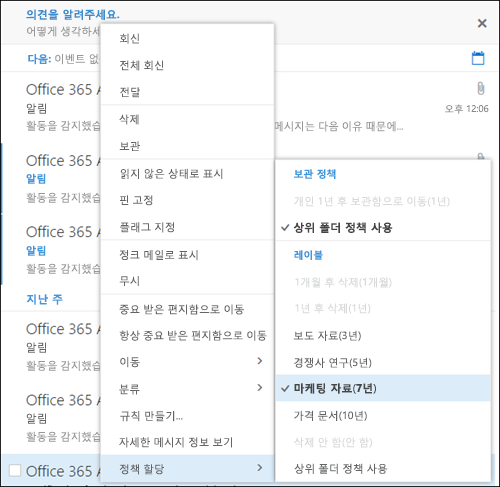
  
<span data-ttu-id="098c2-p120">해당 보존 레이블이 적용된 후에는 항목 맨 위에서 해당 보존 레이블과 수행되는 작업을 볼 수 있습니다. 전자 메일 분류되고 연결된 보존 기간이 있으면 전자 메일이 만료될 시기를 한눈에 알 수 있습니다.</span><span class="sxs-lookup"><span data-stu-id="098c2-p120">After the retention label is applied, you can view that retention label and what action it takes at the top of the item. If an email is classified and has an associated retention period, you can know at a glance when the email will expire.</span></span>
  
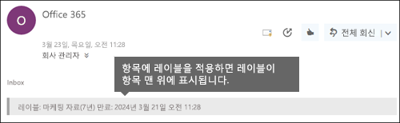
  
<span data-ttu-id="098c2-211">폴더에 보존 레이블을 적용할 수도 있습니다. 이러한 경우 다음을 수행됩니다.</span><span class="sxs-lookup"><span data-stu-id="098c2-211">You can also apply retention labels to folders, in which case:</span></span>
  
- <span data-ttu-id="098c2-p121">보존 레이블이 명시적으로 적용된 항목을 **제외**하고 폴더의 모든 항목에는 자동으로 같은 보존 레이블이 지정됩니다. 명시적으로 레이블이 지정된 항목은 기존 보존 레이블이 유지됩니다. 자세한 내용은 아래에서 보존 원칙에 대한 섹션을 참조하세요.</span><span class="sxs-lookup"><span data-stu-id="098c2-p121">All items in the folder automatically get the same retention label, **except** for items that have had a retention label applied explicitly to them. Explicitly labeled items keep their existing retention label. For more information, see the below section on the principles of retention.</span></span> 
    
- <span data-ttu-id="098c2-215">폴더의 기본 보존 레이블을 변경하거나 제거하는 경우 명시적 보존 레이블이 지정된 항목을 **제외**하고 폴더의 모든 항목에 대해서도 보존 레이블이 변경되거나 제거됩니다.</span><span class="sxs-lookup"><span data-stu-id="098c2-215">If you change or remove the default retention label for a folder, the retention label's also changed or removed for all items in the folder, **except** items with explicit retention labels.</span></span> 
    
- <span data-ttu-id="098c2-216">기본 보존 레이블이 있는 항목을 한 폴더에서 다른 기본 보존 레이블이 있는 다른 폴더로 이동하면 항목에 새 기본 보존 레이블이 지정됩니다.</span><span class="sxs-lookup"><span data-stu-id="098c2-216">If you move an item with a default retention label from one folder to another folder with a different default retention label, the item will get the new default retention label.</span></span>
    
- <span data-ttu-id="098c2-217">기본 보존 레이블이 있는 항목을 한 폴더에서 기본 보존 레이블이 없는 다른 폴더로 이동하면 이전의 기본 보존 레이블이 제거됩니다.</span><span class="sxs-lookup"><span data-stu-id="098c2-217">If you move an item with a default retention label from one folder to another folder with no default retention label, the old default retention label is removed.</span></span>
    
### <a name="outlook-2010-and-later"></a><span data-ttu-id="098c2-218">Outlook 2010 이상</span><span class="sxs-lookup"><span data-stu-id="098c2-218">Outlook 2010 and later</span></span>

<span data-ttu-id="098c2-219">웹용 Outlook에서 항목에 레이블을 지정하려면 마우스 오른쪽 단추로 **리본**의 항목 \> \> **정책 할당**을 클릭하고 \> 보존 레이블을 선택합니다.</span><span class="sxs-lookup"><span data-stu-id="098c2-219">To label an item in Outlook on the web, right-click the item \> on the **Ribbon** \> **Assign Policy** \> choose the retention label.</span></span> 
  
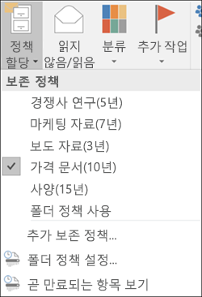
  
<span data-ttu-id="098c2-p122">해당 보존 레이블이 적용된 후에는 항목 맨 위에서 해당 보존 레이블과 수행되는 작업을 볼 수 있습니다. 전자 메일 분류되고 연결된 보존 기간이 있으면 전자 메일이 만료될 시기를 한눈에 알 수 있습니다.</span><span class="sxs-lookup"><span data-stu-id="098c2-p122">After the retention label is applied, you can view that retention label and what action it takes at the top of the item. If an email is classified and has an associated retention period, you can know at a glance when the email will expire.</span></span>
  
<span data-ttu-id="098c2-p123">또한 폴더에도 보존 레이블을 적용할 수 있습니다. Outlook 2010 이상에서도 웹용 Outlook의 경우와 마찬가지로 작동합니다. 자세한 내용은 이전 섹션을 참조하세요.</span><span class="sxs-lookup"><span data-stu-id="098c2-p123">You can also apply retention labels to folders. This works the same in Outlook 2010 and later as it does in Outlook on the web -- see the previous section for more info.</span></span>
  
### <a name="onedrive-and-sharepoint"></a><span data-ttu-id="098c2-225">OneDrive 및 SharePoint</span><span class="sxs-lookup"><span data-stu-id="098c2-225">OneDrive and SharePoint</span></span>

<span data-ttu-id="098c2-226">OneDrive 또는 SharePoint에서 문서(OneNote 파일 포함)에 레이블을 지정하려면 오른쪽 위 모서리에서 항목을 선택하고 \> **세부 정보 창 열기** \> **레이블 적용**을 선택한 후 \> 보존 레이블을 선택합니다.</span><span class="sxs-lookup"><span data-stu-id="098c2-226">To label a document (including OneNote files) in OneDrive or SharePoint, select the item \> in the upper-right corner, choose **Open the details pane** \> **Apply label** \> choose the retention label.</span></span> 
  
<span data-ttu-id="098c2-227">폴더 또는 문서 집합에 보존 레이블을 적용할 수도 있으며, 문서 라이브러리에 대해 기본 보존 레이블을 설정할 수 있습니다. 자세한 내용은 아래 섹션을 참조하세요.</span><span class="sxs-lookup"><span data-stu-id="098c2-227">Note that you can also apply a retention label to a folder or document set, and you can set a default retention label for a document library - see the section below for more information.</span></span>
  
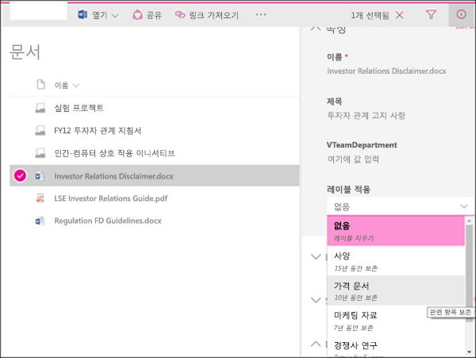
  
<span data-ttu-id="098c2-229">항목에 보존 레이블이 적용된 후에는 항목을 선택하면 세부 정보 창에서 해당 레이블을 볼 수 있습니다.</span><span class="sxs-lookup"><span data-stu-id="098c2-229">After a retention label is applied to an item, you can view it in the details pane when that item's selected.</span></span>
  
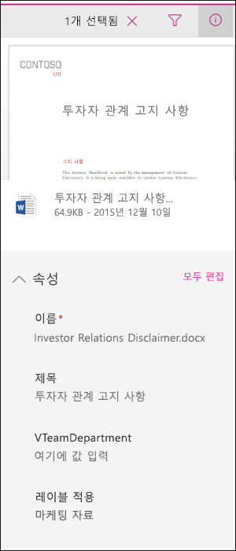
  
<span data-ttu-id="098c2-p124">**레이블** 열 또는 **기록 항목임** 열이 포함된 라이브러리의 보기를 만들 수도 있습니다. 이 경우 모든 항목에 할당된 보존 레이블과 기록에 해당하는 항목을 한눈에 확인할 수 있습니다. 그렇지만 **기록 항목임** 열을 기준으로는 보기를 필터링할 수 없습니다.</span><span class="sxs-lookup"><span data-stu-id="098c2-p124">You can also create a view of the library that contains the **Labels** column or **Item is a Record** column, so that you can see at a glance the retention labels assigned to all items and which items are records. Note, however, that you can't filter the view by the **Item is a Record** column.</span></span> 
  
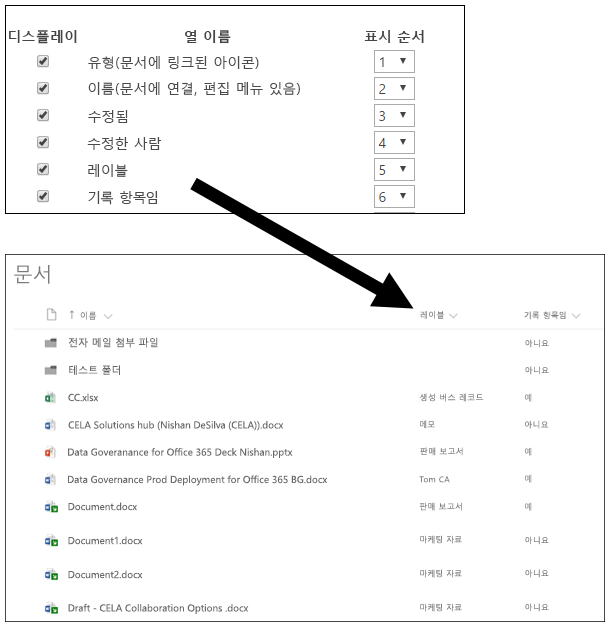
  
### <a name="office-365-groups"></a><span data-ttu-id="098c2-234">Office 365 그룹</span><span class="sxs-lookup"><span data-stu-id="098c2-234">Office 365 groups</span></span>

<span data-ttu-id="098c2-p125">Office 365 그룹에 보존 레이블을 게시하면 웹용 Outlook의 그룹 사이트와 그룹 사서함에 보존 레이블에 나타납니다. 콘텐츠에 보존 레이블을 적용하는 환경은 전자 메일 및 문서에 대해 위에 표시된 환경과 동일합니다.</span><span class="sxs-lookup"><span data-stu-id="098c2-p125">When you publish retention labels to an Office 365 group, the retention labels appear in both the group site and group mailbox in Outlook on the web. The experience of applying a retention label to content is identical to that shown above for email and documents.</span></span>

<span data-ttu-id="098c2-p126">Office 365 그룹 콘텐츠를 보존하려면 Office 365 그룹 위치를 사용해야 합니다. Office 365 그룹이 Exchange 사서함을 보유하고 있더라도 전체 Exchange 위치를 포함하는 보존 정책이 Office 365 그룹 사서함의 콘텐츠를 포함하지는 않습니다.</span><span class="sxs-lookup"><span data-stu-id="098c2-p126">To retain content for an Office 365 group, you need to use the Office 365 groups location. Even though an Office 365 group has an Exchange mailbox, a retention policy that includes the entire Exchange location won't include content in Office 365 group mailboxes.</span></span>

<span data-ttu-id="098c2-p127">또한 Exchange 위치를 사용하여 특정 그룹 사서함을 포함하거나 제외할 수 없습니다. 초기에 Exchange 위치가 선택될 그룹 사서함을 허용하더라도 보존 정책을 저장하려고 시도할 때 “RemoteGroupMailbox”가 Exchange 위치에 유효하지 않은 선택이라는 오류가 나타나게 됩니다.</span><span class="sxs-lookup"><span data-stu-id="098c2-p127">In addition, it's not possible to use the Exchange location to include or exclude a specific group mailbox. Although the Exchange location initially allows a group mailbox to be selected, when you try to save the retention policy, you'll receive an error that "RemoteGroupMailbox" is not a valid selection for the Exchange location.</span></span>
  
## <a name="applying-a-retention-label-automatically-based-on-conditions"></a><span data-ttu-id="098c2-241">조건에 따라 자동으로 보존 레이블 적용</span><span class="sxs-lookup"><span data-stu-id="098c2-241">Applying a retention label automatically based on conditions</span></span>

<span data-ttu-id="098c2-p128">보존 레이블의 가장 강력한 기능 중 하나는 특정 조건과 일치하는 콘텐츠에 자동으로 레이블을 적용하는 기능입니다. 이 경우 조직의 사용자는 보존 레이블을 적용할 필요가 없습니다. Office 365에서 이러한 작업을 자동으로 수행합니다.</span><span class="sxs-lookup"><span data-stu-id="098c2-p128">One of the most powerful features of retention labels is the ability to apply them automatically to content that matches certain conditions. In this case, people in your organization don't need to apply the retention labels - Office 365 does the work for them.</span></span>
  
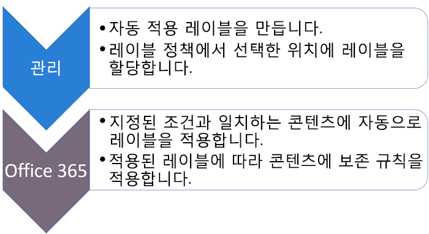
  
<span data-ttu-id="098c2-245">자동 적용 보존 레이블은 다음과 같은 기능 때문에 강력합니다.</span><span class="sxs-lookup"><span data-stu-id="098c2-245">Auto-apply retention labels are powerful because:</span></span>
  
- <span data-ttu-id="098c2-246">사용자에게 모든 분류를 교육할 필요가 없습니다.</span><span class="sxs-lookup"><span data-stu-id="098c2-246">You don't need to train your users on all of your classifications.</span></span>
    
- <span data-ttu-id="098c2-247">모든 콘텐츠를 올바르게 분류하기 위해 사용자에게 의존할 필요가 없습니다.</span><span class="sxs-lookup"><span data-stu-id="098c2-247">You don't need to rely on users to classify all content correctly.</span></span>
    
- <span data-ttu-id="098c2-248">사용자가 더 이상 데이터 거버넌스 정책을 알아야 할 필요가 없으며, 업무에 집중할 수 있습니다.</span><span class="sxs-lookup"><span data-stu-id="098c2-248">Users no longer need to know about data governance policies - they can focus on their work.</span></span>
    
<span data-ttu-id="098c2-249">콘텐츠에 다음이 포함될 경우 콘텐츠에 자동으로 보존 레이블을 적용하도록 선택할 수 있습니다.</span><span class="sxs-lookup"><span data-stu-id="098c2-249">You can choose to apply retention labels to content automatically when that content contains:</span></span>
  
- <span data-ttu-id="098c2-250">특정 중요한 정보 유형</span><span class="sxs-lookup"><span data-stu-id="098c2-250">Specific types of sensitive information.</span></span>
    
- <span data-ttu-id="098c2-251">만든 쿼리와 일치하는 특정 키워드</span><span class="sxs-lookup"><span data-stu-id="098c2-251">Specific keywords that match a query you create.</span></span>
    
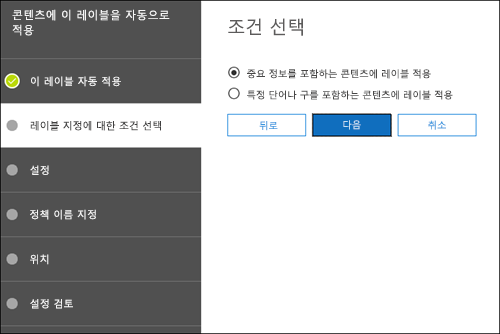
  
<span data-ttu-id="098c2-253">자동 적용 보존 레이블에는 Office 365 Enterprise E5 구독이 필요하며, 위에 설명한 것처럼 조건과 일치하는 모든 콘텐츠에 자동 적용 보존 레이블이 적용되는 데는 7일까지 소요될 수 있습니다.</span><span class="sxs-lookup"><span data-stu-id="098c2-253">Note that auto-apply retention labels require an Office 365 Enterprise E5 subscription, and that it can take up to seven days for auto-apply retention labels to be applied to all content that matches the conditions, as described above.</span></span>
  
### <a name="auto-apply-retention-labels-to-content-with-specific-types-of-sensitive-information"></a><span data-ttu-id="098c2-254">특정 유형의 중요한 정보가 있는 콘텐츠에 보존 레이블 자동 적용</span><span class="sxs-lookup"><span data-stu-id="098c2-254">Auto-apply retention labels to content with specific types of sensitive information</span></span>

<span data-ttu-id="098c2-p129">중요한 정보에 대한 자동 적용 보존 레이블을 만들 경우 DLP(데이터 손실 방지) 정책을 만들 때 같은 정책 템플릿 목록이 표시됩니다. 각 정책 템플릿은 특정 유형의 중요한 정보를 찾도록 미리 구성됩니다. 예를 들어, 여기에 표시되는 템플릿은 미국 ITIN, SSN 및 여권 번호를 찾습니다. DLP에 대한 자세한 내용은 [데이터 손실 방지 정책 개요](data-loss-prevention-policies.md)를 참조하세요.</span><span class="sxs-lookup"><span data-stu-id="098c2-p129">When you create auto-apply retention labels for sensitive information, you see the same list of policy templates as when you create a data loss prevention (DLP) policy. Each policy template is preconfigured to look for specific types of sensitive information - for example, the template shown here looks for U.S. ITIN, SSN, and passport numbers. To learn more about DLP, see [Overview of data loss prevention policies](data-loss-prevention-policies.md).</span></span>
  
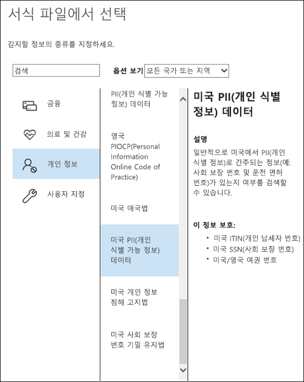
  
<span data-ttu-id="098c2-p130">정책 템플릿을 선택한 후 임의 유형의 중요한 정보를 추가하거나 제거하고, 인스턴스 수 및 일치 정확도를 변경할 수 있습니다. 여기에 표시된 예제에서는 다음 경우에만 보존 레이블이 자동 적용됩니다.</span><span class="sxs-lookup"><span data-stu-id="098c2-p130">After you select a policy template, you can add or remove any types of sensitive information, and you can change the instance count and match accuracy. In the example shown here, a retention label will be auto-applied only when:</span></span>
  
- <span data-ttu-id="098c2-p131">콘텐츠에 이러한 세 가지 중요한 정보 유형 중 어느 하나의 1~9개 인스턴스가 포함되어 있습니다. **max** 값을 삭제하여 **any**로 변경할 수 있습니다.</span><span class="sxs-lookup"><span data-stu-id="098c2-p131">The content contains between 1 and 9 instances of any of these three sensitive information types. You can delete the **max** value so that it changes to **any**.</span></span>
    
- <span data-ttu-id="098c2-p132">검색된 중요한 정보 유형은 75 이상의 일치 정확도(또는 신뢰도)를 갖습니다. 많은 중요한 정보 유형은 여러 패턴으로 정의되고, 일치 정확도가 더 높은 패턴에서는 더 많은 증거(예: 키워드, 날짜 또는 주소)가 검색되어야 합니다. 일치 정확도가 더 낮은 패턴은 증거가 덜 요구합니다. 간단히 말해서 **min** 일치 정확도가 더 낮을수록 콘텐츠가 조건과 일치하기가 더 쉽습니다.</span><span class="sxs-lookup"><span data-stu-id="098c2-p132">The type of sensitive information that's detected has a match accuracy (or confidence level) of at least 75. Many sensitive information types are defined with multiple patterns, where a pattern with a higher match accuracy requires more evidence to be found (such as keywords, dates, or addresses), while a pattern with a lower match accuracy requires less evidence. Simply put, the lower the **min** match accuracy, the easier it is for content to match the condition.</span></span> 
    
<span data-ttu-id="098c2-266">이 옵션에 대한 자세한 내용은 [더 쉽게 또는 더 어렵게 일치하도록 규칙 조정](data-loss-prevention-policies.md#tuning-rules-to-make-them-easier-or-harder-to-match)을 참조하세요.</span><span class="sxs-lookup"><span data-stu-id="098c2-266">For more information on these options, see [Tuning rules to make them easier or harder to match](data-loss-prevention-policies.md#tuning-rules-to-make-them-easier-or-harder-to-match).</span></span>
    
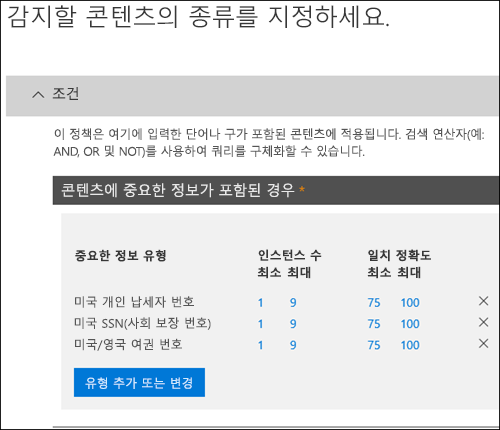
  
### <a name="auto-apply-labels-to-content-with-keywords-or-searchable-properties"></a><span data-ttu-id="098c2-268">키워드 또는 검색 가능 속성이 있는 콘텐츠에 레이블 자동 적용</span><span class="sxs-lookup"><span data-stu-id="098c2-268">Auto-apply labels to content with keywords or searchable properties</span></span>

<span data-ttu-id="098c2-p133">특정 조건을 충족하는 콘텐츠에 레이블을 자동으로 적용할 수 있습니다. 현재 사용 가능한 조건은 특정 단어, 구 또는 검색 가능 속성 값을 포함하는 콘텐츠에만 레이블을 적용하도록 지원합니다. AND, OR 및 NOT과 같은 검색 연산자를 사용하여 쿼리를 구체화할 수 있습니다.</span><span class="sxs-lookup"><span data-stu-id="098c2-p133">You can auto-apply labels to content that satisfies certain conditions. The conditions now available support applying a label to content that contains specific words, phrases, or values of searchable properties. You can refine your query by using search operators like AND, OR, and NOT.</span></span>

<span data-ttu-id="098c2-272">쿼리 구문에 대한 자세한 내용은 다음을 참조하세요.</span><span class="sxs-lookup"><span data-stu-id="098c2-272">For more information on query syntax, see:</span></span>

- [<span data-ttu-id="098c2-273">KQL(키워드 쿼리 언어) 구문 참조</span><span class="sxs-lookup"><span data-stu-id="098c2-273">Keyword Query Language (KQL) syntax reference</span></span>](https://docs.microsoft.com/ko-KR/sharepoint/dev/general-development/keyword-query-language-kql-syntax-reference)

<span data-ttu-id="098c2-p134">쿼리 기반 레이블은 검색 인덱스를 사용하여 콘텐츠를 식별합니다. 유효한 검색 가능 속성에 대한 자세한 내용은 다음을 참조하세요.</span><span class="sxs-lookup"><span data-stu-id="098c2-p134">Query-based labels use the search index to identify content. For more information on valid searchable properties, see:</span></span>

- [<span data-ttu-id="098c2-276">콘텐츠 검색에 대한 키워드 쿼리 및 검색 조건</span><span class="sxs-lookup"><span data-stu-id="098c2-276">Keyword queries and search conditions for Content Search</span></span>](keyword-queries-and-search-conditions.md)
- [<span data-ttu-id="098c2-277">SharePoint Server에서 크롤링 및 관리 속성의 개요</span><span class="sxs-lookup"><span data-stu-id="098c2-277">Overview of crawled and managed properties in SharePoint Server</span></span>](https://docs.microsoft.com/ko-KR/SharePoint/technical-reference/crawled-and-managed-properties-overview)

<span data-ttu-id="098c2-278">예제 쿼리:</span><span class="sxs-lookup"><span data-stu-id="098c2-278">Examples queries:</span></span>

- <span data-ttu-id="098c2-279">Exchange</span><span class="sxs-lookup"><span data-stu-id="098c2-279">Exchange</span></span>
    - <span data-ttu-id="098c2-280">subject:"Quarterly Financials"</span><span class="sxs-lookup"><span data-stu-id="098c2-280">subject:"Quarterly Financials"</span></span>
    - <span data-ttu-id="098c2-281">recipients:garthf<!--nolink-->@contoso.com</span><span class="sxs-lookup"><span data-stu-id="098c2-281">recipients:garthf<!--nolink-->@contoso.com</span></span>
- <span data-ttu-id="098c2-282">SharePoint 및 비즈니스용 OneDrive</span><span class="sxs-lookup"><span data-stu-id="098c2-282">SharePoint and OneDrive for Business</span></span>
    - <span data-ttu-id="098c2-283">contenttype:contract</span><span class="sxs-lookup"><span data-stu-id="098c2-283">contenttype:contract</span></span>
    - <span data-ttu-id="098c2-284">site:https<!--nolink-->://contoso.sharepoint.com/sites/teams/procurement AND contenttype:contract</span><span class="sxs-lookup"><span data-stu-id="098c2-284">site:https<!--nolink-->://contoso.sharepoint.com/sites/teams/procurement AND contenttype:contract</span></span>

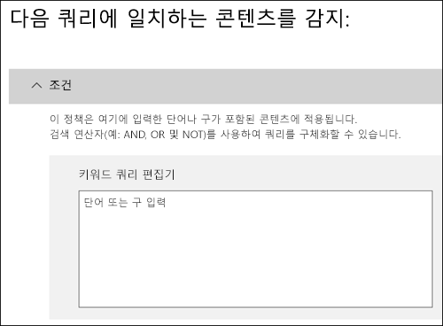

## <a name="applying-a-default-retention-label-to-all-content-in-a-sharepoint-library-folder-or-document-set"></a><span data-ttu-id="098c2-286">SharePoint 라이브러리, 폴더 또는 문서 집합의 모든 콘텐츠에 기본 보존 레이블 적용</span><span class="sxs-lookup"><span data-stu-id="098c2-286">Applying a default retention label to all content in a SharePoint library, folder, or document set</span></span>

<span data-ttu-id="098c2-287">사용자가 개별 문서에 보존 레이블을 적용할 수 있도록 하는 것 외에, SharePoint 라이브러리, 폴더 또는 문서 집합의 모든 문서에 기본 보존 레이블이 적용되도록 해당 위치에 기본 보존 레이블을 적용할 수도 있습니다.</span><span class="sxs-lookup"><span data-stu-id="098c2-287">In addition to enabling people to apply a retention label to individual documents, you can also apply a default retention label to a SharePoint library, folder, or document set, so that all documents in that location get the default retention label.</span></span>
  
<span data-ttu-id="098c2-p135">문서 라이브러리의 경우 이 작업은 문서 라이브러리에 대한 **라이브러리 설정** 페이지에서 수행됩니다. 기본 보존 레이블을 선택할 때 라이브러리의 모든 기존 항목에 적용되도록 선택할 수도 있습니다.</span><span class="sxs-lookup"><span data-stu-id="098c2-p135">For a document library, this is done on the **Library settings** page for a document library. When you choose the default retention label, you can also choose to apply it to any existing items in the library.</span></span> 
  
<span data-ttu-id="098c2-290">예를 들어 마케팅 자료에 대한 태그가 있고 특정 문서 라이브러리에 해당 유형의 콘텐츠만 포함된다는 것을 알 경우 마케팅 자료 태그를 해당 라이브러리의 모든 문서에 대한 기본 태그로 지정할 수 있습니다.</span><span class="sxs-lookup"><span data-stu-id="098c2-290">For example, if you have a tag for marketing materials, and you know a specific document library will contain only that type of content, you can make the Marketing Materials tag the default for all documents in that library.</span></span>
  
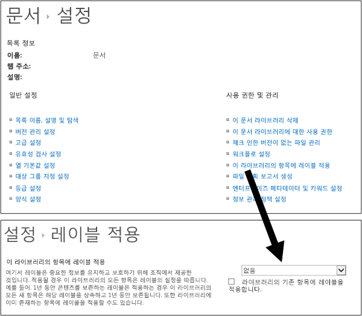
  
<span data-ttu-id="098c2-292">라이브러리, 폴더 또는 문서 집합의 기존 항목에 기본 보존 레이블을 적용하는 경우 다음 작업이 수행됩니다.</span><span class="sxs-lookup"><span data-stu-id="098c2-292">If you apply a default retention label to existing items in the library, folder, or document set:</span></span>
  
- <span data-ttu-id="098c2-p136">레이블이 명시적으로 적용된 항목을 **제외**하고 라이브러리, 폴더 또는 문서 집합의 모든 항목에는 자동으로 같은 보존 레이블이 지정됩니다. 명시적으로 보존 레이블이 지정된 항목은 기존 레이블이 유지됩니다. 자세한 내용은 아래에서 [T보존 원칙 또는 우선 순위](#the-principles-of-retention-or-what-takes-precedence)에 대한 섹션을 참조하세요.</span><span class="sxs-lookup"><span data-stu-id="098c2-p136">All items in the library, folder, or document set automatically get the same retention label, **except** for items that have had a retention label applied explicitly to them. Explicitly labeled items keep their existing label. For more information, see the below section on [The principles of retention, or what takes precedence?](#the-principles-of-retention-or-what-takes-precedence).</span></span>
    
- <span data-ttu-id="098c2-296">라이브러리, 폴더 또는 문서 집합의 기본 보존 레이블을 변경하거나 제거하는 경우 명시적 보존 레이블이 지정된 항목을 **제외**하고 라이브러리, 폴더 또는 문서 집합의 모든 항목에 대해서도 보존 레이블이 변경되거나 제거됩니다.</span><span class="sxs-lookup"><span data-stu-id="098c2-296">If you change or remove the default retention label for a library, folder, or document set, the retention label's also changed or removed for all items in the library, folder, or document set, **except** items with explicit retention labels.</span></span> 
    
- <span data-ttu-id="098c2-297">한 라이브러리, 폴더 또는 문서 집합에서 기본 보존 레이블이 있는 항목을 다른 라이브러리, 폴더 또는 문서 집합으로 이동하면 새 위치에 다른 기본 보존 레이블이 있더라도 해당 항목은 기존의 기본 보존 레이블을 유지합니다.</span><span class="sxs-lookup"><span data-stu-id="098c2-297">If you move an item with a default retention label from one library, folder, or document set to another library, folder, or document set, the item keeps its existing default retention label, even if the new location has a different default retention label.</span></span>
    
## <a name="applying-a-retention-label-to-email-by-using-rules"></a><span data-ttu-id="098c2-298">규칙을 사용하여 전자 메일에 보존 레이블 적용</span><span class="sxs-lookup"><span data-stu-id="098c2-298">Applying a retention label to email by using rules</span></span>

<span data-ttu-id="098c2-299">Outlook 2010 이상에서는 보존 레이블 또는 보존 정책을 적용하는 규칙을 만들 수 있습니다.</span><span class="sxs-lookup"><span data-stu-id="098c2-299">In Outlook 2010 or later, you can create rules to apply a retention label or retention policy.</span></span>
  
<span data-ttu-id="098c2-300">예를 들어, 특정 메일 그룹에서 보내고 받은 모든 메시지에 특정 보존 레이블을 적용하는 규칙을 만들 수 있습니다.</span><span class="sxs-lookup"><span data-stu-id="098c2-300">For example, you can create a rule that applies a specific retention label to all messages sent to or from a specific distribution group.</span></span>
  
<span data-ttu-id="098c2-301">규칙을 만들려면 마우스 오른쪽 단추로 항목 \> **규칙** \> **규칙 만들기** \> **고급 옵션** \> **규칙 마법사** \> **보존 정책 적용**을 클릭합니다.</span><span class="sxs-lookup"><span data-stu-id="098c2-301">To create a rule, right-click an item \> **Rules** \> **Create Rule** \> **Advanced Options** \> **Rules Wizard** \> **apply retention policy**.</span></span>
  
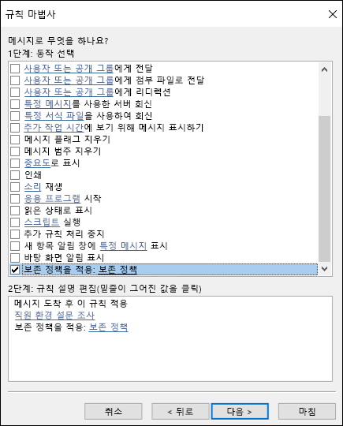
  
## <a name="classifying-content-without-applying-any-actions"></a><span data-ttu-id="098c2-303">작업을 적용하지 않고 콘텐츠 분류</span><span class="sxs-lookup"><span data-stu-id="098c2-303">Classifying content without applying any actions</span></span>

<span data-ttu-id="098c2-p137">보존 레이블을 만들 때 아래에 표시된 것처럼 보존이나 기타 작업을 설정하지 않고 그대로 만들 수 있습니다. 이 경우 작업을 적용하지 않고 보존 레이블을 단순히 텍스트 레이블로 사용할 수 있습니다.</span><span class="sxs-lookup"><span data-stu-id="098c2-p137">When you create a retention label, you can do so without turning on any retention or other actions, as shown below. In this case, you can use a retention label simply as a text label, without enforcing any actions.</span></span>
  
<span data-ttu-id="098c2-306">예를 들어, 작업 없이 “나중에 검토”라는 보존 레이블을 만든 다음, 해당 보존 레이블을 중요한 정보 유형을 갖는 콘텐츠 또는 쿼리된 콘텐츠에 자동으로 적용할 수 있습니다.</span><span class="sxs-lookup"><span data-stu-id="098c2-306">For example, you can create a retention label named "Review later" with no actions, and then auto-apply that retention label to content with sensitive information types or queried content.</span></span>
  
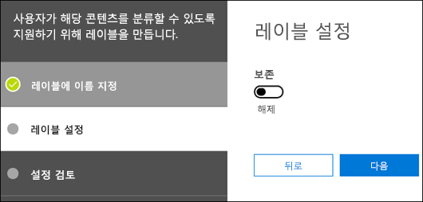
  
## <a name="using-retention-labels-for-records-management"></a><span data-ttu-id="098c2-308">기록 관리에 보존 레이블 사용</span><span class="sxs-lookup"><span data-stu-id="098c2-308">Using retention labels for records management</span></span>

<span data-ttu-id="098c2-309">높은 수준에서 기록 관리는 다음을 의미합니다.</span><span class="sxs-lookup"><span data-stu-id="098c2-309">At a high level, records management means that:</span></span>
  
- <span data-ttu-id="098c2-310">사용자는 중요한 콘텐츠를 기록으로 분류합니다.</span><span class="sxs-lookup"><span data-stu-id="098c2-310">Important content is classified as a record by users.</span></span>
    
- <span data-ttu-id="098c2-311">기록은 수정하거나 삭제할 수 없습니다.</span><span class="sxs-lookup"><span data-stu-id="098c2-311">A record can't be modified or deleted.</span></span>
    
- <span data-ttu-id="098c2-312">기록은 명시된 수명이 경과되면 최종적으로 폐기됩니다.</span><span class="sxs-lookup"><span data-stu-id="098c2-312">Records are finally disposed of after their stated lifetime is past.</span></span>
    
<span data-ttu-id="098c2-p138">기록 센터와 같은 기타 기록 관리 기능은 SharePoint 콘텐츠에만 적용되지만, 보존 레이블을 사용하면 Office 365에서 일관된 단일 기록 관리 전략을 구현할 수 있습니다. 또한 수명이 지나면 자동으로 폐기되도록 기록에 대해 보존 작업을 적용할 수 있습니다.</span><span class="sxs-lookup"><span data-stu-id="098c2-p138">You can use retention labels to implement a single, consistent records-management strategy across Office 365, whereas other records-management features such as the Record Center apply only to SharePoint content. And you can enforce retention actions on records, so that they're disposed of automatically at the end of their lifecycle.</span></span>
  
<span data-ttu-id="098c2-315">보존 레이블을 만들 때 보존 레이블을 사용하여 콘텐츠를 기록으로 분류하는 옵션이 제공됩니다.</span><span class="sxs-lookup"><span data-stu-id="098c2-315">When you create a retention label, you have the option to use the retention label to classify the content as a record.</span></span>
  
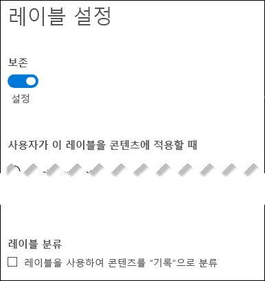
  
<span data-ttu-id="098c2-317">항목에 기록으로 레이블이 지정되면 다음 4가지 결과가 나타납니다.</span><span class="sxs-lookup"><span data-stu-id="098c2-317">When an item is labeled as a record, four things happen:</span></span>
  
- <span data-ttu-id="098c2-318">항목을 영구적으로 삭제할 수 없습니다.</span><span class="sxs-lookup"><span data-stu-id="098c2-318">The item can't be permanently deleted.</span></span>
    
- <span data-ttu-id="098c2-319">항목을 편집할 수 없습니다.</span><span class="sxs-lookup"><span data-stu-id="098c2-319">The item can't be edited.</span></span>
    
- <span data-ttu-id="098c2-320">레이블을 변경할 수 없습니다.</span><span class="sxs-lookup"><span data-stu-id="098c2-320">The label can't be changed.</span></span>
    
- <span data-ttu-id="098c2-321">레이블을 제거할 수 없습니다.</span><span class="sxs-lookup"><span data-stu-id="098c2-321">The label can't be removed.</span></span>
    
### <a name="who-can-classify-content-as-a-record"></a><span data-ttu-id="098c2-322">콘텐츠를 기록으로 분류할 수 있는 사람</span><span class="sxs-lookup"><span data-stu-id="098c2-322">Who can classify content as a record</span></span>

<span data-ttu-id="098c2-p139">SharePoint 콘텐츠의 경우 기본 구성원 그룹(참가 권한 수준)의 모든 사용자는 콘텐츠에 기록 레이블을 적용할 수 있습니다. 사이트 모음 관리자만 적용된 보존 레이블을 제거하거나 변경할 수 있습니다. 또한 콘텐츠를 기록으로 분류하는 보존 레이블은 [콘텐츠에 자동으로 적용](#auto-apply-retention-labels)할 수 있습니다.</span><span class="sxs-lookup"><span data-stu-id="098c2-p139">For SharePoint content, any user in the default Members group (the Contribute permission level) can apply a record label to content. Only the site collection administrator can remove or change that retention label after it's been applied. In addition, a retention label that classifies content as a record can be [auto-applied to content](#auto-apply-retention-labels).</span></span>
  
### <a name="records-and-folders"></a><span data-ttu-id="098c2-326">기록 및 폴더</span><span class="sxs-lookup"><span data-stu-id="098c2-326">Records and folders</span></span>

<span data-ttu-id="098c2-p140">Exchange, SharePoint 또는 OneDrive의 폴더에 보존 레이블을 적용할 수 있습니다. 폴더가 기록으로 레이블이 지정되고 항목을 해당 폴더로 이동하면 해당 항목도 기록으로 레이블이 지정됩니다. 항목을 해당 폴더 외부로 이동해도 계속 기록으로 레이블이 지정됩니다.</span><span class="sxs-lookup"><span data-stu-id="098c2-p140">You can apply a retention label to a folder in Exchange, SharePoint, or OneDrive. If a folder is labeled as a record, and you move an item into the folder, the item is labeled as a record. When you move the item out of the folder, the item will continue to be labeled as a record.</span></span>
  
### <a name="records-cant-be-deleted"></a><span data-ttu-id="098c2-330">기록을 삭제할 수 없음</span><span class="sxs-lookup"><span data-stu-id="098c2-330">Records can't be deleted</span></span>

<span data-ttu-id="098c2-331">Exchange에서 기록을 삭제하려고 하면 [보존 정책이 원본 위치의 콘텐츠에 작동하는 방식](retention-policies.md#how-a-retention-policy-works-with-content-in-place)에 설명된 것처럼 항목이 복구 가능한 항목 폴더로 이동됩니다.</span><span class="sxs-lookup"><span data-stu-id="098c2-331">If you attempt to delete a record in Exchange, the item is moved to the Recoverable Items folder as described in [How a retention policy works with content in place](retention-policies.md#how-a-retention-policy-works-with-content-in-place).</span></span>
  
<span data-ttu-id="098c2-332">SharePoint에서 기록을 삭제하려고 하면 항목이 삭제되지 않았다는 오류 메시지가 표시되고 항목은 라이브러리에 남아 있습니다.</span><span class="sxs-lookup"><span data-stu-id="098c2-332">If you attempt to delete a record in a SharePoint, you see an error that the item wasn't deleted, and the item remains in the library.</span></span>
  
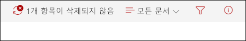
  
<span data-ttu-id="098c2-334">OneDrive에서 기록을 삭제하려고 하면 [보존 정책이 원본 위치의 콘텐츠에 작동하는 방식](retention-policies.md#how-a-retention-policy-works-with-content-in-place)에 설명된 것처럼 항목이 자료 보존 라이브러리로 이동됩니다.</span><span class="sxs-lookup"><span data-stu-id="098c2-334">If you attempt to delete a record in OneDrive, the item is moved to the Preservation Hold library as described in [How a retention policy works with content in place](retention-policies.md#how-a-retention-policy-works-with-content-in-place).</span></span>
  
## <a name="using-a-retention-label-as-a-condition-in-a-dlp-policy"></a><span data-ttu-id="098c2-335">보존 레이블을 DLP 정책의 조건으로 사용</span><span class="sxs-lookup"><span data-stu-id="098c2-335">Using a retention label as a condition in a DLP policy</span></span>

<span data-ttu-id="098c2-p141">보존 레이블은 콘텐츠에 보존 작업을 적용할 수 있습니다. 또한 보존 레이블을 DLP(데이터 손실 방지) 정책의 조건으로 사용할 수 있고, DLP 정책은 특정 레이블이 있는 콘텐츠에 대해 액세스 제한과 같은 기타 작업을 적용할 수 있습니다.</span><span class="sxs-lookup"><span data-stu-id="098c2-p141">A retention label can enforce retention actions on content. In addition, you can use a retention label as a condition in a data loss prevention (DLP) policy, and the DLP policy can enforce other actions, such as restricting access, on content that contains a specific label.</span></span> 
  
<span data-ttu-id="098c2-338">자세한 내용은 [레이블을 DLP 정책의 조건으로 사용](data-loss-prevention-policies.md#using-a-label-as-a-condition-in-a-dlp-policy)을 참조하세요.</span><span class="sxs-lookup"><span data-stu-id="098c2-338">For more information, see [Using a label as a condition in a DLP policy](data-loss-prevention-policies.md#using-a-label-as-a-condition-in-a-dlp-policy).</span></span>
  
## <a name="using-the-label-activity-explorer-and-the-data-governance-reports"></a><span data-ttu-id="098c2-339">레이블 활동 탐색기 및 데이터 거버넌스 보고서 사용</span><span class="sxs-lookup"><span data-stu-id="098c2-339">Using the Label Activity Explorer and the data governance reports</span></span>

<span data-ttu-id="098c2-p142">보존 레이블을 게시하거나 자동으로 적용한 후에 의도대로 콘텐츠에 적용되는지 확인할 수 있습니다. 보존 레이블을 모니터링하려면 다음을 사용할 수 있습니다.</span><span class="sxs-lookup"><span data-stu-id="098c2-p142">After you publish or auto-apply your retention labels, you'll want to verify that they're being applied to content as you intended. To monitor your retention labels, you can use the:</span></span>
  
- <span data-ttu-id="098c2-p143">**레이블 활동 탐색기**. 이 탐색기(아래 그림 참조)를 사용하면 지난 30일 동안 SharePoint 및 비즈니스용 OneDrive에서 사용된 모든 콘텐츠를 빠르게 검색하고 해당 보존 레이블 활동을 볼 수 있습니다. 자세한 내용은 [문서에 대한 레이블 활동 보기](view-label-activity-for-documents.md)를 참조하세요.</span><span class="sxs-lookup"><span data-stu-id="098c2-p143">**Label Activity Explorer**. With the explorer (shown below), you can quickly search and view retention label activity for all content across SharePoint and OneDrive for Business over the past 30 days. For more information, see [View label activity for documents](view-label-activity-for-documents.md).</span></span>
    
- <span data-ttu-id="098c2-p144">**데이터 거버넌스 보고서**. 이러한 보고서를 사용하면 지난 90일 동안 Exchange, SharePoint 및 비즈니스용 OneDrive에서 사용된 모든 콘텐츠에 대한 보존 레이블 추세 및 활동을 빠르게 확인할 수 있습니다. 자세한 내용은 [데이터 거버넌스 보고서 보기](view-the-data-governance-reports.md)를 참조하세요.</span><span class="sxs-lookup"><span data-stu-id="098c2-p144">**Data governance reports**. With these reports, you can quickly view retention label trends and activity for all content across Exchange, SharePoint, and OneDrive for Business over the past 90 days. For more information, see [View the data governance reports](view-the-data-governance-reports.md).</span></span>
    
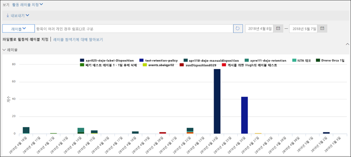
  
## <a name="using-content-search-to-find-all-content-with-a-specific-retention-label-applied-to-it"></a><span data-ttu-id="098c2-349">콘텐츠 검색을 사용하여 특정 보존 레이블이 적용된 모든 콘텐츠 찾기</span><span class="sxs-lookup"><span data-stu-id="098c2-349">Using Content Search to find all content with a specific retention label applied to it</span></span>

<span data-ttu-id="098c2-350">사용자가 콘텐츠에 보존 레이블을 할당하거나 레이블이 자동 적용된 후에 보안 및 준수 센터의 콘텐츠 검색을 사용하여 특정 보존 레이블로 분류된 모든 콘텐츠를 찾을 수 있습니다.</span><span class="sxs-lookup"><span data-stu-id="098c2-350">After retention labels are assigned to content, either by users or auto-applied, you can use content search in the Security &amp; Compliance Center to find all content that's classified with a specific retention label.</span></span>
  
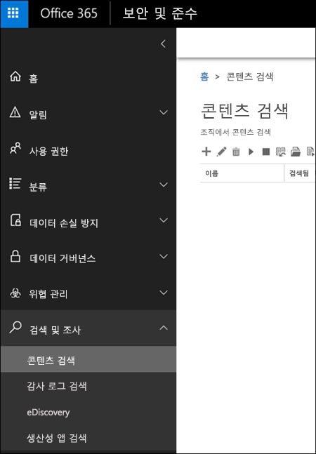
  
<span data-ttu-id="098c2-p145">콘텐츠 검색을 만들 때 **준수 태그** 조건을 선택한 후 전체 레이블 이름 또는 레이블 이름 일부를 입력하고 와일드카드를 사용합니다. 자세한 내용은 [콘텐츠 검색에 대한 키워드 쿼리 및 검색 조건](keyword-queries-and-search-conditions.md)을 참조하세요.</span><span class="sxs-lookup"><span data-stu-id="098c2-p145">When you create a content search, choose the **Compliance Tag** condition, and then enter the complete label name or part of the label name and use a wildcard. For more information, see [Keyword queries and search conditions for Content Search](keyword-queries-and-search-conditions.md).</span></span>
  
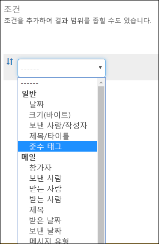
  
## <a name="the-principles-of-retention-or-what-takes-precedence"></a><span data-ttu-id="098c2-355">보존 원칙 또는 우선 순위</span><span class="sxs-lookup"><span data-stu-id="098c2-355">The principles of retention, or what takes precedence?</span></span>

<span data-ttu-id="098c2-p146">콘텐츠에 각기 다른 작업(보존, 삭제 또는 둘 다) 및 보존 기간을 지정하는 여러 보존 정책이 적용될 수 있습니다. 우선 순위는 어떨까요? 분명한 것은 가장 높은 수준에서 한 정책을 통해 보존되는 콘텐츠가 다른 정책에 의해 영구적으로 삭제될 수 없다는 것입니다.</span><span class="sxs-lookup"><span data-stu-id="098c2-p146">It's possible or even likely that content might have several retention policies applied to it, each with a different action (retain, delete, or both) and retention period. What takes precedence? At the highest level, rest assured that content being retained by one policy can't be permanently deleted by another policy.</span></span>
  
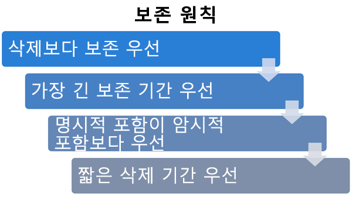
  
<span data-ttu-id="098c2-360">보존 작업이 있는 여러 다른 레이블이 콘텐츠에 적용되는 방식을 이해하려면 다음과 같은 보존 원칙에 유의합니다.</span><span class="sxs-lookup"><span data-stu-id="098c2-360">To understand how different labels with retention actions are applied to content, keep these principles of retention in mind:</span></span>
  
1. <span data-ttu-id="098c2-p147">**보존이 삭제보다 우선합니다.** 한 보존 정책은 3년 후에 Exchange 전자 메일을 삭제하도록 지정하지만 다른 보존 정책은 5년 동안 Exchange 전자 메일을 보존했다가 삭제하도록 지정하는 경우를 가정해보세요. 3년에 도달한 모든 콘텐츠는 삭제되고 사용자가 볼 수 없게 숨겨지지만, 5년에 도달할 때까지 복구 가능한 항목 폴더에 보존되었다가 영구적으로 삭제됩니다.</span><span class="sxs-lookup"><span data-stu-id="098c2-p147">**Retention wins over deletion.** Suppose that one retention policy says to delete Exchange email after three years, but another retention policy says to retain Exchange email for five years and then delete it. Any content that reaches three years old will be deleted and hidden from the users' view, but still retained in the Recoverable Items folder until the content reaches five years old, when it will be permanently deleted.</span></span> 
    
2. <span data-ttu-id="098c2-p148">**가장 긴 보존 기간이 우선합니다.** 콘텐츠에 여러 콘텐츠 보존 정책이 적용되는 경우 가장 긴 보존 기간이 끝날 때까지 보존됩니다.</span><span class="sxs-lookup"><span data-stu-id="098c2-p148">**The longest retention period wins.** If content's subject to multiple policies that retain content, it will be retained until the end of the longest retention period.</span></span> 
    
3. <span data-ttu-id="098c2-p149">**명시적 포함이 암시적 포함보다 우선합니다.** 이것은 다음을 의미합니다.</span><span class="sxs-lookup"><span data-stu-id="098c2-p149">**Explicit inclusion wins over implicit inclusion.** This means:</span></span> 
    
    1. <span data-ttu-id="098c2-p150">사용자가 보존 설정이 포함된 보존 레이블을 Exchange 전자 메일 또는 OneDrive 문서와 같은 항목에 수동으로 할당하면 해당 보존 레이블은 사이트 또는 사서함 수준에서 할당된 정책과 문서 라이브러리에 의해 할당된 기본 보존 레이블보다 우선적으로 적용됩니다. 예를 들어, 명시적 보존 레이블에 10년 동안 보존하도록 지정되어 있지만 사이트에 할당된 보존 정책은 5년만 보존하도록 지정하는 경우 보존 레이블이 우선합니다. 자동 적용 보존 레이블은 Office 365에 의해 자동으로 적용되므로 명시적이 아니라 암시적으로 간주됩니다.</span><span class="sxs-lookup"><span data-stu-id="098c2-p150">If a retention label with retention settings is manually assigned by a user to an item, such as an Exchange email or OneDrive document, that retention label takes precedence over both a policy assigned at the site or mailbox level and a default retention label assigned by the document library. For example, if the explicit retention label says to retain for ten years, but the retention policy assigned to the site says to retain for only five years, the retention label takes precedence. Note that auto-apply retention labels are considered implicit, not explicit, because they're applied automatically by Office 365.</span></span>
    
    2. <span data-ttu-id="098c2-371">보존 정책에 특정 사용자의 사서함 또는 OneDrive용 비즈니스 계정과 같은 특정 위치가 포함되는 경우 해당 정책이 모든 사용자의 사서함 또는 비즈니스용 OneDrive 계정에 적용되지만 해당 사용자의 사서함을 특별히 포함하지 않는 다른 보존 정책보다 우선합니다.</span><span class="sxs-lookup"><span data-stu-id="098c2-371">If a retention policy includes a specific location, such as a specific user's mailbox or OneDrive for Business account, that policy takes precedence over another retention policy that applies to all users' mailboxes or OneDrive for Business accounts but doesn't specifically include that user's mailbox.</span></span>
    
4. <span data-ttu-id="098c2-p151">**가장 짧은 삭제 기간이 우선적으로 적용됩니다.** 마찬가지로 콘텐츠에 여러 콘텐츠 삭제 정책이 적용되는 경우(보존 없음) 가장 짧은 보존 기간이 끝나면 삭제됩니다.</span><span class="sxs-lookup"><span data-stu-id="098c2-p151">**The shortest deletion period wins.** Similarly, if content's subject to multiple policies that delete content (with no retention), it will be deleted at the end of the shortest retention period.</span></span> 
    
<span data-ttu-id="098c2-374">보존 원칙은 위에서 아래로 균형을 깨는 흐름처럼 작동한다는 점을 이해하도록 합니다. 모든 정책 또는 레이블에 의해 적용되는 규칙이 하나의 수준에서 동일한 경우 규칙이 적용되는 우선 순위를 결정하기 위해 흐름은 아래의 다음 수준으로 이동합니다.</span><span class="sxs-lookup"><span data-stu-id="098c2-374">Understand that the principles of retention work as a tie-breaking flow from top to bottom: If the rules applied by all policies or labels are the same at one level, the flow moves down to the next level to determine precedence for which rule is applied.</span></span>
  
<span data-ttu-id="098c2-p152">마지막으로, 보존 정책 또는 레이블은 eDiscovery 보류 상태인 콘텐츠를 영구적으로 삭제할 수 없습니다. 보류가 해제되면 다시 위에 설명된 정리 프로세스가 해당 콘텐츠에 적용됩니다.</span><span class="sxs-lookup"><span data-stu-id="098c2-p152">Finally, a retention policy or label cannot permanently delete any content that's on hold for eDiscovery. When the hold is released, the content again becomes eligible for the cleanup process described above.</span></span>
  
## <a name="use-retention-labels-instead-of-these-features"></a><span data-ttu-id="098c2-377">이러한 기능 대신 보존 레이블 사용</span><span class="sxs-lookup"><span data-stu-id="098c2-377">Use retention labels instead of these features</span></span>

<span data-ttu-id="098c2-p153">보존 레이블은 Exchange, SharePoint, OneDrive 및 Office 365 그룹을 포함하여 Office 365의 전체 조직 및 해당 콘텐츠에서 쉽게 사용할 수 있습니다. Office 365의 임의 위치에서 콘텐츠를 분류하거나 기록을 관리해야 하는 경우 보존 레이블을 사용하는 것이 좋습니다.</span><span class="sxs-lookup"><span data-stu-id="098c2-p153">Retention labels can easily be made available to an entire organization and its content across Office 365, including Exchange, SharePoint, OneDrive, and Office 365 groups. If you need to classify content or manage records anywhere in Office 365, we recommend that you use retention labels.</span></span>
  
<span data-ttu-id="098c2-p154">이전에 Office 365에서 콘텐츠를 분류하거나 기록을 관리하는 데 사용했던 여러 다른 기능이 있습니다. 이러한 기능은 아래에 나와 있습니다. 이러한 기능은 보안 및 준수 센터에서 만든 보존 레이블과 계속 함께 사용할 수 있습니다. 보존 레이블 구현이 이전 기능과 다른 경우가 있지만 Office 365에서 향후 기록을 관리할 수 있도록 보존 레이블 기능이 계속 개선될 것입니다. 따라서 앞으로도 데이터 거버넌스를 위해 이러한 기능 대신 보존 레이블을 사용하는 것이 좋습니다.</span><span class="sxs-lookup"><span data-stu-id="098c2-p154">There are several other features that have previously been used to classify content or manage records in Office 365. These are listed below. These features will continue to work side by side with retention labels created in the Security &amp; Compliance Center. Note that while there are instances where the implementation of retention labels differs from previous features, the evolution of retention labels will drive the future of records management across Office 365. Therefore, moving forward, for data governance, we recommend that you use retention labels instead of these features.</span></span>
  
### <a name="exchange-online"></a><span data-ttu-id="098c2-385">Exchange Online</span><span class="sxs-lookup"><span data-stu-id="098c2-385">Exchange Online</span></span>

- <span data-ttu-id="098c2-386">[보존 태그 및 보존 정책](https://go.microsoft.com/fwlink/?linkid=846125)[[MRM(메시징 기록 관리)라고도 함]](https://go.microsoft.com/fwlink/?linkid=846126)(삭제만 해당)</span><span class="sxs-lookup"><span data-stu-id="098c2-386">[Retention tags and retention policies](https://go.microsoft.com/fwlink/?linkid=846125), also known as [messaging records management (MRM)](https://go.microsoft.com/fwlink/?linkid=846126) (Deletion only)</span></span> 
    
### <a name="sharepoint-online-and-onedrive-for-business"></a><span data-ttu-id="098c2-387">SharePoint Online 및 비즈니스용 OneDrive</span><span class="sxs-lookup"><span data-stu-id="098c2-387">SharePoint Online and OneDrive for Business</span></span>

- <span data-ttu-id="098c2-388">[ 현재 위치 기록 관리 구성](https://support.office.com/article/7707a878-780c-4be6-9cb0-9718ecde050a)(보존)</span><span class="sxs-lookup"><span data-stu-id="098c2-388">[Configuring in place records management](https://support.office.com/article/7707a878-780c-4be6-9cb0-9718ecde050a) (Retention)</span></span> 
    
- <span data-ttu-id="098c2-389">[기록 센터 소개](https://support.office.com/article/bae6ca5a-7b19-40e0-b433-e3613a747c2c) (보존)</span><span class="sxs-lookup"><span data-stu-id="098c2-389">[Introduction to the Records Center](https://support.office.com/article/bae6ca5a-7b19-40e0-b433-e3613a747c2c) (Retention)</span></span> 
    
- <span data-ttu-id="098c2-390">[정보 관리 정책](intro-to-info-mgmt-policies.md)(삭제만 해당)</span><span class="sxs-lookup"><span data-stu-id="098c2-390">[Information management policies](intro-to-info-mgmt-policies.md) (Deletion only)</span></span> 
    
## <a name="permissions"></a><span data-ttu-id="098c2-391">사용 권한</span><span class="sxs-lookup"><span data-stu-id="098c2-391">Permissions</span></span>

<span data-ttu-id="098c2-p155">보존 레이블을 만드는 규정 준수 팀의 구성원에게는 보안 및 준수 센터에 대한 권한이 필요합니다. 기본적으로 테넌트 관리자는 이 위치에 액세스할 수 있으며, 준수 관리자 및 기타 사용자에게 테넌트 관리를 위한 모든 권한을 부여하지는 않으면서, 보안 및 준수 센터에 대한 액세스 권한을 부여할 수 있습니다. 이렇게 하기 위해 보안 및 준수 센터의 **권한** 페이지로 이동한 후 **준수 관리자** 역할 그룹을 편집하고 해당 역할 그룹에 구성원을 추가하는 것이 좋습니다.</span><span class="sxs-lookup"><span data-stu-id="098c2-p155">Members of your compliance team who will create retention labels need permissions to the Security &amp; Compliance Center. By default, your tenant admin will have access to this location and can give compliance officers and other people access to the Security &amp; Compliance Center, without giving them all of the permissions of a tenant admin. To do this, we recommend that you go to the **Permissions** page of the Security &amp; Compliance Center, edit the **Compliance Administrator** role group, and add members to that role group.</span></span> 
  
<span data-ttu-id="098c2-394">자세한 내용은 [사용자에게 Office 365 보안 및 준수 센터에 대한 액세스 권한 부여](grant-access-to-the-security-and-compliance-center.md)를 참조하세요.</span><span class="sxs-lookup"><span data-stu-id="098c2-394">For more information, see [Give users access to the Office 365 Security &amp; Compliance Center](grant-access-to-the-security-and-compliance-center.md).</span></span>
  
<span data-ttu-id="098c2-p156">이러한 정책은 보존 레이블 및 레이블 정책을 만들고 적용하는 데만 필요합니다. 정책 적용을 위해서는 콘텐츠에 액세스하지 않아도 됩니다.</span><span class="sxs-lookup"><span data-stu-id="098c2-p156">These permissions are required only to create and apply retention labels and a label policy. Policy enforcement does not require access to the content.</span></span>
  
## <a name="find-the-powershell-cmdlets-for-labels"></a><span data-ttu-id="098c2-397">레이블에 대한 PowerShell cmdlet 찾기</span><span class="sxs-lookup"><span data-stu-id="098c2-397">Find the PowerShell cmdlets for labels</span></span>

<span data-ttu-id="098c2-398">레이블 cmdlet을 사용하려면 다음 작업을 수행해야 합니다.</span><span class="sxs-lookup"><span data-stu-id="098c2-398">To use the label cmdlets, you need to:</span></span>
  
1. [<span data-ttu-id="098c2-399">Office 365 보안 및 준수 센터 PowerShell에 연결</span><span class="sxs-lookup"><span data-stu-id="098c2-399">Connect to the Office 365 Security & Compliance Center Powershell</span></span>](https://docs.microsoft.com/powershell/exchange/office-365-scc/connect-to-scc-powershell/connect-to-scc-powershell)
    
2. <span data-ttu-id="098c2-400">다음 Office 365 보안 및 준수 센터 cmdlet 사용:</span><span class="sxs-lookup"><span data-stu-id="098c2-400">Use these Office 365 Security & Compliance Center cmdlets:</span></span>

  - [<span data-ttu-id="098c2-401">Get-ComplianceTag</span><span class="sxs-lookup"><span data-stu-id="098c2-401">Get-ComplianceTag</span></span>](https://docs.microsoft.com/powershell/module/exchange/policy-and-compliance-retention/get-compliancetag)

  - [<span data-ttu-id="098c2-402">New-ComplianceTag</span><span class="sxs-lookup"><span data-stu-id="098c2-402">New-ComplianceTag</span></span>](https://docs.microsoft.com/powershell/module/exchange/policy-and-compliance-retention/new-compliancetag)

  - [<span data-ttu-id="098c2-403">Remove-ComplianceTag</span><span class="sxs-lookup"><span data-stu-id="098c2-403">Remove-ComplianceTag</span></span>](https://docs.microsoft.com/powershell/module/exchange/policy-and-compliance-retention/remove-compliancetag)

  - [<span data-ttu-id="098c2-404">Set-ComplianceTag</span><span class="sxs-lookup"><span data-stu-id="098c2-404">Set-ComplianceTag</span></span>](https://docs.microsoft.com/powershell/module/exchange/policy-and-compliance-retention/set-compliancetag)

  - [<span data-ttu-id="098c2-405">Enable-ComplianceTagStorage</span><span class="sxs-lookup"><span data-stu-id="098c2-405">Enable-ComplianceTagStorage</span></span>](https://docs.microsoft.com/powershell/module/exchange/policy-and-compliance-retention/enable-compliancetagstorage)

  - [<span data-ttu-id="098c2-406">Get-ComplianceTagStorage</span><span class="sxs-lookup"><span data-stu-id="098c2-406">Get-ComplianceTagStorage</span></span>](https://docs.microsoft.com/powershell/module/exchange/policy-and-compliance-retention/get-compliancetagstorage)

  - [<span data-ttu-id="098c2-407">Get-RetentionCompliancePolicy</span><span class="sxs-lookup"><span data-stu-id="098c2-407">Get-RetentionCompliancePolicy</span></span>](https://docs.microsoft.com/powershell/module/exchange/policy-and-compliance-retention/get-retentioncompliancepolicy)

  - [<span data-ttu-id="098c2-408">New-RetentionCompliancePolicy</span><span class="sxs-lookup"><span data-stu-id="098c2-408">New-RetentionCompliancePolicy</span></span>](https://docs.microsoft.com/powershell/module/exchange/policy-and-compliance-retention/new-retentioncompliancepolicy)

  - [<span data-ttu-id="098c2-409">Remove-RetentionCompliancePolicy</span><span class="sxs-lookup"><span data-stu-id="098c2-409">Remove-RetentionCompliancePolicy</span></span>](https://docs.microsoft.com/powershell/module/exchange/policy-and-compliance-retention/remove-retentioncompliancepolicy)

  - [<span data-ttu-id="098c2-410">Set-RetentionCompliancePolicy</span><span class="sxs-lookup"><span data-stu-id="098c2-410">Set-RetentionCompliancePolicy</span></span>](https://docs.microsoft.com/powershell/module/exchange/policy-and-compliance-retention/set-retentioncompliancepolicy)

  - [<span data-ttu-id="098c2-411">Get-RetentionComplianceRule</span><span class="sxs-lookup"><span data-stu-id="098c2-411">Get-RetentionComplianceRule</span></span>](https://docs.microsoft.com/powershell/module/exchange/policy-and-compliance-retention/get-retentioncompliancerule)

  - [<span data-ttu-id="098c2-412">New-RetentionComplianceRule</span><span class="sxs-lookup"><span data-stu-id="098c2-412">New-RetentionComplianceRule</span></span>](https://docs.microsoft.com/powershell/module/exchange/policy-and-compliance-retention/new-retentioncompliancerule)

  - [<span data-ttu-id="098c2-413">Remove-RetentionComplianceRule</span><span class="sxs-lookup"><span data-stu-id="098c2-413">Remove-RetentionComplianceRule</span></span>](https://docs.microsoft.com/powershell/module/exchange/policy-and-compliance-retention/remove-retentioncompliancerule)

  - [<span data-ttu-id="098c2-414">Set-RetentionComplianceRule</span><span class="sxs-lookup"><span data-stu-id="098c2-414">Set-RetentionComplianceRule</span></span>](https://docs.microsoft.com/powershell/module/exchange/policy-and-compliance-retention/set-retentioncompliancerule)

## <a name="more-information"></a><span data-ttu-id="098c2-415">추가 정보</span><span class="sxs-lookup"><span data-stu-id="098c2-415">More information</span></span>

[<span data-ttu-id="098c2-416">보존 정책 개요</span><span class="sxs-lookup"><span data-stu-id="098c2-416">Overview of retention policies</span></span>](retention-policies.md)
