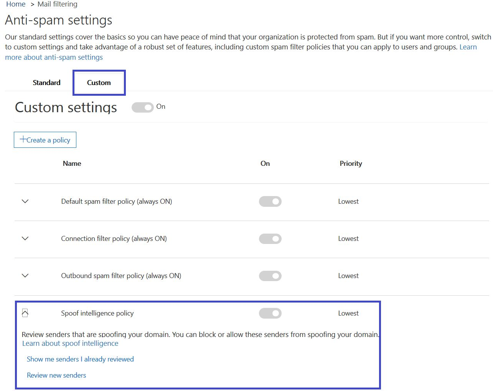

# 스푸핑 인텔리전스에 대해 자세히 알아보기

보안에서 스푸핑 인텔리전스를 사용 하 여 &amp; 는 조직에 속한 두 도메인 스푸핑 또는 외부 도메인은 스푸핑가 모든 보낸 사람의 검토할 **스팸 방지 설정 페이지** 에서 준수 센터입니다. 스푸핑 인텔리전스는 Office 365 엔터프라이즈 e 5의 일부로 또는 개별적으로 일부 고급 위협 보호 (ATP) 및 2018 Exchange Online Protection (EOP) 년 10 월 기준으로 사용할 수 있습니다. 
  
## 어떤 종류의 전자 메일 스푸핑 I를 검토할 수는 해야 합니까를 보호 하 고 스푸핑 정보를 바탕으로?

도메인에 대 한 사용자가 담당을 검토할 수 있습니다 보낸 사람의 도메인 스푸핑는 하 고 계속 하거나 보낸 사람이 차단할 보낸 사람이 허용을 선택 합니다. 외부 도메인에 대 한 있지만 개별 보내는 전자 메일 주소가 아닌 함께 보내는 인프라를 사용 하 여 보낸 사람이 도메인을 허용할 수 있습니다.
  
보낸 전자 메일 주소를 스푸핑, 하나 이상의 사용자 계정 내 조직의 도메인 또는 조직에 보낼 외부 도메인 중 하나를 대신 하 여 메일을 보낼 수를 표시 합니다. 놀랍게도 스푸핑 일부 적법 한 비즈니스 이유가 있습니다. 예의 경우 이러한 스푸핑 도메인에서 보낸 편리할 차단 합니다.
  
- 도메인을 사용 하 여 회사 설문 조사에 대 한 직접 직원에 게 대량 메일을 보낼 제 3 자가 발신자 해야 합니다.
    
- 생성 하 고 사용자를 대신 하 여 광고 또는 제품 업데이트를 보내 외부 회사를 고용 했습니다.
    
- 비서가 정기적으로 조직 내에서 다른 사람에 대 한 전자 메일을 보낼 수 있어야 합니다.
    
- 전자 메일로 자체 조직 내부 알림 보내기 하기 위해 스푸핑할 하도록 구성 된 응용 프로그램입니다.
    
자주 외부 도메인은 위장 된 전자 메일을 보내고 이러한 이유 중 상당수는 합법적인 합니다. 예, 외부 보낸 사람이 위장 된 전자 메일을 보낼 때 일부 합법적인 경우 사항은 다음과 같습니다.
  
- 토론 메일 그룹에 보낸 사람이 및 메일 그룹에서 메일 그룹에 모든 참가자에 게는 원래 보낸 전자 메일을 릴레이 됩니다.
    
- 외부 회사 다른 회사 (예: 자동화 된 보고서를 또는 소프트웨어--a-서비스로 회사)를 대신 하 여 전자 메일을 발송 됩니다.
    
Office 365 또는 외부 전자 메일 시스템에서 스팸 필터에서 합법적인 spoofers 보낸 메일 발견 가져올 하지 확인 방법을 지정 해야 합니다. 일반적으로 Office 365에서 스팸으로 이러한 전자 메일 메시지를 처리 합니다. 보안에서 스푸핑 필터를 설정 하 여 이러한 문제를 방지 하는 기능 해야 Office 365 관리자, &amp; 준수 센터입니다. 도메인을 소유 하는 경우에 이러한 거부를 허용 하도록 SPF, DKIM, 및 DMARC를 구성할 수 있습니다.
  
반면에 악의적인 spoofers, 도메인 또는 스팸 또는 피싱 전자 메일을 보낼 외부 도메인 스푸핑는 이러한 보낸사람 차단 해야 합니다. 사용자 자격 증명을 가져올 피셔에 대 한 일반적인 방법은 이기도 스푸핑 합니다. Office 365에 기본 제공 스푸핑 보호를 이용 좀더 쉽게 이러한 악의적인 전자 메일의 보낸사람 으로부터 조직에 있습니다. 스푸핑 보호 조직의 도메인에 대 한는 항상 모든 Office 365 고객에 대 한 사용 되며 외부 도메인 스푸핑 보호 기본적으로 켜져 위협 보호 고급 고객을 위한 및 년 10 월 2018 EOP 기준으로 고객도 있습니다. 이 보호를 추가로 강화 알려주세요는 보낸사람 스푸핑할 조직의 도메인 및 사용자를 대신 하 여 전자 메일 보내기 권한이 있는 및 스푸핑 하는 모든 외부 도메인은 허용 하는 경우. 권한을 부여 하지는 사용자가 보낸 보낸 모든 전자 메일 스팸 또는 Office 365에서 스푸핑으로 처리 됩니다. 도메인 스푸핑 보낸사람에 유의 하 고 보안을 사용 하 여 스푸핑 인텔리전스를 개선 하는 데 도움이 &amp; 준수 센터입니다.
  
## 보안에서 스푸핑 인텔리전스 관리 &amp; 준수 센터

Office 365에서 설정한 스푸핑 인텔리전스 정책 적용 항상 됩니다. 비활성화할 수 없습니다 하지만 적극적으로 관리 하려는 얼마나 선택할 수 있습니다.
  
도메인 또는 외부 도메인 스푸핑는 다음 각 보낸 보안을 사용 하 여 이렇게 할 수 있는지 여부를 결정 하며 보낸 사람이 검토할 수 &amp; 준수 센터입니다. 도메인 또는 외부 도메인에서 보낸 사람이 스푸핑 하는 각 위장 된 사용자 계정에 대해 다음 표에 정보를 볼 수 있습니다.
  
|**매개 변수**|**설명**|
|:-----|:-----|
|Sender    |True 이면 보낸 사람이 라고도합니다. 일반적으로 스푸핑 전자 메일의 원본 도메인입니다. Office 365 조직 스푸핑는 보내는 IP 주소의 DNS (PTR) 레코드 포인터의 도메인을 결정 합니다. 도메인이 없는 발견 되는 경우 보고서를 표시 하는 보낸 사람의 IP 주소 대신 합니다.    |
|위장 된 사용자    |보낸 사람이 침입 되 고 되는 사용자 계정입니다.    **내부** 탭에만 해당 합니다. 이 필드는 단일 전자 메일 주소를 포함 하거나 보낸 사람이 여러 사용자 계정을 스푸핑은, 하는 경우 **둘 이상**포함 합니다.  **외부** 탭에만 해당 합니다. 만 외부 도메인은 보내는 도메인을 포함 하 고 전체 전자 메일 주소를 포함 하지 않습니다.  > [!TIP]> **관리자의 고급.** 위장 된 사용자가 보낸 메일 클라이언트에 의해 보낸사람 주소도 표시 되는 주소 이기도 (5322.From) 주소입니다. 이 방법을 header.from 주소를 라고도 합니다. SPF 하 여이 주소의이 유효성 검사 되지 않습니다.           |
|메시지의 수    |지난 30 일 내에서 식별 된 위장 된 보낸 사람이 나 보낸사람을 대신 하 여 조직에는 보낸 사람이 보낸 메일 메시지의 수입니다.    |
|사용자 불만 사항 수    |지난 30 일 내에 사용자가이 보낸사람에 대 한 사용자가 정리 불만 합니다. 불만는 일반적으로 Microsoft에 대 한 정크 메일 전송의 형태로입니다.    |
|인증 결과    |이 경우 값이 **전달 되는** 보낸 검사를 통과 Exchange Online Protection (EOP) 보낸 인증, 예: SPF 또는 **실패** DKIM 보낸 실패 한 경우 EOP 보낸 인증 확인 또는 **알 수 없는** 이러한 검사의 결과 없는 경우 알 수 있습니다.    |
|으로 설정 하는 의사 결정    |Office 365 관리자 또는 스푸핑 인텔리전스 정책 결정 보낸 사람이 사용자를 스푸핑할를 허용 여부 여부를 표시 합니다.    |
|마지막으로 본    |메시지를 받은이 보낸 사람이이 위장 된 사용자를 대신 하 여 마지막 날짜입니다.    |
|스푸핑할 수 있습니까?    | 이 보낸 사람이 위장 된 사용자를 대신 하 여 전자 메일을 보내도록 허용 여부를 표시 합니다. 가능한 값은 다음과 같습니다.  **예** 이 스푸핑 사람이 보낸 모든 위장 된 주소를 스푸핑할 조직 허용 됩니다.    **아니요** 이 스푸핑 보낸 위장 된 주소는 조직 스푸핑할 허용 되지 않습니다. 대신 Office 365에서이 사람이 보낸 메시지를에서 스팸으로 표시 됩니다.  **일부 사용자** 보낸 사람이 여러 사용자를 스푸핑은, 하는 경우이 주소에서이 보내는 일부 위장 된 주소 할 수 있는 조직 스푸핑할 나머지 스팸으로 표시 됩니다. **자세히** 탭을 사용 하 여 특정 주소를 볼 수 있습니다.  |
|스푸핑 유형    |이 값은 **내부** 도메인을 사용 하면 조직의 프로 비전 된 도메인 중 하나가 하는 경우, 속성 값은 **외부**그렇지 않습니다.    |
   
 **보안을 사용 하 여 도메인을 스푸핑는 발신자를 관리 하려면 &amp; 준수 센터**
  
1. 이동 하는 [보안 &amp; 준수 센터](https://protection.office.com)합니다.
    
2. 작업이 나 교육용 계정으로 Office 365에 로그인 합니다. 사용자 계정에는 Office 365 조직에서 관리자 자격 증명이 있어야 합니다.
    
3. 보안에서 &amp; 준수 센터 **위협 관리** 확장 하 고 \> **정책** \> **스팸 방지**합니다.
  

  
4. 오른쪽 창에서 **스팸 방지 설정** 페이지에서 **사용자 지정** 탭을 선택 하 고 아래로 스크롤하여 및 **스푸핑 인텔리전스 정책**을 확장 합니다. 
  

  
5. 보낸 사람이 도메인 스푸핑의 목록을 보려면 **검토 새 보낸사람** 을 선택 하 고 선택은 * * Your 도메인 * * 탭 합니다. 
    
    보낸사람을 이미 검토 했을 때 하 고 이전 선택 사항 중 일부를 변경 하려는 경우 선택할 수 있습니다 **표시 나에 게 보낸 I 이미 검토** 대신. 두 경우 모두 다음 창이 표시 됩니다. 
  

  
위장 된 각 사용자는 허용 하거나 차단할 각 사용자를 개별적으로 스푸핑에서 보낸 것인지를 선택할 수 있도록 별도 행에 표시 됩니다.
  
보낸 사용자에 대 한 허용 목록에 추가할 **스푸핑할 허용 됨** 열에서 **예** 를 선택 합니다. 보낸 사용자에 대 한 차단 목록에 추가 하려면 **아니요**를 선택 합니다.
  
도메인에 대 한 정책을 설정 하려면 소유 하지 않은 **외부 도메인은** 탭을 선택 열으로 변경 보낸사람 **예** 를 **스푸핑할 수 있는** 인증 되지 않은 전자 메일을 보낼 조직에는 보낸사람을 허용 하도록 합니다. 또는 생각 되 면 Office 365에서 보낸 위장 된 전자 메일을 보낼 수 있도록 허용 실수가, **스푸핑할에 허용 된** 열을 **No**로 변경 합니다. 
  

  
6. 변경 내용을 저장 하려면 **저장** 을 선택 합니다. 

E 5 또는 ATP 고객 인 경우 보낸 사람의 [스푸핑 인텔리전스 견해](https://docs.microsoft.com/en-us/office365/securitycompliance/walkthrough-spoof-intelligence-insight) 를 통해 도메인 스푸핑는 관리할 수 있습니다.
    
## 스푸핑 방지 정책 구성

허용 또는 조직에 위장 된 전자 메일을 발송에서 특정 보낸 사람이 차단, 외에 추가로 구성할 수도 있습니다는 필터를 제거 하려면 원하는 방법을 엄격 하 게, 스푸핑 메시지를 찾을 때 수행할 동작을 여부와 그에 대 한 안전 팁을 사용 하도록 설정 하려면 스푸핑 방지 합니다.
  
스푸핑 방지 보호는 Office 365 조직의 외부에 있는 도메인에서 보낸에서 전자 메일에 적용 됩니다. 받는 사람 사서함 Office 365 Enterprise E5, 고급 위협 보호에 대 한 및 년 10 월, 년 일 이후로 사용 허가 된도 2018 EOP 고객에 게 정책을 적용할 수 있습니다. 다른 피싱 방지 설정 함께 스푸핑 방지 정책을 관리합니다. 피싱 방지 설정에 대 한 자세한 내용은 [Office 365 피싱 방지 정책 설정](https://support.office.com/article/set-up-office-365-atp-anti-phishing-policies-5a6f2d7f-d998-4f31-b4f5-f7cbf6f38578?ui=en-US&amp;rs=en-US&amp;ad=US#phishpolicyoptions)을 참조 하십시오.
  
Office 365 항상 실행 되는 기본 스푸핑 방지 보호를 포함 합니다. 이 기본 보호 보안에서 표시 되지 않으면 &amp; 준수 센터 또는 Windows PowerShell cmdlet을 통해 검색할 수 있습니다. 기본 스푸핑 방지 보호 기능을 수정할 수 없습니다. 대신 Office 365에서 만든 각 피싱 방지 정책 스푸핑 방지 보호 기능을 적용 하는 방법을 엄격 하 게 구성할 수 있습니다. 
  
스푸핑 방지 정책 보안에서 피싱 방지 정책 아래에 표시 하는 경우에 &amp; 준수 센터 상속 되지 않습니다의 기본 동작 설정 스팸 방지 구성에서 기존 피싱으로부터 합니다. **스팸 방지** 아래 설정을 사용 하는 경우 \> 스푸핑 방지에 대 한 복제 하려는 **피싱** 해야하는 피싱 방지 정책을 만든 다음 스푸핑 부분으로 스푸핑 설정을 반영 하기 위해 피싱 방지 정책 편집 백그라운드에서 실행 되는 기본 설정을 수락 하는 것이 아니라 다음 섹션에서 설명한 것입니다. 
  
 **보안을 사용 하 여 피싱 방지 정책 내에서 스푸핑 방지 보호를 구성 하려면 &amp; 준수 센터**
  
1. 이동 하는 [보안 &amp; 준수 센터](https://protection.office.com)합니다.
    
2. 작업이 나 교육용 계정으로 Office 365에 로그인 합니다. 사용자 계정에는 Office 365 조직에서 관리자 자격 증명이 있어야 합니다.
    
3. 보안에서 &amp; 준수 센터 **위협 관리** 확장 하 고 \> **정책** \> **피싱 방지**합니다. 
    
4. 오른쪽 창에서 **피싱 방지** 페이지에서 구성 하려는 피싱 방지 정책을 선택 합니다. 
    
5. **스푸핑** 행에 표시 되는 페이지에서 **편집**을 선택 합니다. 
    
6. 메시지 도메인간 스푸핑으로 감지 될 때 수행할 작업을 다음으로 구성 합니다. 기본 동작은 메시지 받는 사람의 정크 메일 폴더로 이동 하는 것입니다. 다른 옵션은 격리로 메시지를 보내려고 합니다. 격리로 전송 하는 메시지를 관리 하는 방법에 대 한 자세한 내용은 [Office 365에서 전자 메일 메시지를 격리를](quarantine-email-messages.md)참조 하십시오.
  
(
  
7. 안전 팁 스푸핑 방지를 사용 하지 않도록 설정 하거나 사용 여부를 선택 합니다. Office 365에 해당 id를 확인할 수 있는 보낸 사람이 보낸와 상호작용 하는 자신이 때 사용자에 게 경고 하기 위해 **인증에 실패 하면** 안전 팁을 사용 하도록 설정 하는 것이 좋습니다. Office 365도 권장 안전 팁을 사용 하도록 설정의 사용자를 더 작은 그룹에 대 한는 **인증 소프트 암호** 에 대 한 사용자 많은 합법적인, 하지만 인증 되지 않은 원본에서 전자 메일을 수신 하는 경우이 안전 팁 경고 많은 생성할 수 있기 때문에 합니다. 
  

  
사용자가 선택한을 확인 하 고 **저장**을 선택 합니다. 
    
## 스푸핑 및 피싱 Office 365를 관리 하는 다른 방법

스푸핑 및 피싱 방지 하는 방법에 대 한 정확한 수 있습니다. 여기서 관련 가지 방법으로 도메인 스푸핑 보낸사람에서 확인 하 고 조직을 손상 시 키 지 방지할 수 있습니다.
  
- 사용자 루틴의 일부로 Exchange Online Protection 스푸핑 메일 보고서를 확인 합니다. 빈도를 확인 하 고 위장 된 보낸사람을 관리 하는 데 도움이이 보고서를 사용할 수 있습니다. 내용은 [맬웨어, 스팸 및 규칙 감지 하는 방법에 대 한 데이터를 보려면 Office 365의 메일 보호 보고서를 사용 하 여에서](https://technet.microsoft.com/library/dn500744%28v=exchg.150%29.aspx)에서 **스푸핑 메일 보고서** 참조 하십시오.
    
- 고급 Office 365 관리자의 경우:
    
  - 보낸 사람이 정책 프레임 워크 (SPF) 구성을 검토 합니다. SPF를 신속 하 게 구성 된 것을 간략하게 소개 합니다 [스푸핑을 방지 하기 위해 Office 365에서 SPF 설정](https://technet.microsoft.com/library/dn789058%28v=exchg.150%29.aspx)을 참조 하십시오. Office 365 SPF를 사용 하는 방법에 대 한 더 자세히 이해 또는 하이브리드 배포와 같은 문제해결 또는 비표준 배포에 대 한 [스푸핑을 방지 하기 위해 보낸 사람이 정책 프레임 워크 (SPF)을 사용 하 여 Office 365 방식](https://technet.microsoft.com/library/mt712724%28v=exchg.150%29.aspx)으로 시작 합니다.
    
  - DomainKeys 식별 된 메일 (DKIM) 구성을 검토 합니다. 도메인에서 들어오는 처럼 보이게 하는 메시지를 보내지 못하도록 spoofers를 방지 하려면 SPF 및 DMARC 외에도 DKIM를 사용 해야 합니다. DKIM은 메시지 헤더에 전자 메일 메시지에 디지털 서명을 추가할 수 있습니다. 내용은 [Office 365에서 도메인에서 보낸 아웃 바운드 전자 메일의 유효성을 검사를 사용 하 여 DKIM](https://technet.microsoft.com/library/mt695945%28v=exchg.150%29.aspx)를 참조 하십시오.
    
  - 도메인 기반 메시지 인증, 보고 및 적합성 (DMARC) 구성을 검토 합니다. SPF 및 DKIM DMARC 구현 스푸핑 및 피싱 전자 메일에 대 한 추가 보호를 제공 합니다. 받는 메일 시스템 메시지와 함께 수행할 작업을 결정 하는 DMARC 도움이 실패 SPF 또는 DKIM 확인 하 여 도메인에서 보낸 합니다. 내용은 [Office 365의 전자 메일의 유효성을 검사를 사용 하 여 DMARC](https://technet.microsoft.com/library/mt734386%28v=exchg.150%29.aspx)를 참조 하십시오.
    
  - [Get PhishFilterPolicy](https://technet.microsoft.com/en-us/library/mt735158%28v=exchg.160%29.aspx) Windows PowerShell cmdlet을 사용 하 여 위장 된 보낸사람에 자세한 데이터를 수집 생성을 허용 하 고 목록, 차단 하는 데 도움이 하지 않고도 더 포괄적인 SPF, DKIM, 및 DMARC DNS 레코드를 생성 하는 방법을 결정 하면 합법적인 전자 메일 가져오기 외부 스팸 필터에서 발견 되었습니다. 자세한 내용은 [Office 365에서 antispoofing 보호의 작동 방식](https://blogs.msdn.microsoft.com/tzink/2016/02/23/how-antispoofing-protection-works-in-office-365/)을 참조 하십시오.
    

