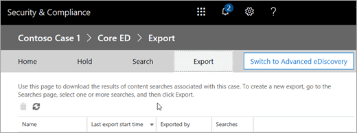

# <a name="manage-ediscovery-cases-in-the-security--compliance-center"></a>보안 및 준수 센터에서 eDiscovery 사례 관리

보안 & 준수 센터에서 eDiscovery 사례를 사용 하 여 조직에서 eDiscovery 사례를 만들고, 액세스 하 고, 관리할 수 있는 사람을 제어할 수 있습니다. 조직에 Office 365 E5 구독이 있는 경우 eDiscovery 사례를 사용 하 여 Office 365 Advanced eDiscovery를 사용 하 여 검색 결과를 분석할 수도 있습니다.
  
eDiscovery 사례를 사용하여 사례에 구성원을 추가하고, 특정 사례 구성원이 수행할 수 있는 작업 유형을 제어하고, 법률 사례와 관련된 콘텐츠 위치를 보류 상태로 지정하고, 여러 콘텐츠 검색을 단일 사례에 연결할 수 있습니다. 사례와 연결 된 콘텐츠 검색의 결과를 내보내거나 고급 eDiscovery에서 분석을 위한 검색 결과를 준비할 수도 있습니다. eDiscovery 사례는 조직의 특정 법률 소송에 대한 콘텐츠 검색 및 검색 결과에 액세스할 수 있는 사용자를 제한하는 좋은 방법입니다.
  
다음 워크플로를 사용 하 여 보안 & 준수 센터 및 고급 eDiscovery에서 eDiscovery 사례를 설정 하 고 사용 합니다.
  
[Step 1: Assign eDiscovery permissions to potential case members](manage-ediscovery-cases.md#step1_1)
  
[2 단계: 새 사례 만들기](manage-ediscovery-cases.md#step2_1)
  
[3 단계: 사례에 구성원 추가](manage-ediscovery-cases.md#step2a_1)
  
[4 단계: 콘텐츠 위치를 보류에 배치](manage-ediscovery-cases.md#step3_1)
  
[5 단계: 사례와 연결 된 콘텐츠 검색 만들기 및 실행](manage-ediscovery-cases.md#step4_1)
  
[6 단계: 사례와 연결 된 콘텐츠 검색 결과 내보내기](manage-ediscovery-cases.md#step5_1)
  
[7 단계: 고급 eDiscovery에 대 한 검색 결과 준비](manage-ediscovery-cases.md#step7_1)
  
[8 단계: Advanced eDiscovery의 사례로 이동](manage-ediscovery-cases.md#gotoAeD_1)
  
[반드시 9 단계: 사례 닫기](manage-ediscovery-cases.md#closecase_1)
  
[반드시 10 단계: 닫힌 사례 다시 열기](manage-ediscovery-cases.md#reopencase_1)
  
[추가 정보](manage-ediscovery-cases.md#moreinfo_1)
  
## <a name="step-1-assign-ediscovery-permissions-to-potential-case-members"></a>1단계: 잠재적인 사례 구성원에게 eDiscovery 권한 할당
<a name="step1_1"> </a>

첫 번째 단계는 사용자에 게 적절 한 eDiscovery 관련 사용 권한을 할당 하 여 2 단계에서 eDiscovery 사례에 추가할 수 있도록 하는 것입니다. EDiscovery 권한을 할당 하려면 Security & 준수 센터에서 조직 관리 역할 그룹의 구성원 이거나 역할 관리 역할을 할당 받아야 합니다. 다음 목록에서는 보안 & 준수 센터의 eDiscovery 관련 역할 그룹에 대해 설명 합니다.
  
- **검토자** 이 역할 그룹은 가장 제한적인 eDiscovery 관련 사용 권한을 가집니다. 이 그룹의 구성원은 보안 & 준수 센터에서 해당 구성원 인 **eDiscovery** 페이지의 사례 목록만 보고 열 수 있습니다. 사례를 만들고, 사례에 구성원을 추가 하 고, 보류를 만들거나, 검색을 생성 하거나, search results를 내보내거나, 고급 eDiscovery를 위해 결과를 준비할 수는 없습니다. 그러나 구성원은 고급 eDiscovery의 사례에 액세스 하 여 분석 작업을 수행할 수 있습니다. 
    
- **EDiscovery 관리자** 이 역할 그룹의 구성원은 eDiscovery 사례를 만들고 관리할 수 있습니다. 구성원을 추가 및 제거 하 고, 콘텐츠 위치를 보류 상태로 설정 하 고, 사례와 연결 된 콘텐츠 검색을 만들고 편집 하 고, 콘텐츠 검색 결과를 내보내고, 고급 eDiscovery에서 분석을 위한 검색 결과를 준비할 수 있습니다. 이 역할 그룹에 두 개의 하위 그룹이 있습니다. 이러한 하위 그룹 간의 차이는 범위를 기준으로 합니다.
    
  - **EDiscovery 관리자** 자신이 만들거나 구성원 인 eDiscovery 사례를 보고 관리할 수 있습니다. 다른 eDiscovery 관리자가 사례를 만들었지만 두 번째 eDiscovery 관리자를 해당 사례 구성원으로 추가 하지 않는 경우 두 번째 eDiscovery 관리자가 Security & 준수 센터의 **ediscovery** 페이지에서 사례를 보거나 열 수 없습니다. eDiscovery 관리자는 고급 eDiscovery의 사례에 액세스 하 여 분석 작업을 수행할 수도 있습니다. 
    
  - **EDiscovery 관리자** EDiscovery 관리자가 수행할 수 있는 모든 사례 관리 작업을 수행할 수 있습니다. 또한 eDiscovery 관리자(Administrator)는 다음과 같은 작업을 수행할 수 있습니다.
    
  - **eDiscovery** 페이지에 나열된 모든 사례를 봅니다. 
    
  - 조직의 모든 eDiscovery 사례를 사례 구성원으로 추가한 후이를 관리 합니다.
    
  - 고급 eDiscovery에서 분석을 위한 사례 데이터 처리, 사례 설정 구성 및 고급 eDiscovery에서 데이터 내보내기와 같은 관리 작업을 수행 합니다. 이는 보안 & 준수 센터의 eDiscovery 관리자 인 사용자가 고급 eDiscovery 관리자에 게 자동으로 추가 되기 때문입니다.
    
    사용자가 조직에서 eDiscovery 관리자가 되려고 하는 이유에 자세한 내용은 [More information](manage-ediscovery-cases.md#moreinfo_1)를 참조하세요. 
    
> [!IMPORTANT]
> 사용자가 이러한 eDiscovery 관련 역할 그룹 중 하나의 구성원이 아니거나 검토자 역할이 할당 된 역할 그룹의 구성원이 아닌 경우 eDiscovery 사례의 구성원으로 추가할 수 없습니다. 
  
 **eDiscovery 권한을 할당하려면**
  
1. [https://protection.office.com](https://protection.office.com)으로 이동합니다.
    
2. 회사 또는 학교 계정을 사용하여 Office 365에 로그인합니다.
    
3. 보안 & 준수 센터에서 **사용 권한을**클릭 하 고 할당 하려는 eDiscovery 권한에 따라 다음 중 하나를 수행 합니다.
    
  - 검토자 권한을 할당 하려면 **검토자** 역할 그룹을 선택 하 고 **구성원** 옆의 **편집**을 클릭 합니다. **구성원 선택을**클릭 하 고  **추가** 를 클릭 한 다음 검토자 역할 그룹에 추가할 사용자를 선택 하 고 **추가**를 클릭 합니다.
    
  - EDiscovery 관리자 권한을 할당 하려면 **Ediscovery 관리자** 역할 그룹을 선택한 다음 **ediscovery 관리자**옆에 있는 **편집**을 클릭 합니다. **Ediscovery 관리자 선택을**클릭 하 고  추가 * * 추가 * *를 클릭 하 고 eDiscovery 관리자로 추가할 사용자를 선택한 다음 **추가**를 클릭 합니다.
    
  - EDiscovery 관리자 권한을 할당 하려면 **Ediscovery 관리자** 역할 그룹을 선택한 다음 **ediscovery 관리자**옆에 있는 **편집**을 클릭 합니다. **Ediscovery 관리자 선택을**클릭 하 고  **추가**를 클릭 한 다음, ediscovery 관리자로 추가할 사용자를 선택 하 고 **추가**를 클릭 합니다.
    
4. 모든 사용자를 추가한 후에는 **완료**를 클릭 하 고 **저장** 을 클릭 하 여 역할 그룹에 대 한 변경 내용을 저장 한 다음 **닫기를**클릭 합니다.
    

  
## <a name="step-2-create-a-new-case"></a>2 단계: 새 사례 만들기
<a name="step2_1"> </a>

다음 단계에서는 새 eDiscovery 사례를 만듭니다. eDiscovery 사례를 만들려면 eDiscovery 관리자(Manager) 역할 그룹의 구성원이어야 합니다. 앞에서 설명한 것 처럼 Security & 준수 센터에서 새 사례를 만든 후에는 조직에서 Office 365 E5 구독을 사용 하는 경우에도 고급 eDiscovery에서 동일한 사례에 액세스할 수 있습니다.
  
1. [https://protection.office.com](https://protection.office.com)으로 이동합니다.
    
2. 회사 또는 학교 계정을 사용하여 Office 365에 로그인합니다.
    
3. 보안 & 준수 센터에서 **ediscovery** \> **ediscovery**를 클릭 한 다음 추가 아이콘  **만들기를**클릭 합니다.
    
4. **새 사례** 페이지에서 사례 이름을 지정 하 고, 선택적 설명을 입력 한 다음 **저장**을 클릭 합니다. 사례 이름은 조직 내에서 고유 해야 합니다.
    
    
  
    새 사례가 **eDiscovery** 페이지의 사례 목록에 표시 됩니다. 케이스의 상태 ( **활성** 또는 **닫힘**), 사례에 대 한 설명 (이전 단계에서 만들어짐), 사례를 마지막으로 변경 하는 시기 등을 포함 하 여 케이스에 대 한 정보를 표시 하려면 커서를 사례 이름 위에 가리킵니다. 누가 변경 했습니다.
    
    > [!TIP]
    > 새 사례를 만든 후에는 언제 든 지 이름을 바꿀 수 있습니다. **EDiscovery** 페이지에서 사례 이름을 클릭 하면 됩니다. **이 사례** 플라이 아웃 관리 페이지에서 **이름**아래의 상자에 표시 되는 이름을 변경 하 고 변경 내용을 저장 합니다. 
  
## <a name="step-3-add-members-to-a-case"></a>3 단계: 사례에 구성원 추가
<a name="step2a_1"> </a>

새 사례를 만든 후 다음 단계에서는 사례에 구성원을 추가 합니다. 앞에서 설명한 것 처럼 검토자 또는 eDiscovery 관리자 역할 그룹의 구성원 인 사용자만 사례 구성원으로 추가할 수 있습니다. 사례를 만든 eDiscovery 관리자는 구성원으로 자동 추가 됩니다.
  
1. 보안 & 준수 센터에서 **ediscovery** \> **ediscovery** 를 클릭 하 여 조직의 사례 목록을 표시 합니다. 
    
2. 구성원을 추가 하려는 사례 이름을 클릭 합니다.
    
    **이 사례** 플라이 아웃 관리 페이지가 표시 됩니다. 
    
    
  
3. **구성원 관리**에서 add Icon  **추가** 를 클릭 하 여 서비스 케이스에 구성원을 추가 합니다. 
    
4. 사례 구성원으로 추가할 수 있는 사용자 목록에서 사례에 추가할 사용자의 이름 옆에 있는 확인란을 클릭 합니다.
    
    > [!TIP]
    > 구성원으로 추가할 수 있는 사용자 목록이 많은 경우에는 **검색** 상자를 사용 하 여 목록에서 특정 사용자를 검색 합니다. 
  
5. 그룹의 구성원으로 추가할 사용자를 선택한 후 **추가**를 클릭 합니다.
    
    **이 사례 관리**에서 **저장** 을 클릭 하 여 사례 구성원의 새 목록을 저장 합니다. 
    
6. **저장** 을 클릭 하 여 사례 구성원의 새 목록을 저장 합니다. 
  
## <a name="step-4-place-content-locations-on-hold"></a>4 단계: 콘텐츠 위치를 보류에 배치
<a name="step3_1"> </a>

eDiscovery 사례를 사용하여 보류를 만든 후에 사례와 관련된 콘텐츠를 보존할 수 있습니다. 대/소문자를 custodians 하는 사용자의 사서함 및 비즈니스용 OneDrive 사이트에 대해 보류를 배치할 수 있습니다. 또한 Office 365 그룹의 그룹 사서함, SharePoint 사이트 및 비즈니스용 OneDrive 사이트에 보류할 수 있습니다. 마찬가지로 Microsoft 팀과 연결 된 사서함 및 사이트를 유지할 수 있습니다. 콘텐츠 위치를 보존 상태로 설정 하는 경우 콘텐츠 위치에서 보류를 제거 하거나 보류를 삭제할 때까지 콘텐츠가 보관 됩니다.
  
보류를 만들 때 지정 된 콘텐츠 위치에 보관 되는 콘텐츠의 범위를 지정할 수 있는 옵션은 다음과 같습니다.
  
- 모든 콘텐츠가 보류 되는 영구 보존을 만듭니다. 또는 검색 쿼리와 일치 하는 콘텐츠만 보존 되는 쿼리 기반 보류를 만들 수 있습니다.
    
- 해당 날짜 범위 내에서 전송, 수신 또는 만든 콘텐츠만 저장 하는 날짜 범위를 지정할 수 있습니다. 또는 보내기, 수신 또는 만든 시기에 관계 없이 모든 콘텐츠를 저장할 수 있습니다.
    
> [!NOTE]
> 조직의 모든 eDiscovery 사례에 대해 최대 1만 개의 보존 정책을 사용할 수 있습니다. 
  
EDiscovery 사례에 대 한 보류를 만들려면
  
1. 보안 & 준수 센터에서 **ediscovery** \> **ediscovery** 를 클릭 하 여 조직의 사례 목록을 표시 합니다. 
    
2. 보류를 만들려는 사례 옆에 있는 **열기** 를 클릭 합니다. 
    
3. 사례에 대 한 **홈** 페이지에서 **대기**를 클릭 합니다.
    
    
  
4. **보류** 페이지에서 **새**추가를 클릭 합니다.
    
5. **새 보류 만들기** 페이지에서 보류에 이름을 지정합니다. 보류 이름은 조직에서 고유해야 합니다. 
    
6. 보류 상태로 설정할 콘텐츠 위치를 선택 합니다. 사서함, 사이트 및 공용 폴더를 보류에 배치할 수 있습니다.
    
    
  
1. **사서함** 추가 아이콘](media/ITPro-EAC-AddIcon.gif) 추가를 클릭 하 여 보류 상태로 유지할 사서함을 지정 합니다. ****![ 검색 상자를 사용 하 여 사용자 사서함과 메일 그룹 (그룹 구성원의 사서함을 보류)을 보류 상태로 설정 합니다. Office 365 그룹 또는 Microsoft 팀에 대 한 연결 된 사서함을 보류할 수도 있습니다. 
    
    > [!NOTE]
    > 추가 아이콘](media/ITPro-EAC-AddIcon.gif) **추가**을 클릭 합니다. 
  
2. **사이트** 추가 아이콘](media/ITPro-EAC-AddIcon.gif) 추가를 클릭 하 여 SharePoint 및 비즈니스용 OneDrive 사이트를 보류 하도록 지정 합니다. **** 섹션을 참조 하세요. 
    
    > [!NOTE]
    > 드문 경우 이지만 사용자의 UPN (사용자 계정 이름)이 변경 되는 경우에는 해당 OneDrive 계정에 대 한 URL도 새 UPN을 통합 하도록 변경 됩니다. 이 경우에는 사용자의 새 OneDrive URL을 추가 하 고 이전 항목을 제거 하 여 보류를 수정 해야 합니다. 
  
3. **공용 폴더** **모든 공용 폴더 유지** 를 클릭 하 여 Exchange Online 조직의 모든 공용 폴더를 보류 합니다. 특정 공용 폴더를 선택 하 여 보류 상태로 설정할 수는 없습니다. 공용 폴더를 보존 하지 않으려는 경우에는 **공용 폴더 포함 안 함** 옵션을 선택 된 상태로 유지 합니다. 
    
7. 보류에 콘텐츠 위치를 모두 추가한 후에 **다음**을 클릭 합니다.
    
8. 조건을 사용 하 여 쿼리 기반 보존을 만들려면 다음을 완료 합니다. 그렇지 않으면 **마침을** 클릭 하 여 모든 콘텐츠를 포함 합니다. 
    
    
  
    검색 쿼리를 만들고 조건을 사용 하는 방법에 대 한 자세한 내용은 [키워드 쿼리 및 검색 조건을](keyword-queries-and-search-conditions.md)참조 하십시오.
    
1. **무엇을 확인**하 시겠습니까? 상자에 검색 조건을 충족 하는 콘텐츠만 저장 되도록 상자에 검색 쿼리를 입력 합니다. 키워드, 메시지 속성 또는 문서 속성 (예: 파일 이름)을 지정할 수 있습니다. **AND**, **OR**, **NOT**등의 부울 연산자를 사용 하 여 보다 복잡 한 쿼리를 사용할 수도 있습니다. 키워드 상자를 비워 두면 지정 된 콘텐츠 위치에 있는 모든 콘텐츠가 보류 상태가 됩니다. 
    
2. **조건**에서 조건 **추가** 를 클릭 하 여 보류에 대 한 검색 쿼리 범위를 좁히는 조건을 하나 이상 추가 합니다. 각 조건은 보류를 만들 때 만들어지고 실행 되는 KQL 검색 쿼리에 절을 추가 합니다. 예를 들어 날짜 범위를 지정 하 여 원거리 시간 내에 만들어진 전자 메일 또는 사이트 문서를 보류할 수 있습니다. 조건은 **AND** 연산자를 사용하여 키워드 쿼리(키워드 상자에 지정)에 논리적으로 연결됩니다. 즉, 항목이 유지 되도록 키워드 쿼리와 조건을 모두 충족 해야 합니다. 
    
9. 쿼리 기반 보존을 구성한 후 **마침을** 클릭 하 여 보류를 만듭니다. 
  
### <a name="hold-statistics"></a>보류 통계

잠시 후 새로 보존에 대 한 정보는 선택 된 보류에 대 한 **보류** 페이지의 세부 정보 창에 표시 됩니다. 이 정보에는 보류 중인 사서함 및 사이트의 수와 보류 중인 항목의 총 수와 크기, 보류 통계가 계산 된 마지막 시간 등이 포함 됩니다. 이러한 보존 통계를 통해 eDiscovery 사례와 관련 된 콘텐츠의 양에 대 한 정보를 확인할 수 있습니다. 
  

  
보류 통계에 대해서는 다음 사항을 염두에 두어야 합니다.
  
- 보류 중인 총 항목 수는 보류 된 모든 콘텐츠 원본의 항목 수를 나타냅니다. 쿼리 기반 보존을 만든 경우이 통계는 쿼리와 일치 하는 항목의 수를 나타냅니다.
    
- 보류 중인 항목 수에는 콘텐츠 위치에 있는 인덱싱되지 않은 항목도 포함 됩니다. 쿼리 기반 보존을 만드는 경우에는 콘텐츠 위치에 있는 모든 인덱싱되지 않은 항목이 보류에 저장 됩니다. 여기에는 날짜 범위 조건 외부에 있을 수 있는 쿼리 기반 보류 및 인덱싱되지 않은 항목의 검색 조건과 일치 하지 않는 인덱싱되지 않은 항목이 포함 됩니다. 이는 검색 쿼리와 일치 하지 않거나 날짜 범위에서 제외 된 인덱싱되지 않은 항목이 검색 결과에 포함 되지 않는 콘텐츠 검색을 실행할 때 일어나는 것과는 다릅니다. 인덱싱되지 않은 항목에 대 한 자세한 내용은 [Office 365의 콘텐츠 검색에서 인덱싱되지 않은 항목](partially-indexed-items-in-content-search.md)을 참조 하세요.
    
- **통계 업데이트** 를 클릭 하 여 보류 중인 항목 수를 계산 하는 검색 예측을 다시 실행 하 여 최신 보존 통계를 가져올 수 있습니다. 필요한 경우 도구 모음에서 새로 고침](media/O365-MDM-Policy-RefreshIcon.gif) **새로 고침**![아이콘을 클릭 하 여 세부 정보 창에서 보류 통계를 업데이트 합니다. 
    
- 사서함 이나 사이트가 보류 중인 사용자가 새 전자 메일 메시지를 보내거나 받고 새 SharePoint 및 비즈니스용 OneDrive 문서를 만드는 경우에는 보존 되는 항목의 수가 시간에 따라 증가 합니다.
  
## <a name="step-5-create-and-run-a-content-search-associated-with-a-case"></a>5 단계: 사례와 연결 된 콘텐츠 검색 만들기 및 실행
<a name="step4_1"> </a>

eDiscovery 사례를 만들고 사례와 연결된 관리자를 보류 상태로 지정한 후에는 사례와 연결된 하나 이상의 콘텐츠 검색을 만들고 실행할 수 있습니다. 사례와 연결 된 콘텐츠 검색은 보안 & 준수 센터의 **검색** 페이지에 표시 되지 않습니다. 즉, 사례와 연결된 콘텐츠 검색은 eDiscovery 관리자 역할 그룹의 구성원이기도 한 사례 구성원만 액세스할 수 있습니다. 
  
1. 보안 & 준수 센터에서 **ediscovery** \> **ediscovery** 를 클릭 하 여 조직의 사례 목록을 표시 합니다. 
    
2. 콘텐츠 검색을 만들려는 사례 옆에 있는 **열기** 를 클릭 합니다. 
    
3. 사례에 대 한 **홈** 페이지에서 **검색**을 클릭 합니다.
    
    
  
4. **검색** 페이지에서 **새**추가를 클릭 합니다.
    
5. **새 검색** 페이지에서 검색의 이름을 입력 합니다. 사례와 연결 된 콘텐츠 검색은 Office 365 조직 내에서 고유한 이름을 가져야 합니다. 
    
6. 검색 하려는 콘텐츠 위치를 선택 합니다. 같은 검색에서 사서함, 사이트 및 공용 폴더를 검색할 수 있습니다.
    
    
  
1. **모든 사례 콘텐츠** 사례에서 보류 된 모든 콘텐츠 위치를 검색 하려면이 옵션을 선택 합니다. 사례에 여러 보류가 포함 되어 있는 경우이 옵션을 선택 하면 모든 보류의 콘텐츠 위치가 검색 됩니다. 또한 콘텐츠 위치가 쿼리 기반 유지로 설정 된 경우에는이 단계에서 만드는 콘텐츠 검색을 실행할 때 보류 중인 항목만 검색 됩니다. 예를 들어 특정 날짜 이전에 보내거나 만든 항목을 보존 하는 쿼리 기반 사례 보류에 사용자를 추가한 경우 콘텐츠 검색의 검색 조건을 사용 하 여 해당 항목만 검색 됩니다. 이 작업은 사례 보류 쿼리와 콘텐츠 검색 쿼리를 **and** 연산자로 연결 하 여 수행 됩니다. 사례 콘텐츠를 검색 하는 방법에 대 한 자세한 내용은이 문서 끝부분의 [추가 정보](manage-ediscovery-cases.md#moreinfo_1) 섹션을 참조 하십시오. 
    
2. **모든 범위에서 검색** 조직의 모든 콘텐츠 위치를 검색 하려면이 옵션을 선택 합니다. 이 옵션을 선택 하면 모든 Office 365 그룹 및 Microsoft 팀의 사서함을 포함 하는 모든 Exchange 사서함, 모든 SharePoint 및 비즈니스용 OneDrive 사이트 (모든 Office 365 그룹 및 Microsoft의 사이트 포함)를 검색 하도록 선택할 수 있습니다. 팀) 및 모든 공용 폴더
    
3. **사용자 지정 위치 선택** 검색 하려는 사서함 및 사이트를 선택 하려면이 옵션을 선택 합니다. 이 옵션을 선택 하면 사서함 및 사이트 목록이 사례 내에서 보류 상태로 유지 되는 콘텐츠 위치로 미리 채워집니다. 조직의 모든 공용 폴더를 검색 하도록 선택할 수도 있습니다.
    
    
  
    그러나이 옵션을 선택 하 고 보류 중인 모든 콘텐츠 위치를 검색 하는 경우 쿼리 기반 사례 보류의 쿼리는 검색 쿼리에 적용 되지 않습니다. 즉, 쿼리 기반 사례 보류에 의해 보존 되는 콘텐츠 뿐 아니라 위치에 있는 모든 콘텐츠가 검색 됩니다.
    
    미리 채워진 사례 콘텐츠 위치를 제거 하거나 새를 추가할 수 있습니다. 이 옵션을 선택 하면 모든 Exchange 사서함을 검색 하는 등 특정 서비스에 대 한 모든 콘텐츠 위치를 검색 하거나 특정 콘텐츠 위치를 서비스에 대해 검색할 수 있습니다. 또한 조직의 공용 폴더 검색 여부를 선택할 수 있습니다.
    
    검색할 콘텐츠 위치를 추가할 때는 다음 사항을 염두에 두어야 합니다.
    
  - 추가 아이콘](media/ITPro-EAC-AddIcon.gif) **추가**을 클릭 합니다.
    
  - 비활성 사서함, Office 365 그룹, Microsoft 팀 및 메일 그룹을 검색할 사서함 목록에 추가할 수 있습니다. 동적 메일 그룹은 지원 되지 않습니다. Office 365 그룹 또는 Microsoft 팀을 추가 하는 경우 그룹 또는 팀 사서함이 검색 됩니다. 그룹 구성원의 사서함이 검색 되지 않습니다.
    
  - 검색에 사서함 이나 사이트를 포함 하지 않으려는 경우 검색할 **특정 사서함 선택** 또는 검색할 **특정 사이트**선택을 선택 하 고 목록에 사서함 이나 사이트를 추가 하지는 않습니다.
    
  - 사이트를 추가 하려면 **** 추가를 클릭 한 다음 검색할 각 사이트에 대 한 URL을 입력 합니다. Office 365 그룹 및 Microsoft 팀의 SharePoint 사이트에 대 한 URL을 추가할 수도 있습니다. 
    
7. 검색할 콘텐츠 위치를 선택한 후 **다음**을 클릭 합니다.
    
8. **새 검색** 페이지에서 키워드 및 조건을 추가하여 검색 쿼리를 만들 수 있습니다. <br/>
  
9. **무엇을 검색하시겠습니까?** 아래의 상자에 검색 쿼리를 입력합니다. 키워드, 메시지 속성(보낸 날짜 및 받은 날짜) 또는 문서 속성(예: 파일 이름 또는 문서를 마지막으로 변경한 날짜)을 지정할 수 있습니다. **AND**, **OR**, **NOT**, **NEAR**또는 **onear**와 같은 부울 연산자를 사용 하는 보다 복잡 한 쿼리를 사용할 수 있습니다. 문서에서 중요 한 정보 (예: 주민 등록 번호)를 검색 하거나 외부에서 공유한 문서를 검색할 수도 있습니다. 키워드 상자를 비워 두면 지정 된 콘텐츠 위치에 있는 모든 콘텐츠가 검색 결과에 포함 됩니다. 
    
10. **키워드 목록 표시** 확인란을 클릭 하 고 각 행에 키워드를 입력할 수 있습니다. 이 경우 각 행의 키워드는 생성 된 검색 쿼리의 **OR** 연산자로 연결 됩니다. 
    
    
  
    키워드 목록을 사용 하는 이유 각 키워드와 일치 하는 항목의 수를 보여 주는 통계를 가져올 수 있습니다. 이를 통해 가장 효과적이 고 효과적인 키워드를 빠르게 확인할 수 있습니다. 행에 괄호를 사용 하 여 키워드로 묶은 키워드 구를 사용할 수도 있습니다. 검색 통계에 대 한 자세한 내용은 [콘텐츠 검색 결과에 대 한 키워드 통계 보기](view-keyword-statistics-for-content-search.md)를 참조 하십시오.
    
    키워드 목록을 사용 하는 방법에 대 한 자세한 내용은 [추가 정보](run-a-content-search-in-the-security-and-compliance-center.md#moreinfo)를 참조 하십시오.
    
11. **오타에 대 한 쿼리 검사** 를 클릭 하 여 쿼리를 검사 하 여 지원 되지 않는 문자 인지와 그렇지 않을 수 있는 부울 연산자에 대해 확인 합니다. 지원 되지 않는 문자는 대개 숨겨지고 대개 검색 오류가 발생 하거나 의도 하지 않은 결과를 반환 합니다. 검사 되는 지원 되지 않는 문자에 대 한 자세한 내용은 [콘텐츠 검색 쿼리 확인에서 오류](check-your-content-search-query-for-errors.md)를 참조 하세요.
    
12. **조건**에서 검색 쿼리에 조건을 추가 하 여 검색 범위를 좁히고 보다 구체화 된 결과 집합을 반환 합니다. 각 조건은 검색을 시작할 때 생성되고 실행되는 KQL 검색 쿼리에 절을 추가합니다. 조건은 **AND** 연산자에 의해 키워드 쿼리(키워드 상자에 지정)에 논리적으로 연결됩니다. 즉, 결과에 포함되려면 항목이 키워드 쿼리와 조건을 모두 만족해야 합니다. 조건은 이런 방식으로 결과 범위를 좁히는 데 도움이 됩니다. 
    
    검색 쿼리를 만들고 조건을 사용하는 방법에 대한 자세한 내용은 [Keyword queries for Content Search](keyword-queries-and-search-conditions.md)를 참조하세요.
    
13. **검색**을 클릭하여 검색 설정을 저장하고 검색을 시작합니다. 
    
    검색이 시작됩니다. 잠시 후 세부 정보 창에 검색 결과가 예상 대로 표시 됩니다. 예상에는 검색 조건과 일치 하는 항목의 총 크기와 개수가 포함 됩니다. 검색 예측에는 검색 된 콘텐츠 위치에 있는 인덱싱되지 않은 항목의 수도 포함 됩니다. 검색 조건과 일치하지 않는 인덱싱되지 않은 항목 수가 세부 정보 창의 검색 통계에 포함됩니다. 인덱싱되지 않은 항목이 검색 쿼리와 일치 하는 경우 (다른 메시지 또는 문서 속성이 검색 조건을 충족 함) 해당 항목은 초과 된 인덱싱되지 않은 항목 수에 포함 되지 않습니다. 인덱싱되지 않은 항목이 검색 기준으로 제외 되는 경우 인덱싱되지 않은 항목의 추정값에도 포함 되지 않습니다.
    
    검색이 완료된 후에 검색 결과를 미리 볼 수 있습니다. 필요한 경우 새로 고침 아이콘](media/O365-MDM-Policy-RefreshIcon.gif) **새로 고침** 결과 내보내기 결과를 내보내거나 [사례와 연결 된 여러 검색의](manage-ediscovery-cases.md#multiplesearches_1)결과를 내보낼 수 있습니다.
  
### <a name="export-the-results-of-a-single-search-associated-with-a-case"></a>사례와 연결 된 단일 검색 결과 내보내기
<a name="singlesearch_1"> </a>

1. 보안 & 준수 센터에서 **ediscovery** \> **ediscovery** 를 클릭 하 여 조직의 사례 목록을 표시 합니다. 
    
2. 검색을 내보내려는 사례 옆에 있는 **열기** 를 클릭 합니다. 
    
3. 사례에 대 한 **홈** 페이지에서 **검색**을 클릭 합니다.
    
4. 사례에 대 한 검색 목록에서 검색 결과를 내보내려는 검색을 클릭 하 고 내보내기 검색 결과 아이콘 ****을 클릭 한 다음 **결과 내보내기**를 클릭 합니다.
    
    **검색 결과 내보내기** 페이지가 표시됩니다. 사례와 관련된 콘텐츠 검색의 결과를 내보내는 워크플로는 **콘텐츠 검색** 페이지에서 검색 결과를 내보내는 것과 같습니다. 단계별 지침은 [Security _AMP_ 준수 센터에서 검색 결과 내보내기를](export-search-results.md)참조 하십시오.
    
    > [!NOTE]
    > 검색 결과를 내보낼 때는 검색 된 사서함에서 같은 메시지의 인스턴스가 여러 개 발견 된 경우에도 전자 메일 메시지의 복사본 하나만 내보내도록 하는 옵션을 사용할 수 있습니다. 복제 제거 및 중복 항목이 식별 되는 방식에 대 한 자세한 내용은 [eDiscovery 검색 결과의 중복](de-duplication-in-ediscovery-search-results.md)제거를 참조 하십시오. 
  
5. 내보내기를 시작한 후에는 **내보내기를** 클릭 하 여 해당 사례에 대해 존재 하는 내보내기 작업 목록을 표시 합니다. 
    
    
  
    새로 고침 아이콘](media/O365-MDM-Policy-RefreshIcon.gif) **새로 고침** 의 2 단계를 참조 하세요.
    
### <a name="export-the-results-of-multiple-searches-associated-with-a-case"></a>사례와 연결 된 여러 검색 결과 내보내기
<a name="multiplesearches_1"> </a>

사례와 관련 된 단일 콘텐츠 검색 결과를 내보내는 대신 단일 내보내기에서 여러 검색의 결과를 동일한 대/소문자로 내보낼 수 있습니다. 결과를 한 번에 하나씩 내보내는 것 보다 여러 검색의 결과를 내보낼 때 보다 빠르고 쉽게 작업할 수 있습니다.
  
> [!NOTE]
> 검색 중 하나가 모든 케이스 콘텐츠를 검색 하도록 구성 된 경우에는 여러 검색의 결과를 내보낼 수 없습니다. eDiscovery 사례와 연결 된 검색에 대해서만 여러 검색의 결과를 내보냅니다. 보안 & 준수 센터의 **콘텐츠 검색** 페이지에 나열 된 여러 검색 결과를 내보낼 수는 없습니다. 
  
1. 보안 & 준수 센터에서 **ediscovery** \> **ediscovery** 를 클릭 하 여 조직의 사례 목록을 표시 합니다. 
    
2. 검색을 내보내려는 사례 옆에 있는 **열기** 를 클릭 합니다. 
    
3. 사례에 대 한 **홈** 페이지에서 **검색**을 클릭 합니다.
    
4. 사례에 대 한 검색 목록에서 검색 결과를 내보내려는 검색을 두 개 이상 선택 합니다.
    
    > [!NOTE]
    > 여러 검색을 선택 하려면 **ctrl** 키를 누른 상태로 각 검색을 클릭 합니다. 또는 첫 번째 검색을 클릭 하 고 **Shift** 키를 누른 채 마지막 검색을 클릭 하 여 인접 검색을 여러 개 선택할 수 있습니다. 
  
5. 검색을 선택한 후 내보내기 검색 결과 ****을 클릭 하 고 **결과 내보내기**를 클릭 합니다.
    
6. * * *N* 검색에 대 한 검색 결과 내보내기 * * 페이지가 표시 되 고 여기에서 *n* 은 결과를 내보낼 검색 수입니다. 내보내기 작업의 이름을 지정 해야 합니다. 
    
    사례와 연결 된 여러 콘텐츠 검색 결과를 내보내는 워크플로는 단일 검색에 대 한 검색 결과를 내보내는 것과 같습니다. 단계별 지침은 [Security _AMP_ 준수 센터에서 검색 결과 내보내기를](export-search-results.md)참조 하십시오.
    
    > [!NOTE]
    > 사례와 연결 된 여러 검색에서 검색 결과를 내보낼 때 동일한 메시지의 인스턴스가 여러 개 있는 경우에도 중복 제거를 사용 하도록 설정 하 여 전자 메일 메시지의 복사본을 하나만 내보낼 수 있도록 하는 옵션도 있습니다. 하나 이상의 검색에서 검색 된 사서함입니다. 복제 제거 및 중복 항목이 식별 되는 방식에 대 한 자세한 내용은 [eDiscovery 검색 결과의 중복](de-duplication-in-ediscovery-search-results.md)제거를 참조 하십시오. 
  
7. 내보내기를 시작한 후에는 **내보내기를** 클릭 하 여 해당 사례에 대 한 내보내기 작업 목록을 표시 합니다. 
    
    
  
    새로 고침 아이콘](media/O365-MDM-Policy-RefreshIcon.gif) **새로 고침** 의 2 단계를 참조 하세요.
    
#### <a name="more-information-about-exporting-the-results-of-multiple-searches"></a>여러 검색 결과 내보내기에 대 한 자세한 정보

- 여러 검색의 결과를 내보낼 때 모든 검색의 검색 쿼리를 사용 하 여 **OR** 연산자를 결합 한 다음 결합 된 검색을 시작 합니다. 결합 된 검색의 예상 결과가 선택한 내보내기 작업의 세부 정보 창에 표시 됩니다. 검색 결과가 Microsoft 클라우드의 Azure storage 영역으로 전송 됩니다. 전송 상태는 세부 정보 창에도 표시 됩니다. 앞에서 설명한 것 처럼 모든 검색 결과를 전송한 후 로컬 컴퓨터로 다운로드할 수 있습니다. 
    
- 내보낼 모든 검색에 대 한 검색 쿼리의 최대 키워드 수는 500입니다. 이 값은 단일 콘텐츠 검색의 경우와 동일 합니다. 내보내기 작업은 **OR** 연산자를 사용 하 여 모든 검색 쿼리를 결합 하기 때문입니다. 이 제한을 초과 하면 오류가 반환 됩니다. 이 경우에는 검색 결과를 줄이고 내보내려는 검색의 검색 쿼리를 단순화 해야 합니다. 
    
- 내보낸 검색 결과는 항목을 찾은 콘텐츠 원본에 따라 구성 됩니다. 즉, 내보내기 결과의 콘텐츠 원본에 여러 검색에서 반환 되는 항목이 있을 수 있습니다. 예를 들어 각 사서함에 대해 한 PST 파일에 전자 메일 메시지를 내보내도록 선택한 경우 PST 파일에 여러 검색 결과가 있을 수 있습니다.
    
- 내보낸 검색 중 둘 이상에서 동일한 콘텐츠 위치에 있는 동일한 전자 메일 항목 또는 문서를 반환 하는 경우에는 항목의 복사본을 하나만 내보냅니다.
    
- 여러 검색을 만든 후에는 해당 내보내기를 편집할 수 없습니다. 예를 들어 내보내기에서 검색을 추가 하거나 제거할 수 없습니다. 내보낼 검색 결과를 변경 하려면 새 내보내기 작업을 만들어야 합니다. 내보내기 작업을 만든 후에는 결과를 컴퓨터로 다운로드 하거나, 내보내기를 다시 시작 하거나, 내보내기 작업을 삭제할 수 있습니다.
    
- 내보내기를 다시 시작 하면 내보내기 작업을 구성 하는 검색 쿼리에 대 한 모든 변경 내용이 검색 결과에 영향을 주지 않습니다. 내보내기를 다시 시작 하면 내보내기 작업을 만들 때 실행 된 것과 동일한 결합 된 검색 쿼리 작업이 다시 실행 됩니다.
    
- EDiscovery 사례의 내보내기 페이지에서 내보내기를 다시 **** 시작 하면 Azure 저장소 영역으로 전송 되는 검색 결과가 이전 결과를 덮어쓰게 됩니다. 이전에 전송 된 결과는 다운로드할 수 없습니다. 
    
- 고급 eDiscovery에서 분석에 대 한 여러 검색의 결과를 준비 하는 것은 사용할 수 없습니다. 고급 eDiscovery에서 분석에 대 한 단일 검색 결과만 준비할 수 있습니다.
  
## <a name="step-7-prepare-search-results-for-advanced-ediscovery"></a>7 단계: 고급 eDiscovery에 대 한 검색 결과 준비
<a name="step7_1"> </a>

조직에 Office 365 E5 구독이 있는 경우 고급 eDiscovery에서 분석을 위해 사례와 연결 된 콘텐츠 검색의 결과를 준비할 수 있습니다. 검색 결과를 준비한 후에는 고급 ediscovery로 이동 하 고 ( [8 단계: 고급 ediscovery의 사례 이동](manage-ediscovery-cases.md#gotoAeD_1)참조) 검색 결과 데이터를 처리 하 여 고급 ediscovery에서 추가 분석을 수행할 수 있습니다.
  
고급 eDiscovery에 대 한 검색 결과를 준비할 때 OCR (광학 인식) 기능은 이미지에서 텍스트를 자동으로 추출 합니다. OCR은 느슨한 파일, 전자 메일 첨부 파일 및 포함 된 이미지에 대해 지원 됩니다. 이렇게 하면 고급 eDiscovery (근거리 복제, 전자 메일 스레딩, 테마 및 예측 코딩)의 텍스트 분석 기능을 이미지 파일의 모든 텍스트에 적용할 수 있습니다.
  
> [!NOTE]
> 고급 eDiscovery를 사용 하 여 사용자 데이터를 분석 하려면 데이터의 custodian 사용자에 게 Office 365 E5 라이선스를 할당 해야 합니다. 또는 Office 365 E1 또는 E3 라이선스를 사용 하는 사용자에 게 고급 eDiscovery 독립 실행형 라이선스를 할당할 수 있습니다. 서비스 케이스에 할당 되 고 고급 eDiscovery를 사용 하 여 데이터를 분석 하는 관리자 및 규정 준수 직원은 E5 라이선스가 필요 하지 않습니다. 
  
1. 보안 & 준수 센터에서 **ediscovery** \> **ediscovery** 를 클릭 하 여 조직의 사례 목록을 표시 합니다. 
    
2. 고급 eDiscovery에서 분석에 대 한 검색 결과를 준비 하려는 사례 옆에 있는 **열기** 를 클릭 합니다. 
    
3. 사례에 대 한 **홈** 페이지에서 **검색**을 클릭 하 고 검색을 선택 합니다.
    
4. 세부 정보 창의 **고급 eDiscovery를 사용한 결과 분석**에서 **분석 결과 준비**를 클릭 합니다.
    
5. **결과 분석 준비** 페이지에서 다음을 수행합니다.  
    
  - 고급 eDiscovery에서 분석을 위해 인덱싱된 항목, 인덱싱된 및 인덱싱되지 않은 항목 또는 인덱싱되지 않은 항목만 준비 하도록 선택 합니다.
    
  - SharePoint에서 찾은 검색 조건을 충족 하는 모든 버전의 문서를 포함할지 여부를 선택 합니다. 이 옵션은 검색에 대한 콘텐츠 원본에 사이트가 포함되는 경우에만 나타납니다.
    
  - 준비 프로세스가 완료 되 고 데이터를 고급 eDiscovery에서 처리할 준비가 된 경우 사용자에 게 알림 메시지를 전송 (또는 복사) 할 지 여부를 지정 합니다.
    
6. **준비**를 클릭합니다.
    
    고급 eDiscovery를 사용 하 여 분석을 위해 검색 결과를 준비 합니다.
    
7. 세부 정보 창에서 **준비 상태 확인** 을 클릭 하 여 준비 프로세스에 대 한 정보를 표시 합니다. 준비 프로세스가 완료 되 면 Advanced eDiscovery의 사례를 방문 하 여 분석을 위해 데이터를 처리할 수 있습니다. 
  
## <a name="step-8-go-to-the-case-in-advanced-ediscovery"></a>8 단계: Advanced eDiscovery의 사례로 이동
<a name="gotoAeD_1"> </a>

Security & 준수 센터에서 사례를 만든 후에는 Advanced eDiscovery에서 같은 사례로 이동할 수 있습니다.
  
Advanced eDiscovery에서 사례로 이동하려면
  
1. 보안 & 준수 센터에서 **ediscovery** \> **ediscovery** 를 클릭 하 여 조직의 사례 목록을 표시 합니다. 
    
2. 고급 eDiscovery로 이동 하려는 사례 옆에 있는 **열기** 를 클릭 합니다. 
    
3. 사례에 대 한 **홈** 페이지에서 **Advanced eDiscovery로 전환을**클릭 합니다.
    
    
  
    **고급 eDiscovery 진행률 표시줄에 연결 하** 는 중입니다. 고급 eDiscovery에 연결 되 면 컨테이너 목록이 페이지에 표시 됩니다. 
    
    
  
    이러한 컨테이너는 7 단계에서 고급 eDiscovery 분석을 위해 준비한 검색 결과를 나타냅니다. 컨테이너의 이름은 Security & 준수 센터의 사례에 있는 콘텐츠 검색과 이름이 같습니다. 이 목록에는 사용자가 준비한 컨테이너 들이 나열 됩니다. 다른 사용자가 고급 eDiscovery를 위해 준비 된 검색 결과를 사용 하는 경우 해당 컨테이너가 목록에 포함 되지 않습니다.
    
4. 컨테이너에서 고급 eDiscovery의 사례에 대 한 검색 결과 데이터를 로드 하려면 컨테이너를 선택 하 고 **프로세스**를 클릭 합니다.
    
    컨테이너를 처리 하는 방법에 대 한 자세한 내용은 [Office 365 Advanced eDiscovery에서 프로세스 모듈 실행 및 데이터 로드](run-the-process-module-and-load-data-in-advanced-ediscovery.md)를 참조 하세요.
    
> [!TIP]
> 보안 & 준수 센터에서 같은 사례로 돌아가려면 **eDiscovery로 전환을** 클릭 합니다. 
  
## <a name="optional-step-9-close-a-case"></a>반드시 9 단계: 사례 닫기
<a name="closecase_1"> </a>

EDiscovery 사례에서 지 원하는 법적 사례 또는 조사가 완료 되 면 사례를 닫을 수 있습니다. 사례를 닫을 때 수행 되는 작업은 다음과 같습니다.
  
- 대/소문자에 보류 중인 콘텐츠 위치가 포함 되어 있으면 해당 보류를 해제 합니다. 이로 인해 사용자 또는 자동화 된 프로세스 (예: 삭제 정책)에 의해 콘텐츠가 영구적으로 삭제 되거나 제거 될 수 있습니다.
    
- 사례를 닫으면 해당 사례와 연결 된 보류만 해제 됩니다. 다른 보류가 콘텐츠 위치 (예: 소송 보존)에 배치 되는 경우 보존 정책 또는 다른 eDiscovery 사례의 보류는 계속 유지 관리 됩니다.
    
- 이 사례는 여전히 Security & 준수 센터의 eDiscovery 페이지에 나열 됩니다. 닫힌 사례에 대 한 세부 정보, 보류, 검색 및 구성원은 그대로 유지 됩니다.
    
- 해당 사례가 닫힌 후에 대/소문자를 편집할 수 있습니다. 예를 들어 고급 eDiscovery에서 구성원을 추가 하거나 제거 하 고, 검색을 만들고, 검색 결과를 내보내고, 검색 결과를 준비할 수 있습니다. 활성 사례와 닫힌 사례의 주요 차이점은 사례를 닫을 때 보류가 해제 된다는 점입니다.
    
사례를 닫으려면:
  
1. 보안 & 준수 센터에서 **ediscovery** \> **ediscovery** 를 클릭 하 여 조직의 사례 목록을 표시 합니다. 
    
2. 닫으려는 case의 이름을 클릭 합니다.
    
    **이 사례** 플라이 아웃 관리 페이지가 표시 됩니다. 
    
3. **사례 관리 상태**에서 미리 보기  **닫기의 경우**를 클릭 합니다.
    
4. **세부 정보** 페이지에서 **대/소문자 닫기를**클릭 합니다.
    
    사례와 연결 된 보류가 해제 됨을 나타내는 경고가 표시 됩니다.
    
5. **예** 를 클릭 하 여 사례를 닫습니다. 
    
    **이 사례** 플라이 아웃 관리 페이지의 상태가 **활성** 에서 **종료**로 변경 됩니다.
    
6. **이 사례 관리**를 닫습니다.
    
7. **EDiscovery** 페이지에서 새로고침 아이콘  **** 새로 고침을 클릭 하 여 종료 된 사례의 상태를 업데이트 합니다. 닫기 프로세스를 완료 하는 데 최대 60 분이 걸릴 수 있습니다. 
    
    프로세스가 완료 되 면 **eDiscovery** 페이지에서 사례의 상태가 **Close** 로 변경 됩니다. 케이스의 이름을 다시 클릭 하 여 사례를 닫은 사람과 닫은 사람에 대 한 정보가 포함 된 **이 사례** 플라이 아웃 관리 페이지를 표시 합니다. 
  
## <a name="optional-step-10-re-open-a-closed-case"></a>반드시 10 단계: 닫힌 사례 다시 열기
<a name="reopencase_1"> </a>

사례를 다시 열면 사례를 닫을 때 적용 된 모든 보류는 자동으로 복원 되지 않습니다. 사례를 다시 연 후에는 **보류** 페이지로 이동 하 여 이전 보류를 켜야 합니다. 보류를 설정 하려면 해당 항목을 선택 하 고 세부 정보 창에서 **설정을** 클릭 합니다. 
  
1. 보안 & 준수 센터에서 **ediscovery** \> **ediscovery** 를 클릭 하 여 조직의 사례 목록을 표시 합니다. 
    
2. 다시 열 서비스 케이스의 이름을 클릭 합니다.
    
    **이 사례** 플라이 아웃 관리 페이지가 표시 됩니다. 
    
3. **사례 관리 상태**에서 **대/소문자 다시 열기**를 클릭 합니다.
    
    닫는 경우 케이스와 연결 된 보류가 자동으로 켜지 지 않는다는 경고가 표시 됩니다.
    
4. **예** 를 클릭 하 여 사례를 다시 엽니다. 
    
    **이 사례** 플라이 아웃 관리 페이지의 상태가 **닫힘** 에서 **활성**으로 변경 됩니다.
    
5. **이 사례 관리**를 닫습니다.
    
6. **EDiscovery** 페이지에서 새로고침 아이콘  **** 새로 고침을 클릭 하 여 다시 연 사례의 상태를 업데이트 합니다. 다시 열기 프로세스를 완료 하는 데 최대 60 분이 걸릴 수 있습니다. 
    
    프로세스가 완료 되 면 **eDiscovery** 페이지에서 사례 상태가 **활성** 으로 변경 됩니다. 
  
## <a name="more-information"></a>추가 정보
<a name="moreinfo_1"> </a>

- Ediscovery 사례 **와 연관 된 ediscovery 사례 또는 보류에 대 한 제한이 있습니까?** 다음 표에는 eDiscovery 사례 및 사례 보존에 대 한 한계가 나와 있습니다.
    
|**제한 설명**|**제한 유형**|
|:-----|:-----|
|조직의 최대 사례 수  <br/> |제한 없음  <br/> |
|조직에 대 한 최대 사례 보존 수  <br/> |10,000  <br/> |
|단일 케이스 보류의 최대 사서함 수  <br/> |1,000  <br/> |
|단일 케이스 보류에서의 최대 SharePoint 및 비즈니스용 OneDrive 사이트 수  <br/> |100  <br/> |
   
- **고급 eDiscovery의 사례 관리 페이지에서 만든 사례는 어떻습니까?** 보안 & 준수 센터의 **eDiscovery** 페이지 아래쪽에 있는 링크를 클릭 하 여 이전 고급 eDiscovery 사례 목록에 액세스할 수 있습니다. 그러나 이전 상황에서 작업을 수행 하려면 Office 365 지원 서비스에 문의 하 여 보안 & 준수 센터에서 새 eDiscovery 사례에 대 한 사례를 이동 하도록 요청 해야 합니다. 
    
- **EDiscovery 관리자를 만드는 이유는 무엇 인가요?** 앞에서 설명한 것 처럼 eDiscovery 관리자는 조직의 모든 eDiscovery 사례를 보고 액세스할 수 있는 eDiscovery 관리자 역할 그룹의 구성원 이어야 합니다. 모든 eDiscovery 사례에 액세스하는 이 기능에는 다음과 같은 두 가지 중요한 목적이 있습니다.
    
  - eDiscovery 사례의 유일한 구성원이 조직을 떠나면 조직 관리 역할 그룹의 구성원이나 eDiscovery 관리자 역할 그룹의 다른 구성원을 비롯한 어느 누구도 해당 eDiscovery 사례의 구성원이 아니므로 사례에 액세스할 수 없습니다. 이 상황에서는 해당 사례의 데이터에 액세스할 수 없습니다. 그러나 eDiscovery 관리자가 조직의 모든 eDiscovery 사례에 액세스할 수 있으므로 해당 사용자는 보안 & 준수 센터에서 사례를 보고 사례 또는 다른 eDiscovery 관리자를 사례의 구성원으로 추가할 수 있습니다.
    
  - EDiscovery 관리자는 모든 eDiscovery 사례를 보고 액세스할 수 있으므로 모든 사례 및 관련 콘텐츠 검색을 감사 하 고 감독 할 수 있습니다. 이를 통해 콘텐츠 검색 또는 eDiscovery 사례를 잘못 사용하는 경우를 방지할 수 있습니다. 또한 eDiscovery 관리자는 콘텐츠 검색 결과에서 잠재적으로 중요한 정보에 액세스할 수 있으므로 eDiscovery 관리자인 사용자의 수를 제한해야 합니다.
    
    마지막으로 앞서 설명한 것 처럼 보안 & 준수 센터의 eDiscovery 관리자는 고급 eDiscovery의 관리자에 게 자동으로 추가 됩니다. 즉, eDiscovery 관리자 인 사람은 사용자 설정, 사례 만들기 및 사례에 데이터 추가와 같은 고급 eDiscovery에서 관리 작업을 수행할 수 있습니다.
    
- **콘텐츠 위치를 보류 상태로 설정 하기 위한 라이선스 요구 사항은 무엇 인가요?** 일반적으로 조직에서는 콘텐츠 위치를 보존 하려면 Office 365 E3 구독 이상이 필요 합니다. 사서함을 보류 상태로 설정 하려면 Exchange Online 계획 2 라이선스가 필요 합니다. 자세한 내용은이 [FAQ](https://support.office.com/article/9d1a29ae-b7b4-4a27-9c8c-84289023dcae.aspx#Q5)를 참조 하세요.

- **5 단계에서 모든 사례 콘텐츠를 검색 하는 방법에 대해 알아야 할 기타 정보** 앞에서 설명한 것 처럼 사례에서 보류 되었던 콘텐츠 위치를 검색할 수 있습니다. 이렇게 하면 보류 기준과 일치 하는 콘텐츠만 검색 됩니다. 보존 기준이 없으면 모든 콘텐츠를 검색 합니다. 콘텐츠가 쿼리 기반 보존 상태에 있는 경우에는 보류 조건과 일치 하는 콘텐츠 (4 단계에 있는 보류)와 검색 조건 (5 단계에서 검색)이 검색 결과와 함께 반환 됩니다.
    
    다음은 모든 케이스 콘텐츠를 검색할 때 주의 해야 할 몇 가지 사항입니다.
    
  - 콘텐츠 위치가 같은 경우에 여러 보류의 일부인 경우 모든 사례 콘텐츠 옵션을 사용 하 여 해당 콘텐츠 위치를 검색할 때 고정 쿼리를 **OR** 연산자로 결합 합니다. 마찬가지로 콘텐츠 위치가 서로 다른 두 보류의 일부인 반면, 하나는 쿼리를 기반으로 하며 나머지는 무한 유지 (모든 콘텐츠가 보류 되는 위치) 인 경우 무제한 보존으로 인해 모든 콘텐츠가 검색 됩니다. 
    
  - 콘텐츠 검색이 사례에 대 한 것이 고 모든 사례 콘텐츠를 검색 하도록 구성한 후에 콘텐츠 위치를 추가 또는 제거 하거나 보류 쿼리를 변경 하 여 보류를 변경 하면 검색 구성이 해당 변경 내용으로 업데이트 됩니다. 그러나 검색 결과를 업데이트 하려면 보류가 변경 된 후에 검색을 다시 실행 해야 합니다.
    
  - 여러 대/소문자가 eDiscovery 사례의 콘텐츠 위치에 배치 되 고 모든 사례 콘텐츠를 검색 하도록 선택한 경우 해당 검색 쿼리에 대 한 최대 키워드 수는 500입니다. 이는 콘텐츠 검색에 **OR** 연산자를 사용 하 여 쿼리 기반 보류가 모두 포함 되기 때문입니다. 결합 된 보류 쿼리와 콘텐츠 검색 쿼리에 모두 500 개 보다 많은 키워드가 있으면 쿼리 기반 사례와 일치 하는 콘텐츠 뿐 아니라 사서함에 포함 된 모든 콘텐츠가 검색 됩니다. 
    
  - 서비스 케이스 보류 상태가 **on**으로 설정 된 경우에도 보류를 설정 하는 동안 사례 콘텐츠 위치를 검색할 수 있습니다.
    
  - 앞에서 설명한 것 처럼 검색에서 모든 사례 콘텐츠를 검색 하도록 구성 된 경우 여러 검색의 결과를 내보내려는 경우 해당 검색을 포함할 수 없습니다. 모든 사례 콘텐츠를 검색 하도록 검색을 구성한 경우에는 해당 단일 검색의 결과를 내보내야 합니다.
    
- **Office 365 그룹 및 Microsoft 팀을 유지 하는 방법은 무엇 인가요?** Microsoft 팀은 Office 365 그룹을 기반으로 작성 됩니다. 따라서 eDiscovery 사례에서 보류를 설정 하는 것은 매우 유사 합니다. Office 365 그룹과 Microsoft 팀을 보류할 때 다음과 같은 사항을 염두에 두어야 합니다. 
    
  - 보류 중인 Office 365 그룹 및 Microsoft 팀에 있는 콘텐츠를 배치 하려면 그룹 또는 팀과 연결 된 사서함 및 SharePoint 사이트를 지정 해야 합니다.
    
  - Exchange Online에서 **remove-unifiedgroup** cmdlet을 실행 하 여 Office 365 그룹 또는 Microsoft Team의 속성을 볼 수 있습니다. 이를 통해 Office 365 그룹 또는 Microsoft 팀에 연결 된 사이트의 URL을 가져올 수 있습니다. 예를 들어 다음 명령은 선임 리더십 팀 이라는 Office 365 그룹에 대해 선택 된 속성을 표시 합니다. 
    
  ```
  Get-UnifiedGroup "Senior Leadership Team" | FL DisplayName,Alias,PrimarySmtpAddress,SharePointSiteUrl
  DisplayName            : Senior Leadership Team
  Alias                  : seniorleadershipteam
  PrimarySmtpAddress     : seniorleadershipteam@contoso.onmicrosoft.com
  SharePointSiteUrl      : https://contoso.sharepoint.com/sites/seniorleadershipteam
  
  ```

    > [!NOTE]
    > **Remove-unifiedgroup** cmdlet을 실행 하려면 Exchange Online에서 보기 전용 받는 사람 역할을 할당 받거나 보기 전용 받는 사람 역할이 할당 된 역할 그룹의 구성원 이어야 합니다. 
  
  - 사용자의 사서함이 검색 되 면 사용자가 구성원으로 속해 있는 모든 Office 365 그룹 또는 Microsoft 팀이 검색 되지 않습니다. 마찬가지로, Office 365 그룹 또는 Microsoft 팀을 유지 하면 그룹 사서함과 그룹 사이트만 보존 됩니다. 그룹 구성원의 사서함 및 비즈니스용 OneDrive 사이트를 보류에 명시적으로 추가 하지 않으면 해당 사이트가 보류 되지 않습니다. 따라서 법적 이유로 Office 365 그룹 또는 Microsoft 팀을 유지 해야 하는 경우 그룹 및 팀 구성원에 대 한 비즈니스용 OneDrive 사이트를 동일한 보류에 추가 하는 것이 좋습니다.
    
  - Office 365 그룹 또는 Microsoft Team의 구성원 목록을 가져오려면 Microsoft 365 관리 센터의 **홈 \> 그룹** 페이지에서 속성을 볼 수 있습니다. 또는 Exchange Online PowerShell에서 다음 명령을 실행할 수도 있습니다. 
    
  ```
  Get-UnifiedGroupLinks <group or team name> -LinkType Members | FL DisplayName,PrimarySmtpAddress 
  ```

    > [!NOTE]
    > **Add-unifiedgrouplinks** cmdlet을 실행 하려면 Exchange Online에서 보기 전용 받는 사람 역할을 할당 받거나 보기 전용 받는 사람 역할이 할당 된 역할 그룹의 구성원 이어야 합니다. 
  
  - Microsoft 팀 채널의 일부인 대화는 Microsoft 팀과 연결 된 사서함에 저장 됩니다. 마찬가지로 팀 구성원이 채널에서 공유 하는 파일은 팀의 SharePoint 사이트에 저장 됩니다. 따라서 대화 및 파일을 채널에 유지 하려면 Microsoft 팀 사서함 및 SharePoint 사이트를 보류 상태로 설정 해야 합니다.
    
    또는 Microsoft 팀의 채팅 목록에 포함 된 대화는 채팅에 참가 하는 사용자의 사서함에 저장 됩니다. 사용자가 채팅 대화에서 공유 하는 파일은 해당 파일을 공유 하는 사용자의 비즈니스용 OneDrive 사이트에 저장 됩니다. 따라서 채팅 목록에 있는 대화 및 파일을 유지 하려면 개별 사용자 사서함과 비즈니스용 OneDrive 사이트를 보존 해야 합니다. 이 때문에 팀 사서함 (및 사이트)을 유지 하는 것 외에도 Microsoft 팀 구성원의 사서함을 유지 하는 것이 좋습니다.
    
    > [!IMPORTANT]
    > Microsoft 팀에서 채팅 목록의 일부인 대화에 참여 한 사용자는 사서함이 eDiscovery 보류에 있을 때 채팅 대화를 계속 하려면 Exchange Online (클라우드 기반) 사서함을 사용 해야 합니다. 채팅 목록의 일부인 대화는 채팅 참가자의 클라우드 기반 사서함에 저장 되기 때문입니다. 채팅 참가자에 게 Exchange Online 사서함이 없으면 채팅 대화를 유지할 수 없습니다. 예를 들어 Exchange 하이브리드 배포에서 온-프레미스 사서함이 있는 사용자는 Microsoft 팀의 채팅 목록에 속하는 대화에 참가할 수 있습니다. 그러나이 경우 사용자에 게 클라우드 기반 사서함이 없으므로 이러한 대화의 콘텐츠를 보존할 수 없습니다. 
  
  - 모든 Microsoft 팀 또는 팀 채널에는 노트 기록 및 공동 작업을 위한 Wiki가 포함 되어 있습니다. Wiki 콘텐츠가 .mht 형식의 파일에 자동으로 저장 됩니다. 이 파일은 팀의 SharePoint 사이트에 있는 팀 위 키 데이터 문서 라이브러리에 저장 됩니다. 팀의 SharePoint 사이트를 보류 하 여 해당 콘텐츠를 Wiki에 배치할 수 있습니다.
    
    > [!NOTE]
    > Microsoft 팀 또는 팀 채널에 대 한 Wiki 콘텐츠를 보존 하는 기능 (팀의 SharePoint 사이트를 보류할 때)은 6 월 22 2017 일에 릴리스 되었습니다. 팀 사이트를 보류 중인 경우에는 해당 날짜에 대해 Wiki 콘텐츠가 유지 됩니다. 그러나 팀 사이트가 유지 되 고 wiki 콘텐츠가 6 월 22 2017 일 이전에 삭제 된 경우에는 wiki 콘텐츠가 보존 되지 않습니다. 
  
- **비즈니스용 OneDrive 사이트의 URL을 찾는 방법은 무엇 인가요?** EDiscovery 사례와 연결 된 보류 또는 검색에 추가할 수 있도록 조직의 비즈니스용 OneDrive 사이트에 대 한 Url 목록을 수집 하려면 [조직의 모든 OneDrive 위치 목록 만들기](https://support.office.com/article/8e200cb2-c768-49cb-88ec-53493e8ad80a)를 참조 하십시오. 이 문서에 나와 있는 스크립트는 모든 OneDrive 사이트의 목록이 포함 된 텍스트 파일을 만듭니다. 이 스크립트를 실행 하려면 SharePoint Online 관리 셸을 설치 하 고 사용 해야 합니다. 조직의 내 사이트 도메인에 대 한 URL을 검색 하려는 각 OneDrive 사이트로 추가 해야 합니다. 모든 OneDrive를 포함 하는 도메인입니다. 예를 `https://contoso-my.sharepoint.com`들면입니다. 다음은 사용자의 OneDrive 사이트에 대 한 URL의 예 `https://contoso-my.sharepoint.com/personal/sarad_contoso_onmicrosoft.com`입니다.
