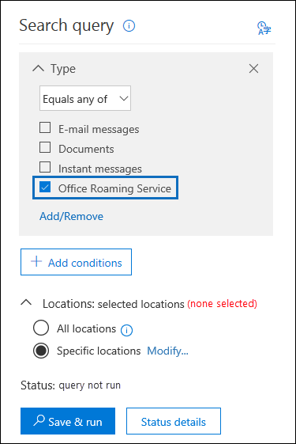

# <a name="manage-gdpr-data-subject-requests-with-the-dsr-case-tool-in-the-security--compliance-center"></a><span data-ttu-id="a0087-105">보안 & 준수 센터에서 DSR 사례 도구를 사용 하 여 GDPR 데이터 주체 요청 관리</span><span class="sxs-lookup"><span data-stu-id="a0087-105">Manage GDPR data subject requests with the DSR case tool in the Security & Compliance Center</span></span>

<span data-ttu-id="a0087-106">GDPR (일반 데이터 보호 규정)은 EU (유럽 연합) 내에서 개인의 개인 정보 권한을 보호 하 고 사용 하도록 설정 하는 방법입니다.</span><span class="sxs-lookup"><span data-stu-id="a0087-106">The EU General Data Protection Regulation (GDPR) is about protecting and enabling individuals' privacy rights inside the European Union (EU).</span></span> <span data-ttu-id="a0087-107">GDPR은 개인 데이터의 처리를 액세스, 검색, 수정, 삭제 및 제한할 수 있는 권한을 유럽 연합의 (데이터 주체)에 게 제공 합니다.</span><span class="sxs-lookup"><span data-stu-id="a0087-107">The GDPR gives individuals in the European Union (known as data subjects) the right to access, retrieve, correct, erase, and restrict processing of their personal data.</span></span> <span data-ttu-id="a0087-108">GDPR에서 개인 데이터는 식별 되거나 식별 가능한 자연 사용자와 관련 된 정보를 의미 합니다.</span><span class="sxs-lookup"><span data-stu-id="a0087-108">Under the GDPR, personal data means any information relating to an identified or identifiable natural person.</span></span> <span data-ttu-id="a0087-109">개인 데이터에 대 한 작업을 수행할 수 있는 조직 사용자의 공식 요청을 데이터 주체 요청 또는 DSR 이라고 합니다.</span><span class="sxs-lookup"><span data-stu-id="a0087-109">A formal request by a person to their organization to take an action on their personal data is called a Data Subject Request or DSR.</span></span> <span data-ttu-id="a0087-110">Office 365의 데이터에 대 한 DSRs에 응답 하는 방법에 대 한 자세한 내용은 [office 365 데이터 주체 요청 가이드](https://go.microsoft.com/fwlink/?linkid=871169 )를 참조 하세요.</span><span class="sxs-lookup"><span data-stu-id="a0087-110">For detailed information about responding to DSRs for data in Office 365, see [Office 365 Data Subject Request Guide](https://go.microsoft.com/fwlink/?linkid=871169 ).</span></span>
  
<span data-ttu-id="a0087-111">조직의 사용자가 제출한 DSR에 대 한 응답으로 조사를 관리 하려면 보안 & 준수 센터의 DSR 사례 도구를 사용 하 여 다음에 저장 된 콘텐츠를 찾을 수 있습니다.</span><span class="sxs-lookup"><span data-stu-id="a0087-111">To manage investigations in response to a DSR submitted by a person in your organization, you can use the DSR case tool in the Security & Compliance Center to find content stored in:</span></span>
  
- <span data-ttu-id="a0087-112">조직의 모든 사용자 사서함</span><span class="sxs-lookup"><span data-stu-id="a0087-112">Any user mailbox in your organization.</span></span> <span data-ttu-id="a0087-113">여기에는 비즈니스용 Skype 대화와 일대일 채팅 (Microsoft 팀)이 포함 됩니다.</span><span class="sxs-lookup"><span data-stu-id="a0087-113">This includes Skype for Business conversations and one-to-one chats in Microsoft Teams</span></span>
    
- <span data-ttu-id="a0087-114">Office 365 그룹과 연결 된 모든 사서함 및 Microsoft 팀의 모든 팀 사서함</span><span class="sxs-lookup"><span data-stu-id="a0087-114">All mailboxes associated with an Office 365 Group and all team mailboxes in Microsoft Teams</span></span>
    
- <span data-ttu-id="a0087-115">조직의 모든 SharePoint Online 사이트 및 비즈니스용 OneDrive 계정</span><span class="sxs-lookup"><span data-stu-id="a0087-115">All SharePoint Online sites and OneDrive for Business accounts in your organization</span></span>
    
- <span data-ttu-id="a0087-116">조직의 모든 팀 사이트 및 Office 365 그룹 사이트</span><span class="sxs-lookup"><span data-stu-id="a0087-116">All Teams sites and Office 365 Group sites in your organization</span></span>
    
- <span data-ttu-id="a0087-117">Exchange Online의 모든 공용 폴더</span><span class="sxs-lookup"><span data-stu-id="a0087-117">All public folders in Exchange Online</span></span>
    
<span data-ttu-id="a0087-118">DSR 사례 도구를 사용 하 여 다음을 수행할 수 있습니다.</span><span class="sxs-lookup"><span data-stu-id="a0087-118">Using the DSR case tool you can:</span></span>
  
- <span data-ttu-id="a0087-119">각 DSR 조사에 대한 별도의 사례를 만들 수 있습니다.</span><span class="sxs-lookup"><span data-stu-id="a0087-119">Create a separate case for each DSR investigation.</span></span>
    
- <span data-ttu-id="a0087-120">사용자를 사례 구성원으로 추가 하 여 DSR 사례에 액세스할 수 있는 사람을 제어 합니다. 구성원만이 사례에 액세스할 수 있으며 보안 & 준수 센터의 **DSR 사례** 페이지에 있는 사례 목록에 해당 케이스가 표시 될 수 있습니다.</span><span class="sxs-lookup"><span data-stu-id="a0087-120">Control who has access to the DSR case by adding people as members of the case; only members can access the case and can only see their cases in the list of cases on the **DSR cases** page in the Security & Compliance Center.</span></span> <span data-ttu-id="a0087-121">또한 동일한 대/소문자의 각 구성원에 대해 서로 다른 사용 권한을 할당할 수 있습니다.</span><span class="sxs-lookup"><span data-stu-id="a0087-121">Also, you can assign different permissions to different members of the same case.</span></span> <span data-ttu-id="a0087-122">예를 들어 일부 구성원이 사례 및 검색 결과만 보고, 다른 구성원이 검색을 만들고 검색 결과를 내보낼 수 있도록 허용할 수 있습니다.</span><span class="sxs-lookup"><span data-stu-id="a0087-122">For example, you can allow some members to only view the case and search results and allow other members to create searches and export search results.</span></span> 
    
- <span data-ttu-id="a0087-123">기본 제공 검색을 사용 하 여 특정 데이터 주체에서 만들거나 업로드 한 모든 콘텐츠를 검색 합니다.</span><span class="sxs-lookup"><span data-stu-id="a0087-123">Use the built-in search to search for all content created or uploaded by a specific data subject.</span></span>
    
- <span data-ttu-id="a0087-124">필요한 경우 기본 제공 검색 쿼리를 수정 하 고 검색을 다시 실행 하 여 검색 결과의 범위를 좁힙니다.</span><span class="sxs-lookup"><span data-stu-id="a0087-124">Optionally revise the built-in search query and rerun the search to narrow the search results.</span></span>
    
- <span data-ttu-id="a0087-125">DSR 사례와 연결 된 다른 콘텐츠 검색을 추가 합니다.</span><span class="sxs-lookup"><span data-stu-id="a0087-125">Add other content searches associated with the DSR case.</span></span> <span data-ttu-id="a0087-126">여기에는 Office 로밍 서비스에서 부분적으로 인덱싱된 항목 및 시스템 생성 로그를 반환 하는 검색을 만드는 작업이 포함 됩니다.</span><span class="sxs-lookup"><span data-stu-id="a0087-126">This includes creating searches that return partially indexed items and system-generated logs from the Office Roaming Service.</span></span>
    
- <span data-ttu-id="a0087-127">DSR 액세스 또는 내보내기 요청에 대 한 응답으로 데이터를 내보냅니다.</span><span class="sxs-lookup"><span data-stu-id="a0087-127">Export data in response to a DSR access or export request.</span></span>
    
- <span data-ttu-id="a0087-128">DSR 조사 프로세스가 완료 되 면 케이스를 삭제 합니다.</span><span class="sxs-lookup"><span data-stu-id="a0087-128">Delete cases when the DSR investigation process is complete.</span></span> <span data-ttu-id="a0087-129">그러면 모든 검색을 제거 하 고 사례와 연결 된 작업을 내보냅니다.</span><span class="sxs-lookup"><span data-stu-id="a0087-129">This removes all searches and export jobs associated with the case.</span></span>
    
<span data-ttu-id="a0087-130">Dsr 사례 도구를 사용 하 여 DSR 조사를 관리 하는 높은 수준의 프로세스는 다음과 같습니다.</span><span class="sxs-lookup"><span data-stu-id="a0087-130">Here's the high-level process for using the DSR case tool to manage DSR investigations:</span></span>
  
[<span data-ttu-id="a0087-131">Step 1: Assign eDiscovery permissions to potential case members</span><span class="sxs-lookup"><span data-stu-id="a0087-131">Step 1: Assign eDiscovery permissions to potential case members</span></span>](#step-1-assign-ediscovery-permissions-to-potential-case-members)

[<span data-ttu-id="a0087-132">2 단계: DSR 사례 만들기 및 구성원 추가</span><span class="sxs-lookup"><span data-stu-id="a0087-132">Step 2: Create a DSR case and add members</span></span>](#step-2-create-a-dsr-case-and-add-members)

[<span data-ttu-id="a0087-133">3 단계: 검색 쿼리 실행</span><span class="sxs-lookup"><span data-stu-id="a0087-133">Step 3: Run the search query</span></span>](#step-3-run-the-search-query)

[<span data-ttu-id="a0087-134">4 단계: 데이터 내보내기</span><span class="sxs-lookup"><span data-stu-id="a0087-134">Step 4: Export the data</span></span>](#step-4-export-the-data)

[<span data-ttu-id="a0087-135">반드시 5 단계: 기본 제공 검색 쿼리 수정</span><span class="sxs-lookup"><span data-stu-id="a0087-135">(Optional) Step 5: Revise the built-in search query</span></span>](#optional-step-5-revise-the-built-in-search-query)

[<span data-ttu-id="a0087-136">DSR 사례 도구 사용에 대 한 자세한 정보</span><span class="sxs-lookup"><span data-stu-id="a0087-136">More information about using the DSR case tool</span></span>](#more-information-about-using-the-dsr-case-tool)
  
> [!IMPORTANT]
> <span data-ttu-id="a0087-137">이 도구는 DSR 사례 도구에 있는 기본 제공 검색 및 내보내기 기능을 사용 하도록 설정 하 여 관리자가 DSR 액세스 또는 내보내기 요청을 수행 하는 데 도움이 될 수 있습니다.</span><span class="sxs-lookup"><span data-stu-id="a0087-137">Our tools can help admins perform DSR access or export requests by enabling them to utilize the built-in search and export functionality found in the DSR case tool.</span></span> <span data-ttu-id="a0087-138">이 도구를 사용 하면 데이터 주체에 의해 전송 된 DSR 요청과 관련 된 데이터를 최상의 방법으로 내보낼 수 있습니다.</span><span class="sxs-lookup"><span data-stu-id="a0087-138">The tool helps to facilitate a best-effort method to export data that's relevant to a DSR request submitted by a data subject.</span></span> <span data-ttu-id="a0087-139">그러나 내보내기 목적으로 항목을 "개인 데이터"로 간주 해야 하는지 여부에 영향을 줄 수 있는 데이터 주체 또는 관리 작업에 따라 검색 결과가 다를 수 있다는 점에 유의 해야 합니다.</span><span class="sxs-lookup"><span data-stu-id="a0087-139">However, it's important to note that search results can vary based on the data subject or the admin actions taken that may impact whether or not an item would be deemed as "personal data" for export purposes.</span></span> <span data-ttu-id="a0087-140">예를 들어 데이터 주체가 만들지 않은 파일을 마지막으로 수정한 사용자 인 경우 해당 파일은 검색 결과에 반환 되지 않을 수 있습니다.</span><span class="sxs-lookup"><span data-stu-id="a0087-140">For example, if the data subject was the last person to modify a file they didn't create, the file might not be returned in the search results.</span></span> <span data-ttu-id="a0087-141">마찬가지로, 관리자는 부분적으로 인덱싱된 항목 또는 모든 SharePoint 문서 버전을 포함 하지 않고 데이터를 내보낼 수 있습니다.</span><span class="sxs-lookup"><span data-stu-id="a0087-141">Similarly, an admin could export data without including partially indexed items or all versions of SharePoint documents.</span></span> <span data-ttu-id="a0087-142">따라서 제공 되는 도구를 통해 데이터 요청을 쉽게 액세스 하 고 내보낼 수 있습니다. 그러나 결과는 특정 관리 및 데이터 주체 사용 시나리오에 따라 달라 집니다.</span><span class="sxs-lookup"><span data-stu-id="a0087-142">Therefore, the tools provided can help facilitate accessing and exporting data requests; however, the results are subject to specific admin and data subject usage scenarios.</span></span> 
  
## <a name="step-1-assign-ediscovery-permissions-to-potential-case-members"></a><span data-ttu-id="a0087-143">1단계: 잠재적인 사례 구성원에게 eDiscovery 권한 할당</span><span class="sxs-lookup"><span data-stu-id="a0087-143">Step 1: Assign eDiscovery permissions to potential case members</span></span>

<span data-ttu-id="a0087-144">기본적으로 Office 365 전역 관리자는 보안 & 준수 센터에서 DSR 사례 도구에 액세스할 수 있습니다.</span><span class="sxs-lookup"><span data-stu-id="a0087-144">By default, an Office 365 global administrator can access the DSR case tool in the Security & Compliance Center.</span></span> <span data-ttu-id="a0087-145">기본적으로 데이터 개인 정보 취급 방침, 인적 자원 관리자 또는 DSR 조사에 관련 된 다른 사용자가 dsr 사례 도구에 액세스할 수 없으며 도구에 액세스 하기 위한 적절 한 권한을 할당 받아야 합니다.</span><span class="sxs-lookup"><span data-stu-id="a0087-145">By design, other users such as a data privacy officer, a human resources manager, or other people involved in DSR investigations don't have access to the DSR case tool and will have to be assigned the appropriate permissions to access the tool.</span></span> <span data-ttu-id="a0087-146">이 작업을 수행 하는 가장 쉬운 방법은 보안 & 준수 센터의 **사용 권한** 페이지로 이동 하 여 eDiscovery 관리자 역할 그룹에 사용자를 추가 하는 것입니다.</span><span class="sxs-lookup"><span data-stu-id="a0087-146">The easiest way to do this is to go to the **Permissions** page in the Security & Compliance Center and add users to the eDiscovery Manager role group.</span></span> <span data-ttu-id="a0087-147">또한 2 단계에서 만든 DSR 사례의 구성원으로 추가할 수 있도록 이러한 사용 권한을 할당 해야 합니다.</span><span class="sxs-lookup"><span data-stu-id="a0087-147">You also have to assign these permissions so you can add them as members of the DSR case that you create in Step 2.</span></span> 
  
<span data-ttu-id="a0087-148">단계별 지침은 [Office 365 보안 & 준수 센터에서 eDiscovery 사용 권한 할당](assign-ediscovery-permissions.md)을 참조 하십시오.</span><span class="sxs-lookup"><span data-stu-id="a0087-148">For step-by-step instructions, see [Assign eDiscovery permissions in the Office‍ 365 Security & Compliance Center](assign-ediscovery-permissions.md).</span></span>
  
> [!NOTE]
> <span data-ttu-id="a0087-149">기본적으로 Office 365 전역 관리자 또는 보안 & 준수 센터에 있는 조직 관리 역할 그룹의 다른 구성원에 게는 콘텐츠 검색 결과를 내보내는 데 필요한 권한이 없습니다 (이 문서의 4 단계 참조).</span><span class="sxs-lookup"><span data-stu-id="a0087-149">By default, an Office 365 global administrator (or other members of the Organization Management role group in the Security & Compliance Center don't have the necessary permissions to export Content Search results (see Step 4 in this article).</span></span> <span data-ttu-id="a0087-150">이를 처리 하기 위해 관리자는 자신을 eDiscovery 관리자 역할 그룹의 구성원으로 추가할 수 있습니다.</span><span class="sxs-lookup"><span data-stu-id="a0087-150">To address this, an admin can add themselves as a member of the eDiscovery Manager role group.</span></span> 
  
## <a name="step-2-create-a-dsr-case-and-add-members"></a><span data-ttu-id="a0087-151">2 단계: DSR 사례 만들기 및 구성원 추가</span><span class="sxs-lookup"><span data-stu-id="a0087-151">Step 2: Create a DSR case and add members</span></span>

<span data-ttu-id="a0087-152">다음 단계는 DSR 사례를 만드는 것입니다.</span><span class="sxs-lookup"><span data-stu-id="a0087-152">The next step is to create a DSR case.</span></span> <span data-ttu-id="a0087-153">사례를 만들 때 기본 제공 검색을 시작 하도록 선택 하거나 검색을 시작 하지 않고 대/소문자를 만들 수 있습니다.</span><span class="sxs-lookup"><span data-stu-id="a0087-153">When you create a case, you can choose to start the built-in search or you can create the case without starting the search.</span></span> <span data-ttu-id="a0087-154">다음 절차에서는 검색을 시작 하지 않고 사례를 만들고 사례에 구성원을 추가 하는 방법을 보여 줍니다.</span><span class="sxs-lookup"><span data-stu-id="a0087-154">The following procedure instructs you to create the case without starting the search and then show you how to add members to the case.</span></span>
  
1. <span data-ttu-id="a0087-155">회사 또는 [https://protection.office.com](https://protection.office.com) 학교 계정을 사용 하 여으로 이동 하 고 Office 365에 로그인 합니다.</span><span class="sxs-lookup"><span data-stu-id="a0087-155">Go to [https://protection.office.com](https://protection.office.com) and sign in to Office 365 using your work or school account.</span></span> 
    
2. <span data-ttu-id="a0087-156">보안 & 준수 센터에서 **데이터 개인 정보 보호** \> **데이터 주체 요청**을 클릭 하 고 아이콘  추가 **새 DSR 사례**를 클릭 합니다.</span><span class="sxs-lookup"><span data-stu-id="a0087-156">In the Security & Compliance Center, click **Data privacy** \> **Data subject requests**, and then click  **New DSR case**.</span></span>
    
3. <span data-ttu-id="a0087-157">**새 DSR 케이스** 플라이 아웃 페이지에서 케이스 이름을 지정 하 고, 선택적 설명을 입력 한 후 **다음**을 클릭 합니다.</span><span class="sxs-lookup"><span data-stu-id="a0087-157">On the **New DSR case** flyout page, give the case a name, type an optional description, and then click **Next**.</span></span> <span data-ttu-id="a0087-158">사례 이름은 조직에서 고유해야 합니다.</span><span class="sxs-lookup"><span data-stu-id="a0087-158">The name of the case must be unique in your organization.</span></span>
    
    > [!TIP]
    > <span data-ttu-id="a0087-159">조사 중인 DSR 요청을 제출한 사용자의 이름을 및/또는 새 사례의 설명에 추가 하는 것이 좋습니다.</span><span class="sxs-lookup"><span data-stu-id="a0087-159">Consider adding the name of the person who submitted the DSR request that you're investigating in the name and/or description of the new case.</span></span> <span data-ttu-id="a0087-160">이 사례 (및 eDiscovery 관리자)의 구성원만이 **데이터 주체 요청** 페이지의 사례 목록에 있는 사례를 볼 수 있습니다.</span><span class="sxs-lookup"><span data-stu-id="a0087-160">Note that only members of this case (and eDiscovery Administrators) will be able to see the case in the list of cases on the **Data subject requests** page.</span></span> 
  
4. <span data-ttu-id="a0087-161">**요청 세부 정보** 페이지의 **데이터 제목 (이 요청을 보낸 사람)** 아래에서 데이터를 찾고 내보낼 사람을 선택 하 고 **다음**을 클릭 합니다.</span><span class="sxs-lookup"><span data-stu-id="a0087-161">On the **Request details** page, under **Data subject (the person who filed this request)**, select the person that you want to find and export data for and then click **Next**.</span></span>
    
5. <span data-ttu-id="a0087-162">**사례 설정 확인** 페이지에서 사례 이름 및 설명을 변경 하 고 다른 데이터 주체를 선택할 수 있습니다.</span><span class="sxs-lookup"><span data-stu-id="a0087-162">On the **Confirm your case settings** page, you can change the case name and description, and select a different data subject.</span></span> <span data-ttu-id="a0087-163">그렇지 않으면 **저장**을 클릭 합니다.</span><span class="sxs-lookup"><span data-stu-id="a0087-163">Otherwise, click **Save**.</span></span>
    
    <span data-ttu-id="a0087-164">새 DSR 사례를 만들었는지 확인 하는 페이지가 표시 됩니다.</span><span class="sxs-lookup"><span data-stu-id="a0087-164">A page is displayed that confirms the new DSR case has been created.</span></span>
    
    
  
    <span data-ttu-id="a0087-166">이때 다음과 같은 두 가지 작업을 수행할 수 있습니다.</span><span class="sxs-lookup"><span data-stu-id="a0087-166">At this point, you can do one of two things:</span></span>
    
    <span data-ttu-id="a0087-167">위한.</span><span class="sxs-lookup"><span data-stu-id="a0087-167">a.</span></span> <span data-ttu-id="a0087-168">**검색 결과 표시** 를 클릭 하면 검색이 시작 됩니다.</span><span class="sxs-lookup"><span data-stu-id="a0087-168">Clicking **Show me search results** starts the search.</span></span> <span data-ttu-id="a0087-169">이 옵션은 기본 선택 합니다.</span><span class="sxs-lookup"><span data-stu-id="a0087-169">This is the default selection.</span></span> <span data-ttu-id="a0087-170">이 옵션을 선택 하 고 반환 되는 결과에 대해 3 단계에서 설명 하는 기본 제공 검색을 실행 합니다.</span><span class="sxs-lookup"><span data-stu-id="a0087-170">The built-in search that's run when you select this option and the results that are returned are discussed in Step 3.</span></span>
    
    <span data-ttu-id="a0087-171">b.</span><span class="sxs-lookup"><span data-stu-id="a0087-171">b.</span></span> <span data-ttu-id="a0087-172">**마침을** 클릭 하면 기본 제공 검색을 시작 하지 않고 새 DSR 사례를 닫습니다.</span><span class="sxs-lookup"><span data-stu-id="a0087-172">Clicking **Finish** closes the new DSR case without starting the built-in search.</span></span> <span data-ttu-id="a0087-173">이 옵션을 선택 하면 새 DSR 사례가 **데이터 주체 요청** 페이지에 표시 됩니다.</span><span class="sxs-lookup"><span data-stu-id="a0087-173">When you select this option, the new DSR case is displayed on the **Data subject requests** page.</span></span>
    
6. <span data-ttu-id="a0087-174">새 DSR 사례로 이동 하 여 구성원을 추가할 수 있도록 **마침을** 클릭 합니다.</span><span class="sxs-lookup"><span data-stu-id="a0087-174">Click **Finish** so that you can go in to the new DSR case and add members to it.</span></span> 
    
7. <span data-ttu-id="a0087-175">**데이터 주체 요청** 페이지에서 만든 DSR 사례 이름을 클릭 합니다.</span><span class="sxs-lookup"><span data-stu-id="a0087-175">On the **Data subject requests** page, click the name of the DSR case that you created.</span></span> 
    
8. <span data-ttu-id="a0087-176">**이 사례** 플라이 아웃 관리 페이지의 **구성원 관리**에서 **추가**를 클릭 합니다.</span><span class="sxs-lookup"><span data-stu-id="a0087-176">On the **Manage this case** flyout page, under **Manage members**, click **Add**.</span></span> 
    
    <span data-ttu-id="a0087-177">**사용자**에 게 적절 한 eDiscovery 권한이 할당 된 사용자 목록이 표시 됩니다.</span><span class="sxs-lookup"><span data-stu-id="a0087-177">Under **Users**, a list of people that are assigned the appropriate eDiscovery permissions is displayed.</span></span> <span data-ttu-id="a0087-178">1 단계에서 eDiscovery 권한을 할당 한 사용자가이 목록에 표시 됩니다.</span><span class="sxs-lookup"><span data-stu-id="a0087-178">The people you assigned eDiscovery permissions to in Step 1 will be displayed in this list.</span></span> 
    
9. <span data-ttu-id="a0087-179">DSR 사례의 구성원으로 추가할 사용자를 선택 하 고 **추가**를 클릭 한 다음 변경 내용을 저장 합니다.</span><span class="sxs-lookup"><span data-stu-id="a0087-179">Select the people to add as members of the DSR case, click **Add**, and then save your changes.</span></span>
    
    <span data-ttu-id="a0087-180">**역할 그룹 관리**에서 **추가** 를 클릭 하 여 역할 그룹을 DSR 사례의 구성원으로 추가할 수도 있습니다.</span><span class="sxs-lookup"><span data-stu-id="a0087-180">You can also add role groups as members of DSR case by clicking **Add** under **Manage role groups**.</span></span> 
    
## <a name="step-3-run-the-search-query"></a><span data-ttu-id="a0087-181">3 단계: 검색 쿼리 실행</span><span class="sxs-lookup"><span data-stu-id="a0087-181">Step 3: Run the search query</span></span>

<span data-ttu-id="a0087-182">DSR 사례를 만들고 구성원을 추가한 후에는 사례와 연결 된 기본 제공 검색을 실행 합니다.</span><span class="sxs-lookup"><span data-stu-id="a0087-182">After you create a DSR case and add members, the next step is to run the built-in search that's associated with the case.</span></span> <span data-ttu-id="a0087-183">이 기본 검색 쿼리는 다음과 같은 작업을 수행 합니다.</span><span class="sxs-lookup"><span data-stu-id="a0087-183">This default search query does the following things:</span></span>
  
- <span data-ttu-id="a0087-184">조직의 모든 사서함에서 데이터 주체가 보내거나 받은 모든 전자 메일 항목을 검색 합니다.</span><span class="sxs-lookup"><span data-stu-id="a0087-184">Searches all mailboxes in your organization for all email items that were sent or received by the data subject.</span></span> <span data-ttu-id="a0087-185">이 작업은 전자 메일 메시지의 모든 사용자 필드에서 데이터 제목을 검색 하는 *참가자* 전자 메일 속성을 사용 하 여 수행 합니다.</span><span class="sxs-lookup"><span data-stu-id="a0087-185">This is accomplished by using the  *Participants*  email property, which searches for the data subject in all the people fields in an email message.</span></span> <span data-ttu-id="a0087-186">이 속성은 데이터 제목이 **보낸 사람**, **받는** **사람, 참조**및 **숨은 참조** 필드에 있는 항목을 반환 합니다.</span><span class="sxs-lookup"><span data-stu-id="a0087-186">This property returns items in which the data subject is in the **From**, **To**, **CC**, and **BCC** fields.</span></span> <span data-ttu-id="a0087-187">또한 Exchange Online의 공용 폴더는 데이터 주체가 보내거나 받은 메시지에 대해서도 검색 합니다.</span><span class="sxs-lookup"><span data-stu-id="a0087-187">Public folders in Exchange Online are also searched for messages sent or received by the data subject.</span></span> 
    
- <span data-ttu-id="a0087-188">조직의 모든 사이트에서 데이터 주체가 만들거나 업로드 한 문서 및 항목을 검색 합니다.</span><span class="sxs-lookup"><span data-stu-id="a0087-188">Searches all sites in your organization for documents and items created or uploaded by the data subject.</span></span> <span data-ttu-id="a0087-189">이 작업은 다음 사이트 속성을 사용 하 여 수행 됩니다.</span><span class="sxs-lookup"><span data-stu-id="a0087-189">This is accomplished by using the following site properties:</span></span>
    
  - <span data-ttu-id="a0087-190">*Author* 속성은 Office 문서의 author 필드에 데이터 제목이 나열 되는 항목을 반환 합니다.</span><span class="sxs-lookup"><span data-stu-id="a0087-190">The  *Author*  property returns items where the data subject is listed in the author field in Office documents.</span></span> <span data-ttu-id="a0087-191">이 값은 다른 사용자가 문서를 복사 하 고 업로드 하는 경우에도 지속 됩니다.</span><span class="sxs-lookup"><span data-stu-id="a0087-191">This value persists, even if the document is copied and uploaded by someone else.</span></span> 
    
  - <span data-ttu-id="a0087-192">*X-createdby* 속성은 데이터 제목별로 만들어지거나 업로드 된 항목을 반환 합니다.</span><span class="sxs-lookup"><span data-stu-id="a0087-192">The  *CreatedBy*  property returns items that were created or uploaded by the data subject.</span></span> 
    
<span data-ttu-id="a0087-193">기본 제공 검색에서 DSR 사례를 만들 때 자동으로 만들어지는 키워드 쿼리는 다음과 같습니다.</span><span class="sxs-lookup"><span data-stu-id="a0087-193">Here's what the keyword query looks like for the built-in search that gets automatically created when you create a DSR case.</span></span>
  
```
participants:"<email address>" OR author:"<display name>" OR createdby:"<display name>"
```

<span data-ttu-id="a0087-194">예를 들어 데이터 주체의 이름이 Ina Leonte 인 경우 keyword 쿼리는 다음과 같이 표시 됩니다.</span><span class="sxs-lookup"><span data-stu-id="a0087-194">For example, if the name of the data subject is Ina Leonte, the keyword query would look like this:</span></span>
  
```
participants:"ina@contoso.com" OR author:"Ina Leonte" OR createdby:"Ina Leonte"
```

 <span data-ttu-id="a0087-195">**DSR 사례에 대 한 기본 제공 검색을 실행 하려면:**</span><span class="sxs-lookup"><span data-stu-id="a0087-195">**To run the built-in search for a DSR case:**</span></span>
  
1. <span data-ttu-id="a0087-196">보안 & 준수 센터에서 **데이터 개인 정보** \> **데이터 주체 요청**을 클릭 하 고 2 단계에서 만든 DSR 사례 옆에 있는 **열기** 를 클릭 합니다.</span><span class="sxs-lookup"><span data-stu-id="a0087-196">In the Security & Compliance Center, click **Data privacy** \> **Data subject requests**, and then click **Open** next to the DSR case that you created in Step 2.</span></span> 
    
    <span data-ttu-id="a0087-197">페이지 맨 위에 있는 **검색** 탭을 클릭 하 고 DSR 사례를 만들 때 만든 기본 제공 검색 옆에 있는 확인란을 클릭 합니다.</span><span class="sxs-lookup"><span data-stu-id="a0087-197">Click the **Search** tab at the top of the page, and then click the checkbox next to the built-in search that was created when you created the DSR case.</span></span> <span data-ttu-id="a0087-198">검색은 DSR 사례와 이름이 같습니다.</span><span class="sxs-lookup"><span data-stu-id="a0087-198">The search has the same name as the DSR case.</span></span> 
    
2. <span data-ttu-id="a0087-199">검색 플라이 아웃 페이지에서 **쿼리 열기**를 클릭 합니다.</span><span class="sxs-lookup"><span data-stu-id="a0087-199">In the search flyout page, click **Open query**.</span></span>
    
    <span data-ttu-id="a0087-200">쿼리를 열면 검색이 시작 되 고 잠시 후에 완료 됩니다.</span><span class="sxs-lookup"><span data-stu-id="a0087-200">When you open the query, the search is started and will complete in a few moments.</span></span> 
    
3. <span data-ttu-id="a0087-201">검색이 완료 되 면 **결과 미리 보기** 를 클릭 하 여 검색 결과를 미리 봅니다.</span><span class="sxs-lookup"><span data-stu-id="a0087-201">When the search is complete, click **Preview results** to preview the search results.</span></span> <span data-ttu-id="a0087-202">자세한 내용은 [검색 결과 미리 보기](content-search.md#preview-search-results)를 참조 하세요.</span><span class="sxs-lookup"><span data-stu-id="a0087-202">For more information, see [Preview search results](content-search.md#preview-search-results).</span></span>
    
    > [!TIP]
    > <span data-ttu-id="a0087-203">검색 쿼리 통계를 확인 하 여 검색에서 반환 된 사서함 및 사이트 항목 수와 검색 쿼리와 일치 하는 항목이 포함 된 최상위 콘텐츠 위치를 볼 수도 있습니다.</span><span class="sxs-lookup"><span data-stu-id="a0087-203">You can also view the search query statistics to see the number of mailbox and site items that are returned by the search, and the top content locations that contain items that match the search query.</span></span> <span data-ttu-id="a0087-204">자세한 내용은 [정보 및 검색에 대 한 통계 보기](content-search.md#view-information-and-statistics-about-a-search)를 참조 하세요.</span><span class="sxs-lookup"><span data-stu-id="a0087-204">For more information, see [View information and statistics about a search](content-search.md#view-information-and-statistics-about-a-search).</span></span> 
  
<span data-ttu-id="a0087-205">기본 제공 검색 쿼리를 편집 하 고, 검색 된 콘텐츠 위치를 변경한 후에 검색을 다시 실행할 수 있습니다.</span><span class="sxs-lookup"><span data-stu-id="a0087-205">You can edit the built-in search query, change the content locations that are searched, and then rerun the search.</span></span> <span data-ttu-id="a0087-206">자세한 내용은 [5 단계](#optional-step-5-revise-the-built-in-search-query) 를 참조 하세요.</span><span class="sxs-lookup"><span data-stu-id="a0087-206">See [Step 5](#optional-step-5-revise-the-built-in-search-query) for more information.</span></span> 
  
## <a name="step-4-export-the-data"></a><span data-ttu-id="a0087-207">4 단계: 데이터 내보내기</span><span class="sxs-lookup"><span data-stu-id="a0087-207">Step 4: Export the data</span></span>

<span data-ttu-id="a0087-208">기본 제공 검색을 실행 한 후에는 검색 결과를 내보낼 수 있습니다.</span><span class="sxs-lookup"><span data-stu-id="a0087-208">After you run the built-in search, you can export the search results.</span></span> <span data-ttu-id="a0087-209">또는 데이터를 내보내기 전에 검색 결과 수를 줄이기 위해 쿼리를 수정 해야 할 수 있습니다.</span><span class="sxs-lookup"><span data-stu-id="a0087-209">Alternatively, before you export the data, you may want to revise the query to reduce the number of search results.</span></span> <span data-ttu-id="a0087-210">검색 결과의 범위를 좁히는 방법에 대 한 자세한 내용은 5 단계를 참조 하십시오.</span><span class="sxs-lookup"><span data-stu-id="a0087-210">See Step 5 for more information about narrowing the search results.</span></span>
  
<span data-ttu-id="a0087-211">검색 결과를 내보낼 때는 사서함 항목을 PST 파일이 나 개별 메시지로 다운로드할 수 있습니다.</span><span class="sxs-lookup"><span data-stu-id="a0087-211">When you export search results, mailbox items can be downloaded in PST files or as individual messages.</span></span> <span data-ttu-id="a0087-212">SharePoint 및 OneDrive 계정에서 콘텐츠를 내보내는 경우 기본 Office 문서 및 기타 문서의 복사본이 내보내집니다.</span><span class="sxs-lookup"><span data-stu-id="a0087-212">When you export content from SharePoint and OneDrive accounts, copies of native Office documents and other documents are exported.</span></span> <span data-ttu-id="a0087-213">내보낸 모든 항목에 대 한 정보가 포함 된 결과 파일은 검색 결과에 포함 됩니다.</span><span class="sxs-lookup"><span data-stu-id="a0087-213">A results file that contains information about every exported item is included with the search results.</span></span> <span data-ttu-id="a0087-214">내보내기에 대 한 자세한 내용은 [Export Content Search results](export-search-results.md)를 참조 하십시오.</span><span class="sxs-lookup"><span data-stu-id="a0087-214">For more detailed information about exporting, see [Export Content Search results](export-search-results.md).</span></span>
  
> [!NOTE]
> <span data-ttu-id="a0087-215">기본적으로 Office 365 전역 관리자 또는 보안 & 준수 센터에서 조직 관리 역할 그룹의 기타 구성원에 게는 콘텐츠 검색 결과를 내보내는 데 필요한 사용 권한이 없습니다.</span><span class="sxs-lookup"><span data-stu-id="a0087-215">By default, an Office 365 global administrator (or other members of the Organization Management role group in the Security & Compliance Center) don't have the necessary permissions to export Content Search results.</span></span> <span data-ttu-id="a0087-216">이를 처리 하기 위해 관리자는 자신을 eDiscovery 관리자 역할 그룹의 구성원으로 추가할 수 있습니다.</span><span class="sxs-lookup"><span data-stu-id="a0087-216">To address this, an admin can add themselves as a member of the eDiscovery Manager role group.</span></span> 
  
<span data-ttu-id="a0087-217">데이터를 내보내는 데 사용 하는 컴퓨터는 다음과 같은 시스템 요구 사항을 충족 해야 합니다.</span><span class="sxs-lookup"><span data-stu-id="a0087-217">The computer you use to export data has to meet the following system requirements:</span></span>
  
- <span data-ttu-id="a0087-218">32 비트 또는 64 비트 버전의 Windows 7 이상 버전</span><span class="sxs-lookup"><span data-stu-id="a0087-218">32-bit or 64-bit versions of Windows 7 and later versions</span></span>
    
- <span data-ttu-id="a0087-219">Microsoft .NET Framework 4.7</span><span class="sxs-lookup"><span data-stu-id="a0087-219">Microsoft .NET Framework 4.7</span></span>
    
- <span data-ttu-id="a0087-220">지원되는 브라우저:</span><span class="sxs-lookup"><span data-stu-id="a0087-220">A supported browser:</span></span>
    
  - <span data-ttu-id="a0087-221">Microsoft Edge</span><span class="sxs-lookup"><span data-stu-id="a0087-221">Microsoft Edge</span></span>
    
    <span data-ttu-id="a0087-222">또는</span><span class="sxs-lookup"><span data-stu-id="a0087-222">Or</span></span>
    
  - <span data-ttu-id="a0087-223">Microsoft Internet Explorer 10 이상 버전</span><span class="sxs-lookup"><span data-stu-id="a0087-223">Microsoft Internet Explorer 10 and later versions</span></span>
    
    > [!NOTE]
    > <span data-ttu-id="a0087-224">Microsoft는 ClickOnce 응용 프로그램에 대 한 타사 확장 또는 추가 기능을 제조 하지 않습니다.</span><span class="sxs-lookup"><span data-stu-id="a0087-224">Microsoft doesn't manufacture third-party extensions or add-ons for ClickOnce applications.</span></span> <span data-ttu-id="a0087-225">타사 확장 또는 추가 기능을 사용 하 여 지원 되지 않는 브라우저를 사용한 데이터 내보내기는 지원 되지 않습니다.</span><span class="sxs-lookup"><span data-stu-id="a0087-225">Exporting data using an unsupported browser with third-party extensions or add-ons isn't supported.</span></span> 
  
 <span data-ttu-id="a0087-226">**DSR 사례의 기본 제공 검색에서 데이터를 내보내려면 다음을 수행 합니다.**</span><span class="sxs-lookup"><span data-stu-id="a0087-226">**To export data from the built-in search in a DSR case:**</span></span>
  
1. <span data-ttu-id="a0087-227">보안 & 준수 센터에서 **데이터 개인 정보** \> **데이터 주체 요청**을 클릭 하 고 데이터를 내보내려는 DSR 사례 옆에 있는 **열기** 를 클릭 합니다.</span><span class="sxs-lookup"><span data-stu-id="a0087-227">In the Security & Compliance Center, click **Data privacy** \> **Data subject requests**, and then click **Open** next to the DSR case that you want to export data from.</span></span> 
    
2. <span data-ttu-id="a0087-228">페이지 맨 위에 있는 **검색** 탭을 클릭 하 고 DSR 사례를 만들 때 만든 기본 제공 검색 옆에 있는 확인란을 클릭 합니다.</span><span class="sxs-lookup"><span data-stu-id="a0087-228">Click the **Search** tab at the top of the page, and then click the checkbox next to the built-in search that was created when you created the DSR case.</span></span> <span data-ttu-id="a0087-229">또는 다른 검색을 클릭 하 여 해당 검색에서 데이터를 내보냅니다.</span><span class="sxs-lookup"><span data-stu-id="a0087-229">Or click another search to export data from that search.</span></span> 
    
3. <span data-ttu-id="a0087-230">검색 플라이 아웃 페이지에서 검색 결과  **추가**를 클릭 한 다음 드롭다운 목록에서 **결과 내보내기** 를 선택 합니다.</span><span class="sxs-lookup"><span data-stu-id="a0087-230">On the search flyout page, click  **More**, and then select **Export results** from the drop-down list.</span></span> 
    
4. <span data-ttu-id="a0087-231">**내보내기 결과** 페이지에서 DSR 내보내기 요청에 대해 다음과 같은 권장 옵션을 선택 합니다.</span><span class="sxs-lookup"><span data-stu-id="a0087-231">On the **Export results** page, select the following recommended options for DSR export requests.</span></span> 
    
    
  
    <span data-ttu-id="a0087-233">위한.</span><span class="sxs-lookup"><span data-stu-id="a0087-233">a.</span></span> <span data-ttu-id="a0087-234">**출력 옵션**에서 인덱싱된 항목만 내보내려면 첫 번째 옵션 (인식할 수 없는 형식을 포함 하 고,**암호화 되어 있거나 인덱싱되지 않은 항목 제외**)을 선택 합니다.</span><span class="sxs-lookup"><span data-stu-id="a0087-234">Under **Output options**, select the first option (**All items, excluding ones that have ones that have an unrecognized format, are encrypted, or weren't indexed for other reasons**) to export indexed items only.</span></span> <span data-ttu-id="a0087-235">기본 제공 검색에서 부분적으로 인덱싱된 항목을 내보내지 않으려는 이유는 다른 사용자의 부분 인덱싱된 항목도 함께 내보내기 때문입니다.</span><span class="sxs-lookup"><span data-stu-id="a0087-235">The reason you don't want to export partially indexed items from the built-in search is because partially indexed items from other users will also be exported.</span></span> <span data-ttu-id="a0087-236">데이터 주체에 대해 부분적으로 인덱싱된 항목만 내보내려면 별도의 검색을 만드는 것이 좋습니다.</span><span class="sxs-lookup"><span data-stu-id="a0087-236">To export only the partially indexed items for the data subject, we recommend that you create a separate search.</span></span> <span data-ttu-id="a0087-237">자세한 내용은 "DSR 사례를 사용 하는 방법에 대 한 자세한 정보" 섹션에서 [부분적으로 인덱싱된 항목 내보내기를](#exporting-partially-indexed-items) 참조 하십시오.</span><span class="sxs-lookup"><span data-stu-id="a0087-237">For more information, see [Exporting partially indexed items](#exporting-partially-indexed-items) in the "More information about using the DSR case tool" section.</span></span>
    
    <span data-ttu-id="a0087-238">b.</span><span class="sxs-lookup"><span data-stu-id="a0087-238">b.</span></span> <span data-ttu-id="a0087-239">**Exchange 콘텐츠 내보내기**에서 **단일 폴더에 있는 모든 메시지를 포함 하**는 세 번째 옵션인 PST 파일 하나를 선택 합니다.</span><span class="sxs-lookup"><span data-stu-id="a0087-239">Under **Export Exchange content as**, select the third option, **One PST file containing all messages in a single folder**.</span></span> <span data-ttu-id="a0087-240">다른 사용자의 사서함에서 시작 된 항목에 대해 일부 결과가 발생할 수 있으므로이 옵션은 실제 사서함을 표시 하지 않고 단일 폴더에 항목을 나열 하 고 다음 항목에서 권장 되는 결과를 사용 하는 것이 가장 좋은 옵션입니다. .</span><span class="sxs-lookup"><span data-stu-id="a0087-240">Because some of the results may be for items that originated in another user's mailbox, this option just lists the item in a single folder without indicating the actual mailbox and is the best option to use when you de-duplicate the results as recommended in the next item.</span></span> <span data-ttu-id="a0087-241">또한이 옵션을 사용 하면 데이터 주체에서 각 항목의 원래 사서함 폴더 구조를 탐색할 필요 없이 시간순으로 시간 순 (항목을 보낸 날짜별로 정렬) 할 수 있습니다.</span><span class="sxs-lookup"><span data-stu-id="a0087-241">This option also lets the data subject review items in chronological order (items are sorted by sent date) without having to navigate the original mailbox folder structure for each item.</span></span>
    
    <span data-ttu-id="a0087-242">&.</span><span class="sxs-lookup"><span data-stu-id="a0087-242">c.</span></span> <span data-ttu-id="a0087-243">중복 된 전자 메일 메시지를 제외 하려면 중복 제거 옵션 **사용** 을 선택 합니다.</span><span class="sxs-lookup"><span data-stu-id="a0087-243">Select **Enable de-duplication** option to excludes duplicate email messages.</span></span> <span data-ttu-id="a0087-244">기본 제공 검색이 조직의 모든 사서함을 검색 하기 때문에이 옵션을 사용 하는 것이 좋습니다.</span><span class="sxs-lookup"><span data-stu-id="a0087-244">We recommend this option because the built-in search searches all mailboxes in your organization.</span></span> <span data-ttu-id="a0087-245">따라서 검색 된 사서함에서 같은 메시지의 복사본을 여러 개 찾은 경우이 옵션을 사용 하면 하나의 메시지 복사본만 내보내집니다.</span><span class="sxs-lookup"><span data-stu-id="a0087-245">So if multiple copies of the same message are found in the mailboxes that were searched, this option means that only one copy of a message will be exported.</span></span> <span data-ttu-id="a0087-246">이 옵션을 사용 하면 단일 폴더에 있는 PST 파일 하나에서 메시지를 내보낼 수 있으므로 DSR 내보내기 요청에 대 한 최상의 사용자 환경이 제공 됩니다.</span><span class="sxs-lookup"><span data-stu-id="a0087-246">This option, together will exporting messages in one PST file in a single folder, results in the best user experience for DSR export requests.</span></span> <span data-ttu-id="a0087-247">결과 .csv 내보내기 보고서에는 중복 메시지가 발견 된 모든 위치가 나열 됩니다.</span><span class="sxs-lookup"><span data-stu-id="a0087-247">The Results.csv export report lists all locations where duplicate messages were found.</span></span>
    
    <span data-ttu-id="a0087-248">필요한 경우 sharepoint **문서 버전 포함** 옵션을 선택 하 여 모든 Sharepoint 및 OneDrive 문서 버전을 내보낼 수 있습니다.</span><span class="sxs-lookup"><span data-stu-id="a0087-248">Optionally, you can select **Include versions for SharePoint documents** option to export all versions of SharePoint and OneDrive documents.</span></span> <span data-ttu-id="a0087-249">이렇게 하려면 문서 라이브러리에 대해 버전 관리를 설정 해야 합니다.</span><span class="sxs-lookup"><span data-stu-id="a0087-249">This requires that versioning is turned on for document libraries.</span></span> <span data-ttu-id="a0087-250">이 옵션을 사용 하면 모든 관련 데이터를 내보낼 수 있습니다.</span><span class="sxs-lookup"><span data-stu-id="a0087-250">This option helps to ensure that all relevant data is exported.</span></span>
    
5. <span data-ttu-id="a0087-251">내보내기 설정을 선택한 후 **내보내기를**클릭 합니다.</span><span class="sxs-lookup"><span data-stu-id="a0087-251">After you choose the export settings, click **Export**.</span></span>
    
    <span data-ttu-id="a0087-252">검색 결과가 다운로드 하기 위해 준비 되어 있으며,이는 Microsoft 클라우드에서 조직의 Azure Storage 영역에 업로드 됨을 의미 합니다.</span><span class="sxs-lookup"><span data-stu-id="a0087-252">The search results are prepared for downloading, which means they're uploaded to the Azure Storage area for your organization in the Microsoft cloud.</span></span> <span data-ttu-id="a0087-253">다음 단계에서는이 데이터를 로컬 컴퓨터에 다운로드 하는 방법을 보여 줍니다.</span><span class="sxs-lookup"><span data-stu-id="a0087-253">The next steps show you how to download this data to your local computer.</span></span>
    
6. <span data-ttu-id="a0087-254">**내보내기** 탭을 클릭 하 여 만든 내보내기 작업을 표시 합니다.</span><span class="sxs-lookup"><span data-stu-id="a0087-254">Click the **Export** tab to display the export job you created.</span></span> <span data-ttu-id="a0087-255">내보내기 작업의 이름은 검색의 끝에 추가 하는 해당 검색 ( **내보내기 포함)** 과 같습니다.</span><span class="sxs-lookup"><span data-stu-id="a0087-255">Export jobs have the same name as the corresponding search with **_Export** appended to the end of search name.</span></span> 
    
7. <span data-ttu-id="a0087-256">방금 만든 내보내기 작업을 클릭 하 여 내보내기 플라이 아웃 페이지를 표시 합니다.</span><span class="sxs-lookup"><span data-stu-id="a0087-256">Click the export job that you just created to display the export flyout page.</span></span> <span data-ttu-id="a0087-257">이 페이지에는 내보낼 항목의 크기 및 총 수, Azure 저장 영역에 전송 된 항목의 백분율 등 검색에 대 한 정보가 표시 됩니다.</span><span class="sxs-lookup"><span data-stu-id="a0087-257">This page shows information about the search, such as the size and total number of items to be exported, and the percentage of the items that have been transferred to an Azure storage area.</span></span> <span data-ttu-id="a0087-258">**새로 고침** 을 클릭 하 여 업로드 상태 정보를 업데이트 합니다.</span><span class="sxs-lookup"><span data-stu-id="a0087-258">Click **Refresh** to update the upload status information.</span></span> 
    
8. <span data-ttu-id="a0087-259">**내보내기 키**에서 **클립보드로 복사**를 클릭합니다.</span><span class="sxs-lookup"><span data-stu-id="a0087-259">Under **Export key**, click **Copy to clipboard**.</span></span> <span data-ttu-id="a0087-260">이 키를 11 단계에서 사용 하 여 검색 결과를 다운로드 합니다.</span><span class="sxs-lookup"><span data-stu-id="a0087-260">You use this key in step 11 to download the search results.</span></span>
    
9. <span data-ttu-id="a0087-261">내보내기  에서 검색 결과 아이콘 **다운로드 결과** 내보내기를 클릭 합니다.</span><span class="sxs-lookup"><span data-stu-id="a0087-261">Click  **Download results** at the top of the export flyout page.</span></span> 
    
10. <span data-ttu-id="a0087-262">페이지 아래쪽의 팝업 창에서 **열기** 를 클릭 하 여 **Microsoft Office 365 eDiscovery 내보내기 도구**를 엽니다.</span><span class="sxs-lookup"><span data-stu-id="a0087-262">In the pop-up window at the bottom of the page, click **Open** to open the **Microsoft Office 365 eDiscovery Export Tool**.</span></span> <span data-ttu-id="a0087-263">처음으로 검색 결과를 다운로드할 때 **EDiscovery 내보내기 도구** 를 설치 합니다.</span><span class="sxs-lookup"><span data-stu-id="a0087-263">The **eDiscovery Export Tool** will be installed the first time you download search results.</span></span> 
    
11. <span data-ttu-id="a0087-264">**EDiscovery 내보내기 도구**에서 8 단계에서 복사한 내보내기 키를 해당 상자에 붙여 넣습니다.</span><span class="sxs-lookup"><span data-stu-id="a0087-264">In the **eDiscovery Export Tool**, paste the export key that you copied in step 8 in the appropriate box.</span></span>
    
12. <span data-ttu-id="a0087-265">**찾아보기**를 클릭하여 검색 결과 파일을 다운로드하려는 위치를 지정합니다.</span><span class="sxs-lookup"><span data-stu-id="a0087-265">Click **Browse** to specify the location where you want to download the search result files.</span></span> 
    
    > [!NOTE]
    > <span data-ttu-id="a0087-266">디스크 작업 양이 많은 경우 (읽기 및 쓰기), 검색 결과를 로컬 디스크 드라이브로 다운로드 해야 합니다. 매핑된 네트워크 드라이브 또는 다른 네트워크 위치로 다운로드 하지 마십시오.</span><span class="sxs-lookup"><span data-stu-id="a0087-266">Due to the high amount of disk activity (reads and writes), you should download search results to a local disk drive; don't download them to a mapped network drive or other network location.</span></span> 
  
13. <span data-ttu-id="a0087-267">**시작**을 클릭하여 컴퓨터에 검색 결과를 다운로드합니다.</span><span class="sxs-lookup"><span data-stu-id="a0087-267">Click **Start** to download the search results to your computer.</span></span> 
    
    <span data-ttu-id="a0087-268">**eDiscovery 내보내기 도구**는 다운로드할 남은 항목의 예상 개수(크기)를 포함하여 내보내기 프로세스에 대한 상태 정보를 표시합니다.</span><span class="sxs-lookup"><span data-stu-id="a0087-268">The **eDiscovery Export Tool** displays status information about the export process, including an estimate of the number (and size) of the remaining items to be downloaded.</span></span> <span data-ttu-id="a0087-269">내보내기 프로세스가 완료 되 면 다운로드 한 위치에서 파일에 액세스할 수 있습니다.</span><span class="sxs-lookup"><span data-stu-id="a0087-269">When the export process is complete, you can access the files in the location where they were downloaded.</span></span> <span data-ttu-id="a0087-270">콘텐츠 검색 결과를 다운로드할 때 포함 되는 보고서에 대 한 자세한 내용은 "콘텐츠 검색 결과 내보내기"의 [추가 정보](export-search-results.md#more-information) 섹션을 참조 하십시오.</span><span class="sxs-lookup"><span data-stu-id="a0087-270">For more information about the reports that included when you download Content Search results, see the [More information](export-search-results.md#more-information) section in "Export Content Search results".</span></span> 
    
<span data-ttu-id="a0087-271">데이터를 내보낸 후에는 검색 결과 및 내보내기 보고서가 DSR 사례와 이름이 같은 폴더에 배치 됩니다.</span><span class="sxs-lookup"><span data-stu-id="a0087-271">After the data is exported, the search results and export reports are located in a folder that has the same name as the DSR case.</span></span> <span data-ttu-id="a0087-272">사서함 항목을 포함 하는 PST 파일은 **Exchange**라는 하위 폴더에 있습니다.</span><span class="sxs-lookup"><span data-stu-id="a0087-272">The PST files that contain mailbox items are located in a subfolder named **Exchange**.</span></span> <span data-ttu-id="a0087-273">사이트의 문서 및 기타 항목은 **SharePoint**라는 하위 폴더에 있습니다.</span><span class="sxs-lookup"><span data-stu-id="a0087-273">Documents and other items from sites are located in a subfolder named **SharePoint**.</span></span> 
  
## <a name="optional-step-5-revise-the-built-in-search-query"></a><span data-ttu-id="a0087-274">반드시 5 단계: 기본 제공 검색 쿼리 수정</span><span class="sxs-lookup"><span data-stu-id="a0087-274">(Optional) Step 5: Revise the built-in search query</span></span>

<span data-ttu-id="a0087-275">기본 제공 검색을 실행 한 후에는 검색 결과를 더 줄여서 반환 되도록 범위를 좁힐 수 있습니다.</span><span class="sxs-lookup"><span data-stu-id="a0087-275">After you run the built-in search, you can revise it to narrow the scope to return fewer search results.</span></span> <span data-ttu-id="a0087-276">쿼리에 조건을 추가 하 여이 작업을 수행할 수 있습니다.</span><span class="sxs-lookup"><span data-stu-id="a0087-276">You can do this by adding conditions to the query.</span></span> <span data-ttu-id="a0087-277">조건은 **AND** 연산자로 키워드 쿼리에 논리적으로 연결 됩니다.</span><span class="sxs-lookup"><span data-stu-id="a0087-277">A condition is logically connected to the keyword query by the **AND** operator.</span></span> <span data-ttu-id="a0087-278">즉, 검색 결과에서 반환 되는 항목은 키워드 쿼리와 추가한 조건을 모두 만족 해야 합니다.</span><span class="sxs-lookup"><span data-stu-id="a0087-278">That means to be returned in the search results, items must satisfy both the keyword query and any conditions you add.</span></span> <span data-ttu-id="a0087-279">조건이 결과 범위를 좁히는 데 도움이 되는 방식입니다.</span><span class="sxs-lookup"><span data-stu-id="a0087-279">This is how conditions help to narrow the results.</span></span> <span data-ttu-id="a0087-280">검색 쿼리에 두 개 이상의 고유한 조건을 추가 하면 (서로 다른 속성을 지정 하는 조건) 이러한 조건은 **and** 연산자로 논리적으로 연결 됩니다.</span><span class="sxs-lookup"><span data-stu-id="a0087-280">If you add two or more unique conditions to a search query (conditions that specify different properties), those conditions are logically connected by the **AND** operator.</span></span> <span data-ttu-id="a0087-281">즉, 키워드 쿼리 외에 모든 조건을 만족 하는 항목만 반환 됩니다.</span><span class="sxs-lookup"><span data-stu-id="a0087-281">That means only items that satisfy all the conditions (in addition to the keyword query) are returned.</span></span> <span data-ttu-id="a0087-282">단일 조건에 쉼표나 세미콜론으로 구분 된 값을 여러 개 추가 하는 경우 이러한 값은 **or** 연산자에 의해 연결 됩니다.</span><span class="sxs-lookup"><span data-stu-id="a0087-282">If you add multiple values (separated by commas or semi-colons) to a single condition, those values are connected by the **OR** operator.</span></span> <span data-ttu-id="a0087-283">즉, 조건의 속성에 대해 지정된 값을 하나라도 포함하는 항목이 반환됩니다.</span><span class="sxs-lookup"><span data-stu-id="a0087-283">That means items are returned if they contain any of the specified values for the property in the condition.</span></span> 
  
<span data-ttu-id="a0087-284">다음은 DSR 사례의 기본 제공 검색 쿼리에 추가할 수 있는 조건의 몇 가지 예입니다.</span><span class="sxs-lookup"><span data-stu-id="a0087-284">Here are some examples of the conditions that you can add to the built-in search query of a DSR case.</span></span> <span data-ttu-id="a0087-285">검색 쿼리에 사용 되는 실제 속성의 이름에는 괄호가 표시 됩니다.</span><span class="sxs-lookup"><span data-stu-id="a0087-285">The name of the actual property used in a search query is shown parentheses.</span></span>
  
- <span data-ttu-id="a0087-286">**파일 형식 ( `filetype`)** – 문서나 파일의 확장명을 지정 합니다.</span><span class="sxs-lookup"><span data-stu-id="a0087-286">**File type ( `filetype`)** – Specifies the extension of a document or file.</span></span> <span data-ttu-id="a0087-287">이 조건을 사용 하 여 Word, Excel, OneNote 등의 특정 Office 응용 프로그램에서 만든 문서 및 파일을 검색할 수 있습니다.</span><span class="sxs-lookup"><span data-stu-id="a0087-287">Use this condition to search for documents and files created by specific Office applications, such as Word, Excel, and OneNote.</span></span> 
    
- <span data-ttu-id="a0087-288">**메시지 유형 ( `kind`)** – 검색할 전자 메일 항목의 유형을 지정 합니다.</span><span class="sxs-lookup"><span data-stu-id="a0087-288">**Message type ( `kind`)** – Specifies the type of email item to search for.</span></span> <span data-ttu-id="a0087-289">예를 들어 Microsoft 팀에서 전자 메일 `kind:email OR kind:im` 메시지 및 비즈니스용 Skype 대화 또는 일대일 채팅만 반환 하는 구문을 사용할 수 있습니다.</span><span class="sxs-lookup"><span data-stu-id="a0087-289">For example, you can use the syntax  `kind:email OR kind:im` to return only email messages and Skype for Business conversations or one-to-one chats in Microsoft Teams.</span></span> 
    
- <span data-ttu-id="a0087-290">**준수 태그 (`compliancetag`)** – 전자 메일 메시지 또는 문서에 할당 되는 레이블을 지정 합니다.</span><span class="sxs-lookup"><span data-stu-id="a0087-290">**Compliance tag (`compliancetag`)** – Specifies a label assigned to an email message or a document.</span></span> <span data-ttu-id="a0087-291">이 조건은 특정 레이블로 분류 된 항목을 반환 합니다.</span><span class="sxs-lookup"><span data-stu-id="a0087-291">This condition returns items that are classified with a specific label.</span></span> <span data-ttu-id="a0087-292">레이블은 데이터 거 버 넌 스와 전자 메일 및 문서를 분류 하 고 레이블에 의해 정의 된 분류에 따라 보존 규칙을 적용 하는 데 사용 됩니다.</span><span class="sxs-lookup"><span data-stu-id="a0087-292">Labels are used to classify email and documents for data governance and enforce retention rules based on the classification defined by the label.</span></span> <span data-ttu-id="a0087-293">조직에서 레이블을 사용 하 여 데이터 개인 정보 보호와 관련 된 콘텐츠를 분류 하거나 개인 데이터 또는 중요 한 정보를 포함 하 고 있을 수 있으므로이 방법은 DSR 조사에 유용한 조건입니다.</span><span class="sxs-lookup"><span data-stu-id="a0087-293">This is a useful condition for DSR investigations because your organization may be using labels to classify content related to data privacy or that contains personal data or sensitive information.</span></span> <span data-ttu-id="a0087-294">이 조건의 값으로는 전체 레이블 이름 또는 레이블 이름의 첫 부분을 와일드 카드와 함께 사용 합니다.</span><span class="sxs-lookup"><span data-stu-id="a0087-294">For the value of this condition, use the complete label name or the first part of the label name with a wildcard.</span></span> <span data-ttu-id="a0087-295">자세한 내용은 [Office 365의 레이블 개요](labels.md)를 참조 하세요.</span><span class="sxs-lookup"><span data-stu-id="a0087-295">For more information, see [Overview of labels in Office 365](labels.md).</span></span>
    
<span data-ttu-id="a0087-296">DSR 사례 도구에서 사용할 수 있는 모든 조건에 대 한 목록 및 설명을 보려면 "콘텐츠 검색에 대 한 키워드 쿼리 및 검색 조건" 문서의 [검색 조건을](keyword-queries-and-search-conditions.md#search-conditions) 참조 하십시오.</span><span class="sxs-lookup"><span data-stu-id="a0087-296">For a list and description of all the conditions available in the DSR case tool, see [Search conditions](keyword-queries-and-search-conditions.md#search-conditions) in the "Keyword queries and search conditions for Content Search" article.</span></span> 
  
### <a name="changing-the-content-locations-that-are-searched"></a><span data-ttu-id="a0087-297">검색 되는 콘텐츠 위치 변경</span><span class="sxs-lookup"><span data-stu-id="a0087-297">Changing the content locations that are searched</span></span>

<span data-ttu-id="a0087-298">DSR 사례에 대 한 기본 제공 검색을 수정 하는 것 외에도 검색 되는 콘텐츠 위치를 변경할 수 있습니다.</span><span class="sxs-lookup"><span data-stu-id="a0087-298">In addition to revising the built-in search for a DSR case, you can also change the content locations that are searched.</span></span> <span data-ttu-id="a0087-299">앞에서 설명한 것 처럼 기본 제공 검색은 조직의 모든 사서함과 사이트 및 모든 Exchange Online 공용 폴더를 검색 합니다.</span><span class="sxs-lookup"><span data-stu-id="a0087-299">As previously explained, the built-in search searches every mailbox and site in the organization, and any Exchange Online public folders.</span></span> <span data-ttu-id="a0087-300">예를 들어 데이터 주체의 사서함과 OneDrive 계정 및 선택한 SharePoint 사이트만 검색 하도록 검색 범위를 좁힐 수 있습니다.</span><span class="sxs-lookup"><span data-stu-id="a0087-300">For example, you could narrow the search to only search the data subject's mailbox and OneDrive account and selected SharePoint sites.</span></span> <span data-ttu-id="a0087-301">특정 사이트 검색을 선택 하는 경우에는 검색 하려는 각 사이트를 추가 해야 합니다.</span><span class="sxs-lookup"><span data-stu-id="a0087-301">If you choose to search specific sites, you have to add each site that you want to search.</span></span>
  
<span data-ttu-id="a0087-302">검색할 콘텐츠 위치를 수정 하려면</span><span class="sxs-lookup"><span data-stu-id="a0087-302">To modify the content locations to search:</span></span>
  
1. <span data-ttu-id="a0087-303">콘텐츠 위치를 변경 하려는 기본 제공 검색을 엽니다.</span><span class="sxs-lookup"><span data-stu-id="a0087-303">Open the built-in search that you want to change the content locations for.</span></span>
    
2. <span data-ttu-id="a0087-304">검색 쿼리의 **위치**에서 **특정 위치** 옵션 옆에 있는 **수정을** 클릭 합니다.</span><span class="sxs-lookup"><span data-stu-id="a0087-304">In the search query, under **Locations**, click **Modify** next to the **Specific locations** option.</span></span> 
    
    
  
    <span data-ttu-id="a0087-306">위치 플라이 아웃 **수정** 페이지가 표시 됩니다.</span><span class="sxs-lookup"><span data-stu-id="a0087-306">The **Modify locations** flyout page is displayed.</span></span> <span data-ttu-id="a0087-307">다음은 기본 제공 검색의 콘텐츠 위치에 대 한 설명과 검색 되는 위치를 수정 하는 방법에 대 한 정보입니다.</span><span class="sxs-lookup"><span data-stu-id="a0087-307">Here's a description of the content locations in the built-in search and some information about modifying the locations that are searched.</span></span> 
    
    
  
    <span data-ttu-id="a0087-309">위한.</span><span class="sxs-lookup"><span data-stu-id="a0087-309">a.</span></span> <span data-ttu-id="a0087-310">플라이 아웃 페이지 위쪽의 사서함에서 **모두 선택** 섹션에서 설정/해제가 선택 되며 모든 사서함이 검색 됨을 나타냅니다.</span><span class="sxs-lookup"><span data-stu-id="a0087-310">The toggle under **Select all** in mailbox section at the top of the flyout page is selected, which indicates that all mailboxes are searched.</span></span> <span data-ttu-id="a0087-311">검색 범위를 좁히려면 선택 취소 하려면 설정/해제를 클릭 한 다음 **사용자, 그룹 또는 팀 선택을** 클릭 하 고 검색할 특정 사서함을 선택 합니다.</span><span class="sxs-lookup"><span data-stu-id="a0087-311">To narrow the scope of the search, click the toggle to unselect it, and then click **Choose users, groups, or teams** and choose specific mailboxes to search.</span></span>
    
    <span data-ttu-id="a0087-312">b.</span><span class="sxs-lookup"><span data-stu-id="a0087-312">b.</span></span> <span data-ttu-id="a0087-313">플라이 아웃 페이지 가운데의 사이트에서 **모두 선택** 섹션을 선택 하 여 모든 사이트를 검색 함을 나타내는 설정으로 전환 합니다.</span><span class="sxs-lookup"><span data-stu-id="a0087-313">The toggle under **Select all** in the sites section in the middle of the flyout page is selected, which indicates that all sites are searched.</span></span> <span data-ttu-id="a0087-314">검색 범위를 선택한 사이트로 좁히려면 설정의 선택을 취소 한 다음 **사이트 선택을**클릭 합니다.</span><span class="sxs-lookup"><span data-stu-id="a0087-314">To narrow the search to selected sites, you would unselect the toggle and then click **Choose sites**.</span></span> <span data-ttu-id="a0087-315">데이터 주체의 OneDrive 계정을 포함 하 여 검색 하려는 각 특정 사이트를 추가 해야 합니다.</span><span class="sxs-lookup"><span data-stu-id="a0087-315">You have to add each specific site that you want to search, including the data subject's OneDrive account.</span></span>
    
    <span data-ttu-id="a0087-316">&.</span><span class="sxs-lookup"><span data-stu-id="a0087-316">c.</span></span> <span data-ttu-id="a0087-317">Exchange 공용 폴더에서 설정/해제 섹션이 선택 되어 있으며,이는 모든 Exchange 공용 폴더를 검색 한다는 것을 의미 합니다.</span><span class="sxs-lookup"><span data-stu-id="a0087-317">The toggle in the Exchange public folders section is selected, which means all Exchange public folders are searched.</span></span> <span data-ttu-id="a0087-318">모든 Exchange 공용 폴더만 검색 하거나 모두 검색할 수는 없습니다.</span><span class="sxs-lookup"><span data-stu-id="a0087-318">You can only search all Exchange public folders or none of them.</span></span> <span data-ttu-id="a0087-319">검색할 특정 항목을 선택할 수는 없습니다.</span><span class="sxs-lookup"><span data-stu-id="a0087-319">You can't choose specific ones to search.</span></span>
    
3. <span data-ttu-id="a0087-320">기본 제공 검색에서 콘텐츠 위치를 수정 하는 경우에는 **저장 &amp; 실행** 을 클릭 하 여 검색을 다시 시작 합니다.</span><span class="sxs-lookup"><span data-stu-id="a0087-320">If you modify the content locations in the built-in search, click **Save &amp; run** to restart the search.</span></span> 

> [!NOTE]
> <span data-ttu-id="a0087-321">모든 사서함 위치 또는 특정 사서함을 검색 하는 경우 검색 결과를 내보낼 때 사용자 사서함에 저장 된 다른 Office 365 응용 프로그램의 데이터가 포함 됩니다.</span><span class="sxs-lookup"><span data-stu-id="a0087-321">When you search all mailbox locations or just specific mailboxes, data from other Office 365 applications that's saved to user mailboxes is included when you export the results of the search.</span></span> <span data-ttu-id="a0087-322">이 데이터는 예상 검색 결과에 포함 되지 않으며 미리 보기에 사용할 수 없습니다.</span><span class="sxs-lookup"><span data-stu-id="a0087-322">This data won't be included in the estimated search results and isn't available for preview.</span></span> <span data-ttu-id="a0087-323">하지만 검색 결과를 내보내고 다운로드 하는 경우에도 포함 됩니다.</span><span class="sxs-lookup"><span data-stu-id="a0087-323">But it's included when you export and download the search results.</span></span> <span data-ttu-id="a0087-324">사용자의 사서함에 데이터를 저장 하는 응용 프로그램에 대 한 자세한 내용은 [Exchange Online 사서함에 저장 된 콘텐츠](what-is-stored-in-exo-mailbox.md)를 참조 하세요.</span><span class="sxs-lookup"><span data-stu-id="a0087-324">For more information the applications that store data in a user's mailbox, see [Content stored in Exchange Online mailboxes](what-is-stored-in-exo-mailbox.md).</span></span>
  
## <a name="more-information-about-using-the-dsr-case-tool"></a><span data-ttu-id="a0087-325">DSR 사례 도구 사용에 대 한 자세한 정보</span><span class="sxs-lookup"><span data-stu-id="a0087-325">More information about using the DSR case tool</span></span>

<span data-ttu-id="a0087-326">다음 섹션에서는 DSR 사례 도구를 사용 하 여 DSR 내보내기 요청에 응답 하는 방법에 대 한 자세한 정보를 포함 합니다.</span><span class="sxs-lookup"><span data-stu-id="a0087-326">The following sections contain more information about using the DSR case tool to respond to DSR export requests.</span></span>
  
[<span data-ttu-id="a0087-327">Office 로밍 서비스에서 데이터 내보내기</span><span class="sxs-lookup"><span data-stu-id="a0087-327">Exporting data from the Office Roaming Service</span></span>](#exporting-data-from-the-office-roaming-service)

[<span data-ttu-id="a0087-328">부분적으로 인덱싱된 항목 내보내기</span><span class="sxs-lookup"><span data-stu-id="a0087-328">Exporting partially indexed items</span></span>](#exporting-partially-indexed-items)

[<span data-ttu-id="a0087-329">Microsoft 팀 및 Office 365 그룹에서 데이터 검색 및 내보내기</span><span class="sxs-lookup"><span data-stu-id="a0087-329">Searching and exporting data from Microsoft Teams and Office 365 Groups</span></span>](#searching-and-exporting-data-from-microsoft-teams-and-office-365-groups)

[<span data-ttu-id="a0087-330">Exchange 공용 폴더 검색</span><span class="sxs-lookup"><span data-stu-id="a0087-330">Searching Exchange public folders</span></span>](#searching-exchange-public-folders)
  
### <a name="exporting-data-from-the-office-roaming-service"></a><span data-ttu-id="a0087-331">Office 로밍 서비스에서 데이터 내보내기</span><span class="sxs-lookup"><span data-stu-id="a0087-331">Exporting data from the Office Roaming Service</span></span>

<span data-ttu-id="a0087-332">DSR 사례 도구를 사용 하 여 Office 로밍 서비스에서 생성 된 사용 현황 데이터를 검색 하 고 내보낼 수 있습니다.</span><span class="sxs-lookup"><span data-stu-id="a0087-332">You can use the DSR case tool to search for and export usage data that's generated by the Office Roaming Service.</span></span> <span data-ttu-id="a0087-333">로밍은 Office 테마, 사용자 지정 사전, 언어 설정, 개발자 모드, 자동 고침 등의 Office 관련 설정을 저장 하는 서비스입니다.</span><span class="sxs-lookup"><span data-stu-id="a0087-333">Roaming is a service that stores Office-related settings, such as Office theme, custom dictionary, language settings, developer mode, and auto correct.</span></span> 
    
<span data-ttu-id="a0087-334">Office 로밍 서비스의 데이터는 Exchange Online 사서함의 비 상호 간 메시지 (IPM이 아닌) 하위 트리에 있는 숨겨진 폴더에 데이터 주체의 사서함에 저장 됩니다.</span><span class="sxs-lookup"><span data-stu-id="a0087-334">The data from the Office Roaming service is stored in a data subject's mailbox in a hidden folder located in a non-interpersonal message (non-IPM) subtree of Exchange Online mailboxes.</span></span> <span data-ttu-id="a0087-335">즉, 사용자가 Outlook 또는 다른 메일 클라이언트를 사용 하 여 자신의 사서함에 액세스 하는 경우 해당 데이터는 해당 보기에서 숨겨집니다.</span><span class="sxs-lookup"><span data-stu-id="a0087-335">This means that the data is hidden from the user's view when they use Outlook or other mail clients to access their mailbox.</span></span> <span data-ttu-id="a0087-336">숨겨진 폴더에 대 한 자세한 내용은 [MAPI 숨김 폴더](https://go.microsoft.com/fwlink/?linkid=872758)를 참조 하십시오.</span><span class="sxs-lookup"><span data-stu-id="a0087-336">For more information about hidden folders, see [MAPI Hidden Folders](https://go.microsoft.com/fwlink/?linkid=872758).</span></span>
  
<span data-ttu-id="a0087-337">데이터 주체의 사서함에 Office 로밍 서비스 사용 현황 데이터를 반환 하는 별도의 콘텐츠 검색 (DSR 사례와 연결)을 만들 수 있습니다.</span><span class="sxs-lookup"><span data-stu-id="a0087-337">You can create a separate content search (and associate it with a DSR case) that returns the Office Roaming Service usage data in the data subject's mailbox.</span></span> <span data-ttu-id="a0087-338">이 데이터는 검색 통계에 포함 되지 않으며 미리 보기에 사용할 수 없습니다.</span><span class="sxs-lookup"><span data-stu-id="a0087-338">This data isn't included in the search statistics and it won't be available for preview.</span></span> <span data-ttu-id="a0087-339">그러나이 파일을 내보낸 후 DSR 내보내기 요청에 대 한 응답으로 데이터 주체에 게 제공할 수 있습니다.</span><span class="sxs-lookup"><span data-stu-id="a0087-339">But you can export it and then give it to the data subject in response to a DSR export request.</span></span>
  
<span data-ttu-id="a0087-340">Office 로밍 서비스에서 데이터를 내보낼 때 데이터는 **ApplicationDataRoot** 폴더에 있는 별도의 폴더에 저장 되며, 데이터 주체의 전자 메일 주소를 사용 하 여 이름이 같은 폴더에 있습니다.</span><span class="sxs-lookup"><span data-stu-id="a0087-340">When you export data from the Office Roaming Service, the data is saved to a separate folder that's located in the **ApplicationDataRoot** folder, which is under a folder that is name with the data subject's email address.</span></span> <span data-ttu-id="a0087-341">이 데이터는 전자 메일 메시지에 첨부 되는 XML 또는 TXT 파일과 유사한 사람이 읽을 수 있는 텍스트 파일인 JSON 파일로 내보내집니다.</span><span class="sxs-lookup"><span data-stu-id="a0087-341">This data is exported as JSON files, which are human-readable text files similar to XML or TXT files, that are attached to email messages.</span></span> <span data-ttu-id="a0087-342">현재이 폴더의 이름은 GUID (globally unique identifier): **1caee58f-eb14-4a6b-9339-1fe2ddf6692b**입니다.</span><span class="sxs-lookup"><span data-stu-id="a0087-342">Currently, this folder is named with the globally unique identifier (GUID): **1caee58f-eb14-4a6b-9339-1fe2ddf6692b**.</span></span> <span data-ttu-id="a0087-343">이후 버전의 DSR 사례 도구에서는 GUID가 실제 응용 프로그램의 이름으로 대체 됩니다.</span><span class="sxs-lookup"><span data-stu-id="a0087-343">In future versions of the DSR case tool, the GUID will be replaced with the name of the actual application.</span></span> 

   
 <span data-ttu-id="a0087-344">**Office 로밍 서비스 데이터를 검색 하 고 내보내려면**</span><span class="sxs-lookup"><span data-stu-id="a0087-344">**To search for and export Office Roaming Service data:**</span></span>
  
1. <span data-ttu-id="a0087-345">보안 & 준수 센터에서 **데이터 개인 정보** \> **데이터 주체 요청**을 클릭 하 고 사용 현황 데이터를 내보내려는 데이터 주체의 DSR 사례 옆에 있는 **열기** 를 클릭 합니다.</span><span class="sxs-lookup"><span data-stu-id="a0087-345">In the Security & Compliance Center, click **Data privacy** \> **Data subject requests**, and then click **Open** next to the DSR case for the data subject that you want to export usage data for.</span></span> 
    
2. <span data-ttu-id="a0087-346">페이지 맨 위에 있는 **검색** 탭을 클릭 한 다음 아이콘  **기반 검색**추가를 클릭 합니다.</span><span class="sxs-lookup"><span data-stu-id="a0087-346">Click the **Search** tab at the top of the page, and then click  **Guided search**.</span></span>
    
3. <span data-ttu-id="a0087-347">**검색 페이지 이름** 으로 **취소** 를 클릭 합니다.</span><span class="sxs-lookup"><span data-stu-id="a0087-347">Click **Cancel** on the **Name your search** page.</span></span> 
    
4. <span data-ttu-id="a0087-348">**검색 쿼리의** **유형** 조건에서 **Office 로밍 서비스**옆에 있는 확인란을 선택 합니다.</span><span class="sxs-lookup"><span data-stu-id="a0087-348">Under **Search query**, in the **Type** condition, select the check box next to **Office Roaming Service**.</span></span> 
    
    
  
    <span data-ttu-id="a0087-350">전자 메일 메시지 클래스에 해당 하는 **유형** 조건은 검색 쿼리의 유일한 항목 이어야 합니다.</span><span class="sxs-lookup"><span data-stu-id="a0087-350">The **Type** condition (which are email message classes) should be the only item in the search query.</span></span> <span data-ttu-id="a0087-351">**키워드** 상자를 삭제 하거나 비워 둘 수 있습니다.</span><span class="sxs-lookup"><span data-stu-id="a0087-351">You can delete the **Keywords** box or leave it blank.</span></span> 
    
5. <span data-ttu-id="a0087-352">**위치**에서 **특정 위치** 를 선택 했는지 확인 하 고 **수정을**클릭 합니다.</span><span class="sxs-lookup"><span data-stu-id="a0087-352">Under **Locations**, make sure that **Specific locations** is selected, and then click **Modify**.</span></span>
    
6. <span data-ttu-id="a0087-353">위치 플라이 아웃 **수정** 페이지 (사서함 섹션)의 위쪽 부분에서 **사용자, 그룹 또는 팀 선택을**클릭 합니다.</span><span class="sxs-lookup"><span data-stu-id="a0087-353">On top part of the **Modify locations** flyout page (the mailbox section), click **Choose users, groups, or teams**.</span></span>
    
7. <span data-ttu-id="a0087-354">**위치 편집** 페이지에서 **사용자, 그룹 또는 팀 선택을**클릭 하 고 데이터 주체의 사서함을 선택한 다음 선택 사항을 저장 합니다.</span><span class="sxs-lookup"><span data-stu-id="a0087-354">On the **Edit locations** page, click **Choose users, groups, or teams**, choose the data subject's mailbox, and then save your selection.</span></span> 
    
8. <span data-ttu-id="a0087-355">**저장 & 실행**을 클릭 한 다음 검색 이름을 지정한 후 저장 합니다.</span><span class="sxs-lookup"><span data-stu-id="a0087-355">Click **Save & run**, and then name the search and save it.</span></span>
    
    <span data-ttu-id="a0087-356">검색이 시작됩니다.</span><span class="sxs-lookup"><span data-stu-id="a0087-356">The search is started.</span></span>
    
 <span data-ttu-id="a0087-357">**Office 로밍 서비스 데이터를 내보내려면:**</span><span class="sxs-lookup"><span data-stu-id="a0087-357">**To export Office Roaming Service data:**</span></span>
  
1. <span data-ttu-id="a0087-358">이전 단계에서 만든 검색이 완료 되 면 페이지 위쪽의 **검색** 탭을 클릭 하 고 검색 옆에 있는 확인란을 클릭 합니다.</span><span class="sxs-lookup"><span data-stu-id="a0087-358">When the search that you created in the previous step is complete, click the **Search** tab at the top of the page, and then click the checkbox next to the search.</span></span> <span data-ttu-id="a0087-359">검색을 표시 하려면  **새로** 고침 새로 고침을 클릭 해야 할 수 있습니다.</span><span class="sxs-lookup"><span data-stu-id="a0087-359">You may have to click  **Refresh** to display the search.</span></span> 
    
2. <span data-ttu-id="a0087-360">검색 플라이 아웃 페이지에서 검색 결과  **추가**를 클릭 한 다음 드롭다운 목록에서 **결과 내보내기** 를 선택 합니다.</span><span class="sxs-lookup"><span data-stu-id="a0087-360">On the search flyout page, click  **More**, and then select **Export results** from the drop-down list.</span></span> 
    
3. <span data-ttu-id="a0087-361">**내보내기 결과** 페이지에서 사용 현황 데이터를 내보내기 위한 권장 옵션을 선택 합니다.</span><span class="sxs-lookup"><span data-stu-id="a0087-361">On the **Export results** page, select the recommended options to export usage data.</span></span> 
    
    
  
    <span data-ttu-id="a0087-363">위한.</span><span class="sxs-lookup"><span data-stu-id="a0087-363">a.</span></span> <span data-ttu-id="a0087-364">**출력 옵션**에서 인덱싱된 항목만 내보내려면 첫 번째 옵션 (인식할 수 없는 형식을 포함 하 고,**암호화 되어 있거나 인덱싱되지 않은 항목 제외**)을 선택 합니다.</span><span class="sxs-lookup"><span data-stu-id="a0087-364">Under **Output options**, select the first option (**All items, excluding ones that have ones that have an unrecognized format, are encrypted, or weren't indexed for other reasons**) to export indexed items only.</span></span>
    
    <span data-ttu-id="a0087-365">b.</span><span class="sxs-lookup"><span data-stu-id="a0087-365">b.</span></span> <span data-ttu-id="a0087-366">**Exchange 콘텐츠 내보내기**에서 **모든 메시지를 포함 하**는 두 번째 옵션인 PST 파일 하나를 선택 합니다.</span><span class="sxs-lookup"><span data-stu-id="a0087-366">Under **Export Exchange content as**, select the second option, **One PST file containing all messages**.</span></span>
    
    <span data-ttu-id="a0087-367">&.</span><span class="sxs-lookup"><span data-stu-id="a0087-367">c.</span></span> <span data-ttu-id="a0087-368">나머지 내보내기 옵션은 선택 하지 않습니다.</span><span class="sxs-lookup"><span data-stu-id="a0087-368">Leave the remaining export options unselected.</span></span>
    
4. <span data-ttu-id="a0087-369">내보내기 설정을 선택한 후 **내보내기를**클릭 합니다.</span><span class="sxs-lookup"><span data-stu-id="a0087-369">After you choose the export settings, click **Export**.</span></span>
    
    <span data-ttu-id="a0087-370">검색 결과가 다운로드 하기 위해 준비 되어 있으며,이는 Microsoft 클라우드에서 조직의 Azure storage 영역에 업로드 됨을 의미 합니다.</span><span class="sxs-lookup"><span data-stu-id="a0087-370">The search results are prepared for downloading, which means they're uploaded to the Azure storage area for your organization in the Microsoft cloud.</span></span> <span data-ttu-id="a0087-371">다음 단계에서는이 데이터를 로컬 컴퓨터에 다운로드 하는 방법을 보여 줍니다.</span><span class="sxs-lookup"><span data-stu-id="a0087-371">The next steps show you how to download this data to your local computer.</span></span>
    
5. <span data-ttu-id="a0087-372">**내보내기** 탭을 클릭 하 여 만든 내보내기 작업을 표시 합니다.</span><span class="sxs-lookup"><span data-stu-id="a0087-372">Click the **Export** tab to display the export job you created.</span></span> <span data-ttu-id="a0087-373">내보내기 작업의 이름은 검색의 끝 부분에 **_Export** 가 추가 된 해당 검색과 같습니다.</span><span class="sxs-lookup"><span data-stu-id="a0087-373">The export jobs have the same name as the corresponding search with **_Export** appended to the end of search name.</span></span> 
    
6. <span data-ttu-id="a0087-374">방금 만든 내보내기 작업을 클릭 하 여 내보내기 플라이 아웃 페이지를 표시 합니다.</span><span class="sxs-lookup"><span data-stu-id="a0087-374">Click the export job that you just created to display the export flyout page.</span></span> 
    
7. <span data-ttu-id="a0087-375">**내보내기 키**에서 **클립보드로 복사**를 클릭합니다.</span><span class="sxs-lookup"><span data-stu-id="a0087-375">Under **Export key**, click **Copy to clipboard**.</span></span> <span data-ttu-id="a0087-376">10 단계에서이 키를 사용 하 여 검색 결과를 다운로드 합니다.</span><span class="sxs-lookup"><span data-stu-id="a0087-376">You use this key in step 10 to download the search results.</span></span>
    
8. <span data-ttu-id="a0087-377">내보내기  에서 검색 결과 아이콘 **다운로드 결과** 내보내기를 클릭 합니다.</span><span class="sxs-lookup"><span data-stu-id="a0087-377">Click  **Download results** at the top of the export flyout page.</span></span> 
    
9. <span data-ttu-id="a0087-378">페이지 아래쪽의 팝업 창에서 **열기** 를 클릭 하 여 **Microsoft Office 365 eDiscovery 내보내기 도구**를 엽니다.</span><span class="sxs-lookup"><span data-stu-id="a0087-378">In the pop-up window at the bottom of the page, click **Open** to open the **Microsoft Office 365 eDiscovery Export Tool**.</span></span> <span data-ttu-id="a0087-379">처음으로 검색 결과를 다운로드할 때 **EDiscovery 내보내기 도구** 를 설치 합니다.</span><span class="sxs-lookup"><span data-stu-id="a0087-379">The **eDiscovery Export Tool** will be installed the first time you download search results.</span></span> 
    
10. <span data-ttu-id="a0087-380">**eDiscovery 내보내기 도구**에서 7단계에서 복사한 내보내기 키를 해당 상자에 붙여 넣습니다.</span><span class="sxs-lookup"><span data-stu-id="a0087-380">In the **eDiscovery Export Tool**, paste the export key that you copied in step 7 in the appropriate box.</span></span>
    
11. <span data-ttu-id="a0087-381">**찾아보기**를 클릭하여 검색 결과 파일을 다운로드하려는 위치를 지정합니다.</span><span class="sxs-lookup"><span data-stu-id="a0087-381">Click **Browse** to specify the location where you want to download the search result files.</span></span> 
    
    > [!NOTE]
    > <span data-ttu-id="a0087-382">디스크 작업 양이 많은 경우 (읽기 및 쓰기), 검색 결과를 로컬 디스크 드라이브로 다운로드 해야 합니다. 매핑된 네트워크 드라이브 또는 다른 네트워크 위치로 다운로드 하지 마십시오.</span><span class="sxs-lookup"><span data-stu-id="a0087-382">Due to the high amount of disk activity (reads and writes), you should download search results to a local disk drive; don't download them to a mapped network drive or other network location.</span></span> 
  
12. <span data-ttu-id="a0087-383">**시작**을 클릭하여 컴퓨터에 검색 결과를 다운로드합니다.</span><span class="sxs-lookup"><span data-stu-id="a0087-383">Click **Start** to download the search results to your computer.</span></span> 
    
    <span data-ttu-id="a0087-384">**eDiscovery 내보내기 도구**는 다운로드할 남은 항목의 예상 개수(크기)를 포함하여 내보내기 프로세스에 대한 상태 정보를 표시합니다.</span><span class="sxs-lookup"><span data-stu-id="a0087-384">The **eDiscovery Export Tool** displays status information about the export process, including an estimate of the number (and size) of the remaining items to be downloaded.</span></span> <span data-ttu-id="a0087-385">내보내기 프로세스가 완료 되 면 Outlook에서 Exchange PST 파일을 연 다음 **ApplicationDataRoot** 폴더로 이동 하 여 로밍 서비스의 하위 폴더에 액세스할 수 있습니다.</span><span class="sxs-lookup"><span data-stu-id="a0087-385">When the export process is complete, you can open the Exchange PST file in Outlook and then go to the **ApplicationDataRoot** folder to access the subfolder for the Roaming service.</span></span> 
    
    <span data-ttu-id="a0087-386">앞에서 설명한 것 처럼 사용 현황 데이터를 포함 하는 JSON 파일은 메시지에 첨부 됩니다.</span><span class="sxs-lookup"><span data-stu-id="a0087-386">As previously explained, the JSON files that contain usage data are attached to messages.</span></span> <span data-ttu-id="a0087-387">JSON 파일을 보려면 메시지를 클릭 하 고 연결 된 JSON 파일을 엽니다.</span><span class="sxs-lookup"><span data-stu-id="a0087-387">To view a JSON file, click a message and then open the attached JSON file.</span></span> 
  
### <a name="exporting-partially-indexed-items"></a><span data-ttu-id="a0087-388">부분적으로 인덱싱된 항목 내보내기</span><span class="sxs-lookup"><span data-stu-id="a0087-388">Exporting partially indexed items</span></span>

<span data-ttu-id="a0087-389">DSR 사례를 만들 때 만든 기본 제공 검색에서 부분적으로 인덱싱된 항목 (인덱싱되지 않은 항목)을 내보내지 않는 것이 좋습니다.</span><span class="sxs-lookup"><span data-stu-id="a0087-389">We recommend that you don't export partially indexed items (also called unindexed items) from the built-in search that's created when you create a DSR case.</span></span> <span data-ttu-id="a0087-390">이는 검색 결과에 조직의 다른 사용자에 대 한 부분적으로 인덱싱된 항목이 포함 되는 경우가 많기 때문에, 데이터 주체에 대 한 부분적으로 인덱싱된 항목 뿐입니다.</span><span class="sxs-lookup"><span data-stu-id="a0087-390">That's because the search results will more than likely include partially indexed items for other users in your organization, and not just partially indexed items for the data subject).</span></span> <span data-ttu-id="a0087-391">대신 데이터 주체와 관련 된 부분적으로 인덱싱된 항목만 내보내도록 설계 된 DSR 케이스와 연결 된 별도의 콘텐츠 검색을 만드는 것이 좋습니다.</span><span class="sxs-lookup"><span data-stu-id="a0087-391">Instead, we recommend that you create a separate Content Search that's associated with the DSR case that's designed to export only the partially indexed items related to the data subject.</span></span> 
  
<span data-ttu-id="a0087-392">다음은 부분적으로 인덱싱된 항목을 내보내는 높은 수준의 프로세스입니다.</span><span class="sxs-lookup"><span data-stu-id="a0087-392">Here's a high-level process to export partially indexed items.</span></span> <span data-ttu-id="a0087-393">내보낸 후에는 항목을 검토 하 여 DSR 액세스 또는 내보내기 요청에 응답 하는지 여부를 확인할 수 있습니다.</span><span class="sxs-lookup"><span data-stu-id="a0087-393">After they're export, you can review them to determine if an item is responsive to a DSR access or export request.</span></span>
  
1. <span data-ttu-id="a0087-394">DSR 사례를 열고 **검색** 페이지에서 검색을 만듭니다.</span><span class="sxs-lookup"><span data-stu-id="a0087-394">Open the DSR case and create a search on the **Search** page.</span></span> 
    
2. <span data-ttu-id="a0087-395">검색 쿼리와 검색할 콘텐츠 위치를 구성 하려면 다음 조건을 사용 합니다.</span><span class="sxs-lookup"><span data-stu-id="a0087-395">Use the following criteria for configuring the search query and the content locations to search:</span></span>
    
    - <span data-ttu-id="a0087-396">빈/빈 키워드 쿼리를 사용 합니다.</span><span class="sxs-lookup"><span data-stu-id="a0087-396">Use an empty/blank keyword query.</span></span> <span data-ttu-id="a0087-397">이렇게 하면 검색 되는 콘텐츠 위치에 있는 모든 항목이 반환 됩니다.</span><span class="sxs-lookup"><span data-stu-id="a0087-397">This returns all items in the content locations that are searched.</span></span>
    
    - <span data-ttu-id="a0087-398">데이터 주체의 Exchange Online 사서함과 해당 OneDrive 계정만 검색 합니다.</span><span class="sxs-lookup"><span data-stu-id="a0087-398">Search only the data subject's Exchange Online mailbox and their OneDrive account.</span></span>
    
3. <span data-ttu-id="a0087-399">검색을 실행 하 고 완료 된 후에는 [4 단계](#step-4-export-the-data)에 설명 된 대로 검색 결과를 내보내고 다운로드할 수 있습니다.</span><span class="sxs-lookup"><span data-stu-id="a0087-399">After you run the search and it completes, you can export and download the search results (as described in [Step 4](#step-4-export-the-data)).</span></span> <span data-ttu-id="a0087-400">다음 설정을 사용 하 여 부분적으로 인덱싱된 항목을 내보냅니다.</span><span class="sxs-lookup"><span data-stu-id="a0087-400">Use the following settings to export partially indexed items.</span></span> 
    
    - <span data-ttu-id="a0087-401">일부 인덱싱된 항목만 내보내려면 **출력 옵션**에서**형식을 인식할 수 없거나 암호화 되거나 다른 이유로 인덱싱되지 않은 항목에 한**해 세 번째 옵션을 선택 합니다.</span><span class="sxs-lookup"><span data-stu-id="a0087-401">Under **Output options**, select the third option (**Only items that have an unrecognized format, are encrypted, or weren't indexed for other reasons**) to export partially indexed items only.</span></span>
    
    - <span data-ttu-id="a0087-402">**Exchange 콘텐츠 내보내기**에서 기본 설정에 따라 원하는 옵션을 선택할 수 있습니다.</span><span class="sxs-lookup"><span data-stu-id="a0087-402">Under **Export Exchange content as**, you can select any option based on your preferences.</span></span> 
    
    - <span data-ttu-id="a0087-403">버전을 부분적으로 인덱싱할 경우 **SharePoint 문서 버전 포함** 옵션을 선택 하면 버전의 문서를 내보낼 수 있습니다.</span><span class="sxs-lookup"><span data-stu-id="a0087-403">Selecting the **Include versions for SharePoint documents** option exports versions of documents if a version is partially indexed.</span></span> 
    
<span data-ttu-id="a0087-404">부분적으로 인덱싱된 항목에 대 한 자세한 내용은 다음을 참조 하십시오.</span><span class="sxs-lookup"><span data-stu-id="a0087-404">For more information about partially indexed items, see:</span></span> 
  
- [<span data-ttu-id="a0087-405">Office 365의 콘텐츠 검색에서 부분적으로 인덱싱된 항목</span><span class="sxs-lookup"><span data-stu-id="a0087-405">Partially indexed items in Content Search in Office 365</span></span>](partially-indexed-items-in-content-search.md)

- [<span data-ttu-id="a0087-406">부분적으로 인덱싱된 항목 내보내기</span><span class="sxs-lookup"><span data-stu-id="a0087-406">Exporting partially indexed items</span></span>](export-search-results.md#exporting-partially-indexed-items)
    
### <a name="searching-and-exporting-data-from-microsoft-teams-and-office-365-groups"></a><span data-ttu-id="a0087-407">Microsoft 팀 및 Office 365 그룹에서 데이터 검색 및 내보내기</span><span class="sxs-lookup"><span data-stu-id="a0087-407">Searching and exporting data from Microsoft Teams and Office 365 Groups</span></span>

<span data-ttu-id="a0087-408">Microsoft 팀의 채팅 목록에 속하는 대화 (팀 대화방 또는 일대일 채팅 이라고 함)는 채팅에 참가 하는 사용자의 Exchange Online 사서함에 저장 됩니다.</span><span class="sxs-lookup"><span data-stu-id="a0087-408">Conversations that are part of the Chat list in Microsoft Teams (called Team chats or one-to-one chats) are stored in the Exchange Online mailbox of the users who participate in the chats.</span></span> <span data-ttu-id="a0087-409">또한 일대일 채팅에서 개인이 공유 하는 파일은 해당 파일을 공유 하는 사용자의 OneDrive 계정에 저장 됩니다.</span><span class="sxs-lookup"><span data-stu-id="a0087-409">Also, the files a person shares in a one-to-one chat are stored in the OneDrive account of the person who shares the file.</span></span> <span data-ttu-id="a0087-410">기본 제공 검색 기능은 조직의 모든 사서함 및 OneDrive 계정을 검색 하므로, 채팅 세션에서 공유 되는 팀 채팅 및 문서 (데이터 제목이 만들어지거나 업로드 됨)는 DSR 사례의 기본 제공 검색을 통해 반환 됩니다.</span><span class="sxs-lookup"><span data-stu-id="a0087-410">Because the built-in search searches all mailboxes and OneDrive accounts in the organization, team chats and documents shared in a chat session (that the data subject created or uploaded) are returned by built-in search in a DSR case.</span></span>
  
<span data-ttu-id="a0087-411">또는 팀 채널의 일부인 대화 (채널 메시지 라고도 함)는 팀과 연결 된 사서함에 저장 됩니다.</span><span class="sxs-lookup"><span data-stu-id="a0087-411">Alternatively, conversations that are part of a Teams channel (also called channel messages) are stored in the mailbox that's associated with a team.</span></span> <span data-ttu-id="a0087-412">팀과 연결 된 모든 사서함이 검색 되므로 데이터 주체가 참여 하는 이러한 유형의 대화도 기본 제공 검색에서 반환 됩니다.</span><span class="sxs-lookup"><span data-stu-id="a0087-412">These types of conversations that the data subject participated in are also returned by the built-in search because all mailboxes associated with Teams are searched.</span></span> <span data-ttu-id="a0087-413">또한 팀 채널의 데이터 주체를 공유 하는 파일은 SharePoint 사이트에 저장 됩니다.</span><span class="sxs-lookup"><span data-stu-id="a0087-413">Additionally, files that a data subject shares in a Teams channel are stored on the team's SharePoint site.</span></span> <span data-ttu-id="a0087-414">데이터 주체에서 만들거나 업로드 하는 파일은 팀과 연결 된 사이트가 검색에 포함 되기 때문에 DSR 사례의 기본 제공 검색을 통해 반환 됩니다.</span><span class="sxs-lookup"><span data-stu-id="a0087-414">Files created or uploaded by the data subject are returned by the built-in search in a DSR case because the sites associated with Teams are included in the search.</span></span>
  
<span data-ttu-id="a0087-415">마찬가지로 Office 365 그룹에 해당 하는 사서함 및 SharePoint 사이트도 기본 제공 검색에 포함 됩니다.</span><span class="sxs-lookup"><span data-stu-id="a0087-415">Similarly, mailboxes and SharePoint sites that correspond to an Office 365 Group are also included in the built-in search.</span></span> <span data-ttu-id="a0087-416">즉, 데이터 주체가 만들었거나 업로드 한 전자 메일 메시지가 데이터 주체에 의해 보내지거나 수신 되는 것을 의미 합니다.</span><span class="sxs-lookup"><span data-stu-id="a0087-416">This means that email messages sent or received by the data subject and files created or uploaded by the data subject are returned.</span></span> 
  
<span data-ttu-id="a0087-417">콘텐츠 검색을 사용 하 여 Microsoft 팀 및 Office 365 그룹의 항목을 검색 하는 방법에 대 한 자세한 내용을 보거나 구성원 목록을 가져오는 방법을 보려면 [Office의 콘텐츠 검색 365](content-search.md#searching-microsoft-teams-and-office-365-groups)에서 "Microsoft 팀 및 Office 365 그룹 검색" 섹션을 참조 하십시오.</span><span class="sxs-lookup"><span data-stu-id="a0087-417">For more information about using Content Search to search for items in Microsoft Teams and Office 365 Groups or to see how to get a list of members, see the "Searching Microsoft Teams and Office 365 Groups" section in [Content Search in Office 365](content-search.md#searching-microsoft-teams-and-office-365-groups).</span></span> 
  
### <a name="searching-exchange-public-folders"></a><span data-ttu-id="a0087-418">Exchange 공용 폴더 검색</span><span class="sxs-lookup"><span data-stu-id="a0087-418">Searching Exchange public folders</span></span>

<span data-ttu-id="a0087-419">DSR 사례의 기본 제공 검색에서는 데이터 주체가 메일 사용 가능 공용 폴더로 전송 된 전자 메일 메시지를 반환 하 고, 다른 사람이 공용 폴더로 전송 하 고 데이터 주제를 복사 했습니다.</span><span class="sxs-lookup"><span data-stu-id="a0087-419">The built-in search in a DSR case will only return email messages that the data subject sent to a mail-enabled public folder or messages that someone else sent to a public folder and also copied the data subject.</span></span> <span data-ttu-id="a0087-420">데이터 제목이 공용 폴더에 게시 된 메시지는 반환 되지 않습니다.</span><span class="sxs-lookup"><span data-stu-id="a0087-420">It doesn't return messages that the data subject posted to a public folder.</span></span> <span data-ttu-id="a0087-421">데이터 주체가 공용 폴더에 게시 한 항목을 검색 하려면 데이터 주체에 의해 공용 폴더에 게시 된 항목을 검색 하는 별도의 별도의 콘텐츠 검색을 만들 수 있습니다.</span><span class="sxs-lookup"><span data-stu-id="a0087-421">To search for items that the data subject posted to a public folder, you can create a separate create a separate Content Search that searches for any item posted to a public folder by the data subject.</span></span>
  
<span data-ttu-id="a0087-422">다음은 데이터 주체가 공용 폴더에 게시 한 항목을 검색 하는 높은 수준의 프로세스입니다.</span><span class="sxs-lookup"><span data-stu-id="a0087-422">Here's a high-level process to search for items that the data subject posted to a public folder.</span></span> 
  
1. <span data-ttu-id="a0087-423">DSR 사례를 열고 **검색** 페이지에서 검색을 만듭니다.</span><span class="sxs-lookup"><span data-stu-id="a0087-423">Open the DSR case and create a search on the **Search** page.</span></span> 
    
2. <span data-ttu-id="a0087-424">검색 쿼리와 검색할 콘텐츠 위치를 구성 하려면 다음 조건을 사용 합니다.</span><span class="sxs-lookup"><span data-stu-id="a0087-424">Use the following criteria for configuring the search query and the content locations to search:</span></span>
    
  - <span data-ttu-id="a0087-425">**키워드** 상자에서 다음 검색 쿼리를 사용 합니다.</span><span class="sxs-lookup"><span data-stu-id="a0087-425">In the **Keywords** box, use the following search query:</span></span> 
    
    ```
    itemclass:ipm.post AND "<email address of the data subject>"
    ```

  - <span data-ttu-id="a0087-426">모든 Exchange 공용 폴더 검색</span><span class="sxs-lookup"><span data-stu-id="a0087-426">Search all Exchange public folders</span></span>
    
  - <span data-ttu-id="a0087-427">검색을 실행 하 고 완료 된 후에는 [4 단계](#step-4-export-the-data)에 설명 된 대로 검색 결과를 내보내고 다운로드할 수 있습니다.</span><span class="sxs-lookup"><span data-stu-id="a0087-427">After you run the search and it completes, you can export and download the search results (as described in [Step 4](#step-4-export-the-data)).</span></span> <span data-ttu-id="a0087-428">다음 설정을 사용 하 여 부분적으로 인덱싱된 항목을 내보냅니다.</span><span class="sxs-lookup"><span data-stu-id="a0087-428">Use the following settings to export partially indexed items.</span></span> 
