# Microsoft 클라우드 서비스를 사용하는 경우 준수 관리자를 사용하여 데이터 보호 및 규정 요구 사항 충족

 *준수 관리자는 21Vianet, Office 365 Germany, Office 365 미국 GCC(Government Community High) 또는 Office 365 미국방부에서 운영하는 Office 365에서 사용할 수 없습니다.* 
  
Microsoft [Service Trust Portal](https://support.office.com/article/f30e2353-0bd6-41ed-8347-eea1fb8d2662)의 워크플로 기반 위험 평가 도구인 준수 관리자를 사용하여 Microsoft 전문가 서비스 및 Microsoft 클라우드 서비스(예: Microsoft Office 365, Microsoft Dynamics 365 및 Microsoft Azure)와 관련된 조직의 규정 준수 활동을 추적, 할당 및 확인할 수 있습니다. 

규정 준수 관리자:
  
- Microsoft에서 규정(예: HIPAA 및 EU 일반 데이터 보호 규정 또는 GDPR) 준수를 위해 내부적으로 컴파일하는 다양한 표준(예: ISO 27001, ISO 27018 및 NIST) 및 정보에 따라 Microsoft의 클라우드 서비스의 다양한 타사 감사의 일부로 감사자 및 규제 기관에 제공하는 자세한 정보를 이러한 표준 및 규제에 대한 조직의 준수 여부에 대한 자체 평가와 조합합니다.
    
- 조직이 팀 장벽을 넘어 규정 준수 목적을 달성하는 데 도움을 줄 수 있는 준수 및 평가 관련 활동을 할당, 추적 및 기록할 수 있도록 합니다.
    
- 준수 점수를 제공하여 진행 상황을 추적하고 감사 컨트롤의 우선 순위를 설정함으로써 조직의 위험 노출 상황을 줄입니다.
    
- 준수 활동과 관련된 증거 및 기타 아티팩트를 업로드하고 관리하기 위한 보안 리포지토리를 제공합니다.
    
- Microsoft 및 조직이 수행하는 준수 활동을 문서화한 서식 있는 자세한 Microsoft Excel 보고서를 생성하여 감사자, 규제 기관 및 기타 준수 관련자에게 제공할 수 있습니다.

이 규정 준수 관리자의 간략한 데모를 보려면 이 [규정 준수 관리자](https://www.youtube.com/watch?v=r1vs8NdSXKQ) 비디오를 확인하세요.

    
> [!IMPORTANT]
> 준수 관리자는 데이터 보호 및 규정 준수를 향상시키기 위해 데이터 보호 및 준수 수준과 권장 사항의 요약을 제공하는 대시보드입니다. 준수 관리자에 제공되는 고객 작업은 권장 사항입니다. 따라서 이러한 권장 사항을 구현하기 전에 해당 규제 환경에서 이러한 권장 사항의 결과를 미리 평가하는 것은 각 조직의 책임입니다. 준수 관리자에 제공된 권장 사항을 수행한다고 해서 규정 준수가 보장되는 것으로 해석하면 안 됩니다.

    
## 준수 관리자란?

준수 관리자는 클라우드 공유 책임 모델 내에서 규정 준수를 관리하는 데 도움이 되도록 디자인된 워크플로 기반 위험 평가 도구입니다. 준수 관리자는 조직의 Microsoft 컨트롤 구현 세부 정보 및 테스트 결과와 고객 컨트롤 구현 지침 및 추적을 포함하는 표준 및 규정과 평가의 대시보드 보기를 제공합니다. 준수 관리자는 컨트롤 구현, 테스트 상태 및 증가 관리를 추적하기 위한 인증 평가 제어 정의, 컨트롤 구현 및 테스트 지침, 위험별로 가중치를 부여한 컨트롤 점수, 역할 기반 액세스 평가, 전체 컨트롤 작업 할당 워크플로를 제공합니다. 준수 관리자는 고객이 그룹 평가를 논리적으로 그룹화하고 동일하거나 관련된 컨트롤에 평가 컨트롤 테스트를 적용하여 준수 워크로드를 최적화하므로, 다른 인증에 대해 동일한 컨트롤 요구를 충족할 필요가 없어집니다.

## 준수 관리자의 평가

준수 관리자의 핵심 구성 요소를 *평가*라고 합니다. 평가는 인증 표준 또는 데이터 보호 규정(예: ISO 27001:2013 및 GDPR)에 대한 Microsoft 서비스의 평가입니다. 평가는 선택한 Microsoft 클라우드 서비스에 대해 선택한 업계 표준으로 조직의 데이터 보호 및 준수 상태를 식별하는 데 도움이 됩니다. 평가는 평가 중인 인증 표준에 매핑되는 컨트롤의 구현으로 완료됩니다. 
  
평가의 구조는 클라우드에서 보안 및 준수 위험을 평가하고 준수 표준, 데이터 보호 표준, 규정 또는 법률로 지정된 데이터 보호 수단을 구현하기 위해 Microsoft와 조직 간이 공유되는 책임을 기준으로 합니다.
  
평가는 다음과 같은 몇 가지 구성 요소로 이루어집니다.
  
- **범위 내 서비스** - 각 평가는 범위 내 클라우드 서비스 섹션에 나열되는 특정 Microsoft 서비스 집합에 적용 됩니다. 
    
- **Microsoft 관리 컨트롤** - 각 클라우드 서비스에 대해 Microsoft의 다양한 표준 및 규정 준수의 일부로 *컨트롤* 집합을 구현하고 관리합니다. 이러한 컨트롤은 평가의 기준이 되는 해당 인증 또는 규정의 구조를 기준으로 하는 *컨트롤 패밀리*로 구성됩니다. 각 Microsoft 관리 컨트롤에 대해, 준수 관리자는 Microsoft에서 컨트롤을 구현한 방식, 독립적인 제3자 감사자를 통해 구현이 테스트되고 유효성이 검사된 방법과 시기에 대한 세부 정보를 제공합니다. 
    
    Office 365 및 GDPR의 평가에 포함된 **보안** 컨트롤 패밀리의 3가지 Microsoft 관리 컨트롤 예제는 다음과 같습니다. 

    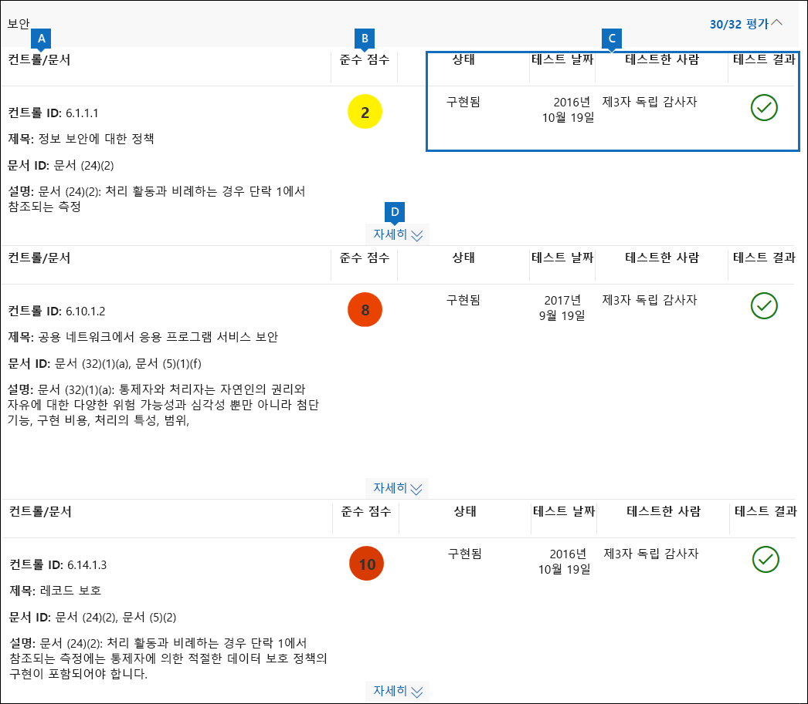
  
  a. Microsoft에 관리 컨트롤에 매핑되는 인증 또는 규정에서 다음 정보를 지정합니다.

  - **컨트롤 ID** - 컨트롤이 매핑되는 인증 또는 규정의 섹션 또는 문서 번호입니다.
    
  - **제목** - 해당 인증 또는 규정 의 제목입니다.
    
  - **문서 ID** - 이 필드는 해당 GDPR 문서 번호를 지정하므로 GDPR 평가의 경우에만 포함됩니다.
    
  - **설명** - 선택한 Microsoft 관리 컨트롤에 매핑되는 표준 또는 규정 텍스트입니다.

  b. 각 Microsoft 관리 컨트롤에 연결된 위험 수준(비준수 또는 컨트롤 오류로 인한)을 나타내는 컨트롤의 준수 점수. 자세한 내용은 [준수 점수 이해](#understanding-the-compliance-score)를 참조하세요. 준수 점수는 1~10까지이며 색상으로 구분됩니다. 노란색은 낮은 위험 컨트롤을 나타내고, 주황색은 중간 위험 컨트롤을 나타내고, 빨간색은 높은 위험 컨트롤을 나타냅니다. 
    
  c. 컨트롤의 구현 상태, 컨트롤이 테스트된 날짜, 테스트를 수행한 사람 및 테스트 결과에 대한 정보
    
  d. 각 컨트롤에 대해 **자세히**를 클릭하여 Microsoft의 컨트롤 구현 및 컨트롤이 독립적인 제3자 감사자에 의해 테스트 및 유효성 검사된 방법에 대한 세부 정보를 포함하는 추가 정보를 확인할 수 있습니다. 
    
- **고객 관리 컨트롤** - 조직이 관리하는 컨트롤의 모음입니다. 조직은 지정된 표준 또는 규정에 대한 준수 프로세스의 일환으로 이러한 컨트롤을 구현해야 합니다. 고객 관리 컨트롤 또한 해당 인증 또는 규정에 대한 컨트롤 패밀리로 구성됩니다. 고객 관리 컨트롤을 사용하여 준수 활동의 일환으로 Microsoft가 제안한 권장 작업을 구현합니다. 조직은 각 고객 관리 컨트롤에서 규정 지침 및 권장 고객 작업을 사용하여 해당 컨트롤에 대한 구현 및 평가 프로세스를 관리합니다.
    
    평가의 고객 관리 컨트롤에는 평가 완료에 대한 조직 진행 상황을 관리하고 추적하는 데 사용할 수 있는 기본 제공 워크플로 관리 기능도 있습니다. 예를 들어 조직의 준수 책임자는 해당 컨트롤에 대해 권장되는 작업을 수행하는 데 필요한 권한 및 책임이 있는 IT 관리자에게 작업 항목을 할당할 수 있습니다. 해당 작업이 완료되면 IT 관리자는 구현 태스크 증거를 업로드한 후(예를 들어 구성 또는 정책 설정의 스크린샷) 수집한 증거를 평가하고, 컨트롤 구현을 테스트하고, 구현 날짜 및 테스트 결과를 준수 관리자에서 기록할 수 있도록 작업 항목을 준수 책임자에게 다시 할당할 수 있습니다. 자세한 내용은 이 문서의 [평가 프로세스 관리](#managing-the-assessment-process) 섹션을 참조하세요. 
  
## 권한 및 역할 기반 액세스 제어

기본적으로 Office 365 또는 Azure AD 계정이 있는 조직 내의 모든 사용자는 준수 관리자에 액세스할 수 있고 준수 관리자에서 작업을 수행할 수 있습니다. 기본 사용 권한을 역할 기반 액세스 제어 모델로 변경할면 각 준수 관리자 역할에 한 명 이상의 사용자를 추가해야 합니다(다음 지침 참조). 사용자가 역할에 추가되면 해당 역할에 할당된 작업을 수행하기 위한 권한이 모든 사용자가 사용할 수 있는 기본 권한 ㅈ비합에서 제거되고, 해당 역할이 프로비전된 사용자만 준수 관리자에 액세스하고 해당 역할이 허용하는 작업을 수행할 수 있습니다.
  
역할 기반 액세스가 구현되면 정의된 준수 관리자 역할에 할당되지 않은 모든 사용자에게 게스트 액세스 권한이 부여됩니다.
  
> [!NOTE]
> 역할 기반 액세스 제어를 완전히 구현하여 준수 관리자에서 작업을 액세스 및 수행할 수 있는 사람을 관리하려면 기본 권한을 변경하기 위해 각 역할에 사용자를 추가해야 합니다. 예를 들어 사용자가 평가를 관리할 수 있도록 하는 역할에 사용자를 추가하면 해당 역할의 구성원만 평가를 관리할 수 있습니다. 마찬가지로, 사용자가 평가의 데이터를 읽을 수 있도록 하는 역할에 사용자를 추가하지 않으면 조직의 모든 사용자가 준수 관리자에 액세스하고 모든 평가의 데이터를 읽을 수 있습니다. 
  
다음 표에는 각 준수 관리자 사용 권한 및 허용되는 사용자 작업이 설명되어 있습니다. 또한 각 사용 권한이 할당된 역할도 제공됩니다.
  
||**준수 관리자 읽기 권한자**|**준수 관리자 참가자**|**준수 관리자 평가자**|**준수 관리자의 관리자**|**포털 관리자**|
|:-----|:-----|:-----|:-----|:-----|:-----|
|**데이터 읽기** - 사용자는 데이터를 읽을 수 있지만 편집할 수 없습니다.    |             |             |             |             |             |
|**데이터 편집** - 사용자는 테스트 결과 및 테스트 날짜 필드를 제외한 모든 필드를 편집할 수 있습니다.    ||             |             |             |             |
|**테스트 결과 편집** - 사용자는 테스트 결과 및 테스트 날짜 필드를 편집할 수 있습니다.    |||             |             |             |
|**평가 관리** - 사용자는 평가를 만들고 보관하고 삭제할 수 있습니다.    ||||             |             |
|**사용자 관리** - 사용자는 읽기 권한자, 참가자, 평가자, 관리자 역할에 조직의 다른 사용자를 추가할 수 있습니다. 조직에서 전역 관리자 역할이 있는 사용자만 포털 관리자 역할에서 사용자를 추가 또는 제거할 수 있습니다.    |||||             |
   
### 게스트 액세스
  
준수 관리자 액세스 권한이 구성된 후에 프로비전된 역할이 없는 사용자는 기본적으로 **게스트 액세스** 역할에 포함됩니다(Microsoft 계정과 같은 조직에서 프로비전하지 않은 계정 환경). 게스트 액세스 사용자는 모든 준수 관리자 기능에 대한 일부 권한만 가지며 조직의 준수 평가 데이터를 볼 수 없지만, 준수 관리자를 사용하여 Microsoft의 준수 평가 보고서 및 Service Trust 문서를 볼 수 있습니다. 액세스 가능 및 액세스 불가능 기능에 대한 설명을 보려면 아래 그림을 참조하세요. 여기서 액세스 가능한 기능은 파란색으로 표시되어 있고, 액세스 불가능한 기능은 빨간색으로 표시되어 있습니다. 
  
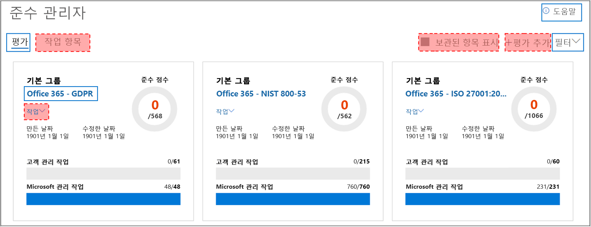
  
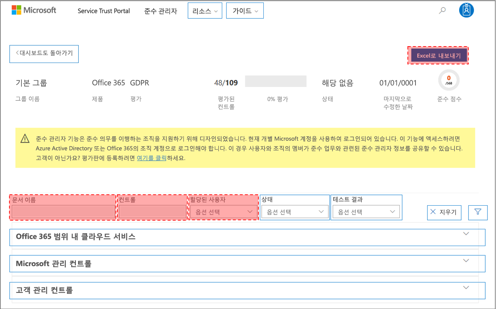

## 준수 점수 이해

대시보드에서 준수 관리자의 타일 오른쪽 위 모서리에는 Office 365 평가의 총점이 표시됩니다. 이것은 전체적인 준수 평가 점수 합계로, 평가에서 구현 및 테스트된 것으로 표시된 각 컨트롤 평가에 대해 수신된 누적 점수입니다. Microsoft가 구현하고 독립적인 제3자가 테스트한 Microsoft 관리 컨트롤에 대한 포인트가 이미 적용되었으므로 평가를 추가하면 준수 점수는 이미 거의 완료된 상태로 표시됩니다.
  
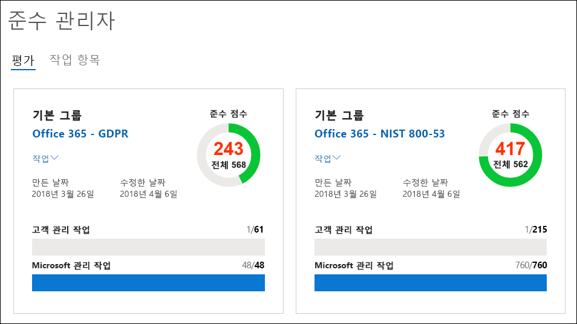
  
나머지 포인트는 성공적인 고객 평가, 고객 관리 컨트롤의 구현 및 테스트에서 가져오며, 고유한 각 값이 전체 준수 점수에 적용됩니다. 
  
각 평가는 평가의 각 컨트롤(Microsoft 관리 및 고객 관리 컨트롤 포함)과 ㅇㄴ결된 위험 수준을 평가하는 데 도움이 되는 위험 기반 준수 점수를 표시합니다. 각 고객 관리 컨트롤에는 1~10 사이의 포인트(*심각도 순위*)가 할당되며, 포인트가 높으면 컨트롤이 실패할 때 위험 요소가 더 높은 것이고, 포인트가 낮으면 위험 요소가 더 낮은 컨트롤을 의미합니다. 
  
예를 들어, 아래에 표시된 사용자 액세스 관리 평가 컨트롤은 심각도 위험 순위가 매우 높으며 할당된 값 10을 표시합니다.
  
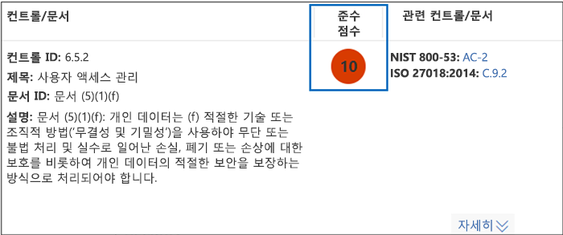
  
 비교해보면 아래에 표시된 정보 백업 평가 컨트롤은 심각도 위험 순위가 좀 더 낮으며 할당된 값 3을 표시합니다. 
  
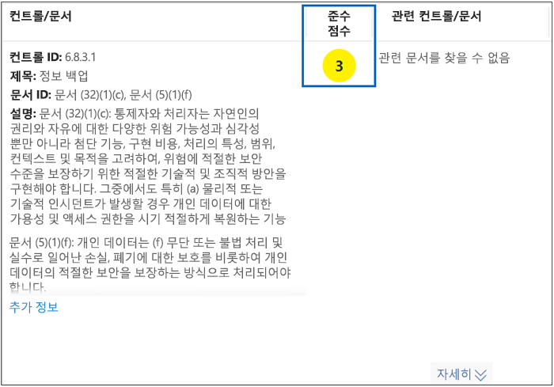
  
준수 관리자는 각 컨트롤에 기본 심각도 순위를 할당합니다. 위험 수준은 다음과 같은 조건을 기준으로 계산됩니다.
  
- 컨트롤이 현상을 인시던트 발생을 방지하는지(최고 순위), 발생한 인시던트를 감지하는지 또는 인시던트의 결과를 수정하는지(최저 순위). 심각도 순위 측면에서 위협을 방지하는 필수 컨트롤에 가장 높은 포인트가 할당되고, 감지 또는 수정 컨트롤(필수인지 사용자 지정인지는 관계없음)에는 가장 낮은 포인트가 할당됩니다.
    
- (구현된) 컨트롤이 필수이므로 사용자가 우회할 수 없는지(예를 들어 사용자가 암호 다시 설정하고 암호 길이 및 문자 요구 사항을 충족해야 함) 또는 사용자 지정이 가능하므로 사용자가 우회할 수 있는지(예를 들어 컴퓨터가 무인 방식으로 작동될 때 사용자에게 화면을 잠그도록 요구하는 비즈니스 규칙)
    
- 데이터 기밀성, 무결성 및 가용성에 미치는 위험과 관련된 컨트롤인지, 이러한 위험이 내부 또는 외부 위협에서 온 것인지, 위험이 악의적인지 부수적으로 발생한 것인지. 예를 들어 외부 공격자가 해당 네트워크의 보안을 침해하여 개인 식별 가능 정보에 액세스하지 못하도록 하는 데 도움이 되는 컨트롤은 직원이 네트워크 라우터 설정을 실수로 잘못 구성하여 네트워크를 중단시키는 일이 없도록 방지하는 컨트롤보다 더 많은 포인트가 할당됩니다.
    
- 각 컨트롤에 대한 법률 및 외부 요인(예: 계약, 규정 및 공개 약정)
    
컨트롤에 대해 표시되는 준수 점수 값은 통과/실패(컨트롤이 구현되고 후속 평가 테스트를 통과하는지 여부)에 따라 준수 총점에 *전체적으로* 적용됩니다. 즉, 부분적으로 구현되면 부분 크레딧이 적용되지 않습니다. 컨트롤의 해당 **구현 상태**가 **구현됨**으로 설정되거나 **대체 구현** 및 **테스트 결과**가 **통과**로 설정된 경우에만 할당된 포인트가 준수 총점에 추가됩니다. 
  
가장 중요한 점은 컨트롤과 관련된 오류가 있을 때 잠재적으로 위험이 더 높을 수 있는 컨트롤을 표시하여 구현 시 중점을 둘 컨트롤에 우선 순위를 두는 데 도움이 될 수 있다는 것입니다. 위험 기반 우선 순위 외에도, 평가 컨트롤이 다른 컨트롤과 관련이 있는 경우(같은 평가 내에서 또는 동일한 평가 그룹에 있는 다른 평가에서) 단일 컨트롤을 성공적으로 완료하는 경우 컨트롤 테스트 결과 의 동기화를 통해 작업 노력을 크기 줄일 수 있다는 점에 유의해야 합니다.
  
예를 들어 아래 이미지에서 Office 365 - GDPR 평가는 현재 111개 컨트롤 평가 중 51개가 완료되어 46%가 평가된 상태이며, 준수 총점은 600점 만점 중에서 289점으로 나와 있습니다.
  
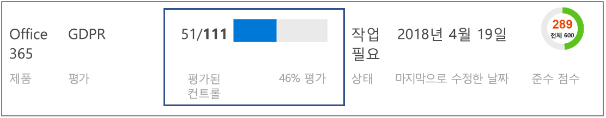
  
평가 내에서 GDPR 컨트롤 7.5.5는 심각도 순위 점수가 보통인 6부터 높은 점수에 해당하는 8까지 다양한 다른 5개의 컨트롤(7.4.1, 7.4.3, 7.4.4, 7.4.8 및 7.4.9)가 관련이 있습니다. 평가 필터를 사용하여 이러한 모든 컨트롤을 선택했으며, 아래와 같이 평가된 컨트롤이 없다고 표시되었습니다. 
  
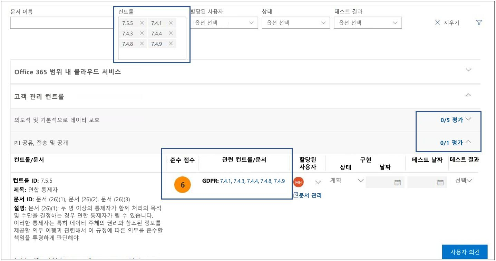 이러한 6개의 컨트롤이 관련되어 있으므로 하나가 완료되면 이 평가 내에서 관련 컨트롤 간에 해당 테스트 결과가 동기화됩니다(같은 평가 그룹에 있는 평가의 모든 관련 컨트롤의 경우와 같음). GDPR 컨트롤 7.5.5의 구현 및 테스트가 완료되면 컨트롤 세부 정보 영역이 새로 고쳐지면서 6개의 컨트롤이 모두 평가되었음이 표시되고, 평가된 컨트롤 수가 57개까지 증가하면서 51%가 평가된 것으로 표시되고 준수 총점은 +40씩 변경되어 표시됩니다. 
  
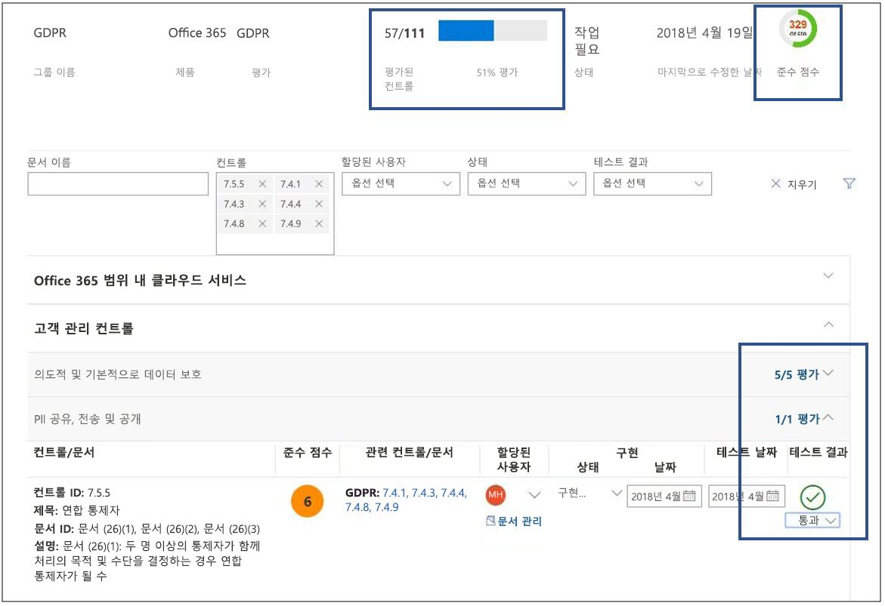
  
이 업데이트 확인 대화 상자는 관련 컨트롤의 구현 상태가 관련된 다른 컨트롤에 영향을 미치는 방식으로 변경되려고 할 때 표시됩니다.
  
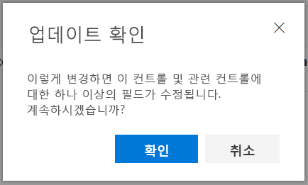
  
> [!NOTE]
> 현재, Office 365 클라우드 서비스에 대한 평가에만 준수 점수가 포함됩니다. Azure 및 Dynamics 평가는 평가 상태를 표시합니다. 

## 준수 점수 방법론

Microsoft 보안 점수와 같은 준수 점수는 다른 동작 기반 점수 지정 시스템과 비슷합니다. 즉, 조직은 데이터 보호, 개인 정보 보호 및 보안 관련 활동을 수행하면 해당 활동의 준수 점수가 증가할 수 있습니다.
  
> [!NOTE]
> 준수 점수는 특정 표준 및 규정에 대해 조직 차원의 규정 준수에 대한 절대 측정 결과를 나타내지 않습니다. 개인 데이터 및 개별 개인 정보 보호에 대한 위험을 줄일 수 있는 컨트롤 채택 수준을 나타냅니다. 사용자의 표준 또는 규정 준수를 보장하는 서비스는 없으며, 준수 점수는 어떤 경우든 준수 보장으로 해셕되면 안 됩니다. 
  
준수 관리자의 평가는 클라우드 컴퓨팅에 대한 공유 책임 모델을 기준으로 합니다. 공유 책임 모델에서 Microsoft와 모든 고객은 고객 데이터가 클라우드에서 보호될 때 해당 데이터 보호에 대한 책임을 공유합니다.
  
아래의 Office 365 GDPR 평가에 표시된 것처럼, Microsoft와 고객은 평가되는 표준 또는 규정의 요구 사항을 충족하도록 디자인된 다양한 작업을 수행할 책임이 이습니다. 다양한 표준 및 규정 과 관련해서 필요한 작업을 합리화하고 이해하기 위해 준수 관리자는 모든 표준 및 규정을 컨트롤 프레임워크처럼 다룹니다. 따라서 각 평가에 대해 Microsoft와 고객이 수행하는 작업은 다양한 컨트롤의 구현 및 유효성 검사를 포괄합니다.
  
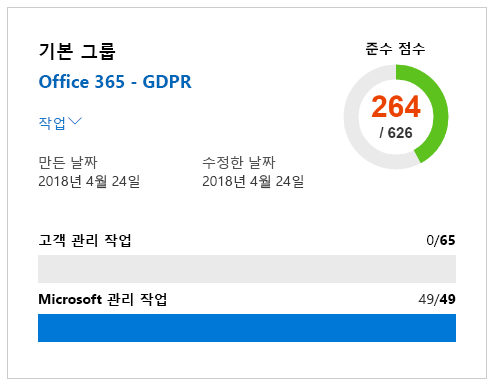
  
일반적인 작업에 대한 기본 워크플로는 다음과 같습니다.
  
1. 조직의 준수, 위험, 개인 정보 보호 및/또는 데이터 보호 관리자는 조직에서 컨트롤을 구현하는 사람에게 태스크를 할당합니다. 해당 사람은 다음일 수 있습니다.

    - 비즈니스 정책 소유자
    
    - IT 구현자
    
    - 태스크 수행 책임이 있는 조직의 다른 사람
    
2. 해당 개인은 컨트롤을 구현하는 데 필요한 태스크를 수행하고, 준수 관리자에 구현 증거를 업로드하고, 작업과 연결된 컨트롤을 구현된 컨트롤로 표시합니다. 이러한 태스크가 완료되면 유효성 검사를 위해 평가자에게 작업을 할당합니다. 평가자는 다음을 수행할 수 있습니다.
    
    - 조직 내에서 컨트롤의 유효성 검사를 수행하는 내부 평가자
    
    - Microsoft의 클라우드 서비스를 감사하는 독립적인 제3자 조직과 같이 준수를 검사하고 확인하고 인증하는 외부 평가자
    
3. 평가자는 컨트롤의 유효성을 검사하고, 증거를 검사하고, 컨트롤을 평가됨으로 표시하고 평가 결과를 표시합니다(예: 통과).
    
평가와 연결된 모든 컨트롤이 평가디면 평가는 완료로 간주됩니다.
  
준수 관리자의 모든 평가에는 Microsoft가 담당하는 컨트롤의 요구 사항을 충족 하기 위해 수행한 작업에 대한 세부 정보를 제공하는 정보가 미리 로드됩니다. 이 정보에는 Microsoft가 각 컨트롤을 구현한 방식 및 Microsoft의 구현이 제3자 감사자에 의해 평가되고 확인된 방법과 시기에 대한 세부 정보가 포함됩니다. 이러한 이유로, 각 평가에 대한 Microsoft 관리 컨트롤은 평가됨으로 표시되고 평가에 대한 준수 점수에 이 사실이 반영됩니다.
  
각 평가에는 책임 공유 모델을 기준으로 하는 준수 총점이 포함됩니다. Office 365에 대한 Microsoft의 컨트롤 구현 및 테스트 결과가 GDPR 평가와 연결된 가능한 전체 포인트에 반영됩니다. 고객이 각 고객 작업을 구현하고 테스트하면 평가에 대한 준수 점수가 컨트롤에 할당된 값만큼 늘어납니다. 
  
 ### 위험 기반 점수 지정 방법론
  
준수 관리자는 1~10으로 구분되는 위험 기반 점수 지정 방법을 사용합니다. 이 방법에서 컨트롤이 실패하거나 규정을 준수하지 않을 때 더 높은 위험을 나타내는 더 높은 값이 컨트롤에 할당됩니다. 준수 점수에 사용되는 점수 지정 시스템은 다음과 같은 몇 가지 핵심 요소을 기준으로 합니다.
  
- 컨트롤의 필수성
    
- 위협 종류에 따른 컨트롤의 위험 수준
    
- 컨트롤의 외부 구동 요인
    
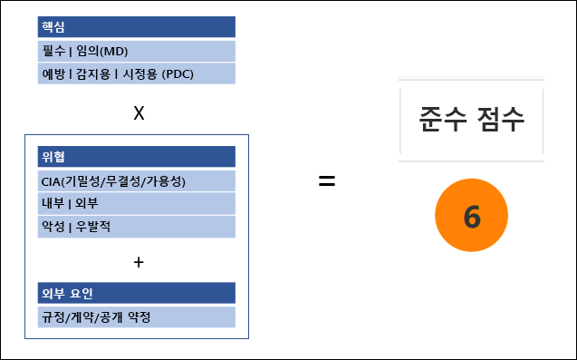
  
 ### 컨트롤의 필수성
  
컨트롤의 필수성은 컨트롤이 필수인지 또는 사용자 지정인지, 예방용인지, 감지용인지 또는 시정용인지를 기준으로 합니다.
  
 ### 필수 또는 사용자 지정
  
 *필수 컨트롤* - 의도적으로 또는 우연히 우회할 수 없는 컨트롤입니다. 일반적인 필수 컨트롤의 예는 암호 길이, 복잡성 및 만료에 대한 요구 사항을 설정하는 중앙에서 관리되는 암호 정책입니다. 사용자는 시스템에 액세스하기 위해 이러한 요구 사항을 준수해야 합니다. 
  
 *사용자 지정 컨트롤* - 정책을 이해하기 위해 사용자에게 의존하고, 그에 따라 작동합니다. 예를 들어, 사용자가 자리를 비울 때 컴퓨터를 잠그도록 요구하는 정책은 사용자에게 의존하기 때문에 사용자 지정 컨트롤입니다. 
  
 ### 예방용, 감지용 또는 시정용
  
 *예방용 컨트롤* - 특정 위험을 방지하는 컨트롤입니다. 예를 들어, 암호화를 사용하여 미사용 정보를 보호하는 작업은 공격, 위반 등에 대한 예방용 컨트롤입니다. 업무 분할은 이해의 상충을 관리하고 사기로부터 보호하기 위한 예방용 컨트롤입니다. 
  
 *감지용 컨트롤* - 위험을 나타내는 불규칙한 조건이나 동작을 식별하기 위해 시스템을 적극적으로 모니터링하거나, 침입을 감지하거나 위반이 발생했는지를 확인하는 데 사용될 수 있는 컨트롤입니다. 시스템 액세스 감사 및 권한 있는 관리 작업 감사는 감지용 모니터링 컨트롤 유형입니다. 규정 준수 감사는 프로세스 문제를 찾아내는 데 사용되는 감지용 컨트롤의 한 유형입니다. 
  
 *시정용 컨트롤* - 보안 인시던트가 미치는 부정적인 효과를 최소로 유지하고, 즉각적인 효과를 줄이는 시정 작업을 수행하고, 가능한 경우 손상을 복구하려고 하는 컨트롤입니다. 개인 정보 보호 인시던트 응답은 위반 후에 손상을 제한하고 시스템을 작동 상태로 복원하기 위한 시정용 컨트롤입니다. 
  
이러한 요소를 통해 각 컨트롤을 평가하여 컨트롤의 필수성을 확인하고, 위험을 기준으로 컨트롤이 나타내는 상대적인 가치를 할당합니다.
  
 **위협**
  
||||
|:-----|:-----|:-----|
||**필수**   |**사용자 지정**   |
|**예방용**   |높은 위험    |중간 위험    |
|**감지용**   |중간 위험    |낮은 위험    |
|**시정용**   |중간 위험    |낮은 위험    |
   
위협은 데이터에 대한 CIA 3요소인 기밀성, 무결성 및 가용성으로 알려진 기본적이면서 보편적으로 허용되는 보안 표준을 위협하는 모든 것을 나타냅니다.
  
- 기밀성은 신뢰할 수 있는 권한 있는 사용자만 정보를 읽고 이해할 수 있음을 의미합니다.
    
- 무결성은 권한 없는 사용자가 정보를 수정하거나 삭제하지 않았음을 의미합니다.
    
- 사용성은 높은 수준의 서비스 품질을 사용하여 정보에 쉽게 액세스할 수 있음을 의미합니다.
    
이러한 특성 중 하나라도 충족하지 못할 경우 시스템 보안이 전체적으로 위반된 것으로 간주됩니다. 위협은 내부 및 외부 원본에서 발생할 수 있으며 행위자의 위도는 우발적이거나 악의적일 수 있습니다. 이러한 요소는 각 시나리오 조합에 높음, 보통 또는 낮음 위협 수준을 할당하는 위협 매트릭스에서 평가됩니다.

||**내부** ||**외부**: ||||
|:-----|:-----|:-----|:-----|:-----|:-----|:-----|
||*악의적* |*우발적* |*악의적* |*우발적* |||
|**기밀성** |(H, M 또는 L)    |(H, M 또는 L)    |(H, M 또는 L)    |(H, M 또는 L)|
|**무결성** |(H, M 또는 L)    |(H, M 또는 L)    |(H, M 또는 L)    |(H, M 또는 L)|
|**가용성** |(H, M 또는 L)    |(H, M 또는 L)    |(H, M 또는 L)    |(H, M 또는 L)|
   
 **외부 요인**
  
|**계약**|**규정**|**공개 약정**|
|:-----|:-----|:-----|
|(H, M 또는 L)    |(H, M 또는 L)    |(H, M 또는 L)    |
   
해당 규정, 계약 및 공개 약정 등의 외부 요소는 데이터를 보호하고 데이터 위반을 방지하도록 디자인된 컨트롤에 영향을 미칠 수 있으며 이러한 각 요소에는 높음, 보통 또는 낮음의 위험 값이 할당됩니다.
  
CIA/위협 및 법적/외부 요인으로 표시되는 15가지의 가능한 위험 시나리오에서 이러한 높음, 보통 또는 낮음 위험 값의 예상 발생 횟수를 조합하여 위험 가중치를 부여합니다. 이러한 위험 가중치는 지정된 심각도 값에서 위험이 발생할 가능성 및 발생 횟수를 고려하며, 컨트롤의 심각도 순위를 계산할 때 고려됩니다.
  
해당 심각도 순위에 따라, 컨트롤에는 다음 위험 범주로 그룹화된 1(낮음)~10(높음) 사이의 준수 점수 값이 할당됩니다.
  
|**위험 수준**|**컨트롤 값**|
|:-----|:-----|
|낮음    |1-3    |
|보통    |6    |
|높음    |8    |
|심각    |10    |
   
조직은 준수 점수 값이 가장 높은 평가 컨트롤에 우선 순위를 부여하여 위험이 가장 높은 항목에 집중하며, 완료된 각 컨트롤 평가의 평가 준수 총점에 포인트를 추가하는 방식으로 더 높은 비율의 긍적적 피드백을 받습니다.
  
### 점수 지정 방법 요약
  
준수 점수는 준수 관리자가 조직이 준수 상태를 이해하고 관리하는 데 도움을 주는 방식의 핵심 구성 요소입니다. 평가의 준수 점수는 지정된 표준 또는 규정에 대한 회사 준수 상태를 숫자로 나타낸 것으로, 점수가 높을수록(평가에 할당된 최대 포인트 수 이내에서) 회사의 준수 태세가 좋은 것입니다. 조직은 평가 컨트롤에 1~10(낮음~높음)의 위험 심각도 값이 할당되는 준수 점수 지정 방법과 준수 총점에 완료된 컨트롤 평가가 추가되는 방식을 제대로 이해해야만 작업 우선 순위를 적절히 지정할 수 있습니다.

## 평가 그룹화

새 평가를 만들 경우 평가를 할당할 새 그룹을 만들지 또는 기존 그룹에 평가를 할당할지 묻는 메시지가 표시됩니다. 그룹을 사용하면 평가를 논리적으로 구성하고 평가 간에 동일하거나 관련된 고객 관리 컨트롤이 있는 워크플로 태스크와 공통 정보를 공유할 수 있습니다.
  
예를 들어, 연도 또는 조직 내의 팀, 부서, 기관별로 또는 연도별로 평가를 그룹화할 수 있습니다. 그룹 및 포함될 수 있는 평가 예는 다음과 같습니다.
  
- GDPR 평가 - 2018
    
  - Office 365 + GDPR
    
  - Azure + GDPR
    
  - Dynamics + GDPR
    
- Azure 평가 - 2018
    
  - Azure + GDPR
    
  - Azure + ISO 27001:2013
    
  - Azure + ISO 27018:2014
    
- 데이터 보안 및 개인 정보 보호 평가
    
  - Office 365 + ISO 27001:2013
    
  - Office 365 + ISO 27018:2014
    
  - Azure + ISO 27001:2013
    
  - Azure + ISO 27018:2014
    
> [!TIP]
> 새 평가를 추가하기 전에 먼저 조직에 대한 그룹화 전략을 결정하는 것이 좋습니다. 
  
다음은 평가를 그룹화하기 위한 요구 사항입니다.
  
- 그룹 이름(*그룹 ID*라고도 함)은 조직 내에서 고유해야 합니다. 
    
- 그룹에는 동일한 인증/규정에 대한 평가가 포함될 수 있지만 각 그룹은 특정 클라우드 서비스/인증 쌍에 대한 평가만 포함할 수 있습니다. 예를 들어, 하나의 그룹에 Office 365 및 GDPR에 대한 2개의 평가가 포함될 수는 없습니다. 마찬가지로, 하나의 그룹은 각가에 대한 해당 인증/규정이 다르기만 하면 동일한 클라우드 서비스에 대한 여러 평가를 포함할 수 있습니다.
    
평가가 그룹화에 추가되면 그룹화를 변경할 수 없습니다. 평가 그룹의 이름을 변경할 수 있으며, 이 경우 해당 그룹과 연결된 모든 평가에 대한 평가 그룹 이름이 변경됩니다. 새 평가 및 새 평가 그룹을 만들고 기존 평가의 정보를 복사할 수 있습니다. 이렇게 하면 다른 평가 그룹에 해당 평가의 복제본이 생성됩니다. 평가를 보관하면 해당 평가와 평가 그룹 간 관계가 끊어집니다. 관련된 다른 평가를 추가로 업데이트해도 보관된 평가에는 더 이상 반영되지 않습니다.
  
앞서 설명된 것처럼 그룹을 사용할 때의 한 가지 주요 이점은 같은 그룹의 두 개의 다른 평가가 동일한 고객 관리 컨트롤을 공유하면(따라서 고객 작업이 각 컨트롤에서 동일함), 한 평가에서 컨트롤의 구현 완료 세부 정보, 테스트 정보 및 상태가 그룹의 다른 평가에 있는 동일한 컨트롤과 동기화됩니다. 즉, 평가가 동일한 컨트롤을 공유하고 해당 평가가 동일한 그룹에 있으면 한 평가에서 해당 컨트롤에 대한 평가만 관리하면 됩니다. 해당 컨트롤의 결과는 다른 평가와 자동으로 동기화됩니다. 예를 들어, ISO 27001 및 ISO 27018에는 암호 정책과 관련된 컨트롤이 있습니다. 두 평가가 동일한 평가 그룹에 속하기만 하면, 해당 컨트롤의 테스트 상태가 한 평가에서 “통과”인 경우 다른 평가에서도 해당 컨트롤이 업데이트됩니다(“통과”로 표시).
  
이 단계의 예로, 공용 네트워크의 데이터 암호화와 관련이 있는 2개의 관련된 평가 컨트롤, 즉 Office 365 - GDPR 평가의 컨트롤 6.10.1.2와 Office 365 - NIST 800-53 평가의 컨트롤 SC-13을 고려해보세요. 이러한 컨트롤은 두 개의 다른 평가에서 둘 다 기본 그룹에 속하는 관련된 평가 컨트롤입니다. 처음에는 이러한 두 평가를 보여 주는 준수 관리자 대시보드에 표시되는 것처럼 어떤 평가에서도 고객 컨트롤 평가가 완료되지 않은 상태입니다.
  
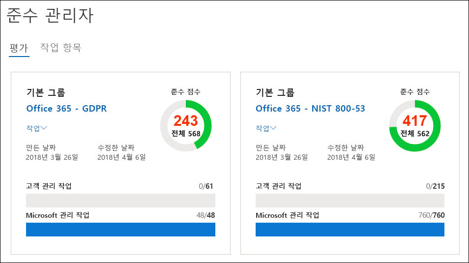
  
**Office 365 - GDPR** 평가를 클릭하고 필터 컨트롤을 사용하여 GDPR 컨트롤 6.10.1.2를 표시하면 NIST 800 53 컨트롤 SC-13이 관련된 컨트롤로 표시됩니다.
  
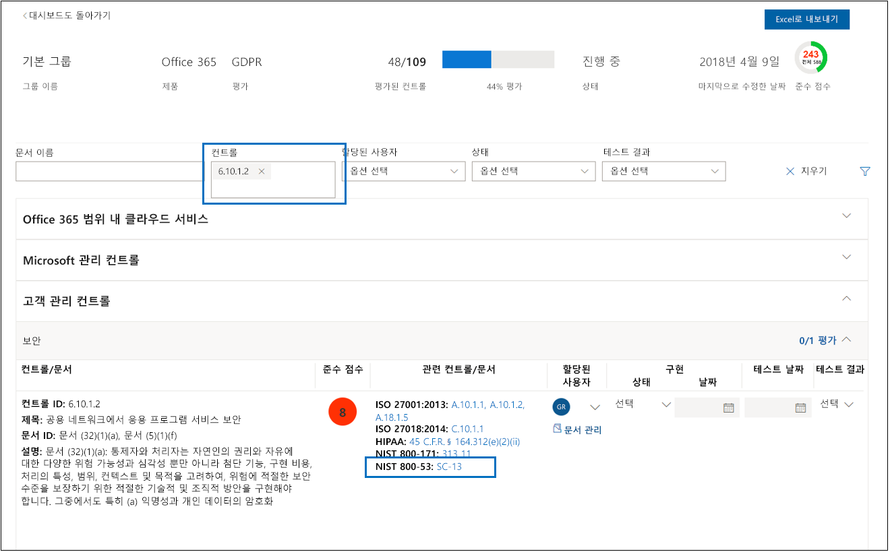
  
 여기서는 GDPR 컨트롤 6.10.1.2의 구현 및 테스트 완료가 표시됩니다. 
  
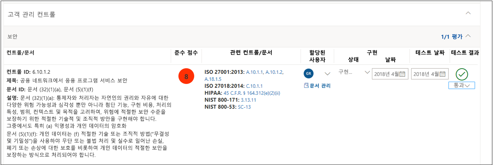
  
그룹화된 평가에서 관련 컨트롤로 이동하여 NIST 800 53 SC-13도 추가 구현 또는 테스트 작업 없이 같은 날짜 및 시간에 완료된 것으로 표시된 것을 볼 수 있습니다.
  
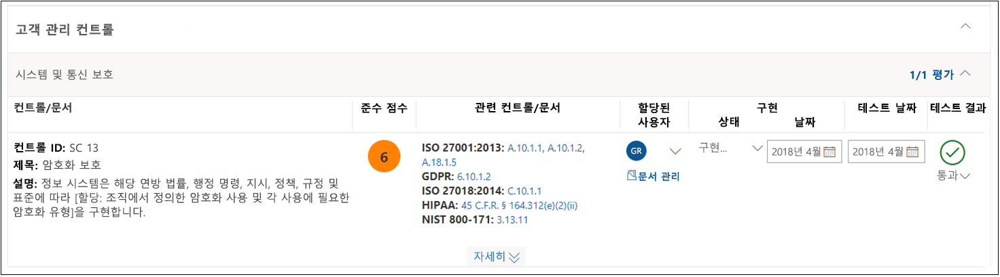
  
대시보드로 돌아가서 각 평가에서 1개의 컨트롤 평가가 완료되어 있고, 각 평가의 준수 총점이 8(각 공유 컨트롤의 준수 점수 값)씩 커진 것을 볼 수 있습니다.
  
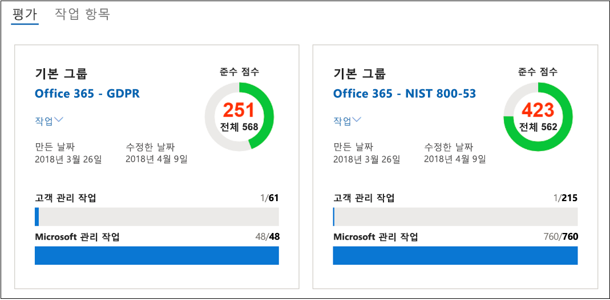

## 관리 기능

테넌트 관리자 계정만 사용할 수 있고, 전역 관리자로 로그인한 경우에만 볼 수 있는 특정 관리 함수가 있습니다.
  
> [!NOTE]
> 드롭다운 목록에서 제한된 문서에 대한 액세스 권한은 관리자가 Service Trust Portal에서 Microsoft가 공유하는 제한된 문서에 대한 액세스 권한을 사용자에게 부여할 수 있도록 합니다. 제한된 문서 기능은 사용할 수 없지만 곧 제공될 예정입니다. 
  
### 사용자에게 준수 관리자 역할 할당

각 준수 관리자 역할은 약간 다른 권한을 갖습니다. 각 역할에 할당된 권한을 보고, 어떤 역할에 어떤 사용자가 속하는지 확인하고, Service Trust Portal에서 **관리자** 메뉴 항목을 선택한 후 **설정**을 선택하여 해당 역할에서 사용자를 추가하거나 제거할 수 있습니다. 
  
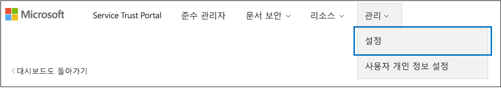
  
준수 관리자 역할에서 사용자를 추가하거나 제거하려면
  
1. [https://servicetrust.microsoft.com](https://servicetrust.microsoft.com)으로 이동합니다.
    
2. Azure Active Directory 전역 관리자 계정으로 로그인합니다.
    
3. Service Trust Portal 위쪽 메뉴 모음에서 **관리자**를 선택한 후 **설정**을 선택합니다. 
    
4. **역할 선택** 드롭다운 목록에서 관리하려는 역할을 클릭합니다. 
    
5. 각 역할에 추가된 사용자는 **역할 선택** 페이지에 표시됩니다. 
    
6. 이 역할에 사용자를 추가하려면 **추가**를 클릭합니다. **사용자 추가** 대화 상자에서 사용자 필드를 클릭합니다. 사용할 수 있는 사용자의 목록을 스크롤하거나 사용자 이름을 입력하여 검색어에 따라 목록을 필터링할 수 있습니다. 사용자를 클릭하여 해당 역할을 프로비전할 계정을 **사용자 추가** 목록에 추가합니다. 여러 사용자를 동시에 추가하려면 사용자 이름을 입력하여 목록을 필터링한 후 목록에 추가할 사용자를 클릭합니다. **저장**을 클릭하여 선택한 역할을 이러한 사용자에게 프로비전합니다. 
    
    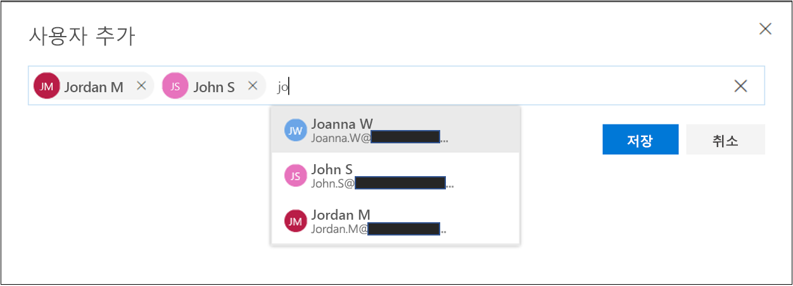
  
7. 이 역할에서 사용자를 제거하려면 사용자를 선택하고 **삭제**를 클릭합니다. 
    
    
 
## 사용자 개인 정보 설정

특정 규정을 준수하기 위해서는 조직이 사용자 기록 데이터를 삭제할 수 있어야 합니다. 이를 사용하도록 설정하기 위해 준수 관리자는 관리자가 다음을 수행할 수 있도록 하는 **사용자 개인 정보 설정** 기능을 제공합니다. 
  
- [사용자 검색](#search-for-a-user)

- [계정 데이터 기록의 보고서 내보내기](#export-report-of-account-data-history)

- [작업 항목 다시 할당](#reassign-action-items)

- [사용자 데이터 기록 삭제](#delete-user-data-history)
    
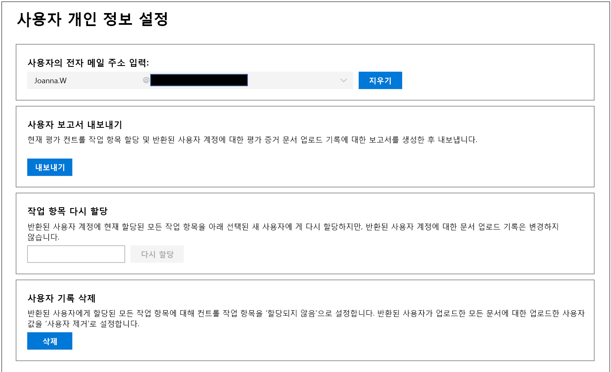
  
### 사용자 검색

사용자 계정을 검색하려면
  
1. 별칭(@ 기호 왼쪽 정보)을 입력하고, 오른쪽의 도메인 접미사 목록을 클릭한 후 도메인 이름을 선택하여 사용자 전자 메일 주소를 입력합니다. 등록된 여러 도메인이 있는 테넌트인 경우 전자 메일 주소 도메인 이름 접미사가 올바른지 한 번 더 확인합니다.
    
2. 사용자 이름을 올바르게 입력한 경우 **검색**을 클릭합니다. 
    
3. 사용자 계정이 없으면 페이지에 ‘사용자 찾을 수 없음’ 오류 메시지가 표시됩니다. 사용자의 전자 메일 주소 정보를 확인하고 필요에 따라 수정한 후 **검색**을 클릭하여 다시 시도합니다. 
    
4. 사용자 계정이 있으면 단추 텍스트가 **검색**에서 **지우기**로 바뀌어 바환된 사용자 계정이 아래 표시될 추가 기능에 대한 작동 상황이고, 이러한 기능을 실행하면 이 사용자 계정이 적용될 것임을 나타냅니다. 
    
5. 검색 결과를 지우고 다른 사용자를 검색하려면 **지우기**를 클릭합니다. 
    
### 계정 데이터 기록의 보고서 내보내기

사용자 계정을 식별한 후 이 계정에 연결된 상태를 유지하는 종속성 보고서를 생성할 수 있습니다. 이 정보를 사용하여 열린 작업 항목을 다시 할당하거나 이전에 업로드한 증거에 대한 액세스 권한을 확인할 수 있습니다. 
  
 보고서를 생성하고 내보내려면
  
1. **내보내기**를 클릭하여 반환된 사용자 계정에 현재 할당된 준수 관리자 컨트롤 작업 항목과 해당 사용자가 업로드한 문서 목록을 포함하는 보고서를 생성하고 다운로드할 수 있습니다. 할당된 작업이나 업로드된 문서가 없으면 “이 사용자에 대한 데이터가 없음”이라는 오류 메시지가 표시됩니다. 
    
2. 보고서는 활성 브라우저 다운로드 창의 백그라운드에서 다운로드되므로, 다운로드 팝업이 표시되지 않으면 브라우저 다운로드 기록을 확인할 수 있습니다.
    
3. 문서를 열어 보고서 데이터를 검토합니다.
    
> [!NOTE]
> 이 보고서는 작업 항목 할당 기록에 대한 상태 변경을 유지 및 표시하는 기록 보고서가 아닙니다. 생성된 보고서는 보고서가 실행되었을 때 할당된 컨트롤 작업 항목의 스냅숏입니다(보고서에 날짜 및 시간 스탬프가 기록됨). 예를 들어 이후에 작업 항목을 다시 할당한 후에 같은 사용자에 대해 이 보고서를 다시 생성하면 다른 스냅숏 보고서 데이터가 생성됩니다. 
  
### 작업 항목 다시 할당

이 기능을 사용하면 조직에서 반환된 사용자 계정의 모든 작업 항목 소유권(활성 및 완료된 작업 항목 모두 포함)을 아래에서 선택한 새 사용자에게 다시 할당하여 사용자 계정에 대한 활성 또는 보류 상태의 종속성을 모두 제거할 수 있습니다. 이 작업을 수행해도 반환된 사용자 계정에 대한 문서 업로드 기록은 변경되지 않습니다. 
  
 다른 사용자에게 작업 항목을 다시 할당하려면
  
1. 입력 상자를 클릭하여 반환된 사용자의 작업 항목을 할당할 조직 내의 다른 사용자를 검색한 후 선택합니다.
    
2. **바꾸기**를 선택하여 반환된 사용자의 모든 컨트롤 작업 항목을 새로 선택한 사용자에게 다시 할당합니다. 
    
3. “이 작업을 수행하면 현재 사용자의 모든 컨트롤 작업 항목이 선택한 사용자에게 다시 할당됩니다. 이 작업은 취소할 수 없습니다. 계속하시겠습니까?”라는 확인 대화 상자가 표시됩니다.
    
4. 계속하려면 **확인**을 클릭하고, 그렇지 않은 경우 **취소**를 클릭합니다. 
    
> [!NOTE]
> 모든 작업 항목(활성 및 완료된 항목 모두)이 새로 선택된 사용자에게 할당됩니다. 그러나 이 작업은 문서 업로드 기록에는 영향을 주지 않습니다. 이전에 할당된 사용자가 업로드한 모든 문서는 이전에 할당된 사용자의 날짜/시간 및 이름을 계속 표시합니다. 
  
문서 업로드 기록을 변경하여 이전에 할당된 사용자를 제거하려면 수동 프로세스로 진행해야 합니다. 이 경우 관리자는 다음을 수행해야 합니다.
  
1. 이전에 다운로드한 내보내기 보고서를 엽니다.
  
2. 원하는 컨트롤 작업 항목을 확인한 후 해당 항목으로 이동합니다.
  
3. **문서 관리**를 클릭하여 해당 컨트롤에 대한 증거 리포지토리로 이동합니다. 
  
4. 문서를 다운로드합니다.
  
5. 증거 리포지토리에서 문서를 삭제합니다.
  
6. 문서를 다시 업로드합니다. 이제 문서에는 새 업로드 날짜, 시간 및 업로드한 사용자 이름이 표시됩니다. 
  
### 사용자 데이터 기록 삭제

이 작업을 수행하면 컨트롤 작업 항목이 반환된 사용자에게 할당된 모든 작업 항목에 대해 ‘할당되지 않음’으로 설정됩니다. 또한 반환된 사용자가 업로드한 모든 문서의 업로드한 사용자 값이 ‘사용자가 제거함’으로 설정됩니다.
  
 사용자 계정 작업 항목 및 문서 업로드 기록을 삭제하려면
  
1. **삭제**를 클릭합니다. 

    “이 작업을 수행하면 선택한 사용자의 모든 컨트롤 작업 항목 할당 및 문서 업로드 기록이 제거됩니다. 이 작업은 취소할 수 없습니다. 계속하시겠습니까?”라는 확인 대화 상자가 표시됩니다.
    
3. 계속하려면 **확인**을 클릭하고, 그렇지 않은 경우 **취소**를 클릭합니다. 
  
## 준수 관리자 사용

준수 관리자는 준수 및 평가 관련 활동을 할당, 추적 및 기록하고, 조직이 팀 장벽을 넘어 규정 준수 목적을 달성하는 데 도움을 줄 수 있는 도구를 제공합니다.
  
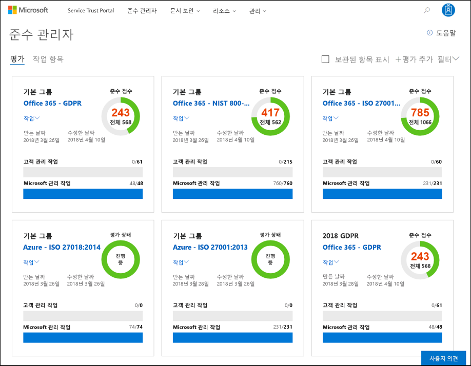

## 준수 관리자 액세스

Service Trust Portal에서 준수 관리자에 액세스할 수 있습니다. Microsoft 계정이 나 Azure Active Directory 조직 계정을 가진 사용자라면 누구나 준수 관리자에 액세스할 수 있습니다.
  

  
1. [https://servicetrust.microsoft.com](https://servicetrust.microsoft.com/)으로 이동합니다.
    
2. Azure AD(Azure Active Directory) 사용자 계정으로 로그인합니다.
    
3. Service Trust Portal에서 **준수 관리자**를 클릭합니다. 
    
4. 비밀 유지 계약이 표시되면 읽고 **동의함**을 클릭하여 계속합니다. 이 작업은 한 번만 수행하면 되며, 이 작업을 수행하면 준수 관리자 대시보드가 표시됩니다. 

    시작하기 위해 기본적으로 다음과 같은 평가를 추가했습니다.
    
    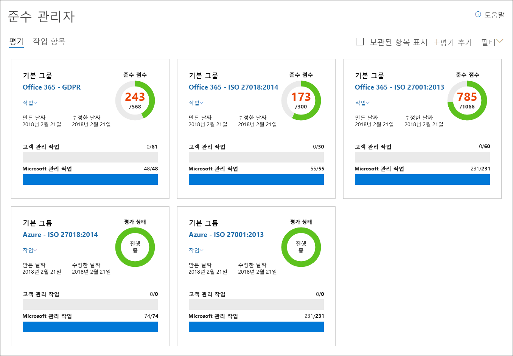
    
5.  **도움말**을 클릭하여 준수 관리자를 간단히 둘러봅니다. 
  
## 작업 항목 보기

준수 관리자는 할당된 모든 컨트롤 평가 작업 항목을 볼 수 있는 편리한 보기를 제공하고, 빠르고 쉽게 관련 작업을 수행할 수 있도록 합니다. 해당 평가와 연결된 탭을 클릭하여 모든 작업 항목을 보거나 특정 인증에 해당하는 작업 항목을 선택할 수 있습니다. 예를 들어, 아래 그림에서는 GDPR 탭이 선택되어 있으며 GDPR 평가와 관련된 컨트롤이 표시됩니다.
  
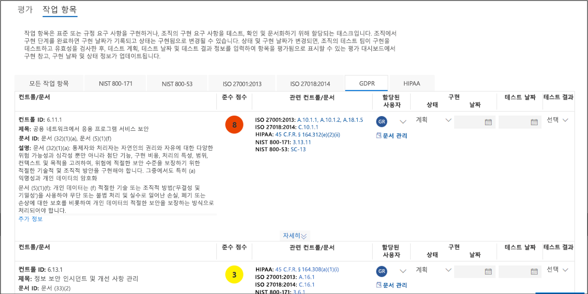
  
작업 항목을 보려면
  
1. 준수 관리자 대시보드로 이동합니다.
    
2. **작업 항목** 링크를 클릭하면 사용자에게 할당된 작업 항목을 표시하도록 페이지가 새로 고쳐집니다. 
    
    기본적으로 모든 작업 항목이 표시됩니다. 여러 인증에 걸쳐 있는 작업 항목이 있는 경우 인증 이름이 평가 컨트롤 위쪽의 탭에 나열됩니다. 특정 인증에 대한 작업 항목을 보려면 해당 탭을 클릭합니다.

## 평가 추가

준수 관리자에 평가를 추가하려면
  
1. 준수 관리자 대시보드에서  **평가 추가**를 클릭합니다. 
    
2. **평가 추가** 창에서 평가를 추가할 새 그룹을 만들거나, 기존 그룹에 평가를 추가할 수 있습니다(기본 제공 그룹 이름은 "초기 그룹"임). 선택하는 옵션에 따라 새 그룹의 이름을 입력하거나 드롭다운 선택 하는 옵션에 따라 새 그룹의 이름을 입력하거나 드롭다운 목록에서 기존 그룹을 선택합니다. 자세한 내용은 [평가 그룹화](meet-data-protection-and-regulatory-reqs-using-microsoft-cloud.md#grouping)를 참조하세요.
    
    새 그룹을 만드는 경우 기존 그룹의 정보를 새 평가에 복사하는 옵션도 제공됩니다. 즉, 복사하는 그룹의 평가에서 고객 관리 컨트롤의 구현 세부 정보, 테스트 계획 및 관리 응답 필드에 추가된 모든 정보가 새 평가의 동일한(또는 관련) 고객 관리 컨트롤에 복사됩니다. 기존 그룹에 새 평가를 추가하는 경우 해당 그룹의 평가에서 가져온 공통 정보가 새 평가로 복사됩니다. 자세한 내용은 [기존 평가에서 정보 복사](meet-data-protection-and-regulatory-reqs-using-microsoft-cloud.md#copying)를 참조하세요.
    
3. **다음**을 클릭하고 다음을 수행합니다.
    
    a. **제품 선택** 드롭다운 목록에서 준수 여부를 평가할 Microsoft 클라우드 서비스를 선택합니다. 
    
    b. **인증 선택** 드롭다운 목록에서 선택한 클라우드 서비스를 평가할 인증을 선택합니다. 
    
4. **대시보드에 추가**를 클릭하여 평가를 만듭니다. 평가는 준수 관리자 대시보드에서 기존 타일 목록 맨 끝에 새 타일로 추가됩니다. 
    
    준수 관리자 대시보드의 **평가 타일**에는 평가 그룹, 평가의 이름(서비스 이름 및 선택된 인증의 조합으로 자동으로 생성됨), 만든 날짜 및 마지막으로 수정한 날짜, 준수 총점(구현, 테스트 및 통과한 모든 할당된 컨트롤 위험 값의 합계), 진행률 표시기가 표시되고, 평가된 컨트롤 수가 맨 아래쪽에 표시됩니다. 
    
5. 평가 이름을 클릭하여 열고 평가 세부 정보를 확인합니다.
    
6. **작업** 메뉴를 클릭하여 할당된 작업 항목을 보거나, 평가 그룹 이름을 바꾸거나, 평가 보고서를 내보내거나, 평가를 보관합니다. 
    
    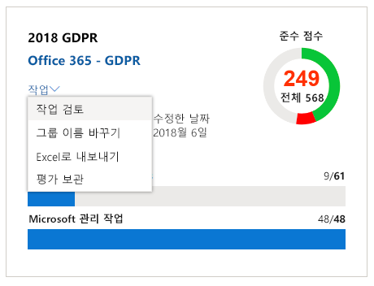

## 기존 평가의 정보 복사

앞서 설명한 것처럼 새 평가 그룹을 만들 때 기존 그룹의 평가 정보를 새 그룹의 새 평가에 복사하는 옵션이 제공됩니다. 이렇게 하면 완료된 평가 및 테스트 작업을 새 평가의 동일한 고객 관리 컨트롤에 적용할 수 있습니다. 예를 들어, 조직의 모든 GDPR 관련 평가에 대한 그룹이 있는 경우 새 평가를 그룹에 추가할 때 기존 평가 작업의 공통 정보를 복사할 수 있습니다.
  
고객의 다음 정보를 새 평가에 복사할 수 있습니다.
  
- 평가 사용자. 평가 사용자는 컨트롤이 할당된 사용자입니다.
    
- 상태, 테스트 날짜 및 테스트 결과
    
- 구현 세부 정보 및 테스트 계획 정보
    
마찬가지로 같은 평가 그룹 내의 공유되는 고객 관리 컨트롤의 정보가 동기화됩니다. 또한 동일한 평가 내의 관련 고객 관리 컨트롤의 정보도 동기화됩니다.

## 평가 보기

1. 보려는 평가에 해당하는 평가 타일을 찾은 후 평가 이름을 클릭하여 열고 평가와 연결된 Microsoft 및 고객 관리 컨트롤을 보고, 평가의 범위 내 클라우드 서비스 목록도 확인할 수 있습니다. 다음은 Office 365 및 GDPR에 대한 평가 예제입니다.
    
    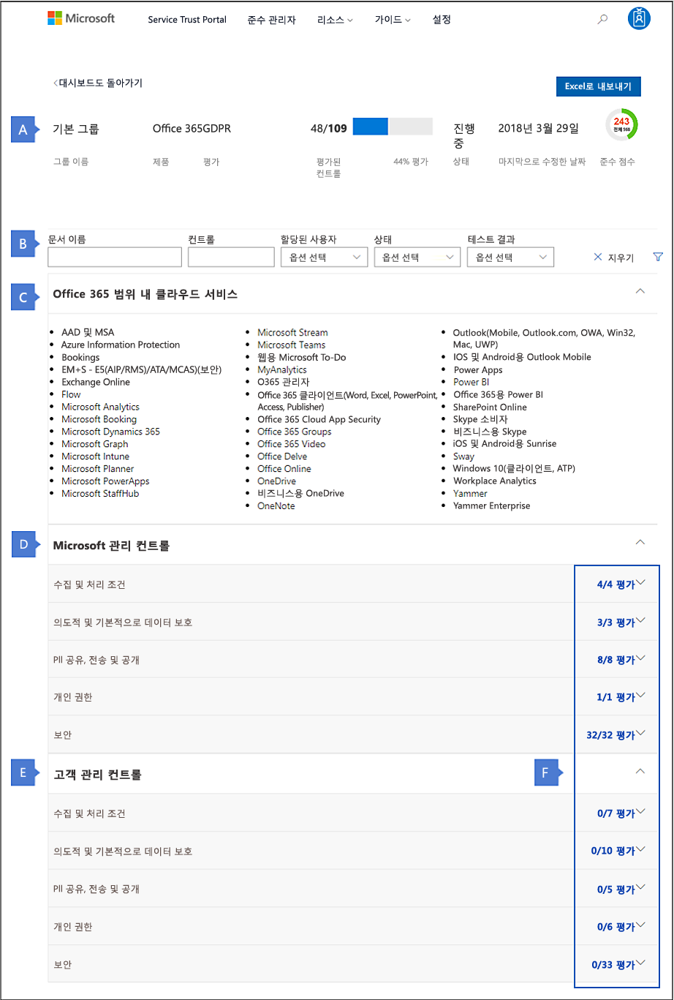
  
1. 이 섹션에는 평가 요약 정보를 평가 그룹, 제품, 평가 이름, 평가 컨트롤 수를 포함하는 평가 요약 정보가 표시됩니다.
    
2. 이 섹션에는 평가 필터 컨트롤이 표시됩니다. 평가 필터 컨트롤을 사용하는 방법에 대한 자세한 설명을 보려면 [평가 프로세스 관리](meet-data-protection-and-regulatory-reqs-using-microsoft-cloud.md#managecomplianceprocess_1) 섹션을 참조하세요. 
    
3. 이 섹션에는 평가 범위 내에 있는 개별 클라우드 서비스가 표시됩니다.
    
4. 이 섹션에는 Microsoft 관리 컨트롤이 포함되어 있습니다. 관련 컨트롤은 컨트롤 패밀리별로 구성됩니다. 컨트롤 패밀리를 클릭하여 확장하고 개별 컨트롤을 표시합니다.
    
5. 이 섹션에는 고객 관리 컨트롤이 포함되어 있습니다. 이 컨트롤도 컨트롤 패밀리별로 구성됩니다. 컨트롤 패밀리를 클릭하여 확장하고 개별 컨트롤을 표시합니다.
    
6. 컨트롤 패밀리의 컨트롤 총 수와 평가된 이러한 컨트롤 수가 표시됩니다. 준수 관리자의 주요 기능은 고객 관리 컨트롤 평가에 대한 조직 진행 상황을 추적하는 것입니다. 자세한 내용은 [준수 점수 이해](meet-data-protection-and-regulatory-reqs-using-microsoft-cloud.md#compliancescore) 섹션을 참조하세요. 

## 평가 프로세스 관리

평가의 작성자는 처음에는 평가 사용자 뿐입니다. 각 고객 관리 컨트롤에서 조직의 사용자에게 작업 항목을 할당하면 해당 사용자는 권장 고객 작업을 수행하고, 증거를 수집 및 업로드할 수 있는 평가 사용자가 됩니다. 작업 항목을 할당할 때 권장 고객 작업 및 작업 항목 우선 순위를 포함하는 세부 정보가 들어 있는 전자 메일을 해당 사용자에게 보내도록 선택할 수 있습니다. 전자 메일 알림에는 해당 사용자에게 할당된 모든 작업 항목을 나열하는 **작업 항목**에 대한 링크가 포함되어 있습니다. 
  
준수 관리자의 워크플로 기능을 사용하여 수행할 수 있는 작업의 목록은 다음과 같습니다.
  
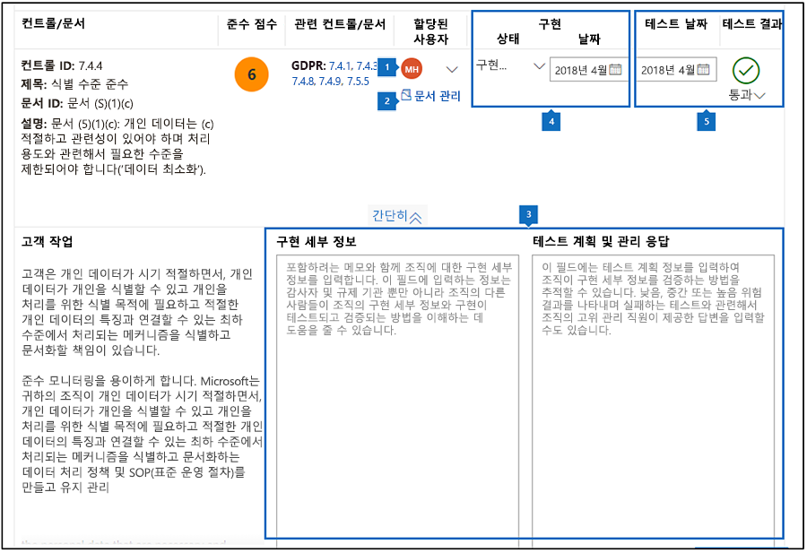
  
1. **필터 옵션을 사용하여 특정 평가 컨트롤 찾기** - 준수 관리자는 **필터 옵션**를 제공하여 평가 컨트롤을 표시하는 보다 세분화된 선택 조건을 제공함으로써 특정 영역에 대한 준수를 정확히 타기팅하는 데 도움을 줍니다. 
    
    **필터 옵션** 컨트롤을 표시하거나 숨기려면 페이지 오른쪽의 깔때기형 아이콘을 클릭합니다. 이러한 컨트롤을 사용하면 필터 조건을 지정할 수 있습니다. 그러면 해당 조건과 맞는 평가 컨트롤만 아래에 표시됩니다. 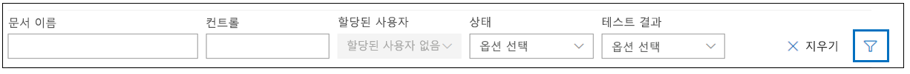
  
    - **문서** - 문서 이름으로 필터링하고 해당 문서에 연결된 평가 컨트롤을 반환합니다. 예를 들어, "문서(5)"는 이름에 문자열(예: 문서 (5)(1)(a), 문서 (5)(1)(b), 문서 (5)(1)(c) 등)이 포함된 문서의 선택 목록을 반환합니다. 문서 (5)(1)(c)를 선택하면 문서 (5)(1)(c)와 연결된 컨트롤이 반환됩니다. 이것은 여러 값에 OR 연산자를 사용하는 다중 선택 필드입니다. 예를 들어, 문서 (5)(1)(a)를 선택한 후 문서 (5)(1)(c)를 선택하면 필터는 문서 (5)(1)(a) 또는 문서 (5)(1)(c)와 연결된 컨트롤을 반환합니다. 
    
      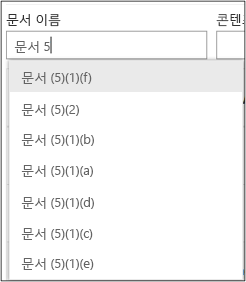
  
    - **컨트롤** - 이름이 필터에 맞는 컨트롤 목록을 반환합니다. 즉, 7.3을 입력하면 7.3.1, 7.3.4, 7.3.5 등과 같은 항목의 선택 목록이 반환됩니다. 이것은 여러 값에 OR 연산자를 사용하는 다중 선택 필드입니다. 예를 들어, 7.3.1을 선택한 후 7.3.4를 선택하면 필터는 7.3.1 또는 7.3.4와 연결된 컨트롤을 반환합니다. 
    
      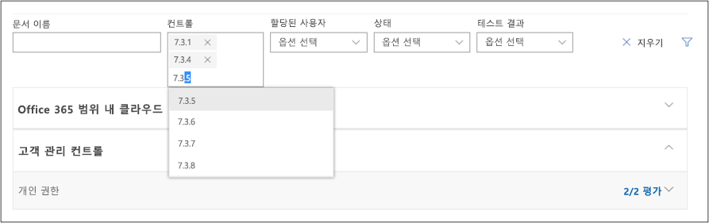
  
    - **할당된 사용자** - 선택한 사용자에게 할당된 컨트롤의 목록을 반환합니다. 
    
    - **상태** - 선택된 상태를 갖는 컨트롤 목록을 반환합니다. 
    
    - **테스트 결과** - 선택된 테스트 결과를 갖는 컨트롤 목록을 반환합니다. 
    
    필터 조건을 적용할 때 해당 컨트롤의 보기가 필터 조건에 맞게 변경됩니다. 컨트롤 패밀리 섹션을 확장하여 아래에 컨트롤 세부 정보를 표시합니다. 
    
    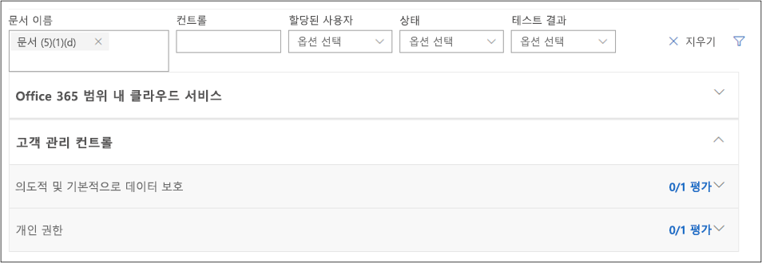
  
2. 원하는 필터를 선택한 후에 결과가 표시되지 않으면 지정된 필터 조건에 해당 하는 컨트롤이 없는 것입니다. 예를 들어, 특정 **할당 된 사용자**를 선택한 후 해당 사용자에게 할당된 커트롤에 해당하는 **컨트롤** 이름을 선택하면 아래 페이지에 평가가 표시되지 않습니다. 
    
3. **사용자에게 작업 항목 할당** - 인증/규정의 요구 사항을 구현하거나, 조직의 구현 요구 사항을 테스트, 확인 및 문서화하기 위해 사용자에게 작업 항목을 할당할 수 있습니다. 작업 항목을 할당할 때 권장되는 고객 작업 및 작업 항목 우선 순위를 포함하는 세부 정보가 포함된 전자 메일을 해당 사용자에게 보내도록 선택할 수 있습니다. 작업 항목을 할당 취소한 후 다른 사용자에게 다시 할당할 수도 있습니다. 
    
4. **문서 관리** - 고객 관리 컨트롤에는 구현 태스크 수행과 관련이 있는 문서를 관리하고, 테스트 및 유효성 검사 태스크를 수행하기 위치도 있습니다. 준수 관리자에서 데이터를 편집할 수 있는 권한이 있는 모든 사용자는 **문서 관리**를 클릭하여 문서를 업로드할 수 있습니다. 문서가 업로드된 후에 **문서 관리**를 클릭하여 파일을 보고 다운로드할 수 있습니다. 
    
5. **구현 및 테스트 세부 정보 제공** - 모든 고객 관리 컨트롤에는 사용자가 해당 조직이 인증/규정 요구 사항을 충족하고 조직이 이러한 요구 사항을 충족시키는 방법이 유효한지 검사하고 문서화하기 위해 수행한 단계를 문서화하는 구현 세부 정보를 추가할 수 있는 편집 가능한 필드가 있습니다.
    
6. **상태 설정** - 평가 프로세스의 일환으로 각 항목에 대한 상태를 설정합니다. 사용 가능한 상태 값은 **구현됨**, **대체 구현**, **계획됨** 및 **범위에 없음**입니다. 
    
7. **테스트 날짜 및 테스트 결과 입력** - 준수 관리자 평가자 역할이 있는 사용자는 적절한 테스트가 수행되었는지 확인하고, 구현 세부 정보, 테스트 계획, 테스트 결과 및 업로드한 증거를 검토한 후 테스트 날짜 및 테스트 결과를 설정할 수 있습니다. 사용 가능한 테스트 결과 값은 **성공**, **실패 위험 낮음**, **실패 위험 보통** **k** 및 **실패 위험 높음**입니다. 

## 작업 항목 관리

조직에서 평가 프로세스에 관여하는 사용자는 준수 관리자를 사용하여 사용하는 모든 평가에서 고객 관리 컨트롤을 검토할 수 있습니다. 사용자가 준수 관리자에 로그인하고 **작업 항목** 대시보드를 열면 할당된 작업 항목 목록이 표시됩니다. 사용자에게 할당된 준수 관리자 역할에 따라 구현 또는 테스트 세부 정보를 제공하거나, 상태를 업데이트하거나, 작업 항목을 할당할 수 있습니다. 
  
일반적으로 한 사람이 인증 컨트롤을 구현하고, 다른 사람이 테스트하는 경우, 컨트롤 작업 항목이 처음에는 구현을 위해 한 사람에게 할당되고, 구현이 완료된 후 해당 사람이 컨트롤 테스트 및 증거 업로드를 위해 다음 사람에게 컨트롤 작업 항목을 다시 할당할 수 있습니다. 컨트롤 작업의 이러한 할당/재할당은 충분한 권한이 있는 준수 관리자 역할의 모든 사용자가 수행할 수 있으며, 컨트롤 할당의 중앙 관리 또는 구현자로부터 테스터까지 컨트롤 작업 항목의 분산 라우팅이 허용됩니다.
  
작업 항목을 할당하려면
  
1. 준수 관리자 대시보드에서 사용하려는 평가의 평가 타일을 찾은 후 평가 이름을 클릭하여 평가 세부 정보 페이지로 이동합니다.
    
2. **필터**를 클릭하고 필터 컨트롤을 사용하여 할당하려는 특정 평가 컨트롤을 찾을 수 있습니다. 또는 
    
3. 아래의 고객 관리 컨트롤 섹션으로 스크롤하고, 컨트롤 패밀리를 확장한 후 할당할 평가 컨트롤을 찾을 때까지 컨트롤 목록을 따라 스크롤합니다.
    
4. **할당된 사용자** 열 아래에서 **할당**을 클릭합니다. 
    
5. 작업 항목 할당 대화 상자에서 **할당 대상** 필드를 클릭하여 작업을 할당할 수 있는 사용자 목록을 채웁니다. 목록을 따라 스크롤하여 대상 사용자를 찾거나 필드에 입력하여 사용자 이름을 검색할 수 있습니다. 
    
6. 이 작업 항목을 할당할 사용자를 클릭합니다.
    
7. 알림 정보를 포함하는 전자 메일 알림을 사용자에게 보내려면 **전자 메일 알림 보내기** 확인란을 선택합니다. 
    
8. 해당 사용자에게 표시할 메모를 입력하고 **할당**을 클릭합니다. 
 
    사용자는 각 작업 항목 할당 및 메모가 포함된 알림을 받게 됩니다.
    
작업 항목에 연결된 메모는 메모 섹션에 저장되고, 다음번에 작업 항목이 할당될 때 사용할 수 있게 됩니다. 이러한 메모는 읽기 전용이 아니므로 작업 항목을 할당하는 사용자가 편집, 대체 또는 제거할 수 있습니다.

## 평가의 정보 내보내기

조직의 준수 관련자가 검토하고 감사자 및 규제 기관에 제공할 수 있는 Excel 파일로 평가를 내보낼 수 있습니다. 이 평가 보고서는 보고서가 생성된 날짜 및 시간에 대한 평가 스냅숏으로, 컨트롤 구현 상태, 컨트롤 테스트 날짜와 테스트 결과를 비롯하여 해당 평가에 대한 Microsoft 관리 컨트롤 및 고객 관리 컨트롤의 세부 정보를 포함하고, 업로드된 증거 문서에 대한 링크를 제공합니다. 보관된 평가는 업로드된 문서에 대한 링크를 보존하지 않으므로 평가를 보관하기 전에 평가 보고서를 내보내는 것이 좋습니다.
  
평가 보고서를 내보내려면
  
- 준수 관리자 대시보드에서 내보내려는 평가 타일에 있는 **작업**을 클릭한 후 **Excel로 내보내기**를 선택합니다.

  또는
    
- 평가 세부 정보 페이지를 보고 있는 경우 페이지 오른쪽 위 모서리에서 평가 준수 점수 위에 있는 **Excel로 내보내기** 단추를 클릭합니다.
    
평가 보고서는 브라우저 세션에서 다운로드됩니다. 이 사실을 알리는 팝업이 표시되지 않으면 브라우저의 다운로드 폴더를 확인할 수 있습니다.

## 평가 보관

평가를 완료했으며 준수 목적으로 더 이상 필요하지 않은 경우 보관할 수 있습니다. 평가가 보관되면 평가 대시보드에서 제거됩니다.
  
> [!NOTE]
> 평가가 보관되면 진행 상태에서 ‘보관 취소’하거나 읽기-쓰기로 복원할 수 없습니다. 보관된 평가는 업로드된 증거 문서에 대한 링크를 유지하지 않으므로 반드시 보관하기 전에 평가 내보내기를 수행하도록 합니다. 내보낸 평가 보고서에는 증가 문서에 대한 링크가 포함되어 있으므로 계속 액세스할 수 있습니다. 
  
평가를 보관하려면
  
1. 원하는 평가의 대시보드 타일에서 **작업**을 클릭합니다. 
    
2. **평가 보관**을 선택합니다. 
 
    평가를 보관할 것인지 확인하는 **평가 보관** 대화 상자가 표시됩니다.
    
4. 보관을 계속하려면 **보관** 또는 **취소**를 클릭합니다. 
    
보관된 평가를 보려면
  
1. 준수 관리자 대시보드에서 **보관된 평가 표시** 확인란을 선택합니다. 
    
    보관된 평가가 **보관된 평가** 표시줄 아래에서 나머지 활성 평가 아래에 새로 표시되는 섹션에 표시됩니다.
    
3. 보려는 평가의 이름을 클릭합니다.
    
보관된 평가를 볼 때 일반적으로 편집 가능한 컨트롤(즉, 구현, 테스트 결과)는 전혀 활성화되지 않으며 **관리되는 문서** 단추는 없습니다.

## 검색 사용

  
페이지의 오른쪽 위 모서리에 있는 돋보기를 클릭하여 검색 입력 필드를 확장하고, 검색 용어를 입력한 후 Enter 키를 누릅니다. 검색 컨트롤이 나타나고, 검색 창 입력 필드에는 검색 용어가 표시되며 아래에 검색 결과가 표시됩니다.
  
기본적으로 검색은 문서 결과를 반환하며, 필터 기준 드롭다운 목록을 사용하여 표시되는 문서 목록을 구체화하고, 보기에서 검색 결과를 추가 또는 제거할 수 있습니다. 여러 필터 특성을 동시에 사용하여 반환되는 문서의 범위를 특정 클라우드 서비스, 준수 또는 보안 조치 범주, 지역 또는 산업 분야로 좁힐 수 있습니다. 문서를 다운로드하려면 문서 이름 링크를 클릭합니다.
  

  
준수 관리자 링크를 클릭하여 준수 관리자 평가 컨트롤에 대한 검색 결과를 표시합니다. 나열된 검색 결과에는 평가가 생성된 날짜, 평가 그룹의 이름, 적용 가능한 클라우드 서비스 및 Microsoft 관리 컨트롤인지 아니면 고객 관리 컨트롤인지 등이 표시됩니다.
  

  
> [!NOTE]
> Service Trust Portal 보고서 및 문서는 새 버전이 게시되고 12개월 동안 또는 새 버전의 문서가 사용 가능해질 때까지 다운로드할 수 있습니다. 
 
## 지역화 지원

Service Trust Portal에서 다양한 언어로 페이지 콘텐츠를 볼 수 있습니다. 페이지 언어를 변경하려면 페이지의 왼쪽 아래 모서리에서 지구본 아이콘을 클릭 하고 원하는 언어를 선택합니다. 
  

## 고객 관리 컨트롤에 대한 변경 로그

준수 관리자는 클라우드 서비스의 변경 내용 뿐만 아니라 규정 요구 사항의 변경에 따라 정기적으로 업데이트되도록 디자인되었습니다. 이러한 업데이트에는 고객 관리 컨트롤에 대한 변경 내용이 포함됩니다. 추가 또는 변경되는 콘텐츠에 대한 세부 정보 및 기존 평가에 이러한 변경이 미치는 효과에 대한 지침을 비롯하여 이러한 변경이 미치는 영향을 이해하는 데 도움이 되는 변경 로그가 제공됩니다. 일반적으로 다음 두 가지 유형의 변경 내용이 있습니다.
  
- **중요한** 변경은 컨트롤 또는 번호가 매겨진 특정 단계의 추가나 제거 또는 책임, 권장 사항 또는 증거에 대한 지침 변경 등, 고객 작업에 대한 중요한 변경을 나타냅니다. 중요한 변경의 경우 영향을 받는 컨트롤의 구현 및/또는 평가를 다시 평가하는 것이 좋습니다.
    
- **사소한** 변경은 철자 또는 서긱 문제의 수정 또는 하이퍼링크의 업데이트나 수정 같은 고객 작업에 대한 사소한 변경을 나타냅니다. 사소한 변경의 경우 일반적으로 컨트롤을 다시 평가할 필요가 없으며, 업데이트된 고객 작업을 검토하는 것이 좋습니다.
  
### Office 365 고객 관리 컨트롤 - 2018년 7월 변경 로그

|**컨트롤 ID**|**평가**|**변경 유형**|**변경 설명**|**고객을 위한 권장 작업**|
|:-----|:-----|:-----|:-----|:-----|:-----|:-----|:-----|:-----|
|45 C.F.R. § 164.308(a)(7)(ii)(A)  |Office 365: HIPAA|중요|Office 365에 대한 HIPAA 평가에 HITECH 컨트롤이 추가되었습니다. |추가된 컨트롤 및 권장되는 고객 작업 검토  |
|45 C.F.R.  164.312(a)(6)(ii)|Office 365: HIPAA|중요|Office 365에 대한 HIPAA 평가에 HITECH 컨트롤이 추가되었습니다.|추가된 컨트롤 및 권장되는 고객 작업 검토 |
45 C.F.R. § 164.312(c)(1)| Office 365: HIPAA|중요| Office 365에 대한 HIPAA 평가에 HITECH 컨트롤이 추가되었습니다. |추가된 컨트롤 및 권장되는 고객 작업 검토  |
45 C.F.R.  § 164.316(b)(2)(iii)| Office 365: HIPAA|중요|Office 365에 대한 HIPAA 평가에 HITECH 컨트롤이 추가되었습니다.|추가된 컨트롤 및 권장되는 고객 작업 검토 |
|

### Office 365 고객 관리 컨트롤 - 2018년 4월 변경 로그

|**GDPR**|**HIPAA**|**ISO 27001**|**ISO 27018**|**NIST 800-53**|**NIST 800-171**|**변경 유형**|**변경 설명**|**고객을 위한 권장 작업**|
|:-----|:-----|:-----|:-----|:-----|:-----|:-----|:-----|:-----|
|6.13.2    |||C.16.1.1    |||중요    |이전에는 6.12.1.1로 번호가 매겨졌습니다.    권장 사항에 세부 정보가 추가되었습니다.    |컨트롤 다시 평가: 고객 작업의 업데이트된 지침을 검토하고 컨트롤 구현 및 평가에 대해 권장되는 단계를 따릅니다.    |
||||||3.1.6    |중요    |감사를 사용하도록 설정하고 감사 로그를 검색하는 단계를 비롯한 단계가 지침에 추가되었습니다.    |고객 작업의 업데이트된 권장 사항을 검토합니다.    |
|6.8.2    |||A.10.2    |||중요    |이전에는 6.7.2.9로 번호가 매겨졌습니다.    추가 권장 사항 및 작업 항목으로 지침이 업데이트되었습니다.    |컨트롤 다시 평가: 고객 작업의 업데이트된 지침을 검토하고 컨트롤 구현 및 평가에 대해 권장되는 단계를 따릅니다.    |
|6.6.4    |45 C.F.R. § 164.312(a)(2)(i)              45 C.F.R. § 164.312(d)    |A.9.4.2    ||IA-2    |3.5.1    |중요    |이전에는 6.5.2.3으로 번호가 매겨졌습니다.    추가 권장 사항 및 작업 항목으로 지침이 업데이트되었습니다.    |컨트롤 다시 평가: 고객 작업의 업데이트된 지침을 검토하고 컨트롤 구현 및 평가에 대해 권장되는 단계를 따릅니다.    |
|6.13.1    |45 C.F.R. § 164.308(a)(1)(i)    |A.16.1    |C.16.1    |IR-4(a)    |3.6.1    |중요    |이전에는 6.12.1로 번호가 매겨졌습니다.    추가 권장 사항 및 작업 항목으로 지침이 업데이트되었습니다.    |컨트롤 다시 평가: 고객 작업의 업데이트된 지침을 검토하고 컨트롤 구현 및 평가에 대해 권장되는 단계를 따릅니다.    |
|6.7    ||||||중요    |이전에는 6.6.1.1으로 번호가 매겨졌습니다.    추가 권장 사항 및 작업 항목으로 지침이 업데이트되었습니다.    |컨트롤 다시 평가: 고객 작업의 업데이트된 지침을 검토하고 컨트롤 구현 및 평가에 대해 권장되는 단계를 따릅니다.    |
|6.6.5    |||A.10.8    |IA-3    |3.5.2    |중요    |이전에는 6.5.4.2로 번호가 매겨졌습니다.    추가 권장 사항 및 작업 항목으로 지침이 업데이트되었습니다.    |컨트롤 다시 평가: 고객 작업의 업데이트된 지침을 검토하고 컨트롤 구현 및 평가에 대해 권장되는 단계를 따릅니다.    |
|6.15.1    ||||||중요    |이전에는 6.14.1.3으로 번호가 매겨졌습니다.    추가 권장 사항 및 작업 항목으로 지침이 업데이트되었습니다.    |컨트롤 다시 평가: 고객 작업의 업데이트된 지침을 검토하고 컨트롤 구현 및 평가에 대해 권장되는 단계를 따릅니다.    |
|||||AC-2(h)(2)    ||사소    |감사 사용 블레이드에 대한 링크가 추가되었습니다.    |필요한 작업은 없습니다.    |
|||||AC-2(7)(b)    ||사소    |감사 사용 블레이드에 대한 링크가 추가되었습니다.    |필요한 작업은 없습니다.    |
|||||AC-2(h)(1)    ||사소    |감사 사용 블레이드에 대한 링크가 추가되었습니다.    |필요한 작업은 없습니다.    |
||45 C.F.R. § 164.308(a)(5)(ii)(C)    |||AC-2(g)    ||사소    |감사 사용 블레이드에 대한 링크가 추가되었습니다.    |필요한 작업은 없습니다.    |
|||||AC-2(12)    ||사소    |감사 사용 블레이드에 대한 링크가 추가되었습니다.    |필요한 작업은 없습니다.    |
||45 C.F.R. § 164.312(b)    |A.12.4.3    ||AU-2(d)    ||사소    |감사 사용 블레이드에 대한 링크가 추가되었습니다.    |필요한 작업은 없습니다.    |
|||||AC-2(4)    ||사소    |감사 사용 블레이드에 대한 링크가 추가되었습니다.    |필요한 작업은 없습니다.    |
||||||3.1.7    |사소    |감사 사용 블레이드에 대한 링크가 추가되었습니다.    |필요한 작업은 없습니다.    |
|||A.16.1.7    |C.12.4.2, 2부    |||사소    |감사 사용 블레이드에 대한 링크가 추가되었습니다.    |필요한 작업은 없습니다.    |
|||||AC-2(h)(3)    ||사소    |감사 사용 블레이드에 대한 링크가 추가되었습니다.    |필요한 작업은 없습니다.    |
|||A.12.4.2    ||||사소    |감사 사용 블레이드에 대한 링크가 추가되었습니다.    |필요한 작업은 없습니다.    |
|||A.7.2.8    ||||사소    |콘텐츠 검색 블레이드 및 DSR 포털에 대한 링크가 추가되었습니다.    |필요한 작업은 없습니다.    |
||45 C.F.R. § 164.308(a)(3)(ii)(C)    |||||사소    |감사 사용 블레이드 및 Office 365 관리자 역할 지원 항목에 대한 링크가 추가되었습니다.    |필요한 작업은 없습니다.    |
|5.2.1    ||||||사소    |이전에는 5.2.2로 번호가 매겨졌습니다.    지침 내에서 책임 고객이 명확히 언급되었습니다.    |고객 작업의 업데이트된 권장 사항을 검토합니다.    |
|6.11.1    |45 C.F.R. § 164.312(e)(2)(ii)    |A.10.1.1          A.10.1.2          A.18.1.5    |C.10.1.1    |SC-13    |3.13.11    |사소    |이전에는 6.10.1.2로 번호가 매겨졌습니다.    철자가 수정되었습니다.    |필요한 작업은 없습니다.    |
|7.5.1    ||||||사소    |이전에는 A.7.4.1로 번호가 매겨졌습니다.    철자가 수정되었습니다.    |필요한 작업은 없습니다.    |
|||A.8.2.3    |||3.1.3    |사소    |불필요한 문장이 제거되었습니다.    |필요한 작업은 없습니다.    |
||45 C.F.R. § 164.308(a)(4)(i)    |A.6.1.2    ||AC-5(a)    |3.1.2          3.1.4    |사소    |추가 권장 사항 및 작업 항목으로 지침이 업데이트되었습니다.    |고객 작업의 업데이트된 권장 사항을 검토합니다.    |
||45 C.F.R. § 164.308(a)(7)(ii)(E)    |||RA-2(a)    ||사소    |FWLink를 사용하도록 가져오기 서비스 도움말 항목 링크가 업데이트되었습니다.    |필요한 작업은 없습니다.    |
|

### GDPR 평가 컨트롤 ID 변경 참조 - 2018년 2월에 대한 변경 로그 

|**이전 컨트롤 ID(2017년 11월 미리 보기)**|**새 컨트롤 ID(2018년 2월 GA 릴리스)**|
|:-----|:-----|
|5.2.2    |5.2.1    |
|5.2.3    |5.2.2    |
|5.2.4    |5.2.3    |
|6.1.1.1    |6.2    |
|6.10.1.2    |6.11.1    |
|6.10.2.5    |6.11.2    |
|6.11.1.2    |6.12    |
|6.12.1    |6.13.1    |
|6.12.1.1    |6.13.2    |
|6.12.1.5    |6.13.3    |
|6.14.1.3    |6.15.1    |
|6.14.2.1    |6.15.2    |
|6.14.2.3    |6.15.3    |
|6.2.1.1    |6.3    |
|6.3.2.2    |6.4    |
|6.4.3.1    |6.5.2    |
|6.4.3.2    |6.8.1    |
|6.4.3.3    |6.5.3    |
|6.5.2    |6.6.1    |
|6.5.2.1    |6.6.2    |
|6.5.2.2    |6.6.3    |
|6.5.2.3    |6.6.4    |
|6.5.4.2    |6.6.5    |
|6.6.1.1    |6.7      |
|6.7.2.7    |6.8.1    |
|6.7.2.9    |6.8.2    |
|6.8.1.4    |6.9.1    |
|6.8.4.1    |6.9.3    |
|6.8.4.2    |6.9.4    |
|6.9.2.1    |6.10.1   |
|6.9.2.3    |6.10.2   |
|A.7.1.1    |7.2.1    |
|A.7.1.2    |7.2.2    |
|A.7.1.3    |7.2.3    |
|A.7.1.4    |7.2.4    |
|A.7.1.5    |7.2.5    |
|A.7.1.6    |7.2.6    |
|A.7.1.7    |7.2.7    |
|A.7.2.1    |7.3.1    |
|A.7.2.10   |7.3.9    |
|A.7.2.11   |7.3.10   |
|A.7.2.2    |7.3.2    |
|A.7.2.3    |7.3.3    |
|A.7.2.4    |7.3.4    |
|A.7.2.5    |7.3.5    |
|A.7.2.6    |7.3.6    |
|A.7.2.7    |7.3.7    |
|A.7.2.8    |7.3.8    |
|A.7.3.1    |7.4.1    |
|A.7.3.10   |7.4.10   |
|A.7.3.2    |7.4.2    |
|A.7.3.3    |7.4.3    |
|A.7.3.4    |7.4.4    |
|A.7.3.5    |7.4.5    |
|A.7.3.6    |7.4.6    |
|A.7.3.7    |7.4.7    |
|A.7.3.8    |7.4.8    |
|A.7.3.9    |7.4.9    |
|A.7.4.1    |7.5.1    |
|A.7.4.2    |7.5.2    |
|A.7.4.3    |7.5.3    |
|A.7.4.4    |7.5.4    |
|A.7.4.5    |7.5.5    |
|B.8.1.1    |8.2.1    |
|B.8.1.2    |8.2.2    |
|B.8.1.3    |8.2.3    |
|B.8.1.4    |8.2.4    |
|B.8.1.5    |8.2.5    |
|B.8.1.6    |8.2.6    |
|B.8.2.1    |8.3.1    |
|B.8.3.1    |8.4.1    |
|B.8.3.2    |8.4.2    |
|B.8.3.3    |8.4.3    |
|B.8.4.1    |8.5.1    |
|B.8.4.2    |8.5.2    |
|B.8.4.3    |8.5.4    |
|B.8.4.4    |8.5.5    |
|B.8.4.5    |8.5.3    |
|B.8.4.6    |8.5.6    |
|B.8.4.7    |8.5.7    |
|B.8.4.8    |8.5.8    |
|
   
## 참고 항목

- [준수 관리자 대화형 가이드](https://content.cloudguides.com/guides/Compliance%20Manager)

- [준수 관리자 일반 공급 발표](https://techcommunity.microsoft.com/t5/Security-Privacy-and-Compliance/Announcing-Compliance-Manager-general-availability/ba-p/161922)

- [Microsoft 365에서 GDPR에 도움이 되는 정보 보호 전략 제공](https://blogs.office.com/ko-KR/2018/02/22/microsoft-365-provides-an-information-protection-strategy-to-help-with-the-gdpr)
