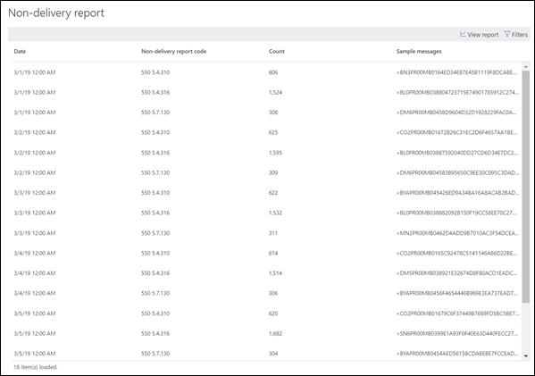

# 배달 못 함 보고서

> [!NOTE]
> 이 항목에서 설명 하는 기능은 모든 Office 365 조직에 배포 되지 않으며 변경 될 수 있습니다.

**배달 못 함 보고서** 에는 조직 내 사용자에 대 한 ndr 또는 바운스 메시지 라고도 하는 배달 못함 보고서의 가장 많이 발생 한 오류 코드가 표시 됩니다. 이 보고서는 ndr의 세부 정보를 표시 하기 위한 것 이므로 문제를 해결할 수 있습니다.

**데이터 표시를**클릭 하 여 모든 NDR 코드나 특정 코드에 대 한 정보를 표시할 수 있습니다. **세부 정보 표 보기** 를 클릭 하 여 다음 다이어그램에 표시 된 보다 자세한 보기를 볼 수도 있습니다.

테이블에서 행을 선택 하 여 특정 NDR의 세부 정보를 보려면 자세한 정보를 사용 하 여 문제를 해결 하 고 필요한 작업을 수행할 수 있습니다.

## 참고 항목

메일 흐름 대시보드의 다른 메일 흐름 정보에 대 한 자세한 내용은 [Security & 준수 센터의 메일 흐름 정보](mail-flow-insights-v2.md)를 참조 하십시오.
