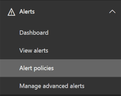
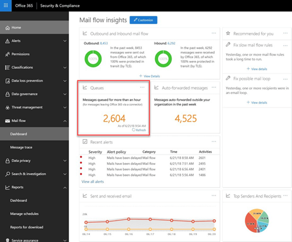

# 큐 경고 및 큐

## 큐 알림

온-프레미스에 Office 365 조직에서 메시지를 보낼 수 없는 경우 또는 커넥터를 사용 하 여 파트너 전자 메일 서버, 메시지는 Office 365에서 대기 됩니다. 이 조건은 발생 하는 일반적인 예는.

- 커넥터는 잘못 구성 되었습니다.

- 온-프레미스 환경에서 네트워킹 또는 방화벽 변경 사항이 있습니다.

Office 365 48 시간에 대 한 배달에 다시 시도를 계속 됩니다. 48 시간이 지나면 메시지 만료 됩니다 및 배달 못함 보고서에서 보낸 사람에 게 반환 됩니다 (Ndr로도 알려져 메시지 바운드 또는).

알림 **최근 경고**메일 흐름 대시보드에서 사용할 수 있습니다 및 관리자가 대체 전자 메일 주소) (에 전자 메일 알림을 받게 됩니다 (기본값은 2000 메시지) 미리 정의 된 임계값을 초과 하는 큐에 대기 중인된 전자 메일 볼륨을 하는 경우 . 경고 임계값, 일별 알림 제한 및/또는 받는 사람에 게 경고를 구성 하려면 아래의 **사용자 지정 큐 알림** 섹션을 참조 하십시오.

## 큐 경고를 사용자 지정

메일 흐름 통찰력 **알림** 에 있는 명명 된 **메시지가 지연 되었습니다** ( **전자 메일 알림 메시지 보내기** 확인란 아래 예제 스크린샷에서) 경고 정책 만들기 \> **경고 정책**입니다. 정책에서를 클릭 하 여 임계값 및 알림을 받는 사람을 수정할 수 있습니다.

새 정책 정보 블레이드를 볼 수 있습니다, **정책 편집**을 클릭할 수 있습니다.

**정책 편집**정보 블레이드 변경 됩니다. 이제 경고 전자 메일 알림 (200 개 이상의) 경고를 트리거할 수 일 및 최소 임계값 당 보낸 개수에 제한에 대 한 받는 사람을 변경할 수 있습니다.

## 큐 알림 세부 정보

알림을 클릭 하면 경고 세부 정보가 플라이 아웃 창에 나타납니다.

큐 세부 정보, 문제 및 새 플라이 아웃 창에서 사용할 수 있는 수정 사항에 대 한 링크를 참조 하는 경고 정보에 **큐 보기를** 클릭 수 있습니다.

## 큐

큐에 대기 중인된 메시지 볼륨 임계값을 초과 하지 않은, 하는 경우에 1 시간 이상에 대 한 큐에 대기 중인 메시지를 참조 하는 메일 흐름 대시보드의 **큐** 영역을 사용할 수 있습니다. (값이 0 임을 메일 흐름 확인) 큐에 대기 중인된 메시지 수를 모니터링 하 고 큐에 대기 중인된 메시지 수가 너무 커지면 전에 작업을 수행 하려면 **큐** 영역을 사용할 수 있습니다.

때 **큐**의 큐 세부 정보에서에서 큐에 대기 중인된 메시지의 번호를 클릭 하 고 문제를 해결 하는 방법에 대 한 지침 (동일한 플라이 아웃 큐 경고의 세부 정보에 **큐 보기를** 클릭 한 후 표시 되 면) 플라이 아웃 창에 표시 됩니다.

