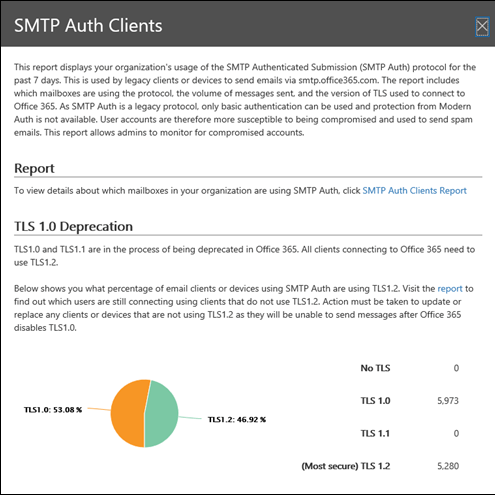

# SMTP 인증 클라이언트 보고서

> [!NOTE]
> 이 항목에서 설명 하는 기능은 모든 Office 365 조직에 배포 되지 않으며 변경 될 수 있습니다.

**smtp 인증 클라이언트** 보고서는 조직의 사용자 또는 시스템 계정으로 smtp 인증 클라이언트 전송 프로토콜을 사용 하는 것을 강조 합니다. 끝점 smtp.office365.com를 사용 하는이 레거시 프로토콜은 기본 인증만 제공 하며 손상 된 계정에서 전자 메일을 보내기 위해 사용 하는 것이 취약 합니다.  이 보고서를 사용 하면 비정상적인 활동을 확인할 수 있습니다. 또한 SMTP 인증을 사용 하는 클라이언트나 장치에 대 한 TLS 사용 현황 데이터를 보여줍니다.

메일 흐름 대시보드에 표시 되는 위젯은 지난 7 일 이내에 SMTP 인증 프로토콜을 사용한 사용자 또는 서비스 계정 수를 나타냅니다.

위젯을 클릭 하면 지난 주에 대 한 TLS 사용 및 볼륨의 집계 된 보기를 제공 하는 플라이 아웃이 열립니다.

**SMTP 인증 클라이언트 보고서** 링크를 클릭 하면 두 개의 기본 데이터 피벗 및 두 개의 데이터 보기가 표시 됩니다. 데이터 피벗은 **보내는 볼륨과** **TLS 사용**입니다. 데이터 보기는 차트 및 세부 정보 테이블입니다.

**보내는 볼륨** 보기에는 지정 된 시간 범위 동안 SMTP 인증을 사용 하 여 보낸 메시지 수가 표시 됩니다. **필터**를 클릭 하 여 범위를 조정할 수 있습니다. 차트가 보낸 사람 도메인으로 구성 됩니다. 드롭다운 **에 대 한 데이터 표시** 에서 도메인을 선택 하 여 각 도메인에 대해 개별 데이터를 볼 수 있습니다.

**세부 정보 표 보기**를 클릭 하 여 보낸 사람 및 해당 메시지 수에 대 한 자세한 정보를 볼 수 있습니다. 차트로 돌아가려면 **보고서 보기**를 클릭 합니다.

**tls 사용** 피벗은 Office 365에서 tls 1.0 및 tls 1.1의 출시로 인해 중요 한 역할을 합니다. 대부분의 레거시 장치 및 응용 프로그램은 SMTP 인증에서 tls 1.0을 사용할 수 있는 경우에만 전자 메일을 보낼 수 있습니다. 이 피벗은 이전 버전의 TLS를 사용 하는 사용자 및 시스템 계정을 식별 하 고이에 대 한 작업을 수행할 수 있도록 합니다.

보낸 사람에 대 한 자세한 정보, SMTP 인증을 사용 하는 TLS 버전, 그리고 **정보 테이블 보기**를 클릭 하 여 해당 메시지 개수를 볼 수 있습니다. 차트로 돌아가려면 **보고서 보기**를 클릭 합니다.

보고서 요청을 클릭 하 여 자세한 보고서 버전을 다운로드할 수도 있습니다.

## 참고 항목

메일 흐름 대시보드의 다른 메일 흐름 정보에 대 한 자세한 내용은 [Security & 준수 센터의 메일 흐름 정보](mail-flow-insights-v2.md)를 참조 하십시오.
