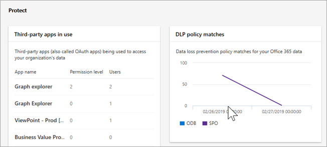
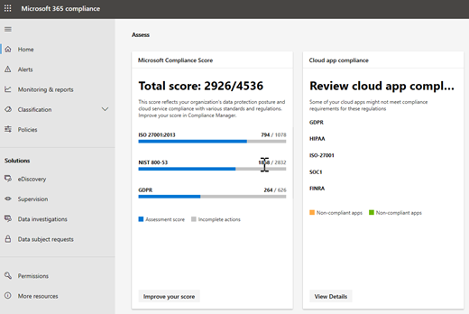

# 새로운 Microsoft 365 준수 센터에 오신 것을 환영 합니다.

## 개요

조직의 규정 준수 상황에 관심이 있는 경우 새로운 [Microsoft 365 준수 센터](https://compliance.microsoft.com)를 좋아하는 것입니다. Microsoft 365 준수 센터는 조직의 규정 준수 요구 사항에 맞게 관리 해야 하는 데이터 및 도구에 쉽게 액세스할 수 있도록 합니다. 

Microsoft 365 준수 센터, 제공 [방법](#how-do-i-get-this), 질문과 [대답](#frequently-asked-questions)및 [다음 단계](#next-steps)를 숙지 하려면이 문서를 읽어 보세요.

## Microsoft 365 준수에 오신 것을 환영 합니다.

처음 Microsoft 365 준수 센터로 이동 하면 다음 환영 메시지를 greeted 됩니다.

환영 배너에서는 다음 단계와 의견을 제공 하는 초대장을 사용 하 여 시작 하는 방법에 대 한 몇 가지 지침을 제공 합니다.

## 평가 섹션

홈 페이지의 **평가** 섹션에는 조직에서 [데이터 보호 및 규정 준수](protect-access-to-data-and-services.md)와 관련 하 여 수행 하는 작업을 한눈에 보여 줍니다.

여기에서 Microsoft 준수 점수 카드로 이동 하 여 구성을 검토 하거나 편집 하 고 전반적인 준수 점수를 높일 수 있는 [준수 관리자](meet-data-protection-and-regulatory-reqs-using-microsoft-cloud.md)가 될 수 있습니다.

조직의 클라우드 앱 준수를 보여주는 추가 카드와, [클라우드 앱 보안](https://docs.microsoft.com/cloud-app-security/) 에 대 한 링크 또는 데이터를 탐색할 수 있는 기타 도구를 사용 하 여 공유 파일을 사용 하는 사용자에 대 한 데이터가 표시 됩니다.

## 보호 섹션

홈 페이지의 **보호** 섹션에는 [레이블](labels.md), [DLP (데이터 손실 방지)](data-loss-prevention-policies.md), 사용 중인 타사 앱, 공유 파일, 섀도 IT 앱 등에 대 한 높은 수준의 정보를 제공 하는 카드가 포함 되어 있습니다. 

각 카드에는 보고서에 대 한 링크 또는 자세한 내용을 볼 수 있는 추가 정보가 있습니다.

## 응답 섹션

홈 페이지의 **응답** 섹션에는 [경고](alerts.md) 및 [보류 중인 dispositions](disposition-reviews.md) 에 따라 검토 하 고 잠재적으로 작동할 수 있습니다.

[활성 경고](alerts.md) 카드와 같은 카드에는 심각도, 상태, 범주 등의 자세한 정보를 볼 수 있는 페이지에 대 한 링크가 포함 되어 있습니다.

 

## 더 많은 준수 기능 및 기능에 대 한 간편한 탐색

홈 페이지에 있는 명함 링크 외에, [알림](alerts.md), [보고서](reports-in-security-and-compliance.md), [정책](alert-policies.md), 규정 준수 솔루션 등에 쉽게 액세스할 수 있도록 화면 왼쪽에 탐색 창이 표시 됩니다. 

|  |  |
|---------|---------|
|  |   경고를 보고 확인 하는 **알림** 으로 이동   **& 보고서 모니터링** 을 방문 하 여 [레이블 사용 및 보존](sensitivity-labels.md), [DLP 정책 일치 및 재정의](view-the-dlp-reports.md), [공유 파일](https://docs.microsoft.com/cloud-app-security/file-filters), [타사 앱](https://docs.microsoft.com/cloud-app-security/discovered-apps)및 기타 정보에 대 한 데이터를 볼 수 있습니다.  **분류** 섹션을 확장 하 여 [레이블](labels.md), [레이블 정책](sensitivity-labels.md#what-label-policies-can-do), 중요 한 [정보 유형](what-the-sensitive-information-types-look-for.md)및 [레이블 분석](view-label-activity-for-documents.md)에 액세스 합니다.  **정책** 으로 이동 하 여 [알림을](alerts.md) 보고 [DLP](data-loss-prevention-policies.md) 및 [보존](retention-policies.md) 정책에 액세스 합니다.   조직의 규정 준수 솔루션에 액세스 하려면 **솔루션** 섹션의 링크를 사용 합니다. 다음과 같은 다양한 알고리즘과 방법이 있습니다.  [데이터 거 버 넌 스 > Dispositions](disposition-reviews.md) [eDiscovery (미리 보기)](compliance20/overview-ediscovery-20.md) [감독](supervision-policies.md) [데이터 조사](compliance20/manage-data-spillage-incidents.md) [데이터 주체 요청](manage-gdpr-data-subject-requests-with-the-dsr-case-tool.md)        |

## 이를 어떻게 얻을 수 있나요?

- 새로운 Microsoft 365 준수 센터가 설치 되어 있지 않은 경우 곧 제공 될 예정입니다. 이제 [새로운 Microsoft 365 준수 센터](microsoft-security-and-compliance.md#microsoft-365-compliance-center) 를 지금 사용할 수 있습니다.

- 전역 관리자 또는 준수 관리자로 Microsoft 365 준수 센터에 방문 하려면로 [https://compliance.microsoft.com](https://compliance.microsoft.com) 이동 하 여 로그인 합니다. 

- 요구 사항에 대 한 자세한 내용은 [필요한 라이선스 및 사용 권한을](microsoft-security-and-compliance.md#required-licenses-and-permissions)참조 하세요.

## 자주하는 질문

### 특정 정책을 정의 하는 것과 같은 일부 작업을 수행 하기 위해 Office 365 보안 & 준수 센터로 이동 하는 이유는 무엇 인가요?

microsoft 365 준수 센터를 아직 개발 중 이며, 향후 몇 개월 동안 기능과 솔루션을 추가로 추가할 예정입니다. 한편 보안 & 준수 센터에서는 몇 가지 작업을 수행 해야 합니다. 이러한 경우에는 사용자가 감독 정책을 만들거나 편집 하는 등의 작업을 수행할 수 있는 위치로 자동으로 리디렉션됩니다.

### 아직 새로운 Microsoft 365 준수 센터가 표시 되지 않는 이유는 무엇 인가요?

먼저 적절 한 [라이선스 및 사용 권한이](microsoft-security-and-compliance.md#required-licenses-and-permissions)있는지 확인 합니다. 그런 후에 [https://compliance.microsoft.com](https://compliance.microsoft.com)로그인 합니다. 아직 새 준수 센터가 표시 되지 않으면 곧 제공 될 예정입니다.

## 다음 단계

- **Microsoft 준수 점수를 검토**하 고 준수 관리자를 사용 하 여 점수를 높입니다. 자세한 내용은 [Microsoft 클라우드 서비스를 사용할 때 준수 관리자를 사용 하 여 데이터 보호 및 규정 요구 사항을 충족](meet-data-protection-and-regulatory-reqs-using-microsoft-cloud.md)하는 방법을 참조 하세요.

- **조직의 데이터 손실 방지 정책을 검토** 하 고 필요에 따라 조정을 수행 합니다. 자세한 내용은 [데이터 손실 방지 정책 개요](data-loss-prevention-policies.md)를 참조 하세요. 

- **Microsoft Cloud App Security를 숙지 하 고 설정**합니다. [퀵 스타트: Microsoft Cloud App Security 시작을](https://docs.microsoft.com/cloud-app-security/getting-started-with-cloud-app-security)참조 하세요.  

- **Microsoft 365 준수 센터를 자주 방문**하 고 발생할 수 있는 경고나 잠재적 위험을 검토 해야 합니다. 으로 이동 [https://compliance.microsoft.com](https://compliance.microsoft.com) 하 여 로그인 합니다.