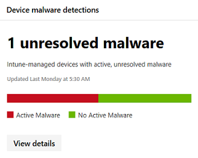

# Microsoft 365 보안의 디바이스 모니터링Monitor devices in Microsoft 365 security

Microsoft 365 보안 센터에서 장치를 안전 하 고 최신 상태로 유지 하 고 잠재적인 위협을 발견할 수 있습니다.Keep your devices secure, up-to-date, and spot potential threats in the Microsoft 365 security center.

## 장치 알림 보기View device alerts

Windows Defender ATP에서 장치에 대 한 위반 활동 및 기타 위협에 대 한 최신 알림을 받을 수 있습니다 (E5 라이선스 사용 가능).Get up-to-date alerts about breach activity and other threats on your devices from Windows Defender ATP (available with an E5 license). Microsoft 365 보안 센터에는 기본 설정 워크플로에 따라 높은 수준에서 이러한 경고를 효과적으로 모니터링 하는 데 사용할 수 있는 몇 가지 카드가 있습니다.Microsoft 365 security center has several cards that allow you to effectively monitor these alerts at a high-level, depending on your preferred workflow.

### 높은 영향을 주는 알림 모니터링Monitor high-impact alerts

각 Windows Defender ATP 경고에는 해당 심각도 (높음, 중간, 낮음 또는 정보용)가 있으며,이는 무인 상태로 유지 되는 경우 네트워크에 발생할 수 있는 잠재적 영향을 나타내는 것입니다.Each Windows Defender ATP alert has a corresponding severity—high, medium, low, or informational—that indicates its potential impact to your network if left unattended.  

**장치 경고 심각도** 카드를 사용 하 여 특히 더 심각 하 고 즉각적인 응답이 필요할 수 있는 경고에 초점을 집중 합니다.Use the **Device alert severity** card to focus specifically on alerts that are more severe and might require immediate response. 이 카드에서 Windows Defender 보안 센터 포털에 대 한 추가 정보를 볼 수 있습니다.From this card, you can view more information on the Windows Defender Security Center portal.

### 경고 원본 이해Understand sources of alerts

Windows Defender ATP는 광범위 한 보안 센서 및 인텔리전스 원본의 데이터를 활용 하 여 경고를 생성 합니다.Windows Defender ATP leverages data from a broad range of security sensors and intelligence sources to generate alerts. 예를 들어 Windows Defender 바이러스 백신 및 타사 맬웨어 방지의 검색 정보 뿐 아니라 웹 서비스 API를 통해 제공 되는 사용자 지정 위협 인텔리전스를 사용할 수 있습니다.For example, it can use detection information from Windows Defender Antivirus and third-party antimalware, as well as your own custom threat intelligence provided through the web service API.

**장치 경고 검색** 원본 카드에는 원본에의 한 알림 배포가 표시 됩니다.The **Device alert detection** sources card shows the distribution of alerts by source. 이 카드는 특정 원본, 특히 사용자 지정 원본에 관련 된 작업을 추적 하는 데 도움이 됩니다.This card can help you track activity related to certain sources, particularly your custom sources. 이를 사용 하 여 악성 활동 또는 구성 요소를 자동으로 차단 하도록 구성 되지 않은 센서에서 들어오는 경고에 집중할 수도 있습니다.You can also use this to focus on alerts coming from sensors that are not configured to automatically block malicious activity or components.

이 카드에서 Windows Defender 보안 센터 포털에 대 한 추가 정보를 볼 수 있습니다.From this card, you can view more information on the Windows Defender Security Center portal.

### 알림을 트리거하는 위협의 유형 이해Understand the types of threats that trigger alerts

Windows Defender ATP는 공격 체인의 특정 단계 또는 위협 구성 요소 유형을 나타내는 범주로 각 경고를 정렬 합니다.Windows Defender ATP sorts each alert into a category representing a certain stage in the attack chain or a type of threat component. 예를 들어 검색 된 위협 활동을 "수평 이동"으로 분류 하 여 활동이 네트워크의 다른 장치에 연결 하려고 시도 했으며 공격자가 초기 foothold를 얻은 후에 발생 했을 것임을 나타낼 수 있습니다.For example, detected threat activity might be categorized into “lateral movement” to indicate that the activity involved an attempt to reach other devices on the network and has likely occurred after attackers have gained an initial foothold. 감지 되 면 위협 구성 요소는 "맬웨어" 또는 특히 "랜 섬 웨어", "자격 증명 가로채기" 또는 기타 악성 또는 원치 않는 소프트웨어 유형으로 분류 될 수 있습니다.When detected, a threat component might either be classified broadly as “malware” or more specifically as “ransomware”, “credential stealing” or other types of malicious or unwanted software.

**장치 위협 범주** 카드에는 이러한 범주에 대 한 경고 배포가 표시 됩니다.The **Device threat categories** card shows the distribution of alerts into these categories. 이 정보를 사용 하 여 자격 증명 도용 시도와 같은 위협 활동을 식별 하 고, 예를 들어 사회 공학적에서의 시도에 비해 더 중요 한 영향을 줄 수 있습니다.You can use this information to identify threat activity, such as attempts at credential theft, which can have more significant impact compared to attempts at social engineering, for example. 이를 사용 하 여 랜 섬 웨어와 같은 잠재적인 파괴적인 위협을 모니터할 수도 있습니다.You can also use this to monitor for potentially destructive threats like ransomware.

### 활성 경고 모니터링Monitor active alerts

**장치 경고 상태** 카드에는 해결 되지 않아 주의가 필요할 수 있는 경고의 수가 표시 됩니다.The **Device alert status** card indicates the number of alerts that have not been resolved and might require attention. 이 카드에서 Windows Defender 보안 센터 포털에 대 한 추가 정보를 볼 수 있습니다.From this card, you can view more information on the Windows Defender Security Center portal.

### 확인 된 알림의 분류 모니터링Monitor classification of resolved alerts

windows Defender ATP 알림을 확인할 때 보안 담당자는 다음과 같이 경고가 확인 되었는지 여부를 지정할 수 있습니다.When resolving a Window Defender ATP alert, your security staff can specify whether an alert has been verified as:

* 실제 위반 활동 또는 위협 구성 요소를 식별 하는 진정한 경고A true alert that identifies actual breach activity or threat components
* 정상적인 활동이 잘못 검색 된 거짓 경고A false alert that has incorrectly detected normal activity

**장치 경고 분류** 카드에는 해결 된 경고가 참 또는 거짓 알림으로 분류 되어 있는지 여부가 표시 됩니다.The **Device alert classification** card shows whether your resolved alerts have been classified as true or false alerts. 이 카드에서 Windows Defender 보안 센터 포털에 대 한 추가 정보를 볼 수 있습니다.From this card, you can view more information on the Windows Defender Security Center portal.

참고: 일부 경우에는 특정 알림에 대해 분류 정보를 사용할 수 없습니다.Note: In some cases, classification information is unavailable for certain alerts.

### 해결 된 경고 확인 모니터링Monitor determination of resolved alerts

확인 중에 경고가 참 인지 거짓이 든 관계 없이 보안 담당자는 알림을 확인 하는 동안 발견 된 일반 또는 악의적인 활동의 유형을 나타내는 결정을 제공할 수 있습니다.In addition to classifying whether an alert is true or false during resolution, your security staff can provide a determination, indicating the type of normal or malicious activity that was found while validating the alert.

**장치 경고 결정** 카드에는 다음과 같이 각 경고에 대해 제공 되는 결정이 표시 됩니다.The **Device alert determination** card shows the determination provided for each alert, specifically:

* **APT** -검색 된 활동 또는 위협 구성 요소가 영향을 받는 네트워크에서 foothold을 얻기 위해 설계 된 복잡 한 위반의 일부임을 나타내는 고급 영구 위협**APT** – advanced persistent threat, indicating that the detected activity or threat component is part of a sophisticated breach designed to gain a foothold in the affected network  
* **맬웨어** -악성 파일 또는 코드**Malware** – malicious file or code
* **보안 담당자** -보안 직원이 수행 하는 일반 작업**Security personnel** – normal activity performed by security staff
* **보안 테스트** -실제 위협을 시뮬레이트하고 보안 센서를 트리거하여 알림을 생성할 것으로 예상 되는 작업 또는 구성 요소입니다.**Security testing** – activity or components designed to simulate actual threats and expected to trigger security sensors and generate alerts
* **원치 않는 소프트웨어** -악성으로 간주 되지 않고 정책 또는 적절 한 사용 표준을 위반 하는 앱 및 기타 소프트웨어**Unwanted software** – apps and other software that are not considered malicious, but otherwise violate policy or acceptable use standards
* **기타** -제공 된 형식에 포함 되지 않는 기타 모든 결정**Others** – any other determination that does not fall under the provided types

이 카드에서 Windows Defender 보안 센터의 추가 정보를 볼 수 있습니다.From this card, you can view more information in Windows Defender security center.

### 위험에 처 한 장치 이해Understand which devices are at risk

**장치 보호** 장치에 대 한 위험 수준을 표시 합니다.**Device protection** shows the risk level for devices. 위험 수준은 장치에 대 한 알림 유형 및 심각도와 같은 요소를 기반으로 합니다.The risk level is based on factors such as the type and severity of alerts on the device.

## Intune 관리 장치에 대 한 상태 모니터링 및 보고Monitor and report status of Intune-managed devices

다음 모니터링 및 보고서에는 Intune에서 등록 된 장치의 데이터가 포함 되어 있습니다.The following monitoring and reports contain data from devices enrolled in Intune. unenrolled 장치의 데이터는 포함 되지 않습니다.Data from unenrolled devices is not included. 전역 관리자만 이러한 카드를 볼 수 있습니다.Only Global Administrators can view these cards.

Intune에서 등록 된 장치 데이터에는 다음이 포함 됩니다.Intune enrolled device data includes:

* 장치 준수Device compliance
* 활성 맬웨어가 있는 장치Devices with active malware
* 장치에 있는 맬웨어 유형Types of malware on devices
* 장치에 대 한 맬웨어Malware on devices
* 맬웨어 검색이 포함 된 장치Devices with malware detections
* 맬웨어 검색이 포함 된 사용자Users with malware detections

### 장치 준수 모니터링Monitor device compliance

**장치 준수** 는 구성 정책을 준수 하는 Intune의 장치 수를 보여 줍니다.**Device compliance** shows how many devices that are enrolled in Intune comply with configuration policies.

### 맬웨어 감지 장치 검색Discover devices with malware detections

**장치 맬웨어 감지** 는 보류 중인 작업 (다시 시작, 전체 검색 또는 수동 사용자 작업)으로 인해 완전히 해결 되지 않은 맬웨어 또는 업데이트 관리 작업이 성공적으로 완료 되지 않은 것으로 확인 된 Intune을 사용 하 여 등록 된 장치 수를 제공 합니다.**Device malware detections** provides the number of Intune enrolled devices with malware that have not been fully resolved due to pending actions—a restart, a full scan or manual user actions—or if the remediation action did not complete successfully.

### 검색 된 맬웨어 유형 이해Understand the types of malware detected

**장치에 있는 맬웨어 유형은** Intune에서 등록 된 장치에서 감지 되는 다양 한 유형의 맬웨어를 보여 줍니다.**Types of malware on devices** shows different kinds of malware that have been detected on devices enrolled in Intune. Microsoft 365 보안 센터에서 각 유형을 조사할 수 있습니다.You can investigate each type in Microsoft 365 security center.

### 장치에서 검색 되는 특정 맬웨어 이해Understand the specific malware detected on your devices

**장치의 맬웨어** 장치에서 검색 되는 특정 맬웨어 목록을 제공 합니다.**Malware on devices** provides a list of the specific malware detected on your devices.

### 맬웨어가 가장 많은 장치 이해Understand which devices have the most malware

**맬웨어 감지 장치** 는 맬웨어가 검색 된 장치를 보여 줍니다.**Devices with malware detections** shows which devices have the most malware detections. Microsoft 365 보안 센터에서는 맬웨어가 활성 상태 인지 여부, 해당 장치를 사용 하는 사람 및 Intune의 관리 상태를 조사할 수 있습니다.In Microsoft 365 security center, you can investigate whether malware is active, who uses the device, and its management status in Intune.

### 맬웨어가 가장 많은 장치를 보유 하는 사용자 이해Understand which users have devices with the most malware

**맬웨어 검색을 사용** 하는 사용자에 게는 맬웨어가 탐지 된 장치를 사용한 사용자가 표시 됩니다.**Users with malware detections** shows users with devices that had the most malware detections. Microsoft 365 보안 센터에서는 각 사용자에 게 할당 된 장치의 수와 각 장치에 대 한 추가 정보와 맬웨어 유형에 대 한 자세한 정보를 확인할 수 있습니다.In Microsoft 365 security center, you can see how many devices are assigned to each user and more information about each device and the type of malware.

## ASR 규칙 배포 및 검색 모니터링 및 관리Monitor and manage ASR rule deployment and detections

[ASR (Attack Surface Reduction) 규칙](https://docs.microsoft.com/en-us/windows/security/threat-protection/windows-defender-exploit-guard/attack-surface-reduction-exploit-guard) 을 사용 하면 일반적으로 익스플로잇 맬웨어를 검색 하 여 컴퓨터를 감염 시키는 작업 및 앱을 방지할 수 있습니다.[Attack Surface Reduction (ASR) rules](https://docs.microsoft.com/en-us/windows/security/threat-protection/windows-defender-exploit-guard/attack-surface-reduction-exploit-guard) help prevent actions and apps that are typically used by exploit-seeking malware to infect machines. 이러한 규칙은 실행 파일을 실행 하는 시기와 방법을 제어 합니다.These rules control when and how executables can run. 예를 들어 JavaScript 또는 VBScript에서 다운로드 한 실행 파일을 실행 하거나, Office 매크로에서 Win32 API 호출을 차단 하거나, USB 드라이브에서 실행 되는 프로세스를 차단 하지 않도록 할 수 있습니다.For example, you can prevent JavaScript or VBScript from launching a downloaded executable, block Win32 API calls from Office macros, or block processes that run from USB drives.

**Attack surface reduction** 카드를 통해 장치 전체의 규칙 배포에 대 한 개요를 제공 합니다.The **Attack surface reduction rules** card provides an overview of the deployment of rules across your devices.

카드 위쪽 막대에는 다음과 같은 배포 모드에 있는 총 장치 수가 표시 됩니다.The top bar on the card shows the total number of devices that are in the following deployment modes:

* **차단 모드** -검색 된 활동을 차단 하도록 구성 된 규칙이 하나 이상 있는 장치**Block mode** – devices with at least one rule configured to block detected activity
* **감사 모드** -검색 된 활동을 차단 하도록 규칙이 설정 되지 않은 장치에는 하나 이상의 규칙 집합이 있는데, 검색 작업을 감사 합니다.**Audit mode** – devices with no rules set to block detected activity, but has at least one rule set to audit detected activity  
* **off** -모든 ASR 규칙을 끈 장치**Off** – devices with all ASR rules turned off

이 카드의 아래쪽 부분에는 장치 전체의 규칙 설정이 나와 있습니다.The lower part of this card shows settings by rule across your devices. 각 표시줄에는 차단 또는 감사 감지로 설정 되거나 규칙이 완전히 해제 된 장치 수가 표시 됩니다.Each bar indicates the number of devices that are set to block or audit detection or have the rule completely turned off.

### ASR 검색 보기View ASR detections

네트워크에서 ASR 규칙 감지에 대 한 자세한 정보를 보려면 **Attack surface reduction** 카드에서 검색 **보기** 를 선택 합니다.To view detailed information about ASR rule detections in your network, select **View detections** on the **Attack surface reduction rules** card. 자세한 \*\*\*\* 보고서 페이지의 검색 탭이 열립니다.The **Detections** tab in the detailed report page will open.

페이지 맨 위에 있는 차트에는 차단 되거나 감사 된 시간 단위 누적 검색에 따른 검색 내용이 표시 됩니다.The chart at the top of the page shows detections over time stacking detections that were either blocked or audited. 맨 아래 표에는 가장 최근 검색이 나열 됩니다.The table at the bottom lists the most recent detections. 검색의 특성을 이해 하려면 표에 나오는 다음 정보를 사용 합니다.Use the following information on the table to understand the nature of the detections:

* **검색 된 파일** -해당 내용이 의심 스러운 공격 활동을 트리거한 파일 (대개 스크립트나 문서)입니다.**Detected file** – the file, typically a script or a document, whose contents triggered the suspected attack activity
* **규칙** -규칙에서 파악 하도록 설계 된 공격 활동을 설명 하는 이름입니다.**Rule** – name describing the attack activities the rule is designed to catch. 기존 ASR 규칙에 대 한 정보 검토Read about existing ASR rules
* **원본 앱** -의심 스러운 공격 활동을 트리거하는 콘텐츠를 로드 했거나 실행 한 응용 프로그램입니다.**Source app** – the application that loaded or executed content triggering the suspected attack activity. 웹 브라우저, Office 응용 프로그램 또는 PowerShell과 같은 시스템 도구와 같은 합법적인 응용 프로그램이 될 수 있습니다.This could be a legitimate application, such as web browser, an Office application, or a system tool like PowerShell
* **게시자** -원본 앱을 릴리스된 공급 업체**Publisher** – the vendor that released the source app

### 장치 ASR 규칙 설정 검토Review device ASR rule settings

**Attack surface reduction 규칙** 보고서 페이지에서 **구성** 탭으로 이동 하 여 개별 장치에 대 한 규칙 설정을 검토 합니다.In the **Attack surface reduction rules** report page, go to the **Configuration** tab to review rule settings for individual devices. 각 규칙이 차단 모드, 감사 모드 또는 전체 해제에 대 한 세부 정보를 가져올 장치를 선택 합니다.Select a device to get detailed information about whether each rule is in block mode, audit mode, or turned off entirely.

Microsoft Intune은 ASR 규칙에 대 한 관리 기능을 제공 합니다.Microsoft Intune provides management functionality for your ASR rules. 설정을 업데이트 하려면 탭의 **장치 구성** 아래에서 **시작** 을 선택 하 여 Intune에서 장치 관리를 엽니다.If you want to update your settings, select **Get started** under **Configure devices** in the tab to open device management on Intune.

### ASR 규칙에서 파일 제외Exclude files from ASR rules

검색에서 파일을 제외 하면 원하지 않는 가양성 검색을 방지 하 고 차단 모드에서 더 안전 하 게 공격 표면 축소 규칙을 배포할 수 있습니다.By excluding files from detections, you can prevent unwanted false positive detections and more confidently deploy attack surface reduction rules in block mode.

microsoft Intune에서 attack surface reduction 규칙에 대 한 파일 제외를 관리 하지만 microsoft 365 보안 센터에서는 검색을 트리거하는 파일을 이해 하는 데 도움이 되는 분석 도구를 제공 합니다.While file exclusions for attack surface reduction rules are managed on Microsoft Intune, Microsoft 365 security center provides an analysis tool to help you understand the files that are triggering detections. 또한 제외 하려는 파일의 이름을 수집할 수 있습니다.It also helps collect the names of the files you might want to exclude.

검색 분석을 시작 하 고 제외할 파일을 수집 하려면 **Attack surface reduction 규칙** 보고서 페이지에서 **제외 항목 추가** 탭으로 이동 합니다.To start analyzing detections and collecting files for exclusion, go to the **Add exclusions** tab in the **Attack surface reduction rules** report page.

이 표에서는 공격 노출 범위 규칙에 의해 검색 된 모든 파일 이름을 보여 줍니다.The table lists all the file names detected by your attack surface reduction rules. 파일을 하나 이상 선택 하면 예외에 해당 파일을 추가할 때 미치는 영향을 검토할 수 있습니다.Once you select a file or multiple files, you can review the impact of adding those files to your exceptions:

* 총 감지 횟수 감소The reduction in the total number of detections
* 검색의 영향을 받는 총 장치 수 감소The reduction in the total number of devices affected by the detections

제외할 전체 경로를 사용 하 여 선택한 파일 목록을 가져오려면 **제외 경로 가져오기를**선택 합니다.To get a list of the selected files with their full paths for exclusion, select **Get exclusion paths**.

제외 사항에 대 한 자세한 내용과 이러한 항목을 추가 하는 방법에 대 한 자세한 내용은 [attack surface reduction 관련 문제 해결](https://docs.microsoft.com/en-us/windows/security/threat-protection/windows-defender-exploit-guard/troubleshoot-asr)을 참조 하십시오.For more information about exclusions and detailed instructions about how to add them, read [troubleshoot attack surface reduction rules](https://docs.microsoft.com/en-us/windows/security/threat-protection/windows-defender-exploit-guard/troubleshoot-asr).
