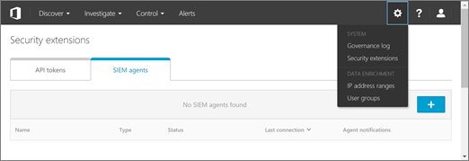

# 2017 중 Office 365 Cloud App Security 업데이트
    
## Office 365 Cloud App Security release 112

*2017 년 12 월 24 일 출시* 
  
**다음 [Microsoft Cloud App Security release 112](https://docs.microsoft.com/cloud-app-security/release-notes#cloud-app-security-release-112)**: 
  
- **관련 통찰력 서랍** 이제 활동 로그에서 사용자 이름이 나 IP 주소를 클릭 하 여 관련 통찰력 서랍에 액세스할 수 있습니다. 
    
    
  
- **클릭 하 여 더 많은 활동을 볼 수**있습니다. 관련 통찰력 서랍에서 시계 아이콘을 클릭 하 여 선택한 활동의 48 시간 내에 수행 된 모든 작업을 볼 수 있습니다. 
    
    
  
- l i l **srx에 대 한 로그 파서 향상** 연결 되지 않은 srx에 대 한 클라우드 검색 로그 파서가 향상 되었습니다. 
    
## Office 365 Cloud App Security release 111

*출시 되는 2017 년 12 월 10 일* 
  
**다음 [Microsoft Cloud App Security release 111](https://docs.microsoft.com/cloud-app-security/release-notes#cloud-app-security-release-111)**: 
  
- **시간 필터의 향상 된 기능** 이제 시간 필터를 사용 하는 것이 더 쉽습니다. 시간 필터에 액세스 하려면 활동 로그, 정책, 알림, 고급 보기 사용 등의 보기에서 필터 목록에서 **날짜** 를 선택 합니다. 그런 다음 before, after, 또는 사이에 시간 필터를 적용 하는 등의 옵션을 선택 합니다. 
    
    
  
## Office 365 Cloud App Security release 110

*2017 년 11 월 26 일 출시* 
  
**다음 [Microsoft Cloud App Security release 110](https://docs.microsoft.com/cloud-app-security/release-notes#cloud-app-security-release-110)**: 
  
- **이제 일반적으로 siem 서버 통합을 사용할 수**있습니다. siem server를 Office 365 Cloud App Security에 연결 합니다. 이제 siem 에이전트를 구성 하 여 선택한 경고 및 활동을 siem 서버로 자동으로 보낼 수 있습니다. [siem server를 Office 365 Cloud App Security와 통합을](integrate-your-siem-server-with-office-365-cas.md)참조 하세요.
    
- **도움말 콘텐츠에 보다 쉽게 액세스할 수**있습니다. 이제 오른쪽 위 모서리에 있는 새 물음표를 사용 하 여 Office 365 Cloud App Security portal의 페이지 내에서 도움말 콘텐츠에 액세스할 수 있습니다. 각 링크는 상황에 맞는 정보를 받아 사용 중인 페이지에 따라 필요한 정보가 됩니다. 
    
- **의견을 보내 주세요**. 이제 오른쪽 위 모서리에 있는 웃는 얼굴을 사용 하 여 Office 365 Cloud App Security portal의 모든 페이지에서 피드백을 보낼 수 있습니다. 이렇게 하면 버그를 보고, 새로운 기능을 요청 하 고, Office 365 Cloud App Security 팀과 직접 환경을 공유할 수 있습니다. 
    
## Office 365 Cloud App Security release 102

*2017 년 8 월 13 일 출시* 
  
**다음 [Microsoft Cloud App Security release 102](https://docs.microsoft.com/cloud-app-security/release-notes#cloud-app-security-release-102)**: 
  
- **새 사용자 조사 작업** 을 통해 사용자 조사로 추가 된 드릴 다운 수준을 사용할 수 있습니다. 조사 페이지에서 활동, 사용자 또는 계정을 마우스로 가리키고 필터를 적용 하 여 관련 작업 또는 이벤트를 볼 수 있습니다. 
    
## Office 365 Cloud App Security release 100

*2017 년 7 월 17 일 출시* 
  
**다음 [Microsoft Cloud App Security release 100](https://docs.microsoft.com/cloud-app-security/release-notes#cloud-app-security-release-100)**: 
  
- **보안 확장** 은 API 토큰과 siem 에이전트를 포함 하 여 Office 365 Cloud App security에 대 한 모든 보안 확장을 중앙에서 관리할 수 있는 새로운 대시보드입니다. 보안 확장 대시보드를 보려면 다음 단계를 수행 합니다. 
    
1. [https://protection.office.com](https://protection.office.com) 으로 이동 하 여 Office 365에 대 한 회사 또는 학교 계정을 사용 하 여 로그인 합니다. (보안 &amp; 및 준수 센터로 이동 합니다.) 
    
2. **경고** \> 로 이동 하 여 **고급 알림을 관리**합니다.
    
3. **Office 365 Cloud App Security로 이동을**선택 합니다.
  
4. **설정** \> **보안 확장**을 선택 합니다.
    
    
  
- **구문 분석 기능이 향상**되었습니다. 클라우드 검색 로그 구문 분석 메커니즘이 향상 되었습니다. 내부 오류가 발생할 가능성이 크게 낮아집니다. 
    
- **로그 형식이 필요**합니다. 이제 클라우드 검색 로그에 대해 예상 되는 로그 형식에는 Syslog 형식과 FTP 형식 둘 다의 예제가 제공 됩니다. 
    
## 관련 항목

[Office 365 Cloud App Security 도움말 콘텐츠](office-365-cas-help.md)

[Office 365 Cloud App Security의 새로운 사항](new-in-office-365-cas.md)
  
[Office 365 Cloud App Security 적용한 후 사용률 활동](utilization-activities-for-ocas.md)

