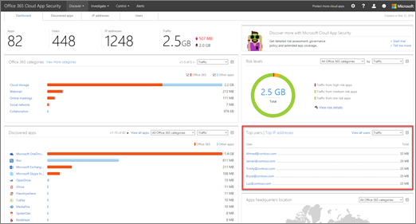

# 2018 하는 동안 office 365 클라우드 응용 프로그램 보안 업데이트

## Office 365 클라우드 응용 프로그램 보안 릴리스 138

*2018 년 12 월 23, 릴리스*

** [Microsoft 클라우드 앱 보안 릴리스 138을](https://docs.microsoft.com/cloud-app-security/release-notes#cloud-app-security-release-138)따릅니다**.

- **Windows에서 Docker를 사용 하 여 자동 로그 업로드** 클라우드 앱 보안 Windows 10에 대 한 자동 로그 업로드는 이제 지원 ([비보안 작성자 업데이트](https://docs.microsoft.com/windows/whats-new/whats-new-windows-10-version-1709) 버전과 새 버전) 및 Windows Server ([버전 1709](https://docs.microsoft.com/windows-server/get-started/whats-new-in-windows-server-1709) 버전과 새 버전) Windows에서 Docker를 사용 하 여 합니다. [이 문서](https://docs.microsoft.com/cloud-app-security/discovery-docker-windows) Docker를 구성 하 고 자세한를 참조 하십시오.  

- **Microsoft 흐름의 통합** 클라우드 앱 보안은 이제 [Microsoft 흐름](https://docs.microsoft.com/flow/getting-started) 을 사용자 지정 경고 자동화 및 오케스트레이션 playbook 제공와 통합 합니다. Microsoft 흐름 통합을 구성 하 고 자세한 [이 문서](https://docs.microsoft.com/cloud-app-security/flow-integration) 참조 하십시오. 

## Office 365 클라우드 응용 프로그램 보안 릴리스 137

*2018 년 12 월 8, 릴리스*

** [Microsoft 클라우드 앱 보안 릴리스 137을](https://docs.microsoft.com/cloud-app-security/release-notes#cloud-app-security-release-137)따릅니다**.

- **Dynamics에 대 한 지원 추가** 이제 클라우드 응용 프로그램 보안에는 Office 365 감사 로그에서 지원 되는 Microsoft Dynamics 활동에 대 한 지원을 포함 됩니다. 

- **-새 용어를 대표!** 앱 사용 권한 기능 이름이 명확 하 게 하기에 대 한 변경 되었습니다-OAuth 앱 이제 라고 합니다. 

## Office 365 클라우드 응용 프로그램 보안 릴리스 136

*2018 년 11 월 25, 릴리스*

** [Microsoft 클라우드 앱 보안 릴리스 136을](https://docs.microsoft.com/cloud-app-security/release-notes#cloud-app-security-release-136)따릅니다**.

- **클라우드 검색 업데이트** 사용자 지정 로그 파서 추가 지원 하도록 향상 되었습니다 하 고 더 복잡 한 웹 트래픽 형식을 기록 합니다. 이러한 향상 된 사용자의 일부 수 이제 headerless CSV 로그 파일에 대 한 사용자 지정 헤더를 입력 하 고, 키 값 파일에 대 한 특별 한 구분 기호를 사용 하 여, Syslog 파일 형식 등을 처리 합니다.

- **새 예외 감지 정책: 의심 스러운 받은 편지함 규칙을 조작** 의심 스러운 규칙을 삭제 하거나 메시지 또는 폴더를 이동 하는 사용자의 받은 편지함에 설정 하는 경우이 정책 프로필 사용자 환경 및 트리거 경고 합니다. 이 사용자의 계정이 손상 된, 메시지 되 고 의도적으로 숨겨져 있음을, 스팸 또는 조직에서 맬웨어를 배포 하는 사서함 사용 되 고 있음을 나타냅니다.

- **응용 프로그램 권한 정책에는 그룹에 대 한 지원** 클라우드 앱 보안에서는 보다 세부적으로 응용 프로그램 권한 정책을 정의 하는 기능 앱 권한이 있는 사용자의 그룹 구성원 자격에 따라. 예, 관리자는 사용 권한이 부여 된 사용자는 administrators 그룹의 구성원 하는 경우에 높은 사용 권한 요청은 하는 경우 일반적이 지 않은 앱을 해지 하는 정책을 설정 하려면 결정할 수 있습니다.

## Office 365 클라우드 앱 보안 133, 134, 및 135를 해제합니다.

*2018 년 10 월-년 11 월에 출시*

** [Microsoft 클라우드 앱 보안 릴리스 133, 134, 135을](https://docs.microsoft.com/cloud-app-security/release-notes#cloud-app-security-release-133-134-135)따릅니다**.

- **새 예외 탐지 정책** 점진적으로 롤아웃 됩니다.
    
    - 새 **데이터 exfiltration 재인가 응용 프로그램을** 정책은 사용자 또는 IP 주소를 승인 하 여 조직에서 exfiltrate 정보를 시도 하는 유사한 동작을 수행할 수 없는 응용 프로그램을 사용 하는 경우 사용자에 게 알려주는 자동으로 활성화 됩니다.
    
    - 새 **여러 삭제 VM 활동** 정책 환경의 프로필 및 사용자가 조직에서 기준선에 따라 단일 세션에서 여러 Vm을 삭제 하는 경우 경고를 트리거합니다.

- **클라우드 검색 i 필터에 대 한 지원** 이제는 클라우드 앱 보안 클라우드 검색 기능 i 필터 syslog 파서에 대 한 지원을 향상 되었습니다.

## Office 365 클라우드 응용 프로그램 보안 릴리스 131

*2018 년 9 월 16, 릴리스*

** [Microsoft 클라우드 앱 보안 릴리스 131을](https://docs.microsoft.com/cloud-app-security/release-notes#cloud-app-security-release-131)따릅니다**.

- **자동으로 위험한 OAuth 앱에 대 한 권한을 해지** 어떤 OAuth 응용 프로그램을 지금 제어할 수 있습니다 Office에서 OAuth 앱에 대 한 응용 프로그램 사용 권한 취소 하 여 사용자가 액세스할 수 있습니다. 앱 사용 권한 정책을 만들 때 응용 프로그램의 사용 권한을 해지 하려면 정책을 지금 설정할 수 있습니다.

- **지원 되는 기본 제공 파서 추가 클라우드 검색** 클라우드 검색에는 이제 Forcepoint 웹 보안 클라우드 로그 형식을 지원합니다.
  
## Office 365 클라우드 응용 프로그램 보안 릴리스 130

*2018 년 9 월 5, 릴리스*

** [Microsoft 클라우드 앱 보안 릴리스 130을](https://docs.microsoft.com/cloud-app-security/release-notes#cloud-app-security-release-130)따릅니다**.

- **새 메뉴 모음** Microsoft 365 제품 간에 보다 일관성 있는 관리 경험을 제공 하 고 Microsoft 보안 솔루션 간의 보다 쉽게 피벗 수 있도록 하 클라우드 응용 프로그램 보안 포털 메뉴 모음이 화면 왼쪽으로 이동 했습니다. 이 일관 된 탐색 사용 하면 하나의 Microsoft 보안 포털에서 다른 도메인으로 이동 하는 경우 지정 자신 경험이 있어야 합니다.  

- **영향 OAuth app 점수** 이제 악의적인 보입니다 하는 조직에서 발견 된 OAuth 응용 프로그램에 없는 경우 알려주시면에 게 클라우드 앱 보안 팀 피드백을 보낼 수 있습니다. 이 새로운 기능을 사용 하 고 보안 커뮤니티의 일부가 되 고 OAuth app 위험 점수 및 분석을 향상 시킬 수 있습니다. 자세한 내용은 [관리 OAuth 앱](manage-app-permissions-in-ocas.md)을 참조 하십시오.

- **새 클라우드 검색 파서** 이제 클라우드 검색 파서 보안 클라우드 게이트웨이와 Sophos XG iboss를 지원 합니다.

## Office 365 클라우드 응용 프로그램 보안 릴리스 128

*2018 년 8 월 5, 릴리스* 
  
** [Microsoft 클라우드 앱 보안 릴리스 128을](https://docs.microsoft.com/cloud-app-security/release-notes#cloud-app-security-release-128)따릅니다**. 
  
- **여러 응용 프로그램 간에 OAuth 앱** OAuth 앱에 대 한 금지 또는 단일 작업에서 여러 앱 승인 이제 있습니다. 예는 조직의 사용자에에서 의해 권한이 부여 된 금지, 하려는 모든 앱을 선택 하 고 부여 된 사용자의 모든 동의 해지 하려면 ban 앱을 클릭 한 다음 모든 앱을 검토할 수 및 해당 앱에 대 한 권한을 부여 하는 사용자를 선택 하면 나타나지 않습니다. 자세한 내용은 [Office 365 클라우드 응용 프로그램 보안을 사용 하 여 관리 OAuth 앱](manage-app-permissions-in-ocas.md)을 참조 합니다. 
    
- **새 제안 된 쿼리: GDPR 준비 클라우드 앱** GDPR 준비 하는 검색 된 응용 프로그램을 식별할 수 있도록 하는 새 제안 된 쿼리 방법이 있습니다. 이미 알고 있는 것 처럼 GDPR가 최근에 변경 되었습니다. 보안 관리자에 대 한 중요 한 과제로 합니다. 이 쿼리를 사용 하면 쉽게 GDPR 준비 하는 응용 프로그램을 식별 하 고 되지 않은 응용 프로그램의 위험을 평가 하 여 위협을 완화할 수 있습니다. **클라우드 검색** 대시보드의 **Discovered 앱** 탭에서 새 쿼리를 사용 하 여 선택 **쿼리** > **GDPR 준비 클라우드 앱**입니다.  
    
## Office 365 클라우드 응용 프로그램 보안 릴리스 126

*2018 년 7 월 7, 릴리스* 
  
** [Microsoft 클라우드 앱 보안 릴리스 126을](https://docs.microsoft.com/cloud-app-security/release-notes#cloud-app-security-release-126)따릅니다**. 
  
- **의심 스러운 활동에 대 한 자동 업데이트 관리** 이제 예외 탐지 정책에 의해 트리거되도록 의심 스러운 세션에 대 한 자동 업데이트 관리 작업을 설정할 수 있습니다. 이 향상 된이 기능을 사용 하면 메신저로 위반 발생 하는 경우 알림을 받을 수 및 관리 작업을 자동으로 적용와 같은 사용자 일시 중단 수 있습니다. 자세한 내용은 [Office 365 클라우드 응용 프로그램 보안에서 예외 탐지 정책](anomaly-detection-policies-in-ocas.md)을 참조 하십시오.
    
- **위험한 OAuth 앱의 자동 검색** 사용자 환경에 연결 된 OAuth 앱의 기존 조사, 외에도 Office 365 클라우드 앱 보안 지금 설정할 수 있습니다 자동화 된 알림 OAuth 앱 특정 조건을 만족 하는 시기를 알 수 있습니다. 예 있습니다 수 자동으로 때 알림을 받을 수 있는 앱 높은 권한 수준이 필요 하 고 50 개 이상의 사용자에 의해 권한이 부여 된 합니다. 자세한 내용은 [Office 365 클라우드 응용 프로그램 보안을 사용 하 여 관리 OAuth 앱](manage-app-permissions-in-ocas.md)을 참조 하십시오.
    
- **관리 되는 보안 서비스 공급자 관리 (MSSP) 지원** 이제 office 365 클라우드 앱 보안 MSSPs, 하는 보다 편리 하 게 관리를 제공 하 고 관리자를 사용 하 여 Office 365 클라우드 응용 프로그램 보안에서 현재 사용할 수 있는 역할의 외부 파트너를 구성할 수 있습니다. 또한 둘 이상의 테 넌 트에 대 한 액세스 권한이 있는 관리자는 테 넌 트 간에 쉽게 피벗 이제 수 있습니다. 
    
## Office 365 클라우드 응용 프로그램 보안 릴리스 124

*2018 년 6 월 10, 릴리스* 
  
** [Microsoft 클라우드 앱 보안 릴리스 124을](https://docs.microsoft.com/cloud-app-security/release-notes#cloud-app-security-release-124)따릅니다**. 
  
- **포함 된 배포** 엔터프라이즈 조직 수 그룹 구성원 자격을 기준으로 사용자를 모니터링 하 고 보호를 세부적으로 결정 됩니다. 이 기능을 사용 하면 사용자 활동을 담당 보호 된 응용 프로그램 중 하나에 대 한 표시 되지 것입니다를 선택할 수 있습니다. 범위가 지정 된 모니터링 하는 것은 규정 준수 및 라이선스에 특히 유용 합니다. 일부 준수 규정 지역 규정으로 인해 일부 국가에서 사용자를 모니터링 하지 않는 경우 필요할. 및 적은 사용자가 Office 365 클라우드 응용 프로그램 보안 라이선스의 범위 내에서 위치를 모니터링할 수 있습니다. 
    
- **새 전자 메일 서버** Office 365 클라우드 응용 프로그램 보안에 대 한 전자 메일 서버 변경 하 고 다른 IP 주소 범위를 사용 합니다. 알림을 받을 수 있는지를 확인, 프로그램 스팸 방지 허용 목록에 새 IP 주소를 추가 합니다. 자신의 알림을 사용자 지정 하는 조직에서는 클라우드 응용 프로그램 보안을 사용 하면이 MailChimp, 타사 전자 메일 서비스를 사용 하 여 있습니다. 메일 서버 IP 주소 및 MailChimp 작업을 사용 하도록 설정 하는 것에 대 한 지침의 목록에 대 한 [네트워크 요구 사항 (Microsoft 클라우드 응용 프로그램 보안)](https://docs.microsoft.com/cloud-app-security/network-requirements) 및 [메일 설정 (Microsoft 클라우드 응용 프로그램 보안)를](https://docs.microsoft.com/cloud-app-security/mail-settings)참조 합니다.
    
## Office 365 클라우드 응용 프로그램 보안 릴리스 121

*2018 5 월 6, 릴리스* 
  
** [Microsoft 클라우드 앱 보안 릴리스 121을](https://docs.microsoft.com/cloud-app-security/release-notes#cloud-app-security-release-121)따릅니다**. 
  
- **예외 감지 정책 개선**합니다. Office 365 클라우드 앱 보안 예외 탐지 정책 두 새로운 유형의 점진적으로 제공 되는 위협 감지를 포함 하도록 기능이 향상 되었습니다. 
    
  - **Ransomware 활동.** Ransomware 검색 기능이 복잡 한 ransomware 공격에 대 한 더 포괄적인 범위를 제공 하려면 이상 탐지를 사용 하 여 확장 됩니다. 
    
  - **사용자 활동을 종료 합니다.** 사용자 활동 사용 하면이 했을 수 있습니다 회사 응용 프로그램에서 프로 비전이 해제 하지만 사용자는 여전히 될 수 있습니다 종료 된 사용자의 계정을 모니터링할 수 있는 특정 회사 리소스에 대 한 액세스를 종료 합니다. 
    
    [예외 탐지 정책](anomaly-detection-policies-in-ocas.md)에 Office 365 클라우드 응용 프로그램 보안 포털에서 보려는 **컨트롤** 선택 \> **정책**입니다.
    
## Office 365 클라우드 응용 프로그램 보안 릴리스 120

*2018 년 4 월 22, 릴리스* 
  
** [Microsoft 클라우드 앱 보안 릴리스 120을](https://docs.microsoft.com/cloud-app-security/release-notes#cloud-app-security-release-120)따릅니다**. 
  
- **사용자 작업으로 내부 응용 프로그램**입니다. Office 365 및 Azure Active Directory (Azure AD)에 대 한 우리는 이제 점진적으로 롤아웃는 Office 365 및 Azure AD 응용 프로그램 (내부 및 외부)에 의해 수행 하는 사용자 계정 활동으로 내부 응용 프로그램을 검색 하는 기능입니다. 이 옵션을 사용 하면 응용 프로그램 예기치 않은 및 허가 되지 않은 작업을 수행 하는 경우이 경고 하는 정책을 만들 수 있습니다. 
    
- **OAuth 앱 목록에 더 많은 필드 내보냅니다**. Csv, publisher, 예: 추가 필드에는 OAuth 앱 목록을 내보낼 때 사용 권한 수준 및 커뮤니티 사용 현황은 규정 준수 및 조사 과정을 지원 하기 위해 포함 됩니다. 
    
## Office 365 클라우드 응용 프로그램 보안 릴리스 119

*2018 년 4 월 1, 릴리스* 
  
** [Microsoft 클라우드 앱 보안 릴리스 119을](https://docs.microsoft.com/cloud-app-security/release-notes#cloud-app-security-release-119)따릅니다**. 
  
- **검색 클라우드 개선**합니다. 클라우드 검색 보다 쉽게 Office 365에 대 한 사용 현황 세부 정보 보기 및 다른 응용 프로그램을 상위 사용자 및 IP 주소에 대 한 자세한 정보를 제공 합니다. 자세한 내용은 [Office 365 클라우드 응용 프로그램 보안에서 검토 app 검색 결과](review-app-discovery-findings-in-ocas.md)참조 합니다.
    
    
  
## Office 365 클라우드 응용 프로그램 보안 릴리스 118

*2018 년 3 월 18, 릴리스* 
  
** [Microsoft 클라우드 앱 보안 릴리스 118을](https://docs.microsoft.com/cloud-app-security/release-notes#cloud-app-security-release-118)따릅니다**. 
  
- **Barracuda를 지원**합니다. 이제 클라우드 검색 Barracuda F 시리즈 방화벽 및 Barracuda F-시리즈 방화벽 웹 로그 스트리밍를 지원합니다. 
    
## Office 365 클라우드 응용 프로그램 보안 릴리스 117

*2018 년 3 월 6, 릴리스* 
  
** [Microsoft 클라우드 앱 보안 릴리스 117을](https://docs.microsoft.com/cloud-app-security/release-notes#cloud-app-security-release-117)따릅니다**. 
  
- **i 필터를 지원**합니다. 이제 클라우드 검색 i 필터를 지원합니다. 
    
## Office 365 클라우드 응용 프로그램 보안 릴리스 116

*2018 년 2 월 18, 릴리스* 
  
** [Microsoft 클라우드 앱 보안 릴리스 116을](https://docs.microsoft.com/cloud-app-security/release-notes#cloud-app-security-release-116)따릅니다**. 
  
- **예외 감지 정책 향상 된 기능**입니다. 이상 탐지 정책에서 Office 365 클라우드 앱 보안 불가능 한 출장, 의심 스러운 IP 주소에서 활동을 포함 하 여 새 시나리오 기반 감지 된 향상 된 및 여러 실패 한 로그인 시도 합니다. 새 정책은 자동으로 활성화 되 하 여 클라우드 환경에서의 기본 위협 감지를 제공 합니다. 또한 새 정책 조사 프로세스의 속도 및 진행 중인 위협 요소를 포함할 수 있도록 하는 Office 365 클라우드 응용 프로그램 보안 검색 엔진에서 더 많은 데이터를 표시 합니다. 자세한 내용은 [순간 동작 분석 및 이상 탐지](https://docs.microsoft.com/cloud-app-security/anomaly-detection-policy), Microsoft 클라우드 응용 프로그램 보안 문서를 참조 합니다.
    
- **검사점 형식에 대 한 로그 파서 지원**합니다. 이제 클라우드 검색 로그 파서를 두 추가 검사점 형식 지원: XML, and KPC 합니다. 
    
## Office 365 클라우드 응용 프로그램 보안 릴리스 114

*2018 년 1 월 21, 릴리스* 
  
** [Microsoft 클라우드 앱 보안 릴리스 114을](https://docs.microsoft.com/cloud-app-security/release-notes#cloud-app-security-release-114)따릅니다**. 
  
- **서비스 상태**입니다. **도움말** 을 이동 하 여 Office 365 클라우드 응용 프로그램 보안 서비스의 현재 상태를 확인 이제 \> **시스템 상태**입니다. 
    
    
  
- **활동 로그에 대 한 사용자 지정 쿼리**수 있습니다. 버전 114 부터는 만들고 작업 로그에 사용자 지정 쿼리를 저장 하는 기능은 롤아웃 점진적으로 합니다. 사용자 지정 쿼리를 사용 하 여 자세히 알아보기 조사를 위해 다시 사용할 수 있는 필터 서식 파일을 만들 수 있습니다. 또한 쿼리 된 제안 된 사용자의 작업을 필터링 하려면 서식 파일의 기본 조사를 제공 하기 위해 추가 하 고 앱을 검색 합니다. 제안 된 쿼리 약한 암호화 및 보안 위험 위험 가장 활동, 관리자 작업, 위험한 비준수 클라우드 저장소 앱, 엔터프라이즈 응용 프로그램을 식별 하는 사용자 지정 필터를 포함 합니다. 제안 된 쿼리를 사용 하 여 시작 지점으로, 필요에 따라이 수정 하 고 새 쿼리를로 저장 합니다. 
    
## Office 365 클라우드 응용 프로그램 보안 릴리스 113

*2018 년 1 월 8, 릴리스* 
  
** [Microsoft 클라우드 앱 보안 릴리스 113을](https://docs.microsoft.com/cloud-app-security/release-notes#cloud-app-security-release-113)따릅니다**. 
  
- **일반 형식에 대 한 로그 파서 지원**합니다. 클라우드 검색 로그 파서는 이제 다음과 같은 일반 형식 지원: LEEF, CEF, 및 W3C 합니다. 

## 관련 항목

[Office 365 클라우드 응용 프로그램 보안의 새로운 기능](new-in-office-365-cas.md)

[Office 365 클라우드 응용 프로그램 보안에 대 한 2017 업데이트를 참조 하십시오.](new-in-office-365-cas-2017.md)
    
[Office 365 Cloud App Security 적용한 후 사용률 활동](utilization-activities-for-ocas.md)