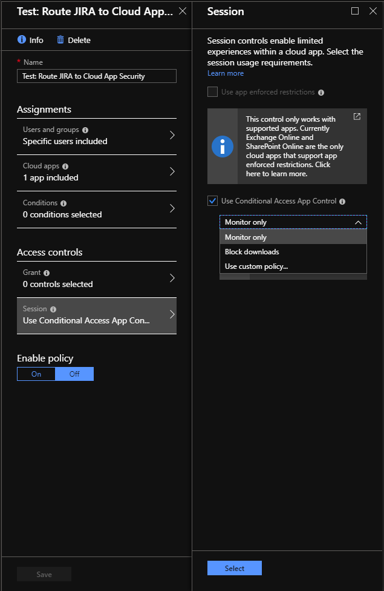

# Office 365 앱용 조건부 액세스 앱 컨트롤 배포

|계산 * *\>**|계획 * *\>**|배포 * *\>**|사용률 * * * *|
|:-----|:-----|:-----|:-----|
|[평가 시작](office-365-cas-overview.md)   |[계획 시작](get-ready-for-office-365-cas.md)   |사용자가 여기 있어!    [다음 단계](ocas-session-policies.md)   |[활용 시작](utilization-activities-for-ocas.md)   |

Office 365 Cloud app Security 조건부 Access 앱 컨트롤에서 제어할 Azure AD Office 365 앱을 구성 하려면 다음 단계를 수행 합니다.

**1 단계: [Azure AD 조건부 액세스 테스트 정책 만들기](#step-1-create-an-azure-ad-conditional-access-test-policy)**

**2 단계: [범위가 지정 된 사용자를 앱에서 정책으로 로그인](#step-2-sign-in-with-a-user-scoped-to-the-policy-in-the-apps)**

**3 단계: Azure AD에서 기본 제공 클라우드 앱 보안 정책을 선택 하지 않았거나 추천 되지 않은 앱에 정책을 적용 하려면 [Cloud App Security 포털에서 고급 컨트롤을 구성 합니다](#step-3-configure-advanced-controls-in-the-cloud-app-security-portal) .**

**4 단계: [배포 테스트](#step-4-test-the-deployment)**

> [!IMPORTANT]
> office 365 앱에 대해 조건부 Access 앱 컨트롤을 배포 하려면 office 365 Cloud App Security license 뿐만 아니라  [Azure AD Premium P1에 대 한 유효한 라이선스가](https://docs.microsoft.com/azure/active-directory/license-users-groups)필요 합니다.

## 1 단계: Azure AD 조건부 액세스 테스트 정책 만들기 

1. Azure Active Directory의 **보안**에서 **조건부 액세스**를 클릭 합니다.

2.  **새 정책을** 클릭 하 고 새 정책을 만듭니다.

3. 테스트 정책의 **사용자**에서 초기 로그온 및 확인에 사용할 수 있는 테스트 사용자 또는 사용자를 할당 합니다.

4. 테스트 정책의 **클라우드 앱**에서 제어할 앱을 조건부 액세스 앱 컨트롤로 할당 합니다.

5.  **세션**에서 기본 제공 정책 중 하나를 사용 하도록 정책을 설정 하 고, **모니터 전용** 또는 **다운로드를 차단**합니다. 또는 Cloud App Security portal에서 고급 정책을 설정 하려면 **사용자 지정 정책을** 사용 합니다 .를 선택 합니다.

6. 해당 하는 **조건 할당** 을 추가 하거나 **컨트롤** 을 부여 합니다 (선택 사항).

> 

## 2 단계: 범위가 지정 된 사용자를 앱에서 정책으로 로그인 

정책을 만든 후에는 해당 정책에 구성 된 각 앱에 로그인 합니다. 정책에 구성 된 사용자를 사용 하 여 로그인 했는지 확인 합니다. 먼저 기존 세션에서 로그 아웃 해야 합니다.

Cloud App Security에서는 로그인 하는 각각의 새 앱에 대해 정책 세부 정보를 서버와 동기화 합니다. 최대 1 분까지 걸릴 수 있습니다.

## 3 단계: Cloud App Security 포털에서 고급 컨트롤 구성 

위 지침에서는 주요 앱에 대 한 기본 제공 Cloud App 보안 정책을 Azure AD에 직접 만드는 데 도움이 되었습니다.

고급 정책을 구성 하려면 Office 365 Cloud App Security 포털에서 [액세스 정책](ocas-access-policies.md) 또는 [세션 정책을](ocas-session-policies.md) 만듭니다.

### 클라이언트 인증서를 사용 하 여 장치를 확인 하려면 (선택 사항):

1. cog 설정으로 이동 하 여 **장치 id**를 선택 합니다.

2. 하나 이상의 루트 또는 중간 인증서를 업로드 합니다.

3. 인증서를 업로드 한 후에는 **장치 태그** 및 **유효한 클라이언트 인증서**를 기반으로 액세스 정책 및 세션 정책을 만들 수 있습니다.

> [!NOTE]
> 인증서는 세션이 유효한 클라이언트 인증서 필터를 사용 하는 정책과 일치 하는 경우에만 사용자에 게 요청 됩니다.
> 
## 4 단계: 배포 테스트 

1. 먼저 기존 세션에서 로그 아웃 합니다. 그런 다음 성공적으로 배포 된 각 앱에 로그인 해 봅니다. Azure AD에 구성 된 정책과 일치 하는 사용자를 사용 하 여 로그인 합니다.

2. Cloud App Security 포털의 **조사**에서 **작업 로그**를 선택 하 고 각 앱에 대해 로그인 작업이 캡처 되었는지 확인 합니다.

3.  **고급**을 클릭 한 다음 원본을 사용 하 여 필터링을 **액세스 제어**하 여 필터링 할 수 있습니다.

4. 관리 되는 장치와 관리 되지 않는 장치에서 모바일 및 데스크톱 앱에 로그인 하는 것이 좋습니다. 이는 활동을 활동 로그에 올바르게 캡처 했는지 확인 하기 위한 것입니다. 작업이 제대로 캡처되고 있는지 확인 하려면 single sign-on 로그온을 클릭 하 여 작업 서랍을 엽니다. 장치가 네이티브 클라이언트 (즉, 모바일 또는 데스크톱 응용 프로그램) 인지 또는 장치가 관리 되는 장치 (호환, 도메인에 가입 된 클라이언트 인증서) 중 어떤 것인지에 관계 없이 **사용자 에이전트 태그** 에 적절 한 반영이 있는지 확인 합니다.

> [!NOTE]
> 배포 된 후에는 조건부 Access 앱 제어 페이지에서 앱을 제거할 수 없습니다. 앱에 대 한 세션 또는 액세스 정책을 설정 하지 않으면 조건부 access 앱 컨트롤에서 앱에 대 한 동작을 변경 하지 않습니다.

## 다음 단계

- [Office 365 Cloud App Security의 세션 정책에 대해 자세히 알아보기](ocas-session-policies.md)

- [Office 365 Cloud App Security의 액세스 정책에 대해 자세히 알아보기](ocas-access-policies.md) 

- [IP를 그룹화하여 Office 365 Cloud App Security 관리를 단순화](group-your-ip-addresses-in-ocas.md)