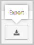

# Office 365 Cloud App Security 세션 정책

|계산 * *\>**|계획 * *\>**|배포 * *\>**|사용률 * * * *|
|:-----|:-----|:-----|:-----|
|[평가 시작](office-365-cas-overview.md)   |[계획 시작](get-ready-for-office-365-cas.md)   |사용자가 여기 있어!    [다음 단계](ocas-access-policies.md)   |[활용 시작](utilization-activities-for-ocas.md)   |

office 365 Cloud App Security session policy는 실시간 세션 수준 모니터링을 사용 하도록 설정 하 여, 사용자 세션에 대해 설정한 정책에 따라 Office 365 앱에 대 한 세부적인 가시성을 affording 하 고 다양 한 작업을 수행할 수 있는 기능을 제공 합니다. 세션 컨트롤을 사용 하 여 액세스를 완전히 허용 하거나 차단 하는 대신 세션을 모니터링 하는 동안 액세스를 허용 하거나 조건부 액세스 앱 컨트롤의 역방향 프록시 기능을 사용 하 여 특정 세션 작업을 제한할 수 있습니다.

예를 들어 관리 되지 않는 장치 또는 특정 위치에서 들어오는 세션에 대해 사용자가 앱에 액세스할 수 있도록 허용 하 고, 다운로드 시 특정 문서를 보호 하도록 요구 하는 경우를 결정할 수 있습니다. 세션 정책을 사용 하면 이러한 사용자 세션 컨트롤을 설정 하 고 액세스를 허용 하며 다음 작업을 수행할 수 있습니다.

- [모든 작업 모니터링](#monitor-all-activities)

- [모든 다운로드 차단](#block-all-downloads)

- [특정 활동 차단](#block-specific-activities)

- [다운로드 시 파일 보호](#protect-files-on-download)

## 세션 정책을 사용 하기 위한 필수 구성 요소

- Azure AD Premium P1 라이선스

- 관련 Office 365 앱은 [조건부 Access 앱 컨트롤을 사용 하 여 배포](ocas-deploy-conditional-access-app-control.md) 해야 합니다.

- 사용자를 Office 365 Cloud App Security로 리디렉션하는 [Azure AD 조건부 액세스 정책을](https://docs.microsoft.com/azure/active-directory/active-directory-conditional-access-azure-portal) 적용 해야 합니다.

## Azure AD 조건부 액세스 정책 만들기

Azure Active Directory 조건부 액세스 정책 및 클라우드 응용 프로그램 보안 세션 정책은 각 사용자 세션을 검사 하 고 각 앱에 대 한 정책 결정을 내리는 동시에 작동 합니다. Azure AD에서 조건부 액세스 정책을 설정 하려면 다음 절차를 수행 합니다.

1. 사용자 또는 사용자 그룹에 대 한 할당과 조건부 액세스 앱 컨트롤을 사용 하 여 제어할 앱을 사용 하 여 [Azure AD 조건부 액세스 정책을](https://docs.microsoft.com/azure/active-directory/active-directory-conditional-access-azure-portal) 구성 합니다. 참고:  [조건부 Access 앱 컨트롤을 사용 하 여 배포한](ocas-deploy-conditional-access-app-control.md)앱만이 정책의 영향을 받습니다.

2.   **세션**페이지에서 **조건부 액세스 앱 제어 적용 제한** 사용을 선택 하 여 Office 365 Cloud App Security로 사용자를 라우팅합니다.

## Cloud App Security 세션 정책 만들기

새 세션 정책을 만들려면 다음 절차를 수행 합니다.

1. 포털에서 **제어** 다음에 **정책을**선택 합니다.

2.  **정책** 페이지에서 **정책** 만들기를 클릭 하 고 **세션 정책을**선택 합니다.

3.  **세션 정책** 창에서 정책에 대 한 이름을 지정 합니다.

4.  **세션 컨트롤 형식** 필드에 다음을 입력 합니다.
    
    - 사용자 **만** 활동을 모니터링 하려는 경우에만 모니터를 선택 합니다. 이 옵션을 선택 하면 모든 로그인, 추론 다운로드 및 활동 유형이 다운로드 될 때 선택한 앱에 대 한 모니터 전용 정책으로 만들어집니다.
    
    - 사용자 작업을 모니터링 하려는 경우 **DLP를 사용 하 여 컨트롤 파일 다운로드를**선택 합니다. 사용자를 차단 하거나 다운로드를 보호 하는 등의 추가 작업을 수행할 수 있습니다.
    
    - 작업 **차단** 을 선택 하 여 **활동 유형** 필터를 사용 하 여 선택할 수 있는 특정 작업을 차단 합니다. 선택한 앱의 모든 활동을 모니터링 하 고 활동 로그에 보고 합니다.  **차단** 동작을 선택 하면 선택한 특정 작업이 차단 됩니다.  **테스트** 작업을 선택 하 고 알림을 켜면 선택한 특정 활동에 대해 경고가 발생 합니다.

5.   **다음의 모든 섹션과 일치 하**는 활동의 **활동 원본** 아래에서 정책에 적용할 추가 활동 필터를 선택 합니다. 이러한 필터에는 다음과 같은 옵션이 포함 될 수 있습니다.
    
    - **장치 태그**:이 필터를 사용 하 여 관리 되지 않는 장치를 식별 합니다.
    
    - **위치**:이 필터를 사용 하 여 알 수 없는 (또는 위험한) 위치를 식별 합니다.
    
    - **ip 주소**:이 필터를 사용 하 여 ip 주소당 필터링 하거나 이전에 할당 된 ip 주소 태그를 사용 합니다.
    
    - **사용자 에이전트 태그**:이 필터를 사용 하 여 추론에서 모바일 및 데스크톱 앱을 식별 하도록 설정 합니다. 이 필터를 equals와 동일 하 게 설정 하거나 **Native 클라이언트**와 동일 하지 않을 수 있습니다. 이 필터는 각 클라우드 앱에 대해 모바일 및 데스크톱 앱에 대해 테스트 해야 합니다. 참고: 세션 정책은 모바일 및 데스크톱 앱을 지원 하지 않습니다. 액세스 정책을 만들어 모바일 앱 및 데스크톱 앱을 차단 하거나 허용할 수도 있습니다.

6.  **DLP를 사용 하 여 파일 다운로드를 제어**하는 옵션을 선택한 경우 **다음** 의 모든 항목에 해당 하는 파일의 **작업 원본** 에서 정책에 적용할 추가 파일 필터를 선택 합니다. 이러한 필터에는 다음과 같은 옵션이 포함 될 수 있습니다.
        
    - **분류 레이블** -조직에서 Azure Information Protection을 사용 하 고 데이터를 분류 레이블로 보호 하는 경우이 필터를 사용 합니다. 적용 한 분류 레이블을 기준으로 파일을 필터링 할 수 있습니다. azure information protection과의 통합에 대 한 자세한 내용은 [azure information protection 통합](https://docs.microsoft.com/cloud-app-security/azip-integration)을 참조 하세요.
        
    - **파일 이름** -이 필터를 사용 하 여 정책을 특정 파일에 적용 합니다.
        
    - **파일 형식** -이 필터를 사용 하 여 특정 파일 형식 (예: 모든 .xls 파일에 대 한 다운로드 차단)에 정책을 적용 합니다.
    
    -  **콘텐츠 검사** 섹션에서 문서 및 파일 콘텐츠를 검색 하도록 DLP 엔진을 사용 하도록 설정할지 여부를 설정 합니다.
    
    -  **작업**에서 다음 항목 중 하나를 선택 합니다.
        
        - **Test (모든 작업 모니터링)**: 설정한 정책 필터에 따라 명시적으로 다운로드를 허용 하도록이 작업을 설정 합니다.
        
        - **block (파일 다운로드 및 모든 작업 모니터링)**: 설정한 정책 필터에 따라 명시적으로 다운로드를 차단 하도록이 작업을 설정 합니다. 자세한 내용은 [block 다운로드 작동 방법을](https://docs.microsoft.com/en-us/cloud-app-security/session-policy-aad#block-download)참조 하세요.
        
        - **보호 (모든 작업을 다운로드 하 고 모니터링 하는 분류 레이블 적용)**:이 옵션은 **세션 정책** 아래에서 **DLP를 사용 하 여 컨트롤 파일 다운로드**를 선택한 경우에만 사용할 수 있습니다. 조직에서 azure information protection을 사용 하는 경우에는 파일에 대 한 azure information protection에 설정 된 분류 레이블을 적용 하는 **작업** 을 설정할 수 있습니다. 자세한 내용은 [어떻게 보호 다운로드가 작동 하는지](https://docs.microsoft.com/en-us/cloud-app-security/session-policy-aad#protect-download)참조 하십시오.

7.   **정책의 심각도로 각 일치 이벤트에 대 한 경고를 만들고**경고 제한을 설정할 수 있습니다. 알림을 전자 메일, 문자 메시지 또는 둘 다 중에서 선택 합니다.

## 모든 작업 모니터링

세션 정책을 만들 때 정책과 일치 하는 각 사용자 세션은 앱을 직접 사용 하는 것이 아니라 세션 제어로 리디렉션됩니다. 사용자는 해당 세션을 모니터링 중임을 알리는 모니터링 알림을 볼 수 있습니다.

사용자에 게 모니터링 되 고 있음을 알리지 않으려면 알림 메시지를 사용 하지 않도록 설정할 수 있습니다.

1. 설정 cog에서 **일반 설정을**선택 합니다.

2. 그런 다음 **조건부 액세스 앱 컨트롤** 에서 **사용자 모니터링** 을 선택 하 고 **사용자** 에 게 알림 확인란의 선택을 취소 합니다.

세션 내에서 사용자를 유지 하기 위해 조건부 액세스 앱 컨트롤은 앱 세션 내의 모든 관련 url, Java 스크립트 및 쿠키를 Office 365 Cloud App Security url로 대체 합니다. 예를 들어 앱이 도메인으로 `myapp.com`끝나는 링크가 포함 된 페이지를 반환 하는 경우 조건부 액세스 앱 컨트롤은 다음과 같은 것 `myapp.com.us.cas.ms`으로 끝나는 도메인으로 연결 되는 링크를 대체 합니다. 이러한 방식으로 전체 세션은 Office 365 Cloud App Security에서 모니터링 됩니다.

조건부 액세스 앱 컨트롤은이를 통해 라우팅되는 모든 사용자 세션의 트래픽 로그를 기록 합니다. 트래픽 로그에는 시간, IP, 사용자 에이전트, 열어 본 url 및 업로드 및 다운로드 된 바이트 수가 포함 됩니다. 이러한 로그는 분석 되 고 연속 보고서, **cloud App Security 조건부 액세스 앱 컨트롤**은 클라우드 검색 대시보드의 클라우드 검색 보고서 목록에 추가 됩니다.

### 로그를 내보내려면 다음을 수행 합니다.

1. cog 설정으로 이동 하 여 **조건부 액세스 앱 컨트롤**을 클릭 합니다.

2. 표 오른쪽에서 내보내기 단추를 클릭 합니다.  

3. 보고서 범위를 선택 하 고 **내보내기를**클릭 합니다. 이 프로세스는 시간이 다소 걸릴 수 있습니다.

### 내보낸 로그를 다운로드 하려면 다음을 수행 합니다.

1. 보고서가 준비 되 면 **설정** 으로 이동한 다음 **내보낸 보고서**로 이동 합니다.

2. 표의 **조건부 Access 앱 컨트롤 트래픽 로그** 목록에서 관련 보고서를 선택 하 고 다운로드를 클릭 합니다.  

## 모든 다운로드 차단

 **Block** 이 Cloud App Security 세션 정책에서 수행 하려는 **작업** 으로 설정 된 경우 조건부 액세스 앱 컨트롤은 사용자가 정책 파일 필터에 따라 파일을 다운로드할 수 없도록 합니다. 다운로드 이벤트는 사용자가 다운로드를 시작할 때 각 앱에 대해 Office 365 Cloud App Security에서 인식 됩니다. 조건부 Access 앱 컨트롤이 실행 되지 않도록 실시간으로 intervenes. 사용자가 다운로드를 시작 했음을 알리는 메시지가 수신 되 면 조건부 Access 앱 컨트롤은 사용자에 게 **다운로드 제한** 된 메시지를 반환 하 고 다운로드 된 파일을 텍스트 파일로 대체 합니다. 사용자에 대 한 텍스트 파일의 메시지는 세션 정책에서 구성 하 고 사용자 지정할 수 있습니다.

## 특정 활동 차단

 **차단 활동** 을 **활동 유형**으로 설정 하면 특정 앱에서 차단할 특정 작업을 선택할 수 있습니다. 선택한 앱의 모든 활동을 모니터링 하 고 활동 로그에 보고 합니다.  **차단** 동작을 선택 하면 선택한 특정 작업이 차단 됩니다.  **테스트** 작업을 선택 하 고 알림을 켜면 선택한 특정 활동에 대해 경고가 발생 합니다.

**특정 활동** 을 차단 하 고 특정 그룹에 적용 하 여 조직에 대 한 포괄적인 읽기 전용 모드를 만듭니다.

## 다운로드 시 파일 보호

  **활동 유형**필터를 사용 하 여 찾을 수 있는 특정 작업을 차단 하는 **작업** 차단을 선택 합니다. 선택한 앱의 모든 활동을 모니터링 하 고 활동 로그에 보고 합니다.  **차단** 동작을 선택 하면 선택한 특정 작업이 차단 됩니다.  **테스트** 작업을 선택 하 고 알림을 켜면 선택한 특정 활동에 대해 경고가 발생 합니다.

 **보호가** Cloud App Security 세션 정책에서 수행 되는 **작업** 으로 설정 된 경우 조건부 액세스 앱 컨트롤은 정책의 파일 필터에 따라 파일의 레이블 지정 및 후속 보호를 적용 합니다. 레이블은 Azure Information Protection 콘솔에서 구성 되며, 해당 레이블이 Cloud App Security 정책에서 옵션으로 표시 되려면 **보호** 된 레이블 내에서 선택 해야 합니다. 레이블을 선택 하 고 Cloud App Security 정책의 기준을 충족 하는 파일이 다운로드 되 면 다운로드 시 해당 보호 (사용 권한 포함)가 파일에 적용 됩니다. 원본 파일은 이제 클라우드 앱에 그대로 유지 되 고 다운로드 된 파일은 보호 됩니다. 파일에 액세스 하려는 사용자는 보호 기능에 따라 결정 되는 사용 권한 요구 사항을 충족 해야 합니다.

## 다음 단계

- [Office 365 Cloud App Security의 액세스 정책에 대해 자세히 알아보기](ocas-access-policies.md)

- [Azure AD 조건부 Access 앱 컨트롤 기능을 사용 하 여 관리 되지 않는 장치에서 다운로드 차단](https://docs.microsoft.com/en-us/cloud-app-security/use-case-proxy-block-session-aad)

