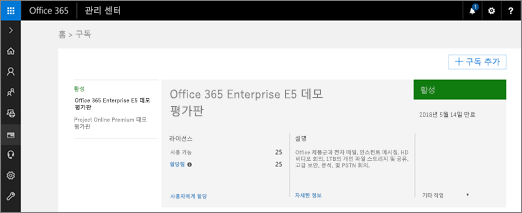
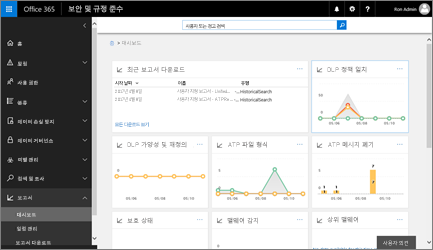

# Office 365 Advanced Threat Protection

## 개요

Office 365 고급 위협 보호 (ATP) 하 여 악의적인 공격 으로부터 조직을 보호 하는데 도움이 됩니다.
  
- 맬웨어 [ATP 안전한](atp-safe-attachments.md) 첨부 파일에 대 한 전자 메일 첨부 파일 검사
    
- 전자 메일 메시지와 [ATP 안전 링크](atp-safe-links.md) 를 사용 하 여 Office 문서에서 검사 웹 주소 (Url)
    
- 식별 하 고 [SharePoint, OneDrive 및 Microsoft 팀의 ATP](atp-for-spo-odb-and-teams.md) 와 온라인 라이브러리에 악의적인 파일을 차단
    
- [위장 하거나 정보를 바탕](learn-about-spoof-intelligence.md) 으로 무단 스푸핑에 대 한 전자 메일 메시지를 확인 합니다.
    
- [Office 365의 ATP 피싱 방지 기능](atp-anti-phishing.md) 을 사용 하면 조직의 사용자 지정 도메인 및 사용자를 가장 하 려 하는 경우 검색
    
**Office 365 ATP를 통해 보호 조직의 보안 팀 안전한 링크, 안전한 첨부 파일 및 피싱 방지에 대 한 정의 하는 정책에 의해 결정 됩니다**. 업그레이드를 주기적으로 검토 하 고 최신 상태로 유지 하 고 서비스에 추가 되는 새로운 기능을 수행 하 여 정책 수정을 고려해 야 합니다. [보고서는 사용할 수](view-reports-for-atp.md) 조직에 대 한 ATP가 작동 하는 방법을 표시 합니다. 또한 이러한 보고서를 검토 하 고 정책에 업데이트할 필요할 영역을 보여줄 수 있습니다. 및 [분석을 위해 Microsoft에 파일을 전송할](#submit-a-suspicious-file-to-microsoft-for-analysis)수 있는 파일 또는 되지 않아야 하는 맬웨어를 검사 하는 Microsoft 구매할 것으로 표시 되는 파일을 설치한 경우.

## 새로운 기능 ATP에 지속적으로 추가 되는

Office 365에 새 기능 추가를 계속 하 고 ATP를 포함 하는 키를 누릅니다. 다음은을 검토 하 고 업데이트를 ATP 정책에 대 한 통화 중 일부는 몇가지 새로운 기능에 대 한 목록입니다. ATP (또는 일반에서 Microsoft 365)에 연결 되는 새로운 기능에 대 한 자세한 내용은, [Microsoft 365 로드맵을](https://www.microsoft.com/microsoft-365/roadmap?filters=O365)참고 하십시오.
  
- 가능한 가장 늦은 년 10 월 2017 부터는 ATP 안전한 링크 보호에 적용할 Url Url를 비롯 하 여 전자 메일에 Office 365 ProPlus 문서, Word, Excel, PowerPoint, Visio 등의 Office와 함께 Windows, iOS 및 Android 장치에서 앱까지 확장 됩니다. ( [Office에 대 한 최신 인증](https://docs.microsoft.com/office365/enterprise/modern-auth-for-office-2013-and-2016)을 사용 하는 있는지 확인 합니다.)
    
- 년 3 월 2018 부터는 ATP 안전한 링크 보호 조직의 사용자 간에 보낸 전자 메일에 적용할까지 확장 됩니다. (있는지 확인 검토 하 [고 ATP 안전한 링크 정책을 편집](set-up-atp-safe-links-policies.md)합니다.)

- 늦은 년 5 월 2018, 보안에서 [격리](quarantine-email-messages.md) 기능에에서 시작 &amp; 준수 센터 [SharePoint Online, 비즈니스 및 Microsoft 팀의 비즈니스용 OneDrive에 대 한 ATP](atp-for-spo-odb-and-teams.md)로 확장 되 고 됩니다.
 
- 2018의 후반부에서 시작, ATP 안전한 링크 보호 Office Online (Word 온라인, Excel, PowerPoint 온라인 온라인과 OneNote 온라인) 및 Mac.에서 Office 365 ProPlus의 Url에 적용 하기 위해 확장 (있는지 확인 검토 하 [고 ATP 안전한 링크 정책을 편집](set-up-atp-safe-links-policies.md)합니다.)

- 년 9 월 2018에서 시작 하는 "," [Office 365 ATP 경고 페이지](atp-safe-links-warning-pages.md) 기능 새 색 구성표를 "," 자세한 내용은 "및" 불구 하 고 사이트에 계속 하는 기능 제공 경고 및 권장 사항. 
 
- 10 월 2018에서 시작 하 고 향후 몇 개월 동안 롤아웃, Outlook, ATP 안전한 링크 원래 Url을 하지 렌더링 또는 때 사용자 웹 응용 프로그램 OWA (Outlook)를 사용 하는 Url 다시 작성 합니다. (이 네이티브 링크 표시 유형 호출합니다.)

      
## Office 365 ATP 가져오기

> [!IMPORTANT]
> Office 365 ATP Microsoft 365 Enterprise, Office 365 엔터프라이즈 e 5, Office 365 교육 A5 및 [Microsoft 365 비즈니스](https://docs.microsoft.com/en-us/microsoft-365/business/security-features)와 같은 구독에 포함 됩니다. 조직에 Office 365 ATP를 포함 하지 않는 한 Office 365 구독을 하는 경우에 추가 기능으로 ATP을 잠재적으로 구입할 수 있습니다. 자세한 내용은 [Office 365 고급 위협 Protection Service Description](https://docs.microsoft.com/office365/servicedescriptions/office-365-advanced-threat-protection-service-description)을 참조 하십시오. 

1. 관리자는 전역 또는 보안으로 이동 [https://portal.office.com](https://portal.office.com) 와 Office 365에 대 한 작업이 나 교육용 계정을 사용 하 여 로그인 합니다. 
    
2. **관리** 를 선택 \> **대금 청구** 현재 구독에 포함 된 항목을 볼 수 있습니다.  
  
3. **Office 365 엔터프라이즈 e 5**, **Office 365 교육 A5**또는 **Microsoft 365 비즈니스**을 참조 하는 경우 조직에 ATP 합니다.  **Office 365 엔터프라이즈 E3** 또는 **Office 365 Enterprise E1**등의 다른 구독을 참조 하는 경우에 ATP를 추가 하는 것이 좋습니다. 이렇게 하려면 **+ 추가 구독을**선택 합니다.
    
ATP를 만든 후 다음 단계에서는 보안 팀이 정책을 정의입니다. 
  
## ATP에 대 한 정책 정의

- 신뢰할 수 있는 사용자 또는 도메인에서 것 처럼 보이는 **[Office 365의 ATP 피싱 방지 정책 설정](set-up-anti-phishing-policies.md)** 가장 기반 공격을 포함 하는 전자 메일 메시지를 보낼 사람 공격자 로부터 보호 하기 위해 

- 조직의 [차단 된 사용자 지정 Url 목록](set-up-a-custom-blocked-urls-list-wtih-atp.md) 및 [사용자 지정 "rewrite 수행" Url 목록](set-up-a-custom-do-not-rewrite-urls-list-with-atp.md) 등을 **[Office 365의 ATP 안전한 링크 정책 설정](set-up-atp-safe-links-policies.md)**
    
- **[Office 365의 ATP 안전한 첨부 파일 정책 설정](set-up-atp-safe-attachments-policies.md)** [동적 배달 하 고 미리 보는](dynamic-delivery-and-previewing.md) 포함 될 수 있는
  
## 보고서를 확인 하 여 ATP가 작동 하는 방법을 참조 하십시오.

ATP 정책이 설정 되어, 후 보고서는 서비스가 작동 하는 방법을 표시를 사용할 수 있습니다.

  
1. Office 365 전역 관리자, 보안 관리자 또는 보안 판독기 되는지 확인 합니다. (참조 [Office 365 보안에 대 한 사용 권한을 &amp; 준수 센터](permissions-in-the-security-and-compliance-center.md).)
    
2. [고급 위협 보호에 대 한 보고서 보기](view-reports-for-atp.md)입니다.
    
3. 필요한 경우에 보안 정책에 대 한 조정 확인 합니다. 다음 리소스를 참조 합니다.

  - [Office 365의 ATP 피싱 방지 정책](set-up-anti-phishing-policies.md)
    
  - [Office 365의 ATP 안전한 링크 정책](set-up-atp-safe-links-policies.md)
    
  - [Office 365의 ATP 안전한 첨부 파일 정책](set-up-atp-safe-attachments-policies.md)
    
    
## 분석을 위해 Microsoft에 의심 스러운 파일 전송

- 맬웨어 수 것으로 의심 되는 파일을 가져오는 경우에 분석을 위해 Microsoft에 해당 파일을 제출할 수 있습니다. [Windows Defender 보안 인텔리전스 제출 포털](https://go.microsoft.com/fwlink/?linkid=857185)을 참고 하십시오.

- 분석을 위해 Microsoft에 전송 하려고 하는 전자 메일 메시지 (또는 없는 첨부 파일)를 가져오면는 [보고서 메시지 추가 기능에](enable-the-report-message-add-in.md)사용 합니다. 
  

