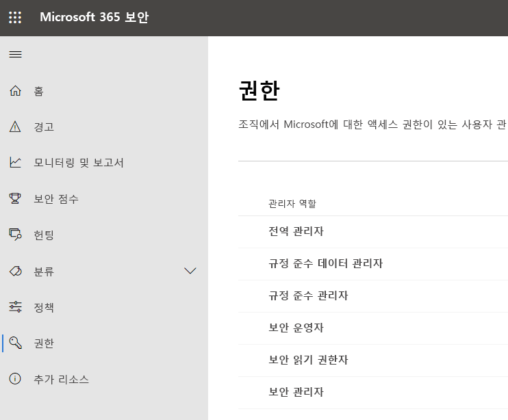
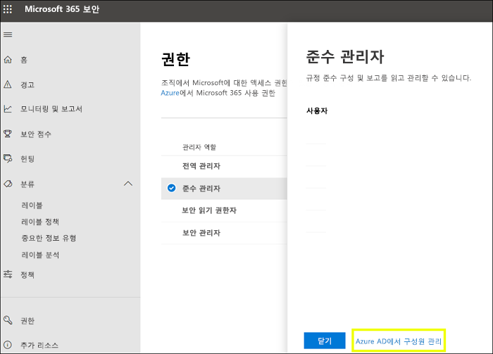
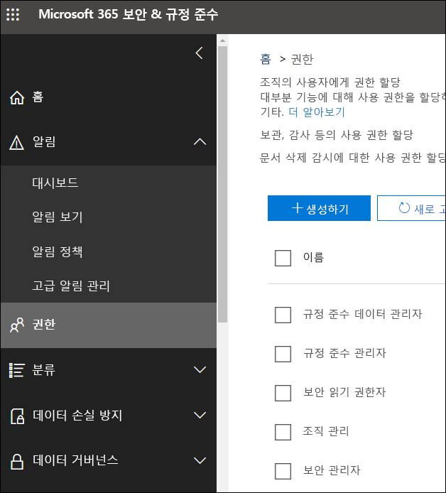

# Microsoft 365 규정 준수 센터 및 Microsoft 365 보안 센터의 권한

조직에서는 모든 Microsoft 365 서비스에 적용되는 보안 및 규정 준수 시나리오를 관리해야 합니다. 조직의 IT 그룹에 속한 적절한 사용자에게 올바른 관리자 권한을 유연하게 부여할 수 있어야 합니다. Microsoft 365 보안 센터나 Microsoft 365 규정 준수 센터를 사용하여 보안 또는 규정 준수와 관련된 모든 작업에 대한 권한을 중앙에서 관리할 수 있습니다.

전역 관리자가 이러한 관리 역할을 할당하면, 관리자는 Microsoft 365 보안 센터, Microsoft 365 규정 준수 센터, Azure, Office 365, Enterprise Mobility + Security와 같은 Microsoft 365의 모든 서비스에 적용되는 기능과 데이터에 액세스할 수 있습니다.

## Microsoft 365 역할이란?

Microsoft 365 규정 준수 센터 및 Microsoft 365 보안 센터에 나타나는 역할은 Azure Active Directory 역할입니다. 이러한 역할은 조직의 IT 그룹의 직무에 맞게 설계되므로 사용자에게 업무 수행에 필요한 모든 권한을 쉽게 부여할 수 있습니다.

|**역할**|**설명**|
|:-----|:-----|
|**전역 관리자**|이 역할의 사용자는 모든 Microsoft 365 서비스의 모든 관리 기능에 액세스할 수 있습니다. 전역 관리자만 다른 관리자 역할을 할당할 수 있습니다.|
|**규정 준수 데이터 관리자**|이 역할의 사용자는 Microsoft 365에서 조직의 데이터를 추적하고, 보호가 설정되었는지 확인하고, 위험을 완화하는 데 도움이 되는 모든 이슈에 대한 인사이티를 얻을 수 있습니다.|
|**준수 관리자**|이 역할의 사용자는 조직이 규정 요구 사항을 준수하도록 하고, eDiscovery 사례를 관리하고, Microsoft 365 위치, ID, 앱 전반에서 데이터 관리 정책을 유지할 수 있습니다.|
|**보안 운영자**|이 역할의 사용자는 Microsoft 365 사용자, 디바이스 및 콘텐츠에 대한 활성 위협을 보고, 검토하고, 대응할 수 있습니다.|
|**보안 읽기 권한자**|이 역할의 사용자는 Microsoft 365 사용자, 디바이스 및 콘텐츠에 대한 활성 위협을 보고 조사할 수 있지만 (보안 운영자와는 달리) 조치를 취하여 대응할 수 있는 권한은 없습니다.|
|**보안 관리자**|이 역할의 사용자는 보안 정책을 관리하고, Microsoft 365 제품 전반에서 보안 분석 및 보고서를 검토하고, 위협 상황에 대한 최신 정보를 파악하여 조직의 전반적인 보안을 제어할 수 있습니다.|

## Microsoft 365 역할의 액세스 권한

사용 가능한 역할과 해당 역할에 할당된 구성원이 할 수 있는 작업은 다음과 같습니다.

### 전역 관리자

이 역할의 사용자는 Azure Active Directory의 모든 관리 기능뿐 아니라 Microsoft 365 보안 센터, Microsoft 365 규정 준수 센터, Exchange Online, SharePoint Online 및 비즈니스용 Skype Online과 같이 Azure Active Directory ID를 사용하는 서비스에도 액세스할 수 있습니다. Azure Active Directory 테넌트에 등록하는 사람이 전역 관리자가 됩니다. 전역 관리자만 다른 관리자 역할을 할당할 수 있습니다. 회사에 여러 전역 관리자가 있을 수 있습니다. 전역 관리자는 모든 사용자 및 모든 다른 관리자의 암호를 다시 설정할 수 있습니다.

### 준수 관리자

이 역할이 있는 사용자에게는 Microsoft 365 규정 준수 센터, Microsoft 365 관리 센터, Azure, Office 365 보안 및 준수 센터에서 규정 준수 관련 기능을 관리할 권한이 있습니다. 이러한 사용자는 Exchange 관리 센터, 준수 관리자, Teams 및 비즈니스용 Skype 관리 센터 내의 모든 기능을 관리하고 Azure 및 Microsoft 365 관련 지원 티켓을 만들 수도 있습니다.

|**서비스...**|**준수 관리자가 할 수 있는 작업...**|
|:-----|:-----|
|[**Microsoft 365 규정 준수 센터**](https://compliance.microsoft.com/)|Microsoft 365 서비스 전반에 걸쳐 조직의 데이터를 보호하고 관리합니다.    규정 준수 경고를 관리합니다.|
|[**준수 관리자**](https://docs.microsoft.com/office365/securitycompliance/meet-data-protection-and-regulatory-reqs-using-microsoft-cloud)|조직의 규정 준수 활동을 추적, 할당 및 확인합니다.|
|[**Office 365 보안 및 준수 센터**](https://support.office.com/article/About-Office-365-admin-roles-da585eea-f576-4f55-a1e0-87090b6aaa9d)|데이터 거버넌스를 관리합니다.    법적 조사/데이터 조사를 수행합니다.    데이터 주체 요청을 관리합니다.|
|[**Intune**](https://docs.microsoft.com/intune/role-based-access-control)|모든 Intune 감사 데이터를 확인합니다.|
|[**Cloud App Security**](https://docs.microsoft.com/cloud-app-security/manage-admins)|읽기 전용 권한이 있으며 경고를 관리할 수 있습니다.    파일 정책을 생성/수정하고 파일 거버넌스 작업을 허용할 수 있습니다.    데이터 관리에서 모든 기본 제공 보고서를 확인할 수 있습니다.|

### 규정 준수 데이터 관리자

이 역할이 있는 사용자는 Microsoft 365 규정 준수 센터, Microsoft 365 관리 센터 및 Azure에서 데이터를 보호 및 추적할 권한이 있습니다. 또한 사용자는 Exchange 관리 센터, 준수 관리자, Teams 및 비즈니스용 Skype 관리 센터 내의 모든 기능을 관리하고 Azure 및 Microsoft 365의 지원 티켓을 만들 수 있습니다.

|**이 서비스에서는...**|**규정 준수 데이터 관리자는 다음을 수행할 수 있습니다.**|
|:-----|:-----|
|[**Microsoft 365 규정 준수 센터**](https://compliance.microsoft.com/)|Microsoft 365 서비스 전반에 걸쳐 조직의 데이터를 보호하고 관리합니다.    규정 준수 경고를 관리합니다.    민감도 레이블을 관리합니다.|
|[**준수 관리자**](https://docs.microsoft.com/office365/securitycompliance/meet-data-protection-and-regulatory-reqs-using-microsoft-cloud)|조직의 규정 준수 활동을 추적, 할당 및 확인합니다.|
|[**Office 365 보안 및 준수 센터**](https://support.office.com/article/About-Office-365-admin-roles-da585eea-f576-4f55-a1e0-87090b6aaa9d)|데이터 거버넌스를 관리합니다.    법적 조사/데이터 조사를 수행합니다.    데이터 주체 요청을 관리합니다.    민감도 레이블을 관리합니다.|
|[**Intune**](https://docs.microsoft.com/intune/role-based-access-control)(서비스 예정)|모든 Intune 감사 데이터를 확인합니다.|
|[**Cloud App Security**](https://docs.microsoft.com/cloud-app-security/manage-admins)|읽기 전용 권한을 사용하여 정보를 확인합니다.  알림을 관리합니다.    파일 정책을 생성/수정하고 파일 거버넌스 작업을 허용합니다.    데이터 관리에서 모든 기본 제공 보고서를 확인합니다.|

### 보안 관리자

이 역할의 사용자에게는 Microsoft 365 보안 센터, Azure Active Directory ID 보호, Azure Information Protection, Office 365 보안 및 준수 센터의 보안 관련 기능 관리 권한이 있습니다.

|**이 서비스에서는...**|**보안 관리자는 다음을 수행할 수 있습니다.**|
|:-----|:-----|
|[**Microsoft 365 보안 센터**](https://security.microsoft.com/)|Microsoft 365 서비스 전반의 보안 관련 정책을 모니터링합니다.     보안 위협과 경고를 관리합니다.    보고서를 봅니다.    민감도 레이블을 관리합니다.|
|**ID 보호 센터**|보안 읽기 권한자가 할 수 있는 모든 작업 외에, 암호 재설정을 제외한 모든 ID 보호 센터 작업을 수행할 수 있습니다.|
|[**Privileged Identity Management**](https://docs.microsoft.com/azure/active-directory/privileged-identity-management/pim-configure)|보안 읽기 권한자 역할이 할 수 있는 모든 작업을 수행합니다.    Azure AD 역할 할당 또는 설정은 관리할 수 **없습니다**.|
|[**Office 365 보안 및 준수 센터**](https://support.office.com/article/About-Office-365-admin-roles-da585eea-f576-4f55-a1e0-87090b6aaa9d)|보안 정책을 관리합니다.    보안 위협을 확인, 조사 및 대응합니다.    보고서를 봅니다.    민감도 레이블을 관리합니다.|
|**Azure Advanced Threat Protection**|의심스러운 보안 활동을 모니터링하고 대응합니다.|
|**Windows Defender ATP 및 EDR**|역할을 할당합니다.    머신 그룹을 관리합니다.    엔드포인트 위협 검색 및 자동 수정을 구성합니다.    경고를 확인, 조사 및 대응합니다.|
|[**Intune**](https://docs.microsoft.com/intune/role-based-access-control)|사용자, 디바이스, 등록, 구성 및 애플리케이션 정보를 확인합니다.    Intune은 변경할 수 **없습니다**.|
|[**Cloud App Security**](https://docs.microsoft.com/cloud-app-security/manage-admins)|관리자, 정책, 설정을 추가하고, 로그를 업로드하고, 거버넌스 작업을 수행합니다.|
|[**Azure Security Center**](https://docs.microsoft.com/azure/role-based-access-control/built-in-roles)(서비스 예정)|보안 정책을 보고, 보안 상태를 보고, 보안 정책을 편집하고, 경고 및 권장 사항을 보고, 경고 및 권장 사항을 해제합니다.|
|[**Office 365 서비스 상태**](https://docs.microsoft.com/office365/enterprise/view-service-health)|Office 365 서비스의 상태를 확인합니다.|

### 보안 운영자

이 역할의 사용자는 경고를 관리할 수 있고 Microsoft 365 보안 센터, Azure Active Directory, ID 보호, Privileged Identity Management의 모든 정보를 비롯한 보안 관련 기능에 대한 전역 읽기 전용 액세스 권한이 있습니다. 또한 Azure Active Directory 로그인 보고서와 감사 로그 읽기 권한 및 Office 365 보안 및 준수 센터의 읽기 권한도 있습니다.

|**이 서비스에서는...**|**보안 운영자는 다음을 수행할 수 있습니다.**|
|:-----|:-----|
|[**Microsoft 365 보안 센터**](https://security.microsoft.com/)|보안 읽기 권한자 역할이 할 수 있는 모든 작업을 수행합니다.    보안 경고를 확인, 조사 및 대응합니다.|
|**ID 보호 센터**(서비스 예정)|보안 읽기 권한자 역할이 할 수 있는 모든 작업을 수행합니다.|
|[**Privileged Identity Management**](https://docs.microsoft.com/azure/active-directory/privileged-identity-management/pim-configure)|보안 읽기 권한자 역할이 할 수 있는 모든 작업을 수행합니다.|
|[**Office 365 보안 및 준수 센터**](https://support.office.com/article/About-Office-365-admin-roles-da585eea-f576-4f55-a1e0-87090b6aaa9d)|보안 읽기 권한자 역할이 할 수 있는 모든 작업을 수행합니다.    보안 위협을 확인, 조사 및 대응합니다.|
|**Windows Defender ATP 및 EDR**|보안 읽기 권한자 역할이 할 수 있는 모든 작업을 수행합니다.    경고를 확인, 조사 및 대응합니다.|
|[**Intune**](https://docs.microsoft.com/intune/role-based-access-control)|사용자, 디바이스, 등록, 구성 및 애플리케이션 정보를 확인합니다.    Intune은 변경할 수 **없습니다**.|
|[**Cloud App Security**](https://docs.microsoft.com/cloud-app-security/manage-admins)|보안 읽기 권한자가 할 수 있는 모든 작업 외에, 경고를 보고 해제할 수 있습니다.|
|[**Office 365 서비스 상태**](https://docs.microsoft.com/office365/enterprise/view-service-health)|Office 365 서비스의 상태를 확인합니다.|

### 보안 읽기 권한자

이 역할의 사용자에게는 Microsoft 365 보안 센터, Azure Active Directory, ID 보호, Privileged Identity Management의 모든 정보를 비롯한 보안 관련 기능에 대한 전역 읽기 전용 액세스 권한이 있습니다. 또한 Azure Active Directory 로그인 보고서와 감사 로그 읽기 권한 및 Office 365 보안 및 준수 센터의 읽기 권한도 있습니다.

|**이 서비스에서는...**|**보안 읽기 권한자는 다음을 수행할 수 있습니다.**|
|:-----|:-----|
|[**Microsoft 365 보안 센터**](https://security.microsoft.com/)|Microsoft 365 서비스 전반에서 보안 관련 정책을 확인합니다.    보안 위협 및 경고를 확인합니다.    보고서를 봅니다.|
|**ID 보호 센터**|보안 기능에 대한 모든 보안 보고서와 설정 정보, 즉 스팸 방지, 암호화, DLP(데이터 손실 방지), 맬웨어 방지, ATP(Advanced Threat Protection), 피싱 방지 및 메일 흐름 규칙(전송 규칙이라고도 함)을 읽습니다.|
|[**Privileged Identity Management**](https://docs.microsoft.com/azure/active-directory/privileged-identity-management/pim-configure)|읽기 전용 액세스 권한으로 Azure AD PIM에 표시되는 모든 정보, 즉 Azure AD 역할 할당에 대한 정책 및 보고서, 보안 검토, Azure AD 역할 할당 외의 시나리오에 대한 (향후) 정책 데이터 및 보고서를 봅니다.    Azure AD PIM에 로그인을 하거나 어떠한 변경도 할 수 **없습니다**. 이 역할에 속한 사람은 PIM 포털 또는 PowerShell에서 적격 사용자를 대상으로 전역 관리자, 권한 있는 역할 관리자 등의 추가 역할을 활성화할 수도 있습니다.|
|[**Office 365 보안 및 준수 센터**](https://support.office.com/article/About-Office-365-admin-roles-da585eea-f576-4f55-a1e0-87090b6aaa9d)|보안 정책을 봅니다.    보안 위협을 확인하고 조사합니다.    보고서를 봅니다.|
|**Windows Defender ATP 및 EDR**|경고를 확인하고 조사합니다.|
|[**Intune**](https://docs.microsoft.com/intune/role-based-access-control)|사용자, 디바이스, 등록, 구성 및 애플리케이션 정보를 확인합니다.    Intune은 변경할 수 **없습니다**.|
|[**Cloud App Security**](https://docs.microsoft.com/cloud-app-security/manage-admins)|읽기 전용 권한을 사용하여 정보를 확인합니다.    알림을 관리합니다.|
|[**Azure Security Center**](https://docs.microsoft.com/azure/role-based-access-control/built-in-roles)|권장 사항 및 경고를 봅니다.    보안 정책을 봅니다.    보안 상태를 볼 수 있지만 변경할 수는 없습니다.|
|[**Office 365 서비스 상태**](https://docs.microsoft.com/office365/enterprise/view-service-health)|Office 365 서비스의 상태를 확인합니다.|

## 전역 관리자는 Azure Active Directory에서 역할을 관리할 수 있습니다.

Microsoft 365 규정 준수 센터 및 Microsoft 365 보안 센터에서 역할을 선택하여 해당 할당을 볼 수 있습니다. 하지만 해당 과제를 관리하려면 Azure Active Directory로 이동해야 합니다.

자세한 내용은 [Azure Active Directory에서 관리자 역할 보기 및 할당](https://docs.microsoft.com/azure/active-directory/users-groups-roles/directory-manage-roles-portal)을 참조하세요.

## Azure Active Directory 대신 서비스에서 역할 관리

Microsoft 365 규정 준수 센터 및 Microsoft 365 보안 센터에 나타나는 역할은 사용자에게 권한이 있는 서비스에도 나타납니다. 예를 들어, Office 365 보안 및 준수 센터에서 이러한 역할을 볼 수 있습니다.

### 상속 끊기

Azure Active Directory에서 이러한 역할을 관리하는 경우에는 **모든** Microsoft 365 서비스의 역할 관리 작업을 중앙 집중식으로 수행하는 것이 중요합니다. 그러나 Office 365 보안 및 준수 센터와 같은 특정 서비스에서 역할을 관리하는 경우 해당 특정 서비스에 대한 역할**만** 관리하게 됩니다. 한 서비스의 역할에 대한 할당 및 사용 권한은 Azure Active Directory 역할에 부여된 모든 사용 권한을 재정의합니다.

이러한 기능은 예를 들어, 보안 관리자 역할에 할당된 사용자에게 인시던트 관리 권한이 없는 경우에 유용할 수 있습니다. 그렇지만 Windows Defender Advanced Threat Protection의 사용 권한을 사용하여 해당 서비스의 인시던트 관리를 위한 특정 권한을 부여할 수 있습니다.

## 각 Microsoft 365 서비스에 대한 역할 정보를 찾을 수 있는 위치

사용자에게 Microsoft 365 준수 또는 보안 관리자 역할 중 하나를 할당하여 Microsoft 365 서비스 범위에 대한 사용 권한을 부여합니다. 각 서비스의 역할에 대한 특정 권한과 관련된 자세한 내용을 보려면 아래 링크를 사용하세요.

|**Microsoft 365 서비스**|**역할 정보**|
|:-----|:-----|
|Office 365 및 Microsoft 365 비즈니스 플랜의 관리자 역할|[Office 365 관리자 역할](https://docs.microsoft.com/office365/admin/add-users/about-admin-roles?view=o365-worldwide)|
|Azure AD(Azure Active Directory) 및 Azure AD ID 보호|[Azure AD 관리자 역할](https://docs.microsoft.com/azure/active-directory/users-groups-roles/directory-assign-admin-roles)|
|Azure Advanced Threat Protection|[Azure ATP 역할 그룹](https://docs.microsoft.com/azure-advanced-threat-protection/atp-role-groups)|
|Azure Information Protection|[Azure AD 관리자 역할](https://docs.microsoft.com/azure/active-directory/users-groups-roles/directory-assign-admin-roles)|
|준수 관리자|[준수 관리자 역할](https://docs.microsoft.com/office365/securitycompliance/meet-data-protection-and-regulatory-reqs-using-microsoft-cloud#permissions-and-role-based-access-control)|
|Exchange Online|[Exchange 역할 기반 액세스 제어](https://docs.microsoft.com/exchange/understanding-role-based-access-control-exchange-2013-help)|
|Intune|[Intune 역할 기반 액세스 제어](https://docs.microsoft.com/intune/role-based-access-control)|
|Managed Desktop|[Azure AD 관리자 역할](https://docs.microsoft.com/azure/active-directory/users-groups-roles/directory-assign-admin-roles)|
|Microsoft Cloud App Security|[역할 기반 액세스 제어](https://docs.microsoft.com/cloud-app-security/manage-admins)|
|Office 365 보안 및 준수 센터|[Office 365 관리자 역할](https://docs.microsoft.com/office365/SecurityCompliance/permissions-in-the-security-and-compliance-center)|
|Privileged Identity Management|[Azure AD 관리자 역할](https://docs.microsoft.com/azure/active-directory/users-groups-roles/directory-assign-admin-roles)|
|보안 점수|[Azure AD 관리자 역할](https://docs.microsoft.com/azure/active-directory/users-groups-roles/directory-assign-admin-roles)|
|SharePoint Online|[Azure AD 관리자 역할](https://docs.microsoft.com/azure/active-directory/users-groups-roles/directory-assign-admin-roles)    [Office 365의 SharePoint 관리자 역할 정보](https://docs.microsoft.com/sharepoint/sharepoint-admin-role)|
|Teams/비즈니스용 Skype|[Azure AD 관리자 역할](https://docs.microsoft.com/azure/active-directory/users-groups-roles/directory-assign-admin-roles)|
|Windows Defender Advanced Threat Protection|[Windows Defender ATP 역할 기반 액세스 제어](https://docs.microsoft.com/windows/security/threat-protection/windows-defender-atp/rbac-windows-defender-advanced-threat-protection)|

## 곧 제공될 기능

Microsoft 365 규정 준수 센터 및 Microsoft 365 보안 센터의 권한과 관련해서 작업을 진행 중입니다. 예를 들어, 현재 다음 기능을 지원하고 있습니다.

- Azure Active Directory로 이동하지 않고, Microsoft 365 규정 준수 센터 및 Microsoft 365 보안 센터에서 역할을 관리합니다.

- 특정 권한을 추가하거나 제거하여 역할을 사용자 지정합니다.

- 선택한 권한을 사용하여 사용자 지정 역할을 만듭니다.
