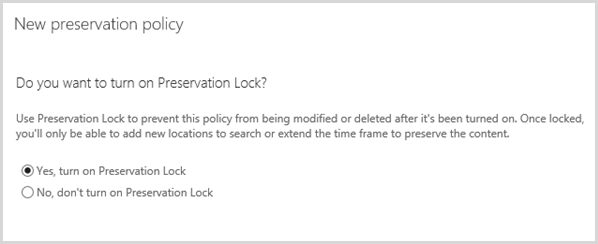

# 보존 정책 개요Overview of preservation policies

> [!IMPORTANT]
> 사용 중이 던 보존 정책 보존 정책에는 모든 작업을 수행 하는 새로운 기능인 보존 정책 등을 해당 정책에 자동으로 변환 합니다. 보존 정책을 사용 하 고 사용자 로부터 변경할 필요 없이 콘텐츠를 보존 계속 됩니다. 보안에서 **보존** 되는 용지의 이러한 정책은 찾을 수 &amp; 준수 센터입니다. 자세한 내용은 참조 [셰이프시트에서 변경 된 보존 정책?](retention-policies.md#what-happened-to-preservation-policies)If you were using a preservation policy, that policy has been automatically converted to a retention policy, which is a new feature that does everything a preservation policy does and more. The preservation policy will continue to work and preserve your content without requiring any changes from you. You can find these policies on the **Retention** page in the Security &amp; Compliance Center. For more information, see [What happened to preservation policies?](retention-policies.md#what-happened-to-preservation-policies)
  
업계 규정 또는 내부 정책을 준수, 조직에서는 하려면를 일정 기간에 대 한 콘텐츠를 유지 합니다. Office 365에서 보존 정책을 사용 하 여 무기한 또는 특정 기간에 대 한 사이트, 사서함 및 공용 폴더의 콘텐츠를 유지할 수 있습니다. 키워드 또는 결과 범위를 좁힐 수 날짜 범위를 제공 하 여 보존할 수는 콘텐츠를 필터링 할 수 있습니다.To comply with industry regulations or internal policies, organizations want to preserve content for a certain period of time. With a preservation policy in Office 365, you can preserve content in sites, mailboxes, and public folders indefinitely or for a specific duration. You can also filter the content that will be preserved by supplying keywords or a date range to narrow the results.
  
특정 사서함과 7 년에 대 한 Sales 부서에 속한 사이트의 콘텐츠를 보존 하 고 추가 특정 포함 된 콘텐츠만 마지막 2 년에서 보존 하려는 한다는 것으로 정책의 범위를 좁힐 수 등 클라이언트의 이름입니다.For example, you can preserve the content in specific mailboxes and sites belonging to the Sales Department for seven years, and further narrow the scope of the policy by saying that you want to preserve only content from the last two years that contains a specific client's name.
  
콘텐츠 보존 정책이 적용 되 면 사용자 들이를 편집 하 고 nothing가 변경 되는 내용이 원래 위치에서의 위치에 보존 하는 경우의 콘텐츠로 작업 계속 수 있습니다. 하지만 다른 사용자를 편집 또는 삭제 하는 정책이 적용 되는 콘텐츠, 복사본 정책이 적용 되는 동안 보존 되는 위치는 안전한 위치에 저장 됩니다.When content is subject to a preservation policy, people can continue to edit and work with the content as if nothing's changed because the content's preserved in place, in its original location. But if someone edits or deletes content that's subject to the policy, a copy is saved to a secure location where it's preserved while the policy is in effect.
  
마지막으로, 일부 조직에서는 유가 증권의 and Exchange 수수료 (초) 규칙 17a-4, 보존 정책 켜져 후 없습니다 수 해제 하거나 하는 덜 제한적인 만든 사용 해야하는 등 규정 본문으로 정의 된 규칙을 준수 해야 합니다. 이 요구 사항에 맞게, 보존 잠금을 사용할 수 있습니다. 정책을 잠긴, 후 아무도-관리자를 포함 하 여 — 정책을 해제 하거나 덜 제한적인 만들 수 있습니다.Finally, some organizations may need to comply with rules defined by regulatory bodies such as the Securities and Exchange Commission (SEC) Rule 17a-4, which requires that after a preservation policy is turned on, it cannot be turned off or made less restrictive. To meet this requirement, you can use Preservation Lock. After a policy's been locked, no one—including the administrator—can turn off the policy or make it less restrictive.
  
컨트롤을 만들고 Office 365 보안에서 보존 페이지에서 보존 정책을 관리 &amp; 준수 센터입니다.You create and manage preservation policies on the Retention page in the Office 365 Security &amp; Compliance Center.
  

  
> [!NOTE]
> Exchange Online 사서함에 보존 정책을 포함 하는 사서함 Exchange Online 계획 2 라이선스를 할당 되어야 합니다. 사서함이 Exchange Online 계획 1 라이선스에 할당 하는 경우 보존 정책에 포함 하려면 별도 Exchange Online 보관 라이선스를 할당 해야 합니다.To include an Exchange Online mailbox in a preservation policy, the mailbox must be assigned an Exchange Online Plan 2 license. If a mailbox is assigned an Exchange Online Plan 1 license, you would have to assign it a separate Exchange Online Archiving license to include it in a preservation policy. 
  
## 보존 정책이 원본 위치의 콘텐츠에 작동하는 방식How a preservation policy works with content in place

보존 정책에서 사이트, 사서함 또는 공용 폴더를 포함 하는 경우 콘텐츠 원래 위치에 남아 있습니다. 사용자가 문서 또는 메일, 작업을 계속할 수 있지만 정책을 시작 되는 콘텐츠의 복사본 시점의 유지 됩니다. 사이트에 대 한 내용이 보존 대기 라이브러리;에 보존 사서함과 공용 폴더에 대 한 내용이 복구 가능한 항목 폴더에 보존 합니다. 이러한 안전한 위치 및 보존 된 콘텐츠 대부분 사람들에 게 표시 되지 않습니다. 보존 정책을 사용 하 여 사용자도 필요가 없습니다를 알고 있는 해당 콘텐츠는 정책에 따라 달라 집니다.When you include a site, mailbox, or public folder in a preservation policy, the content remains in its original location. People can continue to work with their documents or mail, but a copy of the content as it existed when you initiated the policy is preserved. For sites, content's preserved in the Preservation Hold library; for mailboxes and public folders, content's preserved in the Recoverable Items folder. These secure locations and the preserved content are not visible to most people. With a preservation policy, people do not even need to know their content is subject to the policy.
  

  
### 사이트 콘텐츠Site content

보존 정책 사이트 수준에서 적용 됩니다. 보존 정책에는 사이트를 포함 하는 경우 하나 이미 존재 하지 않는 경우 보존 대기 라이브러리가 생성 됩니다. 사이트 모음 소유자에만 표시 되기 때문에 대부분의 사용자는 보존 대기 라이브러리를 볼 수 없습니다.A preservation policy is applied at the level of a site. When you include a site in a preservation policy, a Preservation Hold library is created, if one doesn't already exist. Most users can't view the Preservation Hold library because it's visible only to site collection owners.
  
사용자를 변경 하거나 보존 정책이 적용 되는 사이트의에서 콘텐츠를 삭제 하려고 시도 하면, 정책 정책이 적용 된 이후로 콘텐츠의 변경 되었는지 확인 먼저 합니다. 이것이 보존 정책이 적용 된 이후 첫 변경, 정책 보존 대기 라이브러리에 콘텐츠를 복사 하 고 변경 하거나 원래 콘텐츠를 삭제 하려면 해당 사용자를 허용 합니다. 참고 사이트의 모든 콘텐츠에 콘텐츠 보존 정책에 의해 사용 되는 쿼리 필터와 일치 하지 않는 경우에 보존 대기 라이브러리로 복사할 수 있습니다.If a person attempts to change or delete content in a site that's subject to a preservation policy, first the policy checks whether the content's been changed since the policy was applied. If this is the first change since the preservation policy was applied, the policy copies the content to the Preservation Hold library, and then allows the person to change or delete the original content. Note that any content in the site can be copied to the Preservation Hold library, even if the content does not match the filter of the query used by the preservation policy.
  
그런 다음 타이머 작업이 자료 보존 라이브러리를 정리합니다. 타이머 작업은 주기적으로 실행되면서 자료 보존 라이브러리의 모든 콘텐츠를 사이트의 보존 정책에서 사용하는 필터와 비교합니다. 콘텐츠가 하나 이상의 필터와 일치하지 않는 한, 타이머 작업은 자료 보존 라이브러리에서 해당 콘텐츠를 영구히 삭제합니다.Then a timer job cleans up the Preservation Hold library. The timer job runs periodically and compares all content in the Preservation Hold library to the filters used by the preservation policies on the site. Unless content matches at least one of the filters, the timer job permanently deletes the content from the Preservation Hold library.
  
이전 보존 정책이 적용 될 때 존재 하는 콘텐츠를 적용 합니다. 또한 만든 또는 정책에 포함 된 후에 사이트에 추가 된 모든 새 콘텐츠를 삭제 한 후 유지 됩니다. 그러나 새 콘텐츠는 편집, 삭제 된 경우에 보존 대기 라이브러리 처음 시간에 복사 되지 않습니다. 버전 관리 설정에 필요한 모든 파일에 대 한 버전을 유지 하려면 — 버전 관리에 뒷부분의 섹션을 참조 하십시오.The previous applies to content that exists when the preservation policy is applied. In addition, any new content that's created or added to the site after it was included in the policy will be preserved after deletion. However, new content isn't copied to the Preservation Hold library the first time it's edited, only when it's deleted. To preserve versions for all files, you need to turn on versioning—see the later section on versioning.
  
### 사서함 및 공용 폴더 콘텐츠Mailbox and public folder content

사용자의 메일 및 기타 항목의 경우 보존 정책은 사서함 수준에서 적용됩니다. 공용 폴더의 경우 사서함 수준이 아닌 폴더 수준에서 보존 정책이 적용됩니다. 사서함 및 공용 폴더 모두 항목을 보존하기 위해 복구 가능한 항목 폴더를 사용합니다. eDiscovery 권한을 부여 받은 사용자만 다른 사용자의 복구 가능한 항목 폴더를 볼 수 있습니다. For a user's mail and other items, a preservation policy is applied at the level of a mailbox. For a public folder, a preservation policy is applied at the folder level, not the mailbox level. Both a mailbox and a public folder use the Recoverable Items folder to preserve items. Only people that have been assigned eDiscovery permissions can view another user's Recoverable Items folder. 
  
기본적으로 지운 편지함 폴더가 아닌 다른 폴더에서 메시지를 삭제 하는 사용자의 메시지는 지운 편지함 폴더로 이동 됩니다. 지운 편지함 폴더에서 항목을 삭제 하는 사람, 메시지 복구 가능한 항목 폴더를 이동 하 고 사용자의 보기에서 사라집니다. 또한 사용자는 지운 편지함 폴더를 무시 하 고 복구 가능한 항목 폴더에서 직접 항목을 배치 하는 모든 폴더에 (SHIFT + DELETE) 항목을 삭제할 소프트 수 있습니다.By default, when a person deletes a message from a folder other than the Deleted Items folder, the message is moved to the Deleted Items folder. When a person deletes an item from the Deleted Items folder, the message is moved to the Recoverable Items folder and disappears from the user's view. In addition, a person can soft delete an item (SHIFT+DELETE) in any folder, which bypasses the Deleted Items folder and places the item directly in the Recoverable Items folder.
  
사서함이 보존 정책에 포함되면 삭제한 항목이 복구할 수 있는 항목 폴더의 DiscoveryHold 폴더로 이동됩니다. 사서함 도우미는 사서함을 주기적으로 처리할 때 이 폴더의 메시지를 평가합니다. 콘텐츠가 보존 정책에 사용되는 하나 이상의 필터와도 일치하지 않으면, 사서함 도우미는 복구할 수 있는 항목 폴더에서 해당 콘텐츠를 영구적으로 삭제합니다.When a mailbox is included in a preservation policy, deleted items are moved to the DiscoveryHold folder inside the Recoverable Items folder. When the mailbox assistant periodically processes the mailbox, it evaluates messages in this folder. Unless content matches at least one of the filters used by a preservation policy, the mailbox assistant permanently deletes the content from the Recoverable Items folder.
  
복구 가능한 항목 폴더에는 또한 버전 폴더를 포함합니다. 사용자가 사서함 항목의 특정 속성을 변경 하려고 할 때 — 제목, 예: body, 첨부 파일, 보낸사람 및 받는 사람 또는 보내거나 받은 메시지에 대 한 날짜-변경 내용이 커밋되기 전에 원본 항목의 복사본을 버전 폴더에 저장 됩니다. 이러한 각 이후 변경 내용에 대해 발생합니다. 보존 정책이 제거 된 후 사서함 도우미에 의해 버전 폴더에 복사본 제거 됩니다.The Recoverable Items folder also contains a Versions folder. When a person attempts to change certain properties of a mailbox item—such as the subject, body, attachments, senders and recipients, or date sent or received for a message—a copy of the original item is saved to the Versions folder before the change is committed. This happens for each subsequent change. After the preservation policy is removed, copies in the Versions folder are removed by the mailbox assistant.
  
### 보존 정책 저장 위치Where a preservation policy is stored

보존 정책을 만들 때에 저장 된 중앙에서 보안을 &amp; 준수 센터 및 사이트, 사서함 및 공용 폴더 등의 정책을 포함 하는 다른 콘텐츠 원본에 배포한 다음 합니다.When you create a preservation policy, it's stored centrally in the Security &amp; Compliance Center and then deployed to the different content sources that the policy includes, such as sites, mailboxes, and public folders.
  
보존 정책이 이러한 콘텐츠 원본에 배포되면 보존 정책이 eDiscovery 원본 위치 유지와 정확히 동일하게 작동합니다. 원본 위치 유지에 대한 자세한 내용은 다음을 참조하세요.After a preservation policy is deployed to those content sources, the policy works exactly the same as an eDiscovery in-place hold. For more information on in-place holds, see:
  
- [EDiscovery 및 원본 위치 유지 개요](https://go.microsoft.com/fwlink/p/?LinkID=404352) (SharePoint Online)[Overview of eDiscovery and in-place holds](https://go.microsoft.com/fwlink/p/?LinkID=404352) (SharePoint Online) 
    
- [원본 위치 유지 및 소송 보존](https://go.microsoft.com/fwlink/p/?LinkID=404353) (Exchange Online)[In-Place Hold and Litigation Hold](https://go.microsoft.com/fwlink/p/?LinkID=404353) (Exchange Online) 
    
- [복구 가능한 항목 폴더](https://go.microsoft.com/fwlink/p/?LinkID=404354) (Exchange Online)[Recoverable Items Folder](https://go.microsoft.com/fwlink/p/?LinkID=404354) (Exchange Online) 
    
### EDiscovery 보류 및 보존 정책Preservation policy vs. eDiscovery hold

콘텐츠를 보관할 이러한 기능을 모두 true 이지만, 이러한 기능 혼동 해서는 안 용도가 다른 여러 때문에:While it's true that both of these features hold content, these features should not be confused because they serve different purposes:
  
- **보존 요구 사항이의 일부로 콘텐츠를 보존 해야하는 경우 보존 정책 사용.** 등 보존 계획의 일부로 7 년에 대 한 콘텐츠를 보관 해야하는 경우에 보존 정책을 사용 합니다. 보존 정책 특정 기간에 대 한 콘텐츠를 유지할 수이 고 해당 기간 끝 콘텐츠의 자동으로 출시 정책에서 합니다. 정책은 아무도 정책을 해제 하거나 덜 제한적인 만들 수 있도록 잠글 수 있습니다. EDiscovery 보류 잠글 수 없습니다 또는 시간을 지정 합니다. 또한, 보존 정책 일반적으로 기간이 년의 eDiscovery 보류 임시 이므로 일반적으로 법적 사례의 기간에만 지속 되는 동안 합니다.**If you need to preserve content as part of a retention requirement, use a preservation policy.** For example, if you need to retain content for seven years as part of your retention plan, use a preservation policy. A preservation policy can preserve content for a specific time period, and at the end of that time period, the content's automatically released from the policy. The policy can also be locked so that no one can turn off the policy or make it less restrictive. An eDiscovery hold cannot be locked or specify a time period. Also, a preservation policy commonly has a duration of years, while an eDiscovery hold is temporary and commonly lasts only the duration of a legal case. 
    
    또한 구성원을 추가 (영문)의 경우 만들기 (영문)와 같은 eDiscovery 필요할 수 또는 검색 콘텐츠를 수행 하는 추가 단계 없이 보존 정책을 만들 수 있습니다.In addition, you can create a preservation policy without the additional steps that eDiscovery may require, such as creating cases, adding members, or doing content searches.
    
- **법률 또는 eDiscovery 요구 사항의 일부로 콘텐츠를 보관 해야하는 경우 eDiscovery 보류를 사용 합니다.** 예, 법적 요청의 일부로 특정 위치에서 콘텐츠를 유지 해야하는 경우 eDiscovery 보류를 사용 합니다. EDiscovery에 관련 된 콘텐츠는 일반적으로 중요 한 또는 권한 있는, 따라서 서로 다른 경우 다른 구성원에 게 제한 될 수 있습니다. 또한 eDiscovery 저장, 미리 보기, 고급 eDiscovery를 사용 하 여 분석 수 있는 콘텐츠 검색을 지원 또는 결과 내보냈을 합니다.**If you need to hold content as part of a legal or eDiscovery requirement, use an eDiscovery hold.** For example, if you need to hold content in specific locations as part of a legal request, use an eDiscovery hold. In eDiscovery, the content relevant to a case is typically sensitive or privileged, so different cases can be restricted to different members. In addition, eDiscovery supports content searches that can be saved, previewed, analyzed with Advanced eDiscovery, or have the results exported. 
    
    보존 정책과 달리 eDiscovery 보류 기간을 지정할 수 없습니다-eDiscovery 보류 해제 하거나 삭제할 때까지 적용 됩니다. 또한 eDiscovery 보류를 잠글 수 없습니다.Unlike a preservation policy, an eDiscovery hold cannot specify a time period - an eDiscovery hold is in effect until you turn it off or delete it. Also, an eDiscovery hold cannot be locked.
    
## 보존 정책이 사이트의 문서 버전에 작동하는 방식How a preservation policy works with document versions in a site

보존 정책 사이트에서 문서의 모든 버전이 보존 자동으로 하지 않습니다. 이렇게 하려면 사이트에서 문서 라이브러리에 대 한 버전 관리를 설정 해야 합니다. 자세한 내용은 [설정 하 고 목록 또는 라이브러리에 대 한 버전 관리 구성](https://go.microsoft.com/fwlink/p/?LinkID=404350)을 참조 하십시오.A preservation policy doesn't automatically preserve all versions of a document in a site. To do so, you need to turn on versioning for the document libraries in the site. For more information, see [Enable and configure versioning for a list or library](https://go.microsoft.com/fwlink/p/?LinkID=404350).
  
보존 되는 사이트에서 문서가 삭제 되는 라이브러리에 대 한 문서 버전 관리 켜져 삭제 된 문서의 모든 버전이 보존 됩니다.If a document is deleted from a site that's being preserved and document versioning is turned on for the library, all versions of the deleted document are preserved. 
  
문서 버전 관리 설정 되지 않은 항목은 여러 보존 정책을 적용 하는 경우 유지 되는 버전은 각 보존 정책 적용 하는 경우 현재 한 합니다. 예, 항목의 27 버전은 가장 최근 1 시간 및 버전 51 사이트는 유지 하는 경우 가장 최근 이라고 하는 경우 사이트는 번째로 27 및 51 버전을 유지 하는 경우 유지 됩니다.If document versioning isn't turned on and an item is subject to several preservation policies, the version that's preserved is the one that's current when each preservation policy takes effect. For example, if version 27 of an item is the most recent when the site is preserved the first time, and version 51 is the most recent when the site is preserved the second time, versions 27 and 51 are preserved.
  
## 보존 정책 필터링Filtering a preservation policy

보존 정책에 키워드나 날짜 범위를 추가하여 보존 정책이 적용되는 콘텐츠의 범위를 좁힐 수 있습니다.You can narrow down the content subject to a preservation policy by adding keywords or a date range to the policy. 
  

  
### 키워드를 사용하여 필터링Filter by using keywords

보존 정책 키워드 쿼리 언어 (KQL)를 지원합니다. 기본 연산자를 사용할 수 있는 등 like AND 또는 및 수행할 수 있습니다 근접 검색 "wingtip NEAR(30) 마케팅" 결과 식별 하는 여기서 "marketing"의 30 자 내 "wingtip"입니다. 키워드 쿼리를 사용 하면 식별 하 고 관련 내용만 보존 합니다.A preservation policy supports Keyword Query Language (KQL). For example, you can use basic operators like AND and OR, and you can do a proximity search where "wingtip NEAR(30) marketing" identifies results where "wingtip" is within 30 characters of "marketing". A keyword query helps you to identify and preserve just the relevant content.
  
### 날짜 범위를 사용하여 필터링Filter by using a date range

특정 날짜 범위 내의 콘텐츠만 보존하도록 보존 정책을 필터링할 수도 있습니다. 메시지의 경우에는 날짜가 수신된 날짜에 대해 상대적이고, 문서 및 사이트의 경우에는 수정된 날짜에 대해 상대적입니다. 즉, 특정 날짜 범위 이내 또는 시작 날짜나 종료 날짜 전이나 후에 수신된 메일 및 수정된 문서를 포함하는 콘텐츠를 보존할 수 있습니다.You can also filter the policy so that it preserves only content within a specific date range. For messages, the date is relative to the received date, and for documents and sites, the date is relative to the modified date. This means you can preserve content that includes mail received and documents modified within a specific date range or before or after a start or end date.
  
## 특정 기간 동안 콘텐츠 보존Preserving content for a specific period of time

보존 정책을 사용하면 콘텐츠를 무기한 또는 특정 일, 월 또는 년 수 동안 보존할 수 있습니다. 콘텐츠가 보존되는 기간은 보존 정책을 만든 시점이 아닌 콘텐츠의 사용 기간부터 계산됩니다.With a preservation policy, you can preserve content indefinitely or for a specific number of days, months, or years. Note that the duration for how long content is preserved is calculated from the age of the content, not from when the preservation policy is created. 
  
예 7 년에 대 한 사이트의 콘텐츠 및 문서를 유지 하려는 경우 해당 사이트는 6 년에서 수정 되지 않은, 수정 되지 않은 경우만 다른 연도 대 한 문서를 유지 됩니다. 다음은 문서를 다시 편집, 문서의 기간 새 마지막으로 수정한 날짜를 계산 하 고 해당 보존 됩니다 다른 7 년 합니다.For example, if you want to preserve content in a site for seven years, and a document in that site hasn't been modified in six years, the document will be preserved for only another year if it's not modified. If the document is edited again, the age of the document is calculated from the new last modified date, and it will be preserved for another seven years.
  
마찬가지로 사서함의 콘텐츠를 7년 동안 보존하려고 하고 메시지를 6년 전에 전송했다면, 수신된 날짜가 수정되지 않아야만 메시지가 1년 동안 더 보존됩니다. 이 경우 편집하기 전에 존재하던 메시지의 새 버전이 복구할 수 있는 항목 폴더에 보존되며, 수신된 새 날짜부터 메시지 사용 기간이 계산되고 이후 7년 동안 더 보존됩니다.Similarly, if you want to preserve content in a mailbox for seven years, and a message was sent six years ago, the message will be preserved for only one year unless the date received is modified. In this case, a new version of the message as it existed before it was edited is preserved in the Recoverable Items folder, and the age of the message is calculated from the new date received, and it will be preserved for another seven years.
  

  
## 보존 정책 잠금Locking a preservation policy

일부 조직은 규정 본문은 유가 증권의 and Exchange 수수료 (초) 규칙 17a-4, 보존 정책 켜져 후 없습니다 수 해제 하거나 하는 덜 제한적인 만든 사용 해야하는 등으로 정의 된 규칙을 준수 해야 합니다. 보존 lock 키를 잠글 수 있습니다는 정책 하므로 해당 아무도-관리자를 포함 하 여 — 정책을 해제 하거나 덜 제한적인 만들 수 있습니다.Some organizations may need to comply with rules defined by regulatory bodies such as the Securities and Exchange Commission (SEC) Rule 17a-4, which requires that after a preservation policy is turned on, it cannot be turned off or made less restrictive. With Preservation Lock, you can lock the policy so that no one—including the administrator—can turn off the policy or make it less restrictive.
  
정책을 잠긴, 후 아무도 기능을 해제 하거나 정책에서 콘텐츠를 제거 합니다. 하며 수정 하거나 보존 기간 동안 정책에 따라 결정 된 콘텐츠를 삭제할 수 없습니다. 정책의 잠긴, 해당 콘텐츠를 추가 하거나 해당 기간 확장 (영문) 하 여 보존 정책을 수정할 수 있습니다는 유일한 방법 된 것입니다. 잠긴된 정책 이름을 늘리거나 확장 하지만 축소 하거나 해제할 수 없습니다.After a policy's been locked, no one can turn it off or remove content from the policy. And it's not possible to modify or delete content that's subject to the policy during the preservation period. After the policy's been locked, the only ways you can modify the preservation policy are by adding content to it or extending its duration. A locked policy can be increased or extended, but it can't be reduced or turned off.
  
따라서 보존 정책, 잠그기 전에 것이 중요 조직의 규정 준수 요구 사항을 이해 하 고 필요한 것이 특정 수 있을 때까지 정책을 잠글 하지 않습니다.Therefore, before you lock a preservation policy, it's critical that you understand your organization's compliance requirements, and that you do not lock a policy until you are certain that it's what you need.
  

  
## 보존 정책 해제Turning off a preservation policy

보존 정책 잠글 하지 않도록 선택 하는 경우에 언제 든 지, 정책에 의해 지정 된 기간이 끝나기 전까지 해제할 수 있습니다. 이렇게 하려면 방금 정책을 해제 합니다.If you choose not to lock the preservation policy, you can release it at any time, including before the end of the time period specified by the policy. To do so, just turn off the policy.
  

  
그러나 정책의 여전히 활성 하는 동안 보존 정책을 삭제할 수 없습니다. 보존 정책을 삭제 하려면 먼저 기능을 해제 하 고 정책을 삭제 합니다.However, you can't delete a preservation policy while the policy's still active. To delete a preservation policy, first turn off and then delete the policy.
  
보존 정책 연결을 해제 한 후에 보존 대기 라이브러리 또는 복구 가능한 항목 폴더에서 해당 정책에 따라 달라 집니다 모든 항목을 앞에서 설명한 표준 정리 프로세스에 대 한 가능한. 이 정책에서 발표 하는 항목은 삭제 하지 않도록 즉시; 의미 note 대신, 자신이 라이브러리 보존 대기 또는 복구 가능한 항목 폴더에서 때까지 유지 하는 프로세스를 주기적으로 라이브러리 또는 폴더를 정리 합니다.After you turn off a preservation policy, all items subject to that policy in the Preservation Hold library or Recoverable Items folder are eligible for the standard cleanup process described earlier. Note that this means that items released from a policy are not immediately deleted; instead, they remain in the Preservation Hold library or Recoverable Items folder until the process periodically cleans up the library or folder.
  
## 보존 정책 및 문서 삭제 정책과 함께 보존 정책 사용Using preservation policies with retention policies and document deletion policies

보존 정책은 콘텐츠가 무기한 또는 특정 기간 동안 보존되도록 하지만, 사서함에 대한 보존 정책과 사이트에 대한 문서 삭제 정책은 콘텐츠가 특정 기간 후에 삭제되도록 합니다. 지정된 기간 동안 콘텐츠를 보존해야 하는 경우 보존 또는 삭제 정책과 보존 정책을 함께 사용할 수 있습니다.A preservation policy ensures that content is preserved indefinitely or for a specific period of time, while a retention policy for a mailbox and a document deletion policy for a site ensures that content is deleted after a specific period of time. If you need to retain content for a fixed period of time, you can use a preservation policy in conjunction with a retention or deletion policy. 
  
### 사이트 콘텐츠Site content

사이트의 경우 보존 정책과 문서 삭제 정책을 함께 사용할 수 있습니다. 예를 들어 문서를 수정한 후에 5년 동안 문서를 보존한 다음, 마지막으로 수정하고 5년 후에 해당 문서를 삭제하도록 삭제 정책을 설정할 수 있습니다.For a site, you can use a preservation policy in conjunction with a document deletion policy. For example, you could preserve documents for five years after they are modified, and then set up a deletion policy to delete them five years after they were last modified.
  
보존 정책이 적용 되는 콘텐츠를 삭제 하는 문서 삭제 정책, 콘텐츠 보존 대기 라이브러리에 그대로 유지 됩니다. 예 2 년에 대 한 콘텐츠를 유지 하는 보존 정책, 문서 삭제 정책 1 년 후 콘텐츠를 삭제 하는 경우 삭제 하는 모든 콘텐츠 그대로 유지 됩니다. 자세한 내용은 [문서 삭제 정책 개요](https://support.office.com/article/55e8d858-f278-482b-a198-2e62d6a2e6e5)를 참조 하십시오.If a document deletion policy deletes content that's subject to a preservation policy, the content will still be preserved in the Preservation Hold library. For example, if a preservation policy preserves content for two years, but a document deletion policy deletes content after one year, any content that's deleted will still be preserved. For more information, see [Overview of document deletion policies](https://support.office.com/article/55e8d858-f278-482b-a198-2e62d6a2e6e5).
  
### 사서함 콘텐츠Mailbox content

사서함에 대 한 단일 기본 정책 태그는 보존 정책 사용 하 여 보존 정책을 결합할 수 있습니다. 예 7 년에 대 한 사서함 항목을 보존 하 고 보존 정책 (메시지)에 대 한 수신 되거나 (항목에 대 한 메모와 같은 전송 되지 않은) 생성 된 후 7 년을 삭제 하려면 다음 설정 수 있습니다. 보존 정책 되도록는 가져올 삭제 한 항목을 유지 됩니다에 대 한 적어도 지정 된 기간 동안 보존 정책을 통해 사서함 항목은 해당 기간이 끝날 때 삭제 됩니다. 자세한 내용은 [보존 태그 및 보존 정책을](https://go.microsoft.com/fwlink/p/?LinkID=404351)참조 하십시오.For a mailbox, you can combine a preservation policy with a retention policy that has a single default policy tag. For example, you could preserve mailbox items for seven years, and then set up a retention policy to delete them seven years after they were received (for messages) or created (for items that aren't sent, like notes). The preservation policy ensures that items that get deleted are preserved for at least the specified duration, while the retention policy ensures that mailbox items are deleted at the end of that period. For more information, see [Retention tags and retention policies](https://go.microsoft.com/fwlink/p/?LinkID=404351).
  
## 사용 권한Permissions

보안을 사용 하는 규정 준수 팀 구성원 &amp; 보존 정책을 만들 수 준수 센터에 대 한 사용 권한 필요는:Members of your compliance team who will use the Security &amp; Compliance Center to create preservation policies need permissions to the:
  
-  Office 365 보안 &amp; 준수 센터Office 365 Security &amp; Compliance Center 
    
- 보존해야 할 콘텐츠가 있는 사이트Sites with content that needs to be preserved
    
- 보존해야 할 콘텐츠가 있는 사서함Mailboxes with content that needs to be preserved
    
### Office 365 보안 &amp; 준수 센터Office 365 Security &amp; Compliance Center

보안에 규정 준수 관리자 및 다른 사용자에 게 액세스를 제공 하기 하려는 테 넌 트 관리자로 &amp; 모든 테 넌 트 관리자 권한을 부여 하지 않고 준수 센터 자세한 내용은 참조 [Office 365 보안에 대 한 사용 권한을 &amp; 준수 센터](permissions-in-the-security-and-compliance-center.md)합니다.As a tenant admin, you want to be able to give compliance officers and other people access to the Security &amp; Compliance Center, without giving them all of the permissions of a tenant admin. For more information, see [Permissions in the Office 365 Security &amp; Compliance Center](permissions-in-the-security-and-compliance-center.md).
  
### 사이트Sites

보존 정책을 만드는 규정 준수 팀 구성원은 정책이 적용될 사이트 모음에 대한 사용 권한이 있어야 합니다. 또한 규정 준수 관리자가 문서 삭제 정책도 만드는 경우 문서 삭제 정책을 만들어 저장하는 규정 준수 정책 센터 사이트 모음에 대한 사용 권한이 필요합니다. 따라서 다음 작업이 권장됩니다.Members of your compliance team who create preservation policies need permissions to the site collections to which policies will be applied. In addition, if compliance officers also create document deletion policies, they need permissions to the Compliance Policy Center site collection where document deletion policies are created and stored. We recommend that you:
  
1. 규정 준수 정책 센터의 모든 사용자가 포함 된 보안 그룹 만들기-규정 준수 정책 관리 팀 가능성이 높습니다. 자세한 내용은 [Manage Mail-Enabled 보안 그룹](https://go.microsoft.com/fwlink/p/?LinkID=404345) 을 참조 하십시오.Create a security group that contains all users of the Compliance Policy Center — most likely your compliance policy-management team. See [Manage Mail-Enabled Security Groups](https://go.microsoft.com/fwlink/p/?LinkID=404345) for more information. 
    
2. 규정 준수 정책 센터에서 사이트 모음 소유자 그룹에 보안 그룹을 추가 합니다. 자세한 내용은 [사이트 모음 관리자에 대 한 사용 권한](https://go.microsoft.com/fwlink/p/?LinkID=404346) 을 참조 하십시오.In the Compliance Policy Center, add the security group to the site collection Owners group. See [Permissions for site collection administrators](https://go.microsoft.com/fwlink/p/?LinkID=404346) for more information. 
    
3. 보존 정책을 할당해야 하는 각 사이트 모음에서 사이트 모음 방문자 그룹에 보안 그룹을 추가합니다(읽기 권한).In each site collection to which you need to assign preservation policies, add the security group to the site collection Visitors group (read permissions).
    
### 사서함 및 공용 폴더Mailboxes and public folders

사서함에 보존 정책을 적용하려면 규정 준수 관리자에게는 적어도 해당 사서함에 대한 읽기 권한이 필요합니다.To apply a preservation policy to a mailbox, compliance officers need at least read permissions for that mailbox. 
  
공용 폴더에 보존 정책을 적용하려면 규정 준수 관리자는 모든 공용 폴더에 대해 적어도 읽기 권한이 있어야 합니다.To apply a preservation policy to a public folder, compliance officers need at least read permissions for all of the public folders.
  

