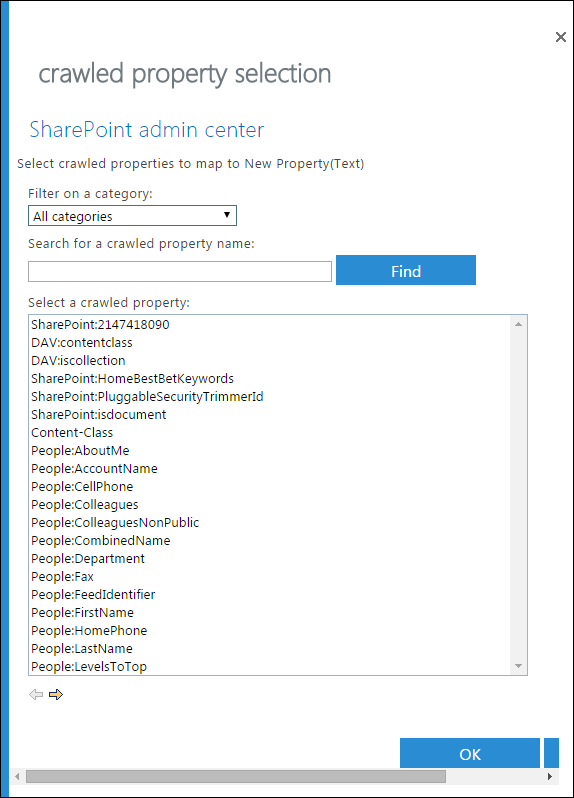

# <a name="create-a-dlp-policy-to-protect-documents-with-fci-or-other-properties"></a><span data-ttu-id="67c75-104">FCI 또는 기타 속성을 갖는 문서를 보호하는 DLP 정책 만들기</span><span class="sxs-lookup"><span data-stu-id="67c75-104">Create a DLP policy to protect documents with FCI or other properties</span></span>

<span data-ttu-id="67c75-p102">Office 365에서 DLP(데이터 손실 방지) 정책을 사용하여 중요한 정보를 식별하고, 모니터링하고, 보호할 수 있습니다. 많은 조직에서는 이미 Windows Server FCI(파일 분류 인프라)의 분류 속성, SharePoint의 문서 속성 또는 타사 시스템을 통해 적용된 문서 속성을 사용하여 중요한 정보를 식별하고 분류하는 프로세스를 유지하고 있습니다. 이 정책이 조직에 대해 설명하는 경우 Office 365에서 Windows Server FCI 또는 다른 시스템을 통해 문서에 적용된 속성을 인식하는 DLP 정책을 만들어 DLP 정책이 특정 FCI 또는 기타 속성 값을 갖는 Office 문서에 적용되도록 할 수 있습니다.</span><span class="sxs-lookup"><span data-stu-id="67c75-p102">In Office 365, you can use a data loss prevention (DLP) policy to identify, monitor, and protect sensitive information. Many organizations already have a process to identify and classify sensitive information by using the classification properties in Windows Server File Classification Infrastructure (FCI), the document properties in SharePoint, or the document properties applied by a third-party system. If this describes your organization, you can create a DLP policy in Office 365 that recognizes the properties that have been applied to documents by Windows Server FCI or other system, so that the DLP policy can be enforced on Office documents with specific FCI or other property values.</span></span>
  

  
<span data-ttu-id="67c75-p103">예를 들어 조직에서 Windows Server fci를 사용 하 여 주민 등록 번호와 같은 PII (개인 식별이 가능한 정보)가 포함 된 문서를 식별 한 다음 **개인 식별 정보** 를 설정 하 여 문서를 분류할 수 있습니다. 문서에 있는 pii의 유형 및 수에 따라 속성을 **높음**, **보통**, **낮음**, **Public**또는 **Not pii** 로 설정 합니다. Office 365에서는 해당 속성이 **High** 및 **Medium**과 같은 특정 값으로 설정 된 문서를 식별 하는 DLP 정책을 만든 다음 해당 파일에 대 한 액세스를 차단 하는 등의 작업을 수행할 수 있습니다. 전자 메일 알림 보내기와 같이 속성이 **낮음으로**설정 된 경우에는 다른 작업을 수행 하는 동일한 정책이 다른 규칙을 가질 수 있습니다. 이러한 방식으로 office 365의 DLP는 windows server fci와 통합 되며, windows server 기반 파일 서버에서 office 365를 업로드 하거나 공유 하는 office 문서를 보호 하는 데 도움이 될 수 있습니다.</span><span class="sxs-lookup"><span data-stu-id="67c75-p103">For example, your organization might use Windows Server FCI to identify documents with personally identifiable information (PII) such as social security numbers, and then classify the document by setting the **Personally Identifiable Information** property to **High**, **Moderate**, **Low**, **Public**, or **Not PII** based on the type and number of occurrences of PII found in the document. In Office 365, you can create a DLP policy that identifies documents that have that property set to specific values, such as **High** and **Medium**, and then takes an action such as blocking access to those files. The same policy can have another rule that takes a different action if the property is set to **Low**, such as sending an email notification. In this way, DLP in Office 365 integrates with Windows Server FCI and can help protect Office documents uploaded or shared to Office 365 from Windows Server-based file servers.</span></span>
  
<span data-ttu-id="67c75-p104">DLP 정책은 단순히 특정 속성 이름/값 쌍을 찾습니다. 문서 속성에 SharePoint 검색에 대한 해당 관리 속성이 있으면 어떤 속성도 사용할 수 있습니다. 예를 들어 SharePoint 사이트 모음에서 **고객** 필수 필드가 있는 **출장 보고서**라는 콘텐츠 형식을 사용할 수 있습니다. 사용자는 출장 보고서를 만들 때마다 고객 이름을 입력해야 합니다. 이 속성 이름/값 쌍을 DLP 정책에서도 사용할 수 있습니다. 예를 들어 **고객** 필드에 **Contoso**가 포함되어 있을 때 외부 사용자의 문서 액세스를 차단하는 규칙을 원할 수 있습니다.</span><span class="sxs-lookup"><span data-stu-id="67c75-p104">A DLP policy simply looks for a specific property name/value pair. Any document property can be used, as long as the property has a corresponding managed property for SharePoint search. For example, a SharePoint site collection might use a content type named **Trip Report** with a required field named **Customer**. Whenever a person creates a trip report, they must enter the customer name. This property name/value pair can also be used in a DLP policy — for example, if you want a rule that blocks access to the document for external users when the **Customer** field contains **Contoso**.</span></span>
  
<span data-ttu-id="67c75-p105">특정 Office 365 레이블이 있는 콘텐츠에 DLP 정책을 적용 하려는 경우에는 여기에 나와 있는 단계를 수행 하지 않는 것이 좋습니다. 대신, [레이블을 DLP 정책의 조건으로 사용](data-loss-prevention-policies.md#using-a-label-as-a-condition-in-a-dlp-policy)하는 방법을 알아보세요.</span><span class="sxs-lookup"><span data-stu-id="67c75-p105">Note that if you want to apply your DLP policy to content with specific Office 365 labels, you should not follow the steps here. Instead, learn how to [Using a label as a condition in a DLP policy](data-loss-prevention-policies.md#using-a-label-as-a-condition-in-a-dlp-policy).</span></span>
  
## <a name="before-you-create-the-dlp-policy"></a><span data-ttu-id="67c75-120">DLP 정책 만들기 전</span><span class="sxs-lookup"><span data-stu-id="67c75-120">Before you create the DLP policy</span></span>

<span data-ttu-id="67c75-p106">DLP 정책에서 Windows Server fci 속성 또는 기타 속성을 사용 하려면 SharePoint 관리 센터에서 관리 속성을 만들어야 합니다. 그 이유는 다음과 같습니다.</span><span class="sxs-lookup"><span data-stu-id="67c75-p106">Before you can use a Windows Server FCI property or other property in a DLP policy, you need to create a managed property in the SharePoint admin center. Here's why.</span></span>
  
<span data-ttu-id="67c75-p107">예제</span><span class="sxs-lookup"><span data-stu-id="67c75-p107">In SharePoint Online and OneDrive for Business, the search index is built up by crawling the content on your sites. The crawler picks up content and metadata from the documents in the form of crawled properties. The search schema helps the crawler decide what content and metadata to pick up. Examples of metadata are the author and the title of a document. However, to get the content and metadata from the documents into the search index, the crawled properties must be mapped to managed properties. Only managed properties are kept in the index. For example, a crawled property related to author is mapped to a managed property related to author.</span></span>
  
<span data-ttu-id="67c75-p108">Office 365의 DLP는 검색 크롤러를 사용하여 사이트의 중요한 정보를 식별하고 분류한 다음, 검색 인덱스의 보안 부분에 중요한 정보를 저장하기 때문에 이 기능이 중요합니다. Office 365로 문서를 업로드하는 경우 SharePoint는 문서 속성을 기준으로 크롤링된 속성을 자동으로 만듭니다. 그러나 FCI 또는 DLP 정책의 다른 속성을 사용하려면 해당 속성을 갖는 콘텐츠가 인덱스에 보관될 수 있게 크롤링된 속성이 관리 속성에 매핑되어야 합니다.</span><span class="sxs-lookup"><span data-stu-id="67c75-p108">This is important because DLP in Office 365 uses the search crawler to identify and classify sensitive information on your sites, and then store that sensitive information in a secure portion of the search index. When you upload a document to Office 365, SharePoint automatically creates crawled properties based on the document properties. But to use an FCI or other property in a DLP policy, that crawled property needs to be mapped to a managed property so that content with that property is kept in the index.</span></span>
  
<span data-ttu-id="67c75-133">검색 및 관리 속성에 대 한 자세한 내용은 [SharePoint Online에서 검색 스키마 관리](http://go.microsoft.com/fwlink/p/?LinkID=627454)를 참조 하세요.</span><span class="sxs-lookup"><span data-stu-id="67c75-133">For more information on search and managed properties, see [Manage the search schema in SharePoint Online](http://go.microsoft.com/fwlink/p/?LinkID=627454).</span></span>
  
### <a name="step-1-upload-a-document-with-the-needed-property-to-office-365"></a><span data-ttu-id="67c75-134">1단계: 필요한 속성을 갖는 문서를 Office 365에 업로드합니다.</span><span class="sxs-lookup"><span data-stu-id="67c75-134">Step 1: Upload a document with the needed property to Office 365</span></span>

<span data-ttu-id="67c75-p109">먼저 DLP 정책에서 참조 하려는 속성을 사용 하 여 문서를 업로드 해야 합니다. Office 365에서 속성을 검색 하 고 크롤링 속성을 자동으로 만듭니다. 다음 단계에서는 관리 속성을 만든 다음 관리 속성을이 크롤링 속성에 매핑합니다.</span><span class="sxs-lookup"><span data-stu-id="67c75-p109">You first need to upload a document with the property that you want to reference in your DLP policy. Office 365 will detect the property and automatically create a crawled property from it. In the next step, you'll create a managed property, and then map the managed property to this crawled property.</span></span>
  
### <a name="step-2-create-a-managed-property"></a><span data-ttu-id="67c75-138">2단계: 관리 속성 만들기</span><span class="sxs-lookup"><span data-stu-id="67c75-138">Step 2: Create a managed property</span></span>

1. <span data-ttu-id="67c75-139">Office 365 관리 센터에 로그인합니다.</span><span class="sxs-lookup"><span data-stu-id="67c75-139">Sign in to the Office 365 admin center.</span></span>
    
2. <span data-ttu-id="67c75-p110">왼쪽 탐색 영역에서 **관리 센터** \> **SharePoint**를 선택 합니다. 현재는 SharePoint 관리 센터에 있습니다.</span><span class="sxs-lookup"><span data-stu-id="67c75-p110">In the left navigation, choose **Admin centers** \> **SharePoint**. You're now in the SharePoint admin center.</span></span>
    
3. <span data-ttu-id="67c75-142">왼쪽 탐색 창의 검색 **관리** 페이지 \*\*\*\* \> \> 에서 검색 **스키마 관리**를 선택 합니다.</span><span class="sxs-lookup"><span data-stu-id="67c75-142">In the left navigation, choose **search** \> on the **search administration** page \> **Manage Search Schema**.</span></span>
    
    
  
4. <span data-ttu-id="67c75-144">**관리 속성** 페이지 \> 에서 **새 관리 속성**을 설정 합니다.</span><span class="sxs-lookup"><span data-stu-id="67c75-144">On the **Managed Properties** page \> **New Managed Property**.</span></span>
    
    
  
5. <span data-ttu-id="67c75-p111">속성의 이름 및 설명을 입력합니다. 이 이름은 DLP 정책에 표시되는 이름입니다.</span><span class="sxs-lookup"><span data-stu-id="67c75-p111">Enter a name and description for the property. This name is what will appear in your DLP policies.</span></span>
    
6. <span data-ttu-id="67c75-148">**형식**에서 **텍스트**를 선택합니다.</span><span class="sxs-lookup"><span data-stu-id="67c75-148">For **Type**, choose **Text**.</span></span> 
    
7. <span data-ttu-id="67c75-149">**기본 특징** 아래에서 **쿼리 가능** 및 **조회 가능**을 선택합니다.</span><span class="sxs-lookup"><span data-stu-id="67c75-149">Under **Main characteristics**, select **Queryable** and **Retrievable**.</span></span>
    
8. <span data-ttu-id="67c75-150">**크롤링 속성** \> 에 매핑 아래에서 **매핑을 추가**합니다.</span><span class="sxs-lookup"><span data-stu-id="67c75-150">Under **Mappings to crawled properties** \> **Add a mapping**.</span></span>
    
9. <span data-ttu-id="67c75-151">**크롤링 속성 선택** 대화 상자 \> 에서 DLP 정책 \> **확인**에 사용할 Windows Server fci 속성 또는 기타 속성에 해당 하는 크롤링 속성을 찾아 선택 합니다.</span><span class="sxs-lookup"><span data-stu-id="67c75-151">In the **crawled property selection** dialog box \> find and select the crawled property that corresponds to the Windows Server FCI property or other property that you will use in your DLP policy \> **OK**.</span></span>
    
    
  
10. <span data-ttu-id="67c75-153">페이지 \> 맨 아래에서 **확인을**선택 합니다.</span><span class="sxs-lookup"><span data-stu-id="67c75-153">At the bottom of the page \> **OK**.</span></span>
    
## <a name="create-a-dlp-policy-that-uses-an-fci-property-or-other-property"></a><span data-ttu-id="67c75-154">FCI 속성 또는 기타 속성을 사용하는 DLP 정책 만들기</span><span class="sxs-lookup"><span data-stu-id="67c75-154">Create a DLP policy that uses an FCI property or other property</span></span>

<span data-ttu-id="67c75-p112">이 예에서는 조직에서 Windows Server 기반 파일 서버에 fci를 사용 하 고 있습니다. 특히 **높은**, **중간**, **낮음**, **공용**, **PII가 아닌**사용할 수 있는 **개인 식별** 이 가능한 값이 포함 된 fci 분류 속성을 사용 하 고 있습니다. 이제 Office 365의 DLP 정책에서 기존 fci 분류를 활용 하려고 합니다.</span><span class="sxs-lookup"><span data-stu-id="67c75-p112">In this example, an organization is using FCI on its Windows Server-based file servers; specifically, they're using the FCI classification property named **Personally Identifiable Information** with possible values of **High**, **Moderate**, **Low**, **Public**, and **Not PII**. Now they want to leverage their existing FCI classification in their DLP policies in Office 365.</span></span>
  
<span data-ttu-id="67c75-157">먼저 위 단계에 따라 SharePoint Online에서 관리 속성을 만듭니다. 이 속성은 FCI 속성에서 자동으로 만들어진 크롤링 속성에 매핑됩니다.</span><span class="sxs-lookup"><span data-stu-id="67c75-157">First, they follow the steps above to create a managed property in SharePoint Online, which maps to the crawled property created automatically from the FCI property.</span></span>
  
<span data-ttu-id="67c75-158">다음으로, 조건 **문서 속성**을 사용 하는 두 개의 규칙을 포함 하는 DLP 정책을 만듭니다.</span><span class="sxs-lookup"><span data-stu-id="67c75-158">Next, they create a DLP policy with two rules that both use the condition **Document properties contain any of these values**:</span></span>
  
- <span data-ttu-id="67c75-159">**fci PII 콘텐츠-높음, 보통** 첫 번째 규칙은 fci 분류 속성 **개인 식별 정보가** **높은** 또는 **보통** 이 고 문서가 조직 외부의 사용자와 공유 되는 경우 문서에 대 한 액세스를 제한 합니다.</span><span class="sxs-lookup"><span data-stu-id="67c75-159">**FCI PII content - High, Moderate** The first rule restricts access to the document if the FCI classification property **Personally Identifiable Information** equals **High** or **Moderate** and the document is shared with people outside the organization.</span></span> 
    
- <span data-ttu-id="67c75-160">**fci PII 콘텐츠-낮음** 두 번째 규칙은 fci 분류 속성 **개인 식별 정보가** **낮은** 정보이 고 문서가 조직 외부의 사용자와 공유 되는 경우 문서 소유자에 게 알림을 보냅니다.</span><span class="sxs-lookup"><span data-stu-id="67c75-160">**FCI PII content - Low** The second rule sends a notification to the document owner if the FCI classification property **Personally Identifiable Information** equals **Low** and the document is shared with people outside the organization.</span></span> 
    
### <a name="create-the-dlp-policy-by-using-powershell"></a><span data-ttu-id="67c75-161">PowerShell을 사용 하 여 DLP 정책 만들기</span><span class="sxs-lookup"><span data-stu-id="67c75-161">Create the DLP policy by using PowerShell</span></span>

<span data-ttu-id="67c75-p113">조건 **문서 속성** 에는 보안 &amp; 및 준수 센터의 UI에서 일시적으로 사용할 수 없지만 PowerShell을 사용 하 여이 조건을 계속 사용할 수 있습니다. `New\Set\Get-DlpCompliancePolicy` cmdlet을 사용 하 여 DLP 정책에 대 한 작업을 수행 하 고 `New\Set\Get-DlpComplianceRule` `ContentPropertyContainsWords` 매개 변수와 함께 cmdlet을 사용 하 여 조건을 추가할 수 있습니다 **문서 속성에 이러한 값이 포함 되어**있습니다.</span><span class="sxs-lookup"><span data-stu-id="67c75-p113">Note that the condition **Document properties contain any of these values** is temporarily not available in the UI of the Security &amp; Compliance Center, but you can still use this condition by using PowerShell. You can use the  `New\Set\Get-DlpCompliancePolicy` cmdlets to work with a DLP policy, and use the  `New\Set\Get-DlpComplianceRule` cmdlets with the  `ContentPropertyContainsWords` parameter to add the condition **Document properties contain any of these values**.</span></span>
  
<span data-ttu-id="67c75-164">이러한 cmdlet에 대 한 자세한 내용은 [Office 365 보안 &amp; 및 준수 센터 cmdlet](http://go.microsoft.com/fwlink/?LinkID=799772&amp;clcid=0x409)를 참조 하세요.</span><span class="sxs-lookup"><span data-stu-id="67c75-164">For more information on these cmdlets, see [Office 365 Security &amp; Compliance Center cmdlets](http://go.microsoft.com/fwlink/?LinkID=799772&amp;clcid=0x409).</span></span>
  
1. [<span data-ttu-id="67c75-165">원격 PowerShell을 사용하여 Office 365 보안 및 준수 센터에 연결</span><span class="sxs-lookup"><span data-stu-id="67c75-165">Connect to the Office 365 Security &amp; Compliance Center using remote PowerShell</span></span>](http://go.microsoft.com/fwlink/?LinkID=799771&amp;clcid=0x409)
    
2. <span data-ttu-id="67c75-166">을 사용 하 `New-DlpCompliancePolicy`여 정책을 만듭니다.</span><span class="sxs-lookup"><span data-stu-id="67c75-166">Create the policy by using  `New-DlpCompliancePolicy`.</span></span>
    
    <span data-ttu-id="67c75-167">다음은 모든 위치에 적용 되는 DLP 정책을 만드는 PowerShell 예제입니다.</span><span class="sxs-lookup"><span data-stu-id="67c75-167">Here is a PowerShell example that creates a DLP policy that applies to all locations.</span></span>
    
      ```
      New-DlpCompliancePolicy -Name FCI_PII_policy -ExchangeLocation All -SharePointLocation All -OneDriveLocation All -Mode Enable
      ```

3. <span data-ttu-id="67c75-168">위에서 설명한 두 가지 규칙을 사용 하 `New-DlpComplianceRule`여, 즉 **낮은** 값에 대 한 규칙을 만들고, **높은** 값과 **중간** 가치에 대해 다른 규칙을 만듭니다.</span><span class="sxs-lookup"><span data-stu-id="67c75-168">Create the two rules described above by using  `New-DlpComplianceRule`, where one rule is for the **Low** value, and another rule is for the **High** and **Moderate** values.</span></span> 
    
    <span data-ttu-id="67c75-p114">다음은 이러한 두 가지 규칙을 만드는 PowerShell 예제입니다. 속성 이름/값 쌍은 따옴표로 묶여 있고 속성 이름에는 다음과 같이 공백 없이 쉼표로 구분 하 여 여러 값을 지정할 수 있습니다.`"<Property1>:<Value1>,<Value2>","<Property2>:<Value3>,<Value4>"....`</span><span class="sxs-lookup"><span data-stu-id="67c75-p114">Here is a PowerShell example that creates these two rules. Note that the property name/value pairs are enclosed in quotation marks, and a property name may specify multiple values separated by commas with no spaces, like  `"<Property1>:<Value1>,<Value2>","<Property2>:<Value3>,<Value4>"....`</span></span>
    
      ```
      New-DlpComplianceRule -Name FCI_PII_content-High,Moderate -Policy FCI_PII_policy -AccessScope NotInOrganization -BlockAccess $true -ContentPropertyContainsWords "Personally Identifiable Information:High,Moderate" -Disabled $falseNew-DlpComplianceRule -Name FCI_PII_content-Low -Policy FCI_PII_policy -AccessScope NotInOrganization -BlockAccess $false -ContentPropertyContainsWords "Personally Identifiable Information:Low" -Disabled $false -NotifyUser Owner
      ```

    <span data-ttu-id="67c75-p115">Windows Server fci에는이 예에서 사용 되는 **개인 식별** 이 가능한 정보를 포함 하 여 기본 제공 되는 여러 속성이 포함 되어 있습니다. 각 속성에 사용할 수 있는 값은 조직 마다 다를 수 있습니다. 여기에서 사용 되는 **높은**값, **중간 규모**및 **낮음을** 예로 들 수 있습니다. 조직의 경우 windows server fci 분류 속성을 사용할 수 있는 값을 포함 하는 파일 서버 기반 파일 서버 자세한 내용은 [분류 속성 만들기](http://go.microsoft.com/fwlink/p/?LinkID=627456)항목을 참조 하십시오.</span><span class="sxs-lookup"><span data-stu-id="67c75-p115">Note that Windows Server FCI includes many built-in properties, including **Personally Identifiable Information** used in this example. The possible values for each property can be different for every organization. The **High**, **Moderate**, and **Low** values used here are only an example. For your organization, you can view the Windows Server FCI classification properties with their possible values in the file Server Resource Manager on the Windows Server-based file server. For more information, see [Create a classification property](http://go.microsoft.com/fwlink/p/?LinkID=627456).</span></span>
    
<span data-ttu-id="67c75-p116">완료 되 면 정책에는 문서 속성을 사용 하는 두 가지 새 규칙에 **이러한 값 조건이 포함** 되어 있어야 합니다. 이 조건은 UI에는 표시 되지 않지만 다른 조건, 작업 및 설정은 표시 됩니다.</span><span class="sxs-lookup"><span data-stu-id="67c75-p116">When you finish, your policy should have two new rules that both use the **Document properties contain any of these values** condition. Note that this condition won't appear in the UI, though the other conditions, actions, and settings will appear.</span></span> 
  
<span data-ttu-id="67c75-p117">한 규칙은 **개인 식별** 이 가능한 정보 속성이 **높음** 또는 **보통**으로 일치 하는 콘텐츠에 대 한 액세스를 차단 합니다. 두 번째 규칙은 **개인 식별** 이 가능한 정보 속성이 **Low**와 같은 콘텐츠에 대 한 알림을 보냅니다.</span><span class="sxs-lookup"><span data-stu-id="67c75-p117">One rule blocks access to content where the **Personally Identifiable Information** property equals **High** or **Moderate**. A second rule sends a notification about content where the **Personally Identifiable Information** property equals **Low**.</span></span>
  

  
## <a name="after-you-create-the-dlp-policy"></a><span data-ttu-id="67c75-181">DLP 정책을 만든 후</span><span class="sxs-lookup"><span data-stu-id="67c75-181">After you create the DLP policy</span></span>

<span data-ttu-id="67c75-182">이전 섹션의 단계를 수행 하면 해당 속성을 사용 하 여 콘텐츠를 빠르게 검색할 DLP 정책이 생성 되지만 콘텐츠가 새로 업로드 되는 경우 (콘텐츠가 인덱싱되는 경우) 또는 해당 콘텐츠가 이전에 편집 된 경우에 한 해 콘텐츠를 다시 인덱싱할 수 있습니다. .</span><span class="sxs-lookup"><span data-stu-id="67c75-182">Doing the steps in the previous sections will create a DLP policy that will quickly detect content with that property, but only if that content is newly uploaded (so that the content's indexed), or if that content is old but just edited (so that the content's re-indexed).</span></span>
  
<span data-ttu-id="67c75-p118">모든 위치에서 해당 속성을 갖는 콘텐츠를 검색하려는 경우 DLP 정책이 해당 속성의 모든 콘텐츠를 인식할 수 있게 라이브러리, 사이트 또는 사이트 모음을 다시 인덱싱하도록 수동으로 요청할 수 있습니다. SharePoint Online에서 콘텐츠는 정의된 크롤링 일정에 따라 자동으로 크롤링됩니다. 크롤러는 마지막 크롤링 이후에 변경된 콘텐츠를 선택하고 인덱스를 업데이트합니다. 예약된 다음 크롤링 전에 DLP 정책을 통해 콘텐츠를 보호해야 할 경우 다음 단계를 수행할 수 있습니다.</span><span class="sxs-lookup"><span data-stu-id="67c75-p118">To detect content with that property everywhere, you may want to manually request that your library, site, or site collection be re-indexed, so that the DLP policy is aware of all the content with that property. In SharePoint Online, content is automatically crawled based on a defined crawl schedule. The crawler picks up content that has changed since the last crawl and updates the index. If you need your DLP policy to protect content before the next scheduled crawl, you can take these steps.</span></span>
  
> [!CAUTION]
> <span data-ttu-id="67c75-p119">사이트를 다시 인덱싱하면 검색 시스템에 대 한 부하를 대량으로 유발할 수 있습니다. 시나리오에서 절대적으로 필요한 경우가 아니면 사이트를 다시 인덱싱하지 마세요.</span><span class="sxs-lookup"><span data-stu-id="67c75-p119">Re-indexing a site can cause a massive load on the search system. Don't re-index your site unless your scenario absolutely requires it.</span></span> 
  
<span data-ttu-id="67c75-189">자세한 내용은 [사이트, 라이브러리 또는 목록에 대 한 크롤링 수동 요청과 다시 인덱싱](http://go.microsoft.com/fwlink/p/?LinkID=627457)를 참조 하세요.</span><span class="sxs-lookup"><span data-stu-id="67c75-189">For more information, see [Manually request crawling and re-indexing of a site, a library or a list](http://go.microsoft.com/fwlink/p/?LinkID=627457).</span></span>
  
### <a name="re-index-a-site-optional"></a><span data-ttu-id="67c75-190">사이트 다시 인덱싱(선택 사항)</span><span class="sxs-lookup"><span data-stu-id="67c75-190">Re-index a site (optional)</span></span>

1. <span data-ttu-id="67c75-191">사이트에서 **설정** (오른쪽 위의 기어 아이콘) \> **사이트 설정을**선택 합니다.</span><span class="sxs-lookup"><span data-stu-id="67c75-191">On the site, choose **Settings** (gear icon in upper right) \> **Site Settings**.</span></span>
    
2. <span data-ttu-id="67c75-192">**검색**에서 **검색 및 오프 라인 가용성** \> 다시 **인덱싱 사이트**를 선택 합니다.</span><span class="sxs-lookup"><span data-stu-id="67c75-192">Under **Search**, choose **Search and offline availability** \> **Reindex site**.</span></span>
    
## <a name="more-information"></a><span data-ttu-id="67c75-193">추가 정보</span><span class="sxs-lookup"><span data-stu-id="67c75-193">More information</span></span>

- [<span data-ttu-id="67c75-194">데이터 손실 방지 정책 개요</span><span class="sxs-lookup"><span data-stu-id="67c75-194">Overview of data loss prevention policies</span></span>](data-loss-prevention-policies.md)
    
- [<span data-ttu-id="67c75-195">템플릿에서 DLP 정책 만들기</span><span class="sxs-lookup"><span data-stu-id="67c75-195">Create a DLP policy from a template</span></span>](create-a-dlp-policy-from-a-template.md)
    
- [<span data-ttu-id="67c75-196">DLP 정책에 대한 알림 보내기 및 정책 팁 표시</span><span class="sxs-lookup"><span data-stu-id="67c75-196">Send notifications and show policy tips for DLP policies</span></span>](use-notifications-and-policy-tips.md)
    
- [<span data-ttu-id="67c75-197">DLP 정책 템플릿에 포함되는 내용</span><span class="sxs-lookup"><span data-stu-id="67c75-197">What the DLP policy templates include</span></span>](what-the-dlp-policy-templates-include.md)
    
- [<span data-ttu-id="67c75-198">중요 한 정보 유형 목록</span><span class="sxs-lookup"><span data-stu-id="67c75-198">Sensitive information types inventory</span></span>](what-the-sensitive-information-types-look-for.md)
    

