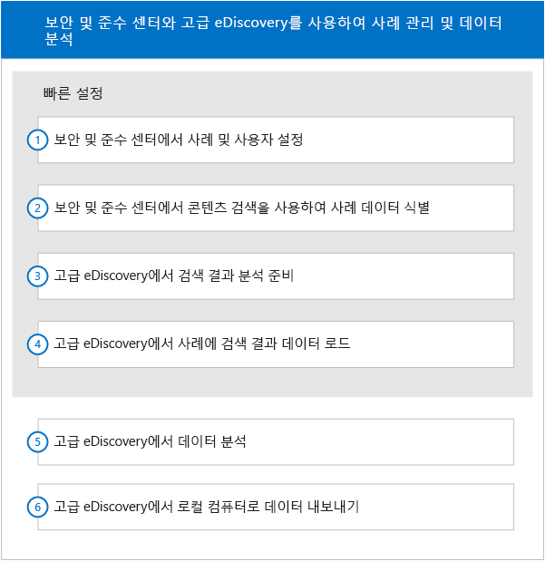

# Office 365 Advanced eDiscovery에 대한 빠른 설정

이 설정 섹션에는 Advanced eDiscovery를 시작하는 방법에 대한 Office 365 보안 및 준수 센터 eDiscovery 관리자를 표시합니다. 사용자에게 두 기능에 대한 작업 지식이 있다고 가정합니다.
  
> [!NOTE]
> Advanced eDiscovery를 사용하려면 Office 365 E3의 고급 준수 추가 기능이나 조직을 위한 E5 구독이 필요합니다. 이 요금제가 없는 상태에서 Advanced eDiscovery를 사용하려는 경우에는 [Office 365 Enterprise E5 평가판을 등록](https://go.microsoft.com/fwlink/p/?LinkID=698279)할 수 있습니다. 
  
## Advanced eDiscovery에서 사례에 액세스

보안 및 준수 센터에서 Advanced eDiscovery에 액세스합니다. Advanced eDiscovery에서 사례에 액세스하려면 보안 및 준수 센터에서 eDiscovery 사례의 구성원이어야 합니다. eDiscovery 사례 권한 할당 및 eDiscovery 사례에 사용자를 추가하는 방법에 대한 지침은 [Office 365에서 eDiscovery 사례 관리](manage-ediscovery-cases.md)를 참조하세요. 
  
Advanced eDiscovery에서 사례로 이동하려면 
  
1. [Office 365 보안 및 준수 센터로 이동합니다](go-to-the-securitycompliance-center.md). 
    
2. 보안 및 준수 센터에서 **검색 &amp; 조사** \> **eDiscovery**를 클릭하여 조직의 사례 목록을 표시합니다. 
    
3. **eDiscovery** 페이지에서 Advanced eDiscovery의 이동하려는 사례 옆에 있는 **열기**를 클릭합니다. 
    
4. 사례에 대한 **홈** 페이지에서 **Advanced eDiscovery**를 클릭합니다.
    
    **Advanced eDiscovery에 연결** 진행률 표시줄이 표시됩니다. 연결되면 Advanced eDiscovery에서 사례가 열립니다. 
    
## 워크플로

다음 다이어그램에서는 보안 및 인증 센터와 Advanced eDiscovery에서 사례를 관리 및 사용하기 위한 일반적인 워크플로를 보여 줍니다. 
  

  
이 설정 섹션에서는 워크플로의 처음 4가지 단계를 설명합니다. 워크플로의 다른 단계에 대한 설명은 다음을 참조하세요.
  
## 분석

[사례 데이터 분석](analyze-case-data-with-advanced-ediscovery.md) 다양한 매개 변수에 따라 파일은 식별 및 구성하고, 테마를 사용할 수 있도록 하고, 결과를 표시합니다. 사용자는 향상된 결과를 얻기 위해 분석 기능을 사용자 지정할 수 있습니다. 
  
## 관련성 설정 및 관련성

[관련성 설정](manage-relevance-setup-in-advanced-ediscovery.md) 및 [관련성 모듈 사용](use-relevance-in-advanced-ediscovery.md) 무작위 파일 샘플에 따라 평가 및 관련성 학습을 수행하도록 하고, 이러한 항목을 사용하여 예측 코딩 프로세스에 의사 결정을 적용합니다. 프로세스의 통계적 유의성을 모니터링하는 동안 임시 결과를 계산하고 표시합니다. 의사 결정을 보다 용이하게 검토할 수 있도록 결과를 표시합니다. 
  
## 내보내기

[사례 데이터 내보내기](export-case-data-in-advanced-ediscovery.md) 외부 검토를 위해 Advanced eDiscovery 콘텐츠 및 결과를 내보낼 수 있습니다. 
  
## 보고서

[보고서 실행](run-reports-in-advanced-ediscovery.md) Advanced eDiscovery 처리와 관련해서 선택한 보고서를 생성할 수 있습니다. 
  
## 참고 항목

[Office 365 Advanced eDiscovery](office-365-advanced-ediscovery.md)
  
[사용자 및 사례 설정](set-up-users-and-cases-in-advanced-ediscovery.md)
  
[데이터 준비](prepare-data-for-advanced-ediscovery.md)

