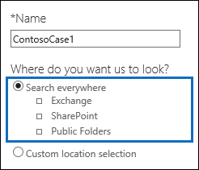

# <a name="run-a-content-search-in-the-security--compliance-center"></a>보안 및 준수 센터에서 콘텐츠 검색 실행

Security & 준수 센터의 콘텐츠 검색 eDiscovery 도구를 사용 하 여 Office 365 조 직에서 전자 메일, 문서 및 인스턴트 메시징 대화와 같은 항목을 검색할 수 있습니다. 이 도구를 사용 하 여 다음 Office 365 서비스에서 항목을 검색 합니다.
  
- Exchange Online 사서함 및 공용 폴더
    
- SharePoint Online 및 비즈니스용 OneDrive 사이트
    
- 비즈니스용 Skype 대화
    
- Microsoft Teams 
    
- Office 365 그룹
    
콘텐츠 검색은 확장 및 성능 기능이 새롭게 향상 된 새로운 eDiscovery 검색 도구입니다. 콘텐츠 검색을 사용하여 대규모 eDiscovery 검색을 실행할 수 있습니다. 단일 콘텐츠 검색에서 모든 사서함, 모든 Exchange 공용 폴더 및 모든 SharePoint Online 사이트 및 비즈니스용 OneDrive 계정을 검색할 수 있습니다. 검색할 수 있는 콘텐츠 위치의 수에는 제한이 없습니다. 동시에 실행할 수 있는 검색 수에도 제한이 없습니다. 콘텐츠 검색을 실행 한 후 콘텐츠 위치 수와 예상 검색 결과 수가 **콘텐츠 검색** 페이지의 세부 정보 창에 표시 됩니다. 검색을 실행 한 후에는 결과를 미리 보고, 하나 이상의 검색에 대 한 키워드 통계를 얻고, 콘텐츠 검색을 대량으로 편집 하 고, 결과를 로컬 컴퓨터로 내보낼 수 있습니다. 
  
 **내용**
  
[Create a search](run-a-content-search-in-the-security-and-compliance-center.md#create)
  
[검색 결과 내보내기](run-a-content-search-in-the-security-and-compliance-center.md#export)
  
[Preview search results](run-a-content-search-in-the-security-and-compliance-center.md#preview)
  
[Update search results](run-a-content-search-in-the-security-and-compliance-center.md#restart)
  
[Edit a search](run-a-content-search-in-the-security-and-compliance-center.md#edit)
  
[Retry a search](run-a-content-search-in-the-security-and-compliance-center.md#retry)
  

  
## <a name="before-you-begin"></a>시작하기 전에

- 검색 쿼리를 작성 하 고 부울 검색 연산자를 사용 하는 방법에 대 한 자세한 내용과 지침은 [키워드 쿼리 및 검색 조건을](keyword-queries-and-search-conditions.md)참조 하십시오. 또한 중요 한 정보 유형을 검색 하 고 조직 내부 및 외부의 사용자와 공유 되는 콘텐츠를 검색 하는 방법에 대 한 정보도 포함 합니다.
    
- 검색을 수행 하 고 검색 결과를 내보내기 위해 **콘텐츠 검색** 페이지에 액세스할 수 있도록 하려면 관리자, 규정 준수 책임자 또는 ediscovery 관리자가 Security _AMP_ 준수 센터에서 ediscovery 관리자 역할 그룹의 구성원 이어야 합니다. Exchange Online, SharePoint Online 또는 비즈니스용 OneDrive 사이트에서는 추가 검색 권한을 할당할 필요가 없습니다. 자세한 내용은 [Office 365 Security _AMP_ 준수 센터에서 eDiscovery 사용 권한 할당](assign-ediscovery-permissions.md)을 참조 하십시오.
    
- Office 365 조직에 제공 되는 서비스의 상태와 품질을 유지 하기 위해 콘텐츠 검색에 적용 되는 제한이 있습니다. 대부분의 경우 이러한 제한을 수정할 수 없지만 검색을 계획하고 실행하고 관련 문제를 해결할 때 이러한 제한을 고려할 수 있도록 잘 알고 있어야 합니다. 자세한 내용은 [Security _AMP_ 준수 센터에서 검색에 대 한 제한을](limits-for-content-search.md)참조 하세요.
    
- 단일 콘텐츠 검색에서 검색 되는 사서함 수를 기준으로 예상 검색 시간에 대 한 섹션을 참조 하세요. 
    
- 앞에서 설명한 것 처럼, 콘텐츠 검색을 사용 하 여 Office 365 그룹 및 Microsoft 팀의 콘텐츠를 검색할 수 있습니다. 즉, Office 365 그룹 및 Microsoft 팀과 연결 된 그룹 사서함, 공유 일정 및 SharePoint 사이트를 검색할 수 있습니다. 또한 Microsoft 팀에서 채널 대화를 검색할 수 있습니다. Office 365 그룹 및 Microsoft 팀에 대 한 자세한 내용은 다음 항목을 참조 하십시오.
    
  - [Office 365 그룹에 대 한 자세한 정보](https://support.office.com/article/b565caa1-5c40-40ef-9915-60fdb2d97fa2)
    
  - [Microsoft 팀 도움말](https://support.office.com/article/23156c0c-2c6e-49dd-8b7b-7c564b76508c)
    
    Office 365 그룹 및 Microsoft 팀에서 콘텐츠를 검색 하는 방법에 대 한 팁을 보려면 섹션을 참조 하세요. 
    
[Return to top](run-a-content-search-in-the-security-and-compliance-center.md#top)
  
## <a name="create-a-search"></a>Create a search
<a name="create"> </a>

1. [https://protection.office.com](https://protection.office.com)으로 이동합니다.
    
2. 회사 또는 학교 계정을 사용하여 Office 365에 로그인합니다.
    
3. 보안 & 준수 센터의 왼쪽 창에서 **콘텐츠 검색** **검색** \> 을 클릭 합니다.
    
4. **새로 만들기**을 클릭합니다.
    
5. **새 검색** 페이지에서 콘텐츠 검색의 이름을 입력합니다. 이 이름은 조직 내에서 고유해야 합니다. 
    
6. 검색 하려는 콘텐츠 위치를 선택 합니다. 같은 검색에서 사서함, 사이트 및 공용 폴더를 검색할 수 있습니다.
    
    
  
1. **모든 범위에서 검색** 조직의 모든 콘텐츠 위치를 검색 하려면이 옵션을 선택 합니다. 이 옵션을 선택 하면 모든 사서함 (비활성 사서함 및 모든 Office 365 그룹 및 Microsoft 팀의 사서함), 모든 SharePoint 및 비즈니스용 OneDrive 사이트 (모든 Office 365 그룹에 대 한 사이트 포함), 모든 사용자를 검색 하도록 선택할 수 있습니다. Microsoft 팀) 및 모든 공용 폴더
    
    
  
2. **사용자 지정 위치 선택** 검색 하려는 사서함 및 사이트를 선택 하려면이 옵션을 선택 합니다. 이 옵션을 선택 하면 모든 Exchange 사서함을 검색 하는 등 특정 서비스에 대 한 모든 콘텐츠 위치를 검색 하거나 Office 365 서비스에 대 한 특정 콘텐츠 위치를 검색할 수 있습니다.
    
    검색할 콘텐츠 위치를 추가할 때 다음 사항에 유의 하세요.
    
    **사서함**
    
  - 추가 아이콘](media/ITPro-EAC-AddIcon.gif) **추가**을 클릭 합니다.
    
  - 검색 대상 사서함 목록에 비활성 사서함 및 메일 그룹을 추가할 수 있습니다. 메일 그룹의 경우 그룹 구성원의 사서함이 검색 됩니다. 동적 메일 그룹은 지원 되지 않습니다.
    
  - 조직의 비활성 사서함 목록을 가져오려면 Exchange Online PowerShell에서 명령을 `Get-Mailbox -InactiveMailboxOnly` 실행 합니다. 또는 보안 & 준수 센터에서 **데이터 거 버 넌 스** \> **보존** 으로 이동한 다음 **기타** \> **비활성 사서함**을 클릭할 수 있습니다.
    
  - 또한 Office 365 그룹 또는 Microsoft 팀에 연결 된 사서함을 추가할 수 있습니다. 이 경우 그룹 또는 팀 사서함만 검색 됩니다. 그룹 또는 팀 구성원의 사서함이 검색 되지 않습니다. 검색 하려면 검색에 구체적으로 추가 해야 합니다.
    
  - 검색에 사서함을 포함 하지 않으려면 **검색할 특정 사서함 선택**(목록에 사서함을 추가 하지 않음)을 선택 합니다.
    
    **사이트**
    
  - 추가 아이콘](media/ITPro-EAC-AddIcon.gif) 추가를 클릭 하 여 사이트를 검색에 추가 합니다. ****
  
1. **무엇을 검색하시겠습니까?** 아래의 상자에 검색 쿼리를 입력합니다. 키워드, 메시지 속성(보낸 날짜 및 받은 날짜) 또는 문서 속성(예: 파일 이름 또는 문서를 마지막으로 변경한 날짜)을 지정할 수 있습니다. **AND**, **OR**, **NOT**, **NEAR**또는 **onear**와 같은 부울 연산자를 사용 하는 보다 복잡 한 쿼리를 사용할 수 있습니다. 문서에서 중요 한 정보 (예: 주민 등록 번호)를 검색 하거나 외부에서 공유한 문서를 검색할 수도 있습니다. 키워드 상자를 비워 두면 지정 된 콘텐츠 위치에 있는 모든 콘텐츠가 검색 결과에 포함 됩니다. 
    
2. **키워드 목록 표시** 확인란을 클릭 하 고 각 행에 키워드를 입력할 수 있습니다. 이 경우 각 행의 키워드는 생성 된 검색 쿼리의 **OR** 연산자로 연결 됩니다. 
    
    
  
    키워드 목록을 사용 하는 이유 각 키워드와 일치 하는 항목의 수를 보여 주는 통계를 가져올 수 있습니다. 이를 통해 가장 효과적이 고 효과적인 키워드를 빠르게 확인할 수 있습니다. 행에 괄호를 사용 하 여 키워드로 묶은 키워드 구를 사용할 수도 있습니다. 검색 통계에 대 한 자세한 내용은 [콘텐츠 검색 결과에 대 한 키워드 통계 보기](view-keyword-statistics-for-content-search.md)를 참조 하십시오.
    
    키워드 목록을 사용 하는 방법에 대 한 지침은 섹션을 참조 하십시오. 
    
3. **오타에 대 한 쿼리 검사** 를 클릭 하 여 쿼리를 검사 하 여 지원 되지 않는 문자 인지와 그렇지 않을 수 있는 부울 연산자에 대해 확인 합니다. 지원 되지 않는 문자는 대개 숨겨지고 대개 검색 오류가 발생 하거나 의도 하지 않은 결과를 반환 합니다. 검사 되는 지원 되지 않는 문자에 대 한 자세한 내용은 [콘텐츠 검색 쿼리 확인에서 오류](check-your-content-search-query-for-errors.md)를 참조 하세요.
    
4. **조건**에서 검색 쿼리에 조건을 추가 하 여 검색 범위를 좁히고 보다 구체화 된 결과 집합을 반환 합니다. 각 조건은 검색을 시작할 때 생성되고 실행되는 KQL 검색 쿼리에 절을 추가합니다. 조건은 **AND** 연산자에 의해 키워드 쿼리(키워드 상자에 지정)에 논리적으로 연결됩니다. 즉, 결과에 포함되려면 항목이 키워드 쿼리와 조건을 모두 만족해야 합니다. 조건은 이런 방식으로 결과 범위를 좁히는 데 도움이 됩니다. 
    
||
|:-----|
|검색 쿼리를 만들고 조건을 사용 하는 방법에 대 한 자세한 내용은 [키워드 쿼리 및 검색 조건을 ](keyword-queries-and-search-conditions.md)참조 하십시오. |
   
9. **검색**을 클릭하여 검색 설정을 저장하고 검색을 시작합니다. 
    
    검색이 시작됩니다. 검색이 완료 되 면 세부 정보 창에 다음 정보가 표시 됩니다.
    
    
  
1. 검색이 마지막으로 실행 된 날짜 및 시간입니다.
    
2. 검색 쿼리와 일치 하는 항목의 수 (및 총 크기)입니다. 항목 유형의 예로는 전자 메일 메시지, 일정 항목, 문서 등이 있습니다. 항목에 검색 중인 키워드의 인스턴스가 여러 개 포함 되어 있으면 총 항목 수에 한 번만 계산 됩니다. 예를 들어 "stock" 또는 "tip" 이라는 단어를 검색 하는 경우 전자 메일 메시지에 단어 "stock"의 인스턴스가 세 개 포함 되어 있으면 **항목** 필드에 한 번만 계산 됩니다. 
    
3. 검색 된 콘텐츠 위치에서 인덱싱되지 않은 항목의 수 및 전체 크기입니다. 검색 조건과 일치하지 않는 인덱싱되지 않은 항목 수가 세부 정보 창의 검색 통계에 포함됩니다. 인덱싱되지 않은 항목이 검색 쿼리와 일치 하는 경우 (다른 메시지 또는 문서 속성이 검색 조건을 충족 함) 해당 항목은 초과 된 인덱싱되지 않은 항목 수에 포함 되지 않습니다. 그러나 검색 조건에 의해 제외 된 인덱싱되지 않은 항목은 인덱싱되지 않은 항목의 예상 값에 포함 되지 않습니다.
    
4. 검색 된 각 콘텐츠 위치 유형의 수입니다. 사서함의 경우에는 검색 된 총 사서함 수에 보관 사서함이 포함 됩니다. 위의 예에서는 사용자 사서함 4 개를 검색 했으며 이러한 각 사용자에 대 한 보관 사서함을 사용할 수 있습니다. 이 때문에 검색 통계에 8 개의 사서함이 명시 됩니다.
    
5. 검색 결과를 미리 보거나 검색을 다시 실행 하 여 검색 통계를 업데이트 하는 링크입니다.
    
    필요한 경우 새로 고침 아이콘](media/O365-MDM-Policy-RefreshIcon.gif) **새로 고침**
  
## <a name="export-search-results"></a>검색 결과 내보내기
<a name="export"> </a>

검색이 성공적으로 실행 된 후에는 검색 결과를 로컬 컴퓨터로 내보낼 수 있습니다. 전자 메일 결과 내보내면 컴퓨터에 PST 파일로 다운로드됩니다. SharePoint 및 비즈니스용 OneDrive 사이트에서 콘텐츠를 내보낼 때 기본 Office 문서의 복사본을 내보냅니다. 내보낸 검색 결과에 추가 문서 및 보고서도 포함되어 있습니다. 자세한 내용은 [Security _AMP_ 준수 센터에서 검색 결과 내보내기를](export-search-results.md)참조 하십시오.
  
## <a name="preview-search-results"></a>검색 결과 미리 보기
<a name="preview"> </a>

검색이 완료된 후에 검색 결과를 미리 볼 수 있습니다. 콘텐츠 검색 결과를 미리 볼 때 여러 가지 제한이 발생합니다. 자세한 내용은 [Security _AMP_ 준수 센터에서 검색에 대 한 제한을](limits-for-content-search.md)참조 하세요. 인덱싱되지 않은 항목은 미리 보기에서 사용할 수 없습니다.
  
1. **콘텐츠 검색** 페이지에서 검색을 선택 합니다. 
    
2. 세부 정보 창에서 **결과** 아래의 **검색 결과 미리 보기**를 클릭합니다. **검색 결과 미리 보기** 페이지가 열리고 검색 결과 항목 목록이 표시됩니다. 
    
    열 머리글을 클릭 하 여 제목, 유형, 보낸 사람 또는 원본 사서함에 항목이 수신 된 날짜를 기준으로 결과를 정렬할 수 있습니다.
    
3. 미리 볼 항목을 클릭 합니다.
    
    미리 보기 창에서 항목을 엽니다.
    
4. 파일 형식이 미리 보기에 지원 되지 않거나 문서 복사본을 다운로드 하는 경우에는 **원본 파일 다운로드** 를 클릭 하 여 로컬 컴퓨터에 다운로드할 수 있습니다. .Aspx 웹 페이지의 경우 페이지에 대 한 액세스 권한이 없을 수 있지만 페이지의 URL이 포함 됩니다. 
    
> [!NOTE]
> 7일보다 더 전에 마지막으로 실행된 검색의 검색 결과를 미리 보는 경우 검색 결과를 업데이트하라는 메시지가 표시됩니다. 검색을 다시 실행 하 여 검색 쿼리를 충족 하는 최신 결과를 가져옵니다. 
  
### <a name="file-types-that-can-be-previewed"></a>미리 볼 수 있는 파일 형식

미리 보기 창에서 지원 되는 파일 형식을 미리 볼 수 있습니다. 파일 형식이 지원 되지 않는 경우에는 파일의 복사본을 로컬 컴퓨터에 다운로드 하 여 확인 해야 합니다. 다음 파일 형식은 **검색 결과 미리 보기** 페이지에서 지원 되며 미리 볼 수 있습니다. 
  
- .txt, .html, mhtml
    
- .eml
    
- .doc, .docx, .docm
    
- . pptm, .pptx
    
- .pdf
    
또한 다음과 같은 파일 컨테이너 유형이 지원 됩니다. 미리 보기 창에서 컨테이너의 파일 목록을 볼 수 있습니다.
  
- .zip
    
- gzip
    
[Return to top](run-a-content-search-in-the-security-and-compliance-center.md#top)
  
## <a name="update-search-results"></a>검색 결과 업데이트
<a name="restart"> </a>

기존 콘텐츠 검색의 결과를 업데이트 하면 지정 된 모든 콘텐츠 위치에서 검색 쿼리가 다시 실행 됩니다. 검색 결과를 업데이트 하는 명확한 이유는 가장 최근 데이터를 가져오는 것입니다.
  
1. **콘텐츠 검색** 페이지에서 결과를 업데이트할 검색을 선택합니다. 
    
2. 세부 정보 창에서 **결과** 아래의 **검색 결과 업데이트**를 클릭합니다.
    
    결과를 가져오고 있다는 상태 메시지가 표시됩니다. 검색이 완료되면 업데이트된 정보가 세부 정보 창의 **결과** 아래에 표시됩니다. 세부 정보 창의 **검색한 날짜**에 표시되는 날짜가 현재 날짜와 시간으로 업데이트됩니다. 콘텐츠 검색 목록의 정보를 새로 고치려면 새로 ****을 클릭 합니다.
    
[Return to top](run-a-content-search-in-the-security-and-compliance-center.md#top)
  
## <a name="edit-a-search"></a>검색 편집
<a name="edit"> </a>

원본 사서함과 기존 콘텐츠 검색에 대 한 검색 쿼리를 변경할 수 있습니다.
  
1. **콘텐츠 검색** 페이지에서 검색을 선택 합니다. 
    
2. 세부 정보 창에서 **쿼리** 아래의 **검색 편집**을 클릭합니다.
    
3. **위치** 페이지에서 검색할 사서함, 그룹, SharePoint 사이트 또는 비즈니스용 OneDrive 사이트를 변경할 수 있습니다. Exchange에서 모든 공용 폴더를 검색하도록 선택(또는 선택 취소)할 수도 있습니다. 
    
4. **쿼리** 페이지에서 검색 쿼리를 편집할 수 있습니다. 
    
5. 수정 된 검색을 시작 하려면 **원본** 또는 **위치** 페이지에서 **검색** 을 클릭 합니다. 
    
    수정된 검색이 시작됩니다. 검색이 완료되면 수정된 검색에 대한 예상 결과가 세부 정보 창에 표시됩니다.
    
## <a name="retry-a-search"></a>검색 다시 시도
<a name="retry"> </a>

검색에서 오류가 반환 되는 경우 모든 콘텐츠 위치를 다시 검색할 필요가 없습니다. 실패 한 콘텐츠 위치만 다시 검색 하도록 검색을 다시 실행할 수 있습니다. 모든 콘텐츠 위치를 다시 검색 하려면 검색 결과를 업데이트 하면 됩니다.
  
1. **콘텐츠 검색** 페이지에서 다시 검색 하려는 콘텐츠 위치가 포함 된 검색을 선택 합니다. 
    
2. 세부 정보 창에서 **오류** 아래의 **검색 다시 시도**를 클릭합니다.
    
    결과를 가져오고 있다는 상태 메시지가 표시됩니다. 검색이 완료되면 업데이트된 정보가 세부 정보 창의 **결과** 아래에 표시됩니다. 세부 정보 창의 **검색한 날짜**에 표시되는 날짜가 현재 날짜와 시간으로 업데이트됩니다. 검색 목록에서 정보를 새로 고치려면 새로 고침 새로 고침 ****을 클릭 합니다.
    
[맨 위로 돌아가기](run-a-content-search-in-the-security-and-compliance-center.md#top)
  
## <a name="more-information"></a>추가 정보
<a name="moreinfo"> </a>

콘텐츠 검색에 대 한 자세한 내용은 다음과 같습니다.
  
[제한 및 성능](#limits-and-performance)
  
[인덱싱되지 않은 항목](#unindexed-items) 
 
[Microsoft 팀 및 Office 365 그룹](#microsoft-teams-and-office-365-groups)
  
[비즈니스용 OneDrive](#onedrive-for-business)
  
[검색 쿼리](#search-queries)
  
[비활성 사서함 검색](#searching-inactive-mailboxes)
  
[없으며](#miscellaneous)
  
[Return to top](#before-you-begin)
  
### <a name="limits-and-performance"></a>제한 및 성능
  
- 콘텐츠 검색 기능에 적용 되는 제한에 대 한 자세한 내용은 [Security _AMP_ 준수 센터에서 검색에 대 한 제한을](limits-for-content-search.md)참조 하십시오.
    
- Microsoft는 모든 Office 365 조직에서 실행 하는 콘텐츠 검색에 대 한 성능 정보를 수집 합니다. 검색 쿼리의 복잡도에 따라 검색 시간에 영향을 줄 수 있지만 검색에 걸리는 시간에 영향을 주는 가장 큰 요인은 검색 되는 사서함 수입니다. Microsoft는 검색 시간에 대 한 서비스 수준 계약을 제공 하지 않지만 다음 표에는 검색에 포함 된 사서함 수에 따른 콘텐츠 검색에 대 한 평균 검색 시간이 나와 있습니다.
    
|**사서함의 수**|**평균 검색 시간**|
|:-----|:-----|
|100  <br/> |30초  <br/> |
|1,000  <br/> |45 초  <br/> |
|10,000  <br/> |4분  <br/> |
|25000  <br/> |10분  <br/> |
|5만  <br/> |20분  <br/> |
|100,000  <br/> |25분  <br/> |
   
  
### <a name="unindexed-items"></a>인덱싱되지 않은 항목
  
- 앞에서 설명한 것 처럼 검색 되는 콘텐츠 위치에서 인덱싱되지 않은 항목은 예상 검색 결과에 포함 됩니다. 인덱싱되지 않은 항목이 검색 쿼리와 일치 하는 경우 (다른 메시지 또는 문서 속성이 검색 조건을 충족 함) 해당 항목은 초과 된 인덱싱되지 않은 항목 수에 포함 되지 않습니다. 인덱싱되지 않은 항목이 검색 조건에 의해 제외 되는 경우이는 인덱싱되지 않은 항목의 예상 수에도 포함 되지 않습니다. 자세한 내용은 [콘텐츠 검색에서 인덱싱되지 않은 항목](https://go.microsoft.com/fwlink/p/?LinkId=780739)을 참조 하십시오.
    

  
### <a name="microsoft-teams-and-office-365-groups"></a>Microsoft 팀 및 Office 365 그룹
  
- Microsoft 팀은 Office 365 그룹을 기반으로 작성 됩니다. 따라서 검색 방법은 매우 유사 합니다. Microsoft 팀 및 Office 365 그룹에서 콘텐츠를 검색할 때는 다음 사항을 염두에 두어야 합니다.
    
  - Microsoft 팀 및 Office 365 그룹에 있는 콘텐츠를 검색 하려면 팀 이나 그룹과 연결 된 사서함 및 SharePoint 사이트를 지정 해야 합니다.
    
  - Exchange Online에서 **remove-unifiedgroup** cmdlet을 실행 하 여 Microsoft Team 또는 Office 365 그룹의 속성을 볼 수 있습니다. 이 방법을 사용 하면 팀 이나 그룹과 연결 된 사이트의 URL을 가져올 수 있습니다. 예를 들어 다음 명령은 선임 리더십 팀 이라는 Office 365 그룹에 대해 선택 된 속성을 표시 합니다. 
    
  ```
  Get-UnifiedGroup "Senior Leadership Team" | FL DisplayName,Alias,PrimarySmtpAddress,SharePointSiteUrl
  DisplayName            : Senior Leadership Team
  Alias                  : seniorleadershipteam
  PrimarySmtpAddress     : seniorleadershipteam@contoso.onmicrosoft.com
  SharePointSiteUrl      : https://contoso.sharepoint.com/sites/seniorleadershipteam
  
  ```

    > [!NOTE]
    > **Remove-unifiedgroup** cmdlet을 실행 하려면 Exchange Online에서 보기 전용 받는 사람 역할을 할당 받거나 보기 전용 받는 사람 역할이 할당 된 역할 그룹의 구성원 이어야 합니다. 
  
  - 사용자의 사서함을 검색할 때 사용자가 구성원으로 속해 있는 Microsoft Team 또는 Office 365 그룹은 검색 되지 않습니다. 마찬가지로 Microsoft 팀 이나 Office 365 그룹을 검색할 때 지정한 그룹 사서함 및 그룹 사이트만 검색 됩니다. 그룹 구성원의 사서함 및 비즈니스용 OneDrive 계정은 검색에 명시적으로 추가 하지 않으면 검색 되지 않습니다.
    
  - Microsoft 팀 또는 Office 365 그룹의 구성원 목록을 가져오려면 Microsoft 365 관리 센터의 **홈 \> 그룹** 페이지에서 해당 속성을 볼 수 있습니다. 또는 Exchange Online PowerShell에서 다음 명령을 실행할 수도 있습니다. 
    
  ```
  Get-UnifiedGroupLinks <group or team name> -LinkType Members | FL DisplayName,PrimarySmtpAddress 
  ```

    > [!NOTE]
    > **Add-unifiedgrouplinks** cmdlet을 실행 하려면 Exchange Online에서 보기 전용 받는 사람 역할을 할당 받거나 보기 전용 받는 사람 역할이 할당 된 역할 그룹의 구성원 이어야 합니다. 
  
  - Microsoft 팀 채널의 일부인 대화는 Microsoft 팀과 연결 된 사서함에 저장 됩니다. 마찬가지로 팀 구성원이 채널에서 공유 하는 파일은 팀의 SharePoint 사이트에 저장 됩니다. 따라서 대화 및 채널에서 파일을 검색 하려면 콘텐츠 위치로 Microsoft 팀 사서함 및 SharePoint 사이트를 추가 해야 합니다.
    
  - 
    
    또는 Microsoft 팀의 채팅 목록에 포함 된 대화는 채팅에 참가 하는 사용자의 Exchange Online 사서함에 저장 됩니다. 사용자가 채팅 대화에서 공유 하는 파일은 파일을 공유 하는 사용자의 비즈니스용 OneDrive 계정에 저장 됩니다. 따라서 채팅 목록에서 대화 및 파일을 검색 하려면 개별 사용자 사서함과 비즈니스용 OneDrive 계정을 콘텐츠 위치로 추가 해야 합니다.
    
    > [!NOTE]
    > Microsoft 팀에서 채팅 목록의 일부인 대화에 참여 한 사용자는 채팅 대화를 검색 하기 위해 Exchange Online (클라우드 기반) 사서함을 사용 해야 합니다. 채팅 목록의 일부인 대화는 채팅 참가자의 클라우드 기반 사서함에 저장 되기 때문입니다. 채팅 참가자에 게 Exchange Online 사서함이 없으면 채팅 대화를 검색할 수 없게 됩니다. 예를 들어 Exchange 하이브리드 배포에서 온-프레미스 사서함이 있는 사용자는 Microsoft 팀의 채팅 목록에 속하는 대화에 참가할 수 있습니다. 그러나이 경우 사용자에 게 클라우드 기반 사서함이 없기 때문에 이러한 대화의 콘텐츠를 검색할 수 없습니다. 
  
  - 모든 Microsoft 팀 또는 팀 채널에는 노트 기록 및 공동 작업을 위한 Wiki가 포함 되어 있습니다. Wiki 콘텐츠가 .mht 형식의 파일에 자동으로 저장 됩니다. 이 파일은 팀의 SharePoint 사이트에 있는 팀 위 키 데이터 문서 라이브러리에 저장 됩니다. 콘텐츠 검색 도구를 사용 하 여 팀의 SharePoint 사이트를 검색할 콘텐츠 위치로 지정 하 여 Wiki를 검색할 수 있습니다. 
    
    > [!NOTE]
    > Microsoft Team 또는 Channel (팀의 SharePoint 사이트 검색 시)에 대 한 Wiki를 검색 하는 기능은 2017 년 6 월 22 일에 릴리스 되었습니다. 해당 날짜에 저장 되거나 업데이트 된 Wiki 페이지를 검색할 수 있습니다. 해당 날짜를 검색에 사용할 수 없도록 마지막으로 저장 하거나 업데이트 한 Wiki 페이지 
  
### <a name="onedrive-for-business"></a>비즈니스용 OneDrive
  
- 조직의 비즈니스용 OneDrive 사이트에 대 한 Url 목록을 수집 하려면 [조직의 모든 onedrive 위치 목록 만들기](https://support.office.com/article/8e200cb2-c768-49cb-88ec-53493e8ad80a)를 참조 하세요. 이 문서의 스크립트는 모든 비즈니스용 OneDrive 사이트 목록이 포함 된 텍스트 파일을 만듭니다. 이 스크립트를 실행 하려면 SharePoint Online 관리 셸을 설치 하 고 사용 해야 합니다. 검색할 각 비즈니스용 OneDrive 사이트에 조직의 내 사이트 도메인의 URL을 추가 해야 합니다. 비즈니스용 OneDrive를 모두 포함 하는 도메인입니다. 예를 `https://contoso-my.sharepoint.com`들면입니다. 다음은 사용자의 비즈니스용 OneDrive 사이트에 대 한 URL의 예 `https://contoso-my.sharepoint.com/personal/sarad_contoso_onmicrosoft.com`입니다.
    

### <a name="search-queries"></a>검색 쿼리
  
- 키워드 목록을 사용 하 여 검색 쿼리를 만들 때 다음과 같은 사항을 염두에 두어야 합니다.
    
  - **키워드 목록 표시** 확인란을 선택한 다음 별도의 행에 각 키워드를 입력 하 여 각 행의 키워드 (또는 키워드 구문)가 **or** 연산자로 연결 되는 검색 쿼리를 만들어야 합니다. 키워드 상자에 키워드 목록을 붙여넣거나 키워드를 입력 한 후 **enter** 키를 누르면 **or** 연산자로 연결 되지 않습니다. 다음은 키워드 목록을 추가 하는 잘못 된 예제와 올바른 예입니다. 
    
    **틀린**
    
    
  
    **맞는**
    
    
  
  - Excel 파일 또는 일반 텍스트 파일에서 키워드나 키워드 구문 목록을 준비한 다음 키워드 목록에 목록을 복사 하 여 붙여 넣을 수도 있습니다. 이 작업을 수행 하려면 **키워드 목록 표시** 확인란을 선택 해야 합니다. 그런 다음 키워드 목록의 첫 번째 행을 클릭 하 고 목록을 붙여 넣습니다. Excel 또는 텍스트 파일의 각 줄이 키워드 목록의 별도의 행에 붙여 넣어집니다. 
    
  - 키워드 목록을 사용 하 여 쿼리를 만든 후에는 선택한 검색의 세부 정보 창에서 검색 쿼리 구문을 확인 하 여 검색 쿼리를 의도 한 대로 설정 하는 것이 좋습니다. 세부 정보 창에서 **query** 아래에 표시 된 검색 쿼리의 키워드는 텍스트 **(c:s)** 로 구분 됩니다. 이는 **OR** 연산자를 통해 키워드가 연결 되었음을 나타냅니다. 마찬가지로 검색 쿼리에 조건이 포함 된 경우 키워드와 조건은 텍스트 **(c:c)** 로 구분 됩니다. 이는 키워드가 **and** 연산자를 통해 조건에 연결 됨을 나타냅니다. 다음은 키워드 목록과 조건을 사용할 때 발생 하는 세부 정보 창에 표시 되는 검색 쿼리의 예입니다. 
    
    
  
  - 중국어 (번체) 문자와 같이 영어가 아닌 문자에 대 한 키워드가 포함 된 검색 쿼리가 있는 경우 **ComplianceSearch** cmdlet을 사용 하 여 콘텐츠 검색에 대 한 language 속성을 구성 해야 할 수 있습니다. 보안 & 준수 센터의 GUI를 사용 하 여 콘텐츠 검색을 만드는 경우 기본 언어는 중립입니다. 
    
    콘텐츠 검색에 대 한 언어 설정을 변경 해야 하는지 어떻게 확인할 수 있나요? 검색 중인 영어가 아닌 문자가 포함 된 콘텐츠 위치가 있는 경우 검색 결과가 반환 되지 않으면 언어 설정이 원인일 수 있습니다.
    
    기존 콘텐츠 검색에 대 한 언어 설정을 변경 하려면 Security & 준수 센터 PowerShell에서 다음 명령을 실행 합니다.
    
  ```
  Set-ComplianceSearch <name of content search> -Language <culture code value>
  ```

    예를 들어 언어 설정을 중국어로 변경 하려면 문화권 코드 값에 사용 `zh-CN` 합니다. 언어 설정을 변경한 후에는 검색을 다시 실행 해야 합니다. 가능한 문화권 코드 값의 목록은 [CultureInfo 클래스](https://go.microsoft.com/fwlink/p/?LinkID=184859)를 참조 하십시오. 콘텐츠 검색의 경우 언어 설정 값에 대해 두 부분으로 된 문화권 코드를 사용 하는 것이 좋습니다. 예를 `ja-JP` 들어와 그렇지 `ja`않습니다.
    

### <a name="searching-inactive-mailboxes"></a>비활성 사서함 검색
  
앞에서 설명한 것 처럼 콘텐츠 검색에서 비활성 사서함을 검색할 수 있습니다. 비활성 사서함을 검색할 때는 다음과 같은 몇 가지 사항을 염두에 두어야 합니다.
  
- 콘텐츠 검색에 사용자 사서함이 포함 된 경우 해당 사서함이 비활성 상태가 되 면 검색을 다시 실행할 때 비활성 사서함이 계속 검색 됩니다.
    
- 일부 경우에는 사용자에 게 활성 사서함과 SMTP 주소가 같은 비활성 사서함이 있을 수 있습니다. 이 경우에는 콘텐츠 검색 위치로 선택한 특정 사서함만 검색 됩니다. 즉, 사용자의 사서함을 검색에 추가 하는 경우에는 활성 및 비활성 사서함이 모두 검색 된다고 가정할 수 없습니다. 검색에 명시적으로 추가 하는 사서함만 검색 됩니다.
    
- 활성 사서함과 비활성 사서함을 같은 SMTP 주소로 사용 하지 않는 것이 좋습니다. 비활성 사서함에 현재 할당 되어 있는 SMTP 주소를 다시 사용 해야 하는 경우 비활성 사서함을 복구 하거나 비활성 사서함의 내용을 활성 사서함 (또는 활성 사서함의 보관 함)로 복원 하는 것이 좋습니다. 비활성 사서함 자세한 내용은 다음 항목 중 하나를 참조 하십시오.
    
  - [Office 365에서 비활성 사서함 복구](recover-an-inactive-mailbox.md)
    
  - [Office 365에서 비활성 사서함 복원](restore-an-inactive-mailbox.md)
    
  - [Office 365에서 비활성 사서함 삭제](delete-an-inactive-mailbox.md)
    
### <a name="miscellaneous"></a>없으며
  
- 보안 & 준수 센터의 **콘텐츠 검색** 페이지에서 만든 콘텐츠 검색은 Exchange 관리 센터의 원본 **위치 eDiscovery &amp; 보류** 페이지에 표시 되지 않습니다. 이는 보안 & 준수 센터에서 만든 검색 개체와 콘텐츠 검색 아키텍처가 Exchange Online의 원본 위치 eDiscovery 기능과 완전히 다르기 때문입니다. 
    
    같은 이유로, **콘텐츠 검색** 페이지에서 만든 검색은 보안 _AMP_ 준수 센터에서 EDiscovery 사례의 **검색** 페이지에 표시 되지 않습니다. 
    
- 검색을 다시 시작하는 것과 다시 시도하는 것은 어떤 차이가 있나요? 검색을 다시 시작 하면 검색에 지정 된 모든 콘텐츠 위치가 새 미리 보기 검색에서 다시 검색 됩니다. 그러나 검색을 다시 시도 하면 검색을 마지막으로 실행 했을 때 실패 한 콘텐츠 위치만 다시 검색 됩니다.
   

