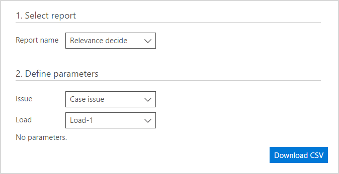

# Office 365 Advanced eDiscovery 보고서 실행Run reports in Office 365 Advanced eDiscovery

> [!NOTE]
> 고급 eDiscovery 조직에 대 한 고급 준수 추가 기능 또는 e 5 구독은 Office 365 E3 필요합니다. 해당 요금제에 가입한 상태 고급 eDiscovery 시도 하려는 하지 경우에 [Office 365 Enterprise e 5의 평가판 등록](https://go.microsoft.com/fwlink/p/?LinkID=698279)할 수 있습니다.Advanced eDiscovery requires an Office 365 E3 with the Advanced Compliance add-on or an E5 subscription for your organization. If you don't have that plan and want to try Advanced eDiscovery, you can [sign up for a trial of Office 365 Enterprise E5](https://go.microsoft.com/fwlink/p/?LinkID=698279). 
  
이 항목에서는 고급 eDiscovery에서 보고서를 실행 하는 방법에 설명 합니다.This topic describes how to run reports in Advanced eDiscovery.
  
## 보고서를 실행합니다.Running reports

선택한 프로세스에 대 한 보고서와 함께.csv 파일을 다운로드할 수 있습니다.You can download a .csv file with a report for the selected process.
  
1. **보고서** 탭에서 **보고서 이름** 목록에서 옵션을 선택 합니다. 세 **보고서 이름** 옵션 중에서 선택: **관련성 결정**, **테마 목록** 또는 **태그가 지정 된 파일**입니다.In the **Reports** tab, select an option from the **Report name** list. Select from three **Report name** options: **Relevance decide**, **Themes list,** or **Tagged files**.
    
    
  
2. 사용 가능한 매개 변수 및 정렬 및 필터링 옵션을 설정할 수 선택한 보고서에 따라 합니다.Available parameters, and sort and filter options can be set, depending on the selected report. 
    
3. **CSV 다운로드**를 클릭 합니다. 요청 된 보고서가 생성 및 다운로드 합니다.Click **Download CSV**. The requested report is generated and downloaded.
    
## 참고 항목See also

[Office 365 Advanced eDiscoveryOffice 365 Advanced eDiscovery](office-365-advanced-ediscovery.md)

