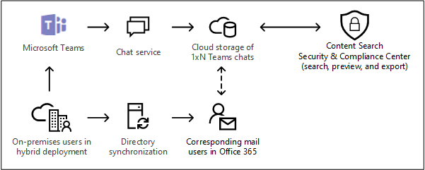

# <a name="searching-cloud-based-mailboxes-for-on-premises-users-in-office-365"></a>Office 365에서 온-프레미스 사용자에 대 한 클라우드 기반 사서함 검색

조직에 Exchange 하이브리드 배포가 있고 Microsoft 팀을 사용 하도록 설정 하면 사용자는 인스턴트 메시징을 위해 팀 채팅 응용 프로그램을 사용할 수 있습니다. 클라우드 기반 사용자의 경우 팀 채팅 데이터 (1xN 채팅이 라고도 함)가 기본 클라우드 기반 사서함에 저장 됩니다. 온-프레미스 사용자가 팀 채팅 응용 프로그램을 사용 하는 경우 기본 사서함은 온-프레미스에 있습니다. 이러한 제한을 해결 하기 위해 Microsoft는 온-프레미스 사용자를 위한 팀 채팅 데이터를 저장 하기 위해 클라우드 기반 저장소 영역 (온-프레미스 사용자를 위한 클라우드 기반 사서함)을 만들기 위한 새로운 기능을 출시 했습니다. 이를 통해 보안 & 준수 센터의 콘텐츠 검색 도구를 사용 하 여 온-프레미스 사용자의 팀 채팅 데이터를 검색 하 고 내보낼 수 있습니다. 
  
온-프레미스 사용자에 대해 클라우드 기반 사서함을 설정 및 검색 하기 위한 요구 사항 및 제한 사항은 다음과 같습니다.
  
- 온-프레미스 디렉터리 서비스의 사용자 계정 (예: Active Directory)은 Office 365의 디렉터리 서비스인 Azure Active Directory와 동기화 되어야 합니다. 즉, 메일 사용자 계정이 Office 365에 만들어지고 기본 사서함이 온-프레미스 조직에 있는 사용자와 연결 됩니다.
    
- 온-프레미스 사용자를 위한 클라우드 기반 사서함은 팀 채팅 데이터를 저장 하는 경우에만 사용 됩니다. 온-프레미스 사용자가 클라우드 기반 사서함에 로그인 하거나 어떤 방식으로든 액세스를 수행할 수 없습니다. 전자 메일 메시지를 보내거나 받는 데 사용할 수 없습니다. 
    
- 조직에서 온-프레미스 사용자의 클라우드 기반 사서함에서 팀 채팅 데이터를 검색할 수 있도록 하려면 Microsoft 지원 요청을 제출 해야 합니다. 이 문서에서 [이 기능을 사용 하도록 설정 하려면 Microsoft Support에 대 한 요청 관리를](#filing-a-request-with-microsoft-support-to-enable-this-feature) 참조 하세요. 
    
 **참고:** 팀 채널 대화는 항상 팀과 연결 된 클라우드 기반 사서함에 저장 됩니다. 즉, 지원 요청을 파일 하지 않고도 콘텐츠 검색을 통해 채널 대화를 검색할 수 있습니다. 팀 채널 대화 검색에 대 한 자세한 내용은 [Microsoft 팀 및 Office 365 그룹 검색](content-search.md#searching-microsoft-teams-and-office-365-groups)을 참조 하세요.
  
## <a name="how-it-works"></a>작업 방법

Microsoft 팀 사용 가능 사용자에 게 온-프레미스 사서함이 있고 해당 사용자 계정/id가 클라우드와 동기화 된 경우 Microsoft는 클라우드 기반 사서함을 만들어 1xN 팀 채팅 데이터를 저장 합니다. 팀 채팅 데이터가 클라우드 기반 사서함에 저장 된 후에는 검색을 위해 인덱싱됩니다. 이를 통해 콘텐츠 검색 (및 eDiscovery 사례와 연결 된 검색)을 사용 하 여 온-프레미스 사용자에 대 한 팀 채팅 데이터를 검색, 미리 보기 및 내보낼 수 있습니다. 또한 Security & 준수 센터 PowerShell에서 ** \*ComplianceSearch** cmdlet을 사용 하 여 온-프레미스 사용자의 팀 채팅 데이터를 검색할 수 있습니다. 
  
다음 그림에서는 온-프레미스 사용자의 팀 채팅 데이터를 검색, 미리 보기 및 내보낼 수 있는 방식에 대 한 워크플로를 보여 줍니다.
  

  
이 새로운 기능 외에도, 콘텐츠 검색을 사용 하 여 클라우드 기반 SharePoint 사이트에서 팀 콘텐츠를 검색, 미리 보기 및 내보낼 수 있으며, 각 Microsoft 팀에 연결 된 Exchange 사서함 및 exchange Online 사서함의 1xN 팀 채팅 데이터를 사용할 수도 있습니다. 클라우드 기반 사용자

## <a name="filing-a-request-with-microsoft-support-to-enable-this-feature"></a>이 기능을 사용 하도록 설정 하기 위해 Microsoft 지원 서비스에 요청

조직이 온-프레미스 사용자의 클라우드 기반 사서함에서 팀 채팅 데이터를 검색할 수 있도록 하려면 Microsoft Support에 대 한 요청을 파일 해야 합니다. 이 기능은 Security & 준수 센터 PowerShell에서 사용할 수 있습니다. PowerShell을 사용 하 여 온-프레미스 사용자의 팀 채팅 데이터를 검색 하기 위해 지원 요청을 제출할 필요는 없습니다. 
  
Microsoft 지원 서비스에 요청을 제출할 때 다음 정보를 포함 합니다.
  
- Office 365 조직의 기본 도메인 이름입니다.
    
- Office 365 조직의 테 넌 트 이름 및 테 넌 트 ID입니다. Azure Active Directory 포털 ( **속성** **관리** \> )에서 찾을 수 있습니다. [Office 365 테 넌 트 ID 찾기를](https://support.office.com/article/6891b561-a52d-4ade-9f39-b492285e2c9b)참조 하세요.
    
- 다음은 "온-프레미스 사용자를 위해 응용 프로그램 콘텐츠 검색을 사용 하도록 설정 합니다." 라는 지원 요청 목적에 대 한 설명입니다. 이를 통해 요청을 구현할 Office 365 eDiscovery 엔지니어링 팀에 게 요청을 라우팅할 수 있습니다. 
    
엔지니어링이 변경 되 면 Microsoft Support에서 예상 배포 날짜를 보내 집니다. 배포 프로세스는 일반적으로 지원 요청을 제출한 후 2-3 주 정도 걸립니다. 
  
### <a name="what-happens-after-this-feature-is-enabled"></a>이 기능이 사용 하도록 설정 된 후에 수행 되는 작업

이 기능이 Office 365 조직에 배포 된 후에는 보안 & 준수 센터에서 eDiscovery 사례와 연결 된 콘텐츠 검색 및 검색에서 다음 변경 내용이 적용 됩니다.
  
- **온-프레미스 사용자에 대 한 Office 앱 콘텐츠 추가** 확인란은 콘텐츠 검색의 **위치** 아래에 추가 됩니다. 
    
    
  
- 온-프레미스 사용자는 검색할 사용자 사서함을 선택 하는 데 사용 하는 콘텐츠 위치 선택에 표시 됩니다. 
    

  
## <a name="searching-for-teams-chat-content-in-cloud-based-mailboxes-for-on-premises-users"></a>온-프레미스 사용자에 대 한 클라우드 기반 사서함의 팀 채팅 콘텐츠 검색

기능을 사용 하도록 설정한 후에는 Security & 준수 센터에서 콘텐츠 검색을 사용 하 여 온-프레미스 사용자의 클라우드 기반 사서함에서 팀 채팅 데이터를 검색할 수 있습니다. 
  
1. 보안 & 준수 센터에서 **검색** \> **콘텐츠 검색** 으로 이동
    
2. **검색** 페이지에서  **새 검색**아이콘 추가를 클릭 합니다.
    
    앞에서 설명한 것 처럼, 온 **-프레미스 사용자에 대 한 Office 앱 콘텐츠 추가** 확인란은 **위치**아래에 표시 됩니다. 기본적으로 선택 되어 있습니다.
    
3. 키워드 쿼리를 만들고 필요한 경우 검색 쿼리에 조건을 추가 합니다. 팀 채팅 데이터만 검색 하려면 **키워드** 상자에 다음 쿼리를 추가 하면 됩니다. 
    
    ```
    kind:im
    ``` 

4. 이때 **위치**에서 다음 옵션 중 하나를 선택할 수 있습니다.
    
    - **모든 위치** -조직의 모든 사용자에 대 한 사서함을 검색 하려면이 옵션을 선택 합니다. 이 확인란을 선택 하면 온-프레미스 사용자에 대 한 모든 클라우드 기반 사서함도 검색 됩니다. 
    
    - **특정 위치** -이 옵션을 선택 하 고 **수정** \> 을 클릭 하 여 특정 사서함을 검색할 사용자, 그룹 또는 팀을 선택 합니다. 앞에서 설명한 것 처럼 위치 선택기를 통해 온-프레미스 사용자를 검색할 수 있습니다. 
    
5. 검색을 저장 하 고 실행 합니다. 온-프레미스 사용자에 대 한 클라우드 기반 사서함의 모든 검색 결과를 다른 검색 결과와 같이 미리 볼 수 있습니다. 또한 팀 채팅 데이터를 포함 하 여 검색 결과를 PST 파일로 내보낼 수도 있습니다. 자세한 내용은 다음을 참조하세요. 
    
    - [새 검색 만들기](content-search.md#create-a-new-search)
    
    - [검색 결과 미리 보기](content-search.md#preview-search-results)
    
    - [콘텐츠 검색 결과 내보내기](export-search-results.md)
    
## <a name="using-powershell-to-search-for-teams-chat-data-in-cloud-based-mailboxes-for-on-premises-users"></a>PowerShell을 사용 하 여 온-프레미스 사용자의 클라우드 기반 사서함에서 팀 채팅 데이터 검색

Security & 준수 센터 PowerShell에서 **ComplianceSearch** 및 **ComplianceSearch** cmdlet을 사용 하 여 온-프레미스 사용자의 클라우드 기반 사서함을 검색할 수 있습니다. 앞에서 설명한 것 처럼 PowerShell을 사용 하 여 온-프레미스 사용자의 팀 채팅 데이터를 검색 하기 위해 지원 요청을 제출할 필요가 없습니다. 
  
1. [Security _AMP_ 준수 센터 PowerShell에 연결](https://docs.microsoft.com/powershell/exchange/office-365-scc/connect-to-scc-powershell/connect-to-scc-powershell)합니다.
    
2. 새 콘텐츠를 만들려면 다음 PowerShell 명령을 실행 하 여 온-프레미스 사용자의 클라우드 기반 사서함을 검색 합니다.
    
    ```
    New-ComplianceSearch <name of new search> -ContentMatchQuery <search query> -ExchangeLocation <on-premises user> -IncludeUserAppContent $true -AllowNotFoundExchangeLocationsEnabled $true  
    ```
   
    *Includeuserappcontent* 매개 변수는 *ExchangeLocation* 매개 변수에 지정 된 사용자 또는 사용자에 대 한 클라우드 기반 사서함을 지정 하는 데 사용 됩니다. *AllowNotFoundExchangeLocationsEnabled* 에서는 온-프레미스 사용자에 대해 클라우드 기반 사서함을 사용할 수 있습니다. 이 매개 변수의 `$true` 값을 사용 하는 경우 검색을 실행 하기 전에 사서함의 존재 여부를 확인 하지 않습니다. 이는 사서함 유형이 일반 사서함으로 확인 되지 않으므로 온-프레미스 사용자의 클라우드 기반 사서함을 검색 하는 데 필요 합니다. 
    
    다음은 Contoso 조직의 온-프레미스 사용자 인 Sara Davis의 클라우드 기반 사서함에 "redstone" 키워드를 포함 하는 팀 대화방 (인스턴트 메시지)을 검색 하는 예제입니다.
  
    ```
    New-ComplianceSearch "Redstone_Search" -ContentMatchQuery "redstone AND kind:im" -ExchangeLocation sarad@contoso.com -IncludeUserAppContent $true -AllowNotFoundExchangeLocationsEnabled $true  
    ```

   새 검색을 만든 후에는 **ComplianceSearch** cmdlet을 사용 하 여 검색을 실행 해야 합니다. 
  
이러한 cmdlet을 사용 하는 방법에 대 한 자세한 내용은 다음을 참조 하십시오.
  
- [New-ComplianceSearch](https://docs.microsoft.com/powershell/module/exchange/policy-and-compliance-content-search/new-compliancesearch)
    
- [Set-ComplianceSearch](https://docs.microsoft.com/powershell/module/exchange/policy-and-compliance-content-search/set-compliancesearch)
    
- [Start-ComplianceSearch](https://docs.microsoft.com/powershell/module/exchange/policy-and-compliance-content-search/start-compliancesearch)
    

## <a name="known-issues"></a>알려진 문제

- 현재 온-프레미스 사용자의 경우 클라우드 기반 사서함에서 콘텐츠를 검색, 미리 보기 및 내보낼 수만 있습니다. 온-프레미스 사용자에 대해 클라우드 기반 사서함을 eDiscovery 사례와 관련 된 보류에 배치 하거나 Office 365 보존 정책에 할당 하는 것은 지원 되지 않습니다. 
    
- EDiscovery 보류에 대 한 콘텐츠 위치 선택에서는 온-프레미스 사용자를 표시 하 고이를 선택할 수 있습니다. 하지만 앞에서 설명한 보류가 온-프레미스 사용자에 게 적용 되지 않습니다.
    
## <a name="frequently-asked-questions"></a>자주하는 질문

 **온-프레미스 사용자에 대 한 클라우드 기반 사서함은 어디에 있나요?**
  
클라우드 기반 사서함은 Office 365 조직과 동일한 데이터 센터에 만들어지고 저장 됩니다. 
  
 **지원 요청을 제출 하는 것 외에 다른 요구 사항이 있습니까?**
  
 앞에서 설명한 것 처럼, 프레미스 사서함을 사용 하는 사용자의 id는 Office 365에서 각 온-프레미스 사용자 계정에 대해 해당 메일 사용자 계정을 만들 수 있도록 클라우드 기반 조직과 동기화 해야 합니다. 또한 조직에 Office 365 Enterprise E1, E3 또는 E5 구독과 같은 Office 365 enterprise 구독이 있어야 합니다. 
  
 **사용자의 온-프레미스 사서함이 클라우드로 마이그레이션될 경우 팀 채팅 데이터가 손실 될 위험이 있습니까?**
  
아니요. 온-프레미스 사용자의 기본 사서함을 클라우드로 마이그레이션하는 경우 해당 사용자에 대 한 팀 채팅 데이터가 새로운 클라우드 기반 기본 사서함으로 마이그레이션됩니다.
  
 **온-프레미스 사용자에 게 eDiscovery 보류 또는 Office 365 보존 정책을 적용할 수 있나요?**
  
아니요.
  
 **조직에서이 기능을 사용 하도록 요청을 제출한 시간 이전에 온-프레미스 사용자의 이전 팀 대화방을 찾을 수 있습니까?**
  
Microsoft가 2018 년 1 월 31 일에 온-프레미스 사용자에 대 한 팀 채팅 데이터 저장을 시작 했습니다. 따라서이 날짜 이후에 Active Directory 및 Azure Active Directory 간에 온-프레미스 팀 사용자의 id가 동기화 된 경우 팀 채팅 데이터가 클라우드 기반 사서함에 저장 되 고 콘텐츠 검색을 통해 검색 가능 하 게 됩니다. 또한 Microsoft는 온-프레미스 사용자의 클라우드 기반 사서함에서 2018 년 1 월 31 일 이전에 팀 채팅 데이터를 저장 하는 작업을 수행 하 고 있습니다. 이에 대 한 자세한 내용은 곧 제공 될 예정입니다.
