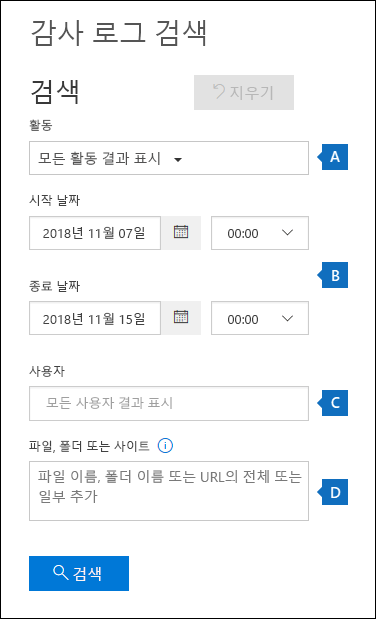
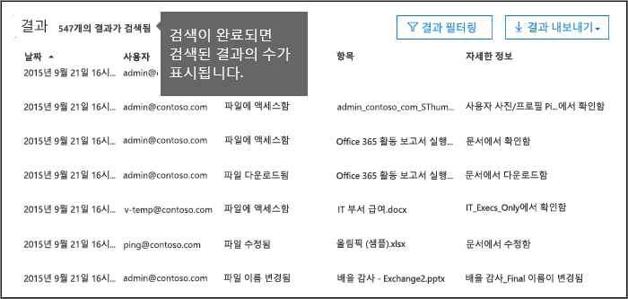
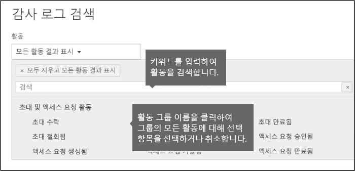
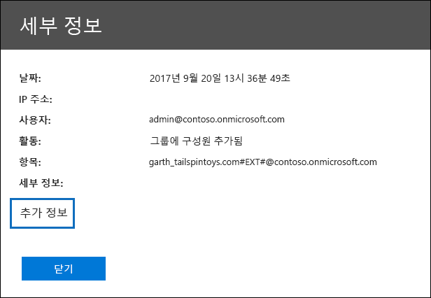
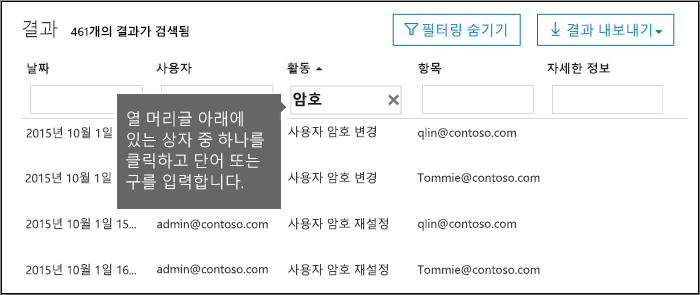
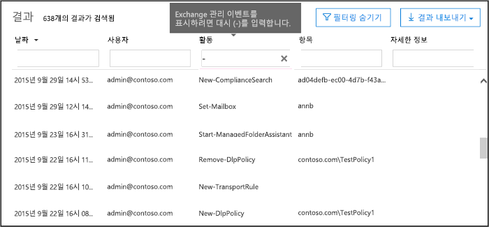

# <a name="search-the-audit-log-in-the-office-365-security-amp-compliance-center"></a><span data-ttu-id="2db87-103">Office 365 보안 및 준수 센터에서 감사 로그 검색</span><span class="sxs-lookup"><span data-stu-id="2db87-103">Search the audit log in the Office 365 Security &amp; Compliance Center</span></span>

<span data-ttu-id="2db87-p101">사용자는 특정 문서를 볼 또는 자신의 사서함에서 항목을 제거 하는 경우를 찾이 필요가 있습니까? 그렇다면 사용 Office 365 보안 &amp; 준수 센터를 Office 365 조직에서 사용자 및 관리자가 작업을 보려면 통합된 감사 로그를 검색 합니다. 통합 된 감사 로그 그 이유? Office 365에서 사용자 및 관리자 작업에는 다음과 같은 유형의 검색할 수 있으므로:</span><span class="sxs-lookup"><span data-stu-id="2db87-p101">Need to find if a user viewed a specific document or purged an item from their mailbox? If so, you can use the Office 365 Security &amp; Compliance Center to search the unified audit log to view user and administrator activity in your Office 365 organization. Why a unified audit log? Because you can search for the following types of user and admin activity in Office 365:</span></span>
  
- <span data-ttu-id="2db87-108">SharePoint Online 및 비즈니스용 OneDrive의 사용자 작업</span><span class="sxs-lookup"><span data-stu-id="2db87-108">User activity in SharePoint Online and OneDrive for Business</span></span>
    
- <span data-ttu-id="2db87-109">Exchange Online의 사용자 작업 (Exchange 사서함 감사 로깅)</span><span class="sxs-lookup"><span data-stu-id="2db87-109">User activity in Exchange Online (Exchange mailbox audit logging)</span></span>
    
    > [!IMPORTANT]
    > <span data-ttu-id="2db87-p102">사서함 감사 로깅 설정 해야 각 사용자 사서함에 대 한 전에 Exchange Online의 사용자 작업 기록 됩니다. 자세한 내용은 [Office 365의 감사 사서함 사용](enable-mailbox-auditing.md)을 참조 하십시오.</span><span class="sxs-lookup"><span data-stu-id="2db87-p102">Mailbox audit logging must be turned on for each user mailbox before user activity in Exchange Online will be logged. For more information, see [Enable mailbox auditing in Office 365](enable-mailbox-auditing.md).</span></span>
  
- <span data-ttu-id="2db87-112">SharePoint Online에서 관리 작업</span><span class="sxs-lookup"><span data-stu-id="2db87-112">Admin activity in SharePoint Online</span></span>
    
- <span data-ttu-id="2db87-113">Azure Active Directory (Office 365에 대 한 디렉터리 서비스)에서 관리 작업</span><span class="sxs-lookup"><span data-stu-id="2db87-113">Admin activity in Azure Active Directory (the directory service for Office 365)</span></span>
    
- <span data-ttu-id="2db87-114">Exchange Online에서 관리 작업 (Exchange 관리 감사 로깅)</span><span class="sxs-lookup"><span data-stu-id="2db87-114">Admin activity in Exchange Online (Exchange admin audit logging)</span></span>
    
- <span data-ttu-id="2db87-115">사용자 및 관리자 작업의 영향</span><span class="sxs-lookup"><span data-stu-id="2db87-115">User and admin activity in Sway</span></span>
    
- <span data-ttu-id="2db87-116">Office 365 보안에서 eDiscovery 활동 &amp; 준수 센터</span><span class="sxs-lookup"><span data-stu-id="2db87-116">eDiscovery activities in the Office 365 Security &amp; Compliance Center</span></span>
    
- <span data-ttu-id="2db87-117">Office 365 용 Power BI의 사용자 및 관리자 작업</span><span class="sxs-lookup"><span data-stu-id="2db87-117">User and admin activity in Power BI for Office 365</span></span>
    
- <span data-ttu-id="2db87-118">Microsoft 팀의 사용자 및 관리자 작업</span><span class="sxs-lookup"><span data-stu-id="2db87-118">User and admin activity in Microsoft Teams</span></span>

- <span data-ttu-id="2db87-119">Dynamics 365 사용자 및 관리자 작업</span><span class="sxs-lookup"><span data-stu-id="2db87-119">User and admin activity in Dynamics 365</span></span>
    
- <span data-ttu-id="2db87-120">Microsoft 흐름에서 사용자 및 관리자 작업</span><span class="sxs-lookup"><span data-stu-id="2db87-120">User and admin activity in Microsoft Flow</span></span>

- <span data-ttu-id="2db87-121">Yammer의 사용자 및 관리자 작업</span><span class="sxs-lookup"><span data-stu-id="2db87-121">User and admin activity in Yammer</span></span>
    
- <span data-ttu-id="2db87-122">Microsoft Stream에서 사용자 및 관리자 작업</span><span class="sxs-lookup"><span data-stu-id="2db87-122">User and admin activity in Microsoft Stream</span></span>
    
   
## <a name="before-you-begin"></a><span data-ttu-id="2db87-123">시작하기 전에</span><span class="sxs-lookup"><span data-stu-id="2db87-123">Before you begin</span></span>

<span data-ttu-id="2db87-124">Office 365에서 검색을 시작 하기 전에 다음 항목 감사 로그 읽기를 사용 해야 합니다.</span><span class="sxs-lookup"><span data-stu-id="2db87-124">Be sure to read the following items before you start searching the Office 365 audit log.</span></span>
  
- <span data-ttu-id="2db87-p103">사용자 (또는 다른 관리자) 먼저 설정 해야 감사 로깅 Office 365 감사 로그 검색을 시작할 수 있습니다. 켜는, 방금 클릭 **사용자 및 관리자 작업을 녹음/녹화 시작** 보안에서 **감사 로그 검색** 페이지에서 &amp; 준수 센터입니다. (이 링크 보이지 않으면 감사가 이미 설정 되어 조직에 대 한.) 설정한 후 라는 감사 로그를 준비 하는 메시지를 몇 시간 준비를 완료 한 후에 검색을 실행할 수 있습니다는 메시지가 표시 됩니다. 이 작업을 한번 수행 해야 합니다.</span><span class="sxs-lookup"><span data-stu-id="2db87-p103">You (or another admin) must first turn on audit logging before you can start searching the Office 365 audit log. To turn it on, just click **Start recording user and admin activity** on the **Audit log search** page in the Security &amp; Compliance Center. (If you don't see this link, auditing has already been turned on for your organization.) After you turn it on, a message is displayed that says the audit log is being prepared and that you can run a search in a couple of hours after the preparation is complete. You only have to do this once.</span></span> 
    
    > [!NOTE]
    > <span data-ttu-id="2db87-p104">기본적으로 감사를 사용 하면 진행 하세요. 그때까지 수 켜기 앞에서 설명한 대로 합니다.</span><span class="sxs-lookup"><span data-stu-id="2db87-p104">We're in the process of turning on auditing by default. Until then, you can turn it on as previously described.</span></span> 
  
- <span data-ttu-id="2db87-p105">보기 전용 감사 로그 또는 감사 로그 역할 Exchange Online에 할당할 Office 365 감사 로그를 검색 해야 합니다. 기본적으로 이러한 역할은 Exchange 관리 센터에서 **사용 권한** 페이지에서 준수 관리 및 조직 관리 역할 그룹에 할당 됩니다. 사용자 최소 수준의 권한 사용 하 여 Office 365 감사 로그를 검색 하는 기능을 부여 하려면 Exchange Online 사용자 지정 역할 그룹을 만들, 보기 전용 감사 로그 또는 감사 로그 역할을을 추가한 다음 새 역할 그룹의 구성원으로 사용자를 추가 합니다. 자세한 내용은 [관리 역할 그룹 Exchange Online을](https://go.microsoft.com/fwlink/p/?LinkID=730688)참조 하십시오.</span><span class="sxs-lookup"><span data-stu-id="2db87-p105">You have to be assigned the View-Only Audit Logs or Audit Logs role in Exchange Online to search the Office 365 audit log. By default, these roles are assigned to the Compliance Management and Organization Management role groups on the **Permissions** page in the Exchange admin center. To give a user the ability to search the Office 365 audit log with the minimum level of privileges, you can create a custom role group in Exchange Online, add the View-Only Audit Logs or Audit Logs role, and then add the user as a member of the new role group. For more information, see [Manage role groups in Exchange Online](https://go.microsoft.com/fwlink/p/?LinkID=730688).</span></span>
    
    > [!IMPORTANT]
    > <span data-ttu-id="2db87-p106">사용자 보안에서 **사용 권한** 페이지에서 보기 전용 감사 로그 또는 감사 로그 역할을 할당 하는 경우 &amp; 준수 센터 수는 없습니다 Office 365 감사 로그를 검색 합니다. Exchange Online에서 사용 권한을 할당 해야 합니다. 감사 로그를 검색 하는 데 사용 하는 원본으로 사용 cmdlet은 Exchange Online cmdlet 때문입니다.</span><span class="sxs-lookup"><span data-stu-id="2db87-p106">If you assign a user the View-Only Audit Logs or Audit Logs role on the **Permissions** page in the Security &amp; Compliance Center, they won't be able to search the Office 365 audit log. You have to assign the permissions in Exchange Online. This is because the underlying cmdlet used to search the audit log is an Exchange Online cmdlet.</span></span> 
  
- <span data-ttu-id="2db87-138">조직에 대 한 Office 365에서 감사 로그 검색을 해제 하려는 경우 Exchange Online 조직에 연결 된 원격 PowerShell에서 다음 명령을 실행할 수 있습니다.</span><span class="sxs-lookup"><span data-stu-id="2db87-138">If you want to turn off audit log search in Office 365 for your organization, you can run the following command in remote PowerShell connected to your Exchange Online organization:</span></span>
    
  ```
  Set-AdminAuditLogConfig -UnifiedAuditLogIngestionEnabled $false
  ```

    <span data-ttu-id="2db87-139">감사 검색을 다시 켭니다 Exchange Online PowerShell에서 다음 명령을 실행할 수 있습니다.</span><span class="sxs-lookup"><span data-stu-id="2db87-139">To turn on audit search again, you can run the following command in Exchange Online PowerShell:</span></span>
    
  ```
  Set-AdminAuditLogConfig -UnifiedAuditLogIngestionEnabled $true
  ```

    <span data-ttu-id="2db87-140">자세한 내용은 [Office 365에서 감사 로그 검색 해제](turn-audit-log-search-on-or-off.md)를 참조 하십시오.</span><span class="sxs-lookup"><span data-stu-id="2db87-140">For more information, see [Turn off audit log search in Office 365](turn-audit-log-search-on-or-off.md).</span></span>
    
- <span data-ttu-id="2db87-p107">앞서 설명한 것 처럼 감사 로그를 검색 하는 데 사용 하는 기본 cmdlet은는 Exchange Online cmdlet은 **검색 UnifiedAuditLog**됩니다. 즉, 보안에서 **감사 로그 검색** 페이지를 사용 하는 대신 Office 365 감사 로그를 검색 하려면이 cmdlet을 사용할 수 &amp; 준수 센터입니다. Exchange Online 조직에 연결 된 원격 PowerShell에서이 cmdlet을 실행 해야 합니다. 자세한 내용은 [검색 UnifiedAuditLog](https://go.microsoft.com/fwlink/p/?linkid=834776)을 참조 하십시오.</span><span class="sxs-lookup"><span data-stu-id="2db87-p107">As previously stated, the underlying cmdlet used to search the audit log is an Exchange Online cmdlet, which is **Search-UnifiedAuditLog**. That means you can use this cmdlet to search the Office 365 audit log instead of using the **Audit log search** page in the Security &amp; Compliance Center. You have to run this cmdlet in remote PowerShell connected to your Exchange Online organization. For more information, see [Search-UnifiedAuditLog](https://go.microsoft.com/fwlink/p/?linkid=834776).</span></span>
    
- <span data-ttu-id="2db87-p108">프로그래밍 방식으로 Office 365 감사 로그에서 데이터를 다운로드 하려면 PowerShell 스크립트를 사용 하는 대신 Office 365 관리 활동 API를 사용 하는 것이 좋습니다. Office 365 관리 활동 API는 작업, 보안 및 규정 준수 조직에 대 한 모니터링 솔루션을 개발 하는 데 사용할 수 있는 REST 웹 서비스. 자세한 내용은 [Office 365 관리 활동 API 참조 (영문)을](https://go.microsoft.com/fwlink/?linkid=852309)참조 하십시오.</span><span class="sxs-lookup"><span data-stu-id="2db87-p108">If you want to programmatically download data from the Office 365 audit log, we recommend that you use the Office 365 Management Activity API instead of using a PowerShell script. The Office 365 Management Activity API is a REST web service that you can use to develop operations, security, and compliance monitoring solutions for your organization. For more information, see [Office 365 Management Activity API reference](https://go.microsoft.com/fwlink/?linkid=852309).</span></span>
    
- <span data-ttu-id="2db87-148">지난 90 일 동안 수행 된 활동에 대 한 Office 365 감사 로그를 검색할 수 있습니다.</span><span class="sxs-lookup"><span data-stu-id="2db87-148">You can search the Office 365 audit log for activities that were performed within the last 90 days.</span></span>
    
- <span data-ttu-id="2db87-p109">최대 30 분까지 걸릴 수 있습니다 하 또는을 24 시간 이벤트가 발생 한 후에 발생 검색 결과에 표시 되도록 해당 감사 로그 항목에 대 한 합니다. 다음 표에서 Office 365에서 서로 다른 서비스에 대 한 걸리는 시간을 보여줍니다.</span><span class="sxs-lookup"><span data-stu-id="2db87-p109">It can take up to 30 minutes or up to 24 hours after an event occurs for the corresponding audit log entry to be displayed in the search results. The following table shows the time it takes for the different services in Office 365.</span></span>
    
|<span data-ttu-id="2db87-151">**Office 365 서비스**</span><span class="sxs-lookup"><span data-stu-id="2db87-151">**Office 365 service**</span></span>|<span data-ttu-id="2db87-152">**30분**</span><span class="sxs-lookup"><span data-stu-id="2db87-152">**30 minutes**</span></span>|<span data-ttu-id="2db87-153">**24시간**</span><span class="sxs-lookup"><span data-stu-id="2db87-153">**24 hours**</span></span>|
|:-----|:-----|:-----|
|<span data-ttu-id="2db87-154">고급 위협 보호 및 위협 인텔리전스</span><span class="sxs-lookup"><span data-stu-id="2db87-154">Advanced Threat Protection and Threat Intelligence</span></span>  <br/> || |
|<span data-ttu-id="2db87-156">Azure Active Directory (사용자 로그인 이벤트)</span><span class="sxs-lookup"><span data-stu-id="2db87-156">Azure Active Directory (user login events)</span></span>  <br/> ||           <br/> |
|<span data-ttu-id="2db87-158">Azure Active Directory (관리 이벤트)</span><span class="sxs-lookup"><span data-stu-id="2db87-158">Azure Active Directory (admin events)</span></span>  <br/> || |
|<span data-ttu-id="2db87-160">Azure Active Directory (사용자 로그인 이벤트)</span><span class="sxs-lookup"><span data-stu-id="2db87-160">Azure Active Directory (user login events)</span></span>  <br/> ||           <br/> |
|<span data-ttu-id="2db87-162">데이터 손실 방지</span><span class="sxs-lookup"><span data-stu-id="2db87-162">Data Loss Prevention</span></span>  <br/> |           <br/>| |
|<span data-ttu-id="2db87-164">Dynamics 365 CRM</span><span class="sxs-lookup"><span data-stu-id="2db87-164">Dynamics 365 CRM</span></span> <br/> |           <br/>| |
|<span data-ttu-id="2db87-166">eDiscovery</span><span class="sxs-lookup"><span data-stu-id="2db87-166">eDiscovery</span></span>  <br/> |           <br/>| |
|<span data-ttu-id="2db87-168">Exchange Online</span><span class="sxs-lookup"><span data-stu-id="2db87-168">Exchange Online</span></span>  <br/> |           <br/> ||
|<span data-ttu-id="2db87-170">Microsoft Flow</span><span class="sxs-lookup"><span data-stu-id="2db87-170">Microsoft Flow</span></span>  <br/> |           <br/>| |
|<span data-ttu-id="2db87-172">Microsoft Forms</span><span class="sxs-lookup"><span data-stu-id="2db87-172">Microsoft Forms</span></span>  <br/> |           <br/>| |
|<span data-ttu-id="2db87-174">Microsoft Project</span><span class="sxs-lookup"><span data-stu-id="2db87-174">Microsoft Project</span></span>  <br/> |           <br/>| |
|<span data-ttu-id="2db87-176">Microsoft Stream</span><span class="sxs-lookup"><span data-stu-id="2db87-176">Microsoft Stream</span></span>  <br/> |           <br/>| |
|<span data-ttu-id="2db87-178">Microsoft 팀</span><span class="sxs-lookup"><span data-stu-id="2db87-178">Microsoft Teams</span></span>  <br/> |           <br/> ||
|<span data-ttu-id="2db87-180">Power BI</span><span class="sxs-lookup"><span data-stu-id="2db87-180">Power BI</span></span>  <br/> |           <br/>| |
|<span data-ttu-id="2db87-182">보안 &amp; 준수 센터</span><span class="sxs-lookup"><span data-stu-id="2db87-182">Security &amp; Compliance Center</span></span>  <br/> |           <br/> ||
|<span data-ttu-id="2db87-184">SharePoint Online 및 비즈니스용 OneDrive</span><span class="sxs-lookup"><span data-stu-id="2db87-184">SharePoint Online and OneDrive for Business</span></span>  <br/> |           <br/> ||
|<span data-ttu-id="2db87-186">Sway</span><span class="sxs-lookup"><span data-stu-id="2db87-186">Sway</span></span>  <br/> ||           <br/> |
|<span data-ttu-id="2db87-188">Yammer</span><span class="sxs-lookup"><span data-stu-id="2db87-188">Yammer</span></span>  <br/> ||           <br/> |
   
- <span data-ttu-id="2db87-p110">Azure Active Directory (Azure AD)는 Office 365에 대 한 디렉터리 서비스입니다. 사용자, 그룹, 응용 프로그램, 도메인 및 Office 365 관리 센터에서 또는 Azure에서 수행 하는 디렉터리 활동을 포함 하는 통합된 감사 로그 관리 포털 합니다. Azure AD 이벤트의 전체 목록을, [Azure Active Directory 감사 보고서 이벤트](https://go.microsoft.com/fwlink/p/?LinkID=616549)를 참조 하십시오.</span><span class="sxs-lookup"><span data-stu-id="2db87-p110">Azure Active Directory (Azure AD) is the directory service for Office 365. The unified audit log contains user, group, application, domain, and directory activities performed in the Office 365 admin center or in the in Azure management portal. For a complete list of Azure AD events, see [Azure Active Directory Audit Report Events](https://go.microsoft.com/fwlink/p/?LinkID=616549).</span></span>
    
- <span data-ttu-id="2db87-p111">이벤트의 두 종류의 Exchange Online 감사 로그 구성: Exchange 관리 이벤트 (관리자가 수행 하는 작업) 및 사서함 이벤트 (사서함에서 사용자가 수행 하는 작업). 메모는 기본적으로 설정 되지 않은 사서함 감사 합니다. Office 365 감사 로그에서에 대 한 검색할 수 있는 사서함 이벤트 전에 각 사용자 사서함에 대해 사용 하도록 설정 해야 합니다. 사서함 감사 및 기록 되는 작업을 감사 하는 사서함에 대 한 자세한 내용은 [Office 365의 감사 사서함 사용](enable-mailbox-auditing.md)을 참조 하십시오.</span><span class="sxs-lookup"><span data-stu-id="2db87-p111">Exchange Online audit logs consist of two types of events: Exchange admin events (actions taken by administrators) and mailbox events (actions taken by users on mailboxes). Note that mailbox auditing isn't enabled by default. It must be enable for each user mailbox before mailbox events can be searched for in the Office 365 audit log. For more information about mailbox auditing and the mailbox auditing actions that are logged, see [Enable mailbox auditing in Office 365](enable-mailbox-auditing.md).</span></span>
    
- <span data-ttu-id="2db87-p112">Power BI에 대 한 감사 로깅이 기본적으로 활성화 되지 않습니다. Office 365 감사 로그에서 Power BI 활동을 검색 하려면 Power BI 관리 포털에 감사를 사용 하도록 설정 해야 합니다. 자세한 내용은 [Power BI 감사](https://docs.microsoft.com/power-bi/service-admin-auditing#enabling-auditing-functionality-in-the-power-bi-admin-portal)를 참조 하십시오.</span><span class="sxs-lookup"><span data-stu-id="2db87-p112">Audit logging for Power BI isn't enabled by default. To search for Power BI activities in the Office 365 audit log, you have to enable auditing in the Power BI admin portal. For instructions, see [Auditing Power BI](https://docs.microsoft.com/power-bi/service-admin-auditing#enabling-auditing-functionality-in-the-power-bi-admin-portal).</span></span>
    
    
## <a name="search-the-audit-log"></a><span data-ttu-id="2db87-200">감사 로그 검색</span><span class="sxs-lookup"><span data-stu-id="2db87-200">Search the audit log</span></span>

<span data-ttu-id="2db87-201">Office 365에서 감사 로그를 검색 하는 프로세스는 다음과 같습니다.</span><span class="sxs-lookup"><span data-stu-id="2db87-201">Here's the process for searching the audit log in Office 365.</span></span>
  
[<span data-ttu-id="2db87-202">감사 로그 검색을 실행 하는 1 단계:</span><span class="sxs-lookup"><span data-stu-id="2db87-202">Step 1: Run an audit log search</span></span>](#step-1-run-an-audit-log-search)
  
[<span data-ttu-id="2db87-203">2 단계: 검색 결과 확인 합니다.</span><span class="sxs-lookup"><span data-stu-id="2db87-203">Step 2: View the search results</span></span>](#step-2-view-the-search-results)

[<span data-ttu-id="2db87-204">3 단계: 검색 결과 필터링 합니다.</span><span class="sxs-lookup"><span data-stu-id="2db87-204">Step 3: Filter the search results</span></span>](#step-3-filter-the-search-results)

[<span data-ttu-id="2db87-205">4 단계: 파일을 검색 결과 내보내기</span><span class="sxs-lookup"><span data-stu-id="2db87-205">Step 4: Export the search results to a file</span></span>](#step-4-export-the-search-results-to-a-file)
  
### <a name="step-1-run-an-audit-log-search"></a><span data-ttu-id="2db87-206">감사 로그 검색을 실행 하는 1 단계:</span><span class="sxs-lookup"><span data-stu-id="2db87-206">Step 1: Run an audit log search</span></span>

1. <span data-ttu-id="2db87-207">[https://protection.office.com](https://protection.office.com)으로 이동합니다.</span><span class="sxs-lookup"><span data-stu-id="2db87-207">Go to [https://protection.office.com](https://protection.office.com).</span></span>
    
    > [!TIP]
    > <span data-ttu-id="2db87-p113">개인 검색 세션 (일반 세션 하지)를 사용 하 여 Office 365 보안 액세스할 &amp; 준수 센터 그러면 현재 로그온 함께 사용 하는 자격 증명을 방지할 수 있으므로 합니다. Internet Explorer 또는 Microsoft에 지는 InPrivate 탐색 세션을 열려면 CTRL + SHIFT + P를 누르십시오. 개인 검색 세션의 Google Chrome (incognito가 창 라고 함)를 열려면 CTRL + SHIFT + N 키를 누릅니다.</span><span class="sxs-lookup"><span data-stu-id="2db87-p113">Use a private browsing session (not a regular session) to access the Office 365 Security &amp; Compliance Center because this will prevent the credential that you are currently logged on with from being used. To open an InPrivate Browsing session in Internet Explorer or Microsoft Edge, just press CTRL+SHIFT+P. To open a private browsing session in Google Chrome (called an incognito window), press CTRL+SHIFT+N.</span></span> 
  
2. <span data-ttu-id="2db87-211">작업이 나 교육용 계정을 사용 하 여 Office 365에 로그인 합니다.</span><span class="sxs-lookup"><span data-stu-id="2db87-211">Sign in to Office 365 using your work or school account.</span></span>
    
3. <span data-ttu-id="2db87-212">보안의 왼쪽된 창에서 &amp; 준수 센터 클릭 **검색 &amp; 조사**, **감사 로그 검색**을 클릭 하 고 있습니다.</span><span class="sxs-lookup"><span data-stu-id="2db87-212">In the left pane of the Security &amp; Compliance Center, click **Search &amp; investigation**, and then click **Audit log search**.</span></span>
    
    <span data-ttu-id="2db87-213">**감사 로그 검색** 페이지가 표시 됩니다.</span><span class="sxs-lookup"><span data-stu-id="2db87-213">The **Audit log search** page is displayed.</span></span> 
    
    
  
    > [!NOTE]
    > <span data-ttu-id="2db87-p114">감사 로깅는 감사 로그 검색을 실행 하려면 먼저 첫번째 기능 설정 해야 합니다. **사용자 및 관리자 활동을 녹음/녹화 시작** 링크 표시 되는 경우에 감사를 설정 하려면 클릭 합니다. 이 링크 보이지 않으면 감사가 이미 설정 되어 조직에 대 한.</span><span class="sxs-lookup"><span data-stu-id="2db87-p114">You have to first turn on audit logging before you can run an audit log search. If the **Start recording user and admin activity** link is displayed, click it to turn on auditing. If you don't see this link, auditing has already been turned on for your organization.</span></span> 
  
4. <span data-ttu-id="2db87-218">다음 검색 조건을 구성 합니다.</span><span class="sxs-lookup"><span data-stu-id="2db87-218">Configure the following search criteria:</span></span>
    
1. <span data-ttu-id="2db87-p115">**활동** 검색할 수 있는 작업을 표시 하려면 드롭다운 목록을 클릭 합니다. 사용자 및 관리자 작업 관련된 활동의 그룹에 구성 됩니다. 특정 작업을 선택할 수 또는 그룹의 모든 작업을 선택 하려면 작업 그룹 이름을 클릭 수 있습니다. 선택을 선택 된 작업을 클릭할 수도 있습니다. 검색을 실행 하면 선택한 작업에 대 한 감사 로그 항목만 표시 됩니다. **모든 작업에 대 한 결과 표시** 를 선택 하면 선택한 사용자 또는 사용자 그룹에 의해 수행 되는 모든 작업에 대 한 결과가 표시 됩니다.</span><span class="sxs-lookup"><span data-stu-id="2db87-p115">**Activities** Click the drop-down list to display the activities that you can search for. User and admin activities are organized in to groups of related activities. You can select specific activities or you can click the activity group name to select all activities in the group. You can also click a selected activity to clear the selection. After you run the search, only the audit log entries for the selected activities are displayed. Selecting **Show results for all activities** will display results for all activities performed by the selected user or group of users.</span></span> 
    
    <span data-ttu-id="2db87-p116">100 개가 넘는 사용자 및 관리 작업은 Office 365 감사 로그에 기록 됩니다. 각각 다른 Office 365 서비스의 모든 활동의 설명을 보려면이 문서의 항목 아래에 있는 **Audited 활동** 탭을 클릭 합니다.</span><span class="sxs-lookup"><span data-stu-id="2db87-p116">Over 100 user and admin activities are logged in the Office 365 audit log. Click the **Audited activities** tab at the topic of this article to see the descriptions of every activity in each of the different Office 365 services.</span></span> 
    
2. <span data-ttu-id="2db87-p117">**시작 날짜와** **종료 날짜** 지난 7 일간 기본적으로 선택 됩니다. 기간 내에 발생 한 이벤트를 표시 하는 날짜 및 시간 범위를 선택 합니다. 날짜 및 시간에서 utc (협정 세계시) 형식 나와 있습니다. 지정할 수 있는 최대 날짜 범위에는 90 일입니다. 선택한 날짜 범위는 90 일 보다 큰 경우 오류가 표시 됩니다.</span><span class="sxs-lookup"><span data-stu-id="2db87-p117">**Start date** and **End date** The last seven days are selected by default. Select a date and time range to display the events that occurred within that period. The date and time are presented in Coordinated Universal Time (UTC) format. The maximum date range that you can specify is 90 days. An error is displayed if the selected date range is greater than 90 days.</span></span> 
    
    > [!TIP]
    > <span data-ttu-id="2db87-p118">90 일의 최대 날짜 범위를 사용 중인 경우 **시작 날짜**에 대 한 현재 시간을 선택 합니다. 그렇지 않은 경우 시작 날짜가 종료 날짜 보다 이전 하는 없다는 오류가 표시 됩니다. 지난 90 일 동안 감사를 설정한 경우 최대 날짜 범위 날짜 이전에 설정 된 감사를 시작할 수 없습니다.</span><span class="sxs-lookup"><span data-stu-id="2db87-p118">If you're using the maximum date range of 90 days, select the current time for the **Start date**. Otherwise, you'll receive an error saying that the start date is earlier than the end date. If you've turned on auditing within the last 90 days, the maximum date range can't start before the date that auditing was turned on.</span></span> 
  
3. <span data-ttu-id="2db87-p119">**사용자** 이 상자 클릭 한 다음에 대 한 검색 결과 표시 하려면 하나 이상의 사용자를 선택 합니다. 이 상자에서 선택한 사용자에 의해 수행 선택된 된 작업에 대 한 감사 로그 항목의 결과 목록에 표시 됩니다. 이 상자는 조직에서 모든 사용자 (및 서비스 계정)에 대 한 항목을 반환 하려면 비워 둡니다.</span><span class="sxs-lookup"><span data-stu-id="2db87-p119">**Users** Click in this box and then select one or more users to display search results for. The audit log entries for the selected activity performed by the users you select in this box are displayed in the list of results. Leave this box blank to return entries for all users (and service accounts) in your organization.</span></span> 
    
4. <span data-ttu-id="2db87-p120">**파일 또는 폴더** 지정된 된 키워드를 포함 하는 폴더의 파일에 관련 된 작업에 대 한 검색 파일 또는 폴더 이름 중 일부 또는 전부를 입력 합니다. 파일 또는 폴더의 URL을 지정할 수도 있습니다. URL을 사용 하는 경우 전체 URL 경로 입력 해야 하거나 방금는 URL의 일부를 입력 하는 경우 모든 특수 문자나 공백을 포함 하지 마십시오.</span><span class="sxs-lookup"><span data-stu-id="2db87-p120">**File or folder** Type some or all of a file or folder name to search for activity related to the file of folder that contains the specified keyword. You can also specify a URL of a file or folder. If you use a URL, be sure the type the full URL path or if you just type a portion of the URL, don't include any special characters or spaces.</span></span> 
    
    <span data-ttu-id="2db87-241">이 상자는 조직에서 모든 파일 및 폴더에 대 한 항목을 반환 하려면 비워 둡니다.</span><span class="sxs-lookup"><span data-stu-id="2db87-241">Leave this box blank to return entries for all files and folders in your organization.</span></span>
    
5. <span data-ttu-id="2db87-242">검색 조건을 사용 하 여 검색을 실행 하려면 **검색** 클릭 합니다.</span><span class="sxs-lookup"><span data-stu-id="2db87-242">Click **Search** to run the search using your search criteria.</span></span> 
    
    <span data-ttu-id="2db87-p121">검색 결과 로드 하 고 잠시 후 **결과**아래에서 표시 됩니다. 검색이 완료 되 면 검색 된 결과 수 표시 됩니다. 5, 000 이벤트의 최대 150 이벤트; 증분으로 **결과** 창에서으로 표시 됩니다 검색 조건을 충족 하는 최대 5, 000 개 이상의 이벤트가 가장 최근의 5, 000 이벤트가 표시 됩니다.</span><span class="sxs-lookup"><span data-stu-id="2db87-p121">The search results are loaded, and after a few moments they are displayed under **Results**. When the search is finished, the number of results found is displayed. Note that a maximum of 5,000 events will be displayed in the **Results** pane in increments of 150 events; if more than 5,000 events meet the search criteria, the most recent 5,000 events are displayed.</span></span> 
    
    
  
  
#### <a name="tips-for-searching-the-audit-log"></a><span data-ttu-id="2db87-247">감사 로그를 검색 하기 위한 팁</span><span class="sxs-lookup"><span data-stu-id="2db87-247">Tips for searching the audit log</span></span>

- <span data-ttu-id="2db87-p122">특정 작업에 대 한 작업 이름을 클릭 하 여 검색을 선택할 수 있습니다. 또는 그룹 이름을 클릭 하 여 (예: **파일 및 폴더 활동**) 그룹의 모든 활동을 검색할 수 있습니다. 활동을 선택 하는 경우 다음은 선택 영역을 취소 하려면 클릭 수 있습니다. 입력 하는 키워드가 포함 된 활동을 표시 하려면 검색 상자를 사용할 수도 있습니다.</span><span class="sxs-lookup"><span data-stu-id="2db87-p122">You can select specific activities to search for by clicking on the activity name. Or you can search for all activities in a group (such as **File and folder activities**) by clicking on the group name. If an activity is selected, you can click it to cancel the selection. You can also use the search box to display the activities that contain the keyword that you type.</span></span>
    
    
  
- <span data-ttu-id="2db87-p123">Exchange 관리자 감사 로그에서 이벤트를 표시 하려면 **작업** 목록에서 **모든 작업에 대 한 결과 표시** 를 선택 해야 합니다. 이 감사 로그에서 이벤트를 결과의 **작업** 열에서 cmdlet 이름 (예: **Set-mailbox** )을 표시합니다. 자세한 내용은이 항목의 **Audited 활동** 탭을 클릭 한 다음 **Exchange 관리 작업**을 클릭 합니다.</span><span class="sxs-lookup"><span data-stu-id="2db87-p123">You have to select **Show results for all activities** in the **Activities** list to display events from the Exchange admin audit log. Events from this audit log display a cmdlet name (for example, **Set-Mailbox** ) in the **Activity** column in the results. For more information, click the **Audited activities** tab in this topic and then click **Exchange admin activities**.</span></span>
    
    <span data-ttu-id="2db87-p124">마찬가지로, **작업** 목록에서 해당 하는 항목을 갖지 않는 일부 감사 활동 있습니다. 이러한 작업에 대 한 작업의 이름을 알고 있는 경우에 모든 작업에 대 한 검색 다음 **작업** 열에 대 한 상자에 작업의 이름을 입력 하 여 결과 필터링 수 있습니다. 참조 [3 단계: 검색 결과 필터링](#step-3-filter-the-search-results) 결과 필터링 하는 방법에 대 한 자세한 내용은 합니다.</span><span class="sxs-lookup"><span data-stu-id="2db87-p124">Similarly, there are some auditing activities that don't have a corresponding item in the **Activities** list. If you know the name of the operation for these activities, you can search for all activities, then filter the results by typing the name of the operation in the box for the **Activity** column. See [Step 3: Filter the search results](#step-3-filter-the-search-results) for more information about filtering the results.</span></span> 
    
- <span data-ttu-id="2db87-p125">현재 검색 조건을 지우려면 **의 선택을 취소** 를 클릭 합니다. 날짜 범위를 지난 7 일간의 기본값을 반환합니다. 모든 선택 된 작업을 취소 하 **는 모든 작업에 대 한 결과 표시 하려면 모두 선택 취소** 를 클릭할 수도 있습니다.</span><span class="sxs-lookup"><span data-stu-id="2db87-p125">Click **Clear** to clear the current search criteria. The date range returns to the default of the last seven days. You can also click **Clear all to show results for all activities** to cancel all selected activities.</span></span> 
    
- <span data-ttu-id="2db87-p126">결과 5 천개 발견 되 면 검색 조건을 충족 하는 최대 5, 000 개 이상의 이벤트는 잠재적인 가정할 수 있습니다. 검색 조건을 구체화 하 고 더 적은 수의 결과 반환 하도록 검색을 다시 실행 하거나 **결과 내보낼** 선택 하 여 모든 검색 결과 내보낼 수 있습니다 \> **모든 결과 다운로드**합니다.</span><span class="sxs-lookup"><span data-stu-id="2db87-p126">If 5,000 results are found, you can probably assume there are more than 5,000 events that met the search criteria. You can either refine the search criteria and rerun the search to return fewer results, or you can export all of the search results by selecting **Export results** \> **Download all results**.</span></span>

  
### <a name="step-2-view-the-search-results"></a><span data-ttu-id="2db87-264">2 단계: 검색 결과 확인 합니다.</span><span class="sxs-lookup"><span data-stu-id="2db87-264">Step 2: View the search results</span></span>

<span data-ttu-id="2db87-p127">감사 로그 검색의 결과 **결과** 아래에서 **감사 로그 검색** 페이지에 표시 됩니다. 이전에 최대 5, 000 (가장 최근) 이벤트의 150 이벤트의 증가에 표시 됩니다 있다고 설명 합니다. 더 많은 이벤트를 표시 하려면 **결과** 창에서 스크롤 막대를 사용할 수 있습니다 또는 **Shift + End** 다음 150 이벤트를 표시 하려면 키를 눌러 수 있습니다.</span><span class="sxs-lookup"><span data-stu-id="2db87-p127">The results of an audit log search are displayed under **Results** on the **Audit log search** page. As previously stated a maximum of 5,000 (newest) events are displayed in increments of 150 events. To display more events you can use the scroll bar in the **Results** pane or you can press **Shift + End** to display the next 150 events.</span></span> 
  
<span data-ttu-id="2db87-268">결과 검색에 의해 반환 된 각 이벤트에 대 한 다음 정보를 포함 합니다.</span><span class="sxs-lookup"><span data-stu-id="2db87-268">The results contain the following information about each event returned by the search.</span></span>
  
- <span data-ttu-id="2db87-269">**날짜:** 날짜 및 시간 (UTC 형식) 이벤트가 발생 했을 때입니다.</span><span class="sxs-lookup"><span data-stu-id="2db87-269">**Date:** The date and time (in UTC format) when the event occurred.</span></span> 
    
- <span data-ttu-id="2db87-p128">**IP 주소:** 작업 기록 되었는지 때 사용 된 장치의 IP 주소입니다. IP 주소는 IPv4 또는 IPv6 주소 형식으로 표시 됩니다.</span><span class="sxs-lookup"><span data-stu-id="2db87-p128">**IP address:** The IP address of the device that was used when the activity was logged. The IP address is displayed in either an IPv4 or IPv6 address format.</span></span> 
    
- <span data-ttu-id="2db87-272">**사용자:** 사용자 (또는 서비스 계정) 이벤트를 트리거한 해당 작업을 수행한 사용자입니다.</span><span class="sxs-lookup"><span data-stu-id="2db87-272">**User:** The user (or service account) who performed the action that triggered the event.</span></span> 
    
- <span data-ttu-id="2db87-p129">**활동:** 사용자에 의해 수행 된 활동입니다. 이 값은 **활동** 에 대 한 드롭다운 목록에서에서 선택한 작업에 해당 합니다. Exchange 관리자 감사 로그에서 이벤트,이 속성 값이이 열에은 Exchange cmdlet입니다.</span><span class="sxs-lookup"><span data-stu-id="2db87-p129">**Activity:** The activity performed by the user. This value corresponds to the activities that you selected in the **Activities** drop down list. For an event from the Exchange admin audit log, the value in this column is an Exchange cmdlet.</span></span> 
    
- <span data-ttu-id="2db87-p130">**항목:** 이 개체를 만들거나 수정할 해당 하는 활동의 결과입니다. 예: 볼 수 없거나 수정 된 파일 또는 업데이트 된 사용자 계정입니다. 일부 활동이이 열에서 값을 갖습니다.</span><span class="sxs-lookup"><span data-stu-id="2db87-p130">**Item:** The object that was created or modified as a result of the corresponding activity. For example, the file that was viewed or modified or the user account that was updated. Not all activities have a value in this column.</span></span> 
    
- <span data-ttu-id="2db87-p131">**세부 정보:** 활동에 대 한 정보를 추가 합니다. 다시, 일부 활동 값을 갖습니다.</span><span class="sxs-lookup"><span data-stu-id="2db87-p131">**Detail:** Additional detail about an activity. Again, not all activities will have a value.</span></span> 
    
> [!TIP]
> <span data-ttu-id="2db87-p132">**결과** 결과 정렬 하려면 아래에서 열 머리글을 클릭 합니다. 가장 오래 된 메시지는 결과 정렬 하려면 A. 클릭 **날짜** 헤더를 오름차순 또는 내림차순 A에서 결과 정렬할 수을 가장 최근 또는 가장 오래 된 최신 합니다.</span><span class="sxs-lookup"><span data-stu-id="2db87-p132">Click a column header under **Results** to sort the results. You can sort the results from A to Z or Z to A. Click the **Date** header to sort the results from oldest to newest or newest to oldest.</span></span> 
  
#### <a name="view-the-details-for-a-specific-event"></a><span data-ttu-id="2db87-283">특정 이벤트에 대 한 세부 정보를 보려면</span><span class="sxs-lookup"><span data-stu-id="2db87-283">View the details for a specific event</span></span>

<span data-ttu-id="2db87-p133">검색 결과의 목록에서 이벤트 레코드를 클릭 하 여 이벤트가 발생 하는 방법에 대 한 자세한 정보를 볼 수 있습니다. **세부 정보** 페이지에는 이벤트 레코드에서 자세한 속성을 포함 하는 표시 됩니다. 표시 되는 속성은 이벤트가 발생 하는 Office 365 서비스에 따라 달라 집니다. 이러한 세부 정보를 표시 하기 위해 **추가 정보**를 클릭 합니다. 설명, [상세한 속성 Office 365에서 감사 로그를](detailed-properties-in-the-office-365-audit-log.md)참조 하십시오.</span><span class="sxs-lookup"><span data-stu-id="2db87-p133">You can view more details about an event by clicking the event record in the list of search results. A **Details** page is displayed that contains the detailed properties from the event record. The properties that are displayed depend on the Office 365 service in which the event occurs. To display these details, click **More information**. For descriptions, see [Detailed properties in the Office 365 audit log](detailed-properties-in-the-office-365-audit-log.md).</span></span>
  


  
### <a name="step-3-filter-the-search-results"></a><span data-ttu-id="2db87-290">3 단계: 검색 결과 필터링 합니다.</span><span class="sxs-lookup"><span data-stu-id="2db87-290">Step 3: Filter the search results</span></span>

<span data-ttu-id="2db87-p134">정렬, 외에도 감사 로그 검색의 결과 필터링 할 수 있습니다. 이 신속 하 게 특정 사용자 또는 활동에 대 한 결과 필터링 하는데 도움이 되는 유용한 기능입니다. 처음 전체 검색을 만들 수 있으며 특정 이벤트를 보려면 결과 신속 하 게 필터링 할 수 있습니다. 다음 검색 조건을 범위를 좁힐 수 있으며 다시 실행 하는 검색 결과의 더 작은, 보다 간결한 집합을 반환할 수 있습니다.</span><span class="sxs-lookup"><span data-stu-id="2db87-p134">In addition to sorting, you can also filter the results of an audit log search. This is a great feature that can help you quickly filter the results for a specific user or activity. You can initially create a wide search and then quickly filter the results to see specific events. Then you can narrow the search criteria and re-run the search to return a smaller, more concise set of results.</span></span>
  
<span data-ttu-id="2db87-295">결과 필터링 합니다.</span><span class="sxs-lookup"><span data-stu-id="2db87-295">To filter the results:</span></span>
  
1. <span data-ttu-id="2db87-296">감사 로그 검색을 실행 합니다.</span><span class="sxs-lookup"><span data-stu-id="2db87-296">Run an audit log search.</span></span>
    
2. <span data-ttu-id="2db87-297">결과가 표시 되 면 **결과 필터링**을 클릭 합니다.</span><span class="sxs-lookup"><span data-stu-id="2db87-297">When the results are displayed, click **Filter results**.</span></span>
    
    <span data-ttu-id="2db87-298">키워드 상자는 각 열 머리글 아래에 표시 됩니다.</span><span class="sxs-lookup"><span data-stu-id="2db87-298">Keyword boxes are displayed under each column header.</span></span>
    
3. <span data-ttu-id="2db87-p135">열 머리글 아래 상자 중 하나를 클릭 하 고 단어 또는 구를 필터링 하는 열에 따라 입력 합니다. 필터와 일치 하는 이벤트를 표시 하는 결과 다시 조정할 동적으로 합니다.</span><span class="sxs-lookup"><span data-stu-id="2db87-p135">Click one of the boxes under a column header and type a word or phrase, depending on the column you're filtering on. The results will dynamically readjust to display the events that match your filter.</span></span>
    
    
  
4. <span data-ttu-id="2db87-302">필터를 지우려면 필터 상자에 있는 **X** 를 클릭 하거나 **필터링 숨기기**를 클릭 합니다.</span><span class="sxs-lookup"><span data-stu-id="2db87-302">To clear a filter, click the **X** in the filter box or just click **Hide filtering**.</span></span>
    
> [!TIP]
> <span data-ttu-id="2db87-p136">Exchange 관리자 감사 로그에서 이벤트를 표시 하려면 다음을 입력 한 **-** **작업** 필터 상자에 (대시). 이 Exchange 관리 이벤트의 **작업** 열에 표시 되는 cmdlet 이름을 표시 됩니다. 다음 cmdlet 이름을 사전순으로 정렬할 수 있습니다.</span><span class="sxs-lookup"><span data-stu-id="2db87-p136">To display events from the Exchange admin audit log, type a **-** (dash) in the **Activity** filter box. This will display cmdlet names, which are displayed in the **Activity** column for Exchange admin events. Then you can sort the cmdlet names in alphabetical order.</span></span> 

### <a name="step-4-export-the-search-results-to-a-file"></a><span data-ttu-id="2db87-306">4 단계: 파일을 검색 결과 내보내기</span><span class="sxs-lookup"><span data-stu-id="2db87-306">Step 4: Export the search results to a file</span></span>

<span data-ttu-id="2db87-p137">감사 로그 검색의 결과 로컬 컴퓨터의 쉼표로 구분 된 값 (CSV) 파일로 내보낼 수 있습니다. Microsoft Excel에서이 파일을 열 있으며 여러 열으로 정렬, 필터링 및 (여러 값 셀이 포함)이 표시 된 단일 열 분할 검색 등의 기능을 사용 합니다.</span><span class="sxs-lookup"><span data-stu-id="2db87-p137">You can export the results of an audit log search to a comma separated value (CSV) file on your local computer. You can open this file in Microsoft Excel and use features such as search, sorting, filtering, and splitting a single column (that contains multi-value cells) into multiple columns.</span></span>
  
1. <span data-ttu-id="2db87-309">감사 로그 검색을 실행 하 고 원하는 결과 있을 때까지 다음 검색 조건을 수정 합니다.</span><span class="sxs-lookup"><span data-stu-id="2db87-309">Run an audit log search, and then revise the search criteria until you have the desired results.</span></span>
    
2. <span data-ttu-id="2db87-310">**결과 내보내기** 를 클릭 하 고 다음 옵션 중 하나를 선택 합니다.</span><span class="sxs-lookup"><span data-stu-id="2db87-310">Click **Export results** and select one of the following options:</span></span> 
    
  - <span data-ttu-id="2db87-p138">**로드 된 결과 저장** **결과** 아래에 표시 되는 항목만 내보내려면이 옵션을 선택 하 고 \* \* 감사 로그 검색 \* \* 페이지입니다. 다운로드 된 CSV 파일 (날짜, 사용자, 작업, 항목 및 세부 정보) 페이지에서 표시 된 동일한 열 (및 데이터)를 포함 합니다. ( **자세한**라는) 추가 열 감사 로그 항목에서 더 많은 정보를 포함 하는 CSV 파일에 포함 됩니다. 로드 된 (및 볼 수 있는)는 동일한 결과 내보내려는 때문에 **감사 로그 검색** 페이지에서 최대 5, 000 항목의 최대 내보내집니다.</span><span class="sxs-lookup"><span data-stu-id="2db87-p138">**Save loaded results** Choose this option to export only the entries that are displayed under **Results** on the \*\* Audit log search \*\* page. The CSV file that is downloaded contains the same columns (and data) displayed on the page (Date, User, Activity, Item, and Details). An additional column (named **More**) is included in the CSV file that contains more information from the audit log entry. Because you're exporting the same results that are loaded (and viewable) on the **Audit log search** page, a maximum of 5,000 entries are exported.</span></span> 
    
  - <span data-ttu-id="2db87-p139">**모든 결과 다운로드 합니다.** 검색 조건을 만족 하는 Office 365 감사 로그에서 모든 항목을 내보내려면이 옵션을 선택 합니다. 검색 결과 집합이 많은 대 한 **감사 로그 검색** 페이지에 표시 될 수 있는 최대 5, 000 결과 외에도 감사 로그에서 모든 항목을 다운로드 하려면이 옵션을 선택 합니다. 이 CSV 파일로 감사 로그에서의 원시 데이터를 다운로드 합니다 옵션과 **AuditData**라는 열에서 감사 로그 항목에서 추가 정보를 포함 합니다. 파일을 다른 옵션을 선택 하는 경우 다운로드 하는 것 보다 훨씬 더 큰 수 있기 때문에이 내보내기 옵션을 선택 하는 경우 파일을 다운로드 하려면 시간이 오래 걸릴 수 있습니다.</span><span class="sxs-lookup"><span data-stu-id="2db87-p139">**Download all results** Choose this option to export all entries from the Office 365 audit log that meet the search criteria. For a large set of search results, choose this option to download all entries from the audit log in addition to the 5,000 results that can be displayed on the **Audit log search** page. This option will download the raw data from the audit log to a CSV file, and contains additional information from the audit log entry in a column named **AuditData**. It may take longer to download the file if you choose this export option because the file may be much larger than the one that's downloaded if you choose the other option.</span></span>
    
    > [!IMPORTANT]
    > <span data-ttu-id="2db87-p140">단일 감사 로그 검색에서 50, 000 항목의 최대 CSV 파일을 다운로드할 수 있습니다. 50, 000 항목은 CSV 파일을 다운로드 하는 경우 검색 조건을 충족 하는 50, 000 개 이상의 이벤트는 잠재적인 가정할 수 있습니다. 이 제한 보다 많은 내보내려는 날짜 범위를 사용 하 여 감사 로그 항목의 수를 줄일 수를 시도 합니다. 50, 000 개 이상의 항목을 내보내는 더 작은 날짜 범위를 사용 하 여 여러 검색을 실행 해야 합니다.</span><span class="sxs-lookup"><span data-stu-id="2db87-p140">You can download a maximum of 50,000 entries to a CSV file from a single audit log search. If 50,000 entries are downloaded to the CSV file, you can probably assume there are more than 50,000 events that met the search criteria. To export more than this limit, try using a date range to reduce the number of audit log entries. You might have to run multiple searches with smaller date ranges to export more than 50,000 entries.</span></span> 
  
3. <span data-ttu-id="2db87-323">내보내기 옵션을 선택한 후 CSV 파일을 열거나 다운로드 폴더에 저장, 특정 폴더에 저장 하 라는 메시지가 표시 되는 창 맨 아래에 메시지가 표시 됩니다.</span><span class="sxs-lookup"><span data-stu-id="2db87-323">After you select an export option, a message is displayed at the bottom of the window that prompts you to open the CSV file, save it to the Downloads folder, or save it to a specific folder.</span></span>

  
#### <a name="more-information-about-exporting-audit-log-search-results"></a><span data-ttu-id="2db87-324">감사 로그 검색 결과 내보내기 (영문) 하는 방법에 대 한 자세한 내용</span><span class="sxs-lookup"><span data-stu-id="2db87-324">More information about exporting audit log search results</span></span>

- <span data-ttu-id="2db87-p141">**모든 결과 다운로드** 하는 옵션은 Office 365 감사 로그에서 CSV 파일에 원시 데이터를 다운로드합니다. 이 파일 **로드 된 결과 저장** 옵션을 선택 하는 경우 다운로드 하는 파일 보다 다른 열 이름 (예: CreationDate, UserIds, 작업, AuditData)를 포함 합니다. 동일한 활동에 대 한 서로 다른 두 CSV 파일에 있는 값도 달라질 수 있습니다. CSV의 **작업** 열에서 작업 등 파일 및 **감사 로그 검색** 페이지의 **작업** 열에 표시 되는 "사용자에 게 친숙" 버전 보다 다른 값을 사용할 수 있습니다 예, MailboxLogin 비교 사용자 사서함에 로그인 합니다.</span><span class="sxs-lookup"><span data-stu-id="2db87-p141">The **Download all results** option downloads the raw data from the Office 365 audit log to a CSV file. This file contains different column names (CreationDate, UserIds, Operation, AuditData) than the file that's downloaded if you select the **Save loaded results** option. The values in the two different CSV files for the same activity may also be different. For example, the activity in the **Action** column in the CSV file and may have a different value than the "user-friendly" version that's displayed in the **Activity** column on the **Audit log search** page; for example, MailboxLogin vs. User signed in to mailbox.</span></span>
    
- <span data-ttu-id="2db87-p142">모든 결과 다운로드 하는 경우 CSV 파일 **AuditData**, 각 이벤트에 대 한 추가 정보를 포함 하는 명명 된 열을 포함 합니다. 앞서 설명한 것 처럼이 열에는 감사 로그 레코드에서 여러 속성에 대 한 다중값 속성을 포함 합니다. 이 다중값 속성의 **속성: 값** 쌍의 각 쉼표로 구분 됩니다. Excel에서이 열을 여러 열으로 분할 하 각 속성에는 자체 열 갖습니다 파워 쿼리를 사용할 수 있습니다. 이렇게 하면 이러한 속성 중 하나 이상이에서 정렬 및 필터링 있습니다. 이 작업을 수행 하는 방법을 알아보려면 [분할 (전원 쿼리) 텍스트의 열에서](https://support.office.com/article/5282d425-6dd0-46ca-95bf-8e0da9539662)에서 "구분 기호로 사용 하 여 열을 분할" 섹션을 참조 하십시오.</span><span class="sxs-lookup"><span data-stu-id="2db87-p142">If you download all results, the CSV file contains a column named **AuditData**, which contains additional information about each event. As previously stated, this column contains a multi-value property for multiple properties from the audit log record. Each of the **property:value** pairs in this multi-value property are separated by a comma. You can use the Power Query in Excel to split this column into multiple columns so that each property will have its own column. This will let you sort and filter on one or more of these properties. To learn how to do this, see the "Split a column by delimiter" section in [Split a column of text (Power Query)](https://support.office.com/article/5282d425-6dd0-46ca-95bf-8e0da9539662).</span></span>
    
    <span data-ttu-id="2db87-335">**AuditData** 열, 분할 된 후에 특정 유형의 활동에 대 한 자세한 속성을 표시 하려면 **작업** 열에서 필터링 할 수 있습니다.</span><span class="sxs-lookup"><span data-stu-id="2db87-335">After you split the **AuditData** column, you can filter on the **Operations** column to display the detailed properties for a specific type of activity.</span></span> 
    
- <span data-ttu-id="2db87-p143">레코드의 감사 **AuditData** 필드에 표시 되는 데이터에 대 한 3,060 문자 제한 방법이 있습니다. 3,060 자 제한을 초과 하는 경우이 필드의에서 데이터를 잘립니다.</span><span class="sxs-lookup"><span data-stu-id="2db87-p143">There's a 3,060-character limit for the data that's displayed in the **AuditData** field for an audit record. If the 3,060-character limit is exceeded, the data in this field is truncated.</span></span> 
    
- <span data-ttu-id="2db87-p144">다른 Office 365 서비스에서 발생 한 이벤트를 포함 하는 검색 쿼리에서 모든 결과 다운로드 하는 경우 CSV 파일의 **AuditData** 열에서 서비스 작업을 수행한 항목에 따라 다양 한 속성을 포함 합니다. 예, Exchange 및 Azure AD 감사 로그에서 항목 하는 경우 작업이 성공 여부를 나타내는 **ResultStatus** 라는 속성이 포함 되어있습니다. 이 속성은 SharePoint에서 이벤트를 포함 합니다. 마찬가지로, SharePoint 이벤트는 사이트를 식별 하는 속성에는 파일 및 폴더에 대 한 URL 관련 작업 합니다. 이 문제를 완화 하기 위해 다른 검색을 사용 하 여 단일 서비스에서 활동에 대 한 결과 내보내려면 하는 것이 좋습니다.</span><span class="sxs-lookup"><span data-stu-id="2db87-p144">When you download all results from a search query that contains events from different Office 365 services, the **AuditData** column in the CSV file contains different properties depending on which service the action was performed in. For example, entries from Exchange and Azure AD audit logs include a property named **ResultStatus** that indicates if the action was successful or not. This property isn't included for events in SharePoint. Similarly, SharePoint events have a property that identifies the site URL for file and folder related activities. To mitigate this behavior, consider using different searches to export the results for activities from a single service.</span></span> 
    
    <span data-ttu-id="2db87-343">모든 결과 및 각 서비스를 다운로드 하는 경우 CSV 파일의 **AuditData** 열에 나열 된 속성에 대 한 설명은에 한 문서가 [Office 365에서 자세한 속성 감사 로그를](detailed-properties-in-the-office-365-audit-log.md)참조 하십시오.</span><span class="sxs-lookup"><span data-stu-id="2db87-343">For a description of the properties that are listed in the **AuditData** column in the CSV file when you download all results, and the service each one applies to, see [Detailed properties in the Office 365 audit log](detailed-properties-in-the-office-365-audit-log.md).</span></span>

  
## <a name="audited-activities"></a><span data-ttu-id="2db87-344">감사 된 활동</span><span class="sxs-lookup"><span data-stu-id="2db87-344">Audited activities</span></span>

<span data-ttu-id="2db87-p145">이 섹션의 표에서 Office 365에서 감사 되는 작업에 설명 합니다. 보안에서 감사를 검색 하 여 이러한 이벤트 로그를 검색할 수 &amp; 준수 센터입니다. 단계별 지침에 대 한 **감사 로그 검색** 탭을 클릭 합니다.</span><span class="sxs-lookup"><span data-stu-id="2db87-p145">The tables in this section describe the activities that are audited in Office 365. You can search for these events by searching the audit log in the Security &amp; Compliance Center. Click the **Search the audit log** tab for step-by-step instructions.</span></span> 
  
<span data-ttu-id="2db87-p146">이러한 테이블에는 관련된 활동 또는 특정 Office 365 서비스에서 작업을 그룹화합니다. 테이블에는 **활동** 드롭다운 목록에 표시 되는 친숙 한 이름 및 감사 레코드의 세부 정보 및 CSV 파일에서 검색 결과 내보낼 때 표시 되 면 해당 작업의 이름을 포함 합니다. 에 대 한 자세한 내용은 설명은, [Office 365에서 자세한 속성 감사 로그를](detailed-properties-in-the-office-365-audit-log.md)참조 합니다.</span><span class="sxs-lookup"><span data-stu-id="2db87-p146">These tables group related activities or the activities from a specific Office 365 service. The tables include the friendly name that's displayed in the **Activities** drop-down list and the name of the corresponding operation that appears in the detailed information of an audit record and in the CSV file when you export the search results. For descriptions of the detailed information, see [Detailed properties in the Office 365 audit log](detailed-properties-in-the-office-365-audit-log.md).</span></span>
  
<span data-ttu-id="2db87-351">특정 테이블에 이동 하려면 다음 링크 중 하나를 클릭 합니다.</span><span class="sxs-lookup"><span data-stu-id="2db87-351">Click one of the following links to go to a specific table.</span></span>
  
||||
|:-----|:-----|:-----|
|[<span data-ttu-id="2db87-352">파일 및 페이지 활동</span><span class="sxs-lookup"><span data-stu-id="2db87-352">File and page activities</span></span>](#file-and-page-activities)<br/> |[<span data-ttu-id="2db87-353">폴더 활동</span><span class="sxs-lookup"><span data-stu-id="2db87-353">Folder activities</span></span>](#folder-activities)<br/> |[<span data-ttu-id="2db87-354">공유 및 액세스 요청 활동</span><span class="sxs-lookup"><span data-stu-id="2db87-354">Sharing and access request activities</span></span>](#sharing-and-access-request-activities)<br/> |
|[<span data-ttu-id="2db87-355">동기화 작업</span><span class="sxs-lookup"><span data-stu-id="2db87-355">Synchronization activities</span></span>](#synchronization-activities)<br/> |[<span data-ttu-id="2db87-356">사이트 관리 작업</span><span class="sxs-lookup"><span data-stu-id="2db87-356">Site administration activities</span></span>](#site-administration-activities)<br/> |[<span data-ttu-id="2db87-357">Exchange 사서함 활동</span><span class="sxs-lookup"><span data-stu-id="2db87-357">Exchange mailbox activities</span></span>](#exchange-mailbox-activities)<br/> |
|[<span data-ttu-id="2db87-358">활동 라</span><span class="sxs-lookup"><span data-stu-id="2db87-358">Sway activities</span></span>](#sway-activities) <br/> |[<span data-ttu-id="2db87-359">사용자 관리 작업</span><span class="sxs-lookup"><span data-stu-id="2db87-359">User administration activities</span></span>](#user-administration-activities) <br/> |[<span data-ttu-id="2db87-360">Azure AD 그룹 관리 작업</span><span class="sxs-lookup"><span data-stu-id="2db87-360">Azure AD group administration activities</span></span>](#azure-ad-group-administration-activities) <br/> |
|[<span data-ttu-id="2db87-361">응용 프로그램 관리 작업</span><span class="sxs-lookup"><span data-stu-id="2db87-361">Application administration activities</span></span>](#application-administration-activities) <br/> |[<span data-ttu-id="2db87-362">역할 관리 작업</span><span class="sxs-lookup"><span data-stu-id="2db87-362">Role administration activities</span></span>](#role-administration-activities) <br/> |[<span data-ttu-id="2db87-363">디렉터리 관리 작업</span><span class="sxs-lookup"><span data-stu-id="2db87-363">Directory administration activities</span></span>](#directory-administration-activities) <br/> |
|[<span data-ttu-id="2db87-364">eDiscovery 활동</span><span class="sxs-lookup"><span data-stu-id="2db87-364">eDiscovery activities</span></span>](#ediscovery-activities) <br/> |[<span data-ttu-id="2db87-365">Power BI 활동</span><span class="sxs-lookup"><span data-stu-id="2db87-365">Power BI activities</span></span>](#power-bi-activities) <br/> |[<span data-ttu-id="2db87-366">Microsoft 팀의 활동</span><span class="sxs-lookup"><span data-stu-id="2db87-366">Microsoft Teams activities</span></span>](#microsoft-teams-activities) <br/> |
|[<span data-ttu-id="2db87-367">Yammer 활동</span><span class="sxs-lookup"><span data-stu-id="2db87-367">Yammer activities</span></span>](#yammer-activities) <br/> |[<span data-ttu-id="2db87-368">Microsoft Stream</span><span class="sxs-lookup"><span data-stu-id="2db87-368">Microsoft Stream</span></span>](#microsoft-stream) <br/> |[<span data-ttu-id="2db87-369">Exchange 관리자 감사 로그</span><span class="sxs-lookup"><span data-stu-id="2db87-369">Exchange admin audit log</span></span>](#exchange-admin-audit-log) <br/> |
   
  
### <a name="file-and-page-activities"></a><span data-ttu-id="2db87-370">파일 및 페이지 활동</span><span class="sxs-lookup"><span data-stu-id="2db87-370">File and page activities</span></span>
  
<span data-ttu-id="2db87-371">다음 표에서 SharePoint Online 및 비즈니스용 OneDrive의 파일 및 페이지 작업을 설명 합니다.</span><span class="sxs-lookup"><span data-stu-id="2db87-371">The following table describes the file and page activities in SharePoint Online and OneDrive for Business.</span></span>
  
|<span data-ttu-id="2db87-372">**이름**</span><span class="sxs-lookup"><span data-stu-id="2db87-372">**Friendly name**</span></span>|<span data-ttu-id="2db87-373">**Operation**</span><span class="sxs-lookup"><span data-stu-id="2db87-373">**Operation**</span></span>|<span data-ttu-id="2db87-374">**설명**</span><span class="sxs-lookup"><span data-stu-id="2db87-374">**Description**</span></span>|
|:-----|:-----|:-----|
|<span data-ttu-id="2db87-375">액세스 파일</span><span class="sxs-lookup"><span data-stu-id="2db87-375">Accessed file</span></span>  <br/> |<span data-ttu-id="2db87-376">FileAccessed</span><span class="sxs-lookup"><span data-stu-id="2db87-376">FileAccessed</span></span>  <br/> |<span data-ttu-id="2db87-377">파일을 액세스 하는 사용자 또는 시스템 계정입니다.</span><span class="sxs-lookup"><span data-stu-id="2db87-377">User or system account accesses a file.</span></span>  <br/> |
|<span data-ttu-id="2db87-378">(없음)</span><span class="sxs-lookup"><span data-stu-id="2db87-378">(none)</span></span>  <br/> |<span data-ttu-id="2db87-379">FileAccessedExtended</span><span class="sxs-lookup"><span data-stu-id="2db87-379">FileAccessedExtended</span></span>  <br/> |<span data-ttu-id="2db87-p147">이 "액세스할 파일"와 관련 된 활동 (FileAccessed). 오랜 시간 (최대 3 시간)에 대 한 파일을 계속 해 서 하 게 액세스 하는 동일한 사람의 FileAccessedExtended 이벤트가 기록 됩니다. FileAccessedExtended 이벤트 로깅의 목적은 파일을 지속적으로 액세스 한 경우 로깅되는 FileAccessed 이벤트의 수를 줄일 수 있습니다. 이렇게 하면 기능은 기본적으로 동일 하는 것에 대 한 여러 FileAccessed 레코드의 소음을 줄일 수 사용자 활동 및 초기 (이자 더 중요 한) FileAccessed 이벤트에 집중할 수 있도록 합니다.</span><span class="sxs-lookup"><span data-stu-id="2db87-p147">This is related to the "Accessed file" (FileAccessed) activity. A FileAccessedExtended event is logged when the same person continually accesses a file for an extended period of time (up to 3 hours). The purpose of logging FileAccessedExtended events is to reduce the number of FileAccessed events that are logged when a file is continually accessed. This helps reduce the noise of multiple FileAccessed records for what is essentially the same user activity, and lets you focus on the initial (and more important) FileAccessed event.</span></span>  <br/> |
|<span data-ttu-id="2db87-384">파일을 체크인</span><span class="sxs-lookup"><span data-stu-id="2db87-384">Checked in file</span></span>  <br/> |<span data-ttu-id="2db87-385">FileCheckedIn</span><span class="sxs-lookup"><span data-stu-id="2db87-385">FileCheckedIn</span></span>  <br/> |<span data-ttu-id="2db87-386">사용자는 문서 라이브러리에서 체크아웃 된 문서를 체크인 합니다.</span><span class="sxs-lookup"><span data-stu-id="2db87-386">User checks in a document that they checked out from a document library.</span></span>  <br/> |
|<span data-ttu-id="2db87-387">파일을 체크아웃</span><span class="sxs-lookup"><span data-stu-id="2db87-387">Checked out file</span></span>  <br/> |<span data-ttu-id="2db87-388">FileCheckedOut</span><span class="sxs-lookup"><span data-stu-id="2db87-388">FileCheckedOut</span></span>  <br/> |<span data-ttu-id="2db87-p148">사용자는 문서 라이브러리에 있는 문서를 체크아웃 합니다. 사용자가 체크아웃 수 있으며 해당 사용자와 공유 된 문서를 변경할 수 있습니다.</span><span class="sxs-lookup"><span data-stu-id="2db87-p148">User checks out a document located in a document library. Users can check out and make changes to documents that have been shared with them.</span></span>  <br/> |
|<span data-ttu-id="2db87-391">복사 된 파일</span><span class="sxs-lookup"><span data-stu-id="2db87-391">Copied file</span></span>  <br/> |<span data-ttu-id="2db87-392">FileCopied</span><span class="sxs-lookup"><span data-stu-id="2db87-392">FileCopied</span></span>  <br/> |<span data-ttu-id="2db87-p149">사이트에서 문서를 복사 하는 사용자입니다. 사이트에서 다른 폴더에 복사한 파일을 저장할 수 있습니다.</span><span class="sxs-lookup"><span data-stu-id="2db87-p149">User copies a document from a site. The copied file can be saved to another folder on the site.</span></span>  <br/> |
|<span data-ttu-id="2db87-395">삭제 된 파일</span><span class="sxs-lookup"><span data-stu-id="2db87-395">Deleted file</span></span>  <br/> |<span data-ttu-id="2db87-396">FileDeleted</span><span class="sxs-lookup"><span data-stu-id="2db87-396">FileDeleted</span></span>  <br/> |<span data-ttu-id="2db87-397">사용자는 사이트에서 문서를 삭제합니다.</span><span class="sxs-lookup"><span data-stu-id="2db87-397">User deletes a document from a site.</span></span>  <br/> |
|<span data-ttu-id="2db87-398">휴지통에서 삭제 된 파일</span><span class="sxs-lookup"><span data-stu-id="2db87-398">Deleted file from recycle bin</span></span>  <br/> |<span data-ttu-id="2db87-399">FileDeletedFirstStageRecycleBin</span><span class="sxs-lookup"><span data-stu-id="2db87-399">FileDeletedFirstStageRecycleBin</span></span>  <br/> |<span data-ttu-id="2db87-400">사용자는 사이트의 휴지통에서 파일을 삭제합니다.</span><span class="sxs-lookup"><span data-stu-id="2db87-400">User deletes a file from the recycle bin of a site.</span></span>  <br/> |
|<span data-ttu-id="2db87-401">2 단계 휴지통에서 삭제 된 파일</span><span class="sxs-lookup"><span data-stu-id="2db87-401">Deleted file from second-stage recycle bin</span></span>  <br/> |<span data-ttu-id="2db87-402">FileDeletedSecondStageRecycleBin</span><span class="sxs-lookup"><span data-stu-id="2db87-402">FileDeletedSecondStageRecycleBin</span></span>  <br/> |<span data-ttu-id="2db87-403">사용자는 사이트의 2 단계 휴지통에서 파일을 삭제합니다.</span><span class="sxs-lookup"><span data-stu-id="2db87-403">User deletes a file from the second-stage recycle bin of a site.</span></span>  <br/> |
|<span data-ttu-id="2db87-404">파일에서 검색 된 맬웨어</span><span class="sxs-lookup"><span data-stu-id="2db87-404">Detected malware in file</span></span>  <br/> |<span data-ttu-id="2db87-405">FileMalwareDetected</span><span class="sxs-lookup"><span data-stu-id="2db87-405">FileMalwareDetected</span></span>  <br/> |<span data-ttu-id="2db87-406">SharePoint 바이러스 백신 엔진 맬웨어 파일을 검색합니다.</span><span class="sxs-lookup"><span data-stu-id="2db87-406">SharePoint anti-virus engine detects malware in a file.</span></span>  <br/> |
|<span data-ttu-id="2db87-407">무시 된 파일 체크아웃</span><span class="sxs-lookup"><span data-stu-id="2db87-407">Discarded file checkout</span></span>  <br/> |<span data-ttu-id="2db87-408">FileCheckOutDiscarded</span><span class="sxs-lookup"><span data-stu-id="2db87-408">FileCheckOutDiscarded</span></span>  <br/> |<span data-ttu-id="2db87-p150">사용자가 체크 아웃된 파일을 삭제(또는 실행 취소)합니다. 즉, 체크 아웃한 파일의 변경 내용은 취소되고, 문서 라이브러리에 있는 문서 버전에 저장되지 않습니다.</span><span class="sxs-lookup"><span data-stu-id="2db87-p150">User discards (or undos) a checked out file. That means any changes they made to the file when it was checked out are discarded, and not saved to the version of the document in the document library.</span></span>  <br/> |
|<span data-ttu-id="2db87-411">다운로드 한 파일</span><span class="sxs-lookup"><span data-stu-id="2db87-411">Downloaded file</span></span>  <br/> |<span data-ttu-id="2db87-412">FileDownloaded</span><span class="sxs-lookup"><span data-stu-id="2db87-412">FileDownloaded</span></span>  <br/> |<span data-ttu-id="2db87-413">사용자는 사이트에서 문서를 다운로드합니다.</span><span class="sxs-lookup"><span data-stu-id="2db87-413">User downloads a document from a site.</span></span>  <br/> |
|<span data-ttu-id="2db87-414">수정 된 파일</span><span class="sxs-lookup"><span data-stu-id="2db87-414">Modified file</span></span>  <br/> |<span data-ttu-id="2db87-415">FileModified</span><span class="sxs-lookup"><span data-stu-id="2db87-415">FileModified</span></span>  <br/> |<span data-ttu-id="2db87-416">사용자 또는 시스템 계정 콘텐츠 또는 사이트에 있는 문서 속성을 수정 합니다.</span><span class="sxs-lookup"><span data-stu-id="2db87-416">User or system account modifies the content or the properties of a document located on a site.</span></span>  <br/> |
|<span data-ttu-id="2db87-417">(없음)</span><span class="sxs-lookup"><span data-stu-id="2db87-417">(none)</span></span>  <br/> |<span data-ttu-id="2db87-418">FileModifiedExtended</span><span class="sxs-lookup"><span data-stu-id="2db87-418">FileModifiedExtended</span></span>  <br/> |<span data-ttu-id="2db87-p151">이 "수정한 날짜 파일"와 관련 된 활동 (FileModified). 오랜 시간 (최대 3 시간)에 대 한 파일을 계속 해 서 하 게 수정 하는 동일한 사람의 FileModifiedExtended 이벤트가 기록 됩니다. FileModifiedExtended 이벤트 로깅의 목적은 파일을 계속 해 서 수정 하는 경우 로깅되는 FileModified 이벤트의 수를 줄일 수 있습니다. 이렇게 하면 기능은 기본적으로 동일 하는 것에 대 한 여러 FileModified 레코드의 소음을 줄일 수 사용자 활동 및 초기 (이자 더 중요 한) FileModified 이벤트에 집중할 수 있도록 합니다.</span><span class="sxs-lookup"><span data-stu-id="2db87-p151">This is related to the "Modified file" (FileModified) activity. A FileModifiedExtended event is logged when the same person continually modifies a file for an extended period of time (up to 3 hours). The purpose of logging FileModifiedExtended events is to reduce the number of FileModified events that are logged when a file is continually modified. This helps reduce the noise of multiple FileModified records for what is essentially the same user activity, and lets you focus on the initial (and more important) FileModified event.</span></span>  <br/> |
|<span data-ttu-id="2db87-423">이동 된 파일</span><span class="sxs-lookup"><span data-stu-id="2db87-423">Moved file</span></span>  <br/> |<span data-ttu-id="2db87-424">FileMoved</span><span class="sxs-lookup"><span data-stu-id="2db87-424">FileMoved</span></span>  <br/> |<span data-ttu-id="2db87-425">새 위치로 사이트에서의 현재 위치에서 문서를 이동 하는 사용자입니다.</span><span class="sxs-lookup"><span data-stu-id="2db87-425">User moves a document from its current location on a site to a new location.</span></span>  <br/> |
|<span data-ttu-id="2db87-426">휴지통에 있는 파일의 모든 부 버전</span><span class="sxs-lookup"><span data-stu-id="2db87-426">Recycled all minor versions of file</span></span>  <br/> |<span data-ttu-id="2db87-427">FileVersionsAllMinorsRecycled</span><span class="sxs-lookup"><span data-stu-id="2db87-427">FileVersionsAllMinorsRecycled</span></span>  <br/> |<span data-ttu-id="2db87-p152">사용자는 파일의 버전 기록에서 모든 부 버전을 삭제합니다. 삭제 된 버전은 사이트의 휴지통으로 이동 됩니다.</span><span class="sxs-lookup"><span data-stu-id="2db87-p152">User deletes all minor versions from the version history of a file. The deleted versions are moved to the site's recycle bin.</span></span>  <br/> |
|<span data-ttu-id="2db87-430">휴지통에 있는 파일의 모든 버전</span><span class="sxs-lookup"><span data-stu-id="2db87-430">Recycled all versions of file</span></span>  <br/> |<span data-ttu-id="2db87-431">FileVersionsAllRecycled</span><span class="sxs-lookup"><span data-stu-id="2db87-431">FileVersionsAllRecycled</span></span>  <br/> |<span data-ttu-id="2db87-p153">사용자는 파일의 버전 기록에서 모든 버전을 삭제합니다. 삭제 된 버전은 사이트의 휴지통으로 이동 됩니다.</span><span class="sxs-lookup"><span data-stu-id="2db87-p153">User deletes all versions from the version history of a file. The deleted versions are moved to the site's recycle bin.</span></span>  <br/> |
|<span data-ttu-id="2db87-434">파일의 재활용된 버전</span><span class="sxs-lookup"><span data-stu-id="2db87-434">Recycled version of file</span></span>  <br/> |<span data-ttu-id="2db87-435">FileVersionRecycled</span><span class="sxs-lookup"><span data-stu-id="2db87-435">FileVersionRecycled</span></span>  <br/> |<span data-ttu-id="2db87-p154">사용자는 파일의 버전 기록에서 버전을 삭제합니다. 삭제 된 버전을 사이트의 휴지통으로 이동 합니다.</span><span class="sxs-lookup"><span data-stu-id="2db87-p154">User deletes a version from the version history of a file. The deleted version is moved to the site's recycle bin.</span></span>  <br/> |
|<span data-ttu-id="2db87-438">이름이 바뀐된 파일</span><span class="sxs-lookup"><span data-stu-id="2db87-438">Renamed file</span></span>  <br/> |<span data-ttu-id="2db87-439">FileRenamed</span><span class="sxs-lookup"><span data-stu-id="2db87-439">FileRenamed</span></span>  <br/> |<span data-ttu-id="2db87-440">사용자는 사이트의 문서를 이름을 바꿉니다.</span><span class="sxs-lookup"><span data-stu-id="2db87-440">User renames a document on a site.</span></span>  <br/> |
|<span data-ttu-id="2db87-441">복원 된 파일</span><span class="sxs-lookup"><span data-stu-id="2db87-441">Restored file</span></span>  <br/> |<span data-ttu-id="2db87-442">FileRestored</span><span class="sxs-lookup"><span data-stu-id="2db87-442">FileRestored</span></span>  <br/> |<span data-ttu-id="2db87-443">사용자는 사이트의 휴지통에서 문서를 복원합니다.</span><span class="sxs-lookup"><span data-stu-id="2db87-443">User restores a document from the recycle bin of a site.</span></span>  <br/> |
|<span data-ttu-id="2db87-444">업로드 된 파일</span><span class="sxs-lookup"><span data-stu-id="2db87-444">Uploaded file</span></span>  <br/> |<span data-ttu-id="2db87-445">FileUploaded</span><span class="sxs-lookup"><span data-stu-id="2db87-445">FileUploaded</span></span>  <br/> |<span data-ttu-id="2db87-446">사용자의 폴더를 사이트에 문서를 업로드합니다.</span><span class="sxs-lookup"><span data-stu-id="2db87-446">User uploads a document to a folder on a site.</span></span>  <br/> |
|<span data-ttu-id="2db87-447">표시 된 페이지</span><span class="sxs-lookup"><span data-stu-id="2db87-447">Viewed page</span></span>  <br/> |<span data-ttu-id="2db87-448">PageViewed</span><span class="sxs-lookup"><span data-stu-id="2db87-448">PageViewed</span></span>  <br/> |<span data-ttu-id="2db87-p155">사용자가 사이트에서 페이지를 보면 합니다. 웹 브라우저를 사용 하 여 문서 라이브러리에 있는 파일을 보려면 여기에 포함 되지 않습니다.</span><span class="sxs-lookup"><span data-stu-id="2db87-p155">User views a page on a site. This doesn't include using a Web browser to view files located in a document library.</span></span>  <br/> |
|<span data-ttu-id="2db87-451">(없음)</span><span class="sxs-lookup"><span data-stu-id="2db87-451">(none)</span></span>  <br/> |<span data-ttu-id="2db87-452">PageViewedExtended</span><span class="sxs-lookup"><span data-stu-id="2db87-452">PageViewedExtended</span></span>  <br/> |<span data-ttu-id="2db87-p156">이 페이지와 관련 된 "로 보기" (PageViewed) 활동 합니다. 동일한 사람의 오랜 시간 (최대 3 시간)에 대 한 지속적으로 웹 페이지를 보면 PageViewedExtended 이벤트가 기록 됩니다. PageViewedExtended 이벤트 로깅의 목적은 페이지를 계속 해 서 볼 때 기록 되는 PageViewed 이벤트의 수를 줄일 수 있습니다. 이렇게 하면 기능은 기본적으로 동일 하는 것에 대 한 여러 PageViewed 레코드의 소음을 줄일 수 사용자 활동 및 초기 (이자 더 중요 한) PageViewed 이벤트에 집중할 수 있도록 합니다.</span><span class="sxs-lookup"><span data-stu-id="2db87-p156">This is related to the "Viewed page" (PageViewed) activity. A PageViewedExtended event is logged when the same person continually views a web page for an extended period of time (up to 3 hours). The purpose of logging PageViewedExtended events is to reduce the number of PageViewed events that are logged when a page is continually viewed. This helps reduce the noise of multiple PageViewed records for what is essentially the same user activity, and lets you focus on the initial (and more important) PageViewed event.</span></span>  <br/> |
  
### <a name="folder-activities"></a><span data-ttu-id="2db87-457">폴더 활동</span><span class="sxs-lookup"><span data-stu-id="2db87-457">Folder activities</span></span>
  
<span data-ttu-id="2db87-458">다음 표에서 SharePoint Online 및 비즈니스용 OneDrive의 폴더 작업을 설명 합니다.</span><span class="sxs-lookup"><span data-stu-id="2db87-458">The following table describes the folder activities in SharePoint Online and OneDrive for Business.</span></span>
  
|<span data-ttu-id="2db87-459">**이름**</span><span class="sxs-lookup"><span data-stu-id="2db87-459">**Friendly name**</span></span>|<span data-ttu-id="2db87-460">**Operation**</span><span class="sxs-lookup"><span data-stu-id="2db87-460">**Operation**</span></span>|<span data-ttu-id="2db87-461">**설명**</span><span class="sxs-lookup"><span data-stu-id="2db87-461">**Description**</span></span>|
|:-----|:-----|:-----|
|<span data-ttu-id="2db87-462">복사 된 폴더</span><span class="sxs-lookup"><span data-stu-id="2db87-462">Copied folder</span></span>  <br/> |<span data-ttu-id="2db87-463">FolderCopied</span><span class="sxs-lookup"><span data-stu-id="2db87-463">FolderCopied</span></span>  <br/> |<span data-ttu-id="2db87-464">사용자는 사이트에서 SharePoint 또는 비즈니스용 OneDrive의 다른 위치로 폴더에 복사합니다.</span><span class="sxs-lookup"><span data-stu-id="2db87-464">User copies a folder from a site to another location in SharePoint or OneDrive for Business.</span></span>  <br/> |
|<span data-ttu-id="2db87-465">만든된 폴더</span><span class="sxs-lookup"><span data-stu-id="2db87-465">Created folder</span></span>  <br/> |<span data-ttu-id="2db87-466">FolderCreated</span><span class="sxs-lookup"><span data-stu-id="2db87-466">FolderCreated</span></span>  <br/> |<span data-ttu-id="2db87-467">사용자는 사이트에 폴더를 만듭니다.</span><span class="sxs-lookup"><span data-stu-id="2db87-467">User creates a folder on a site.</span></span>  <br/> |
|<span data-ttu-id="2db87-468">지운 편지함된 폴더</span><span class="sxs-lookup"><span data-stu-id="2db87-468">Deleted folder</span></span>  <br/> |<span data-ttu-id="2db87-469">FolderDeleted</span><span class="sxs-lookup"><span data-stu-id="2db87-469">FolderDeleted</span></span>  <br/> |<span data-ttu-id="2db87-470">사이트에서 폴더를 삭제 하는 사용자입니다.</span><span class="sxs-lookup"><span data-stu-id="2db87-470">User deletes a folder from a site.</span></span>  <br/> |
|<span data-ttu-id="2db87-471">휴지통에서 지운 편지함된 폴더</span><span class="sxs-lookup"><span data-stu-id="2db87-471">Deleted folder from recycle bin</span></span>  <br/> |<span data-ttu-id="2db87-472">FolderDeletedFirstStageRecycleBin</span><span class="sxs-lookup"><span data-stu-id="2db87-472">FolderDeletedFirstStageRecycleBin</span></span>  <br/> |<span data-ttu-id="2db87-473">사용자는 사이트의 휴지통에서 폴더를 삭제합니다.</span><span class="sxs-lookup"><span data-stu-id="2db87-473">User deletes a folder from the recycle bin on a site.</span></span>  <br/> |
|<span data-ttu-id="2db87-474">2 단계 휴지통에서 지운 편지함된 폴더</span><span class="sxs-lookup"><span data-stu-id="2db87-474">Deleted folder from second-stage recycle bin</span></span>  <br/> |<span data-ttu-id="2db87-475">FolderDeletedSecondStageRecycleBin</span><span class="sxs-lookup"><span data-stu-id="2db87-475">FolderDeletedSecondStageRecycleBin</span></span>  <br/> |<span data-ttu-id="2db87-476">사용자는 사이트에서 2 단계 휴지통에서 폴더를 삭제합니다.</span><span class="sxs-lookup"><span data-stu-id="2db87-476">User deletes a folder from the second-stage recycle bin on a site.</span></span>  <br/> |
|<span data-ttu-id="2db87-477">수정 된 폴더</span><span class="sxs-lookup"><span data-stu-id="2db87-477">Modified folder</span></span>  <br/> |<span data-ttu-id="2db87-478">FolderModified</span><span class="sxs-lookup"><span data-stu-id="2db87-478">FolderModified</span></span>  <br/> |<span data-ttu-id="2db87-p157">사용자의 폴더에는 사이트를 수정합니다. 태그 및 속성을 변경 하는 등 폴더 메타 데이터를 변경 하는입니다.</span><span class="sxs-lookup"><span data-stu-id="2db87-p157">User modifies a folder on a site. This includes changing the folder metadata, such as changing tags and properties.</span></span>  <br/> |
|<span data-ttu-id="2db87-481">이동 된 폴더</span><span class="sxs-lookup"><span data-stu-id="2db87-481">Moved folder</span></span>  <br/> |<span data-ttu-id="2db87-482">FolderMoved</span><span class="sxs-lookup"><span data-stu-id="2db87-482">FolderMoved</span></span>  <br/> |<span data-ttu-id="2db87-483">사이트에서 다른 위치로 폴더를 이동 하는 사용자입니다.</span><span class="sxs-lookup"><span data-stu-id="2db87-483">User moves a folder to a different location on a site.</span></span>  <br/> |
|<span data-ttu-id="2db87-484">이름이 바뀐된 폴더</span><span class="sxs-lookup"><span data-stu-id="2db87-484">Renamed folder</span></span>  <br/> |<span data-ttu-id="2db87-485">FolderRenamed</span><span class="sxs-lookup"><span data-stu-id="2db87-485">FolderRenamed</span></span>  <br/> |<span data-ttu-id="2db87-486">사용자는 사이트에 있는 폴더를 이름을 바꿉니다.</span><span class="sxs-lookup"><span data-stu-id="2db87-486">User renames a folder on a site.</span></span>  <br/> |
|<span data-ttu-id="2db87-487">복원 된 폴더</span><span class="sxs-lookup"><span data-stu-id="2db87-487">Restored folder</span></span>  <br/> |<span data-ttu-id="2db87-488">FolderRestored</span><span class="sxs-lookup"><span data-stu-id="2db87-488">FolderRestored</span></span>  <br/> |<span data-ttu-id="2db87-489">사용자는 사이트의 휴지통에서 지운 편지함된 폴더를 복원합니다.</span><span class="sxs-lookup"><span data-stu-id="2db87-489">User restores a deleted folder from the recycle bin on a site.</span></span>  <br/> |
  
### <a name="sharing-and-access-request-activities"></a><span data-ttu-id="2db87-490">공유 및 액세스 요청 활동</span><span class="sxs-lookup"><span data-stu-id="2db87-490">Sharing and access request activities</span></span>
  
<span data-ttu-id="2db87-p158">다음 표에서 SharePoint Online 및 비즈니스용 OneDrive에서 사용자 공유 및 액세스 요청 작업을 설명 합니다. 이벤트를 공유 하는 것에 대 한 **결과** 아래에서 **세부 정보** 열에는 사용자 또는 그룹으로 공유 항목의 이름을 식별 합니다. 하 고 해당 사용자 또는 그룹 구성원 또는 인지 조직에서 게스트 합니다. 자세한 내용은 [Office 365 감사 로그에 감사 공유 사용](use-sharing-auditing.md)을 참조 하십시오.</span><span class="sxs-lookup"><span data-stu-id="2db87-p158">The following table describes the user sharing and access request activities in SharePoint Online and OneDrive for Business. For sharing events, the **Detail** column under **Results** identifies the name of the user or group the item was shared with and whether that user or group is a member or guest in your organization. For more information, see [Use sharing auditing in the Office 365 audit log](use-sharing-auditing.md).</span></span>
  
> [!NOTE]
> <span data-ttu-id="2db87-p159">사용자가 *구성원* 또는 사용자 개체의 UserType 속성을 기반으로 하는 *게스트* 수 있습니다. 구성원은 일반적으로 직원 및 게스트는 일반적으로 조직 외부에 있는 협업 합니다. 사용자는 공유 초대를 수락 (하 고 조직 구성원이 있지), 조직의 디렉터리에서 게스트 계정 하 여 만들어집니다. 게스트 사용자에 게 계정이 있는 디렉터리에 되 면 (초대 없이)와 직접 리소스를 공유할 수 있습니다.</span><span class="sxs-lookup"><span data-stu-id="2db87-p159">Users can be either  *members*  or  *guests*  based on the UserType property of the user object. A member is usually an employee, and a guest is usually a collaborator outside of your organization. When a user accepts a sharing invitation (and isn't already part of your organization), a guest account is created for them in your organization's directory. Once the guest user has an account in your directory, resources may be shared directly with them (without requiring an invitation).</span></span> 
  
|<span data-ttu-id="2db87-498">**이름**</span><span class="sxs-lookup"><span data-stu-id="2db87-498">**Friendly name**</span></span>|<span data-ttu-id="2db87-499">**Operation**</span><span class="sxs-lookup"><span data-stu-id="2db87-499">**Operation**</span></span>|<span data-ttu-id="2db87-500">**설명**</span><span class="sxs-lookup"><span data-stu-id="2db87-500">**Description**</span></span>|
|:-----|:-----|:-----|
|<span data-ttu-id="2db87-501">액세스 요청을 수락</span><span class="sxs-lookup"><span data-stu-id="2db87-501">Accepted access request</span></span>  <br/> |<span data-ttu-id="2db87-502">AccessRequestAccepted</span><span class="sxs-lookup"><span data-stu-id="2db87-502">AccessRequestAccepted</span></span>  <br/> |<span data-ttu-id="2db87-503">사이트, 폴더 또는 문서에 대 한 액세스 요청을 수락 하 고 액세스 요청 하는 사용자가 권한을 부여 받은 키를 누릅니다.</span><span class="sxs-lookup"><span data-stu-id="2db87-503">An access request to a site, folder, or document was accepted and the requesting user has been granted access.</span></span>  <br/> |
|<span data-ttu-id="2db87-504">공유 초대 수락</span><span class="sxs-lookup"><span data-stu-id="2db87-504">Accepted sharing invitation</span></span>  <br/> |<span data-ttu-id="2db87-505">SharingInvitationAccepted</span><span class="sxs-lookup"><span data-stu-id="2db87-505">SharingInvitationAccepted</span></span>  <br/> |<span data-ttu-id="2db87-p160">(구성원 또는 게스트) 사용자 공유 초대를 수락 하 고 리소스에 대 한 액세스를 부여 했습니다. 이 이벤트는 (은 다를 수 있습니다) 초대 된 사용자 및 초대를 수락 하는데 사용 된 전자 메일 주소에 대 한 정보를 포함 합니다. 이 작업은 사용자가 부여 하는 방법을 등 자원에 대 한 액세스는 리소스에 대 한 액세스 권한이 있는 그룹에 사용자 추가 (영문)에 대해 설명 하는 두번째 이벤트와 함께 제공 경우가 많습니다.</span><span class="sxs-lookup"><span data-stu-id="2db87-p160">User (member or guest) accepted a sharing invitation and was granted access to a resource. This event includes information about the user who was invited and the email address that was used to accept the invitation (they could be different). This activity is often accompanied by a second event that describes how the user was granted access to the resource, for example, adding the user to a group that has access to the resource.</span></span>  <br/> |
|<span data-ttu-id="2db87-509">사이트 모음에 추가 된 사용 권한 수준</span><span class="sxs-lookup"><span data-stu-id="2db87-509">Added permission level to site collection</span></span>  <br/> |<span data-ttu-id="2db87-510">PermissionLevelAdded</span><span class="sxs-lookup"><span data-stu-id="2db87-510">PermissionLevelAdded</span></span>  <br/> |<span data-ttu-id="2db87-511">사용 권한 수준 사이트 모음에 추가 되었습니다.</span><span class="sxs-lookup"><span data-stu-id="2db87-511">A permission level was added to a site collection.</span></span>  <br/> |
|<span data-ttu-id="2db87-512">사용자가 보안 링크를 추가 합니다.</span><span class="sxs-lookup"><span data-stu-id="2db87-512">User added to secure link</span></span>  <br/> |<span data-ttu-id="2db87-513">AddedToSecureLink</span><span class="sxs-lookup"><span data-stu-id="2db87-513">AddedToSecureLink</span></span>  <br/> |<span data-ttu-id="2db87-514">사용자는이 보안 공유 링크를 사용할 수 있는 엔터티 목록에 추가 되었습니다.</span><span class="sxs-lookup"><span data-stu-id="2db87-514">A user was added to the list of entities who can use this secure sharing link.</span></span>  <br/> |
|<span data-ttu-id="2db87-515">공유 초대 차단</span><span class="sxs-lookup"><span data-stu-id="2db87-515">Blocked sharing invitation</span></span>  <br/> |<span data-ttu-id="2db87-516">SharingInvitationBlocked</span><span class="sxs-lookup"><span data-stu-id="2db87-516">SharingInvitationBlocked</span></span>  <br/> | <span data-ttu-id="2db87-p161">조직에서 사용자가 보낸 공유 초대를 허용 하거나 거부 하는 대상 사용자의 도메인 기반으로 외부 공유 하는 외부 공유 정책으로 인해 차단 됩니다. 이 경우 공유 초대 메일 차단 되었습니다.</span><span class="sxs-lookup"><span data-stu-id="2db87-p161">A sharing invitation sent by a user in your organization is blocked because of an external sharing policy that either allows or denies external sharing based on the domain of the target user. In this case, the sharing invitation was blocked because:  </span></span><br/>  <span data-ttu-id="2db87-519">대상 사용자의 도메인에 허용 된 도메인 목록에 포함 되지 않습니다.</span><span class="sxs-lookup"><span data-stu-id="2db87-519">The target user's domain isn't included in the list of allowed domains.</span></span>  <br/>  <span data-ttu-id="2db87-520">또는</span><span class="sxs-lookup"><span data-stu-id="2db87-520">Or</span></span>  <br/>  <span data-ttu-id="2db87-521">대상 사용자의 도메인 차단 된 도메인 목록에 포함 됩니다.</span><span class="sxs-lookup"><span data-stu-id="2db87-521">The target user's domain is included in the list of blocked domains.</span></span>  <br/>  <span data-ttu-id="2db87-522">외부 공유 도메인에 따라 차단 또는 허용 하는 방법에 대 한 자세한 내용은 [SharePoint Online 및 비즈니스용 OneDrive에서 공유 하는 제한 된 도메인](https://support.office.com/article/5d7589cd-0997-4a00-a2ba-2320ec49c4e9)을 참조 하십시오.</span><span class="sxs-lookup"><span data-stu-id="2db87-522">For more information about allowing or blocking external sharing based on domains, see [Restricted domains sharing in SharePoint Online and OneDrive for Business](https://support.office.com/article/5d7589cd-0997-4a00-a2ba-2320ec49c4e9).</span></span>  <br/> |
|<span data-ttu-id="2db87-523">사용 권한 수준 상속 중단</span><span class="sxs-lookup"><span data-stu-id="2db87-523">Broke permission level inheritance</span></span>  <br/> |<span data-ttu-id="2db87-524">PermissionLevelsInheritanceBroken</span><span class="sxs-lookup"><span data-stu-id="2db87-524">PermissionLevelsInheritanceBroken</span></span>  <br/> |<span data-ttu-id="2db87-525">항목에는 더이상 사용 권한 수준을 부모 로부터 상속 되도록 변경 되었습니다.</span><span class="sxs-lookup"><span data-stu-id="2db87-525">An item was changed so that it no longer inherits permission levels from its parent.</span></span>  <br/> |
|<span data-ttu-id="2db87-526">공유 상속 중단</span><span class="sxs-lookup"><span data-stu-id="2db87-526">Broke sharing inheritance</span></span>  <br/> |<span data-ttu-id="2db87-527">SharingInheritanceBroken</span><span class="sxs-lookup"><span data-stu-id="2db87-527">SharingInheritanceBroken</span></span>  <br/> |<span data-ttu-id="2db87-528">부모 로부터 더이상 공유 사용 권한을 상속 하는 항목 변경 되었습니다.</span><span class="sxs-lookup"><span data-stu-id="2db87-528">An item was changed so that it no longer inherits sharing permissions from its parent.</span></span>  <br/> |
|<span data-ttu-id="2db87-529">회사 공유할 수 있는 링크를 생성합니다.</span><span class="sxs-lookup"><span data-stu-id="2db87-529">Created a company shareable link</span></span>  <br/> |<span data-ttu-id="2db87-530">CompanyLinkCreated</span><span class="sxs-lookup"><span data-stu-id="2db87-530">CompanyLinkCreated</span></span>  <br/> |<span data-ttu-id="2db87-p162">사용자가 만든 자원에 대 한 회사 차원의 링크입니다. 회사 차원의 링크 조직의 구성원만 사용할 수 있습니다. 게스트 하 여 사용할 수 없습니다.</span><span class="sxs-lookup"><span data-stu-id="2db87-p162">User created a company-wide link to a resource. company-wide links can only be used by members in your organization. They can't be used by guests.</span></span>  <br/> |
|<span data-ttu-id="2db87-534">액세스 요청을 만든</span><span class="sxs-lookup"><span data-stu-id="2db87-534">Created access request</span></span>  <br/> |<span data-ttu-id="2db87-535">AccessRequestCreated</span><span class="sxs-lookup"><span data-stu-id="2db87-535">AccessRequestCreated</span></span>  <br/> |<span data-ttu-id="2db87-536">사용자는 자신이 액세스할 수 있는 권한이 없는 사이트, 폴더 또는 문서에 대 한 액세스를 요청 합니다.</span><span class="sxs-lookup"><span data-stu-id="2db87-536">User requests access to a site, folder, or document they don't have permissions to access.</span></span>  <br/> |
|<span data-ttu-id="2db87-537">익명 링크를 생성합니다.</span><span class="sxs-lookup"><span data-stu-id="2db87-537">Created an anonymous link</span></span>  <br/> |<span data-ttu-id="2db87-538">AnonymousLinkCreated</span><span class="sxs-lookup"><span data-stu-id="2db87-538">AnonymousLinkCreated</span></span>  <br/> |<span data-ttu-id="2db87-p163">사용자가 만든 자원에 대 한 익명 링크입니다. 이 링크에 있는 모든 사용자 인증 될 필요 없이 리소스에 액세스할 수 있습니다.</span><span class="sxs-lookup"><span data-stu-id="2db87-p163">User created an anonymous link to a resource. Anyone with this link can access the resource without having to be authenticated.</span></span>  <br/> |
|<span data-ttu-id="2db87-541">만든된 보안 링크</span><span class="sxs-lookup"><span data-stu-id="2db87-541">Created secure link</span></span>  <br/> |<span data-ttu-id="2db87-542">SecureLinkCreated</span><span class="sxs-lookup"><span data-stu-id="2db87-542">SecureLinkCreated</span></span>  <br/> |<span data-ttu-id="2db87-543">이 항목에는 보안 공유 링크를 만들었습니다.</span><span class="sxs-lookup"><span data-stu-id="2db87-543">A secure sharing link was created to this item.</span></span>  <br/> |
|<span data-ttu-id="2db87-544">공유 초대를 생성합니다.</span><span class="sxs-lookup"><span data-stu-id="2db87-544">Created sharing invitation</span></span>  <br/> |<span data-ttu-id="2db87-545">SharingInvitationCreated</span><span class="sxs-lookup"><span data-stu-id="2db87-545">SharingInvitationCreated</span></span>  <br/> |<span data-ttu-id="2db87-546">사용자가 조직의 디렉터리에 없는 사용자와 SharePoint Online 또는 비즈니스용 OneDrive의 리소스를 공유 합니다.</span><span class="sxs-lookup"><span data-stu-id="2db87-546">User shared a resource in SharePoint Online or OneDrive for Business with a user who isn't in your organization's directory.</span></span>  <br/> |
|<span data-ttu-id="2db87-547">삭제 된 보안 링크</span><span class="sxs-lookup"><span data-stu-id="2db87-547">Deleted secure link</span></span>  <br/> |<span data-ttu-id="2db87-548">SecureLinkDeleted</span><span class="sxs-lookup"><span data-stu-id="2db87-548">SecureLinkDeleted</span></span>  <br/> |<span data-ttu-id="2db87-549">보안 공유 링크 삭제 되었습니다.</span><span class="sxs-lookup"><span data-stu-id="2db87-549">A secure sharing link was deleted.</span></span>  <br/> |
|<span data-ttu-id="2db87-550">액세스 요청을 거부 되었습니다.</span><span class="sxs-lookup"><span data-stu-id="2db87-550">Denied access request</span></span>  <br/> |<span data-ttu-id="2db87-551">AccessRequestDenied</span><span class="sxs-lookup"><span data-stu-id="2db87-551">AccessRequestDenied</span></span>  <br/> |<span data-ttu-id="2db87-552">사이트, 폴더 또는 문서에 대 한 액세스 요청을 거부 했습니다.</span><span class="sxs-lookup"><span data-stu-id="2db87-552">An access request to a site, folder, or document was denied.</span></span>  <br/> |
|<span data-ttu-id="2db87-553">사이트 모음에서 수정 된 사용 권한 수준</span><span class="sxs-lookup"><span data-stu-id="2db87-553">Modified permission level on site collection</span></span>  <br/> |<span data-ttu-id="2db87-554">PermissionLevelModified</span><span class="sxs-lookup"><span data-stu-id="2db87-554">PermissionLevelModified</span></span>  <br/> |<span data-ttu-id="2db87-555">사용 권한 수준 사이트 모음에서 변경 되었습니다.</span><span class="sxs-lookup"><span data-stu-id="2db87-555">A permission level was changed on a site collection.</span></span>  <br/> |
|<span data-ttu-id="2db87-556">회사 공유할 수 있는 링크를 제거합니다.</span><span class="sxs-lookup"><span data-stu-id="2db87-556">Removed a company shareable link</span></span>  <br/> |<span data-ttu-id="2db87-557">CompanyLinkRemoved</span><span class="sxs-lookup"><span data-stu-id="2db87-557">CompanyLinkRemoved</span></span>  <br/> |<span data-ttu-id="2db87-p164">사용자가 자원에 대 한 회사 차원의 링크를 제거 합니다. 링크는 리소스에 액세스 하려면 더이상 사용할 수 없습니다.</span><span class="sxs-lookup"><span data-stu-id="2db87-p164">User removed a company-wide link to a resource. The link can no longer be used to access the resource.</span></span>  <br/> |
|<span data-ttu-id="2db87-560">익명 링크를 제거합니다.</span><span class="sxs-lookup"><span data-stu-id="2db87-560">Removed an anonymous link</span></span>  <br/> |<span data-ttu-id="2db87-561">AnonymousLinkRemoved</span><span class="sxs-lookup"><span data-stu-id="2db87-561">AnonymousLinkRemoved</span></span>  <br/> |<span data-ttu-id="2db87-p165">사용자가 자원에 대 한 익명 링크를 제거 합니다. 링크는 리소스에 액세스 하려면 더이상 사용할 수 없습니다.</span><span class="sxs-lookup"><span data-stu-id="2db87-p165">User removed an anonymous link to a resource. The link can no longer be used to access the resource.</span></span>  <br/> |
|<span data-ttu-id="2db87-564">사이트 모음에서 사용 권한 수준을 제거</span><span class="sxs-lookup"><span data-stu-id="2db87-564">Removed permission level from site collection</span></span>  <br/> |<span data-ttu-id="2db87-565">PermissionLevelRemoved</span><span class="sxs-lookup"><span data-stu-id="2db87-565">PermissionLevelRemoved</span></span>  <br/> |<span data-ttu-id="2db87-566">사용 권한 수준 사이트 모음에서 제거 되었습니다.</span><span class="sxs-lookup"><span data-stu-id="2db87-566">A permission level was removed from a site collection.</span></span>  <br/> |
|<span data-ttu-id="2db87-567">상속 공유 복원</span><span class="sxs-lookup"><span data-stu-id="2db87-567">Restored sharing inheritance</span></span>  <br/> |<span data-ttu-id="2db87-568">SharingInheritanceReset</span><span class="sxs-lookup"><span data-stu-id="2db87-568">SharingInheritanceReset</span></span>  <br/> |<span data-ttu-id="2db87-569">부모 로부터 공유 사용 권한을 상속 하는 항목 수 있도록 변경 되었습니다.</span><span class="sxs-lookup"><span data-stu-id="2db87-569">A change was made so that an item inherits sharing permissions from its parent.</span></span>  <br/> |
|<span data-ttu-id="2db87-570">공유 파일, 폴더 또는 사이트</span><span class="sxs-lookup"><span data-stu-id="2db87-570">Shared file, folder, or site</span></span>  <br/> |<span data-ttu-id="2db87-571">SharingSet</span><span class="sxs-lookup"><span data-stu-id="2db87-571">SharingSet</span></span>  <br/> |<span data-ttu-id="2db87-p166">사용자 (구성원 또는 게스트) 사용자가 조직의 디렉터리에 파일, 폴더 또는 SharePoint 또는 비즈니스용 OneDrive의 사이트를 공유합니다. 이 작업에 대 한 **세부 정보** 열에서 값이이 사용자는 게스트 또는 구성원 인지 하 고 리소스와 공유 된 사용자의 이름을 식별 합니다. 이 작업은 사용자가 자원;에 대 한 액세스를 부여 하는 방법을 설명 하는 두번째 이벤트에 포함할지 자주 예, 리소스에 대 한 액세스 권한이 있는 그룹에 사용자를 추가 합니다.</span><span class="sxs-lookup"><span data-stu-id="2db87-p166">User (member or guest) shared a file, folder, or site in SharePoint or OneDrive for Business with a user in your organization's directory. The value in the **Detail** column for this activity identifies the name of the user the resource was shared with and whether this user is a member or a guest. This activity is often accompanied by a second event that describes how the user was granted access to the resource; for example, adding the user to a group that has access to the resource.  </span></span><br/> |
|<span data-ttu-id="2db87-575">업데이트 된 액세스 요청</span><span class="sxs-lookup"><span data-stu-id="2db87-575">Updated access request</span></span>  <br/> |<span data-ttu-id="2db87-576">AccessRequestUpdated</span><span class="sxs-lookup"><span data-stu-id="2db87-576">AccessRequestUpdated</span></span>  <br/> |<span data-ttu-id="2db87-577">항목에 대 한 액세스 요청 업데이트 되었습니다.</span><span class="sxs-lookup"><span data-stu-id="2db87-577">An access request to an item was updated.</span></span>  <br/> |
|<span data-ttu-id="2db87-578">익명 링크를 업데이트합니다.</span><span class="sxs-lookup"><span data-stu-id="2db87-578">Updated an anonymous link</span></span>  <br/> |<span data-ttu-id="2db87-579">AnonymousLinkUpdated</span><span class="sxs-lookup"><span data-stu-id="2db87-579">AnonymousLinkUpdated</span></span>  <br/> |<span data-ttu-id="2db87-p167">리소스에는 익명 링크를 업데이트 하는 사용자입니다. 업데이트 된 필드는 검색 결과 내보낼 때 EventData 속성에 포함 됩니다.</span><span class="sxs-lookup"><span data-stu-id="2db87-p167">User updated an anonymous link to a resource. The updated field is included in the EventData property when you export the search results.</span></span>  <br/> |
|<span data-ttu-id="2db87-582">업데이트 된 공유 초대</span><span class="sxs-lookup"><span data-stu-id="2db87-582">Updated sharing invitation</span></span>  <br/> |<span data-ttu-id="2db87-583">SharingInvitationUpdated</span><span class="sxs-lookup"><span data-stu-id="2db87-583">SharingInvitationUpdated</span></span>  <br/> |<span data-ttu-id="2db87-584">외부 공유 초대를 업데이트 되었습니다.</span><span class="sxs-lookup"><span data-stu-id="2db87-584">An external sharing invitation was updated.</span></span>  <br/> |
|<span data-ttu-id="2db87-585">익명 링크를 사용합니다.</span><span class="sxs-lookup"><span data-stu-id="2db87-585">Used an anonymous link</span></span>  <br/> |<span data-ttu-id="2db87-586">AnonymousLinkUsed</span><span class="sxs-lookup"><span data-stu-id="2db87-586">AnonymousLinkUsed</span></span>  <br/> |<span data-ttu-id="2db87-p168">익명 사용자는 익명 링크를 사용 하 여 리소스를 액세스 합니다. 사용자의 id를 알 수 없는 하지만 사용자의 IP 주소와 같은 기타 세부 정보를 얻을 수 있습니다.</span><span class="sxs-lookup"><span data-stu-id="2db87-p168">An anonymous user accessed a resource by using an anonymous link. The user's identity might be unknown, but you can get other details such as the user's IP address.</span></span>  <br/> |
|<span data-ttu-id="2db87-589">공유 하지 않는 파일, 폴더 또는 사이트</span><span class="sxs-lookup"><span data-stu-id="2db87-589">Unshared file, folder, or site</span></span>  <br/> |<span data-ttu-id="2db87-590">SharingRevoked</span><span class="sxs-lookup"><span data-stu-id="2db87-590">SharingRevoked</span></span>  <br/> |<span data-ttu-id="2db87-591">사용자 (구성원 또는 게스트) 파일, 폴더 또는 이전에 다른 사용자와 공유 하는 사이트에 공유 되지 않음.</span><span class="sxs-lookup"><span data-stu-id="2db87-591">User (member or guest) unshared a file, folder, or site that was previously shared with another user.</span></span>  <br/> |
|<span data-ttu-id="2db87-592">회사 공유할 수 있는 링크를 사용합니다.</span><span class="sxs-lookup"><span data-stu-id="2db87-592">Used a company shareable link</span></span>  <br/> |<span data-ttu-id="2db87-593">CompanyLinkUsed</span><span class="sxs-lookup"><span data-stu-id="2db87-593">CompanyLinkUsed</span></span>  <br/> |<span data-ttu-id="2db87-594">사용자 회사 차원의 링크를 사용 하 여 리소스에 액세스 합니다.</span><span class="sxs-lookup"><span data-stu-id="2db87-594">User accessed a resource by using a company-wide link.</span></span>  <br/> |
|<span data-ttu-id="2db87-595">보안 연결 사용</span><span class="sxs-lookup"><span data-stu-id="2db87-595">Used secure link</span></span>  <br/> |<span data-ttu-id="2db87-596">SecureLinkUsed</span><span class="sxs-lookup"><span data-stu-id="2db87-596">SecureLinkUsed</span></span>  <br/> |<span data-ttu-id="2db87-597">보안 링크를 사용 하는 사용자입니다.</span><span class="sxs-lookup"><span data-stu-id="2db87-597">A user used a secure link.</span></span>  <br/> |
|<span data-ttu-id="2db87-598">사용자가 보안 링크를 추가 합니다.</span><span class="sxs-lookup"><span data-stu-id="2db87-598">User added to secure link</span></span>  <br/> |<span data-ttu-id="2db87-599">AddedToSecureLink</span><span class="sxs-lookup"><span data-stu-id="2db87-599">AddedToSecureLink</span></span>  <br/> |<span data-ttu-id="2db87-600">사용자 보안 공유 링크를 사용할 수 있는 엔터티 목록에 추가 되었습니다.</span><span class="sxs-lookup"><span data-stu-id="2db87-600">A user was added to the list of entities who can use a secure sharing link.</span></span>  <br/> |
|<span data-ttu-id="2db87-601">사용자 보안 링크에서 제거</span><span class="sxs-lookup"><span data-stu-id="2db87-601">User removed from secure link</span></span>  <br/> |<span data-ttu-id="2db87-602">RemovedFromSecureLink</span><span class="sxs-lookup"><span data-stu-id="2db87-602">RemovedFromSecureLink</span></span>  <br/> |<span data-ttu-id="2db87-603">사용자 보안 공유 링크를 사용할 수 있는 엔터티 목록에서 제거 되었습니다.</span><span class="sxs-lookup"><span data-stu-id="2db87-603">A user was removed from the list of entities who can use a secure sharing link.</span></span>  <br/> |
|<span data-ttu-id="2db87-604">공유 초대 메일을 자랑</span><span class="sxs-lookup"><span data-stu-id="2db87-604">Withdrew sharing invitation</span></span>  <br/> |<span data-ttu-id="2db87-605">SharingInvitationRevoked</span><span class="sxs-lookup"><span data-stu-id="2db87-605">SharingInvitationRevoked</span></span>  <br/> |<span data-ttu-id="2db87-606">사용자는 자원에 게 공유 초대 메일을 자랑 합니다.</span><span class="sxs-lookup"><span data-stu-id="2db87-606">User withdrew a sharing invitation to a resource.</span></span>  <br/> |
  
### <a name="synchronization-activities"></a><span data-ttu-id="2db87-607">동기화 작업</span><span class="sxs-lookup"><span data-stu-id="2db87-607">Synchronization activities</span></span>
  
<span data-ttu-id="2db87-608">다음 표에서 SharePoint Online 및 비즈니스용 OneDrive 파일 동기화 작업을 보여줍니다.</span><span class="sxs-lookup"><span data-stu-id="2db87-608">The following table lists file synchronization activities in SharePoint Online and OneDrive for Business.</span></span>
  
|<span data-ttu-id="2db87-609">**이름**</span><span class="sxs-lookup"><span data-stu-id="2db87-609">**Friendly name**</span></span>|<span data-ttu-id="2db87-610">**Operation**</span><span class="sxs-lookup"><span data-stu-id="2db87-610">**Operation**</span></span>|<span data-ttu-id="2db87-611">**설명**</span><span class="sxs-lookup"><span data-stu-id="2db87-611">**Description**</span></span>|
|:-----|:-----|:-----|
|<span data-ttu-id="2db87-612">파일을 동기화 하도록 컴퓨터를 허용합니다.</span><span class="sxs-lookup"><span data-stu-id="2db87-612">Allowed computer to sync files</span></span>  <br/> |<span data-ttu-id="2db87-613">ManagedSyncClientAllowed</span><span class="sxs-lookup"><span data-stu-id="2db87-613">ManagedSyncClientAllowed</span></span>  <br/> |<span data-ttu-id="2db87-p169">사용자는 사이트와 동기화 관계를 성공적으로 설정 합니다. 사용자의 컴퓨터는 조직에서 문서 라이브러리에 액세스할 수 있는 도메인 ( *수신 허용-받는 사람 목록* 이라고 함)의 목록에 추가 된 도메인의 구성원이 때문에 동기화 관계는 성공 합니다.</span><span class="sxs-lookup"><span data-stu-id="2db87-p169">User successfully establishes a sync relationship with a site. The sync relationship is successful because the user's computer is a member of a domain that's been added to the list of domains (called the  *safe recipients list*  ) that can access document libraries in your organization.  </span></span><br/> <span data-ttu-id="2db87-616">이 기능에 대 한 자세한 내용은 [수신 허용-받는 사람 목록에 있는 하는 도메인에 대 한 OneDrive 동기화를 사용 하도록 설정 하려면 사용 하 여 Windows PowerShell cmdlets](https://go.microsoft.com/fwlink/p/?LinkID=534609)을 참조 하십시오.</span><span class="sxs-lookup"><span data-stu-id="2db87-616">For more information about this feature, see [Use Windows PowerShell cmdlets to enable OneDrive sync for domains that are on the safe recipients list](https://go.microsoft.com/fwlink/p/?LinkID=534609).</span></span>  <br/> |
|<span data-ttu-id="2db87-617">컴퓨터에서 파일을 동기화를 차단 합니다.</span><span class="sxs-lookup"><span data-stu-id="2db87-617">Blocked computer from syncing files</span></span>  <br/> |<span data-ttu-id="2db87-618">UnmanagedSyncClientBlocked</span><span class="sxs-lookup"><span data-stu-id="2db87-618">UnmanagedSyncClientBlocked</span></span>  <br/> |<span data-ttu-id="2db87-p170">사용자가 조직의 도메인의 구성원이 아닌 컴퓨터에서 사이트와 동기화 관계를 설정 하려고 하거나 도메인 목록에 추가 되지 않은 도메인의 구성원 (호출 하 여 *수신 허용-받는 사람 목록)* 문서에 액세스할 수 있는 조직에서 라이브러리입니다. 동기화 관계 수 없으며 0 사용자의 컴퓨터와 동기화, 다운로드, 또는 문서 라이브러리에서 파일 업로드에서 차단 됩니다.</span><span class="sxs-lookup"><span data-stu-id="2db87-p170">User tries to establish a sync relationship with a site from a computer that isn't a member of your organization's domain or is a member of a domain that hasn't been added to the list of domains (called the  *safe recipients list)*  that can access document libraries in your organization. The sync relationship is not allowed, and the user's computer is blocked from syncing, downloading, or uploading files on a document library.  </span></span><br/> <span data-ttu-id="2db87-621">이 기능에 대 한 정보를 [수신 허용-받는 사람 목록에 있는 하는 도메인에 대 한 OneDrive 동기화를 사용 하도록 설정 하려면 사용 하 여 Windows PowerShell cmdlets](https://go.microsoft.com/fwlink/p/?LinkID=534609)을 참조 하십시오.</span><span class="sxs-lookup"><span data-stu-id="2db87-621">For information about this feature, see [Use Windows PowerShell cmdlets to enable OneDrive sync for domains that are on the safe recipients list](https://go.microsoft.com/fwlink/p/?LinkID=534609).</span></span>  <br/> |
|<span data-ttu-id="2db87-622">컴퓨터에 다운로드 되는 파일</span><span class="sxs-lookup"><span data-stu-id="2db87-622">Downloaded files to computer</span></span>  <br/> |<span data-ttu-id="2db87-623">FileSyncDownloadedFull</span><span class="sxs-lookup"><span data-stu-id="2db87-623">FileSyncDownloadedFull</span></span>  <br/> |<span data-ttu-id="2db87-624">사용자는 동기화 관계를 설정 하 고 성공적으로 파일을 다운로드를 처음으로 자신의 컴퓨터에 문서 라이브러리에서 합니다.</span><span class="sxs-lookup"><span data-stu-id="2db87-624">User establishes a sync relationship and successfully downloads files for the first time to their computer from a document library.</span></span>  <br/> |
|<span data-ttu-id="2db87-625">컴퓨터에 다운로드 한 파일을 변경합니다.</span><span class="sxs-lookup"><span data-stu-id="2db87-625">Downloaded file changes to computer</span></span>  <br/> |<span data-ttu-id="2db87-626">FileSyncDownloadedPartial</span><span class="sxs-lookup"><span data-stu-id="2db87-626">FileSyncDownloadedPartial</span></span>  <br/> |<span data-ttu-id="2db87-p171">사용자는 문서 라이브러리에서 파일 변경 내용을 성공적으로 다운로드합니다. 이 작업의 문서 라이브러리에서 파일의 변경 된 사용자의 컴퓨터에 다운로드 된 것을 나타냅니다. (나타내듯이 **컴퓨터에 파일을 다운로드 한** 활동) 사용자가 이전에 된 문서 라이브러리를 다운로드 하기 때문에 변경 된 내용만 다운로드 했습니다.</span><span class="sxs-lookup"><span data-stu-id="2db87-p171">User successfully downloads any changes to files from a document library. This activity indicates that any changes that were made to files in the document library were downloaded to the user's computer. Only changes were downloaded because the document library was previously downloaded by the user (as indicated by the **Downloaded files to computer** activity).  </span></span><br/> |
|<span data-ttu-id="2db87-630">문서 라이브러리에 업로드 된 파일</span><span class="sxs-lookup"><span data-stu-id="2db87-630">Uploaded files to document library</span></span>  <br/> |<span data-ttu-id="2db87-631">FileSyncUploadedFull</span><span class="sxs-lookup"><span data-stu-id="2db87-631">FileSyncUploadedFull</span></span>  <br/> |<span data-ttu-id="2db87-632">사용자는 동기화 관계를 설정 하 고 문서 라이브러리에 자신의 컴퓨터에서 처음에 대 한 파일을 성공적으로 업로드 합니다.</span><span class="sxs-lookup"><span data-stu-id="2db87-632">User establishes a sync relationship and successfully uploads files for the first time from their computer to a document library.</span></span>  <br/> |
|<span data-ttu-id="2db87-633">문서 라이브러리에 업로드 된 파일을 변경합니다.</span><span class="sxs-lookup"><span data-stu-id="2db87-633">Uploaded file changes to document library</span></span>  <br/> |<span data-ttu-id="2db87-634">FileSyncUploadedPartial</span><span class="sxs-lookup"><span data-stu-id="2db87-634">FileSyncUploadedPartial</span></span>  <br/> |<span data-ttu-id="2db87-p172">사용자는 문서 라이브러리에 있는 파일에 변경 내용을 성공적으로 업로드합니다. 이 이벤트는 로컬 버전 파일의 문서 라이브러리에서 변경한 내용을 문서 라이브러리에 성공적으로 업로드 된 나타냅니다. 이러한 파일은 사용자가 이전에 업로드 된 변경 내용은 로드 되지 않습니다만 (에 표시 된 대로 \* \* 문서 라이브러리에 업로드 된 파일 \* \* 활동).</span><span class="sxs-lookup"><span data-stu-id="2db87-p172">User successfully uploads changes to files on a document library. This event indicates that any changes made to the local version of a file from a document library are successfully uploaded to the document library. Only changes are unloaded because those files were previously uploaded by the user (as indicated by the \*\* Uploaded files to document library \*\* activity).</span></span>  <br/> |
  
### <a name="site-administration-activities"></a><span data-ttu-id="2db87-638">사이트 관리 작업</span><span class="sxs-lookup"><span data-stu-id="2db87-638">Site administration activities</span></span>
  
<span data-ttu-id="2db87-639">다음 표에서 SharePoint Online에서 사이트 관리 작업에서 발생 한 이벤트를 나열 합니다.</span><span class="sxs-lookup"><span data-stu-id="2db87-639">The following table lists the events that result from site administration tasks in SharePoint Online.</span></span>
  
|<span data-ttu-id="2db87-640">**이름**</span><span class="sxs-lookup"><span data-stu-id="2db87-640">**Friendly name**</span></span>|<span data-ttu-id="2db87-641">**Operation**</span><span class="sxs-lookup"><span data-stu-id="2db87-641">**Operation**</span></span>|<span data-ttu-id="2db87-642">**설명**</span><span class="sxs-lookup"><span data-stu-id="2db87-642">**Description**</span></span>|
|:-----|:-----|:-----|
|<span data-ttu-id="2db87-643">예외 사용자 에이전트를 추가합니다.</span><span class="sxs-lookup"><span data-stu-id="2db87-643">Added exempt user agent</span></span>  <br/> |<span data-ttu-id="2db87-644">ExemptUserAgentSet</span><span class="sxs-lookup"><span data-stu-id="2db87-644">ExemptUserAgentSet</span></span>  <br/> |<span data-ttu-id="2db87-645">SharePoint 또는 전역 관리자가 SharePoint 관리 센터에서 예외 사용자 에이전트 목록에 사용자 에이전트를 추가합니다.</span><span class="sxs-lookup"><span data-stu-id="2db87-645">A SharePoint or global administrator adds a user agent to the list of exempt user agents in the SharePoint admin center.</span></span>  <br/> |
|<span data-ttu-id="2db87-646">추가 된 사이트 모음 관리</span><span class="sxs-lookup"><span data-stu-id="2db87-646">Added site collection admin</span></span>  <br/> |<span data-ttu-id="2db87-647">SiteCollectionAdminAdded</span><span class="sxs-lookup"><span data-stu-id="2db87-647">SiteCollectionAdminAdded</span></span>  <br/> |<span data-ttu-id="2db87-p173">사이트 모음 관리자 또는 소유자는 사이트에 대 한 사이트 모음 관리자로 사용자를 추가 합니다. 사이트 모음 관리자는 사이트 모음과 모든 하위 사이트에 대 한 모든 권한을 가집니다.</span><span class="sxs-lookup"><span data-stu-id="2db87-p173">Site collection administrator or owner adds a person as a site collection administrator for a site. Site collection administrators have full control permissions for the site collection and all subsites.</span></span>  <br/> |
|<span data-ttu-id="2db87-650">추가 된 사용자 또는 그룹을 SharePoint 그룹</span><span class="sxs-lookup"><span data-stu-id="2db87-650">Added user or group to SharePoint group</span></span>  <br/> |<span data-ttu-id="2db87-651">AddedToGroup</span><span class="sxs-lookup"><span data-stu-id="2db87-651">AddedToGroup</span></span>  <br/> |<span data-ttu-id="2db87-p174">SharePoint 그룹에 구성원 또는 게스트를 추가 하는 사용자입니다. 이 되었을 수 있습니다는 의도적인 동작 또는 공유 하는 이벤트와 같은 다른 작업의 결과입니다.</span><span class="sxs-lookup"><span data-stu-id="2db87-p174">User added a member or guest to a SharePoint group. This might have been an intentional action or the result of another activity, such as a sharing event.</span></span>  <br/> |
|<span data-ttu-id="2db87-654">그룹을 만들 사용자를 허용 합니다.</span><span class="sxs-lookup"><span data-stu-id="2db87-654">Allowed user to create groups</span></span>  <br/> |<span data-ttu-id="2db87-655">AllowGroupCreationSet</span><span class="sxs-lookup"><span data-stu-id="2db87-655">AllowGroupCreationSet</span></span>  <br/> |<span data-ttu-id="2db87-656">사이트 관리자 또는 소유자 사용자를 허용 하는 사이트에 사용 권한 수준을 할당 해당 사이트에 대 한 그룹을 만들 수 있는 해당 권한을 추가 합니다.</span><span class="sxs-lookup"><span data-stu-id="2db87-656">Site administrator or owner adds a permission level to a site that allows a user assigned that permission to create a group for that site.</span></span>  <br/> |
|<span data-ttu-id="2db87-657">취소 됨된 사이트 지리적으로 분산 이동</span><span class="sxs-lookup"><span data-stu-id="2db87-657">Cancelled site geo move</span></span>  <br/> |<span data-ttu-id="2db87-658">SiteGeoMoveCancelled</span><span class="sxs-lookup"><span data-stu-id="2db87-658">SiteGeoMoveCancelled</span></span>  <br/> |<span data-ttu-id="2db87-p175">SharePoint 취소 성공적으로 SharePoint 또는 전역 관리자 또는 OneDrive 사이트 지리적으로 분산 이동 합니다. 다중-지리적으로 분산 기능 geos 라고 하는 여러 Office 365 데이터 센터 지역에 걸쳐 Office 365 조직 수 있도록 합니다. 자세한 내용은 [OneDrive 및 Office 365의 SharePoint Online에서 다중-지리적으로 분산 기능](https://go.microsoft.com/fwlink/?linkid=860840)을 참조 하십시오.</span><span class="sxs-lookup"><span data-stu-id="2db87-p175">A SharePoint or global administrator successfully cancels a SharePoint or OneDrive site geo move. The Multi-Geo capability lets an Office 365 organization span multiple Office 365 datacenter geographies, which are called geos. For more information, see [Multi-Geo Capabilities in OneDrive and SharePoint Online in Office 365](https://go.microsoft.com/fwlink/?linkid=860840).  </span></span><br/> |
|<span data-ttu-id="2db87-662">공유 정책 변경</span><span class="sxs-lookup"><span data-stu-id="2db87-662">Changed a sharing policy</span></span>  <br/> |<span data-ttu-id="2db87-663">SharingPolicyChanged</span><span class="sxs-lookup"><span data-stu-id="2db87-663">SharingPolicyChanged</span></span>  <br/> |<span data-ttu-id="2db87-p176">SharePoint 또는 전역 관리자가 읽기 전용 이므로 SharePoint Office 365 관리 포털, SharePoint 관리 포털 또는 SharePoint Online 관리 셸을 사용 하 여 공유 정책 조직에서 공유 정책에서 설정 변경 하면 변경 기록 됩니다. 변경 된 정책 이벤트 레코드의 자세한 속성에서 **ModifiedProperties** 필드에서 식별 됩니다.</span><span class="sxs-lookup"><span data-stu-id="2db87-p176">A SharePoint or global administrator changed a SharePoint sharing policy by using the Office 365 admin portal, SharePoint admin portal, or SharePoint Online Management Shell. Any change to the settings in the sharing policy in your organization will be logged. The policy that was changed is identified in the **ModifiedProperties** field in the detailed properties of the event record.  </span></span><br/> |
|<span data-ttu-id="2db87-667">장치 액세스 정책 변경</span><span class="sxs-lookup"><span data-stu-id="2db87-667">Changed device access policy</span></span>  <br/> |<span data-ttu-id="2db87-668">DeviceAccessPolicyChanged</span><span class="sxs-lookup"><span data-stu-id="2db87-668">DeviceAccessPolicyChanged</span></span>  <br/> |<span data-ttu-id="2db87-p177">SharePoint 또는 전역 관리자가 조직에 대 한 관리 되지않는 장치 정책을 변경 합니다. 이 정책은 조직에 가입 되지 않은 장치에서 SharePoint, OneDrive 및 Office 365에 대 한 액세스를 제어 합니다. 이 정책을 구성는 엔터프라이즈 이동성 + 보안 구독 해야 합니다. 자세한 내용은 [관리 되지않는 장치에서 액세스 제어를](https://support.office.com/article/5ae550c4-bd20-4257-847b-5c20fb053622)참조 하십시오.</span><span class="sxs-lookup"><span data-stu-id="2db87-p177">A SharePoint or global administrator changed the unmanaged devices policy for your organization. This policy controls access to SharePoint, OneDrive, and Office 365 from devices that aren't joined to your organization. Configuring this policy requires an Enterprise Mobility + Security subscription. For more information, see [Control access from unmanaged devices](https://support.office.com/article/5ae550c4-bd20-4257-847b-5c20fb053622).  </span></span><br/> |
|<span data-ttu-id="2db87-673">예외 사용자 에이전트를 변경합니다.</span><span class="sxs-lookup"><span data-stu-id="2db87-673">Changed exempt user agents</span></span>  <br/> |<span data-ttu-id="2db87-674">CustomizeExemptUsers</span><span class="sxs-lookup"><span data-stu-id="2db87-674">CustomizeExemptUsers</span></span>  <br/> |<span data-ttu-id="2db87-p178">SharePoint 또는 전역 관리자가 SharePoint 관리 센터에서 예외 사용자 에이전트 목록에 사용자 지정 합니다. 인덱스에 있는 전체 웹 페이지를 받지 않도록 제외 하는 사용자 에이전트를 지정할 수 있습니다. 즉 때 InfoPath 양식의 면제 만나는으로 지정 했을 때 사용자 에이전트, 양식은 전체 웹 페이지는 대신 XML 파일로 반환 됩니다. 이렇게 하면 인덱싱 InfoPath 양식 빠릅니다.</span><span class="sxs-lookup"><span data-stu-id="2db87-p178">A SharePoint or global administrator customized the list of exempt user agents in the SharePoint admin center. You can specify which user agents to exempt from receiving an entire web page to index. This means when a user agent you've specified as exempt encounters an InfoPath form, the form will be returned as an XML file, instead of an entire web page. This makes indexing InfoPath forms faster.</span></span>  <br/> |
|<span data-ttu-id="2db87-679">네트워크 액세스 정책 변경</span><span class="sxs-lookup"><span data-stu-id="2db87-679">Changed network access policy</span></span>  <br/> |<span data-ttu-id="2db87-680">NetworkAccessPolicyChanged</span><span class="sxs-lookup"><span data-stu-id="2db87-680">NetworkAccessPolicyChanged</span></span>  <br/> |<span data-ttu-id="2db87-p179">SharePoint 또는 전역 관리자 (신뢰할 수 있는 네트워크 경계를 사용 하는 라고도 함) 위치 기반 액세스 정책 SharePoint 관리 센터에서 또는 SharePoint Online PowerShell을 사용 하 여 변경 합니다. 이 유형의 지정 하는 권한이 부여 된 IP 주소 범위를 기반으로 조직에서 SharePoint와 OneDrive 리소스에 액세스할 수 있는 사용자를 정책 제어 합니다. 자세한 내용은 [SharePoint Online 및 네트워크 위치를 기반으로 OneDrive 데이터에 대 한 액세스 제어를](https://support.office.com/article/b5a5f1f1-1174-4c6b-91d0-9273a6b6971f)참조 하십시오.</span><span class="sxs-lookup"><span data-stu-id="2db87-p179">A SharePoint or global administrator changed the location-based access policy (also called a trusted network boundary) in the SharePoint admin center or by using SharePoint Online PowerShell. This type of policy controls who can access SharePoint and OneDrive resources in your organization based on authorized IP address ranges that you specify. For more information, see [Control access to SharePoint Online and OneDrive data based on network location](https://support.office.com/article/b5a5f1f1-1174-4c6b-91d0-9273a6b6971f).  </span></span><br/> |
|<span data-ttu-id="2db87-684">완성 된 사이트 지리적으로 분산 이동</span><span class="sxs-lookup"><span data-stu-id="2db87-684">Completed site geo move</span></span>  <br/> |<span data-ttu-id="2db87-685">SiteGeoMoveCompleted</span><span class="sxs-lookup"><span data-stu-id="2db87-685">SiteGeoMoveCompleted</span></span>  <br/> |<span data-ttu-id="2db87-p180">조직에서 전역 관리자가 예약 하는 사이트 지리적으로 분산 이동 성공적으로 완료 했습니다. 다중-지리적으로 분산 기능 geos 라고 하는 여러 Office 365 데이터 센터 지역에 걸쳐 Office 365 조직 수 있도록 합니다. 자세한 내용은 [OneDrive 및 Office 365의 SharePoint Online에서 다중-지리적으로 분산 기능](https://go.microsoft.com/fwlink/?linkid=860840)을 참조 하십시오.</span><span class="sxs-lookup"><span data-stu-id="2db87-p180">A site geo move that was scheduled by a global administrator in your organization was successfully completed. The Multi-Geo capability lets an Office 365 organization span multiple Office 365 datacenter geographies, which are called geos. For more information, see [Multi-Geo Capabilities in OneDrive and SharePoint Online in Office 365](https://go.microsoft.com/fwlink/?linkid=860840).  </span></span><br/> |
|<span data-ttu-id="2db87-689">만든된 그룹</span><span class="sxs-lookup"><span data-stu-id="2db87-689">Created group</span></span>  <br/> |<span data-ttu-id="2db87-690">GroupAdded</span><span class="sxs-lookup"><span data-stu-id="2db87-690">GroupAdded</span></span>  <br/> |<span data-ttu-id="2db87-p181">사이트 관리자 또는 소유자는 사이트에 대 한 그룹을 만들거나 만들어지는 그룹에서 발생 하는 작업을 수행 합니다. 예, 처음으로 사용자가 파일을 공유에 대 한 링크를 만들, 시스템 그룹에 추가 됩니다 비즈니스 사이트에 대 한 사용자의 OneDrive. 이 이벤트와 링크를 만드는 사용자의 결과 공유 파일에 대 한 사용 권한을 편집할 수도 있습니다.</span><span class="sxs-lookup"><span data-stu-id="2db87-p181">Site administrator or owner creates a group for a site, or performs a task that results in a group being created. For example, the first time a user creates a link to share a file, a system group is added to the user's OneDrive for Business site. This event can also be a result of a user creating a link with edit permissions to a shared file.</span></span>  <br/> |
|<span data-ttu-id="2db87-694">만든된 전송에 연결</span><span class="sxs-lookup"><span data-stu-id="2db87-694">Created Sent To connection</span></span>  <br/> |<span data-ttu-id="2db87-695">SendToConnectionAdded</span><span class="sxs-lookup"><span data-stu-id="2db87-695">SendToConnectionAdded</span></span>  <br/> |<span data-ttu-id="2db87-p182">SharePoint 또는 전역 관리자가 SharePoint 관리 센터의 레코드 관리 페이지에서 새 보내기 연결을 만듭니다. 보내기 연결을 문서 저장소 또는 레코드 센터에 대 한 설정을 지정합니다. 보내기 연결을 만들 때 콘텐츠 구성 도우미를 지정한 위치에 문서를 제출할 수 있습니다.</span><span class="sxs-lookup"><span data-stu-id="2db87-p182">A SharePoint or global administrator creates a new Send To connection on the Records management page in the SharePoint admin center. A Send To connection specifies settings for a document repository or a records center. When you create a Send To connection, a Content Organizer can submit documents to the specified location.</span></span>  <br/> |
|<span data-ttu-id="2db87-699">생성된 된 사이트 모음</span><span class="sxs-lookup"><span data-stu-id="2db87-699">Created site collection</span></span>  <br/> |<span data-ttu-id="2db87-700">SiteCollectionCreated</span><span class="sxs-lookup"><span data-stu-id="2db87-700">SiteCollectionCreated</span></span>  <br/> |<span data-ttu-id="2db87-701">SharePoint 또는 전역 관리자 새 사이트 모음을 SharePoint Online 조직에서 만들거나 사용자 비즈니스 사이트에 대 한 자신의 OneDrive를 프로 비전 합니다.</span><span class="sxs-lookup"><span data-stu-id="2db87-701">A SharePoint or global administrator creates a new site collection in your SharePoint Online organization or a user provisions their OneDrive for Business site.</span></span>  <br/> |
|<span data-ttu-id="2db87-702">삭제 된 그룹</span><span class="sxs-lookup"><span data-stu-id="2db87-702">Deleted group</span></span>  <br/> |<span data-ttu-id="2db87-703">GroupRemoved</span><span class="sxs-lookup"><span data-stu-id="2db87-703">GroupRemoved</span></span>  <br/> |<span data-ttu-id="2db87-704">사용자는 사이트에서 그룹을 삭제합니다.</span><span class="sxs-lookup"><span data-stu-id="2db87-704">User deletes a group from a site.</span></span>  <br/> |
|<span data-ttu-id="2db87-705">삭제 된 받는 사람 연결</span><span class="sxs-lookup"><span data-stu-id="2db87-705">Deleted Sent To connection</span></span>  <br/> |<span data-ttu-id="2db87-706">SendToConnectionRemoved</span><span class="sxs-lookup"><span data-stu-id="2db87-706">SendToConnectionRemoved</span></span>  <br/> |<span data-ttu-id="2db87-707">SharePoint 또는 전역 관리자가 SharePoint 관리 센터의 레코드 관리 페이지에서 보내기 연결을 삭제 합니다.</span><span class="sxs-lookup"><span data-stu-id="2db87-707">A SharePoint or global administrator deletes a Send To connection on the Records management page in the SharePoint admin center.</span></span>  <br/> |
|<span data-ttu-id="2db87-708">삭제 된 사이트</span><span class="sxs-lookup"><span data-stu-id="2db87-708">Deleted site</span></span>  <br/> |<span data-ttu-id="2db87-709">SiteDeleted</span><span class="sxs-lookup"><span data-stu-id="2db87-709">SiteDeleted</span></span>  <br/> |<span data-ttu-id="2db87-710">사이트 관리자는 사이트를 삭제합니다.</span><span class="sxs-lookup"><span data-stu-id="2db87-710">Site administrator deletes a site.</span></span>  <br/> |
|<span data-ttu-id="2db87-711">문서 미리 보기를 사용 하도록 설정</span><span class="sxs-lookup"><span data-stu-id="2db87-711">Enabled document preview</span></span>  <br/> |<span data-ttu-id="2db87-712">PreviewModeEnabledSet</span><span class="sxs-lookup"><span data-stu-id="2db87-712">PreviewModeEnabledSet</span></span>  <br/> |<span data-ttu-id="2db87-713">사이트 관리자는 사이트에 대 한 문서 미리 보기를 설정합니다.</span><span class="sxs-lookup"><span data-stu-id="2db87-713">Site administrator enables document preview for a site.</span></span>  <br/> |
|<span data-ttu-id="2db87-714">레거시 워크플로 사용 하도록 설정</span><span class="sxs-lookup"><span data-stu-id="2db87-714">Enabled legacy workflow</span></span>  <br/> |<span data-ttu-id="2db87-715">LegacyWorkflowEnabledSet</span><span class="sxs-lookup"><span data-stu-id="2db87-715">LegacyWorkflowEnabledSet</span></span>  <br/> |<span data-ttu-id="2db87-p183">사이트 관리자 또는 소유자가 사이트에 SharePoint 2013 워크플로 작업 콘텐츠 형식을 추가합니다. 또한 전역 관리자는 SharePoint 관리 센터에서 전체 조직에 대한 워크플로를 사용하도록 설정할 수 있습니다.</span><span class="sxs-lookup"><span data-stu-id="2db87-p183">Site administrator or owner adds the SharePoint 2013 Workflow Task content type to the site. Global administrators can also enable work flows for the entire organization in the SharePoint admin center.</span></span>  <br/> |
|<span data-ttu-id="2db87-718">활성화 된 Office on Demand</span><span class="sxs-lookup"><span data-stu-id="2db87-718">Enabled Office on Demand</span></span>  <br/> |<span data-ttu-id="2db87-719">OfficeOnDemandSet</span><span class="sxs-lookup"><span data-stu-id="2db87-719">OfficeOnDemandSet</span></span>  <br/> |<span data-ttu-id="2db87-p184">사이트 관리자는 사용자가 Office 데스크톱 응용 프로그램의 최신 버전에 액세스할 수 있도록 하는 필요에 따라 Office를 설정 합니다. 필요에 따라 office SharePoint 관리 센터에서 사용 하 고 전체에 설치 된 Office 응용 프로그램을 포함 하는 Office 365 구독 해야 합니다.</span><span class="sxs-lookup"><span data-stu-id="2db87-p184">Site administrator enables Office on Demand, which lets users access the latest version of Office desktop applications. Office on Demand is enabled in the SharePoint admin center and requires an Office 365 subscription that includes full, installed Office applications.</span></span>  <br/> |
|<span data-ttu-id="2db87-722">활성화 된 RSS 피드</span><span class="sxs-lookup"><span data-stu-id="2db87-722">Enabled RSS feeds</span></span>  <br/> |<span data-ttu-id="2db87-723">NewsFeedEnabledSet</span><span class="sxs-lookup"><span data-stu-id="2db87-723">NewsFeedEnabledSet</span></span>  <br/> |<span data-ttu-id="2db87-p185">사이트 관리자 또는 소유자는 사이트에 대 한 RSS 피드를 사용 하도록 설정 합니다. 전역 관리자가 SharePoint 관리 센터에서 전체 조직에 대 한 RSS 피드를 활성화할 수 있습니다.</span><span class="sxs-lookup"><span data-stu-id="2db87-p185">Site administrator or owner enables RSS feeds for a site. Global administrators can enable RSS feeds for the entire organization in the SharePoint admin center.</span></span>  <br/> |
|<span data-ttu-id="2db87-726">수정 된 액세스 요청 설정</span><span class="sxs-lookup"><span data-stu-id="2db87-726">Modified access request setting</span></span>  <br/> |<span data-ttu-id="2db87-727">WebRequestAccessModified</span><span class="sxs-lookup"><span data-stu-id="2db87-727">WebRequestAccessModified</span></span>  <br/> |<span data-ttu-id="2db87-728">사이트에 대 한 액세스 요청 설정 수정 되었습니다.</span><span class="sxs-lookup"><span data-stu-id="2db87-728">The access request settings were modified on a site.</span></span>  <br/> |
|<span data-ttu-id="2db87-729">수정 된 구성원 수 있는 공유 설정</span><span class="sxs-lookup"><span data-stu-id="2db87-729">Modified Members Can Share setting</span></span>  <br/> |<span data-ttu-id="2db87-730">WebMembersCanShareModified</span><span class="sxs-lookup"><span data-stu-id="2db87-730">WebMembersCanShareModified</span></span>  <br/> |<span data-ttu-id="2db87-731">사이트 **구성원 수 있는 공유** 설정을 수정 되었습니다.</span><span class="sxs-lookup"><span data-stu-id="2db87-731">The **Members Can Share** setting was modified on a site.</span></span>  <br/> |
|<span data-ttu-id="2db87-732">수정 된 사이트 사용 권한</span><span class="sxs-lookup"><span data-stu-id="2db87-732">Modified site permissions</span></span>  <br/> |<span data-ttu-id="2db87-733">SitePermissionsModified</span><span class="sxs-lookup"><span data-stu-id="2db87-733">SitePermissionsModified</span></span>  <br/> |<span data-ttu-id="2db87-p186">사이트 관리자 또는 소유자 (또는 시스템 계정) 사이트 그룹에 할당 된 사용 권한 수준을 변경 합니다. 이 작업 그룹에서 모든 사용 권한을 제거 하는 경우에 기록 됩니다.</span><span class="sxs-lookup"><span data-stu-id="2db87-p186">Site administrator or owner (or system account) changes the permission level that are assigned to a group on a site. This activity is also logged if all permissions are removed from a group.  </span></span><br/> <span data-ttu-id="2db87-p187">> [!NOTE]> SharePoint Online에서이 작업이 되지 않습니다. 다른 사용 권한 관련 등의 작업 **추가 사이트 모음 관리자**, **추가 된 사용자 또는 그룹을 SharePoint 그룹**, **허용 된 사용자 그룹을 만들 수**, **만든 그룹** **Deleted 검색할 수 관련된 이벤트를 찾으려면 그룹.**</span><span class="sxs-lookup"><span data-stu-id="2db87-p187">> [!NOTE]> This operation has been deprecated in SharePoint Online. To find related events, you can search for other permission-related activities such as **Added site collection admin**, **Added user or group to SharePoint group**, **Allowed user to create groups**, **Created group**, and **Deleted group.**</span></span>         |
|<span data-ttu-id="2db87-738">SharePoint 그룹에서 사용자 또는 그룹 제거</span><span class="sxs-lookup"><span data-stu-id="2db87-738">Removed user or group from SharePoint group</span></span>  <br/> |<span data-ttu-id="2db87-739">RemovedFromGroup</span><span class="sxs-lookup"><span data-stu-id="2db87-739">RemovedFromGroup</span></span>  <br/> |<span data-ttu-id="2db87-p188">사용자는 SharePoint 그룹에서 구성원 또는 게스트를 제거 합니다. 이 되었을 수 있습니다를 해제 하는 이벤트와 같은 다른 활동의 결과 또는 의도적인 동작 합니다.</span><span class="sxs-lookup"><span data-stu-id="2db87-p188">User removed a member or guest from a SharePoint group. This might have been an intentional action or the result of another activity, such as an unsharing event.</span></span>  <br/> |
|<span data-ttu-id="2db87-742">이름이 바뀐된 사이트</span><span class="sxs-lookup"><span data-stu-id="2db87-742">Renamed site</span></span>  <br/> |<span data-ttu-id="2db87-743">SiteRenamed</span><span class="sxs-lookup"><span data-stu-id="2db87-743">SiteRenamed</span></span>  <br/> |<span data-ttu-id="2db87-744">사이트 관리자 또는 소유자는 사이트를 이름을 바꿉니다.</span><span class="sxs-lookup"><span data-stu-id="2db87-744">Site administrator or owner renames a site</span></span>  <br/> |
|<span data-ttu-id="2db87-745">요청한 사이트 관리 사용 권한</span><span class="sxs-lookup"><span data-stu-id="2db87-745">Requested site admin permissions</span></span>  <br/> |<span data-ttu-id="2db87-746">SiteAdminChangeRequest</span><span class="sxs-lookup"><span data-stu-id="2db87-746">SiteAdminChangeRequest</span></span>  <br/> |<span data-ttu-id="2db87-p189">사이트 모음에 대 한 사이트 모음 관리자로 추가할 사용자 요청 합니다. 사이트 모음 관리자는 사이트 모음과 모든 하위 사이트에 대 한 모든 권한을 가집니다.</span><span class="sxs-lookup"><span data-stu-id="2db87-p189">User requests to be added as a site collection administrator for a site collection. Site collection administrators have full control permissions for the site collection and all subsites.</span></span>  <br/> |
|<span data-ttu-id="2db87-749">예약 된 사이트 지리적으로 분산 이동</span><span class="sxs-lookup"><span data-stu-id="2db87-749">Scheduled site geo move</span></span>  <br/> |<span data-ttu-id="2db87-750">SiteGeoMoveScheduled</span><span class="sxs-lookup"><span data-stu-id="2db87-750">SiteGeoMoveScheduled</span></span>  <br/> |<span data-ttu-id="2db87-p190">SharePoint 예약 성공적으로 SharePoint 또는 전역 관리자 또는 OneDrive 사이트 지리적으로 분산 이동 합니다. 다중-지리적으로 분산 기능 geos 라고 하는 여러 Office 365 데이터 센터 지역에 걸쳐 Office 365 조직 수 있도록 합니다. 자세한 내용은 [OneDrive 및 Office 365의 SharePoint Online에서 다중-지리적으로 분산 기능](https://go.microsoft.com/fwlink/?linkid=860840)을 참조 하십시오.</span><span class="sxs-lookup"><span data-stu-id="2db87-p190">A SharePoint or global administrator successfully schedules a SharePoint or OneDrive site geo move. The Multi-Geo capability lets an Office 365 organization span multiple Office 365 datacenter geographies, which are called geos. For more information, see [Multi-Geo Capabilities in OneDrive and SharePoint Online in Office 365](https://go.microsoft.com/fwlink/?linkid=860840).  </span></span><br/> |
|<span data-ttu-id="2db87-754">호스트 사이트 설정</span><span class="sxs-lookup"><span data-stu-id="2db87-754">Set host site</span></span>  <br/> |<span data-ttu-id="2db87-755">HostSiteSet</span><span class="sxs-lookup"><span data-stu-id="2db87-755">HostSiteSet</span></span>  <br/> |<span data-ttu-id="2db87-756">SharePoint 또는 전역 관리자 비즈니스 사이트에 대 한 개인 호스트에 지정 된 사이트 또는 OneDrive을 변경합니다.</span><span class="sxs-lookup"><span data-stu-id="2db87-756">A SharePoint or global administrator changes the designated site to host personal or OneDrive for Business sites.</span></span>  <br/> |
|<span data-ttu-id="2db87-757">업데이트 된 그룹</span><span class="sxs-lookup"><span data-stu-id="2db87-757">Updated group</span></span>  <br/> |<span data-ttu-id="2db87-758">GroupUpdated</span><span class="sxs-lookup"><span data-stu-id="2db87-758">GroupUpdated</span></span>  <br/> |<span data-ttu-id="2db87-p191">사이트 관리자 또는 소유자는 사이트에 대 한 그룹의 설정을 변경합니다. 이 변경 보거나 그룹 멤버 자격 및 멤버 자격 요청 처리 되는 방식을 편집할 수 있는 그룹의 이름을 포함할 수 있습니다.</span><span class="sxs-lookup"><span data-stu-id="2db87-p191">Site administrator or owner changes the settings of a group for a site. This can include changing the group's name, who can view or edit the group membership, and how membership requests are handled.</span></span>  <br/> |
  
### <a name="exchange-mailbox-activities"></a><span data-ttu-id="2db87-761">Exchange 사서함 활동</span><span class="sxs-lookup"><span data-stu-id="2db87-761">Exchange mailbox activities</span></span>
  
<span data-ttu-id="2db87-p192">다음 표에서 사서함으로 기록 될 수 있는 작업 감사 로깅. 사서함 소유자, 위임된 된 사용자 또는 관리자에 의해 수행 되는 사서함 작업 기록 됩니다. 기본적으로 Office 365에서 사서함 감사 설정 되지 않은 합니다. 사서함 감사 로깅 설정 해야 각 사서함에 대 한 전에 사서함 작업 기록 됩니다. 자세한 내용은 [Office 365의 감사 사서함 사용](https://go.microsoft.com/fwlink/p/?LinkID=626109)을 참조 하십시오.</span><span class="sxs-lookup"><span data-stu-id="2db87-p192">The following table lists the activities that can be logged by mailbox audit logging. Mailbox activities performed by the mailbox owner, a delegated user, or an administrator are logged. By default, mailbox auditing in Office 365 isn't turned on. Mailbox audit logging must be turned on for each mailbox before mailbox activity will be logged. For more information, see [Enable mailbox auditing in Office 365](https://go.microsoft.com/fwlink/p/?LinkID=626109).</span></span>
  
|<span data-ttu-id="2db87-767">**이름**</span><span class="sxs-lookup"><span data-stu-id="2db87-767">**Friendly name**</span></span>|<span data-ttu-id="2db87-768">**Operation**</span><span class="sxs-lookup"><span data-stu-id="2db87-768">**Operation**</span></span>|<span data-ttu-id="2db87-769">**설명**</span><span class="sxs-lookup"><span data-stu-id="2db87-769">**Description**</span></span>|
|:-----|:-----|:-----|
|<span data-ttu-id="2db87-770">추가 된 대리인 사서함 사용 권한</span><span class="sxs-lookup"><span data-stu-id="2db87-770">Added delegate mailbox permissions</span></span>  <br/> |<span data-ttu-id="2db87-771">MailboxPermission 추가</span><span class="sxs-lookup"><span data-stu-id="2db87-771">Add-MailboxPermission</span></span>  <br/> |<span data-ttu-id="2db87-p193">관리자가 다른 사용자의 사서함에 (대리인 라고도 함) 사용자에 게 모든 사서함 권한 권한이 지정 합니다. FullAccess 권한이 허용 다른 사람의 사서함을 열고 읽기 및 사서함의 내용을 관리를 위임 합니다.</span><span class="sxs-lookup"><span data-stu-id="2db87-p193">An administrator assigned the FullAccess mailbox permission to a user (known as a delegate) to another person's mailbox. The FullAccess permission allows the delegate to open the other person's mailbox, and read and manage the contents of the mailbox.</span></span>  <br/> |
|<span data-ttu-id="2db87-774">다른 폴더에 복사 된 메시지</span><span class="sxs-lookup"><span data-stu-id="2db87-774">Copied messages to another folder</span></span>  <br/> |<span data-ttu-id="2db87-775">복사</span><span class="sxs-lookup"><span data-stu-id="2db87-775">Copy</span></span>  <br/> |<span data-ttu-id="2db87-776">메시지가 다른 폴더에 복사되었습니다.</span><span class="sxs-lookup"><span data-stu-id="2db87-776">A message was copied to another folder.</span></span>  <br/> |
|<span data-ttu-id="2db87-777">생성된 된 사서함 항목</span><span class="sxs-lookup"><span data-stu-id="2db87-777">Created mailbox item</span></span>  <br/> |<span data-ttu-id="2db87-778">만들기</span><span class="sxs-lookup"><span data-stu-id="2db87-778">Create</span></span>  <br/> |<span data-ttu-id="2db87-p194">사서함, 일정, 연락처, 메모 또는 작업 폴더에서 항목을 만들 예, 새 모임 요청을 생성 됩니다. 참고는 만들기, 보내기 또는 메시지를 받는 감사 되지 않습니다. 또한 사서함 폴더 만들기 (영문)을 감사 하지 않습니다.</span><span class="sxs-lookup"><span data-stu-id="2db87-p194">An item is created in the Calendar, Contacts, Notes, or Tasks folder in the mailbox; for example, a new meeting request is created. Note that creating, sending, or receiving a message isn't audited. Also, creating a mailbox folder is not audited.</span></span>  <br/> |
|<span data-ttu-id="2db87-782">지운 편지함 폴더에서 삭제 된 메시지</span><span class="sxs-lookup"><span data-stu-id="2db87-782">Deleted messages from Deleted Items folder</span></span>  <br/> |<span data-ttu-id="2db87-783">SoftDelete</span><span class="sxs-lookup"><span data-stu-id="2db87-783">SoftDelete</span></span>  <br/> |<span data-ttu-id="2db87-p195">메시지를 영구적으로 삭제 되거나 지운 편지함 폴더에서 삭제 합니다. 복구 가능한 항목 폴더는 이러한 항목이 이동 합니다. 사용자 선택 하 고 **Shift + Delete**를 누를 때 메시지 복구 가능한 항목 폴더에도 이동 됩니다.</span><span class="sxs-lookup"><span data-stu-id="2db87-p195">A message was permanently deleted or deleted from the Deleted Items folder. These items are moved to the Recoverable Items folder. Messages are also moved to the Recoverable Items folder when a user selects it and presses **Shift+Delete**.  </span></span><br/> |
|<span data-ttu-id="2db87-787">다른 폴더로 메시지 이동</span><span class="sxs-lookup"><span data-stu-id="2db87-787">Moved messages to another folder</span></span>  <br/> |<span data-ttu-id="2db87-788">이동</span><span class="sxs-lookup"><span data-stu-id="2db87-788">Move</span></span>  <br/> |<span data-ttu-id="2db87-789">메시지가 다른 폴더로 이동했습니다.</span><span class="sxs-lookup"><span data-stu-id="2db87-789">A message was moved to another folder.</span></span>  <br/> |
|<span data-ttu-id="2db87-790">지운 편지함 폴더로 메시지 이동</span><span class="sxs-lookup"><span data-stu-id="2db87-790">Moved messages to Deleted Items folder</span></span>  <br/> |<span data-ttu-id="2db87-791">MoveToDeletedItems</span><span class="sxs-lookup"><span data-stu-id="2db87-791">MoveToDeletedItems</span></span>  <br/> |<span data-ttu-id="2db87-792">메시지가 삭제되어 지운 편지함 폴더로 이동되었습니다.</span><span class="sxs-lookup"><span data-stu-id="2db87-792">A message was deleted and moved to the Deleted Items folder.</span></span>  <br/> |
|<span data-ttu-id="2db87-793">수정 된 폴더 사용 권한</span><span class="sxs-lookup"><span data-stu-id="2db87-793">Modified folder permission</span></span>  <br/> |<span data-ttu-id="2db87-794">UpdateFolderPermissions</span><span class="sxs-lookup"><span data-stu-id="2db87-794">UpdateFolderPermissions</span></span>  <br/> |<span data-ttu-id="2db87-p196">폴더 사용 권한 변경 되었습니다. 폴더 사용 권한 제어 조직에 있는 사용자는 사서함 폴더 및 폴더에 메시지에 액세스할 수 있습니다.</span><span class="sxs-lookup"><span data-stu-id="2db87-p196">A folder permission was changed. Folder permissions control which users in your organization can access mailbox folders and the messages in the folder.</span></span>  <br/> |
|<span data-ttu-id="2db87-797">사서함에서 제거 된 메시지</span><span class="sxs-lookup"><span data-stu-id="2db87-797">Purged messages from the mailbox</span></span>  <br/> |<span data-ttu-id="2db87-798">HardDelete</span><span class="sxs-lookup"><span data-stu-id="2db87-798">HardDelete</span></span>  <br/> |<span data-ttu-id="2db87-799">메시지 (사서함에서 영구적으로 삭제) 복구 가능한 항목 폴더에서 제거 되었습니다.</span><span class="sxs-lookup"><span data-stu-id="2db87-799">A message was purged from the Recoverable Items folder (permanently deleted from the mailbox).</span></span>  <br/> |
|<span data-ttu-id="2db87-800">제거 된 대리인 사서함 사용 권한</span><span class="sxs-lookup"><span data-stu-id="2db87-800">Removed delegate mailbox permissions</span></span>  <br/> |<span data-ttu-id="2db87-801">Remove-mailboxpermission</span><span class="sxs-lookup"><span data-stu-id="2db87-801">Remove-MailboxPermission</span></span>  <br/> |<span data-ttu-id="2db87-p197">관리자가 사용자의 사서함에서 FullAccess 사용 권한 (대리인에 할당 된)를 제거 합니다. FullAccess 권한이 제거 된 후 대리인 다른 사람의 사서함을 열 하거나 그 안에 모든 콘텐츠에 액세스할 수 없습니다.</span><span class="sxs-lookup"><span data-stu-id="2db87-p197">An administrator removed the FullAccess permission (that was assigned to a delegate) from a person's mailbox. After the FullAccess permission is removed, the delegate can't open the other person's mailbox or access any content in it.</span></span>  <br/> |
|<span data-ttu-id="2db87-804">다른 사람 이름으로 보내기 권한을 사용 하 여 메시지를 전송 합니다.</span><span class="sxs-lookup"><span data-stu-id="2db87-804">Sent message using Send As permissions</span></span>  <br/> |<span data-ttu-id="2db87-805">SendAs</span><span class="sxs-lookup"><span data-stu-id="2db87-805">SendAs</span></span>  <br/> |<span data-ttu-id="2db87-p198">메시지가 SendAs 권한을 사용하여 전송되었습니다. 즉 사서함 소유자가 보낸 것처럼 보이도록 하여 다른 사용자가 메시지를 보냈습니다.</span><span class="sxs-lookup"><span data-stu-id="2db87-p198">A message was sent using the SendAs permission. This means another user sent the message as though it came from the mailbox owner.</span></span>  <br/> |
|<span data-ttu-id="2db87-808">대신 보내기 권한을 사용 하 여 메시지를 보낸 사람이</span><span class="sxs-lookup"><span data-stu-id="2db87-808">Sent message using Send On Behalf permissions</span></span>  <br/> |<span data-ttu-id="2db87-809">SendOnBehalf</span><span class="sxs-lookup"><span data-stu-id="2db87-809">SendOnBehalf</span></span>  <br/> |<span data-ttu-id="2db87-p199">메시지가 SendOnBehalf 권한을 사용하여 전송되었습니다. 즉 다른 사용자가 사서함 소유자 대신에 메시지를 보냈습니다. 받는 사람은 메시지를 대신 보낸 사용자와 해당 메시지를 실제로 보낸 사용자를 메시지에서 확인할 수 있습니다.</span><span class="sxs-lookup"><span data-stu-id="2db87-p199">A message was sent using the SendOnBehalf permission. This means another user sent the message on behalf of the mailbox owner. The message indicates to the recipient who the message was sent on behalf of and who actually sent the message.</span></span>  <br/> |
|<span data-ttu-id="2db87-813">일정 폴더에 대 한 업데이트 된 대리인 액세스</span><span class="sxs-lookup"><span data-stu-id="2db87-813">Updated delegate access to calendar folder</span></span>  <br/> |<span data-ttu-id="2db87-814">UpdateCalendarDelegation</span><span class="sxs-lookup"><span data-stu-id="2db87-814">UpdateCalendarDelegation</span></span>  <br/> |<span data-ttu-id="2db87-p200">일정 위임 사서함에 할당 합니다. 일정 위임에 사서함 소유자의 일정을 관리 하는 동일한 조직 권한을에서 다른 사용자를 제공 합니다.</span><span class="sxs-lookup"><span data-stu-id="2db87-p200">A calendar delegation was assigned to a mailbox. Calendar delegation gives someone else in the same organization permissions to manage the mailbox owner's calendar.</span></span>  <br/> |
|<span data-ttu-id="2db87-817">업데이트 된 메시지</span><span class="sxs-lookup"><span data-stu-id="2db87-817">Updated message</span></span>  <br/> |<span data-ttu-id="2db87-818">업데이트</span><span class="sxs-lookup"><span data-stu-id="2db87-818">Update</span></span>  <br/> |<span data-ttu-id="2db87-819">메시지 또는 해당 속성이 변경되었습니다.</span><span class="sxs-lookup"><span data-stu-id="2db87-819">A message or its properties was changed.</span></span>  <br/> |
|<span data-ttu-id="2db87-820">사용자 사서함에 로그인 합니다.</span><span class="sxs-lookup"><span data-stu-id="2db87-820">User signed in to mailbox</span></span>  <br/> |<span data-ttu-id="2db87-821">MailboxLogin</span><span class="sxs-lookup"><span data-stu-id="2db87-821">MailboxLogin</span></span>  <br/> |<span data-ttu-id="2db87-822">사용자가 자신의 사서함에 로그인했습니다.</span><span class="sxs-lookup"><span data-stu-id="2db87-822">The user signed in to their mailbox.</span></span>  <br/> |
|<span data-ttu-id="2db87-823">(없음)</span><span class="sxs-lookup"><span data-stu-id="2db87-823">(none)</span></span>  <br/> |<span data-ttu-id="2db87-824">UpdateInboxRules</span><span class="sxs-lookup"><span data-stu-id="2db87-824">UpdateInboxRules</span></span>  <br/> |<span data-ttu-id="2db87-p201">받은 편지함 규칙 추가, 제거 또는 변경 되었음을 합니다. 받은 편지함 규칙을 지정 된 조건에 따라 사용자의 받은 편지함의 메시지를 처리 하는 데 사용 되 하 고 지정 된 폴더로 메시지 이동 하거나 삭제 하는 메시지와 같은 규칙의 조건이 충족 되 면 작업을 수행 합니다.</span><span class="sxs-lookup"><span data-stu-id="2db87-p201">An inbox rule has been added, removed, or changed. Inbox rules are used to process messages in the user's Inbox based on the specified conditions and take actions when the conditions of a rule are met, such as moving a message to a specified folder or deleting a message.  </span></span><br/> <span data-ttu-id="2db87-p202">받은 편지함 규칙 활동에 대 한 항목을 반환 하려면 **작업** 목록에서 **모든 작업에 대 한 결과 표시** 를 선택 해야 합니다. 날짜 범위 상자와 **사용자** 목록을 사용 하 여 검색 결과 범위를 좁힙니다.</span><span class="sxs-lookup"><span data-stu-id="2db87-p202">To return entries for inbox rule activities, you have to select **Show results for all activities** in the **Activities** list. Use the date range boxes and the **Users** list to narrow the search results.  </span></span><br/> |
  
### <a name="sway-activities"></a><span data-ttu-id="2db87-829">활동 라</span><span class="sxs-lookup"><span data-stu-id="2db87-829">Sway activities</span></span>
  
<span data-ttu-id="2db87-p203">다음 표에서 사용자 및 관리자 작업에 영향을 나열합니다. 영향은 사용자, 수집 하 고, 서식을 지정 하 고, 아이디어, 이야기, 및는 대화형, 웹 기반 캔버스에 프레젠테이션을 공유할 수 있도록 Office 365 응용 프로그램입니다. 자세한 내용은 [질문과 대답 (영문) 영향-관리자 도움말에 대 한](https://support.office.com/article/446380fa-25bf-47b2-996c-e12cb2f9d075)참조입니다.</span><span class="sxs-lookup"><span data-stu-id="2db87-p203">The following table lists user and admin activities in Sway. Sway is an Office 365 app that helps users gather, format, and share ideas, stories, and presentations on an interactive, web-based canvas. For more information, see [Frequently asked questions about Sway - Admin Help](https://support.office.com/article/446380fa-25bf-47b2-996c-e12cb2f9d075).</span></span>
  
|<span data-ttu-id="2db87-833">**이름**</span><span class="sxs-lookup"><span data-stu-id="2db87-833">**Friendly name**</span></span>|<span data-ttu-id="2db87-834">**Operation**</span><span class="sxs-lookup"><span data-stu-id="2db87-834">**Operation**</span></span>|<span data-ttu-id="2db87-835">**설명**</span><span class="sxs-lookup"><span data-stu-id="2db87-835">**Description**</span></span>|
|:-----|:-----|:-----|
|<span data-ttu-id="2db87-836">변경 된 영향 공유 수준</span><span class="sxs-lookup"><span data-stu-id="2db87-836">Changed Sway share level</span></span>  <br/> |<span data-ttu-id="2db87-837">SwayChangeShareLevel</span><span class="sxs-lookup"><span data-stu-id="2db87-837">SwayChangeShareLevel</span></span>  <br/> |<span data-ttu-id="2db87-p204">프로그램 영향의 공유 수준을 변경 하는 사용자입니다. 이 이벤트의 영향;와 연결 된 공유 범위를 변경 하는 사용자를 캡처합니다. 예: 조직 내부와 공개 합니다.</span><span class="sxs-lookup"><span data-stu-id="2db87-p204">User changes the share level of a Sway. This event captures the user changing the scope of sharing associated with a Sway; for example, public versus inside the organization.</span></span>  <br/> |
|<span data-ttu-id="2db87-840">만든된 영향</span><span class="sxs-lookup"><span data-stu-id="2db87-840">Created Sway</span></span>  <br/> |<span data-ttu-id="2db87-841">SwayCreate</span><span class="sxs-lookup"><span data-stu-id="2db87-841">SwayCreate</span></span>  <br/> |<span data-ttu-id="2db87-842">사용자는 영향을 만듭니다.</span><span class="sxs-lookup"><span data-stu-id="2db87-842">User creates a Sway.</span></span>  <br/> |
|<span data-ttu-id="2db87-843">삭제 된 영향</span><span class="sxs-lookup"><span data-stu-id="2db87-843">Deleted Sway</span></span>  <br/> |<span data-ttu-id="2db87-844">SwayDelete</span><span class="sxs-lookup"><span data-stu-id="2db87-844">SwayDelete</span></span>  <br/> |<span data-ttu-id="2db87-845">사용자는 영향을 삭제합니다.</span><span class="sxs-lookup"><span data-stu-id="2db87-845">User deletes a Sway.</span></span>  <br/> |
|<span data-ttu-id="2db87-846">비활성화 된 영향 중복</span><span class="sxs-lookup"><span data-stu-id="2db87-846">Disabled Sway duplication</span></span>  <br/> |<span data-ttu-id="2db87-847">SwayDisableDuplication</span><span class="sxs-lookup"><span data-stu-id="2db87-847">SwayDisableDuplication</span></span>  <br/> |<span data-ttu-id="2db87-848">사용자 비활성화 프로그램 영향의 중복을 제거 합니다.</span><span class="sxs-lookup"><span data-stu-id="2db87-848">User disables duplication of a Sway.</span></span>  <br/> |
|<span data-ttu-id="2db87-849">중복 된 영향</span><span class="sxs-lookup"><span data-stu-id="2db87-849">Duplicated Sway</span></span>  <br/> |<span data-ttu-id="2db87-850">SwayDuplicate</span><span class="sxs-lookup"><span data-stu-id="2db87-850">SwayDuplicate</span></span>  <br/> |<span data-ttu-id="2db87-851">사용자는 영향을 복제합니다.</span><span class="sxs-lookup"><span data-stu-id="2db87-851">User duplicates a Sway.</span></span>  <br/> |
|<span data-ttu-id="2db87-852">편집 된 영향</span><span class="sxs-lookup"><span data-stu-id="2db87-852">Edited Sway</span></span>  <br/> |<span data-ttu-id="2db87-853">SwayEdit</span><span class="sxs-lookup"><span data-stu-id="2db87-853">SwayEdit</span></span>  <br/> |<span data-ttu-id="2db87-854">사용자는 영향을 편집합니다.</span><span class="sxs-lookup"><span data-stu-id="2db87-854">User edits a Sway.</span></span>  <br/> |
|<span data-ttu-id="2db87-855">활성화 된 영향 중복</span><span class="sxs-lookup"><span data-stu-id="2db87-855">Enabled Sway duplication</span></span>  <br/> |<span data-ttu-id="2db87-856">EnableDuplication</span><span class="sxs-lookup"><span data-stu-id="2db87-856">EnableDuplication</span></span>  <br/> |<span data-ttu-id="2db87-857">중복 된 영향; 수 있도록 설정 프로그램 영향의 중복을 사용 하도록 설정 하려면 사용자에 대 한 기능이 기본적으로 활성화 됩니다.</span><span class="sxs-lookup"><span data-stu-id="2db87-857">User enables duplication of a Sway; the ability for a user to enable duplication of a Sway is enabled by default.</span></span>  <br/> |
|<span data-ttu-id="2db87-858">해지 된 영향 공유</span><span class="sxs-lookup"><span data-stu-id="2db87-858">Revoked Sway sharing</span></span>  <br/> |<span data-ttu-id="2db87-859">SwayRevokeShare</span><span class="sxs-lookup"><span data-stu-id="2db87-859">SwayRevokeShare</span></span>  <br/> |<span data-ttu-id="2db87-p205">사용자는 영향에 대 한 액세스를 취소 하 여 공유를 중지 합니다. 프로그램 영향와 관련 된 링크를 변경 액세스를 취소 합니다.</span><span class="sxs-lookup"><span data-stu-id="2db87-p205">User stops sharing a Sway by revoking access to it. Revoking access changes the links associated with a Sway.</span></span>  <br/> |
|<span data-ttu-id="2db87-862">공유 영향</span><span class="sxs-lookup"><span data-stu-id="2db87-862">Shared Sway</span></span>  <br/> |<span data-ttu-id="2db87-863">SwayShare</span><span class="sxs-lookup"><span data-stu-id="2db87-863">SwayShare</span></span>  <br/> |<span data-ttu-id="2db87-p206">사용자가 한 영향을 공유 하려는 합니다. 이 이벤트는 거주 공유 메뉴 내에서 특정 공유 대상 단추를 클릭 하 고 사용자 동작을 캡처합니다. 이벤트는 사용자는 공유 작업을 완료 되었는지 여부를 나타내지 않습니다.</span><span class="sxs-lookup"><span data-stu-id="2db87-p206">User intends to share a Sway. This event captures the user action of clicking a specific share destination within the Sway share menu. The event doesn't indicate whether the user completed the share action.</span></span>  <br/> |
|<span data-ttu-id="2db87-867">외부 공유 영향을 해제 합니다.</span><span class="sxs-lookup"><span data-stu-id="2db87-867">Turned off external sharing of Sway</span></span>  <br/> |<span data-ttu-id="2db87-868">SwayExternalSharingOff</span><span class="sxs-lookup"><span data-stu-id="2db87-868">SwayExternalSharingOff</span></span>  <br/> |<span data-ttu-id="2db87-869">관리자는 외부 영향 공유 전체 조직에 대 한 Office 365 관리 센터를 사용 하 여 사용 하지 않도록 설정 합니다.</span><span class="sxs-lookup"><span data-stu-id="2db87-869">Administrator disables external Sway sharing for the entire organization by using the Office 365 admin center.</span></span>  <br/> |
|<span data-ttu-id="2db87-870">영향의 외부 공유 설정</span><span class="sxs-lookup"><span data-stu-id="2db87-870">Turned on external sharing of Sway</span></span>  <br/> |<span data-ttu-id="2db87-871">SwayExternalSharingOn</span><span class="sxs-lookup"><span data-stu-id="2db87-871">SwayExternalSharingOn</span></span>  <br/> |<span data-ttu-id="2db87-872">관리자는 외부 영향 공유 전체 조직에 대 한 Office 365 관리 센터를 사용 하 여 설정 합니다.</span><span class="sxs-lookup"><span data-stu-id="2db87-872">Administrator enables external Sway sharing for the entire organization by using the Office 365 admin center.</span></span>  <br/> |
|<span data-ttu-id="2db87-873">거주 서비스 해제</span><span class="sxs-lookup"><span data-stu-id="2db87-873">Turned off Sway service</span></span>  <br/> |<span data-ttu-id="2db87-874">SwayServiceOff</span><span class="sxs-lookup"><span data-stu-id="2db87-874">SwayServiceOff</span></span>  <br/> |<span data-ttu-id="2db87-875">관리자가 Office 365 관리 센터를 사용 하 여 전체 조직에 대 한 영향을 비활성화 합니다.</span><span class="sxs-lookup"><span data-stu-id="2db87-875">Administrator disables Sway for the entire organization by using the Office 365 admin center.</span></span>  <br/> |
|<span data-ttu-id="2db87-876">거주 서비스 켜</span><span class="sxs-lookup"><span data-stu-id="2db87-876">Turned on Sway service</span></span>  <br/> |<span data-ttu-id="2db87-877">SwayServiceOn</span><span class="sxs-lookup"><span data-stu-id="2db87-877">SwayServiceOn</span></span>  <br/> |<span data-ttu-id="2db87-878">관리자는 Office 365 관리 센터 (영향 서비스는 기본적으로 사용)를 사용 하 여 전체 조직에 대 한 영향을 설정 합니다.</span><span class="sxs-lookup"><span data-stu-id="2db87-878">Administrator enables Sway for the entire organization by using the Office 365 admin center (Sway service is enabled by default).</span></span>  <br/> |
|<span data-ttu-id="2db87-879">본된 영향</span><span class="sxs-lookup"><span data-stu-id="2db87-879">Viewed Sway</span></span>  <br/> |<span data-ttu-id="2db87-880">SwayView</span><span class="sxs-lookup"><span data-stu-id="2db87-880">SwayView</span></span>  <br/> |<span data-ttu-id="2db87-881">사용자는 영향을 봅니다.</span><span class="sxs-lookup"><span data-stu-id="2db87-881">User views a Sway.</span></span>  <br/> |

  
### <a name="user-administration-activities"></a><span data-ttu-id="2db87-882">사용자 관리 작업</span><span class="sxs-lookup"><span data-stu-id="2db87-882">User administration activities</span></span>
  
<span data-ttu-id="2db87-883">다음 표에서 관리자를 추가 하거나 Office 365 관리 센터 또는 Azure 관리 포털을 사용 하 여 사용자 계정을 변경 하는 경우 로깅되는 사용자 관리 작업을 보여줍니다.</span><span class="sxs-lookup"><span data-stu-id="2db87-883">The following table lists user administration activities that are logged when an admin adds or changes a user account by using the Office 365 admin center or the Azure management portal.</span></span>
  
|<span data-ttu-id="2db87-884">**작업**</span><span class="sxs-lookup"><span data-stu-id="2db87-884">**Activity**</span></span>|<span data-ttu-id="2db87-885">**Operation**</span><span class="sxs-lookup"><span data-stu-id="2db87-885">**Operation**</span></span>|<span data-ttu-id="2db87-886">**설명**</span><span class="sxs-lookup"><span data-stu-id="2db87-886">**Description**</span></span>|
|:-----|:-----|:-----|
|<span data-ttu-id="2db87-887">사용자 추가 되었습니다.</span><span class="sxs-lookup"><span data-stu-id="2db87-887">Added user</span></span>  <br/> |<span data-ttu-id="2db87-888">사용자를 추가 합니다.</span><span class="sxs-lookup"><span data-stu-id="2db87-888">Add user</span></span>  <br/> |<span data-ttu-id="2db87-889">Office 365 사용자 계정을 만들입니다.</span><span class="sxs-lookup"><span data-stu-id="2db87-889">An Office 365 user account was created.</span></span>  <br/> |
|<span data-ttu-id="2db87-890">변경 된 사용자 라이선스</span><span class="sxs-lookup"><span data-stu-id="2db87-890">Changed user license</span></span>  <br/> |<span data-ttu-id="2db87-891">변경 사용자 라이선스</span><span class="sxs-lookup"><span data-stu-id="2db87-891">Change user license</span></span>  <br/> |<span data-ttu-id="2db87-p207">변경 내용을 사용자에 게 할당 된 라이선스 합니다. 어떤 라이선스 된 변경 내용을 보려면, 해당 하는 **업데이트 된 사용자** 활동을 참조 합니다.</span><span class="sxs-lookup"><span data-stu-id="2db87-p207">The license assigned to a user what changed. To see what licenses were changes, see the corresponding **Updated user** activity.  </span></span><br/> |
|<span data-ttu-id="2db87-894">변경 된 사용자 암호</span><span class="sxs-lookup"><span data-stu-id="2db87-894">Changed user password</span></span>  <br/> |<span data-ttu-id="2db87-895">사용자 암호 변경</span><span class="sxs-lookup"><span data-stu-id="2db87-895">Change user password</span></span>  <br/> |<span data-ttu-id="2db87-896">관리자가 암호를 사용자에 대 한 암호를 변경 합니다.</span><span class="sxs-lookup"><span data-stu-id="2db87-896">Administrator changed the password the password for a user.</span></span>  <br/> |
|<span data-ttu-id="2db87-897">삭제 된 사용자</span><span class="sxs-lookup"><span data-stu-id="2db87-897">Deleted user</span></span>  <br/> |<span data-ttu-id="2db87-898">사용자를 삭제 합니다.</span><span class="sxs-lookup"><span data-stu-id="2db87-898">Delete user</span></span>  <br/> |<span data-ttu-id="2db87-899">Office 365 사용자 계정을 삭제 되었습니다.</span><span class="sxs-lookup"><span data-stu-id="2db87-899">An Office 365 user account was deleted.</span></span>  <br/> |
|<span data-ttu-id="2db87-900">사용자 암호 다시 설정</span><span class="sxs-lookup"><span data-stu-id="2db87-900">Reset user password</span></span>  <br/> |<span data-ttu-id="2db87-901">사용자 암호 다시 설정</span><span class="sxs-lookup"><span data-stu-id="2db87-901">Reset user password</span></span>  <br/> |<span data-ttu-id="2db87-902">관리자는 사용자에 대 한 암호를 다시 설정 합니다.</span><span class="sxs-lookup"><span data-stu-id="2db87-902">Administrator reset the password for a user.</span></span>  <br/> |
|<span data-ttu-id="2db87-903">암호를 변경 하는 사용자를 강제로 실행 하는 속성을 설정 합니다.</span><span class="sxs-lookup"><span data-stu-id="2db87-903">Set property that forces user to change password</span></span>  <br/> |<span data-ttu-id="2db87-904">집합 force 사용자 암호 변경</span><span class="sxs-lookup"><span data-stu-id="2db87-904">Set force change user password</span></span>  <br/> |<span data-ttu-id="2db87-905">관리자는 다음 Office 365에 로그인 사용자에 게 암호를 변경 하려면 사용자를 강제로 실행 하는 속성을 설정 합니다.</span><span class="sxs-lookup"><span data-stu-id="2db87-905">Administrator set the property that forces a user to change their password the next time the user sign in to Office 365.</span></span>  <br/> |
|<span data-ttu-id="2db87-906">라이선스 속성 설정</span><span class="sxs-lookup"><span data-stu-id="2db87-906">Set license properties</span></span>  <br/> |<span data-ttu-id="2db87-907">라이선스 속성 설정</span><span class="sxs-lookup"><span data-stu-id="2db87-907">Set license properties</span></span>  <br/> |<span data-ttu-id="2db87-908">관리자가 사용자에 게 할당 된 라이선스의 속성을 수정 합니다.</span><span class="sxs-lookup"><span data-stu-id="2db87-908">Administrator modifies the properties of a licensed assigned to a user.</span></span>  <br/> |
|<span data-ttu-id="2db87-909">업데이트 된 사용자</span><span class="sxs-lookup"><span data-stu-id="2db87-909">Updated user</span></span>  <br/> |<span data-ttu-id="2db87-910">사용자를 업데이트 합니다.</span><span class="sxs-lookup"><span data-stu-id="2db87-910">Update user</span></span>  <br/> |<span data-ttu-id="2db87-p208">관리자는 사용자 계정의 하나 이상의 속성을 변경합니다. 업데이트할 수 있는 사용자 속성의 목록에 대 한 [Azure Active Directory 감사 보고서 이벤트](https://go.microsoft.com/fwlink/p/?LinkID=616549)에 "사용자 특성을 업데이트" 섹션을 참조 하십시오.</span><span class="sxs-lookup"><span data-stu-id="2db87-p208">Administrator changes one or more properties of a user account. For a list of the user properties that can be updated, see the "Update user attributes" section in [Azure Active Directory Audit Report Events](https://go.microsoft.com/fwlink/p/?LinkID=616549).  </span></span><br/> |
  
### <a name="azure-ad-group-administration-activities"></a><span data-ttu-id="2db87-913">Azure AD 그룹 관리 작업</span><span class="sxs-lookup"><span data-stu-id="2db87-913">Azure AD group administration activities</span></span>
  
<span data-ttu-id="2db87-p209">다음 표에서 관리자 또는 사용자를 만들거나 변경 하는 Office 365 그룹 때 또는 관리자가 Office 365 관리 센터 또는 Azure 관리 포털을 사용 하 여 보안 그룹을 만들 때 로깅되는 그룹 관리 작업을 나열 합니다. Office 365의 그룹에 대 한 자세한 내용은 [보기를 만들고 Office 365 관리 센터에서 그룹을 삭제](https://support.office.com/article/a6360120-2fc4-46af-b105-6a04dc5461c7)를 참조 하십시오.</span><span class="sxs-lookup"><span data-stu-id="2db87-p209">The following table lists group administration activities that are logged when an admin or a user creates or changes an Office 365 group or when an admin creates a security group by using the Office 365 admin center or the Azure management portal. For more information about groups in Office 365, see [View, create, and delete Groups in the Office 365 admin center](https://support.office.com/article/a6360120-2fc4-46af-b105-6a04dc5461c7).</span></span>
  
|<span data-ttu-id="2db87-916">**이름**</span><span class="sxs-lookup"><span data-stu-id="2db87-916">**Friendly name**</span></span>|<span data-ttu-id="2db87-917">**Operation**</span><span class="sxs-lookup"><span data-stu-id="2db87-917">**Operation**</span></span>|<span data-ttu-id="2db87-918">**설명**</span><span class="sxs-lookup"><span data-stu-id="2db87-918">**Description**</span></span>|
|:-----|:-----|:-----|
|<span data-ttu-id="2db87-919">추가 된 그룹</span><span class="sxs-lookup"><span data-stu-id="2db87-919">Added group</span></span>  <br/> |<span data-ttu-id="2db87-920">그룹 추가</span><span class="sxs-lookup"><span data-stu-id="2db87-920">Add group</span></span>  <br/> |<span data-ttu-id="2db87-921">그룹을 만들었습니다.</span><span class="sxs-lookup"><span data-stu-id="2db87-921">A group was created.</span></span>  <br/> |
|<span data-ttu-id="2db87-922">그룹에 추가 된 구성원</span><span class="sxs-lookup"><span data-stu-id="2db87-922">Added member to group</span></span>  <br/> |<span data-ttu-id="2db87-923">그룹에 구성원 추가</span><span class="sxs-lookup"><span data-stu-id="2db87-923">Add member to group</span></span>  <br/> |<span data-ttu-id="2db87-924">구성원 그룹에 추가 되었습니다.</span><span class="sxs-lookup"><span data-stu-id="2db87-924">A member was added to a group.</span></span>  <br/> |
|<span data-ttu-id="2db87-925">삭제 된 그룹</span><span class="sxs-lookup"><span data-stu-id="2db87-925">Deleted group</span></span>  <br/> |<span data-ttu-id="2db87-926">그룹 삭제</span><span class="sxs-lookup"><span data-stu-id="2db87-926">Delete group</span></span>  <br/> |<span data-ttu-id="2db87-927">그룹 삭제 되었습니다.</span><span class="sxs-lookup"><span data-stu-id="2db87-927">A group was deleted.</span></span>  <br/> |
|<span data-ttu-id="2db87-928">그룹에서 제거 된 구성원</span><span class="sxs-lookup"><span data-stu-id="2db87-928">Removed member from group</span></span>  <br/> |<span data-ttu-id="2db87-929">그룹에서 구성원 제거</span><span class="sxs-lookup"><span data-stu-id="2db87-929">Remove member from group</span></span>  <br/> |<span data-ttu-id="2db87-930">구성원 그룹에서 제거 되었습니다.</span><span class="sxs-lookup"><span data-stu-id="2db87-930">A member was removed from a group.</span></span>  <br/> |
|<span data-ttu-id="2db87-931">업데이트 된 그룹</span><span class="sxs-lookup"><span data-stu-id="2db87-931">Updated group</span></span>  <br/> |<span data-ttu-id="2db87-932">그룹 업데이트</span><span class="sxs-lookup"><span data-stu-id="2db87-932">Update group</span></span>  <br/> |<span data-ttu-id="2db87-933">그룹의 속성 변경 되었습니다.</span><span class="sxs-lookup"><span data-stu-id="2db87-933">A property of a group was changed.</span></span>  <br/> |
   
### <a name="application-administration-activities"></a><span data-ttu-id="2db87-934">응용 프로그램 관리 작업</span><span class="sxs-lookup"><span data-stu-id="2db87-934">Application administration activities</span></span>
  
<span data-ttu-id="2db87-p210">다음 표에서 관리자를 추가 하거나 Azure AD에 등록 된 응용 프로그램을 변경 하면 기록 되는 응용 프로그램 관리 작업을 보여줍니다. Azure AD 인증에 대 한 의존 하는 모든 응용 프로그램의 디렉터리에 등록 되어 있어야 합니다.</span><span class="sxs-lookup"><span data-stu-id="2db87-p210">The following table lists application admin activities that are logged when an admin adds or changes an application that's registered in Azure AD. Any application that relies on Azure AD for authentication must be registered in the directory.</span></span>
  
|<span data-ttu-id="2db87-937">**이름**</span><span class="sxs-lookup"><span data-stu-id="2db87-937">**Friendly name**</span></span>|<span data-ttu-id="2db87-938">**Operation**</span><span class="sxs-lookup"><span data-stu-id="2db87-938">**Operation**</span></span>|<span data-ttu-id="2db87-939">**설명**</span><span class="sxs-lookup"><span data-stu-id="2db87-939">**Description**</span></span>|
|:-----|:-----|:-----|
|<span data-ttu-id="2db87-940">추가 된 위임 항목</span><span class="sxs-lookup"><span data-stu-id="2db87-940">Added delegation entry</span></span>  <br/> |<span data-ttu-id="2db87-941">위임 항목 추가</span><span class="sxs-lookup"><span data-stu-id="2db87-941">Add delegation entry</span></span>  <br/> |<span data-ttu-id="2db87-942">인증 권한 Azure AD에서 응용 프로그램을 만든/부여 했습니다.</span><span class="sxs-lookup"><span data-stu-id="2db87-942">A authentication permission was created/granted to an application in Azure AD.</span></span>  <br/> |
|<span data-ttu-id="2db87-943">추가 된 서비스 사용자</span><span class="sxs-lookup"><span data-stu-id="2db87-943">Added service principal</span></span>  <br/> |<span data-ttu-id="2db87-944">서비스 사용자를 추가 합니다.</span><span class="sxs-lookup"><span data-stu-id="2db87-944">Add service principal</span></span>  <br/> |<span data-ttu-id="2db87-p211">응용 프로그램 Azure AD에 등록 된 되었습니다. 응용 프로그램 서비스에서 보안 주체는 디렉터리에 표시 됩니다.</span><span class="sxs-lookup"><span data-stu-id="2db87-p211">An application was registered in Azure AD. An application is represented by a service principal in the directory.</span></span>  <br/> |
|<span data-ttu-id="2db87-947">서비스 계정에 추가 된 자격 증명</span><span class="sxs-lookup"><span data-stu-id="2db87-947">Added credentials to a service principal</span></span>  <br/> |<span data-ttu-id="2db87-948">서비스 계정 자격 증명 추가</span><span class="sxs-lookup"><span data-stu-id="2db87-948">Add service principal credentials</span></span>  <br/> |<span data-ttu-id="2db87-p212">자격 증명 Azure AD에서 사용자가 서비스에 추가 되었습니다. 서비스 원칙 디렉터리에서 응용을 프로그램을 나타냅니다.</span><span class="sxs-lookup"><span data-stu-id="2db87-p212">Credentials were added to a service principal in Azure AD. A service principle represents an application in the directory.</span></span>  <br/> |
|<span data-ttu-id="2db87-951">제거 된 위임 항목</span><span class="sxs-lookup"><span data-stu-id="2db87-951">Removed delegation entry</span></span>  <br/> |<span data-ttu-id="2db87-952">위임 항목 제거</span><span class="sxs-lookup"><span data-stu-id="2db87-952">Remove delegation entry</span></span>  <br/> |<span data-ttu-id="2db87-953">인증 권한 Azure AD에서 응용 프로그램에서 제거 되었습니다.</span><span class="sxs-lookup"><span data-stu-id="2db87-953">A authentication permission was removed from an application in Azure AD.</span></span>  <br/> |
|<span data-ttu-id="2db87-954">서비스 사용자 디렉터리에서 제거</span><span class="sxs-lookup"><span data-stu-id="2db87-954">Removed a service principal from the directory</span></span>  <br/> |<span data-ttu-id="2db87-955">서비스 사용자를 제거 합니다.</span><span class="sxs-lookup"><span data-stu-id="2db87-955">Remove service principal</span></span>  <br/> |<span data-ttu-id="2db87-p213">응용 프로그램 삭제/등록 되지 않음 Azure AD에서 했습니다. 응용 프로그램 서비스에서 보안 주체는 디렉터리에 표시 됩니다.</span><span class="sxs-lookup"><span data-stu-id="2db87-p213">An application was deleted/unregistered from Azure AD. An application is represented by a service principal in the directory.</span></span>  <br/> |
|<span data-ttu-id="2db87-958">서비스 계정에서 제거 된 자격 증명</span><span class="sxs-lookup"><span data-stu-id="2db87-958">Removed credentials from a service principal</span></span>  <br/> |<span data-ttu-id="2db87-959">서비스 계정 자격 증명을 제거 합니다.</span><span class="sxs-lookup"><span data-stu-id="2db87-959">Remove service principal credentials</span></span>  <br/> |<span data-ttu-id="2db87-p214">자격 증명 Azure AD에서 사용자 서비스에서 제거 되었습니다. 서비스 원칙 디렉터리에서 응용을 프로그램을 나타냅니다.</span><span class="sxs-lookup"><span data-stu-id="2db87-p214">Credentials were removed from a service principal in Azure AD. A service principle represents an application in the directory.</span></span>  <br/> |
|<span data-ttu-id="2db87-962">집합 위임 항목</span><span class="sxs-lookup"><span data-stu-id="2db87-962">Set delegation entry</span></span>  <br/> |<span data-ttu-id="2db87-963">집합 위임 항목</span><span class="sxs-lookup"><span data-stu-id="2db87-963">Set delegation entry</span></span>  <br/> |<span data-ttu-id="2db87-964">인증 권한 Azure AD에서 응용 프로그램에 대 한 업데이트 되었습니다.</span><span class="sxs-lookup"><span data-stu-id="2db87-964">An authentication permission was updated for an application in Azure AD.</span></span>  <br/> |

### <a name="role-administration-activities"></a><span data-ttu-id="2db87-965">역할 관리 작업</span><span class="sxs-lookup"><span data-stu-id="2db87-965">Role administration activities</span></span>
  
<span data-ttu-id="2db87-966">다음 표에서 관리자는 Azure 관리 포털 또는 Office 365 관리 센터에서 관리 역할을 관리 하는 경우 로깅되는 Azure AD 역할 관리 작업을 나열 합니다.</span><span class="sxs-lookup"><span data-stu-id="2db87-966">The following table lists Azure AD role administration activities that are logged when an admin manages admin roles in the Office 365 admin center or in the Azure management portal.</span></span>
  
|<span data-ttu-id="2db87-967">**이름**</span><span class="sxs-lookup"><span data-stu-id="2db87-967">**Friendly name**</span></span>|<span data-ttu-id="2db87-968">**Operation**</span><span class="sxs-lookup"><span data-stu-id="2db87-968">**Operation**</span></span>|<span data-ttu-id="2db87-969">**설명**</span><span class="sxs-lookup"><span data-stu-id="2db87-969">**Description**</span></span>|
|:-----|:-----|:-----|
|<span data-ttu-id="2db87-970">역할에 구성원 추가</span><span class="sxs-lookup"><span data-stu-id="2db87-970">Add member to Role</span></span>  <br/> |<span data-ttu-id="2db87-971">역할에 역할 구성원 추가</span><span class="sxs-lookup"><span data-stu-id="2db87-971">Add role member to role</span></span>  <br/> |<span data-ttu-id="2db87-972">Office 365에서 관리자 역할에 사용자를 추가 합니다.</span><span class="sxs-lookup"><span data-stu-id="2db87-972">Added a user to an admin role in Office 365.</span></span>  <br/> |
|<span data-ttu-id="2db87-973">디렉터리 역할에서 사용자 제거</span><span class="sxs-lookup"><span data-stu-id="2db87-973">Removed a user from a directory role</span></span>  <br/> |<span data-ttu-id="2db87-974">역할에서 역할 구성원을 제거 합니다.</span><span class="sxs-lookup"><span data-stu-id="2db87-974">Remove role member from role</span></span>  <br/> |<span data-ttu-id="2db87-975">Office 365에서 관리자 역할에서 사용자를 제거 합니다.</span><span class="sxs-lookup"><span data-stu-id="2db87-975">Removed a user to from an admin role in Office 365.</span></span>  <br/> |
|<span data-ttu-id="2db87-976">회사 연락처 정보를 설정 합니다.</span><span class="sxs-lookup"><span data-stu-id="2db87-976">Set company contact information</span></span>  <br/> |<span data-ttu-id="2db87-977">회사 연락처 정보를 설정 합니다.</span><span class="sxs-lookup"><span data-stu-id="2db87-977">Set company contact information</span></span>  <br/> |<span data-ttu-id="2db87-p215">Office 365 조직에 대 한 회사 수준 연락처 기본 설정을 업데이트 합니다. Office 365와 Office 365 서비스에 대 한 기술 알림을 보낸 구독 관련 된 전자 메일에 대 한 전자 메일 주소가 포함 됩니다.</span><span class="sxs-lookup"><span data-stu-id="2db87-p215">Updated the company-level contact preferences for your Office 365 organization. This includes email addresses for subscription-related email sent by Office 365, as well as technical notifications about Office 365 services.</span></span>  <br/> |
   
### <a name="directory-administration-activities"></a><span data-ttu-id="2db87-980">디렉터리 관리 작업</span><span class="sxs-lookup"><span data-stu-id="2db87-980">Directory administration activities</span></span>
  
<span data-ttu-id="2db87-981">다음 표에서 목록 Azure AD 디렉터리 및 도메인 관련 관리자가 Office 365 조직 Azure 관리 포털 또는 Office 365 관리 센터에서 관리 하는 경우 로깅되는 작업입니다.</span><span class="sxs-lookup"><span data-stu-id="2db87-981">The following table lists Azure AD directory and domain related activities that are logged when an administrator manages their Office 365 organization in the Office 365 admin center or in the Azure management portal.</span></span>
  
|<span data-ttu-id="2db87-982">**이름**</span><span class="sxs-lookup"><span data-stu-id="2db87-982">**Friendly name**</span></span>|<span data-ttu-id="2db87-983">**Operation**</span><span class="sxs-lookup"><span data-stu-id="2db87-983">**Operation**</span></span>|<span data-ttu-id="2db87-984">**설명**</span><span class="sxs-lookup"><span data-stu-id="2db87-984">**Description**</span></span>|
|:-----|:-----|:-----|
|<span data-ttu-id="2db87-985">회사에 추가 된 도메인</span><span class="sxs-lookup"><span data-stu-id="2db87-985">Added domain to company</span></span>  <br/> |<span data-ttu-id="2db87-986">회사에 도메인 추가</span><span class="sxs-lookup"><span data-stu-id="2db87-986">Add domain to company</span></span>  <br/> |<span data-ttu-id="2db87-987">Office 365 조직에 도메인을 추가 합니다.</span><span class="sxs-lookup"><span data-stu-id="2db87-987">Added a domain to your Office 365 organization.</span></span>  <br/> |
|<span data-ttu-id="2db87-988">디렉터리에 파트너 추가</span><span class="sxs-lookup"><span data-stu-id="2db87-988">Added a partner to the directory</span></span>  <br/> |<span data-ttu-id="2db87-989">회사에 파트너 추가</span><span class="sxs-lookup"><span data-stu-id="2db87-989">Add partner to company</span></span>  <br/> |<span data-ttu-id="2db87-990">Office 365 조직에 파트너 (위임 된 관리자)를 추가 합니다.</span><span class="sxs-lookup"><span data-stu-id="2db87-990">Added a partner (delegated administrator) to your Office 365 organization.</span></span>  <br/> |
|<span data-ttu-id="2db87-991">회사에서 제거 된 도메인</span><span class="sxs-lookup"><span data-stu-id="2db87-991">Removed domain from company</span></span>  <br/> |<span data-ttu-id="2db87-992">회사에서 도메인을 제거 합니다.</span><span class="sxs-lookup"><span data-stu-id="2db87-992">Remove domain from company</span></span>  <br/> |<span data-ttu-id="2db87-993">Office 365 조직에서 도메인을 제거 합니다.</span><span class="sxs-lookup"><span data-stu-id="2db87-993">Removed a domain from your Office 365 organization.</span></span>  <br/> |
|<span data-ttu-id="2db87-994">파트너 디렉터리에서 제거</span><span class="sxs-lookup"><span data-stu-id="2db87-994">Removed a partner from the directory</span></span>  <br/> |<span data-ttu-id="2db87-995">회사에서 파트너를 제거 합니다.</span><span class="sxs-lookup"><span data-stu-id="2db87-995">Remove partner from company</span></span>  <br/> |<span data-ttu-id="2db87-996">Office 365 조직에서 파트너 (위임 된 관리자)를 제거 합니다.</span><span class="sxs-lookup"><span data-stu-id="2db87-996">Removed a partner (delegated administrator) from your Office 365 organization.</span></span>  <br/> |
|<span data-ttu-id="2db87-997">회사 정보 설정</span><span class="sxs-lookup"><span data-stu-id="2db87-997">Set company information</span></span>  <br/> |<span data-ttu-id="2db87-998">회사 정보 설정</span><span class="sxs-lookup"><span data-stu-id="2db87-998">Set company information</span></span>  <br/> |<span data-ttu-id="2db87-p216">Office 365 조직에 대 한 회사 정보를 업데이트 합니다. Office 365와 Office 365 서비스에 대 한 기술 알림을 보낸 구독 관련 된 전자 메일에 대 한 전자 메일 주소가 포함 됩니다.</span><span class="sxs-lookup"><span data-stu-id="2db87-p216">Updated the company information for your Office 365 organization. This includes email addresses for subscription-related email sent by Office 365, as well as technical notifications about Office 365 services.</span></span>  <br/> |
|<span data-ttu-id="2db87-1001">도메인 인증을 설정</span><span class="sxs-lookup"><span data-stu-id="2db87-1001">Set domain authentication</span></span>  <br/> |<span data-ttu-id="2db87-1002">도메인 인증을 설정</span><span class="sxs-lookup"><span data-stu-id="2db87-1002">Set domain authentication</span></span>  <br/> |<span data-ttu-id="2db87-1003">Office 365 조직에 대 한 도메인 인증 설정을 변경 합니다.</span><span class="sxs-lookup"><span data-stu-id="2db87-1003">Changed the domain authentication setting for your Office 365 organization.</span></span>  <br/> |
|<span data-ttu-id="2db87-1004">도메인에 대 한 페더레이션 설정 업데이트</span><span class="sxs-lookup"><span data-stu-id="2db87-1004">Updated the federation settings for a domain</span></span>  <br/> |<span data-ttu-id="2db87-1005">도메인에 대 한 페더레이션 설정</span><span class="sxs-lookup"><span data-stu-id="2db87-1005">Set federation settings on domain</span></span>  <br/> |<span data-ttu-id="2db87-1006">Office 365 조직에 대 한 페더레이션 (외부 공유) 설정을 변경 합니다.</span><span class="sxs-lookup"><span data-stu-id="2db87-1006">Changed the federation (external sharing) settings for your Office 365 organization.</span></span>  <br/> |
|<span data-ttu-id="2db87-1007">암호 정책 설정</span><span class="sxs-lookup"><span data-stu-id="2db87-1007">Set password policy</span></span>  <br/> |<span data-ttu-id="2db87-1008">암호 정책 설정</span><span class="sxs-lookup"><span data-stu-id="2db87-1008">Set password policy</span></span>  <br/> |<span data-ttu-id="2db87-1009">Office 365 조직에서 사용자 암호의 길이 및 문자 제약 조건을 변경 합니다.</span><span class="sxs-lookup"><span data-stu-id="2db87-1009">Changed the length and character constraints for user passwords in your Office 365 organization.</span></span>  <br/> |
|<span data-ttu-id="2db87-1010">Azure AD 동기화 설정</span><span class="sxs-lookup"><span data-stu-id="2db87-1010">Turned on Azure AD sync</span></span>  <br/> |<span data-ttu-id="2db87-1011">회사에서 DirSyncEnabled 플래그를 설정 합니다.</span><span class="sxs-lookup"><span data-stu-id="2db87-1011">Set DirSyncEnabled flag on company</span></span>  <br/> |<span data-ttu-id="2db87-1012">Azure AD 동기화에 대 한 디렉터리 수 있도록 하는 속성을 설정 합니다.</span><span class="sxs-lookup"><span data-stu-id="2db87-1012">Set the property that enables a directory for Azure AD Sync.</span></span>  <br/> |
|<span data-ttu-id="2db87-1013">업데이트 된 도메인</span><span class="sxs-lookup"><span data-stu-id="2db87-1013">Updated domain</span></span>  <br/> |<span data-ttu-id="2db87-1014">도메인 업데이트</span><span class="sxs-lookup"><span data-stu-id="2db87-1014">Update domain</span></span>  <br/> |<span data-ttu-id="2db87-1015">Office 365 조직에 있는 도메인의 설정을 업데이트 합니다.</span><span class="sxs-lookup"><span data-stu-id="2db87-1015">Updated the settings of a domain in your Office 365 organization.</span></span>  <br/> |
|<span data-ttu-id="2db87-1016">확인 된 도메인</span><span class="sxs-lookup"><span data-stu-id="2db87-1016">Verified domain</span></span>  <br/> |<span data-ttu-id="2db87-1017">도메인 확인</span><span class="sxs-lookup"><span data-stu-id="2db87-1017">Verify domain</span></span>  <br/> |<span data-ttu-id="2db87-1018">조직 도메인의 소유자 인지 확인 합니다.</span><span class="sxs-lookup"><span data-stu-id="2db87-1018">Verified that your organization is the owner of a domain.</span></span>  <br/> |
|<span data-ttu-id="2db87-1019">확인 된 전자 메일 확인 된 도메인</span><span class="sxs-lookup"><span data-stu-id="2db87-1019">Verified email verified domain</span></span>  <br/> |<span data-ttu-id="2db87-1020">전자 메일 확인 된 도메인과 확인</span><span class="sxs-lookup"><span data-stu-id="2db87-1020">Verify email verified domain</span></span>  <br/> |<span data-ttu-id="2db87-1021">전자 메일 확인을 사용 하 여 조직의 도메인의 소유자 인지 확인 합니다.</span><span class="sxs-lookup"><span data-stu-id="2db87-1021">Used email verification to verify that your organization is the owner of a domain.</span></span>  <br/> |
   
### <a name="ediscovery-activities"></a><span data-ttu-id="2db87-1022">eDiscovery 활동</span><span class="sxs-lookup"><span data-stu-id="2db87-1022">eDiscovery activities</span></span>
  
<span data-ttu-id="2db87-p217">콘텐츠 검색 및 수행 하는 Office 365 보안의 eDiscovery 관련 작업을 &amp; 준수 센터 또는 해당 Windows PowerShell을 실행 하 여 cmdlet은 Office 365 감사 로그에 기록 됩니다. 다음과 같은 작업이 포함 됩니다.</span><span class="sxs-lookup"><span data-stu-id="2db87-p217">Content Search and eDiscovery-related activities that are performed in Office 365 Security &amp; Compliance Center or by running the corresponding Windows PowerShell cmdlets are logged in the Office 365 audit log. This includes the following activities:</span></span>
  
- <span data-ttu-id="2db87-1025">만들기 (영문) 및 eDiscovery 사례 관리</span><span class="sxs-lookup"><span data-stu-id="2db87-1025">Creating and managing eDiscovery cases</span></span>
    
- <span data-ttu-id="2db87-1026">만들기 (영문), 시작 및 콘텐츠 검색을 편집 합니다.</span><span class="sxs-lookup"><span data-stu-id="2db87-1026">Creating, starting, and editing Content Searches</span></span>
    
- <span data-ttu-id="2db87-1027">내보내기 및 삭제의 검색 결과 미리 보기 등의 콘텐츠 검색 작업을 수행 합니다.</span><span class="sxs-lookup"><span data-stu-id="2db87-1027">Performing Content Search actions, such as previewing, exporting, and deleting search results</span></span>
    
- <span data-ttu-id="2db87-1028">콘텐츠 검색에 대 한 필터링 하는 사용 권한 구성</span><span class="sxs-lookup"><span data-stu-id="2db87-1028">Configuring permissions filtering for Content Search</span></span>
    
- <span data-ttu-id="2db87-1029">EDiscovery 관리자 역할 관리</span><span class="sxs-lookup"><span data-stu-id="2db87-1029">Managing the eDiscovery Administrator role</span></span>
    
<span data-ttu-id="2db87-1030">목록과 자세한 설명은 로깅되는 eDiscovery 활동에 대 한 [감사 로그는 Office 365의 eDiscovery 활동에 대 한 검색](search-for-ediscovery-activities-in-the-audit-log.md)을 참조 하십시오.</span><span class="sxs-lookup"><span data-stu-id="2db87-1030">For a list and detailed description of the eDiscovery activities that are logged, see [Search for eDiscovery activities in the Office 365 audit log](search-for-ediscovery-activities-in-the-audit-log.md).</span></span>
  
> [!NOTE]
> <span data-ttu-id="2db87-p218">검색 결과에 표시할 **작업** 드롭다운 목록에서 **eDiscovery 활동** 아래에 나열 된 작업에서 발생 한 이벤트를 최대 30 분까지 걸립니다. 이와 반대로 eDiscovery에서 해당 이벤트를 위한 24 시간까지 검색 결과에 표시 하는 cmdlet 활동 걸립니다.</span><span class="sxs-lookup"><span data-stu-id="2db87-p218">It takes up to 30 minutes for events that result from the activities listed under **eDiscovery activities** in the **Activities** drop-down list to be displayed in the search results. Conversely, it takes up to 24 hours for the corresponding events from eDiscovery cmdlet activities to appear in the search results.</span></span> 
  
### <a name="power-bi-activities"></a><span data-ttu-id="2db87-1033">Power BI 활동</span><span class="sxs-lookup"><span data-stu-id="2db87-1033">Power BI activities</span></span>
  
<span data-ttu-id="2db87-1034">다음 표에 사용자 및 관리자 활동이 Power BI의 Office 365 감사 로그에 기록 됩니다.</span><span class="sxs-lookup"><span data-stu-id="2db87-1034">The following table lists user and admin activities in Power BI that are logged in the Office 365 audit log.</span></span>
  
 <span data-ttu-id="2db87-p219">**중요:** Power BI에 대 한 감사 로깅이 기본적으로 활성화 되지 않습니다. Power BI 활동 theOffice 365 감사 로그를 검색 하려면 Power BI 관리 포털에 감사를 사용 하도록 설정 해야 합니다. 자세한 내용은 [Power BI 감사](https://docs.microsoft.com/power-bi/service-admin-auditing#enabling-auditing-functionality-in-the-power-bi-admin-portal)를 참조 하십시오.</span><span class="sxs-lookup"><span data-stu-id="2db87-p219">**Important:** Audit logging for Power BI isn't enabled by default. To search for Power BI activities in theOffice 365 audit log, you have to enable auditing in the Power BI admin portal. For instructions, see [Auditing Power BI](https://docs.microsoft.com/power-bi/service-admin-auditing#enabling-auditing-functionality-in-the-power-bi-admin-portal).</span></span>
  
|<span data-ttu-id="2db87-1038">**이름**</span><span class="sxs-lookup"><span data-stu-id="2db87-1038">**Friendly name**</span></span>|<span data-ttu-id="2db87-1039">**Operation**</span><span class="sxs-lookup"><span data-stu-id="2db87-1039">**Operation**</span></span>|<span data-ttu-id="2db87-1040">**설명**</span><span class="sxs-lookup"><span data-stu-id="2db87-1040">**Description**</span></span>|
|:-----|:-----|:-----|
|<span data-ttu-id="2db87-1041">추가 된 Power BI 그룹 구성원</span><span class="sxs-lookup"><span data-stu-id="2db87-1041">Added Power BI group members</span></span>  <br/> |<span data-ttu-id="2db87-1042">AddGroupMembers</span><span class="sxs-lookup"><span data-stu-id="2db87-1042">AddGroupMembers</span></span>  <br/> |<span data-ttu-id="2db87-1043">구성원은 Power BI 그룹 작업 영역에 추가 됩니다.</span><span class="sxs-lookup"><span data-stu-id="2db87-1043">A member is added to a Power BI group workspace.</span></span>  <br/> |
|<span data-ttu-id="2db87-1044">분석 된 Power BI 데이터 집합</span><span class="sxs-lookup"><span data-stu-id="2db87-1044">Analyzed Power BI dataset</span></span>  <br/> |<span data-ttu-id="2db87-1045">AnalyzedByExternalApplication</span><span class="sxs-lookup"><span data-stu-id="2db87-1045">AnalyzedByExternalApplication</span></span>  <br/> |<span data-ttu-id="2db87-1046">외부 응용 프로그램에 의해 데이터 집합을 분석 합니다.</span><span class="sxs-lookup"><span data-stu-id="2db87-1046">A dataset is analyzed by an external application.</span></span>  <br/> |
|<span data-ttu-id="2db87-1047">만든된 Power BI 대시보드</span><span class="sxs-lookup"><span data-stu-id="2db87-1047">Created Power BI dashboard</span></span>  <br/> |<span data-ttu-id="2db87-1048">CreateDashboard</span><span class="sxs-lookup"><span data-stu-id="2db87-1048">CreateDashboard</span></span>  <br/> |<span data-ttu-id="2db87-1049">새 대시보드 생성 됩니다.</span><span class="sxs-lookup"><span data-stu-id="2db87-1049">A new dashboard is created.</span></span>  <br/> |
|<span data-ttu-id="2db87-1050">만든된 Power BI 그룹</span><span class="sxs-lookup"><span data-stu-id="2db87-1050">Created Power BI group</span></span>  <br/> |<span data-ttu-id="2db87-1051">CreateGroup</span><span class="sxs-lookup"><span data-stu-id="2db87-1051">CreateGroup</span></span>  <br/> |<span data-ttu-id="2db87-1052">프로그램 그룹을 만듭니다.</span><span class="sxs-lookup"><span data-stu-id="2db87-1052">A group is created.</span></span>  <br/> |
|<span data-ttu-id="2db87-1053">만든 조직 구성 Power BI 콘텐츠 팩</span><span class="sxs-lookup"><span data-stu-id="2db87-1053">Created organizational Power BI content pack</span></span>  <br/> |<span data-ttu-id="2db87-1054">CreateOrgApp</span><span class="sxs-lookup"><span data-stu-id="2db87-1054">CreateOrgApp</span></span>  <br/> |<span data-ttu-id="2db87-1055">조직 구성 하는 콘텐츠 팩이 만들어집니다.</span><span class="sxs-lookup"><span data-stu-id="2db87-1055">An organizational content pack is created.</span></span>  <br/> |
|<span data-ttu-id="2db87-1056">삭제 된 Power BI 대시보드</span><span class="sxs-lookup"><span data-stu-id="2db87-1056">Deleted Power BI dashboard</span></span>  <br/> |<span data-ttu-id="2db87-1057">DeleteDashboard</span><span class="sxs-lookup"><span data-stu-id="2db87-1057">DeleteDashboard</span></span>  <br/> |<span data-ttu-id="2db87-1058">대시보드는 삭제 됩니다.</span><span class="sxs-lookup"><span data-stu-id="2db87-1058">A dashboard is deleted.</span></span>  <br/> |
|<span data-ttu-id="2db87-1059">삭제 된 Power BI 데이터 집합</span><span class="sxs-lookup"><span data-stu-id="2db87-1059">Deleted Power BI dataset</span></span>  <br/> |<span data-ttu-id="2db87-1060">DeleteDataset</span><span class="sxs-lookup"><span data-stu-id="2db87-1060">DeleteDataset</span></span>  <br/> |<span data-ttu-id="2db87-1061">데이터 집합을 삭제 됩니다.</span><span class="sxs-lookup"><span data-stu-id="2db87-1061">A dataset is deleted.</span></span>  <br/> |
|<span data-ttu-id="2db87-1062">삭제 된 Power BI 보고서</span><span class="sxs-lookup"><span data-stu-id="2db87-1062">Deleted Power BI report</span></span>  <br/> |<span data-ttu-id="2db87-1063">DeleteReport</span><span class="sxs-lookup"><span data-stu-id="2db87-1063">DeleteReport</span></span>  <br/> |<span data-ttu-id="2db87-1064">보고서 삭제 됩니다.</span><span class="sxs-lookup"><span data-stu-id="2db87-1064">A report is deleted.</span></span>  <br/> |
|<span data-ttu-id="2db87-1065">다운로드 한 Power BI 보고서</span><span class="sxs-lookup"><span data-stu-id="2db87-1065">Downloaded Power BI report</span></span>  <br/> |<span data-ttu-id="2db87-1066">DownloadReport</span><span class="sxs-lookup"><span data-stu-id="2db87-1066">DownloadReport</span></span>  <br/> |<span data-ttu-id="2db87-1067">사용자가 자신의 컴퓨터에는 서비스에서 Power BI 보고서를 다운로드합니다.</span><span class="sxs-lookup"><span data-stu-id="2db87-1067">A user downloads a Power BI report from the service to their computer.</span></span>  <br/> |
|<span data-ttu-id="2db87-1068">편집 된 Power BI 대시보드</span><span class="sxs-lookup"><span data-stu-id="2db87-1068">Edited Power BI dashboard</span></span>  <br/> |<span data-ttu-id="2db87-1069">EditDashboard</span><span class="sxs-lookup"><span data-stu-id="2db87-1069">EditDashboard</span></span>  <br/> |<span data-ttu-id="2db87-1070">대시보드는 이름이 바뀝니다.</span><span class="sxs-lookup"><span data-stu-id="2db87-1070">A dashboard is renamed.</span></span>  <br/> |
|<span data-ttu-id="2db87-1071">내보낸된 Power BI 보고서 시각적 데이터</span><span class="sxs-lookup"><span data-stu-id="2db87-1071">Exported Power BI report visual data</span></span>  <br/> |<span data-ttu-id="2db87-1072">ExportReport</span><span class="sxs-lookup"><span data-stu-id="2db87-1072">ExportReport</span></span>  <br/> |<span data-ttu-id="2db87-1073">데이터는 보고서 타일에서 내보내집니다.</span><span class="sxs-lookup"><span data-stu-id="2db87-1073">Data is exported from a report tile.</span></span>  <br/> |
|<span data-ttu-id="2db87-1074">Power BI에서 제공 하는 내보낸된 타일 데이터</span><span class="sxs-lookup"><span data-stu-id="2db87-1074">Exported Power BI tile data</span></span>  <br/> |<span data-ttu-id="2db87-1075">ExportTile</span><span class="sxs-lookup"><span data-stu-id="2db87-1075">ExportTile</span></span>  <br/> |<span data-ttu-id="2db87-1076">데이터는 대시보드 타일에서 내보내집니다.</span><span class="sxs-lookup"><span data-stu-id="2db87-1076">Data is exported from a dashboard tile.</span></span>  <br/> |
|<span data-ttu-id="2db87-1077">인쇄 된 Power BI 대시보드</span><span class="sxs-lookup"><span data-stu-id="2db87-1077">Printed Power BI dashboard</span></span>  <br/> |<span data-ttu-id="2db87-1078">PrintDashboard</span><span class="sxs-lookup"><span data-stu-id="2db87-1078">PrintDashboard</span></span>  <br/> |<span data-ttu-id="2db87-1079">대시보드를 인쇄 됩니다.</span><span class="sxs-lookup"><span data-stu-id="2db87-1079">A dashboard is printed.</span></span>  <br/> |
|<span data-ttu-id="2db87-1080">인쇄 Power BI 보고서 페이지</span><span class="sxs-lookup"><span data-stu-id="2db87-1080">Printed Power BI report page</span></span>  <br/> |<span data-ttu-id="2db87-1081">PrintReport</span><span class="sxs-lookup"><span data-stu-id="2db87-1081">PrintReport</span></span>  <br/> |<span data-ttu-id="2db87-1082">보고서를 인쇄 됩니다.</span><span class="sxs-lookup"><span data-stu-id="2db87-1082">A report is printed.</span></span>  <br/> |
|<span data-ttu-id="2db87-1083">Power BI 보고서 웹에 게시</span><span class="sxs-lookup"><span data-stu-id="2db87-1083">Published Power BI report to web</span></span>  <br/> |<span data-ttu-id="2db87-1084">PublishToWebReport</span><span class="sxs-lookup"><span data-stu-id="2db87-1084">PublishToWebReport</span></span>  <br/> |<span data-ttu-id="2db87-1085">보고서를 웹에 게시 됩니다.</span><span class="sxs-lookup"><span data-stu-id="2db87-1085">A report is published to the web.</span></span>  <br/> |
|<span data-ttu-id="2db87-1086">공유 Power BI 대시보드</span><span class="sxs-lookup"><span data-stu-id="2db87-1086">Shared Power BI dashboard</span></span>  <br/> |<span data-ttu-id="2db87-1087">ShareDashboard</span><span class="sxs-lookup"><span data-stu-id="2db87-1087">ShareDashboard</span></span>  <br/> |<span data-ttu-id="2db87-1088">대시보드를 공유 합니다.</span><span class="sxs-lookup"><span data-stu-id="2db87-1088">A dashboard is shared.</span></span>  <br/> |
|<span data-ttu-id="2db87-1089">시작된 Power BI 평가판</span><span class="sxs-lookup"><span data-stu-id="2db87-1089">Started Power BI trial</span></span>  <br/> |<span data-ttu-id="2db87-1090">OptInForProTrial</span><span class="sxs-lookup"><span data-stu-id="2db87-1090">OptInForProTrial</span></span>  <br/> |<span data-ttu-id="2db87-1091">사용자가 Power BI Pro 평가판 구독을 시작 합니다.</span><span class="sxs-lookup"><span data-stu-id="2db87-1091">A user starts a Power BI Pro trial subscription.</span></span>  <br/> |
|<span data-ttu-id="2db87-1092">업데이트 된 조직의 Power BI 설정</span><span class="sxs-lookup"><span data-stu-id="2db87-1092">Updated organization's Power BI settings</span></span>  <br/> |<span data-ttu-id="2db87-1093">UpdatedAdminFeatureSwitch</span><span class="sxs-lookup"><span data-stu-id="2db87-1093">UpdatedAdminFeatureSwitch</span></span>  <br/> |<span data-ttu-id="2db87-1094">관리자는 Power BI 관리 포털에는 조직 구성 설정을 변경 합니다.</span><span class="sxs-lookup"><span data-stu-id="2db87-1094">An admin changed an organizational setting in the Power BI admin portal.</span></span>  <br/> |
|<span data-ttu-id="2db87-1095">본된 Power BI 대시보드</span><span class="sxs-lookup"><span data-stu-id="2db87-1095">Viewed Power BI dashboard</span></span>  <br/> |<span data-ttu-id="2db87-1096">ViewDashboard</span><span class="sxs-lookup"><span data-stu-id="2db87-1096">ViewDashboard</span></span>  <br/> |<span data-ttu-id="2db87-1097">대시보드를 표시 하는 경우</span><span class="sxs-lookup"><span data-stu-id="2db87-1097">A dashboard is viewed.</span></span>  <br/> |
|<span data-ttu-id="2db87-1098">본된 Power BI 보고서</span><span class="sxs-lookup"><span data-stu-id="2db87-1098">Viewed Power BI report</span></span>  <br/> |<span data-ttu-id="2db87-1099">ViewReport</span><span class="sxs-lookup"><span data-stu-id="2db87-1099">ViewReport</span></span>  <br/> |<span data-ttu-id="2db87-1100">보고서를 표시 하는 경우</span><span class="sxs-lookup"><span data-stu-id="2db87-1100">A report is viewed.</span></span>  <br/> |
  
### <a name="microsoft-teams-activities"></a><span data-ttu-id="2db87-1101">Microsoft 팀의 활동</span><span class="sxs-lookup"><span data-stu-id="2db87-1101">Microsoft Teams activities</span></span>
  
<span data-ttu-id="2db87-p220">다음 표에서 사용자를 나열 하 고 Office 365에 로깅되는 팀이 Microsoft에서 관리 활동 감사 로그 합니다. Microsoft 팀은 Office 365에서 채팅 가운데 작업 영역입니다. 동일 하 게 팀의 대화, 모임, 파일 및 notes 함께 단일 위치입니다. 자세한 정보 및 도움말 항목에 대 한 링크를 참조 하십시오.</span><span class="sxs-lookup"><span data-stu-id="2db87-p220">The following table lists the user and admin activities in Microsoft Teams that are logged in the Office 365 audit log. Microsoft Teams is a chat-centered workspace in Office 365. It brings a team's conversations, meetings, files and notes together into a single place. For more information and links to help topics, see:</span></span>
  
- [<span data-ttu-id="2db87-1106">질문과 대답 (영문) Microsoft 팀의 기능에 대 한 관리 지원</span><span class="sxs-lookup"><span data-stu-id="2db87-1106">Frequently asked questions about Microsoft Teams - Admin Help</span></span>](https://support.office.com/article/05cbe533-2181-4e95-a4b0-52cd7695fafc)
    
- [<span data-ttu-id="2db87-1107">팀이 Microsoft 도움말</span><span class="sxs-lookup"><span data-stu-id="2db87-1107">Microsoft Teams help</span></span>](https://support.office.com/article/23156c0c-2c6e-49dd-8b7b-7c564b76508c)
    
|<span data-ttu-id="2db87-1108">**이름**</span><span class="sxs-lookup"><span data-stu-id="2db87-1108">**Friendly name**</span></span>|<span data-ttu-id="2db87-1109">**Operation**</span><span class="sxs-lookup"><span data-stu-id="2db87-1109">**Operation**</span></span>|<span data-ttu-id="2db87-1110">**설명**</span><span class="sxs-lookup"><span data-stu-id="2db87-1110">**Description**</span></span>|
|:-----|:-----|:-----|
|<span data-ttu-id="2db87-1111">팀에 추가 된 봇</span><span class="sxs-lookup"><span data-stu-id="2db87-1111">Added bot to team</span></span>  <br/> |<span data-ttu-id="2db87-1112">BotAddedToTeam</span><span class="sxs-lookup"><span data-stu-id="2db87-1112">BotAddedToTeam</span></span>  <br/> |<span data-ttu-id="2db87-1113">Bot 팀에 추가 하는 사용자입니다.</span><span class="sxs-lookup"><span data-stu-id="2db87-1113">A user adds a bot to a team.</span></span>  <br/> |
|<span data-ttu-id="2db87-1114">추가 된 채널</span><span class="sxs-lookup"><span data-stu-id="2db87-1114">Added channel</span></span>  <br/> |<span data-ttu-id="2db87-1115">ChannelAdded</span><span class="sxs-lookup"><span data-stu-id="2db87-1115">ChannelAdded</span></span>  <br/> |<span data-ttu-id="2db87-1116">팀에는 채널을 추가 하는 사용자입니다.</span><span class="sxs-lookup"><span data-stu-id="2db87-1116">A user adds a channel to a team.</span></span>  <br/> |
|<span data-ttu-id="2db87-1117">추가 된 커넥터</span><span class="sxs-lookup"><span data-stu-id="2db87-1117">Added connector</span></span>  <br/> |<span data-ttu-id="2db87-1118">ConnectorAdded</span><span class="sxs-lookup"><span data-stu-id="2db87-1118">ConnectorAdded</span></span>  <br/> |<span data-ttu-id="2db87-1119">사용자는 채널에 연결선을 추가 합니다.</span><span class="sxs-lookup"><span data-stu-id="2db87-1119">A user adds a connector to a channel.</span></span>  <br/> |
|<span data-ttu-id="2db87-1120">팀에 추가 된 구성원</span><span class="sxs-lookup"><span data-stu-id="2db87-1120">Added members to team</span></span>  <br/> |<span data-ttu-id="2db87-1121">MemberAdded</span><span class="sxs-lookup"><span data-stu-id="2db87-1121">MemberAdded</span></span>  <br/> |<span data-ttu-id="2db87-1122">팀 소유자를 팀 구성원을 추가합니다.</span><span class="sxs-lookup"><span data-stu-id="2db87-1122">A team owner adds member(s) to a team.</span></span>  <br/> |
|<span data-ttu-id="2db87-1123">추가 된 탭</span><span class="sxs-lookup"><span data-stu-id="2db87-1123">Added tab</span></span>  <br/> |<span data-ttu-id="2db87-1124">TabAdded</span><span class="sxs-lookup"><span data-stu-id="2db87-1124">TabAdded</span></span>  <br/> |<span data-ttu-id="2db87-1125">채널에 탭을 추가 하는 사용자입니다.</span><span class="sxs-lookup"><span data-stu-id="2db87-1125">A user adds a tab to a channel.</span></span>  <br/> |
|<span data-ttu-id="2db87-1126">채널 설정 변경</span><span class="sxs-lookup"><span data-stu-id="2db87-1126">Changed channel setting</span></span>  <br/> |<span data-ttu-id="2db87-1127">ChannelSettingChanged</span><span class="sxs-lookup"><span data-stu-id="2db87-1127">ChannelSettingChanged</span></span>  <br/> | <span data-ttu-id="2db87-p221">다음과 같은 작업을 팀 구성원에 의해 수행 되는 ChannelSettingChanged 작업 기록 됩니다. 각 이러한 작업에 대 한 감사 로그 검색 결과에서 **항목** 열에서 (괄호 아래에 표시 된) 변경 된 설정에 대 한 설명을 표시 됩니다.</span><span class="sxs-lookup"><span data-stu-id="2db87-p221">The ChannelSettingChanged operation is logged when the following activities are performed by a team member. For each of these activities, a description of the setting that was changed (shown in parenthesis below) is displayed in the **Item** column in the audit log search results.  </span></span><br/> <br/><span data-ttu-id="2db87-1130">-팀 채널 ( **채널 이름**)의 이름을 변경 합니다.</span><span class="sxs-lookup"><span data-stu-id="2db87-1130">- Changes the name of a team channel ( **Channel name**).</span></span>  <br/>  <br/><span data-ttu-id="2db87-1131">-팀 채널 ( **채널 설명**)에 대 한 설명을 변경합니다.</span><span class="sxs-lookup"><span data-stu-id="2db87-1131">- Changes the description of a team channel ( **Channel description**).</span></span>  <br/> |
|<span data-ttu-id="2db87-1132">조직 설정 변경</span><span class="sxs-lookup"><span data-stu-id="2db87-1132">Changed organization setting</span></span>  <br/> |<span data-ttu-id="2db87-1133">TeamsTenantSettingChanged</span><span class="sxs-lookup"><span data-stu-id="2db87-1133">TeamsTenantSettingChanged</span></span>  <br/> | <span data-ttu-id="2db87-p222">(사용 하 여 Office 365 관리 센터);는 전역 관리자가 다음과 같은 작업을 수행할 때 TeamsTenantSettingChanged 작업이 로깅됩니다. 이러한 작업에는 조직 전체의 Microsoft 팀의 설정을 영향을 메모 합니다. 자세한 내용은 [Microsoft 팀에 대 한 관리자 설정을](https://support.office.com/article/3966a3f5-7e0f-4ea9-a402-41888f455ba2)참조 하십시오.</span><span class="sxs-lookup"><span data-stu-id="2db87-p222">The TeamsTenantSettingChanged operation is logged when the following activities are performed by a global admin (using the Office 365 admin center); note that these activities affect organization-wide Microsoft Teams settings. For more information, see [Administrator settings for Microsoft Teams](https://support.office.com/article/3966a3f5-7e0f-4ea9-a402-41888f455ba2).  </span></span><br/>  <span data-ttu-id="2db87-1136">각 이러한 작업에 대 한 감사 로그 검색 결과에서 **항목** 열에서 (괄호 아래에 표시 된) 변경 된 설정에 대 한 설명을 표시 됩니다.</span><span class="sxs-lookup"><span data-stu-id="2db87-1136">For each of these activities, a description of the setting that was changed (shown in parenthesis below) is displayed in the **Item** column in the audit log search results.</span></span>  <br/><br/><span data-ttu-id="2db87-1137">-사용 하거나 조직 ( **Microsoft 팀의**)에 대 한 Microsoft 팀을 사용 하지 않도록 설정 합니다.</span><span class="sxs-lookup"><span data-stu-id="2db87-1137">- Enables or disables Microsoft Teams for the organization ( **Microsoft Teams**).</span></span>  <br/><br/><span data-ttu-id="2db87-1138">-사용 하거나 ( **비즈니스 상호 운용성을 위해 Skype**) 조직에 대 한 Microsoft 팀 및 비즈니스를 위한 Skype 간의 상호 운용성을 사용 하지 않도록 설정 합니다.</span><span class="sxs-lookup"><span data-stu-id="2db87-1138">- Enables or disables interoperability between Microsoft Teams and Skype for Business for the organization ( **Skype for Business interoperability**).</span></span><br/><br/><span data-ttu-id="2db87-1139">-사용 하거나 Microsoft 팀의 클라이언트 ( **조직 차트 보기**)에서 조직 차트 보기를 사용 하지 않도록 설정 합니다.</span><span class="sxs-lookup"><span data-stu-id="2db87-1139">- Enables or disables the organizational chart view in Microsoft Teams clients ( **Org chart view**).</span></span>  <br/><br/><span data-ttu-id="2db87-1140">-사용 하거나 ( **비공개 모임을 예약**) 비공개 모임을 예약 팀 구성원에 대 한 기능을 해제 합니다.</span><span class="sxs-lookup"><span data-stu-id="2db87-1140">-  Enables or disables the ability for team members to schedule private meetings ( **Private meeting scheduling**).</span></span>  <br/><br/><span data-ttu-id="2db87-1141">-사용 하거나 ( **채널 모임 예약**) 채널 모임을 예약할 팀 구성원에 대 한 기능을 해제 합니다.</span><span class="sxs-lookup"><span data-stu-id="2db87-1141">- Enables or disables the ability for team members to schedule channel meetings ( **Channel meeting scheduling**).</span></span>  <br/><br/><span data-ttu-id="2db87-1142">-사용 하거나 비디오 호출 팀에서 ( **Skype 모임에 대 한 비디오**) 회의 사용 하지 않도록 설정 합니다.</span><span class="sxs-lookup"><span data-stu-id="2db87-1142">- Enables or disables video calling in Teams meetings ( **Video for Skype meetings**).</span></span>  <br/><br/><span data-ttu-id="2db87-1143">-사용 하거나 화면 ( **Skype 모임에 대 한 화면 공유**) 조직에 대 한 Microsoft 팀의 meetups에서 공유를 사용 하지 않도록 설정 합니다.</span><span class="sxs-lookup"><span data-stu-id="2db87-1143">- Enables or disables screen sharing in Microsoft Teams meetups for the organization ( **Screen sharing for Skype meetings**).</span></span>  <br/><br/><span data-ttu-id="2db87-1144">-사용 하거나 팀 대화 ( **애니메이션 이미지**)를 (Giphys 라고 함) 애니메이션된 이미지를 추가 하는 해당 기능을 사용 하지 않도록 설정 합니다.</span><span class="sxs-lookup"><span data-stu-id="2db87-1144">- Enables or disables that ability to add animated images (called Giphys) to Teams conversations ( **Animated images**).</span></span>  <br/><br/><span data-ttu-id="2db87-p223">-등급 ( **콘텐츠 등급**) 조직에 대 한 설정 콘텐츠를 변경 합니다. 콘텐츠 등급 대화에 표시 될 수 있는 애니메이션된 이미지의 종류를 제한 합니다.</span><span class="sxs-lookup"><span data-stu-id="2db87-p223">- Changes the content rating setting for the organization ( **Content rating**). The content rating restricts the type of animated image that can be displayed in conversations.  </span></span><br/><br/><span data-ttu-id="2db87-1147">-사용 하거나 팀 대화 ( **인터넷에서 사용자 지정할 수 있는 이미지**)를 인터넷에서 사용자 지정할 수 있는 이미지 (사용자 지정 memes 라고 함)를 추가 하려면 팀 구성원에 대 한 기능을 해제 합니다.</span><span class="sxs-lookup"><span data-stu-id="2db87-1147">-   Enables or disables the ability for team members to add customizable images (called custom memes) from the Internet to team conversations ( **Customizable images from the Internet**).</span></span>  <br/><br/><span data-ttu-id="2db87-1148">-사용 하거나 팀 대화 ( **편집할 수 있는 이미지**)를 편집할 수 있는 이미지 (스티커 라고 함)를 추가 하려면 팀 구성원에 대 한 기능을 해제 합니다.</span><span class="sxs-lookup"><span data-stu-id="2db87-1148">- Enables or disables the ability for team members to add editable images (called stickers) to team conversations ( **Editable images**).</span></span><br/><br/><span data-ttu-id="2db87-1149">-사용 하거나 Microsoft 팀의 채팅 및 채널 ( **조직 차원의 bot**)에서 bot를 사용 하 여 팀 구성원에 대 한 해당 기능을 사용 하지 않도록 설정 합니다.</span><span class="sxs-lookup"><span data-stu-id="2db87-1149">- Enables or disables that ability for team members to use bots in Microsoft Teams chats and channels ( **Org-wide bots**).</span></span><br/><br/><span data-ttu-id="2db87-1150">-Microsoft 팀의;에 대 한 특정 bot을 사용합니다. 이 T 봇 bot ( **개별 bot**) 조직에 대해 사용 하도록 설정 하는 경우 사용할 수 있는 팀 도움말 봇은 포함 되지 않습니다.</span><span class="sxs-lookup"><span data-stu-id="2db87-1150">- Enables specific bots for Microsoft Teams; this doesn't include the T-Bot, which is Teams help bot that's available when bots are enabled for the organization ( **Individual bots**).</span></span>  <br/><br/><span data-ttu-id="2db87-1151">-사용 하거나 확장 또는 탭 ( **확장명 또는 탭**)을 추가 하려면 팀 구성원에 대 한 기능을 해제 합니다.</span><span class="sxs-lookup"><span data-stu-id="2db87-1151">- Enables or disables the ability for team members to add extensions or tabs ( **Extensions or tabs**).</span></span>  <br/><br/><span data-ttu-id="2db87-1152">-사용 하거나 Microsoft 팀의 ( **쪽 로드 하 봇**)에 대 한 독점 Bot의 측면 로드를 사용 하지 않도록 설정 합니다.</span><span class="sxs-lookup"><span data-stu-id="2db87-1152">- Enables or disables the side-loading of proprietary Bots for Microsoft Teams ( **Side loading of Bots**).</span></span>  <br/><br/><span data-ttu-id="2db87-1153">-사용 하거나 사용자가 Microsoft 팀의 채널 (예: **채널 전자 메일**)를 전자 메일 메시지를 보낼 수 있는 기능을 사용 하지 않도록 설정 합니다.</span><span class="sxs-lookup"><span data-stu-id="2db87-1153">- Enables or disables the ability for users to send email messages to a Microsoft Teams channel ( **Channel email**).</span></span>  <br/> |
|<span data-ttu-id="2db87-1154">팀 구성원의 변경 된 역할</span><span class="sxs-lookup"><span data-stu-id="2db87-1154">Changed role of members in team</span></span>  <br/> |<span data-ttu-id="2db87-1155">MemberRoleChanged</span><span class="sxs-lookup"><span data-stu-id="2db87-1155">MemberRoleChanged</span></span>  <br/> |<span data-ttu-id="2db87-p224">팀에서 구성원의 역할을 변경 하는 팀 소유자입니다. 다음 값은 사용자에 게 할당 된 역할 종류를 나타냅니다.</span><span class="sxs-lookup"><span data-stu-id="2db87-p224">A team owner changes the role of member(s) in a team. The following values indicate the Role type assigned to the user.  </span></span><br/><br/><br/> <span data-ttu-id="2db87-1158">**1** -소유자 역할을 나타냅니다.</span><span class="sxs-lookup"><span data-stu-id="2db87-1158">**1** - Indicates the Owner role.</span></span><br/><span data-ttu-id="2db87-1159">**2** -구성원 역할을 나타냅니다.</span><span class="sxs-lookup"><span data-stu-id="2db87-1159">**2** -   Indicates the Member role.</span></span> <br/><span data-ttu-id="2db87-1160">**3** -게스트 역할을 나타냅니다.</span><span class="sxs-lookup"><span data-stu-id="2db87-1160">**3** - Indicates the Guest role.</span></span> <br/><span data-ttu-id="2db87-1161">Members 속성에는 구성원의 전자 메일 주소 및 사용자 조직의 이름이 포함 됩니다.</span><span class="sxs-lookup"><span data-stu-id="2db87-1161">The Members property also includes the name of your organization, and the member's email address.</span></span>  <br/> |
|<span data-ttu-id="2db87-1162">팀 설정 변경</span><span class="sxs-lookup"><span data-stu-id="2db87-1162">Changed team setting</span></span>  <br/> |<span data-ttu-id="2db87-1163">TeamSettingChanged</span><span class="sxs-lookup"><span data-stu-id="2db87-1163">TeamSettingChanged</span></span>  <br/> | <span data-ttu-id="2db87-p225">TeamSettingChanged 작업 팀 소유자가 다음과 같은 작업을 수행할 때 기록 됩니다. 각 이러한 작업에 대 한 감사 로그 검색 결과에서 **항목** 열에서 (괄호 아래에 표시 된) 변경 된 설정에 대 한 설명을 표시 됩니다.</span><span class="sxs-lookup"><span data-stu-id="2db87-p225">The TeamSettingChanged operation is logged when the following activities are performed by a team owner. For each of these activities, a description of the setting that was changed (shown in parenthesis below) is displayed in the **Item** column in the audit log search results.  </span></span><br/><br/><span data-ttu-id="2db87-p226">-팀에 대 한 액세스 형식을 변경합니다. 팀에는 공용 ( **팀 액세스 유형**) 또는 개인으로 설정할 수 있습니다. 팀이 개인 때 (기본 설정)를 사용자가 초대에만 팀에 액세스할 수 있습니다. 팀 공용 인 경우에 모든 사용자가 검색할 수 있습니다.</span><span class="sxs-lookup"><span data-stu-id="2db87-p226">- Changes the access type for a team. Teams can be set as Private or Public ( **Team access type**). When a team is private (the default setting), users can access the team only by invitation. When a team is public, it's discoverable by anyone.  </span></span><br/><br/><span data-ttu-id="2db87-1170">-팀 ( **팀 분류**)의 정보 분류를 변경합니다.</span><span class="sxs-lookup"><span data-stu-id="2db87-1170">- Changes the information classification of a team ( **Team classification**).</span></span>  <br/>  <span data-ttu-id="2db87-1171">예, 팀 데이터 높은 비즈니스 영향, 중간 규모 비즈니스 영향 또는 낮은 비즈니스 영향으로 분류할 수 있습니다.</span><span class="sxs-lookup"><span data-stu-id="2db87-1171">For example, team data can be classified as high business impact, medium business impact, or low business impact.</span></span><br/><br/><span data-ttu-id="2db87-1172">-팀 ( **팀 이름**)의 이름을 변경 합니다.</span><span class="sxs-lookup"><span data-stu-id="2db87-1172">- Changes the name of a team ( **Team name**).</span></span>  <br/><br/><span data-ttu-id="2db87-1173">-팀 설명 ( **팀 설명**)를 변경합니다.</span><span class="sxs-lookup"><span data-stu-id="2db87-1173">- Changes the team description ( **Team description**).</span></span> <br/><br/><span data-ttu-id="2db87-p227">-변경 내용을 팀 설정 중 하나입니다. 팀 소유자가 팀을 마우스 오른쪽 단추로 클릭을 **관리 팀**클릭 한 다음 **설정** 탭을 클릭 하 여 팀이 클라이언트에서 이러한 설정을 액세스할 수 있습니다. 이러한 작업에 대 한 감사 로그 검색 결과에서 **항목** 열에서 변경 된 설정의 이름이 표시 됩니다.</span><span class="sxs-lookup"><span data-stu-id="2db87-p227">- Changes made to any of the team settings. A team owner can access these settings in a Teams client by right-clicking a team, clicking **Manage team**, and then clicking the **Settings** tab. For these activities, the name of the setting that was changed is displayed in the **Item** column in the audit log search results.  </span></span><br/> |
|<span data-ttu-id="2db87-1176">생성된 된 팀</span><span class="sxs-lookup"><span data-stu-id="2db87-1176">Created team</span></span>  <br/> |<span data-ttu-id="2db87-1177">TeamCreated</span><span class="sxs-lookup"><span data-stu-id="2db87-1177">TeamCreated</span></span>  <br/> |<span data-ttu-id="2db87-1178">사용자는 새 팀을 만듭니다.</span><span class="sxs-lookup"><span data-stu-id="2db87-1178">A user creates a new team.</span></span>  <br/> |
|<span data-ttu-id="2db87-1179">삭제 된 채널</span><span class="sxs-lookup"><span data-stu-id="2db87-1179">Deleted channel</span></span>  <br/> |<span data-ttu-id="2db87-1180">ChannelDeleted</span><span class="sxs-lookup"><span data-stu-id="2db87-1180">ChannelDeleted</span></span>  <br/> |<span data-ttu-id="2db87-1181">사용자는 팀에서 채널을 삭제합니다.</span><span class="sxs-lookup"><span data-stu-id="2db87-1181">A user deletes a channel from a team.</span></span>  <br/> |
|<span data-ttu-id="2db87-1182">삭제 된 팀</span><span class="sxs-lookup"><span data-stu-id="2db87-1182">Deleted team</span></span>  <br/> |<span data-ttu-id="2db87-1183">팀 삭제</span><span class="sxs-lookup"><span data-stu-id="2db87-1183">TeamDeleted</span></span>  <br/> |<span data-ttu-id="2db87-1184">팀 소유자가 팀을 삭제합니다.</span><span class="sxs-lookup"><span data-stu-id="2db87-1184">A team owner deletes a team.</span></span>  <br/> |
|<span data-ttu-id="2db87-1185">팀에서 제거 된 봇</span><span class="sxs-lookup"><span data-stu-id="2db87-1185">Removed bot from team</span></span>  <br/> |<span data-ttu-id="2db87-1186">BotRemovedFromTeam</span><span class="sxs-lookup"><span data-stu-id="2db87-1186">BotRemovedFromTeam</span></span>  <br/> |<span data-ttu-id="2db87-1187">사용자는 팀에서 bot을 제거합니다.</span><span class="sxs-lookup"><span data-stu-id="2db87-1187">A user removes a bot from a team.</span></span>  <br/> |
|<span data-ttu-id="2db87-1188">제거 된 커넥터</span><span class="sxs-lookup"><span data-stu-id="2db87-1188">Removed connector</span></span>  <br/> |<span data-ttu-id="2db87-1189">ConnectorRemoved</span><span class="sxs-lookup"><span data-stu-id="2db87-1189">ConnectorRemoved</span></span>  <br/> |<span data-ttu-id="2db87-1190">사용자는 채널에서 커넥터를 제거 합니다.</span><span class="sxs-lookup"><span data-stu-id="2db87-1190">A user removes connector from a channel.</span></span>  <br/> |
|<span data-ttu-id="2db87-1191">팀에서 제거 된 구성원</span><span class="sxs-lookup"><span data-stu-id="2db87-1191">Removed members from team</span></span>  <br/> |<span data-ttu-id="2db87-1192">MemberRemoved</span><span class="sxs-lookup"><span data-stu-id="2db87-1192">MemberRemoved</span></span>  <br/> |<span data-ttu-id="2db87-1193">팀 소유자가 팀의 구성원을 제거합니다.</span><span class="sxs-lookup"><span data-stu-id="2db87-1193">A team owner removes member(s) from a team.</span></span>  <br/> |
|<span data-ttu-id="2db87-1194">제거 된 탭</span><span class="sxs-lookup"><span data-stu-id="2db87-1194">Removed tab</span></span>  <br/> |<span data-ttu-id="2db87-1195">TabRemoved</span><span class="sxs-lookup"><span data-stu-id="2db87-1195">TabRemoved</span></span>  <br/> |<span data-ttu-id="2db87-1196">사용자는 채널에서 탭을 제거합니다.</span><span class="sxs-lookup"><span data-stu-id="2db87-1196">A user removes a tab from a channel.</span></span>  <br/> |
|<span data-ttu-id="2db87-1197">업데이트 된 커넥터</span><span class="sxs-lookup"><span data-stu-id="2db87-1197">Updated connector</span></span>  <br/> |<span data-ttu-id="2db87-1198">ConnectorUpdated</span><span class="sxs-lookup"><span data-stu-id="2db87-1198">ConnectorUpdated</span></span>  <br/> |<span data-ttu-id="2db87-1199">사용자가 채널에 커넥터를 수정 합니다.</span><span class="sxs-lookup"><span data-stu-id="2db87-1199">A user modified a connector in a channel.</span></span>  <br/> |
|<span data-ttu-id="2db87-1200">업데이트 된 탭</span><span class="sxs-lookup"><span data-stu-id="2db87-1200">Updated tab</span></span>  <br/> |<span data-ttu-id="2db87-1201">TabUpdated</span><span class="sxs-lookup"><span data-stu-id="2db87-1201">TabUpdated</span></span>  <br/> |<span data-ttu-id="2db87-1202">사용자가 수정 하는 채널의 탭입니다.</span><span class="sxs-lookup"><span data-stu-id="2db87-1202">A user modified a tab in a channel.</span></span>  <br/> |
|<span data-ttu-id="2db87-1203">팀에 로그인 한 사용자</span><span class="sxs-lookup"><span data-stu-id="2db87-1203">User signed in to Teams</span></span>  <br/> |<span data-ttu-id="2db87-1204">TeamsSessionStarted</span><span class="sxs-lookup"><span data-stu-id="2db87-1204">TeamsSessionStarted</span></span>  <br/> |<span data-ttu-id="2db87-1205">사용자가 Microsoft 팀의 클라이언트에 로그인 합니다.</span><span class="sxs-lookup"><span data-stu-id="2db87-1205">A user signs in to a Microsoft Teams client.</span></span>  <br/> |

### <a name="yammer-activities"></a><span data-ttu-id="2db87-1206">Yammer 활동</span><span class="sxs-lookup"><span data-stu-id="2db87-1206">Yammer activities</span></span>
  
<span data-ttu-id="2db87-p228">다음 표에서 사용자를 나열 하 고 Office 365에 로깅되는 Yammer의 관리 활동 감사 로그 합니다. Yammer 관련 작업을 Office 365에서 감사 로그를 반환 하려면 **작업** 목록에서 **모든 작업에 대 한 결과 표시** 를 선택 해야 합니다. 날짜 범위 상자와 **사용자** 목록을 사용 하 여 검색 결과 범위를 좁힙니다.</span><span class="sxs-lookup"><span data-stu-id="2db87-p228">The following table lists the user and admin activities in Yammer that are logged in the Office 365 audit log. To return Yammer-related activities from the Office 365 audit log, you have to select **Show results for all activities** in the **Activities** list. Use the date range boxes and the **Users** list to narrow the search results.</span></span> 
  
|<span data-ttu-id="2db87-1210">**이름**</span><span class="sxs-lookup"><span data-stu-id="2db87-1210">**Friendly name**</span></span>|<span data-ttu-id="2db87-1211">**Operation**</span><span class="sxs-lookup"><span data-stu-id="2db87-1211">**Operation**</span></span>|<span data-ttu-id="2db87-1212">**설명**</span><span class="sxs-lookup"><span data-stu-id="2db87-1212">**Description**</span></span>|
|:-----|:-----|:-----|
|<span data-ttu-id="2db87-1213">변경 된 데이터 보존 정책</span><span class="sxs-lookup"><span data-stu-id="2db87-1213">Changed data retention policy</span></span>  <br/> |<span data-ttu-id="2db87-1214">SoftDeleteSettingsUpdated</span><span class="sxs-lookup"><span data-stu-id="2db87-1214">SoftDeleteSettingsUpdated</span></span>  <br/> |<span data-ttu-id="2db87-p229">확인 된 관리 하드 삭제 하거나 소프트 삭제 하도록 네트워크 데이터 보존 정책에 대 한 설정을 업데이트합니다. 확인 된 관리자만이 작업을 수행할 수 있습니다.</span><span class="sxs-lookup"><span data-stu-id="2db87-p229">Verified admin updates the setting for the network data retention policy to either Hard Delete or Soft Delete. Only verified admins can perform this operation.</span></span>  <br/> |
|<span data-ttu-id="2db87-1217">변경 된 네트워크 구성</span><span class="sxs-lookup"><span data-stu-id="2db87-1217">Changed network configuration</span></span>  <br/> |<span data-ttu-id="2db87-1218">NetworkConfigurationUpdated</span><span class="sxs-lookup"><span data-stu-id="2db87-1218">NetworkConfigurationUpdated</span></span>  <br/> |<span data-ttu-id="2db87-p230">네트워크 또는 확인 된 관리자는 Yammer 네트워크의 구성을 변경합니다. 데이터 내보내기 및 채팅 사용에 대 한 간격을 설정 하는입니다.</span><span class="sxs-lookup"><span data-stu-id="2db87-p230">Network or verified admin changes the Yammer network's configuration. This includes setting the interval for exporting data and enabling chat.</span></span>  <br/> |
|<span data-ttu-id="2db87-1221">변경 된 네트워크 프로필 설정</span><span class="sxs-lookup"><span data-stu-id="2db87-1221">Changed network profile settings</span></span>  <br/> |<span data-ttu-id="2db87-1222">ProcessProfileFields</span><span class="sxs-lookup"><span data-stu-id="2db87-1222">ProcessProfileFields</span></span>  <br/> |<span data-ttu-id="2db87-1223">네트워크 또는 확인 된 관리 네트워크 사용자가 네트워크에 대 한 구성원 프로필에 표시 되는 정보를 변경 합니다.</span><span class="sxs-lookup"><span data-stu-id="2db87-1223">Network or verified admin changes the information that appears on member profiles for network users network.</span></span>  <br/> |
|<span data-ttu-id="2db87-1224">개인 콘텐츠 모드를 변경합니다.</span><span class="sxs-lookup"><span data-stu-id="2db87-1224">Changed private content mode</span></span>  <br/> |<span data-ttu-id="2db87-1225">SupervisorAdminToggled</span><span class="sxs-lookup"><span data-stu-id="2db87-1225">SupervisorAdminToggled</span></span>  <br/> |<span data-ttu-id="2db87-p231">확인 된 관리 *개인 콘텐츠 모드* 를 설정 또는 해제 합니다. 이 모드 관리 보기를 개인 그룹 및 개별 사용자 (또는 사용자 그룹에) 간에 개인 메시지 보기에서 게시물을 사용 합니다. 만 확인 된 관리자만이 작업을 수행할 수 있습니다.</span><span class="sxs-lookup"><span data-stu-id="2db87-p231">Verified admin turns  *Private Content Mode*  on or off. This mode lets an admin view posts in private groups and view private messages between individual users (or groups of users). Only verified admins only can perform this operation.  </span></span><br/> |
|<span data-ttu-id="2db87-1229">변경 된 보안 구성</span><span class="sxs-lookup"><span data-stu-id="2db87-1229">Changed security configuration</span></span>  <br/> |<span data-ttu-id="2db87-1230">NetworkSecurityConfigurationUpdated</span><span class="sxs-lookup"><span data-stu-id="2db87-1230">NetworkSecurityConfigurationUpdated</span></span>  <br/> |<span data-ttu-id="2db87-p232">확인 된 관리자는 Yammer 네트워크의 보안 구성을 업데이트합니다. 암호 만료 정책 설정 및 IP 주소에 대 한 제한을이 포함 됩니다. 확인 된 관리자만이 작업을 수행할 수 있습니다.</span><span class="sxs-lookup"><span data-stu-id="2db87-p232">Verified admin updates the Yammer network's security configuration. This includes setting password expiration policies and restrictions on IP addresses. Only verified admins can perform this operation.</span></span>  <br/> |
|<span data-ttu-id="2db87-1234">생성된 된 파일</span><span class="sxs-lookup"><span data-stu-id="2db87-1234">Created file</span></span>  <br/> |<span data-ttu-id="2db87-1235">FileCreated</span><span class="sxs-lookup"><span data-stu-id="2db87-1235">FileCreated</span></span>  <br/> |<span data-ttu-id="2db87-1236">사용자가 파일을 업로드 합니다.</span><span class="sxs-lookup"><span data-stu-id="2db87-1236">User uploads a file.</span></span>  <br/> |
|<span data-ttu-id="2db87-1237">만든된 그룹</span><span class="sxs-lookup"><span data-stu-id="2db87-1237">Created group</span></span>  <br/> |<span data-ttu-id="2db87-1238">GroupCreation</span><span class="sxs-lookup"><span data-stu-id="2db87-1238">GroupCreation</span></span>  <br/> |<span data-ttu-id="2db87-1239">사용자는 새 그룹을 만듭니다.</span><span class="sxs-lookup"><span data-stu-id="2db87-1239">User creates a new group.</span></span>  <br/> |
|<span data-ttu-id="2db87-1240">삭제 된 그룹</span><span class="sxs-lookup"><span data-stu-id="2db87-1240">Deleted group</span></span>  <br/> |<span data-ttu-id="2db87-1241">GroupDeletion</span><span class="sxs-lookup"><span data-stu-id="2db87-1241">GroupDeletion</span></span>  <br/> |<span data-ttu-id="2db87-1242">그룹은 Yammer에서 삭제 됩니다.</span><span class="sxs-lookup"><span data-stu-id="2db87-1242">A group is deleted from Yammer.</span></span>  <br/> |
|<span data-ttu-id="2db87-1243">삭제 된 메시지</span><span class="sxs-lookup"><span data-stu-id="2db87-1243">Deleted message</span></span>  <br/> |<span data-ttu-id="2db87-1244">MessageDeleted</span><span class="sxs-lookup"><span data-stu-id="2db87-1244">MessageDeleted</span></span>  <br/> |<span data-ttu-id="2db87-1245">사용자는 메시지를 삭제 합니다.</span><span class="sxs-lookup"><span data-stu-id="2db87-1245">User deletes a message.</span></span>  <br/> |
|<span data-ttu-id="2db87-1246">다운로드 한 파일</span><span class="sxs-lookup"><span data-stu-id="2db87-1246">Downloaded file</span></span>  <br/> |<span data-ttu-id="2db87-1247">FileDownloaded</span><span class="sxs-lookup"><span data-stu-id="2db87-1247">FileDownloaded</span></span>  <br/> |<span data-ttu-id="2db87-1248">사용자는 파일을 다운로드 합니다.</span><span class="sxs-lookup"><span data-stu-id="2db87-1248">User downloads a file.</span></span>  <br/> |
|<span data-ttu-id="2db87-1249">내보낸된 데이터</span><span class="sxs-lookup"><span data-stu-id="2db87-1249">Exported data</span></span>  <br/> |<span data-ttu-id="2db87-1250">DataExport</span><span class="sxs-lookup"><span data-stu-id="2db87-1250">DataExport</span></span>  <br/> |<span data-ttu-id="2db87-p233">확인 된 관리 Yammer 네트워크 데이터를 내보냅니다. 확인 된 관리자만이 작업을 수행할 수 있습니다.</span><span class="sxs-lookup"><span data-stu-id="2db87-p233">Verified admin exports Yammer network data. Only verified admins can perform this operation.</span></span>  <br/> |
|<span data-ttu-id="2db87-1253">공유 파일</span><span class="sxs-lookup"><span data-stu-id="2db87-1253">Shared file</span></span>  <br/> |<span data-ttu-id="2db87-1254">FileShared</span><span class="sxs-lookup"><span data-stu-id="2db87-1254">FileShared</span></span>  <br/> |<span data-ttu-id="2db87-1255">파일을 다른 사용자와 공유 하는 사용자입니다.</span><span class="sxs-lookup"><span data-stu-id="2db87-1255">User shares a file with another user.</span></span>  <br/> |
|<span data-ttu-id="2db87-1256">일시 중단 된 네트워크 사용자</span><span class="sxs-lookup"><span data-stu-id="2db87-1256">Suspended network user</span></span>  <br/> |<span data-ttu-id="2db87-1257">NetworkUserSuspended</span><span class="sxs-lookup"><span data-stu-id="2db87-1257">NetworkUserSuspended</span></span>  <br/> |<span data-ttu-id="2db87-1258">네트워크 또는 확인 된 관리자를 일시 중단 (비활성화) Yammer에서 사용자입니다.</span><span class="sxs-lookup"><span data-stu-id="2db87-1258">Network or verified admin suspends (deactivates) a user from Yammer.</span></span>  <br/> |
|<span data-ttu-id="2db87-1259">일시 중단 된 사용자</span><span class="sxs-lookup"><span data-stu-id="2db87-1259">Suspended user</span></span>  <br/> |<span data-ttu-id="2db87-1260">UserSuspension</span><span class="sxs-lookup"><span data-stu-id="2db87-1260">UserSuspension</span></span>  <br/> |<span data-ttu-id="2db87-1261">사용자 계정이 일시 중단 (비활성화).</span><span class="sxs-lookup"><span data-stu-id="2db87-1261">User account is suspended (deactivated).</span></span>  <br/> |
|<span data-ttu-id="2db87-1262">업데이트 된 파일 설명</span><span class="sxs-lookup"><span data-stu-id="2db87-1262">Updated file description</span></span>  <br/> |<span data-ttu-id="2db87-1263">FileUpdateDescription</span><span class="sxs-lookup"><span data-stu-id="2db87-1263">FileUpdateDescription</span></span>  <br/> |<span data-ttu-id="2db87-1264">사용자는 파일에 대 한 설명을 변경합니다.</span><span class="sxs-lookup"><span data-stu-id="2db87-1264">User changes the description of a file.</span></span>  <br/> |
|<span data-ttu-id="2db87-1265">업데이트 된 파일 이름</span><span class="sxs-lookup"><span data-stu-id="2db87-1265">Updated file name</span></span>  <br/> |<span data-ttu-id="2db87-1266">FileUpdateName</span><span class="sxs-lookup"><span data-stu-id="2db87-1266">FileUpdateName</span></span>  <br/> |<span data-ttu-id="2db87-1267">파일의 이름을 변경 하는 사용자입니다.</span><span class="sxs-lookup"><span data-stu-id="2db87-1267">User changes the name of a file.</span></span>  <br/> |
|<span data-ttu-id="2db87-1268">본된 파일</span><span class="sxs-lookup"><span data-stu-id="2db87-1268">Viewed file</span></span>  <br/> |<span data-ttu-id="2db87-1269">FileVisited</span><span class="sxs-lookup"><span data-stu-id="2db87-1269">FileVisited</span></span>  <br/> |<span data-ttu-id="2db87-1270">사용자는 파일을 봅니다.</span><span class="sxs-lookup"><span data-stu-id="2db87-1270">User views a file.</span></span>  <br/> |
   
### <a name="microsoft-stream"></a><span data-ttu-id="2db87-1271">Microsoft Stream</span><span class="sxs-lookup"><span data-stu-id="2db87-1271">Microsoft Stream</span></span>
  
<span data-ttu-id="2db87-p234">Microsoft Stream의 활동에 대 한 감사 로그를 검색할 수 있습니다. 이러한 활동 사용자, 그룹 채널 활동 및 사용자 관리, 조직 설정 관리 및 보고서 내보내기 (영문)와 같은 관리 작업에 의해 수행 되는 비디오 활동을 포함 합니다. 이러한 작업에 대 한 [Microsoft Stream에서 감사 로그](https://docs.microsoft.com/stream/audit-logs)에서 "Microsoft Stream에 활동 기록" 섹션을 참조 하십시오.</span><span class="sxs-lookup"><span data-stu-id="2db87-p234">You can search the audit log for activities in Microsoft Stream. These activities include video activities performed by users, group channel activities, and admin activities such as managing users, managing organization settings, and exporting reports. For a description of these activities, see the "Activities logged in Microsoft Stream" section in [Audit Logs in Microsoft Stream](https://docs.microsoft.com/stream/audit-logs).</span></span>
  
### <a name="exchange-admin-audit-log"></a><span data-ttu-id="2db87-1275">Exchange 관리자 감사 로그</span><span class="sxs-lookup"><span data-stu-id="2db87-1275">Exchange admin audit log</span></span>
  
<span data-ttu-id="2db87-p235">Exchange 관리자 감사 로깅-Office 365에서 기본적으로 사용 하도록 설정 하는-Exchange Online 조직에서 관리자 (또는 관리 권한을 할당 된 사용자)가 변경 하는 경우 Office 365 감사 로그에 이벤트를 기록 합니다. Exchange 관리 센터를 사용 하 여 또는 Windows powershell에서 cmdlet을 실행 하 여 변경한 내용은 Exchange 관리자 감사 로그에 기록 됩니다. 관리 하는 방법에 대 한 자세한 내용은 감사 로깅 Exchange [관리자 감사 로깅을](https://go.microsoft.com/fwlink/p/?LinkID=619225)참조 하십시오.</span><span class="sxs-lookup"><span data-stu-id="2db87-p235">Exchange administrator audit logging—which is enabled by default in Office 365—logs an event in the Office 365 audit log when an administrator (or a user who has been assigned administrative permissions) makes a change in your Exchange Online organization. Changes made by using the Exchange admin center or by running a cmdlet in Windows PowerShell are logged in the Exchange admin audit log. For more detailed information about admin audit logging in Exchange, see [Administrator audit logging](https://go.microsoft.com/fwlink/p/?LinkID=619225).</span></span>
  
<span data-ttu-id="2db87-1279">다음은 Exchange 관리자 감사 로그의 활동에 대 한 검색을 위한 유용한 팁입니다.</span><span class="sxs-lookup"><span data-stu-id="2db87-1279">Here are some tips for searching for activity in the Exchange admin audit log:</span></span>
  
- <span data-ttu-id="2db87-p236">Exchange 관리자 감사 로그에서 항목을 반환 하려면 **작업** 목록에서 **모든 작업에 대 한 결과 표시** 를 선택 해야 합니다. 날짜 범위 상자와 **사용자** 목록을 사용 하 여 특정 날짜 범위 내에서 특정 Exchange 관리자가 실행 되는 cmdlet에 대 한 검색 결과 범위를 좁힙니다.</span><span class="sxs-lookup"><span data-stu-id="2db87-p236">To return entries from the Exchange admin audit log, you have to select **Show results for all activities** in the **Activities** list. Use the date range boxes and the **Users** list to narrow the search results for cmdlets run by a specific Exchange administrator within a specific date range.</span></span> 
    
- <span data-ttu-id="2db87-p237">Exchange 관리자 감사 로그에서 이벤트를 표시 하기 위해 입력 하 고 검색 결과 필터링 한 **-** **작업** 필터 상자에 (대시). 이 Exchange 관리 이벤트의 **작업** 열에 표시 되는 cmdlet 이름을 표시 됩니다. 다음 cmdlet 이름을 사전순으로 정렬할 수 있습니다.</span><span class="sxs-lookup"><span data-stu-id="2db87-p237">To display events from the Exchange admin audit log, filter the search results and type a **-** (dash) in the **Activity** filter box. This will display cmdlet names, which are displayed in the **Activity** column for Exchange admin events. Then you can sort the cmdlet names in alphabetical order.</span></span> 
    
    
  
- <span data-ttu-id="2db87-1286">에 어떤 cmdlet을 실행 하 고 있는 매개 변수 및 매개 변수 값에 사용 된, 어떤 개체에 영향을 받은 하는 방법에 대 한 정보를 보려면 검색 결과 내보내고 **모든 결과 다운로드** 옵션을 선택 해야 합니다.</span><span class="sxs-lookup"><span data-stu-id="2db87-1286">To get information about what cmdlet was run, which parameters and parameter values were used, and what objects were affected, you will have to export the search results and select the **Download all results** option.</span></span> 
    
- <span data-ttu-id="2db87-p238">Exchange 관리 센터를 사용 하 여 Exchange 관리자 감사 로그에서 이벤트를 볼 수 있습니다. 자세한 내용은 [관리자 감사 로그 보기](https://technet.microsoft.com/library/dn342832%28v=exchg.150%29.aspx)를 참조 하십시오.</span><span class="sxs-lookup"><span data-stu-id="2db87-p238">You can also view events in the Exchange admin audit log by using the Exchange admin center. For instructions, see [View the administrator audit log](https://technet.microsoft.com/library/dn342832%28v=exchg.150%29.aspx).</span></span>
  
## <a name="frequently-asked-questions"></a><span data-ttu-id="2db87-1289">질문과 대답</span><span class="sxs-lookup"><span data-stu-id="2db87-1289">Frequently asked questions</span></span>

<span data-ttu-id="2db87-1290">**Office 365의 감사 서비스에서 제공 하는 기능에 대 한 어디서 찾을 수 있습니까?**</span><span class="sxs-lookup"><span data-stu-id="2db87-1290">**Where can I find about the features offered by the auditing service in Office 365?**</span></span>

<span data-ttu-id="2db87-1291">Office 365에서 사용할 수 있는 감사 및 보고 기능에 대 한 자세한 내용은 [감사 및 Office 365의 보고 기능](office-365-auditing-and-reporting-overview.md)을 참조 하십시오.</span><span class="sxs-lookup"><span data-stu-id="2db87-1291">For more information about the auditing and reporting features available in Office 365, see [Auditing and Reporting in Office 365](office-365-auditing-and-reporting-overview.md).</span></span> 

<span data-ttu-id="2db87-1292">**현재 감사 되는 다른 Office 365 서비스는 무엇입니까?**</span><span class="sxs-lookup"><span data-stu-id="2db87-1292">**What are different Office 365 Services that are currently audited?**</span></span>

<span data-ttu-id="2db87-p239">가장 사용 되는 Office 365 서비스 같은 Exchange Online, SharePoint, OneDrive, Azure Active Directory, Microsoft 팀의, CRM, 고급 위협 보호 및 데이터 손실 방지를 감사 합니다. 전체 목록은이 문서의 [소개](#search-the-audit-log-in-the-office-365-security-amp-compliance-center) 섹션을 참조 하십시오.</span><span class="sxs-lookup"><span data-stu-id="2db87-p239">The most used Office 365 Services like Exchange Online, SharePoint, OneDrive, Azure Active Directory, Microsoft Teams, CRM, Advanced Threat Protection, and Data Loss Prevention are audited. See the [Intro](#search-the-audit-log-in-the-office-365-security-amp-compliance-center) section in this article for a complete list.</span></span>

<span data-ttu-id="2db87-1295">**Office 365에서 서비스를 감사 하 여 어떤 작업을 감사 합니까?**</span><span class="sxs-lookup"><span data-stu-id="2db87-1295">**What activities are audited by auditing service in Office 365?**</span></span>

<span data-ttu-id="2db87-1296">목록 및 Office 365에서 감사 되는 작업의 설명에 대 한이 문서의 [Audited 작업](#audited-activities) 섹션을 참조 하십시오.</span><span class="sxs-lookup"><span data-stu-id="2db87-1296">See the [Audited activities](#audited-activities) section in this article for a list and description of the activities that are audited in Office 365.</span></span>

<span data-ttu-id="2db87-1297">**어떻게 걸립니까 감사 레코드의 이벤트가 발생 한 후에 사용할 수 있습니까?**</span><span class="sxs-lookup"><span data-stu-id="2db87-1297">**How long does it take for an auditing record to be available after an event has occurred?**</span></span>

<span data-ttu-id="2db87-p240">30 분 이내에 대부분의 감사 데이터를 사용할 수 있지만 검색 결과에 표시 되도록 해당 감사 로그 항목에 대 한 이벤트가 발생 한 후 24 시간까지 걸릴 수 있습니다. 다른 Office 365 서비스에서 이벤트를 사용할 수에 걸리는 시간을 표시 하는이 문서의 [시작 하기 전에](#before-you-begin) 섹션에 표를 참조 합니다.</span><span class="sxs-lookup"><span data-stu-id="2db87-p240">Most auditing data is available within 30 minutes but it may take up to 24 hours after an event occurs for the corresponding audit log entry to be displayed in the search results. See the table in the [Before you begin](#before-you-begin) section of this article that shows the time it takes for events in the different Office 365 services to be available.</span></span>

<span data-ttu-id="2db87-1300">**위해서만 감사 레코드는 얼마나 오래?**</span><span class="sxs-lookup"><span data-stu-id="2db87-1300">**How long are the auditing records retained for?**</span></span>

<span data-ttu-id="2db87-p241">현재 감사 로그 레코드는 90 일 동안 보관 됩니다. Microsoft가이 한계를 늘리려면 계획에서 적극적으로 작동 됩니다.</span><span class="sxs-lookup"><span data-stu-id="2db87-p241">Currently audit log records are retained for 90 days. Microsoft is actively working on a plan to increase this limit.</span></span> 

<span data-ttu-id="2db87-1303">**감사 데이터를 프로그래밍 방식으로 액세스할 수 있습니까?**</span><span class="sxs-lookup"><span data-stu-id="2db87-1303">**Can I access the auditing data programmatically?**</span></span>

<span data-ttu-id="2db87-p242">예입니다. Office 365 관리 활동 API는 사용 하 여 감사 로그를 프로그래밍 방식으로 가져옵니다.  시작 하기 위해 [Office 365 관리 Api 시작 하기](https://docs.microsoft.com/office/office-365-management-api/get-started-with-office-365-management-apis)를 참조 합니다.</span><span class="sxs-lookup"><span data-stu-id="2db87-p242">Yes. The Office 365 Management Activity API is used to fetch the audit logs programmatically.  To get started, see [Get started with Office 365 Management APIs](https://docs.microsoft.com/office/office-365-management-api/get-started-with-office-365-management-apis).</span></span>

<span data-ttu-id="2db87-1307">**Office 365 보안 및 규정 준수 센터 또는 Office 365 관리 활동 API suing 아닌 다른 로그를 감사 가져올 하는 다른 방법 있습니까?**</span><span class="sxs-lookup"><span data-stu-id="2db87-1307">**Are there other ways to get auditing logs other than suing the Office 365 Security & Compliance Center or the Office 365 Management Activity API?**</span></span>

<span data-ttu-id="2db87-p243">아니요. Office 365 감사 서비스에서 데이터를 가져올 수만 두 방법은 다음과 같습니다.</span><span class="sxs-lookup"><span data-stu-id="2db87-p243">No. These are the only two ways to get data from the Office 365 auditing service.</span></span> 

<span data-ttu-id="2db87-1310">**개별적으로 각 서비스에 대 한 감사 로그 캡처 하려고 하는 경우를에서 감사를 사용 하도록 설정 해야 합니까?**</span><span class="sxs-lookup"><span data-stu-id="2db87-1310">**Do I need to individually enable auditing in each service that I want to capture audit logs for?**</span></span>

<span data-ttu-id="2db87-p244">대부분의 Office 365 서비스에서 감사 기본적으로 사용 됩니다 (이 문서의 [시작 하기 전에](#before-you-begin) 섹션에서 설명)에 따라 Office 365 조직에 대 한 감사 처음 설정한 후 합니다. 그러나 사서함 감사 하려는 각 사서함에 대 한 Exchange Online 감사를 사용 하도록 설정 해야 합니다.   기본적으로 Office 365 조직에서 모든 사서함에 대해 사서함 감사를 사용 하면 작업 하는 것입니다. 자세한 내용은 "Exchange 사서함 감사에서 사용할 수 있고 기본적으로" [Microsoft 보안, 프라이버시 및 규정 준수 블로그 (영문)을](https://techcommunity.microsoft.com/t5/Security-Privacy-and-Compliance/Exchange-Mailbox-Auditing-will-be-enabled-by-default/ba-p/215171)참조 하십시오.</span><span class="sxs-lookup"><span data-stu-id="2db87-p244">In most Office 365 services, auditing is enabled by default after you initially turn on auditing for your Office 365 organization (as described in the [Before you begin](#before-you-begin) section in this article). However, you have to enable mailbox auditing in Exchange Online for each mailbox that you want to audit.   We are working on enabling mailbox auditing by default for all mailboxes in an Office 365 organization. For more information, see "Exchange mailbox auditing will be enabled by default" in the [Microsoft Security, Privacy, and Compliance blog](https://techcommunity.microsoft.com/t5/Security-Privacy-and-Compliance/Exchange-Mailbox-Auditing-will-be-enabled-by-default/ba-p/215171).</span></span>

<span data-ttu-id="2db87-1315">**Office 365 감사 서비스 지원 중복 레코드 있습니까?**</span><span class="sxs-lookup"><span data-stu-id="2db87-1315">**Does the Office 365 auditing service support de-duplication of records?**</span></span>

<span data-ttu-id="2db87-p245">아니요. 감사 서비스 파이프라인 실시간으로 근처 이며 중복을 지원할 수 없습니다.</span><span class="sxs-lookup"><span data-stu-id="2db87-p245">No. The auditing service pipeline is near real time, and therefore can't support de-duplication.</span></span>
 
<span data-ttu-id="2db87-1318">**지역 Office 365 감사 데이터 흐름은?**</span><span class="sxs-lookup"><span data-stu-id="2db87-1318">**Does Office 365 auditing data flow across geographies?**</span></span>

<span data-ttu-id="2db87-p246">아니요. NA (북미), EMEA (유럽, 중동 및 아프리카) 및 (아시아 태평양) APAC 지역에서 파이프라인 배포 감사 현재가 제공 됩니다. 그러나 부하 분산 하 고 라이브 사이트 문제 하는 동안에 이러한 지역 간에 데이터를 전달 될 수 있습니다는 합니다. 이러한 작업을 수행 하는 경우에 전송 중에서 데이터가 암호화 됩니다.</span><span class="sxs-lookup"><span data-stu-id="2db87-p246">No. We currently have auditing pipeline deployments in the NA (North America), EMEA (Europe, Middle east and Africa) and APAC (Asia Pacific) regions. However, we may flow the data across these regions for load-balancing and only during live-site issues. When we do perform these activities, the data in transit is encrypted.</span></span>   
 
<span data-ttu-id="2db87-1323">**암호화 된 데이터를 감사가?**</span><span class="sxs-lookup"><span data-stu-id="2db87-1323">**Is auditing data encrypted?**</span></span>

<span data-ttu-id="2db87-p247">데이터를 감사 감사 파이프라인이 배포 된 동일한 영역에서 Exchange 사서함 (보관 된 데이터)에 저장 됩니다. 이 데이터를 암호화 되지 않습니다. 그러나 데이터 전송에서 항상 암호화 됩니다.</span><span class="sxs-lookup"><span data-stu-id="2db87-p247">Auditing data is stored in Exchange mailboxes (data at rest) in the same region where the auditing pipeline is deployed. This data is not encrypted. However, data in transit is always encrypted.</span></span> 


