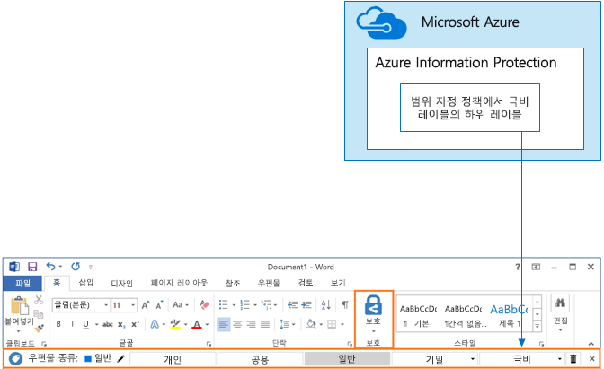

# SharePoint Online 사이트 및 파일 보호

 **요약:** SharePoint Online 및 Office 365에서 파일을 보호하기 위한 구성 권장 사항입니다.
  
이 문서에서는 SharePoint Online 팀 사이트 및 간편한 공동 작업으로 보안 균형을 조정하는 파일 보호를 구성하기 위한 권장 사항을 제공합니다. 그리고 가장 공개적인 공유 정책을 사용하여 조직 내에서 공용 사이트를 시작하는 별도의 네 가지 구성을 정의합니다. 각각의 추가 구성은 의미 있는 보호 단계를 나타내지만, 리소스에 대한 액세스 및 공동 작업 기능은 관련 사용자 집합으로 축소됩니다. 이러한 권장 사항에 기반하여 시작하고 조직의 요구 사항에 맞게 해당 구성을 조정합니다. 
  
이 문서의 구성은 데이터, ID 및 장치의 3계층 보호에 대한 Microsoft 권장 사항과 일치합니다.
  
- 초기 보호
    
- 중요 보호
    
- 극비 보호
    
이러한 계층 및 각 계층에 권장되는 기능에 대한 자세한 내용은 다음 리소스를 참조하세요. 
  
- [Office 365용 ID 및 장치 보호](https://docs.microsoft.com/office365/enterprise/microsoft-cloud-it-architecture-resources#BKMK_O365IDP)
    
- [Office 365의 파일 보호 솔루션](https://docs.microsoft.com/office365/enterprise/microsoft-cloud-it-architecture-resources#BKMK_O365fileprotect)
    
## 기능 개요

SharePoint Online 팀 사이트에 대한 권장 사항은 다양한 Office 365 기능을 활용합니다. 극비 사이트의 경우 Azure Information Protection을 사용하는 것이 좋습니다. 이는 EMS(Enterprise Mobility + Security)에 포함되어 있습니다. 
  
다음 그림은 4가지 SharePoint Online 팀 사이트에 권장되는 구성을 보여줍니다.

그림에서 보여 주듯이 다음과 같이 설명됩니다.
  
- 초기 보호에는 SharePoint Online 팀 사이트(공용 사이트 및 개인 사이트)에 대한 두 가지 옵션이 있습니다. 공용 사이트는 조직의 모든 사용자가 검색하고 액세스할 수 있습니다. 개인 사이트는 사이트의 구성원만 검색하고 액세스할 수 있습니다. 이 두 사이트 모두의 구성에서는 그룹 외부와의 공유를 허용합니다. 
    
- 중요한 기밀 보호의 대상이 되는 사이트는 특정 그룹의 구성원에게만 액세스가 제한되는 개인 사이트입니다.
    
- Office 365 레이블에서는 필요한 보호 수준을 사용하여 데이터를 분류하는 방법을 제공합니다. SharePoint Online 팀 사이트마다 사이트에 대한 기본 레이블을 통해 문서 라이브러리의 파일에 자동으로 레이블을 지정하도록 구성됩니다. 4가지 사이트 구성에 해당하는 이 예의 레이블은 내부 공용, 개인, 중요, 및 극비입니다. 사용자는 레이블을 변경할 수 있지만 이 구성은 모든 파일에서 기본 레이블을 받도록 합니다.
    
- 사용자가 조직 외부로 이러한 종류의 파일을 보내려고 할 때 경고하거나 방지하기 위해 중요 및 극비 Office 365 레이블에 대한 DLP(데이터 손실 방지) 정책이 구성됩니다.
    
- 시나리오에 필요한 경우 Azure Information Protection을 사용하여 극비 파일을 암호화하고 사용 권한을 부여할 수 있습니다. 이는 모든 고객에게 권장되지 않습니다.
    
## SharePoint Online 및 비즈니스용 OneDrive에 대한 테넌트 수준 설정

SharePoint Online 및 비즈니스용 OneDrive에는 모든 사이트 및 사용자에게 영향을 주는 테넌트 수준 설정이 포함됩니다. 또한 이러한 설정 중 일부는 사이트 수준에서 더 제한적으로 조정할 수 있지만 해당 제한을 완화할 수는 없습니다. 이 섹션에서는 보안 및 공동 작업에 영향을 주는 테넌트 수준 설정에 대해 설명합니다. 
  
### 공유

이 솔루션의 경우 다음과 같은 테넌트 수준 설정을 사용하는 것이 좋습니다.
  
- 익명 공유를 포함하여 모든 계정 유형과 공유할 수 있도록 허용하는 기본 공유 정책을 유지합니다.
    
- 필요한 경우 익명 연결이 만료되도록 설정합니다.
    
- 공유할 기본 연결 종류를 내부로 변경합니다. 이렇게 하면 실수로 데이터를 조직 외부로 누출하지 않도록 방지할 수 있습니다.
    
외부 공유를 허용하는 것이 반직관적일 수 있지만, 이 방법은 전자 메일로 파일을 보내는 것에 비해 파일 공유를 다 자세히 제어합니다. SharePoint Online과 Outlook은 함께 작동하여 파일에 대해 안전한 공동 작업을 제공합니다. 
  
- 기본적으로 Outlook은 전자 메일로 파일을 보내는 대신 파일에 대한 링크를 공유합니다. 
    
- SharePoint Online과 비즈니스용 OneDrive를 사용하면 조직 내부와 외부 모두의 참가자와 파일에 대한 링크를 쉽게 공유할 수 있습니다.
    
또한 외부 공유를 관리하는 데 도움이 되는 제어가 있습니다. 예를 들어, 다음을 수행할 수 있습니다.
  
- 익명 게스트 링크를 사용하지 않도록 설정합니다.
    
- 사이트에 대한 사용자 액세스를 취소합니다.
    
- 특정 사이트 또는 문서에 대한 액세스 권한이 있는 사용자인지 확인합니다.
    
- 익명 공유 링크 만료를 설정합니다(테넌트 설정).
    
- 조직 외부에서 공유할 수 있는 사용자를 제한합니다(테넌트 설정).
    
### DLP(데이터 손실 방지)와 함께 외부 공유 사용

외부 공유를 허용하지 않으면 비즈니스 요구 사항을 가지고 있는 사용자는 대체 도구 및 방법을 찾습니다. 중요한 기밀 파일을 보호하려면 외부 공유를 DLP 정책과 결합하는 것이 좋습니다.
  
### 장치 액세스 설정

SharePoint Online 및 비즈니스용 OneDrive에 대한 장치 액세스 설정을 통해 액세스가 브라우저에만 제한되는지(파일을 다운로드할 수 없는지) 또는 액세스가 차단되는지 여부를 결정할 수 있습니다. 이러한 설정은 현재 첫 번째 릴리스에 있으며 테넌트 전체에 적용됩니다. 사이트 수준의 장치 액세스 정책을 구성할 수 있는 기능은 곧 제공될 예정입니다. 이 솔루션의 경우 테넌트 전체에 적용되는 장치 액세스 설정을 사용하지 않는 것이 좋습니다.
  
첫 번째 릴리스에 있는 장치 액세스 설정을 사용하려면 [Office 365에서 표준 또는 첫 번째 릴리스 옵션을 설정](https://support.office.com/article/Set-up-the-Standard-or-First-Release-options-in-Office-365-3B3ADFA4-1777-4FF0-B606-FB8732101F47)합니다.
  
### 비즈니스용 OneDrive

이러한 설정을 방문하여 비즈니스용 OneDrive 사이트에 대한 기본 설정을 변경할지 여부를 결정합니다. 현재 공유 및 장치 액세스 설정은 SharePoint Online 관리 센터에서 복제되어 두 환경 모두에 적용됩니다.
  
## SharePoint 팀 사이트 구성

다음 표에서는 이 문서의 앞부분에서 설명한 팀 사이트 각각에 대한 구성을 요약하고 있습니다. 이러한 구성을 시작하기 위한 권장 사항으로 사용하고, 조직의 요구 사항에 맞게 사이트 유형 및 구성을 조정합니다. 모든 조직에 모든 유형의 사이트가 필요한 것은 아니며, 소수의 조직에만 극비 보호가 필요합니다.
  
||||||
|:-----|:-----|:-----|:-----|:-----|
||**초기 보호 #1**   |**초기 보호 #2**   |**중요 보호**   |**극비**   |
|설명    |조직 내에서 검색 및 공동 작업을 허용합니다.    |그룹 외부와의 공유가 허용되는 개인 사이트 및 그룹입니다.    |격리된 사이트이며, 액세스 수준이 특정 그룹의 구성원으로 정의됩니다. 사이트의 구성원에게만 공유가 허용됩니다. DLP에서 조직 외부로 파일을 보내려고 할 때 사용자에게 경고합니다.    |Azure Information Protection을 사용한 파일 암호화 및 권한 부여로 격리된 사이트입니다. DLP에서 사용자가 조직 외부로 파일을 보내지 못하도록 방지합니다.    |
|개인 또는 공용 팀 사이트    |Public    |개인    |개인    |개인    |
|액세스 가능한 사용자    |B2B 사용자 및 게스트 사용자를 포함한 조직의 모든 사용자    |사이트 구성원만 - 다른 사용자는 액세스를 요청할 수 있습니다.    |사이트 구성원만 - 다른 사용자는 액세스를 요청할 수 있습니다.    |구성원만 - 다른 사용자는 액세스를 요청할 수 없습니다.    |
|사이트 수준 공유 제어    |모든 사용자에게 공유가 허용됩니다. 기본 설정입니다.    |모든 사용자에게 공유가 허용됩니다. 기본 설정입니다.    |구성원은 사이트에 대한 액세스를 공유할 수 없습니다.    구성원이 아닌 사용자는 사이트에 대한 액세스를 요청할 수 있지만, 사이트 관리자가 이러한 요청을 처리해야 합니다.    |구성원은 사이트에 대한 액세스를 공유할 수 없습니다.    구성원이 아닌 사용자는 사이트 또는 콘텐츠에 대한 액세스를 요청할 수 없습니다.    |
|사이트 수준 장치 액세스 제어    |추가 제어가 없습니다.    |추가 제어가 없습니다.    |사이트 수준 제어가 곧 제공될 예정이며, 사용자는 비호환 또는 비도메인 가입 장치로 파일을 다운로드할 수 없습니다. 이렇게 하면 다른 모든 장치에서 브라우저 전용으로 액세스할 수 있습니다.    |파일을 비호환 또는 비도메인 가입 장치로 다운로드할 수 없도록 차단하는 사이트 수준 제어가 곧 제공될 예정입니다.    |
|Office 365 레이블    |내부 공용    |개인    |중요    |극비    |
|DLP 정책    |||레이블이 중요 계층으로 지정된 파일을 조직 외부로 보낼 때 사용자에게 경고합니다.    신용 카드 번호 또는 기타 개인 데이터와 같은 중요 데이터 형식의 외부 공유를 차단하기 위해 이러한 데이터 형식(구성한 사용자 지정 데이터 형식 포함)에 대한 추가 DLP 정책을 구성할 수 있습니다.    |사용자가 극비 계층으로 레이블이 지정된 파일을 외부 조직으로 보내지 못하도록 차단합니다. 사용자(파일을 공유하는 사용자 포함)는 근거를 제공하여 이 설정을 재정의할 수 있습니다.    |
|Azure Information Protection    ||||Azure Information Protection을 사용하여 파일에 대한 권한을 자동으로 암호화하고 부여합니다. 파일이 누출되는 경우 이러한 보호는 해당 파일과 함께 이동합니다.    Office 365는 Azure Information Protection으로 암호화된 파일을 읽을 수 없습니다. 또한 DLP 정책은 메타데이터(레이블 포함)에만 작동할 수 있지만 파일의 내용(예: 파일 내의 신용 카드 번호)에는 작동할 수 없습니다.    |
   
이 솔루션에 나오는 4가지 다른 SharePoint Online 팀 사이트 유형을 배포하는 단계를 보려면 [3계층의 보호를 위해 SharePoint Online 사이트 배포](deploy-sharepoint-online-sites-for-three-tiers-of-protection.md)를 참조하세요. 개발/테스트 환경을 만드는 단계를 보려면 [개발/테스트 환경의 보안 SharePoint Online 사이트](secure-sharepoint-online-sites-in-a-dev-test-environment.md)를 참조하세요. 
  
## Office 365 분류 및 레이블

중요 데이터가 있는 환경에서는 Office 365 레이블을 사용하는 것이 좋습니다. Office 365 레이블을 구성하고 게시한 후에는 다음을 수행할 수 있습니다.
  
- SharePoint Online 팀 사이트의 문서 라이브러리에 기본 레이블을 적용하여 해당 라이브러리의 모든 문서에서 기본 레이블을 사용하도록 할 수 있습니다. 
    
- 특정 조건과 일치하는 경우 콘텐츠에 레이블을 자동으로 적용할 수 있습니다.
    
- Office 365 레이블을 기준으로 하는 DLP 정책을 적용할 수 있습니다.
    
- 조직의 사용자가 웹용 Outlook, Outlook 2010 이상, 비즈니스용 OneDrive, SharePoint Online 및 Office 365 그룹에서 콘텐츠에 레이블을 수동으로 적용할 수 있습니다. 사용자는 종종 자신이 사용하고 있는 콘텐츠의 형식을 가장 잘 알고 있기 때문에 콘텐츠를 분류하여 적절한 DLP 정책을 적용할 수 있습니다.
    

  
그림에서 보여 주듯이 이 솔루션에는 다음과 같은 레이블 만들기가 포함됩니다.
  
- 극비
    
- 중요
    
- 개인
    
- 내부 공용
    
이러한 레이블은 이 문서의 앞부분에 있는 그림과 차트에서 권장된 사이트와 매핑됩니다. 이 솔루션에서 DLP 정책을 구성하여 중요 및 극비 레이블이 지정된 파일을 유출하지 못하도록 방지하는 것이 좋습니다.
  
이 솔루션에서 Office 365 레이블 및 DLP 정책을 구성하는 단계는 [Office 365 레이블 및 DLP(데이터 손실 방지)를 사용하여 SharePoint Online 파일 보호](protect-sharepoint-online-files-with-office-365-labels-and-dlp.md)를 참조하세요.
  
## Azure Information Protection

보안 시나리오가 필요하다면 Azure Information Protection을 사용하여 어디서나 파일과 동반하는 레이블과 보호를 적용할 수 있습니다. Azure Information Protection 레이블은 Office 365 레이블과 다릅니다. 이 솔루션의 경우 Azure Information Protection 범위 지정 정책 및 극비 레이블의 하위 레이블을 사용하여 최고 수준의 보안으로 보호해야 하는 파일에 대한 권한을 암호화하고 부여하는 것이 좋습니다. 
  
Office 365에 저장된 파일에 Azure Information Protection 암호화가 적용되어 있으면 이 파일의 내용을 처리할 수 없습니다. 즉 공동 작성, eDiscovery, 검색, Delve 및 기타 공동 작업 기능이 작동하지 않습니다. DLP 정책은 메타데이터(Office 365 레이블 포함)에만 작동할 수 있지만 파일의 내용(예: 파일 내의 신용 카드 번호)에는 작동할 수 없습니다.
  

  
그림에서 보여 주듯이 다음과 같이 설명됩니다.
  
- Microsoft Azure Portal에서 Azure Information Protection 정책 및 레이블을 구성합니다. 범위 지정 Azure Information Protection 정책의 하위 레이블을 구성하는 것이 좋습니다.
    
- Azure Information Protection 레이블은 Office 응용 프로그램에서 **Information Protection** 표시줄로 표시됩니다.
    
### 외부 사용자에 대한 권한 추가

Azure Information Protection으로 보호된 파일에 대한 액세스 권한을 외부 사용자에게 부여할 수 있는 두 가지 방법이 있습니다. 이 두 가지 방법에서는 모두 Azure AD 계정이 외부 사용자에게 있어야 합니다. 외부 사용자가 Azure AD를 사용하는 조직의 구성원이 아닌 경우 [https://aka.ms/aip-signup](https://aka.ms/aip-signup) 등록 페이지를 사용하여 Azure AD 계정을 개별로 가져올 수 있습니다.
  
- 레이블 보호를 구성하는 데 사용되는 외부 사용자를 Azure AD 그룹에 추가
    
     먼저 계정을 디렉터리에 B2B 사용자로 추가해야 합니다. [Azure Rights Management에서 그룹 구성원 자격을 캐시](https://docs.microsoft.com/information-protection/plan-design/prepare#group-membership-caching-by-azure-rights-management)하는 데 몇 시간이 걸릴 수 있습니다. 이 방법을 사용하면 레이블로 보호된 기존의 모든 파일(사용자가 Azure AD 그룹에 추가되기 전에 보호된 파일도 포함)에 대한 권한이 부여됩니다.
    
- 외부 사용자를 레이블 보호에 직접 추가
    
     조직(예: Fabrikam.com), Azure AD 그룹(조직 내의 재무 그룹) 또는 개별 사용자의 모든 사용자를 추가할 수 있습니다. 예를 들어 조절기의 외부 팀을 레이블 보호에 추가할 수 있습니다. 이 방법을 사용하면 외부 엔터티가 보호에 추가된 후 레이블로 보호된 파일에 대한 권한만 부여됩니다.
    
### Azure Information Protection 배포 및 사용

이 솔루션에서 Azure Information Protection을 구성하는 단계는 [Azure Information Protection을 사용하여 SharePoint Online 파일 보호](protect-sharepoint-online-files-with-azure-information-protection.md)를 참조하세요.
  
## 참고 항목

[정치적 캠페인, 비영리 조직 및 기타 기밀 조직에 대한 Microsoft 보안 지침](microsoft-security-guidance-for-political-campaigns-nonprofits-and-other-agile-o.md)
  
[클라우드 도입 및 하이브리드 솔루션](https://docs.microsoft.com/office365/enterprise/cloud-adoption-and-hybrid-solutions)
  
[개발/테스트 환경의 보안 SharePoint Online 사이트](secure-sharepoint-online-sites-in-a-dev-test-environment.md)

