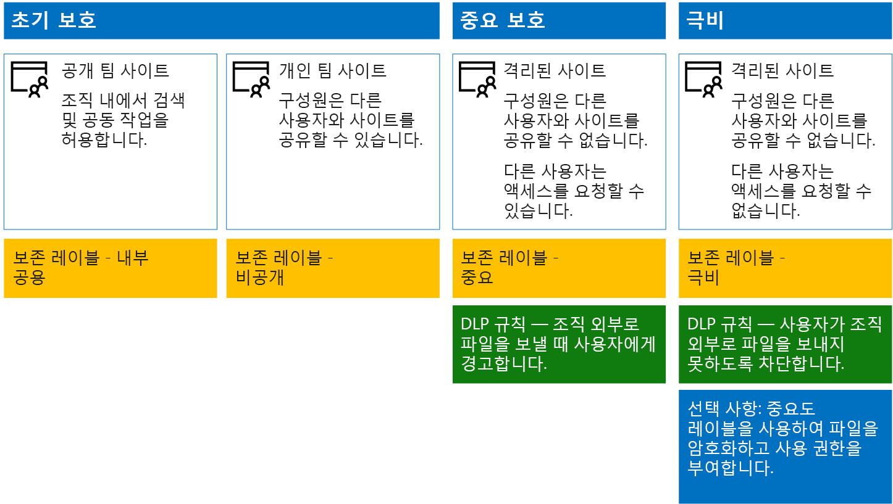
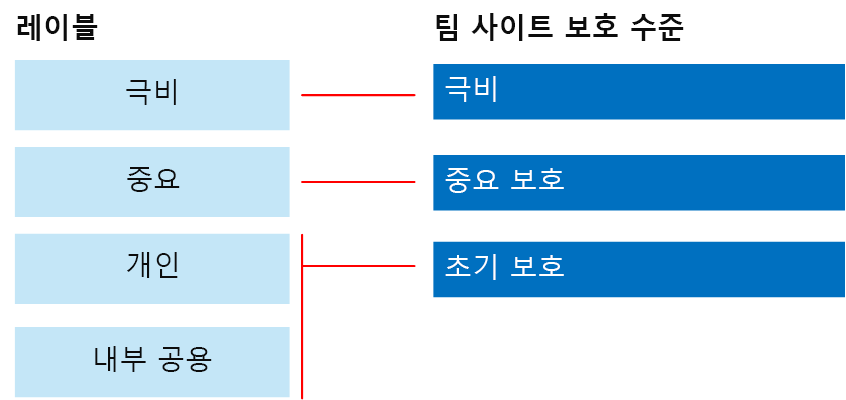

# SharePoint Online 사이트 및 파일 보호Secure SharePoint Online sites and files

 **요약:** SharePoint Online 및 Office 365에서 파일을 보호하기 위한 구성 권장 사항입니다.**Summary:** Configuration recommendations for protecting files in SharePoint Online and Office 365.
  
이 문서에서는 SharePoint Online 팀 사이트 및 간편한 공동 작업으로 보안 균형을 조정하는 파일 보호를 구성하기 위한 권장 사항을 제공합니다. 그리고 가장 공개적인 공유 정책을 사용하여 조직 내에서 공용 사이트를 시작하는 별도의 네 가지 구성을 정의합니다. 각각의 추가 구성은 의미 있는 보호 단계를 나타내지만, 리소스에 대한 액세스 및 공동 작업 기능은 관련 사용자 집합으로 축소됩니다. 이러한 권장 사항에 기반하여 시작하고 조직의 요구 사항에 맞게 해당 구성을 조정합니다.This article provides recommendations for configuring SharePoint Online team sites and file protection that balances security with ease of collaboration. This article defines four different configurations, starting with a public site within your organization with the most open sharing policies. Each additional configuration represents a meaningful step up in protection, but the ability to access and collaborate on resources is reduced to the relevant set of users. Use these recommendations as a starting point and adjust the configurations to meet the needs of your organization. 
  
이 문서의 구성은 데이터, ID 및 장치의 3계층 보호에 대한 Microsoft 권장 사항과 일치합니다.The configurations in this article align with Microsoft's recommendations for three tiers of protection for data, identities, and devices:
  
- 초기 보호Baseline protection
    
- 중요 보호Sensitive protection
    
- 극비 보호Highly confidential protection
    
이러한 계층 및 각 계층에 권장되는 기능에 대한 자세한 내용은 다음 리소스를 참조하세요.For more information about these tiers and capabilities recommended for each tier, see the following resources. 
  
- [Office 365용 ID 및 장치 보호Identity and Device Protection for Office 365](https://docs.microsoft.com/office365/enterprise/microsoft-cloud-it-architecture-resources#BKMK_O365IDP)
    
- [Office 365의 파일 보호 솔루션File Protection Solutions in Office 365](https://docs.microsoft.com/office365/enterprise/microsoft-cloud-it-architecture-resources#BKMK_O365fileprotect)
    
## 기능 개요Capability overview

SharePoint Online 팀 사이트에 대한 권장 사항은 다양한 Microsoft 365 기능을 활용합니다.Recommendations for SharePoint Online team sites draw on a variety of Microsoft 365 capabilities. 다음 그림은 4가지 SharePoint Online 팀 사이트에 권장되는 구성을 보여줍니다.The following illustration shows the recommended configurations for four SharePoint Online team sites.

그림에서 보여 주듯이 다음과 같이 설명됩니다.As illustrated:
  
- 초기 보호에는 SharePoint Online 팀 사이트(공용 사이트 및 개인 사이트)에 대한 두 가지 옵션이 있습니다. 공용 사이트는 조직의 모든 사용자가 검색하고 액세스할 수 있습니다. 개인 사이트는 사이트의 구성원만 검색하고 액세스할 수 있습니다. 이 두 사이트 모두의 구성에서는 그룹 외부와의 공유를 허용합니다.Baseline protection includes two options for SharePoint Online team sites — a public site and private site. Public sites can be discovered and accessed by anybody in the organization. Private sites can only be discovered and accessed by members of the site. Both of these site configurations allow for sharing outside the group. 
    
- 중요한 기밀 보호의 대상이 되는 사이트는 특정 그룹의 구성원에게만 액세스가 제한되는 개인 사이트입니다.Sites for sensitive and highly confidential protection are private sites with access limited only to members of specific groups.
    
- [보존 레이블](labels.md)은 사이트 내의 파일을 분류하는 방법을 제시합니다.[Retention labels](labels.md) provide a way to classify files within the sites. SharePoint Online 팀 사이트마다 사이트에 대한 기본 보존 레이블을 통해 문서 라이브러리의 파일에 자동으로 레이블을 지정하도록 구성됩니다.Each of the SharePoint Online team sites are configured to automatically label files in document libraries with a default retention label for the site. 4가지 사이트 구성에 해당하는 이 예의 레이블은 내부 공용, 개인, 중요, 및 극비입니다.Corresponding to the four site configurations, the labels in this example are Internal Public, Private, Sensitive, and Highly Confidential. 사용자는 레이블을 변경할 수 있지만 이 구성은 모든 파일에서 기본 레이블을 받도록 합니다.Users can change the labels, but this configuration ensures all files receive a default label.
    
- 사용자가 조직 외부로 이러한 종류의 파일을 보내려고 할 때 경고하거나 방지하기 위해 중요 및 극비 보존 레이블에 대한 [데이터 손실 방지](data-loss-prevention-policies.md)(DLP) 정책이 구성됩니다.[Data loss prevention](data-loss-prevention-policies.md) (DLP) policies are configured for the Sensitive and Highly Confidential retention labels to either warn or prevent users when they attempt to send these types of files outside the organization.
    
- 시나리오에 필요한 경우 [민감도 레이블](sensitivity-labels.md)을 사용하여 기밀성이 높은 파일을 암호화 및 사용 권한으로 보호할 수 있습니다.If needed for your scenario, you can use [sensitivity labels](sensitivity-labels.md) to protect highly confidential files with encryption and permissions. Azure Information Protection 고객의 경우 Microsoft 365 준수 센터에서 Azure Information Protection 레이블을 사용할 수 있으며 추가 또는 고급 구성을 수행하기로 선택한 경우 레이블이 Azure 포털과 동기화됩니다.For Azure Information Protection customers, you can use your Azure Information Protection labels in the Microsoft 365 compliance center, and your labels will be synced with the Azure portal in case you choose to perform additional or advanced configuration. Azure Information Protection 레이블과 Office 365 민감도 레이블은 서로 완벽하게 호환됩니다.Azure Information Protection labels and Office 365 sensitivity labels are fully compatible with each other. 예를 들어, Azure Information Protection으로 분류된 콘텐츠가 있는 경우 콘텐츠를 재 분류하거나 레이블을 다시 지정할 필요가 없습니다. 모든 고객에게 이러한 수준의 보호가 필요하지 않습니다.This means, for example, if you have content labeled by Azure Information Protection, you won’t need to reclassify or relabel your content.Not all customers need this level of protection. 
    
## SharePoint Online 및 비즈니스용 OneDrive에 대한 테넌트 수준 설정Tenant-wide settings for SharePoint Online and OneDrive for Business

SharePoint Online 및 비즈니스용 OneDrive에는 모든 사이트 및 사용자에게 영향을 주는 테넌트 수준 설정이 포함됩니다. 또한 이러한 설정 중 일부는 사이트 수준에서 더 제한적으로 조정할 수 있지만 해당 제한을 완화할 수는 없습니다. 이 섹션에서는 보안 및 공동 작업에 영향을 주는 테넌트 수준 설정에 대해 설명합니다.SharePoint Online and OneDrive for Business include tenant-wide settings that affect all sites and users. Some of these settings can also be adjusted at the site level to be more restrictive (but not less). This section discusses tenant-wide settings that affect security and collaboration. 
  
### 공유Sharing

이 솔루션의 경우 다음과 같은 테넌트 수준 설정을 사용하는 것이 좋습니다.For this solution, we recommend the following tenant-wide settings:
  
- 익명 공유를 포함하여 모든 계정 유형과 공유할 수 있도록 허용하는 기본 공유 정책을 유지합니다.Keep the default sharing policy that allows all sharing with all account types, including anonymous sharing.
    
- 필요한 경우 익명 연결이 만료되도록 설정합니다.Set anonymous links to expire, if desired.
    
- 공유할 기본 연결 종류를 내부로 변경합니다. 이렇게 하면 실수로 데이터를 조직 외부로 누출하지 않도록 방지할 수 있습니다.Change the default link type for sharing to Internal. This helps prevent accidental data leakage outside your organization.
    
외부 공유를 허용하는 것이 반직관적일 수 있지만, 이 방법은 전자 메일로 파일을 보내는 것에 비해 파일 공유를 다 자세히 제어합니다. SharePoint Online과 Outlook은 함께 작동하여 파일에 대해 안전한 공동 작업을 제공합니다.While it might seem counterintuitive to allow external sharing, this approach provides more control over file sharing compared to sending files in email. SharePoint Online and Outlook work together to provide secure collaboration on files. 
  
- 기본적으로 Outlook은 전자 메일로 파일을 보내는 대신 파일에 대한 링크를 공유합니다.By default, Outlook shares a link to a file instead of sending the file in email. 
    
- SharePoint Online과 비즈니스용 OneDrive를 사용하면 조직 내부와 외부 모두의 참가자와 파일에 대한 링크를 쉽게 공유할 수 있습니다.SharePoint Online and OneDrive for Business make it easy to share links to files with contributors who are both inside and outside your organization
    
또한 외부 공유를 관리하는 데 도움이 되는 제어가 있습니다. 예를 들어, 다음을 수행할 수 있습니다.You also have controls to help govern external sharing. For example, you can:
  
- 익명 게스트 링크를 사용하지 않도록 설정합니다.Disable an anonymous guest link.
    
- 사이트에 대한 사용자 액세스를 취소합니다.Revoke user access to a site.
    
- 특정 사이트 또는 문서에 대한 액세스 권한이 있는 사용자인지 확인합니다.See who has access to a specific site or document.
    
- 익명 공유 링크 만료를 설정합니다(테넌트 설정).Set anonymous sharing links to expire (tenant setting).
    
- 조직 외부에서 공유할 수 있는 사용자를 제한합니다(테넌트 설정).Limit who can share outside your organization (tenant setting).
    
### DLP(데이터 손실 방지)와 함께 외부 공유 사용Use external sharing together with data loss prevention (DLP)

외부 공유를 허용하지 않으면 비즈니스 요구 사항을 가지고 있는 사용자는 대체 도구 및 방법을 찾습니다. 중요한 기밀 파일을 보호하려면 외부 공유를 DLP 정책과 결합하는 것이 좋습니다.If you don't allow external sharing, users with a business need will find alternate tools and methods. Microsoft recommends you combine external sharing with DLP policies to protect sensitive and highly confidential files.
  
### 장치 액세스 설정Device access settings

SharePoint Online 및 비즈니스용 OneDrive에 대한 장치 액세스 설정을 통해 액세스가 브라우저에만 제한되는지(파일을 다운로드할 수 없는지) 또는 액세스가 차단되는지 여부를 결정할 수 있습니다.Device access settings for SharePoint Online and OneDrive for Business let you determine whether access is limited to browser only (files can't be downloaded) or if access is blocked. 자세한 내용은 [관리되지 않는 장치에서의 액세스 제어](https://docs.microsoft.com/ko-KR/sharepoint/control-access-from-unmanaged-devices)를 참조하세요.For more information, see [Control access from unmanaged devices](https://docs.microsoft.com/ko-KR/sharepoint/control-access-from-unmanaged-devices). 

Azure Active Directory에서 권장된 조건부 액세스 정책을 사용하여 장치 액세스 설정을 사용하려면 [SharePoint 사이트 및 파일 보호을 위한 정책 권장 사항](https://docs.microsoft.com/ko-KR/microsoft-365/enterprise/sharepoint-file-access-policies)을 참조하십시오.To use device access settings with recommended conditional access policies in Azure Active Directory, see [Policy recommendations for securing SharePoint sites and files](https://docs.microsoft.com/ko-KR/microsoft-365/enterprise/sharepoint-file-access-policies).
  
### 비즈니스용 OneDriveOneDrive for Business

이러한 설정을 방문하여 비즈니스용 OneDrive 사이트에 대한 기본 설정을 변경할지 여부를 결정합니다. 현재 공유 및 장치 액세스 설정은 SharePoint Online 관리 센터에서 복제되어 두 환경 모두에 적용됩니다.Visit these settings to decide if you want to change the default settings for OneDrive for Business sites. Currently, the sharing and device access settings are duplicated from the SharePoint Online admin center and apply to both environments.
  
## SharePoint 팀 사이트 구성SharePoint team site configuration

다음 표에서는 이 문서의 앞부분에서 설명한 팀 사이트 각각에 대한 구성을 요약하고 있습니다. 이러한 구성을 시작하기 위한 권장 사항으로 사용하고, 조직의 요구 사항에 맞게 사이트 유형 및 구성을 조정합니다. 모든 조직에 모든 유형의 사이트가 필요한 것은 아니며, 소수의 조직에만 극비 보호가 필요합니다.The following table summarizes the configuration for each of the team sites described earlier in this article. Use these configurations as starting point recommendations and adjust the site types and configurations to meet the needs of your organization. Not every organization needs every type of site. Only a small number of organizations require highly confidential protection.
  
||||||
|:-----|:-----|:-----|:-----|:-----|
||**초기 보호 #1****Baseline protection #1**   |**초기 보호 #2****Baseline protection #2**   |**중요 보호****Sensitive protection**   |**극비****Highly confidential**   |
|설명Description    |조직 내에서 검색 및 공동 작업을 허용합니다.Open discovery and collaboration within the organization.    |그룹 외부와의 공유가 허용되는 개인 사이트 및 그룹입니다.Private site and group with sharing allowed outside the group.    |격리된 사이트이며, 액세스 수준이 특정 그룹의 구성원으로 정의됩니다. 사이트의 구성원에게만 공유가 허용됩니다. DLP에서 조직 외부로 파일을 보내려고 할 때 사용자에게 경고합니다.Isolated site, in which levels of access are defined by membership in specific groups. Sharing is only allowed to members of the site. DLP warns users when attempting to send files outside the organization.    |Azure Information Protection을 사용한 파일 암호화 및 권한 부여로 격리된 사이트입니다. DLP에서 사용자가 조직 외부로 파일을 보내지 못하도록 방지합니다.Isolated site + file encryption and permissions with Azure Information Protection. DLP prevents users from sending files outside the organization.    |
|개인 또는 공용 팀 사이트Private or public team site    |PublicPublic    |개인Private    |개인Private    |개인Private    |
|액세스 가능한 사용자Who has access?    |B2B 사용자 및 게스트 사용자를 포함한 조직의 모든 사용자Everybody in the organization, including B2B users and guest users.    |사이트 구성원만 - 다른 사용자는 액세스를 요청할 수 있습니다.Members of the site only. Others can request access.    |사이트 구성원만 - 다른 사용자는 액세스를 요청할 수 있습니다.Members of the site only. Others can request access.    |구성원만 - 다른 사용자는 액세스를 요청할 수 없습니다.Members only. Others cannot request access.    |
|사이트 수준 공유 제어Site-level sharing controls    |모든 사용자에게 공유가 허용됩니다. 기본 설정입니다.Sharing allowed with anybody. Default settings.    |모든 사용자에게 공유가 허용됩니다. 기본 설정입니다.Sharing allowed with anybody. Default settings.    |구성원은 사이트에 대한 액세스를 공유할 수 없습니다.Members cannot share access to the site.    구성원이 아닌 사용자는 사이트에 대한 액세스를 요청할 수 있지만, 사이트 관리자가 이러한 요청을 처리해야 합니다.Non-members can request access to the site, but these requests need to be addressed by a site administrator.    |구성원은 사이트에 대한 액세스를 공유할 수 없습니다.Members cannot share access to the site.    구성원이 아닌 사용자는 사이트 또는 콘텐츠에 대한 액세스를 요청할 수 없습니다.Non-members cannot request access to the site or contents.    |
|사이트 수준 장치 액세스 제어Site-level device access controls    |추가 제어가 없습니다.No additional controls.    |추가 제어가 없습니다.No additional controls.    |사용자는 비호환 또는 비도메인 가입 장치로 파일을 다운로드할 수 없습니다. 이렇게 하면 다른 모든 장치에서 브라우저 전용으로 액세스할 수 있습니다.Site-level controls are coming soon, which prevents users from downloading files to non-compliant or non-domain joined devices. This allows browser-only access from all other devices.    |호환되지 않거나 도메인에 가입되지 않은 장치로의 파일 다운로드를 차단합니다.Site-level controls are coming soon, which blocks downloading of files to non-compliant or non-domain joined devices.    |
|보존 레이블Retention labels    |내부 공용Internal Public    |개인Private    |중요Sensitive    |극비Highly Confidential    |
|DLP 정책DLP policies    |||레이블이 중요 계층으로 지정된 파일을 조직 외부로 보낼 때 사용자에게 경고합니다.Warn users when sending files that are labeled as Sensitive outside the organization.    신용 카드 번호 또는 기타 개인 데이터와 같은 중요 데이터 형식의 외부 공유를 차단하기 위해 이러한 데이터 형식(구성한 사용자 지정 데이터 형식 포함)에 대한 추가 DLP 정책을 구성할 수 있습니다.To block external sharing of sensitive data types, such as credit card numbers or other personal data, you can configure additional DLP policies for these data types (including custom data types you configure).    |사용자가 극비 계층으로 레이블이 지정된 파일을 외부 조직으로 보내지 못하도록 차단합니다. 사용자(파일을 공유하는 사용자 포함)는 근거를 제공하여 이 설정을 재정의할 수 있습니다.Block users from sending files that are labeled as highly confidential outside organization. Allow users to override this by providing justification, including who they are sharing the file with.    |
|민감도 레이블Sensitivity labels    ||||민감도 레이블을 사용하여 파일에 대한 권한을 자동으로 암호화하고 부여합니다.Use sensitivity labels to automatically encrypt and grant permissions to files. 민감도 레이블을 사용하여 파일을 암호화Sensitivity labels use Azure Information Protection to encrypt files. 파일이 누출되는 경우 이러한 보호는 해당 파일과 함께 이동합니다.This protection travels with the files in case they are leaked.    Office 365는 Azure Information Protection으로 암호화된 파일을 읽을 수 없습니다. 또한 DLP 정책은 메타데이터(레이블 포함)에만 작동할 수 있지만 파일의 내용(예: 파일 내의 신용 카드 번호)에는 작동할 수 없습니다.Office 365 cannot read files encrypted with Azure Information Protection. Additionally, DLP policies can only work with the metadata (including labels) but not the contents of these files (such as credit card numbers within files).    |
   
네 가지 유형의 SharePoint Online 팀 사이트를 이 솔루션에 배포하는 단계는 [3계층 보호를 위한 SharePoint Online 사이트 배포](deploy-sharepoint-online-sites-for-three-tiers-of-protection.md)를 참조하세요.For the steps to deploy the four different types of SharePoint Online team sites in this solution, see [Deploy SharePoint Online sites for three tiers of protection](deploy-sharepoint-online-sites-for-three-tiers-of-protection.md). For the steps to create a dev/test environment, see Secure SharePoint Online sites in a dev/test environment. 
  
## Office 365 보존 레이블Office 365 retention labels

중요 데이터가 있는 환경에서는 보존 레이블을 사용하는 것이 좋습니다.Using retention labels is recommended for environments with sensitive data. 보존 레이블을 구성하고 게시한 후 다음 작업을 수행할 수 있습니다.After you configure and publish retention labels:
  
- SharePoint Online 팀 사이트의 문서 라이브러리에 기본 레이블을 적용하여 해당 라이브러리의 모든 문서에서 기본 레이블을 사용하도록 할 수 있습니다.You can apply a default label to a document library in a SharePoint Online team site, so that all documents in that library get the default label. 
    
- 특정 조건과 일치하는 경우 콘텐츠에 레이블을 자동으로 적용할 수 있습니다.You can apply labels to content automatically if it matches specific conditions.
    
- 보존 레이블을 기준으로 하는 DLP 정책을 적용할 수 있습니다.You can apply DLP policies that are based on retention labels.
    
- 조직의 사용자가 웹용 Outlook, Outlook 2010 이상, 비즈니스용 OneDrive, SharePoint Online 및 Office 365 그룹에서 콘텐츠에 레이블을 수동으로 적용할 수 있습니다. 사용자는 종종 자신이 사용하고 있는 콘텐츠의 형식을 가장 잘 알고 있기 때문에 콘텐츠를 분류하여 적절한 DLP 정책을 적용할 수 있습니다.People in your organization can apply a label manually to content in Outlook on the web, Outlook 2010 and later, OneDrive for Business, SharePoint Online, and Office 365 groups. Users often know best what type of content they're working with, so they can classify it and have the appropriate DLP policy applied.
    

  
그림에서 보여 주듯이 이 솔루션에는 다음과 같은 보존 레이블 만들기가 포함됩니다.As illustrated, this solution includes creating the following retention labels:
  
- 극비Highly Confidential
    
- 중요Sensitive
    
- 개인Private
    
- 내부 공용Internal Public
    
이러한 레이블은 이 문서의 앞부분에 있는 그림과 차트에서 권장된 사이트와 매핑됩니다. 이 솔루션에서 DLP 정책을 구성하여 중요 및 극비 레이블이 지정된 파일을 유출하지 못하도록 방지하는 것이 좋습니다.These labels are mapped to the recommended sites in the illustrations and charts earlier in this article. This solution recommends configuring DLP policies to help prevent the leakage of files labeled as Sensitive and Highly Confidential.
  
이 솔루션에서 보존 레이블 및 DLP 정책을 구성하는 단계는 [보존 레이블 및 DLP(데이터 손실 방지)를 사용하여 SharePoint Online 파일 보호](protect-sharepoint-online-files-with-office-365-labels-and-dlp.md)를 참조하세요.For the steps to configure retention labels and DLP policies in this solution, see [Protect SharePoint Online files with retention labels and DLP](protect-sharepoint-online-files-with-office-365-labels-and-dlp.md).
  
## 민감도 레이블Sensitivity labels 

보안 시나리오에 적합한 경우 민감도 레이블을 사용하여 항상 파일에 수반되는 보호 기능을 적용할 수 있습니다.If warranted for your security scenario, you can use sensitivity labels to apply protections that follow the files wherever they go. Microsoft 365 규정 준수 센터의 민감도 레이블과 Azure Information Protection 레이블은 동일합니다.Sensitivity labels in the Microsoft 365 compliance center and Azure Information Protection labels are the same. 이 솔루션의 경우 Azure Information Protection 범위 지정 정책 및 극비 레이블의 하위 레이블을 사용하여 최고 수준의 보안으로 보호해야 하는 파일에 대한 권한을 암호화하고 부여하는 것이 좋습니다.For this solution, we recommend you use a scoped Azure Information Protection policy and a sub-label of the Highly Confidential label to encrypt and grant permissions to files that need to be protected with the highest level of security. 
  
Office 365에 저장된 파일에 Azure Information Protection 암호화가 적용되어 있으면 이 파일의 내용을 처리할 수 없습니다.Be aware that when Azure Information Protection encryption is applied to files stored in Office 365, the service cannot process the contents of these files. 즉 공동 작성, eDiscovery, 검색, Delve 및 기타 공동 작업 기능이 작동하지 않습니다.Co-authoring, eDiscovery, search, Delve, and other collaborative features do not work. DLP 정책은 메타데이터(보존 레이블 포함)에만 작동할 수 있지만 파일의 내용(예: 파일 내의 신용 카드 번호)에는 작동할 수 없습니다.DLP policies can only work with the metadata (including retention labels) but not the contents of these files (such as credit card numbers within files).

자세한 내용은 [민감도 레이블 개요](sensitivity-labels.md)를 참조하세요.For more information, see [Overview of sensitivity labels](sensitivity-labels.md).

    
### 외부 사용자에 대한 권한 추가Adding permissions for external users

Azure Information Protection으로 보호된 파일에 대한 액세스 권한을 외부 사용자에게 부여할 수 있는 두 가지 방법이 있습니다. 이 두 가지 방법에서는 모두 Azure AD 계정이 외부 사용자에게 있어야 합니다. 외부 사용자가 Azure AD를 사용하는 조직의 구성원이 아닌 경우 [https://aka.ms/aip-signup](https://aka.ms/aip-signup) 등록 페이지를 사용하여 Azure AD 계정을 개별로 가져올 수 있습니다.There are two ways you can grant external users access to files protected with Azure Information Protection. In both these cases, external users must have an Azure AD account. If external users aren't members of an organization that uses Azure AD, they can obtain an Azure AD account as an individual by using this sign-up page: [https://aka.ms/aip-signup](https://aka.ms/aip-signup).
  
- 레이블 보호를 구성하는 데 사용되는 외부 사용자를 Azure AD 그룹에 추가Add external users to an Azure AD group that is used to configure protection for a label
    
     먼저 계정을 디렉터리에 B2B 사용자로 추가해야 합니다. [Azure Rights Management에서 그룹 구성원 자격을 캐시](https://docs.microsoft.com/information-protection/plan-design/prepare#group-membership-caching-by-azure-rights-management)하는 데 몇 시간이 걸릴 수 있습니다. 이 방법을 사용하면 레이블로 보호된 기존의 모든 파일(사용자가 Azure AD 그룹에 추가되기 전에 보호된 파일도 포함)에 대한 권한이 부여됩니다.You'll need to first add the account as a B2B user in your directory. It can take a couple of hours for [group membership caching by Azure Rights Management](https://docs.microsoft.com/information-protection/plan-design/prepare#group-membership-caching-by-azure-rights-management). With this method, permissions are granted to all existing files protected with the label (even files protected before a user is added to the Azure AD group).
    
- 외부 사용자를 레이블 보호에 직접 추가Add external users directly to the label protection
    
     조직(예: Fabrikam.com), Azure AD 그룹(조직 내의 재무 그룹) 또는 개별 사용자의 모든 사용자를 추가할 수 있습니다. 예를 들어 조절기의 외부 팀을 레이블 보호에 추가할 수 있습니다. 이 방법을 사용하면 외부 엔터티가 보호에 추가된 후 레이블로 보호된 파일에 대한 권한만 부여됩니다.You can add all users from an organization (e.g. Fabrikam.com), an Azure AD group (such as a finance group within an organization), or an individual user. For example, you can add an external team of regulators to the protection for a label. With this method, permissions are granted only to files protected with the label after the external entity is added to the protection.
    
### Azure Information Protection 배포 및 사용Deploying and using Azure Information Protection

이 솔루션에서 Azure Information Protection을 구성하는 단계는 [Azure Information Protection을 사용하여 SharePoint Online 파일 보호](protect-sharepoint-online-files-with-azure-information-protection.md)를 참조하세요.For the steps to configure Azure Information Protection in this solution, see [Protect SharePoint Online files with Azure Information Protection](protect-sharepoint-online-files-with-azure-information-protection.md).
  
## 참고 항목See Also

[정치적 캠페인, 비영리 조직 및 기타 기밀 조직에 대한 Microsoft 보안 지침Microsoft Security Guidance for Political Campaigns, Nonprofits, and Other Agile Organizations](microsoft-security-guidance-for-political-campaigns-nonprofits-and-other-agile-o.md)
  
[클라우드 도입 및 하이브리드 솔루션Cloud adoption and hybrid solutions](https://docs.microsoft.com/office365/enterprise/cloud-adoption-and-hybrid-solutions)
  
