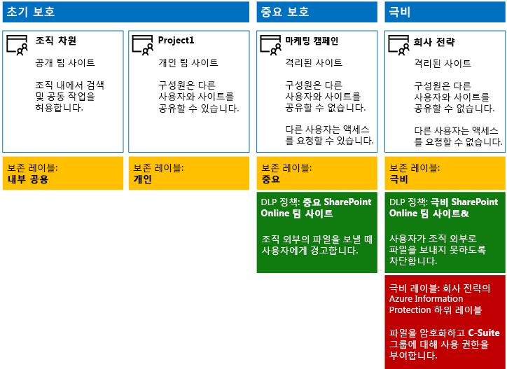
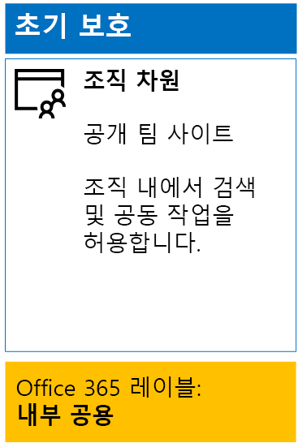
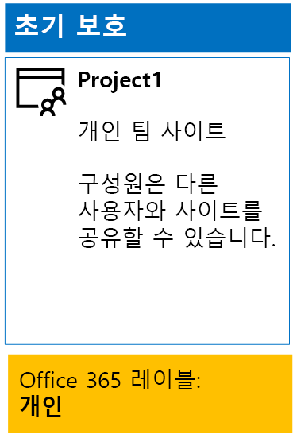
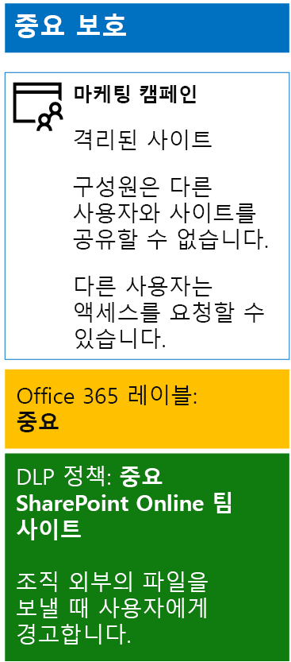
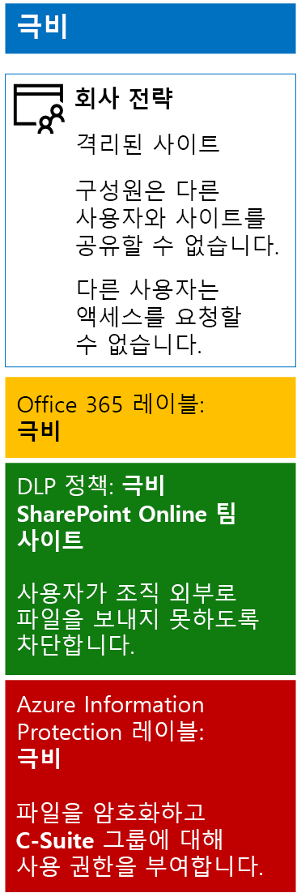

# <a name="secure-sharepoint-online-sites-in-a-devtest-environment"></a><span data-ttu-id="2875a-103">개발/테스트 환경의 SharePoint Online 사이트 보호</span><span class="sxs-lookup"><span data-stu-id="2875a-103">Secure SharePoint Online sites in a dev/test environment</span></span>

 <span data-ttu-id="2875a-104">**요약:** 개발/테스트 환경에서 공용, 개인, 중요 및 극비 SharePoint Online 팀 사이트를 만듭니다.</span><span class="sxs-lookup"><span data-stu-id="2875a-104">**Summary:** Create public, private, sensitive, and highly confidential SharePoint Online team sites in a dev/test environment.</span></span>
  
<span data-ttu-id="2875a-105">이 문서에서는 [SharePoint Online 사이트 및 파일 보호 솔루션](secure-sharepoint-online-sites-and-files.md)에 대한 네 가지 유형의 SharePoint Online 팀 사이트를 포함하는 개발/테스트 환경을 만드는 단계별 지침을 제공합니다.</span><span class="sxs-lookup"><span data-stu-id="2875a-105">This article provides step-by-step instructions to create a dev/test environment that includes the four different types of SharePoint Online team sites for the [Secure SharePoint Online sites and files](secure-sharepoint-online-sites-and-files.md) solution.</span></span>
  

  
<span data-ttu-id="2875a-107">이 개발/테스트 환경을 사용하여 프로덕션 환경에 SharePoint Online 팀 사이트를 배포하기 전에 정보 보호 동작을 실험하고 특정 요구 사항에 맞게 설정을 자세히 조정합니다.</span><span class="sxs-lookup"><span data-stu-id="2875a-107">Use this dev/test environment to experiment with the information protection behaviors and fine-tune settings for your specific needs before deploying SharePoint Online team sites in production.</span></span>
  
## <a name="phase-1-create-your-devtest-environment"></a><span data-ttu-id="2875a-108">1단계: 개발/테스트 환경 만들기</span><span class="sxs-lookup"><span data-stu-id="2875a-108">Phase 1: Create your dev/test environment</span></span>

<span data-ttu-id="2875a-109">이 단계에서는 가상의 조직을 위해 Office 365 및 Enterprise Mobility + Security에 대한 평가판 구독을 얻습니다.</span><span class="sxs-lookup"><span data-stu-id="2875a-109">In this phase, you obtain trial subscriptions for Office 365 and Enterprise Mobility + Security for a fictional organization.</span></span>
  
<span data-ttu-id="2875a-110">먼저 [Office 365 개발/테스트 환경](https://docs.microsoft.com/office365/enterprise/office-365-dev-test-environment)의 **2단계**에 있는 지침을 따릅니다.</span><span class="sxs-lookup"><span data-stu-id="2875a-110">First, follow the instructions in **Phase 2** of the [Office 365 dev/test environment](https://docs.microsoft.com/office365/enterprise/office-365-dev-test-environment).</span></span>
  
<span data-ttu-id="2875a-111">다음으로, EMS 평가판 구독을 등록하고 Office 365 평가판 구독과 동일한 조직에 추가합니다.</span><span class="sxs-lookup"><span data-stu-id="2875a-111">Next, sign up for the EMS trial subscription and add it to the same organization as your Office 365 trial subscription.</span></span>
  
1. <span data-ttu-id="2875a-p101">필요한 경우 평가판 구독의 전역 관리자 계정 자격 증명으로 Office 365 포털에 로그인합니다. 도움을 받으려면 [Office 365에 로그인하는 위치](https://support.office.com/Article/Where-to-sign-in-to-Office-365-e9eb7d51-5430-4929-91ab-6157c5a050b4)를 참조하세요.</span><span class="sxs-lookup"><span data-stu-id="2875a-p101">If needed, sign in to the Office 365 portal with the credentials of the global administrator account of your trial subscription. For help, see [Where to sign in to Office 365](https://support.office.com/Article/Where-to-sign-in-to-Office-365-e9eb7d51-5430-4929-91ab-6157c5a050b4).</span></span>
    
2. <span data-ttu-id="2875a-114">**관리** 타일을 클릭합니다.</span><span class="sxs-lookup"><span data-stu-id="2875a-114">Click the **Admin** tile.</span></span>
    
3. <span data-ttu-id="2875a-115">브라우저의 **Office 관리 센터** 탭에 있는 왼쪽 탐색 영역에서 **대금 청구 > 서비스 구매**를 차례로 클릭합니다.</span><span class="sxs-lookup"><span data-stu-id="2875a-115">On the **Office Admin center** tab in your browser, in the left navigation, click **Billing > Purchase services**.</span></span>
    
4. <span data-ttu-id="2875a-p102">
            \*\*구매 서비스\*\* 페이지에서 \*\*Enterprise Mobility + Security E5\*\* 항목을 찾습니다. 마우스 포인터를 가져간 후 \*\*평가판 시작**을 클릭합니다.</span><span class="sxs-lookup"><span data-stu-id="2875a-p102">On the **Purchase services** page, find the **Enterprise Mobility + Security E5** item. Hover your mouse pointer over it and click **Start free trial**.</span></span>
    
5. <span data-ttu-id="2875a-118">**주문 확인** 페이지에서 **지금 평가판 사용**을 클릭합니다.</span><span class="sxs-lookup"><span data-stu-id="2875a-118">On the **Confirm your order** page, click **Try now**.</span></span>
    
6. <span data-ttu-id="2875a-119">**주문 접수** 페이지에서 **계속**을 클릭합니다.</span><span class="sxs-lookup"><span data-stu-id="2875a-119">On the **Order receipt** page, click **Continue**.</span></span>
    
<span data-ttu-id="2875a-120">그런 다음 전역 관리자 계정에 대해 Enterprise Mobility + Security E5 라이선스를 사용하도록 설정합니다.</span><span class="sxs-lookup"><span data-stu-id="2875a-120">Next, enable the Enterprise Mobility + Security E5 license for your global administrator account.</span></span>
  
1. <span data-ttu-id="2875a-121">브라우저의 **Office 365 관리 센터** 탭에 있는 왼쪽 탐색 영역에서 **사용자 > 활성 사용자**를 차례로 클릭합니다.</span><span class="sxs-lookup"><span data-stu-id="2875a-121">On the **Office 365 Admin center** tab in your browser, in the left navigation, click **Users > Active users**.</span></span>
    
2. <span data-ttu-id="2875a-122">전역 관리자 계정을 클릭한 다음, **제품 라이선스**에 대해 **편집**을 클릭합니다.</span><span class="sxs-lookup"><span data-stu-id="2875a-122">Click your global administrator account, and then click **Edit** for **Product licenses**.</span></span>
    
3. <span data-ttu-id="2875a-123">**제품 라이선스** 창에서 **Enterprise Mobility + Security E5**에 대한 제품 라이선스를 **설정**으로 바꾸고 **저장**을 클릭한 후 **닫기**를 두 번 클릭합니다.</span><span class="sxs-lookup"><span data-stu-id="2875a-123">On the **Product licenses** pane, turn the product license for **Enterprise Mobility + Security E5** to **On**, click **Save,** and then click **Close** twice.</span></span>
    
## <a name="phase-2-create-and-configure-your-azure-active-directory-ad-groups-and-users"></a><span data-ttu-id="2875a-124">2단계: Azure AD(Active Directory) 그룹 및 사용자 만들기 및 구성</span><span class="sxs-lookup"><span data-stu-id="2875a-124">Phase 2: Create and configure your Azure Active Directory (AD) groups and users</span></span>

<span data-ttu-id="2875a-125">이 단계에서는 가상의 조직에 대한 Azure AD 그룹 및 사용자를 만들고 구성합니다.</span><span class="sxs-lookup"><span data-stu-id="2875a-125">In this phase, you create and configure the Azure AD groups and users for your fictional organization.</span></span>
  
<span data-ttu-id="2875a-126">먼저 Azure Portal을 사용하여 일반적인 조직의 그룹 집합을 만듭니다.</span><span class="sxs-lookup"><span data-stu-id="2875a-126">First, create a set of groups for a typical organization with the Azure portal.</span></span>
  
1. <span data-ttu-id="2875a-p103">브라우저의 별도 탭을 만든 다음 Azure Portal([https://portal.azure.com](https://portal.azure.com))로 이동합니다. 필요한 경우 Office 365 E5 평가판 구독에 대한 전역 관리자 계정의 자격 증명으로 로그인합니다.</span><span class="sxs-lookup"><span data-stu-id="2875a-p103">Create a separate tab in your browser, and then go to the Azure portal at [https://portal.azure.com](https://portal.azure.com). If needed, sign in with the credentials of the global administrator account for your Office 365 E5 trial subscription.</span></span>
    
2. <span data-ttu-id="2875a-129">Azure Portal에서 **Azure Active Directory > 그룹**을 차례로 클릭합니다.</span><span class="sxs-lookup"><span data-stu-id="2875a-129">In the Azure portal, click **Azure Active Directory > Groups**.</span></span>
    
3. <span data-ttu-id="2875a-130">**그룹 - 모든 그룹** 블레이드에서 **+ 새 그룹**을 클릭합니다.</span><span class="sxs-lookup"><span data-stu-id="2875a-130">On the **Groups - All groups** blade, click **+ New group**.</span></span>
    
4. <span data-ttu-id="2875a-131">**그룹** 블레이드에서:</span><span class="sxs-lookup"><span data-stu-id="2875a-131">On the **Group** blade:</span></span>
    
  - <span data-ttu-id="2875a-132">**그룹 유형**에서 **Office 365**를 선택합니다.</span><span class="sxs-lookup"><span data-stu-id="2875a-132">Select **Office 365** in **Group type**.</span></span>
    
  - <span data-ttu-id="2875a-133">**이름**에 **C-Suite**를 입력합니다.</span><span class="sxs-lookup"><span data-stu-id="2875a-133">Type **C-Suite** in **Name**.</span></span>
    
  - <span data-ttu-id="2875a-134">**멤버 유형**에서 **할당됨**을 선택합니다.</span><span class="sxs-lookup"><span data-stu-id="2875a-134">Select **Assigned** in **Membership type**.</span></span>
      
5. <span data-ttu-id="2875a-135">**만들기**를 클릭한 다음 **그룹** 블레이드를 닫습니다.</span><span class="sxs-lookup"><span data-stu-id="2875a-135">Click **Create**, and then close the **Group** blade.</span></span>
    
6. <span data-ttu-id="2875a-136">다음 그룹 이름에서 3-5단계를 반복합니다.</span><span class="sxs-lookup"><span data-stu-id="2875a-136">Repeat steps 3-5 for the following group names:</span></span>
    
  - <span data-ttu-id="2875a-137">IT 직원</span><span class="sxs-lookup"><span data-stu-id="2875a-137">IT staff</span></span>
    
  - <span data-ttu-id="2875a-138">연구 직원</span><span class="sxs-lookup"><span data-stu-id="2875a-138">Research staff</span></span>
    
  - <span data-ttu-id="2875a-139">일반 직원</span><span class="sxs-lookup"><span data-stu-id="2875a-139">Regular staff</span></span>
    
  - <span data-ttu-id="2875a-140">마케팅 직원</span><span class="sxs-lookup"><span data-stu-id="2875a-140">Marketing staff</span></span>
    
  - <span data-ttu-id="2875a-141">판매 직원</span><span class="sxs-lookup"><span data-stu-id="2875a-141">Sales staff</span></span>
    
7. <span data-ttu-id="2875a-142">브라우저에 Azure Portal 탭을 열어 둡니다.</span><span class="sxs-lookup"><span data-stu-id="2875a-142">Keep the Azure portal tab in your browser open.</span></span>
    
<span data-ttu-id="2875a-143">그런 다음 그룹 구성원에게 Office 365 및 EMS 구독에 대한 라이선스를 자동으로 할당하도록 자동 라이선스를 구성합니다.</span><span class="sxs-lookup"><span data-stu-id="2875a-143">Next, you configure automatic licensing so that members of your groups are automatically assigned licenses for your Office 365 and EMS subscriptions.</span></span>
  
1. <span data-ttu-id="2875a-144">Azure Portal에서 **Azure Active Directory > 라이선스 > 모든 제품**을 차례로 클릭합니다.</span><span class="sxs-lookup"><span data-stu-id="2875a-144">In the Azure portal, click **Azure Active Directory > Licenses > All products**.</span></span>
    
2. <span data-ttu-id="2875a-145">목록에서 **Enterprise Mobility + Security E5** 및 **Office 365 Enterprise E5**를 선택하고 **할당**을 클릭합니다.</span><span class="sxs-lookup"><span data-stu-id="2875a-145">In the list, select **Enterprise Mobility + Security E5** and **Office 365 Enterprise E5**, and then click **Assign**.</span></span>
    
3. <span data-ttu-id="2875a-146">**라이선스 할당** 블레이드에서 **사용자 및 그룹**을 클릭합니다.</span><span class="sxs-lookup"><span data-stu-id="2875a-146">In the **Assign license** blade, click **Users and groups**.</span></span>
    
4. <span data-ttu-id="2875a-147">그룹 목록에서 다음을 선택합니다.</span><span class="sxs-lookup"><span data-stu-id="2875a-147">In the list of groups, select the following:</span></span>
    
  - <span data-ttu-id="2875a-148">C-Suite</span><span class="sxs-lookup"><span data-stu-id="2875a-148">C-Suite</span></span>
    
  - <span data-ttu-id="2875a-149">IT 직원</span><span class="sxs-lookup"><span data-stu-id="2875a-149">IT staff</span></span>
    
  - <span data-ttu-id="2875a-150">연구 직원</span><span class="sxs-lookup"><span data-stu-id="2875a-150">Research staff</span></span>
    
  - <span data-ttu-id="2875a-151">일반 직원</span><span class="sxs-lookup"><span data-stu-id="2875a-151">Regular staff</span></span>
    
  - <span data-ttu-id="2875a-152">마케팅 직원</span><span class="sxs-lookup"><span data-stu-id="2875a-152">Marketing staff</span></span>
    
  - <span data-ttu-id="2875a-153">판매 직원</span><span class="sxs-lookup"><span data-stu-id="2875a-153">Sales staff</span></span>
    
5. <span data-ttu-id="2875a-154">**선택**을 클릭하고 **할당**을 클릭합니다.</span><span class="sxs-lookup"><span data-stu-id="2875a-154">Click **Select**, and then click **Assign**.</span></span>
    
6. <span data-ttu-id="2875a-155">브라우저에서 Azure Portal 탭을 닫습니다.</span><span class="sxs-lookup"><span data-stu-id="2875a-155">Close the Azure portal tab in your browser.</span></span>
    
<span data-ttu-id="2875a-156">그런 다음 [Azure Active Directory V2 PowerShell 모듈에 연결](https://go.microsoft.com/fwlink/?linkid=842218)합니다.</span><span class="sxs-lookup"><span data-stu-id="2875a-156">Next, you [Connect with the Azure Active Directory V2 PowerShell module](https://go.microsoft.com/fwlink/?linkid=842218).</span></span>
  
<span data-ttu-id="2875a-157">조직 이름, 사용자 위치 및 공통 암호를 입력한 다음 PowerShell 명령 프롬프트 또는 ISE(Integrated Script Environment)에서 다음 명령을 실행하여 사용자 계정을 만들고 해당 그룹에 추가합니다.</span><span class="sxs-lookup"><span data-stu-id="2875a-157">Fill in your organization name, your location, and a common password, and then run these commands from the PowerShell command prompt or Integrated Script Environment (ISE) to create user accounts and add them to their groups:</span></span>
  
```
$orgName="<organization name, such as contoso for the contoso.onmicrosoft.com trial subscription domain name>"
$location="<the ISO ALPHA2 country code, such as US for the United States>"
$commonPassword="<common password for all the new accounts>"

$PasswordProfile=New-Object -TypeName Microsoft.Open.AzureAD.Model.PasswordProfile
$PasswordProfile.Password=$commonPassword

$groupName="C-Suite"
$userNames=@("CEO","CFO","CIO") 
$groupID=(Get-AzureADGroup | Where { $_.DisplayName -eq $groupName }).ObjectID
ForEach ($element in $userNames){ 
New-AzureADUser -DisplayName $element -PasswordProfile $PasswordProfile -UserPrincipalName ($element + "@" + $orgName + ".onmicrosoft.com") -AccountEnabled $true -MailNickName $element -UsageLocation $location 
Add-AzureADGroupMember -RefObjectId (Get-AzureADUser | Where { $_.DisplayName -eq $element }).ObjectID -ObjectId $groupID
}
$groupName="IT staff"
$userNames=@("ITAdmin1","ITAdmin2") 
$groupID=(Get-AzureADGroup | Where { $_.DisplayName -eq $groupName }).ObjectID
ForEach ($element in $userNames){ 
New-AzureADUser -DisplayName $element -PasswordProfile $PasswordProfile -UserPrincipalName ($element + "@" + $orgName + ".onmicrosoft.com") -AccountEnabled $true -MailNickName $element -UsageLocation $location 
Add-AzureADGroupMember -RefObjectId (Get-AzureADUser | Where { $_.DisplayName -eq $element }).ObjectID -ObjectId $groupID
}
$groupName="Research staff"
$userNames=@("Researcher1") 
$groupID=(Get-AzureADGroup | Where { $_.DisplayName -eq $groupName }).ObjectID
ForEach ($element in $userNames){ 
New-AzureADUser -DisplayName $element -PasswordProfile $PasswordProfile -UserPrincipalName ($element + "@" + $orgName + ".onmicrosoft.com") -AccountEnabled $true -MailNickName $element -UsageLocation $location 
Add-AzureADGroupMember -RefObjectId (Get-AzureADUser | Where { $_.DisplayName -eq $element }).ObjectID -ObjectId $groupID
}
$groupName="Regular staff"
$userNames=@("Regular1", "Regular2") 
$groupID=(Get-AzureADGroup | Where { $_.DisplayName -eq $groupName }).ObjectID
ForEach ($element in $userNames){ 
New-AzureADUser -DisplayName $element -PasswordProfile $PasswordProfile -UserPrincipalName ($element + "@" + $orgName + ".onmicrosoft.com") -AccountEnabled $true -MailNickName $element -UsageLocation $location 
Add-AzureADGroupMember -RefObjectId (Get-AzureADUser | Where { $_.DisplayName -eq $element }).ObjectID -ObjectId $groupID
}
$groupName="Marketing staff"
$userNames=@("Marketing1", "Marketing2") 
$groupID=(Get-AzureADGroup | Where { $_.DisplayName -eq $groupName }).ObjectID
ForEach ($element in $userNames){ 
New-AzureADUser -DisplayName $element -PasswordProfile $PasswordProfile -UserPrincipalName ($element + "@" + $orgName + ".onmicrosoft.com") -AccountEnabled $true -MailNickName $element -UsageLocation $location 
Add-AzureADGroupMember -RefObjectId (Get-AzureADUser | Where { $_.DisplayName -eq $element }).ObjectID -ObjectId $groupID
}
$groupName="Sales staff"
$userNames=@("SalesPerson1") 
$groupID=(Get-AzureADGroup | Where { $_.DisplayName -eq $groupName }).ObjectID
ForEach ($element in $userNames){ 
New-AzureADUser -DisplayName $element -PasswordProfile $PasswordProfile -UserPrincipalName ($element + "@" + $orgName + ".onmicrosoft.com") -AccountEnabled $true -MailNickName $element -UsageLocation $location 
Add-AzureADGroupMember -RefObjectId (Get-AzureADUser | Where { $_.DisplayName -eq $element }).ObjectID -ObjectId $groupID
}
```

> [!NOTE]
> <span data-ttu-id="2875a-p104">여기서 공통 암호를 사용하는 것은 자동화 및 개발/테스트 환경에 대한 구성 용이성을 위한 것입니다. 프로덕션 구독에는 권장되지 않습니다.</span><span class="sxs-lookup"><span data-stu-id="2875a-p104">The use of a common password here is for automation and ease of configuration for a dev/test environment. This is not recommended for production subscriptions.</span></span> 
  
<span data-ttu-id="2875a-160">이러한 단계에 따라 그룹 기반 라이선스가 제대로 작동하는지 확인합니다.</span><span class="sxs-lookup"><span data-stu-id="2875a-160">Use these steps to verify that group-based licensing is working correctly.</span></span>
  
1. <span data-ttu-id="2875a-161">브라우저의 **Microsoft Office 홈** 탭에서 **관리** 타일을 클릭합니다.</span><span class="sxs-lookup"><span data-stu-id="2875a-161">From the **Microsoft Office Home** tab of your browser, click the **Admin** tile.</span></span>
    
2. <span data-ttu-id="2875a-162">브라우저의 새 **Office 관리 센터** 탭에서 **사용자**를 클릭합니다.</span><span class="sxs-lookup"><span data-stu-id="2875a-162">From the new **Office Admin center** tab of your browser, click **Users**.</span></span>
    
3. <span data-ttu-id="2875a-163">사용자 목록에서 **CEO**를 클릭합니다.</span><span class="sxs-lookup"><span data-stu-id="2875a-163">In the list of users, click **CEO**.</span></span>
    
4. <span data-ttu-id="2875a-164">**CEO** 사용자 계정의 속성을 나열하는 창의 **제품 라이선스**에서 **Enterprise Mobility + Security E5** 및 **Office 365 Enterprise E5** 라이선스가 할당되었는지 확인합니다.</span><span class="sxs-lookup"><span data-stu-id="2875a-164">In the pane that lists the properties of the **CEO** user account, verify that it has been assigned the **Enterprise Mobility + Security E5** and **Office 365 Enterprise E5** licenses (in **Product licenses**).</span></span>
    
## <a name="phase-3-create-office-365-labels"></a><span data-ttu-id="2875a-165">3단계: Office 365 레이블 만들기</span><span class="sxs-lookup"><span data-stu-id="2875a-165">Phase 3: Create Office 365 labels</span></span>

<span data-ttu-id="2875a-166">이 단계에서는 SharePoint Online 팀 사이트에 있는 문서 폴더의 다양한 보안 수준에 대한 레이블을 만듭니다.</span><span class="sxs-lookup"><span data-stu-id="2875a-166">In this phase, you create the labels for the different levels of security for SharePoint Online team site documents folders.</span></span>
  
1. <span data-ttu-id="2875a-p105">필요한 경우 인터넷 브라우저의 개인 인스턴스를 사용하고, Office 365 E5 평가판 구독의 전역 관리자 계정으로 Office 365 포털에 로그인합니다. 도움을 받으려면 [Office 365에 로그인하는 위치](https://support.office.com/Article/Where-to-sign-in-to-Office-365-e9eb7d51-5430-4929-91ab-6157c5a050b4)를 참조하세요.</span><span class="sxs-lookup"><span data-stu-id="2875a-p105">If needed, use a private instance of your Internet browser and sign in to the Office 365 portal with the global administrator account of your Office 365 E5 trial subscription. For help, see [Where to sign in to Office 365](https://support.office.com/Article/Where-to-sign-in-to-Office-365-e9eb7d51-5430-4929-91ab-6157c5a050b4).</span></span>
    
2. <span data-ttu-id="2875a-169">**Microsoft Office 홈** 탭에서 **관리** 타일을 클릭합니다.</span><span class="sxs-lookup"><span data-stu-id="2875a-169">From the **Microsoft Office Home** tab, click the **Admin** tile.</span></span>
    
3. <span data-ttu-id="2875a-170">브라우저의 새 **Office 관리 센터** 탭에서 **관리 센터 > 보안 및 준수**를 차례로 클릭합니다.</span><span class="sxs-lookup"><span data-stu-id="2875a-170">From the new **Office Admin center** tab of your browser, click **Admin centers > Security &amp; Compliance**.</span></span>
    
4. <span data-ttu-id="2875a-171">브라우저의 새 **홈 - 보안 및 준수** 탭에서 **분류 > 레이블**을 차례로 클릭합니다.</span><span class="sxs-lookup"><span data-stu-id="2875a-171">From the new **Home - Security &amp; Compliance** tab of your browser, click **Classifications > Labels**.</span></span>
    
5. <span data-ttu-id="2875a-172">**홈 > 레이블** 창에서 **보존**탭을 클릭한 다음 **레이블 만들기**를 클릭합니다.</span><span class="sxs-lookup"><span data-stu-id="2875a-172">From the **Home > Labels** pane, click the **Retention** tab, and then click **Create a label**.</span></span>
    
6. <span data-ttu-id="2875a-173">**레이블 이름 지정** 창에서 **내부 공용**을 입력하고 **다음**을 클릭합니다.</span><span class="sxs-lookup"><span data-stu-id="2875a-173">On the **Name your label** pane, type **Internal Public**, and then click **Next**.</span></span>
    
7. <span data-ttu-id="2875a-174">**레이블 설정** 창에서 **다음**을 클릭합니다.</span><span class="sxs-lookup"><span data-stu-id="2875a-174">On the **Label settings** pane, click **Next**.</span></span>
    
8. <span data-ttu-id="2875a-175">**설정 검토** 창에서 **이 레이블 만들기**, **닫기**를 차례로 클릭합니다.</span><span class="sxs-lookup"><span data-stu-id="2875a-175">On the **Review your settings** pane, click **Create this label**, and then click **Close**.</span></span>
    
9. <span data-ttu-id="2875a-176">추가 레이블에 5-8단계를 반복합니다.</span><span class="sxs-lookup"><span data-stu-id="2875a-176">Repeat steps 5-8 for these additional labels:</span></span>
    
  - <span data-ttu-id="2875a-177">개인</span><span class="sxs-lookup"><span data-stu-id="2875a-177">Private</span></span>
    
  - <span data-ttu-id="2875a-178">중요</span><span class="sxs-lookup"><span data-stu-id="2875a-178">Sensitive</span></span>
    
  - <span data-ttu-id="2875a-179">극비</span><span class="sxs-lookup"><span data-stu-id="2875a-179">Highly Confidential</span></span>
    
10. <span data-ttu-id="2875a-180">\*\*홈 > 레이블 \*\* 창에서 **레이블 게시**를 클릭합니다.</span><span class="sxs-lookup"><span data-stu-id="2875a-180">From the **Home > Labels** pane, click **Publish labels**.</span></span>
    
11. <span data-ttu-id="2875a-181">**게시할 레이블 선택** 창에서 **게시할 레이블 선택**을 클릭합니다.</span><span class="sxs-lookup"><span data-stu-id="2875a-181">On the **Choose labels to publish** pane, click **Choose labels to publish**.</span></span>
    
12. <span data-ttu-id="2875a-182">**레이블 선택** 창에서 **추가**를 클릭하고 네 개의 레이블을 모두 선택합니다.</span><span class="sxs-lookup"><span data-stu-id="2875a-182">On the **Choose labels** pane, click **Add** and select all four labels.</span></span>
    
13. <span data-ttu-id="2875a-183">**완료**를 클릭합니다.</span><span class="sxs-lookup"><span data-stu-id="2875a-183">Click **Done**.</span></span>
    
14. <span data-ttu-id="2875a-184">**게시할 레이블 선택** 창에서 **다음**을 클릭합니다.</span><span class="sxs-lookup"><span data-stu-id="2875a-184">On the **Choose labels to publish** pane, click **Next**.</span></span>
    
15. <span data-ttu-id="2875a-185">**위치 선택** 창에서 **다음**을 클릭합니다.</span><span class="sxs-lookup"><span data-stu-id="2875a-185">On the **Choose locations** pane, click **Next**.</span></span>
    
16. <span data-ttu-id="2875a-186">**정책 이름 지정** 창에서 **이름**에 **예제 조직**을 입력하고 **다음**을 클릭합니다.</span><span class="sxs-lookup"><span data-stu-id="2875a-186">On the **Name your policy** pane, type **Example organization** in **Name**, and then click **Next**.</span></span>
    
17. <span data-ttu-id="2875a-187">**설정 검토** 창에서 **레이블 게시**, **닫기**를 차례로 클릭합니다.</span><span class="sxs-lookup"><span data-stu-id="2875a-187">On the **Review your settings** pane, click **Publish labels**, and then click **Close**.</span></span>
    
## <a name="phase-4-create-your-sharepoint-online-team-sites"></a><span data-ttu-id="2875a-188">4단계: SharePoint Online 팀 사이트 만들기</span><span class="sxs-lookup"><span data-stu-id="2875a-188">Phase 4: Create your SharePoint Online team sites</span></span>

<span data-ttu-id="2875a-189">이 단계에서는 예제 조직에 대한 네 가지 유형의 SharePoint Online 팀 사이트를 만들고 구성합니다.</span><span class="sxs-lookup"><span data-stu-id="2875a-189">In this phase, you create and configure the four types of SharePoint Online team sites for your example organization.</span></span>
  
### <a name="organization-wide-team-site"></a><span data-ttu-id="2875a-190">조직 수준 팀 사이트</span><span class="sxs-lookup"><span data-stu-id="2875a-190">Organization wide team site</span></span>

<span data-ttu-id="2875a-191">초기 공용 SharePoint Online 팀 사이트를 만들려면 다음을 수행합니다.</span><span class="sxs-lookup"><span data-stu-id="2875a-191">To create a baseline public SharePoint Online team site, do the following:</span></span>
  
1. <span data-ttu-id="2875a-p106">필요한 경우 로컬 컴퓨터에서 브라우저를 사용하여 전역 관리자 계정으로 Office 365 포털에 로그인합니다. 도움을 받으려면 [Office 365에 로그인하는 위치](https://support.office.com/Article/Where-to-sign-in-to-Office-365-e9eb7d51-5430-4929-91ab-6157c5a050b4)를 참조하세요.</span><span class="sxs-lookup"><span data-stu-id="2875a-p106">If needed, use a browser on your local computer and sign in to the Office 365 portal using your global administrator account. For help, see [Where to sign in to Office 365](https://support.office.com/Article/Where-to-sign-in-to-Office-365-e9eb7d51-5430-4929-91ab-6157c5a050b4).</span></span>
    
2. <span data-ttu-id="2875a-194">타일 목록에서 **SharePoint**를 클릭합니다.</span><span class="sxs-lookup"><span data-stu-id="2875a-194">In the list of tiles, click **SharePoint**.</span></span>
    
3. <span data-ttu-id="2875a-195">브라우저의 새 **SharePoint** 탭에서 **+ 사이트 만들기**를 클릭합니다.</span><span class="sxs-lookup"><span data-stu-id="2875a-195">On the new **SharePoint** tab in your browser, click **+ Create site**.</span></span>
    
4. <span data-ttu-id="2875a-196">**사이트 만들기** 페이지에서 **팀 사이트**를 클릭합니다.</span><span class="sxs-lookup"><span data-stu-id="2875a-196">On the **Create a site** page, click **Team site**.</span></span>
    
5. <span data-ttu-id="2875a-197">**사이트 이름**에서 **조직 수준**을 입력합니다.</span><span class="sxs-lookup"><span data-stu-id="2875a-197">In **Site name**, type **Organization wide**.</span></span> 
    
6. <span data-ttu-id="2875a-198">**팀 사이트 설명**에서 **전체 조직에 대한 SharePoint 사이트**를 입력합니다.</span><span class="sxs-lookup"><span data-stu-id="2875a-198">In **Team site description**, type **SharePoint site for the entire organization**.</span></span>
    
7. <span data-ttu-id="2875a-199">**개인 정보 설정**에서 **공용 - 조직의 모든 사용자가 이 사이트에 액세스할 수 있음**을 선택하고 **다음**을 클릭합니다.</span><span class="sxs-lookup"><span data-stu-id="2875a-199">In **Privacy settings**, select **Public - anyone in the organization can access this site**, and then click **Next**.</span></span>
    
8. <span data-ttu-id="2875a-200">**누구를 추가하시겠습니까?** 창에서 **마침**을 클릭합니다.</span><span class="sxs-lookup"><span data-stu-id="2875a-200">On the **Who do you want to add?** pane, click **Finish**.</span></span>
    
<span data-ttu-id="2875a-201">그런 다음 조직 수준 팀 사이트의 문서 폴더를 내부 공용 레이블로 구성합니다.</span><span class="sxs-lookup"><span data-stu-id="2875a-201">Next, configure the documents folder of the Organization wide team site for the Internal Public label.</span></span>
  
1. <span data-ttu-id="2875a-202">브라우저의 **조직 수준 - 홈** 탭에서 **문서**를 클릭합니다.</span><span class="sxs-lookup"><span data-stu-id="2875a-202">In the **Organization wide-Home** tab of your browser, click **Documents**.</span></span>
    
2. <span data-ttu-id="2875a-203">설정 아이콘을 클릭한 다음 **라이브러리 설정**을 클릭합니다.</span><span class="sxs-lookup"><span data-stu-id="2875a-203">Click the settings icon, and then click **Library settings**.</span></span>
    
3. <span data-ttu-id="2875a-204">**권한 및 관리** 아래에서 **이 라이브러리의 항목에 레이블 적용**을 클릭합니다.</span><span class="sxs-lookup"><span data-stu-id="2875a-204">Under **Permissions and Management**, click **Apply label to items in this library**.</span></span>
    
4. <span data-ttu-id="2875a-205">**설정 - 레이블 적용**에서 **내부 공용**을 선택하고 **저장**을 클릭합니다.</span><span class="sxs-lookup"><span data-stu-id="2875a-205">In **Settings-Apply Label**, select **Internal Public**, and then click **Save**.</span></span>
    
<span data-ttu-id="2875a-206">구성 결과는 다음과 같습니다.</span><span class="sxs-lookup"><span data-stu-id="2875a-206">Here is your resulting configuration.</span></span>
  

  
### <a name="project-1-team-site"></a><span data-ttu-id="2875a-208">프로젝트 1 팀 사이트</span><span class="sxs-lookup"><span data-stu-id="2875a-208">Project 1 team site</span></span>

<span data-ttu-id="2875a-209">조직 내에서 프로젝트에 대한 초기 개인 SharePoint Online 팀 사이트를 만들려면 다음을 수행합니다.</span><span class="sxs-lookup"><span data-stu-id="2875a-209">To create a baseline private SharePoint Online team site for a project within the organization, do the following:</span></span>
  
1. <span data-ttu-id="2875a-p107">필요한 경우 로컬 컴퓨터에서 브라우저를 사용하여 전역 관리자 계정으로 Office 365 포털에 로그인합니다. 도움을 받으려면 [Office 365에 로그인하는 위치](https://support.office.com/Article/Where-to-sign-in-to-Office-365-e9eb7d51-5430-4929-91ab-6157c5a050b4)를 참조하세요.</span><span class="sxs-lookup"><span data-stu-id="2875a-p107">If needed, use a browser on your local computer and sign in to the Office 365 portal using your global administrator account. For help, see [Where to sign in to Office 365](https://support.office.com/Article/Where-to-sign-in-to-Office-365-e9eb7d51-5430-4929-91ab-6157c5a050b4).</span></span>
    
2. <span data-ttu-id="2875a-212">타일 목록에서 **SharePoint**를 클릭합니다.</span><span class="sxs-lookup"><span data-stu-id="2875a-212">In the list of tiles, click **SharePoint**.</span></span>
    
3. <span data-ttu-id="2875a-213">브라우저의 새 **SharePoint** 탭에서 **+ 사이트 만들기**를 클릭합니다.</span><span class="sxs-lookup"><span data-stu-id="2875a-213">On the new **SharePoint** tab in your browser, click **+ Create site**.</span></span>
    
4. <span data-ttu-id="2875a-214">**사이트 만들기** 페이지에서 **팀 사이트**를 클릭합니다.</span><span class="sxs-lookup"><span data-stu-id="2875a-214">On the **Create a site** page, click **Team site**.</span></span>
    
5. <span data-ttu-id="2875a-215">**사이트 이름**에서 **프로젝트 1**을 입력합니다.</span><span class="sxs-lookup"><span data-stu-id="2875a-215">In **Site name**, type **Project 1**.</span></span> 
    
6. <span data-ttu-id="2875a-216">**팀 사이트 설명**에서 **프로젝트 1에 대한 SharePoint 사이트**를 입력합니다.</span><span class="sxs-lookup"><span data-stu-id="2875a-216">In **Team site description,** type **SharePoint site for Project 1**.</span></span>
    
7. <span data-ttu-id="2875a-217">**개인 정보 설정**에서 **개인 - 구성원만 이 사이트에 액세스할 수 있음**을 선택하고 **다음**을 클릭합니다.</span><span class="sxs-lookup"><span data-stu-id="2875a-217">In **Privacy settings**, select **Private - only members can access this site**, and then click **Next**.</span></span>
    
8. <span data-ttu-id="2875a-218">**누구를 추가하시겠습니까?** 창에서 **마침**을 클릭합니다.</span><span class="sxs-lookup"><span data-stu-id="2875a-218">On the **Who do you want to add?** pane, click **Finish**.</span></span>
    
<span data-ttu-id="2875a-219">그런 다음 프로젝트 1 팀 사이트의 문서 폴더를 개인 레이블로 구성합니다.</span><span class="sxs-lookup"><span data-stu-id="2875a-219">Next, configure the documents folder of the Project 1 team site for the Private label.</span></span>
  
1. <span data-ttu-id="2875a-220">브라우저의 **프로젝트 1 - 홈** 탭에서 **문서**를 클릭합니다.</span><span class="sxs-lookup"><span data-stu-id="2875a-220">In the **Project 1-Home** tab of your browser, click **Documents**.</span></span>
    
2. <span data-ttu-id="2875a-221">설정 아이콘을 클릭한 다음 **라이브러리 설정**을 클릭합니다.</span><span class="sxs-lookup"><span data-stu-id="2875a-221">Click the settings icon, and then click **Library settings**.</span></span>
    
3. <span data-ttu-id="2875a-222">**권한 및 관리** 아래에서 **이 라이브러리의 항목에 레이블 적용**을 클릭합니다.</span><span class="sxs-lookup"><span data-stu-id="2875a-222">Under **Permissions and Management**, click **Apply label to items in this library**.</span></span>
    
4. <span data-ttu-id="2875a-223">**설정 - 레이블 적용**에서 **개인**을 선택하고 **저장**을 클릭합니다.</span><span class="sxs-lookup"><span data-stu-id="2875a-223">In **Settings-Apply Label**, select **Private**, and then click **Save**.</span></span>
    
<span data-ttu-id="2875a-224">구성 결과는 다음과 같습니다.</span><span class="sxs-lookup"><span data-stu-id="2875a-224">Here is your resulting configuration.</span></span>
  

  
### <a name="marketing-campaigns-team-site"></a><span data-ttu-id="2875a-226">마케팅 캠페인 팀 사이트</span><span class="sxs-lookup"><span data-stu-id="2875a-226">Marketing campaigns team site</span></span>

<span data-ttu-id="2875a-227">마케팅 캠페인 리소스에 대해 격리된 중요 수준 SharePoint Online 팀 사이트를 만들려면 다음을 수행합니다.</span><span class="sxs-lookup"><span data-stu-id="2875a-227">To create a sensitive-level isolated SharePoint Online team site for marketing campaign resources, do the following:</span></span>
  
1. <span data-ttu-id="2875a-p108">로컬 컴퓨터에서 브라우저를 사용하여 전역 관리자 계정으로 Office 365 포털에 로그인합니다. 도움을 받으려면 [Office 365에 로그인하는 위치](https://support.office.com/Article/Where-to-sign-in-to-Office-365-e9eb7d51-5430-4929-91ab-6157c5a050b4)를 참조하세요.</span><span class="sxs-lookup"><span data-stu-id="2875a-p108">Using a browser on your local computer, sign in to the Office 365 portal using your global administrator account. For help, see [Where to sign in to Office 365](https://support.office.com/Article/Where-to-sign-in-to-Office-365-e9eb7d51-5430-4929-91ab-6157c5a050b4).</span></span>
    
2. <span data-ttu-id="2875a-230">타일 목록에서 **SharePoint**를 클릭합니다.</span><span class="sxs-lookup"><span data-stu-id="2875a-230">In the list of tiles, click **SharePoint**.</span></span>
    
3. <span data-ttu-id="2875a-231">브라우저의 새 **SharePoint** 탭에서 **+ 사이트 만들기**를 클릭합니다.</span><span class="sxs-lookup"><span data-stu-id="2875a-231">On the new **SharePoint** tab in your browser, click **+ Create site**.</span></span>
    
4. <span data-ttu-id="2875a-232">**사이트 만들기** 페이지에서 **팀 사이트**를 클릭합니다.</span><span class="sxs-lookup"><span data-stu-id="2875a-232">On the **Create a site** page, click **Team site**.</span></span>
    
5. <span data-ttu-id="2875a-233">**팀 사이트 이름**에서 **마케팅 캠페인**을 입력합니다.</span><span class="sxs-lookup"><span data-stu-id="2875a-233">In **Team site name**, type **Marketing campaigns**.</span></span>
    
6. <span data-ttu-id="2875a-234">**팀 사이트 설명**에서 **마케팅 캠페인 리소스(중요)에 대한 SharePoint 사이트**를 입력합니다.</span><span class="sxs-lookup"><span data-stu-id="2875a-234">In **Team site description**, type **SharePoint site for marketing campaign resources (sensitive)**.</span></span>
    
7.  <span data-ttu-id="2875a-235">**개인 정보 설정**에서 **개인 - 구성원만 이 사이트에 액세스할 수 있음**을 선택하고 **다음**을 클릭합니다.</span><span class="sxs-lookup"><span data-stu-id="2875a-235">In **Privacy settings**, select **Private - only members can access this site**, and then click **Next**.</span></span>
    
8. <span data-ttu-id="2875a-236">**누구를 추가하시겠습니까?** 창에서 **마침**을 클릭합니다.</span><span class="sxs-lookup"><span data-stu-id="2875a-236">On the **Who do you want to add?** pane, click **Finish**.</span></span>
    
9. <span data-ttu-id="2875a-237">브라우저의 새 **마케팅 캠페인** 탭에 있는 도구 모음에서 설정 아이콘을 클릭하고 **사이트 권한**을 클릭합니다.</span><span class="sxs-lookup"><span data-stu-id="2875a-237">On the new **Marketing campaigns** tab in your browser, in the tool bar, click the settings icon, and then click **Site permissions**.</span></span>
    
10. <span data-ttu-id="2875a-238">**사이트 권한** 창에서 **고급 권한 설정**을 클릭합니다.</span><span class="sxs-lookup"><span data-stu-id="2875a-238">In the **Site permissions** pane, click **Advanced permissions settings**.</span></span>
    
11. <span data-ttu-id="2875a-239">브라우저의 새 **권한** 탭에서 **액세스 요청 설정**을 클릭합니다.</span><span class="sxs-lookup"><span data-stu-id="2875a-239">In the new **Permissions** tab in your browser, click **Access Request Settings**.</span></span>
    
12. <span data-ttu-id="2875a-240">**액세스 요청 설정** 대화 상자에서 **구성원이 사이트와 개별 파일 및 폴더를 공유할 수 있도록 허용합니다.** 및 **구성원이 다른 사용자들을 사이트 구성원 그룹에 초대할 수 있도록 허용합니다.** 확인란의 선택을 취소하고 **모든 액세스 요청 보내기**에 **ITAdmin1@**\<조직 이름>**.onmicrosoft.com**을 입력하고 **확인**을 클릭합니다.</span><span class="sxs-lookup"><span data-stu-id="2875a-240">In the **Access Request Settings** dialog box, clear the **Allow members to share the site and individual files and folders** and **Allow members to invite others to the site members group** check boxes, type **ITAdmin1@**\<your organization name>**.onmicrosoft.com** in **Send all requests for access**, and then click **OK**.</span></span>
    
13. <span data-ttu-id="2875a-241">목록에서 **마케팅 캠페인 구성원**을 클릭합니다.</span><span class="sxs-lookup"><span data-stu-id="2875a-241">Click **Marketing campaigns Members** in the list.</span></span>
    
14. <span data-ttu-id="2875a-242">**사용자 및 그룹** 페이지에서 **새로 만들기**를 클릭합니다.</span><span class="sxs-lookup"><span data-stu-id="2875a-242">On the **People and Groups** page, click **New**.</span></span>
    
15. <span data-ttu-id="2875a-243">**공유** 대화 상자에서 **마케팅 직원**을 입력하고, 해당 항목을 선택하고, **공유**를 클릭합니다.</span><span class="sxs-lookup"><span data-stu-id="2875a-243">In the **Share** dialog box, type **Marketing staff**, select it, and then click **Share**.</span></span>
    
16. <span data-ttu-id="2875a-244">**Researcher1** 사용자 계정에 대해 14, 15단계를 반복합니다.</span><span class="sxs-lookup"><span data-stu-id="2875a-244">Repeat steps 14 and 15 for the **Researcher1** user account.</span></span>
    
17. <span data-ttu-id="2875a-245">브라우저에서 뒤로 단추를 클릭합니다.</span><span class="sxs-lookup"><span data-stu-id="2875a-245">Click the back button on your browser.</span></span>
    
18. <span data-ttu-id="2875a-246">목록에서 **마케팅 캠페인 소유자**를 클릭합니다.</span><span class="sxs-lookup"><span data-stu-id="2875a-246">Click **Marketing campaigns Owners** in the list.</span></span>
    
19. <span data-ttu-id="2875a-247">**사용자 및 그룹** 페이지에서 **새로 만들기**를 클릭합니다.</span><span class="sxs-lookup"><span data-stu-id="2875a-247">On the **People and Groups** page, click **New**.</span></span>
    
20. <span data-ttu-id="2875a-248">**공유** 대화 상자에서 **IT 직원**를 입력하고 선택한 후 **공유**를 클릭합니다.</span><span class="sxs-lookup"><span data-stu-id="2875a-248">In the **Share** dialog box, type **IT staff**, select it, and then click **Share**.</span></span>
    
21. <span data-ttu-id="2875a-249">브라우저에서 뒤로 단추를 클릭합니다.</span><span class="sxs-lookup"><span data-stu-id="2875a-249">Click the back button on your browser.</span></span>
    
22. <span data-ttu-id="2875a-250">브라우저에서 **사용자 및 그룹** 탭을 닫고 브라우저에서 **캠페인 마케팅 - 홈** 탭을 클릭한 다음, **사이트 권한** 창을 닫습니다.</span><span class="sxs-lookup"><span data-stu-id="2875a-250">Close the **People and Groups** tab in your browser, click the **Marketing campaigns-Home** tab in your browser, and then close the **Site permissions** pane.</span></span>
    
<span data-ttu-id="2875a-251">권한 구성의 결과는 다음과 같습니다.</span><span class="sxs-lookup"><span data-stu-id="2875a-251">Here are the results of configuring permissions:</span></span>
  
- <span data-ttu-id="2875a-252">**마케팅 캠페인 - 구성원** SharePoint 그룹에는 **마케팅 캠페인** 그룹(전역 관리자 사용자 계정 포함), **마케팅 직원** 그룹(Marketing1 및 Marketing2 사용자 계정) 및 **Researcher1** 사용자 계정만 있습니다.</span><span class="sxs-lookup"><span data-stu-id="2875a-252">The **Marketing campaigns-Members** SharePoint group contains only the **Marketing campaigns** group (which contains the global administrator user account), the **Marketing staff** group (which contains the Marketing1 and Marketing2 user accounts), and the **Researcher1** user account.</span></span>
    
- <span data-ttu-id="2875a-253">**마케팅 캠페인 - 소유자** SharePoint 그룹에는 **IT 직원** 그룹(ITAdmin1 및 ITAdmin2 사용자 계정만 포함) 그룹만 있습니다.</span><span class="sxs-lookup"><span data-stu-id="2875a-253">The **Marketing campaigns-Owners** SharePoint group contains only the **IT staff** group (which contains only the ITAdmin1 and ITAdmin2 user accounts).</span></span>
    
- <span data-ttu-id="2875a-254">**마케팅 캠페인 - 방문자** SharePoint 그룹에는 그룹 또는 사용자 계정이 없습니다.</span><span class="sxs-lookup"><span data-stu-id="2875a-254">The **Marketing campaigns-Visitors** SharePoint group contains no groups or user accounts.</span></span>
    
- <span data-ttu-id="2875a-255">구성원은 사이트 수준 권한을 수정할 수 없습니다(이 작업은 **마케팅 캠페인 - 소유자** 그룹의 구성원만 수행할 수 있음).</span><span class="sxs-lookup"><span data-stu-id="2875a-255">Members cannot modify site-level permissions (this can only be done by members of the **Marketing campaigns-Owners** group).</span></span>
    
- <span data-ttu-id="2875a-256">다른 사용자 계정은 사이트 또는 해당 리소스에 액세스할 수 없지만, 해당 사이트에 대한 액세스는 요청할 수 있으며, 이 사이트에서 ITAdmin1 사용자 계정 사서함으로 전자 메일을 보냅니다.</span><span class="sxs-lookup"><span data-stu-id="2875a-256">Other user accounts cannot access the site or its resources, but can request access to the site, which will send an email to the ITAdmin1 user account mailbox.</span></span>
    
<span data-ttu-id="2875a-257">그런 다음 마케팅 캠페인 팀 사이트의 문서 폴더를 중요 레이블로 구성합니다.</span><span class="sxs-lookup"><span data-stu-id="2875a-257">Next, configure the documents folder of the Marketing campaigns team site for the Sensitive label.</span></span>
  
1. <span data-ttu-id="2875a-258">브라우저의 **마케팅 캠페인 - 홈** 탭에서 **문서**를 클릭합니다.</span><span class="sxs-lookup"><span data-stu-id="2875a-258">In the **Marketing campaigns-Home** tab of your browser, click **Documents**.</span></span>
    
2. <span data-ttu-id="2875a-259">설정 아이콘을 클릭한 다음 **라이브러리 설정**을 클릭합니다.</span><span class="sxs-lookup"><span data-stu-id="2875a-259">Click the settings icon, and then click **Library settings**.</span></span>
    
3. <span data-ttu-id="2875a-260">**권한 및 관리** 아래에서 **이 라이브러리의 항목에 레이블 적용**을 클릭합니다.</span><span class="sxs-lookup"><span data-stu-id="2875a-260">Under **Permissions and Management**, click **Apply label to items in this library**.</span></span>
    
4. <span data-ttu-id="2875a-261">**설정 - 레이블 적용**에서 **중요**를 선택하고 **저장**을 클릭합니다.</span><span class="sxs-lookup"><span data-stu-id="2875a-261">In **Settings-Apply Label**, select **Sensitive**, and then click **Save**.</span></span>
    
<span data-ttu-id="2875a-262">그런 다음 마케팅 캠페인 사이트가 포함된 중요 레이블을 사용하여 SharePoint Online 팀 사이트에서 조직 외부와 문서를 공유할 때 사용자에게 알리는 DLP(데이터 손실 방지) 정책을 구성합니다.</span><span class="sxs-lookup"><span data-stu-id="2875a-262">Next, configure a data loss prevention (DLP) policy that notifies users when they share a document on a SharePoint Online team site with the Sensitive label, which includes the Marketing campaigns site, outside the organization.</span></span>
  
1. <span data-ttu-id="2875a-263">브라우저의 **Microsoft Office 홈** 탭에서 **보안 &amp; 준수** 타일을 클릭합니다.</span><span class="sxs-lookup"><span data-stu-id="2875a-263">From the **Microsoft Office Home** tab in your browser, click the **Security &amp; Compliance** tile.</span></span>
    
2. <span data-ttu-id="2875a-264">브라우저의 새 **보안 및 준수** 탭에서 **데이터 손실 방지 > 정책**을 차례로 클릭합니다.</span><span class="sxs-lookup"><span data-stu-id="2875a-264">On the new **Security &amp; Compliance** tab in your browser, click **Data loss prevention > Policy**.</span></span>
    
3. <span data-ttu-id="2875a-265">**데이터 손실 방지** 창에서 **+ 정책 만들기**를 클릭합니다.</span><span class="sxs-lookup"><span data-stu-id="2875a-265">In the **Data loss prevention** pane, click **+ Create a policy**.</span></span>
    
4. <span data-ttu-id="2875a-266">**서식 파일로 시작하거나 사용자 지정 정책 만들기** 창에서 **사용자 지정**, **다음**을 차례로 클릭합니다.</span><span class="sxs-lookup"><span data-stu-id="2875a-266">In the **Start with a template or create a custom policy** pane, click **Custom**, and then click **Next**.</span></span>
    
5. <span data-ttu-id="2875a-267">**정책 이름 지정** 창의 **이름**에서 **중요 레이블 SharePoint Online 팀 사이트**를 입력하고 **다음**을 클릭합니다.</span><span class="sxs-lookup"><span data-stu-id="2875a-267">In the **Name your policy** pane, type **Sensitive label SharePoint Online team sites** in **Name**, and then click **Next**.</span></span>
    
6. <span data-ttu-id="2875a-268">**위치 선택** 창에서 **특정 위치 선택 허용**을 선택하고 **다음**을 클릭합니다.</span><span class="sxs-lookup"><span data-stu-id="2875a-268">In the **Choose locations** pane, click **Let me choose specific locations**, and then click **Next**.</span></span>
    
7. <span data-ttu-id="2875a-269">위치 목록에서 **Exchange 전자 메일** 및 **OneDrive 계정** 위치를 사용하지 않도록 설정하고 **다음**을 클릭합니다.</span><span class="sxs-lookup"><span data-stu-id="2875a-269">In the list of locations, disable the **Exchange email** and **OneDrive accounts** locations, and then click **Next**.</span></span>
    
8. <span data-ttu-id="2875a-270">**보호할 중요 정보의 유형 사용자 지정** 창에서 **편집**을 클릭합니다.</span><span class="sxs-lookup"><span data-stu-id="2875a-270">In the **Customize the types of sensitive info you want to protect** pane, click **Edit**.</span></span>
    
9. <span data-ttu-id="2875a-271">**보호할 콘텐츠 유형 선택** 창의 드롭다운 상자에서 **추가**, **레이블**을 차례로 클릭합니다.</span><span class="sxs-lookup"><span data-stu-id="2875a-271">In the **Choose the types of content to protect** pane, click **Add** in the drop-down box, and then click **Labels**.</span></span>
    
10. <span data-ttu-id="2875a-272">**레이블** 창에서 **+ 추가**를 클릭하고, **중요** 레이블을 선택하고, **추가**를 클릭한 다음, **완료**를 클릭합니다.</span><span class="sxs-lookup"><span data-stu-id="2875a-272">In the **Labels** pane, click **+ Add**, select the **Sensitive** label, click **Add**, and then click **Done**.</span></span>
    
11. <span data-ttu-id="2875a-273">**보호할 콘텐츠 유형 선택** 창에서 **저장**을 클릭합니다.</span><span class="sxs-lookup"><span data-stu-id="2875a-273">In the **Choose the types of content to protect** pane, click **Save**.</span></span>
    
12. <span data-ttu-id="2875a-274">**Customize the types of sensitive info you want to protect(보호할 중요 정보 유형 사용자 지정)** 창에서 **다음**을 클릭합니다.</span><span class="sxs-lookup"><span data-stu-id="2875a-274">In the **Customize the types of sensitive info you want to protect** pane, click **Next**.</span></span>
    
13. <span data-ttu-id="2875a-275">\*\*중요한 정보를 발견하면 \*\* 창에서 **팁 및 전자 메일 사용자 지정**을 클릭합니다.</span><span class="sxs-lookup"><span data-stu-id="2875a-275">In the **What do you want to do if we detect sensitive info?** pane, click **Customize the tip and email**.</span></span>
    
14. <span data-ttu-id="2875a-276">**Customize policy tips and email notifications(정책 팁 및 전자 메일 알림 사용자 지정)** 창에서 **Customize the policy tip text(정책 팁 텍스트 사용자 지정)** 를 클릭합니다.</span><span class="sxs-lookup"><span data-stu-id="2875a-276">In the **Customize policy tips and email notifications** pane, click **Customize the policy tip text**.</span></span>
    
15. <span data-ttu-id="2875a-277">텍스트 상자에 다음을 입력하거나 붙여넣습니다.</span><span class="sxs-lookup"><span data-stu-id="2875a-277">In the text box, type or paste in the following:</span></span>
    
  - <span data-ttu-id="2875a-p109">조직 외부의 사용자와 공유하려면 파일을 다운로드한 다음 파일을 엽니다. 파일, 문서 보호, 암호 설정을 차례로 클릭한 다음 강력한 암호를 지정합니다. 암호를 별도의 전자 메일 또는 다른 통신 수단으로 보냅니다.</span><span class="sxs-lookup"><span data-stu-id="2875a-p109">To share with a user outside the organization, download the file and then open it. Click File, then Protect Document, and then Encrypt with Password, and then specify a strong password. Send the password in a separate email or other means of communication.</span></span>
    
16. <span data-ttu-id="2875a-281">**확인**을 클릭합니다.</span><span class="sxs-lookup"><span data-stu-id="2875a-281">Click **OK**.</span></span>
    
17. <span data-ttu-id="2875a-282">**중요한 정보를 감지하는 경우 어떻게 하시겠어요?** 창에서 **사용자의 공유를 차단하고 공유 콘텐츠에 대한 액세스를 제한** 확인란의 선택을 취소하고 **다음**을 클릭합니다.</span><span class="sxs-lookup"><span data-stu-id="2875a-282">In the **What do you want to do if we detect sensitive info?** pane, clear the **Block people from sharing, and restrict access to shared content** check box, and then click **Next**.</span></span>
    
18. <span data-ttu-id="2875a-283">**정책을 켤까요 아니면 먼저 테스트를 수행할까요?** 창에서 **예, 지금 켜겠습니다.** 를 클릭하고 **다음**을 클릭합니다.</span><span class="sxs-lookup"><span data-stu-id="2875a-283">In the **Do you want to turn on the policy or test things out first?** pane, click **Yes, turn it on right away**, and then click **Next**.</span></span>
    
19. <span data-ttu-id="2875a-284">**설정 검토 창**에서 **만들기**, **닫기**를 차례로 클릭합니다.</span><span class="sxs-lookup"><span data-stu-id="2875a-284">In the **Review your settings** pane, click **Create**, and then click **Close**.</span></span>
    
<span data-ttu-id="2875a-285">구성 결과는 다음과 같습니다.</span><span class="sxs-lookup"><span data-stu-id="2875a-285">Here is your resulting configuration.</span></span>
  

  
### <a name="company-strategy-team-site"></a><span data-ttu-id="2875a-287">회사 전략 팀 사이트</span><span class="sxs-lookup"><span data-stu-id="2875a-287">Company strategy team site</span></span>

<span data-ttu-id="2875a-288">조직의 최고 경영자(CEO)의 전략적 회사 리소스에 대해 격리된 극비 수준의 SharePoint Online 팀 사이트를 만들려면 다음을 수행합니다.</span><span class="sxs-lookup"><span data-stu-id="2875a-288">To create an isolated SharePoint Online team site at the highly confidential level for strategic company resources of the chief executives of the organization, do the following:</span></span>
  
1. <span data-ttu-id="2875a-p110">필요한 경우 로컬 컴퓨터에서 브라우저를 사용하여 전역 관리자 계정으로 Office 365 포털에 로그인합니다. 도움을 받으려면 [Office 365에 로그인하는 위치](https://support.office.com/Article/Where-to-sign-in-to-Office-365-e9eb7d51-5430-4929-91ab-6157c5a050b4)를 참조하세요.</span><span class="sxs-lookup"><span data-stu-id="2875a-p110">If needed, use a browser on your local computer and sign in to the Office 365 portal using your global administrator account. For help, see [Where to sign in to Office 365](https://support.office.com/Article/Where-to-sign-in-to-Office-365-e9eb7d51-5430-4929-91ab-6157c5a050b4).</span></span>
    
2. <span data-ttu-id="2875a-291">타일 목록에서 **SharePoint**를 클릭합니다.</span><span class="sxs-lookup"><span data-stu-id="2875a-291">In the list of tiles, click **SharePoint**.</span></span>
    
3. <span data-ttu-id="2875a-292">브라우저의 새 **SharePoint** 탭에서 **+ 사이트 만들기**를 클릭합니다.</span><span class="sxs-lookup"><span data-stu-id="2875a-292">On the new **SharePoint** tab in your browser, click **+ Create site**.</span></span>
    
4. <span data-ttu-id="2875a-293">**사이트 만들기** 페이지에서 **팀 사이트**를 클릭합니다.</span><span class="sxs-lookup"><span data-stu-id="2875a-293">On the **Create a site** page, click **Team site**.</span></span>
    
5. <span data-ttu-id="2875a-294">**팀 사이트 이름**에서 **회사 전략**을 입력합니다.</span><span class="sxs-lookup"><span data-stu-id="2875a-294">In **Team site name**, type **Company strategy**.</span></span>
    
6. <span data-ttu-id="2875a-295">**팀 사이트 설명**에서 **회사 전략(극비)에 대한 SharePoint 사이트**를 입력합니다.</span><span class="sxs-lookup"><span data-stu-id="2875a-295">In **Team site description**, type **SharePoint site for company strategy (highly confidential)**.</span></span>
    
7.  <span data-ttu-id="2875a-296">**개인 정보 설정**에서 **개인 - 구성원만 이 사이트에 액세스할 수 있음**을 선택하고 **다음**을 클릭합니다.</span><span class="sxs-lookup"><span data-stu-id="2875a-296">In **Privacy settings**, select **Private - only members can access this site**, and then click **Next**.</span></span>
    
8. <span data-ttu-id="2875a-297">**누구를 추가하시겠습니까?** 창에서 **마침**을 클릭합니다.</span><span class="sxs-lookup"><span data-stu-id="2875a-297">On the **Who do you want to add?** pane, click **Finish**.</span></span>
    
9. <span data-ttu-id="2875a-298">브라우저의 새 **회사 전략** 탭에 있는 도구 모음에서 설정 아이콘을 클릭하고 **사이트 권한**을 클릭합니다.</span><span class="sxs-lookup"><span data-stu-id="2875a-298">On the new **Company strategy** tab in your browser, in the tool bar, click the settings icon, and then click **Site permissions**.</span></span>
    
10. <span data-ttu-id="2875a-299">**사이트 권한** 창에서 **고급 권한 설정**을 클릭합니다.</span><span class="sxs-lookup"><span data-stu-id="2875a-299">In the **Site permissions** pane, click **Advanced permissions settings**.</span></span>
    
11. <span data-ttu-id="2875a-300">브라우저의 새 **권한** 탭에서 **액세스 요청 설정**을 클릭합니다.</span><span class="sxs-lookup"><span data-stu-id="2875a-300">In the new **Permissions** tab in your browser, click **Access Request Settings**.</span></span>
    
12. <span data-ttu-id="2875a-301">**액세스 요청 설정** 대화 상자에서 **구성원이 사이트와 개별 파일 및 폴더를 공유할 수 있도록 허용합니다.** 및 **구성원이 다른 사용자들을 사이트 구성원 그룹에 초대할 수 있도록 허용합니다.** 확인란의 선택을 취소하고(3개 확인란이 모두 선택 취소됨) **확인**을 클릭합니다.</span><span class="sxs-lookup"><span data-stu-id="2875a-301">In the **Access Request Settings** dialog box, clear **Allow members to share the site and individual files and folders** and **Allow members to invite others to the site members group** (so that all three check boxes are cleared), and then click **OK**.</span></span>
    
13. <span data-ttu-id="2875a-302">목록에서 **회사 전략 구성원**을 클릭합니다.</span><span class="sxs-lookup"><span data-stu-id="2875a-302">Click **Company strategy Members** in the list.</span></span>
    
14. <span data-ttu-id="2875a-303">**사용자 및 그룹** 페이지에서 **새로 만들기**를 클릭합니다.</span><span class="sxs-lookup"><span data-stu-id="2875a-303">On the **People and Groups** page, click **New**.</span></span>
    
15. <span data-ttu-id="2875a-304">**공유** 대화 상자에서 **C-Suite**를 입력하고, 해당 항목을 선택하고, **공유**를 클릭합니다.</span><span class="sxs-lookup"><span data-stu-id="2875a-304">In the **Share** dialog box, type **C-Suite**, select it, and then click **Share**.</span></span>
    
16. <span data-ttu-id="2875a-305">목록에서 **회사 전략 소유자**를 클릭합니다.</span><span class="sxs-lookup"><span data-stu-id="2875a-305">Click **Company strategy Owners** in the list.</span></span>
    
17. <span data-ttu-id="2875a-306">**사용자 및 그룹** 페이지에서 **새로 만들기**를 클릭합니다.</span><span class="sxs-lookup"><span data-stu-id="2875a-306">On the **People and Groups** page, click **New**.</span></span>
    
18. <span data-ttu-id="2875a-307">**공유** 대화 상자에서 **IT 직원**를 입력하고 선택한 후 **공유**를 클릭합니다.</span><span class="sxs-lookup"><span data-stu-id="2875a-307">In the **Share** dialog box, type **IT staff**, select it, and then click **Share**.</span></span>
    
19. <span data-ttu-id="2875a-308">브라우저에서 뒤로 단추를 클릭합니다.</span><span class="sxs-lookup"><span data-stu-id="2875a-308">Click the back button on your browser.</span></span>
    
20. <span data-ttu-id="2875a-309">브라우저에서 **사용자 및 그룹** 탭을 닫고 브라우저에서 **회사 전략 - Home** 탭을 클릭한 다음 **사이트 권한** 창을 닫습니다.</span><span class="sxs-lookup"><span data-stu-id="2875a-309">Close the **People and Groups** tab in your browser, click the **Company strategy-Home** tab in your browser, and then close the **Site permissions** pane.</span></span>
    
<span data-ttu-id="2875a-310">권한 구성의 결과는 다음과 같습니다.</span><span class="sxs-lookup"><span data-stu-id="2875a-310">Here are the results of configuring permissions:</span></span>
  
- <span data-ttu-id="2875a-311">
            **회사 전략 - 구성원\*\* SharePoint 그룹에는 \*\*C-Suite\*\* 그룹(CEO, CFO 및 CIO 사용자 계정만 포함) 및 \*\*회사 전략\*\* 그룹(전역 관리자 사용자 계정만 포함)만 있습니다.</span><span class="sxs-lookup"><span data-stu-id="2875a-311">The **Company strategy-Members** SharePoint group contains only the **C-Suite** group (which contains only the CEO, CFO, and CIO user accounts) and the **Company strategy** group (which contains only the global administrator user account).</span></span>
    
- <span data-ttu-id="2875a-312">**회사 전략 - 소유자** SharePoint 그룹에는 **IT 직원** 그룹(ITAdmin1 및 ITAdmin2 사용자 계정만 포함) 그룹만 있습니다.</span><span class="sxs-lookup"><span data-stu-id="2875a-312">The **Company strategy-Owners** SharePoint group contains only the **IT staff** group (which contains only the ITAdmin1 and ITAdmin2 user accounts).</span></span>
    
- <span data-ttu-id="2875a-313">**회사 전략 - 방문자** SharePoint 그룹에는 그룹 또는 사용자 계정이 없습니다.</span><span class="sxs-lookup"><span data-stu-id="2875a-313">The **Company strategy-Visitors** SharePoint group contains no groups or user accounts.</span></span>
    
- <span data-ttu-id="2875a-314">구성원은 사이트 수준 권한을 수정할 수 없습니다(이 작업은 **회사 전략 - 소유자** 그룹의 구성원만 수행할 수 있음).</span><span class="sxs-lookup"><span data-stu-id="2875a-314">Members cannot modify site-level permissions (this can only be done by members of the **Company strategy-Owners** group).</span></span>
    
- <span data-ttu-id="2875a-p111">다른 사용자 계정은 사이트 또는 해당 리소스에 액세스하거나 사이트에 대한 액세스를 요청할 수 없습니다. 사이트에 대한 추가 권한은 전역 관리자 또는 **회사 전략 - 소유자** 그룹의 구성원이 수행해야 합니다.</span><span class="sxs-lookup"><span data-stu-id="2875a-p111">Other user accounts cannot access the site or its resources or request access to the site. Additional permissions to the site must be done by the global administrator or by a member of the **Company strategy-Owners** group.</span></span>
    
<span data-ttu-id="2875a-317">그런 다음 회사 전략 팀 사이트의 문서 폴더를 극비 레이블로 구성합니다.</span><span class="sxs-lookup"><span data-stu-id="2875a-317">Next, configure the documents folder of the Company strategy team site for the Highly Confidential label.</span></span>
  
1. <span data-ttu-id="2875a-318">브라우저의 **회사 전략 - 홈** 탭에서 **문서**를 클릭합니다.</span><span class="sxs-lookup"><span data-stu-id="2875a-318">In the **Company strategy-Home** tab of your browser, click **Documents**.</span></span>
    
2. <span data-ttu-id="2875a-319">설정 아이콘을 클릭한 다음 **라이브러리 설정**을 클릭합니다.</span><span class="sxs-lookup"><span data-stu-id="2875a-319">Click the settings icon, and then click **Library settings**.</span></span>
    
3. <span data-ttu-id="2875a-320">**권한 및 관리** 아래에서 **이 라이브러리의 항목에 레이블 적용**을 클릭합니다.</span><span class="sxs-lookup"><span data-stu-id="2875a-320">Under **Permissions and Management**, click **Apply label to items in this library**.</span></span>
    
4. <span data-ttu-id="2875a-321">**설정 - 레이블 적용**에서 **극비**를 선택하고 **저장**을 클릭합니다.</span><span class="sxs-lookup"><span data-stu-id="2875a-321">In **Settings-Apply Label**, select **Highly Confidential**, and then click **Save**.</span></span>
    
<span data-ttu-id="2875a-322">그런 다음 회사 전략 사이트가 포함된 극비 레이블을 사용하여 SharePoint Online 팀 사이트에서 조직 외부와 문서를 공유할 때 사용자를 차단하는 DLP 정책을 구성합니다.</span><span class="sxs-lookup"><span data-stu-id="2875a-322">Next, configure a DLP policy that blocks users when they share a document on a SharePoint Online team site with the Highly Confidential label, which includes the Company strategy site, outside the organization.</span></span>
  
1. <span data-ttu-id="2875a-p112">필요한 경우 로컬 컴퓨터에서 브라우저를 사용하여 보안 관리자 또는 회사 관리자 역할이 있는 계정으로 Office 365 포털에 로그인합니다. 도움을 받으려면 [Office 365에 로그인하는 위치](https://support.office.com/Article/Where-to-sign-in-to-Office-365-e9eb7d51-5430-4929-91ab-6157c5a050b4)를 참조하세요.</span><span class="sxs-lookup"><span data-stu-id="2875a-p112">If needed, use a browser on your local computer and sign in to the Office 365 portal with an account that has the Security Administrator or Company Administrator role. For help, see [Where to sign in to Office 365](https://support.office.com/Article/Where-to-sign-in-to-Office-365-e9eb7d51-5430-4929-91ab-6157c5a050b4).</span></span>
    
2. <span data-ttu-id="2875a-325">브라우저의 **Microsoft Office 홈** 탭에서 **보안 &amp; 준수** 타일을 클릭합니다.</span><span class="sxs-lookup"><span data-stu-id="2875a-325">From the **Microsoft Office Home** tab in your browser, click the **Security &amp; Compliance** tile.</span></span>
    
3. <span data-ttu-id="2875a-326">브라우저의 새 **보안 및 준수** 탭에서 **데이터 손실 방지 > 정책**을 차례로 클릭합니다.</span><span class="sxs-lookup"><span data-stu-id="2875a-326">On the new **Security &amp; Compliance** tab in your browser, click **Data loss prevention > Policy**.</span></span>
    
4. <span data-ttu-id="2875a-327">**데이터 손실 방지** 창에서 **+ 정책 만들기**를 클릭합니다.</span><span class="sxs-lookup"><span data-stu-id="2875a-327">In the **Data loss prevention** pane, click **+ Create a policy**.</span></span>
    
5. <span data-ttu-id="2875a-328">**서식 파일로 시작하거나 사용자 지정 정책 만들기** 창에서 **사용자 지정**, **다음**을 차례로 클릭합니다.</span><span class="sxs-lookup"><span data-stu-id="2875a-328">In the **Start with a template or create a custom policy** pane, click **Custom**, and then click **Next**.</span></span>
    
6. <span data-ttu-id="2875a-329">**정책 이름 지정** 창의 **이름**에서 **극비 레이블 SharePoint Online 팀 사이트**를 입력하고 **다음**을 클릭합니다.</span><span class="sxs-lookup"><span data-stu-id="2875a-329">In the **Name your policy** pane, type **Highly Confidential label SharePoint Online team sites** in **Name**, and then click **Next**.</span></span>
    
7. <span data-ttu-id="2875a-330">**위치 선택** 창에서 **특정 위치 선택 허용**을 선택하고 **다음**을 클릭합니다.</span><span class="sxs-lookup"><span data-stu-id="2875a-330">In the **Choose locations** pane, click **Let me choose specific locations**, and then click **Next**.</span></span>
    
8. <span data-ttu-id="2875a-331">위치 목록에서 **Exchange 전자 메일** 및 **OneDrive 계정** 위치를 사용하지 않도록 설정하고 **다음**을 클릭합니다.</span><span class="sxs-lookup"><span data-stu-id="2875a-331">In the list of locations, disable the **Exchange email** and **OneDrive accounts** locations, and then click **Next**.</span></span>
    
9. <span data-ttu-id="2875a-332">**보호할 중요 정보의 유형 사용자 지정** 창에서 **편집**을 클릭합니다.</span><span class="sxs-lookup"><span data-stu-id="2875a-332">In the **Customize the types of sensitive info you want to protect** pane, click **Edit**.</span></span>
    
10. <span data-ttu-id="2875a-333">**보호할 콘텐츠 유형 선택** 창의 드롭다운 상자에서 **추가**, **레이블**을 차례로 클릭합니다.</span><span class="sxs-lookup"><span data-stu-id="2875a-333">In the **Choose the types of content to protect** pane, click **Add** in the drop-down box, and then click **Labels**.</span></span>
    
11. <span data-ttu-id="2875a-334">**레이블** 창에서 **+ 추가**를 클릭하고, **극비** 레이블을 선택하고, **추가**를 클릭한 다음, **완료**를 클릭합니다.</span><span class="sxs-lookup"><span data-stu-id="2875a-334">In the **Labels** pane, click **+ Add**, select the **Highly Confidential** label, click **Add**, and then click **Done**.</span></span>
    
12. <span data-ttu-id="2875a-335">**보호할 콘텐츠 유형 선택** 창에서 **저장**을 클릭합니다.</span><span class="sxs-lookup"><span data-stu-id="2875a-335">In the **Choose the types of content to protect** pane, click **Save**.</span></span>
    
13. <span data-ttu-id="2875a-336">**Customize the types of sensitive info you want to protect(보호할 중요 정보 유형 사용자 지정)** 창에서 **다음**을 클릭합니다.</span><span class="sxs-lookup"><span data-stu-id="2875a-336">In the **Customize the types of sensitive info you want to protect** pane, click **Next**.</span></span>
    
14. <span data-ttu-id="2875a-337">\*\*중요한 정보를 발견하면 \*\* 창에서 **팁 및 전자 메일 사용자 지정**을 클릭합니다.</span><span class="sxs-lookup"><span data-stu-id="2875a-337">In the **What do you want to do if we detect sensitive info?** pane, click **Customize the tip and email**.</span></span>
    
15. <span data-ttu-id="2875a-338">**Customize policy tips and email notifications(정책 팁 및 전자 메일 알림 사용자 지정)** 창에서 **Customize the policy tip text(정책 팁 텍스트 사용자 지정)** 를 클릭합니다.</span><span class="sxs-lookup"><span data-stu-id="2875a-338">In the **Customize policy tips and email notifications** pane, click **Customize the policy tip text**.</span></span>
    
16. <span data-ttu-id="2875a-339">텍스트 상자에 다음을 입력하거나 붙여넣습니다.</span><span class="sxs-lookup"><span data-stu-id="2875a-339">In the text box, type or paste in the following:</span></span>
    
  - <span data-ttu-id="2875a-p113">조직 외부의 사용자와 공유하려면 파일을 다운로드한 다음 파일을 엽니다. 파일, 문서 보호, 암호 설정을 차례로 클릭한 다음 강력한 암호를 지정합니다. 암호를 별도의 전자 메일 또는 다른 통신 수단으로 보냅니다.</span><span class="sxs-lookup"><span data-stu-id="2875a-p113">To share with a user outside the organization, download the file and then open it. Click File, then Protect Document, and then Encrypt with Password, and then specify a strong password. Send the password in a separate email or other means of communication.</span></span>
    
17. <span data-ttu-id="2875a-343">**확인**을 클릭합니다.</span><span class="sxs-lookup"><span data-stu-id="2875a-343">Click **OK**.</span></span>
    
18. <span data-ttu-id="2875a-344">**중요한 정보를 발견 시 어떠한 작업을 수행하시겠습니까?** 창에서 **다음**을 클릭합니다.</span><span class="sxs-lookup"><span data-stu-id="2875a-344">In the **What do you want to do if we detect sensitive info?** pane, click **Next**.</span></span>
    
19. <span data-ttu-id="2875a-345">**정책을 켤까요 아니면 먼저 테스트를 수행할까요?** 창에서 **예, 지금 켜겠습니다.** 를 클릭하고 **다음**을 클릭합니다.</span><span class="sxs-lookup"><span data-stu-id="2875a-345">In the **Do you want to turn on the policy or test things out first?** pane, click **Yes, turn it on right away**, and then click **Next**.</span></span>
    
20. <span data-ttu-id="2875a-346">**설정 검토 창**에서 **만들기**, **닫기**를 차례로 클릭합니다.</span><span class="sxs-lookup"><span data-stu-id="2875a-346">In the **Review your settings** pane, click **Create**, and then click **Close**.</span></span>
    
<span data-ttu-id="2875a-347">그런 다음 [Office 365 관리 센터에서 Azure RMS 활성화](https://docs.microsoft.com/information-protection/deploy-use/activate-office365)의 지침을 따릅니다.</span><span class="sxs-lookup"><span data-stu-id="2875a-347">Next, follow the instructions in [Activate Azure RMS with the Office 365 admin center](https://docs.microsoft.com/information-protection/deploy-use/activate-office365).</span></span>
  
<span data-ttu-id="2875a-348">다음으로, 아래 단계에 따라 보호 및 권한을 위해 C-Suite 그룹 범위에 대한 새 정책 및 하위 레이블을 사용하여 Azure Information Protection을 구성합니다.</span><span class="sxs-lookup"><span data-stu-id="2875a-348">Next, configure Azure Information Protection with a new policy and sub-label scoped for the C-Suite group for protection and permissions with the following steps:</span></span>
  
1. <span data-ttu-id="2875a-p114">보안 관리자 또는 회사 관리자 역할이 있는 계정으로 Office 365 포털에 로그인합니다. 도움을 받으려면 [Office 365에 로그인하는 위치](https://support.office.com/Article/Where-to-sign-in-to-Office-365-e9eb7d51-5430-4929-91ab-6157c5a050b4)를 참조하세요.</span><span class="sxs-lookup"><span data-stu-id="2875a-p114">Sign in to the Office 365 portal with an account that has the Security Administrator or Company Administrator role. For help, see [Where to sign in to Office 365](https://support.office.com/Article/Where-to-sign-in-to-Office-365-e9eb7d51-5430-4929-91ab-6157c5a050b4).</span></span>
    
2. <span data-ttu-id="2875a-351">브라우저의 별도 탭에서 Azure Portal([https://portal.azure.com](https://portal.azure.com))로 이동합니다.</span><span class="sxs-lookup"><span data-stu-id="2875a-351">In a separate tab of your browser, go to the Azure portal ([https://portal.azure.com](https://portal.azure.com)).</span></span>
    
3. <span data-ttu-id="2875a-352">처음으로 Azure Information Protection을 구성하는 경우 다음 [지침](https://docs.microsoft.com/information-protection/deploy-use/configure-policy#to-access-the-azure-information-protection-blade-for-the-first-time)을 참조하세요.</span><span class="sxs-lookup"><span data-stu-id="2875a-352">If this is the first time you are configuring Azure Information Protection, see these [instructions](https://docs.microsoft.com/information-protection/deploy-use/configure-policy#to-access-the-azure-information-protection-blade-for-the-first-time).</span></span>
    
4. <span data-ttu-id="2875a-353">목록 창에서 **모든 서비스**를 클릭하고 **정보**를 입력한 다음, **Azure Information Protection**을 클릭합니다.</span><span class="sxs-lookup"><span data-stu-id="2875a-353">In the list pane, click **All services**, type **information**, and then click **Azure Information Protection**.</span></span>

5. <span data-ttu-id="2875a-354">**레이블**을 클릭합니다.</span><span class="sxs-lookup"><span data-stu-id="2875a-354">Click **Labels**.</span></span>
    
6. <span data-ttu-id="2875a-355">**기밀** 레이블을 마우스 오른쪽 단추로 클릭하고 **하위 레이블 추가**를 클릭합니다.</span><span class="sxs-lookup"><span data-stu-id="2875a-355">Right-click the **Highly Confidential** label, and then click **Add a sub-label**.</span></span>
    
7. <span data-ttu-id="2875a-356">**이름** 및 **설명**에 **C-Suite 구성원**을 입력합니다.</span><span class="sxs-lookup"><span data-stu-id="2875a-356">Type **C-Suite members** in **Name** and **Description**.</span></span>
    
8. <span data-ttu-id="2875a-357">**이 레이블을 포함하는 문서 및 전자 메일에 대한 권한 설정**에서 **보호**를 클릭합니다.</span><span class="sxs-lookup"><span data-stu-id="2875a-357">In **Set permissions for documents and emails containing this label**, click **Protect**.</span></span>
    
9. <span data-ttu-id="2875a-358">**보호** 섹션에서 **Azure(클라우드 키)** 를 클릭합니다.</span><span class="sxs-lookup"><span data-stu-id="2875a-358">In the **Protection** section, click **Azure (cloud key)**.</span></span>
    
10. <span data-ttu-id="2875a-359">**보호** 블레이드의 **보호 설정** 아래에서 **+ 권한 추가**를 클릭합니다.</span><span class="sxs-lookup"><span data-stu-id="2875a-359">On the **Protection** blade, under **Protection settings**, click **+ Add permissions**.</span></span>
    
11. <span data-ttu-id="2875a-360">**권한 추가** 블레이드의 **사용자 및 그룹 지정** 아래에서 **+ 디렉터리 찾아보기**를 클릭합니다.</span><span class="sxs-lookup"><span data-stu-id="2875a-360">On the **Add permissions** blade, under **Specify users and groups**, click **+ Browse directory**.</span></span>
    
12. <span data-ttu-id="2875a-361">**AAD 사용자 및 그룹** 창에서 **C-Suite**를 선택하고 **선택**을 클릭합니다.</span><span class="sxs-lookup"><span data-stu-id="2875a-361">On the **AAD Users and Groups** pane, select **C-Suite**, and then click **Select**.</span></span>
    
13. <span data-ttu-id="2875a-362">**미리 설정된 또는 설정된 사용자 지정에서 권한 선택**에서 **사용자 지정**을 클릭한 다음 **권한 보기**, **콘텐츠 편**집, **저장**, **회신** 및 **모두 회신** 확인란을 차례로 클릭합니다.</span><span class="sxs-lookup"><span data-stu-id="2875a-362">Under **Choose permissions from the preset or set custom**, click **Custom**, and then click the **View Rights**, **Edit Content**, **Save**, **Reply**, and **Reply all** check boxes.</span></span>
    
14. <span data-ttu-id="2875a-363">**확인**를 두 번 차례로 클릭합니다.</span><span class="sxs-lookup"><span data-stu-id="2875a-363">Click **OK** twice.</span></span>
    
15. <span data-ttu-id="2875a-364">**하위 레이블** 블레이드에서 **저장**을 클릭하고 **확인**을 클릭합니다.</span><span class="sxs-lookup"><span data-stu-id="2875a-364">On the **Sub-label** blade, click **Save**, and then click **OK**.</span></span>

16. <span data-ttu-id="2875a-365">**Azure Information Protection** 블레이드에서 **정책 > + 새 정책 추가**를 클릭합니다.</span><span class="sxs-lookup"><span data-stu-id="2875a-365">On the **Azure Information protection** blade, click **Policies > + Add a new policy**.</span></span>
    
17. <span data-ttu-id="2875a-366">**정책 이름**에 **CompanyStrategy**를 입력하고 **설명**에 **회사 전략 팀 사이트의 문서**를 입력합니다.</span><span class="sxs-lookup"><span data-stu-id="2875a-366">Type **CompanyStrategy** in **Policy name** and **Documents in the Company strategy team site** in **Description**.</span></span>
    
18. <span data-ttu-id="2875a-367">**이 정책을 가져올 사용자 또는 그룹을 선택합니다 > 사용자/그룹**을 클릭한 후 **C-Suite**를 선택합니다.</span><span class="sxs-lookup"><span data-stu-id="2875a-367">Click **Select which users or groups get this policy > User/Groups**, and then select **C-Suite**.</span></span>
    
19. <span data-ttu-id="2875a-368">**선택 > 확인**을 클릭합니다.</span><span class="sxs-lookup"><span data-stu-id="2875a-368">Click **Select > OK**.</span></span>

20. <span data-ttu-id="2875a-p115">**레이블 추가 또는 제거**를 클릭합니다. **정책: 레이블 추가 또는 제거** 창에서 **C-Suite**를 클릭하고 **확인**을 클릭합니다.</span><span class="sxs-lookup"><span data-stu-id="2875a-p115">Click **Add or remove labels**. In the **Policy: Add or remove labels** pane, click **C-Suite**, and then click **OK**.</span></span>   

21. <span data-ttu-id="2875a-371">**저장**을 클릭한 다음 **확인**을 클릭합니다.</span><span class="sxs-lookup"><span data-stu-id="2875a-371">Click **Save**, and then click **OK**.</span></span>
    
<span data-ttu-id="2875a-372">Azure Information Protection 및 이 새 레이블을 사용하여 문서를 보호하려면 테스트 컴퓨터에 [Azure Information Protection 클라이언트를 설치](https://docs.microsoft.com/information-protection/rms-client/install-client-app)하고, Office 365 포털에서 Office를 설치한 다음, Microsoft Word에서 평가판 구독의 **C-Suite** 그룹에 속한 계정으로 로그인합니다.</span><span class="sxs-lookup"><span data-stu-id="2875a-372">To protect a document with Azure Information Protection and this new label, you must [install the Azure Information Protection client](https://docs.microsoft.com/information-protection/rms-client/install-client-app) on a test machine, install Office from the Office 365 portal, and then sign in from Microsoft Word with an account in the **C-Suite** group of your trial subscription.</span></span>
  
<span data-ttu-id="2875a-373">구성 결과는 다음과 같습니다.</span><span class="sxs-lookup"><span data-stu-id="2875a-373">Here is your resulting configuration.</span></span>
  

  
<span data-ttu-id="2875a-375">이제 이러한 네 가지 사이트에서 문서를 만들고 평가판 구독의 다양한 사용자 계정으로 해당 문서에 대한 액세스를 테스트할 준비가 되었습니다.</span><span class="sxs-lookup"><span data-stu-id="2875a-375">You are now ready to create documents in these four sites and test access to them with various user accounts in your trial subscription.</span></span>
  
<span data-ttu-id="2875a-376">다음은 네 가지 SharePoint Online 팀 사이트에 대한 전체 구성입니다.</span><span class="sxs-lookup"><span data-stu-id="2875a-376">Here is the overall configuration for all four SharePoint Online team sites.</span></span>
  

  
## <a name="next-step"></a><span data-ttu-id="2875a-378">다음 단계</span><span class="sxs-lookup"><span data-stu-id="2875a-378">Next step</span></span>

<span data-ttu-id="2875a-379">보호된 SharePoint Online 사이트를 프로덕션에 배포할 준비가 되면 [SharePoint Online 사이트 및 파일 보호](secure-sharepoint-online-sites-and-files.md)에서 자세한 정보와 단계별 배포 문서에 대한 링크를 참조하세요.</span><span class="sxs-lookup"><span data-stu-id="2875a-379">When you are ready for production deployment of secure SharePoint Online sites, see [Secure SharePoint Online sites and files](secure-sharepoint-online-sites-and-files.md) for detailed information and links to step-by-step deployment articles.</span></span>
  
## <a name="see-also"></a><span data-ttu-id="2875a-380">참고 항목</span><span class="sxs-lookup"><span data-stu-id="2875a-380">See Also</span></span>

[<span data-ttu-id="2875a-381">SharePoint Online 사이트 및 파일 보호</span><span class="sxs-lookup"><span data-stu-id="2875a-381">Secure SharePoint Online sites and files</span></span>](secure-sharepoint-online-sites-and-files.md)
  
[<span data-ttu-id="2875a-382">클라우드 도입 및 하이브리드 솔루션</span><span class="sxs-lookup"><span data-stu-id="2875a-382">Cloud adoption and hybrid solutions</span></span>](https://docs.microsoft.com/office365/enterprise/cloud-adoption-and-hybrid-solutions)
  
[<span data-ttu-id="2875a-383">정치적 캠페인, 비영리 조직 및 기타 기밀 조직에 대한 Microsoft 보안 지침</span><span class="sxs-lookup"><span data-stu-id="2875a-383">Microsoft Security Guidance for Political Campaigns, Nonprofits, and Other Agile Organizations</span></span>](microsoft-security-guidance-for-political-campaigns-nonprofits-and-other-agile-o.md)


