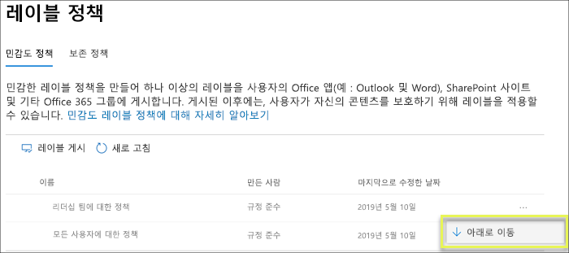

# 민감도 레이블 개요

작업을 완료하기 위해 조직의 사용자는 조직 내부 및 외부의 다른 사용자와 공동으로 작업해야 합니다. 이것은 콘텐츠가 더 이상 방화벽 뒤에 있지 않으며 장치, 앱 및 서비스를 비롯한 모든 위치에서 로밍됨을 의미합니다. 또한 사용자는 로밍 중에는 조직의 비즈니스 및 준수 정책을 충족하는 제한된 안전한 방식으로 진행되는 것을 원할 것입니다.

민감도 레이블을 사용하여 사용자의 생산성 및 공동 작업 능력이 저하되지 않도록 하면서 중요한 콘텐츠를 분류 및 보호할 수 있습니다.

민감도 레이블을 사용하여 다음을 수행할 수 있습니다.
  
- **레이블이 지정된 콘텐츠에 암호화 또는 워터마크와 같은 보호 설정 적용.** 예를 들어 사용자가 문서 또는 전자 메일에 기밀 레이블을 적용하면 해당 레이블이 콘텐츠를 암호화하고 기밀 워터마크를 적용할 수 있습니다.    

- **여러 다른 플랫폼 및 장치에서 Office 앱의 콘텐츠 보호.** 민감도 레이블은 Windows, Mac, iOS 및 Android의 Office 앱에서 작동합니다. Office 웹앱에 대한 지원도 곧 제공될 예정입니다.
    
- **Windows 실행 장치에 있는 중요한 콘텐츠가 조직 외부로 유출되지 않도록 방지.** 이를 위해 Microsoft Intune의 엔드포인트 보호 기능을 사용합니다. 민감도 레이블을 Windows 장치에 상주하는 콘텐츠에 적용하면 엔드포인트 보호 기능이 콘텐츠가 Twitter 또는 Gmail과 같은 타사 앱으로 복사되거나, USB 드라이브와 같은 이동식 저장소에 복사되지 않도록 할 수 있습니다.

- Microsoft Cloud App Security를 사용하여 **타사 앱 및 서비스의 콘텐츠 보호** Cloud App Security를 사용하여 SalesForce, Box 또는 DropBox 등의 타사 앱 및 서비스에 있는 콘텐츠를 감지, 분류, 레이블 지정 및 보호할 수 있습니다. 타사 앱 또는 서비스가 민감도 레이블을 읽지 않고 지원하지 않더라도 문제가 되지 않습니다.

- **민감도 레이블을 타사 앱 및 서비스로 확장.** Microsoft Information Protection SDK를 사용할 경우 Windows, Mac 및 Linux의 타사 앱은 민감도 레이블을 읽고 보호 설정을 적용할 수 있습니다. iOS 및 Android 앱도 곧 지원될 예정입니다.

- **보호 설정을 사용하지 않고 콘텐츠 분류.** 콘텐츠가 사용 및 공유될 때 콘텐츠와 함께 유지 및 로밍되는 분류(예: 스티커)를 콘텐츠에 간단히 지정할 수 있습니다. 이러한 분류를 사용하여 중요한 콘텐츠에 대한 사용 현황 보고서를 생성하고 활동 데이터를 확인할 수 있습니다. 이 정보를 토대로, 나중에 언제든지 보호 설정을 적용하도록 선택할 수 있습니다.
    
이러한 모든 경우에 Office 365에서 민감도 레이블은 올바른 콘텐츠에 대해 올바른 작업을 수행하는 데 도움이 될 수 있습니다. 민감도 레이블을 사용하여 조직의 데이터를 분류하고 해당 분류에 따라 보호 설정을 적용할 수 있습니다.
  
Microsoft 365 준수 센터, Microsoft 365 보안 센터 또는 Office 365 보안 및 규정 준수 센터의 민감도 레이블을 만듭니다. 이러한 민감도 레이블은 Azure 정보 보호, Office 앱 및 Office 365 서비스에서 사용할 수 있습니다.

Azure Information Protection 고객의 경우 다른 관리 센터에서 Azure Information Protection 레이블을 사용할 수 있으며 추가 또는 고급 구성을 수행하기로 선택한 경우 레이블이 Azure 포털과 동기화됩니다. **Azure Information Protection 레이블과 Office 365 민감도 레이블은 서로 완벽하게 호환됩니다.** 예를 들어, Azure Information Protection으로 분류된 콘텐츠가 있는 경우 콘텐츠를 재 분류하거나 레이블을 다시 지정할 필요가 없습니다. 

## 민감도 레이블이란?

문서 또는 전자 메일에 민감도 레이블을 할당할 경우 다음과 같은 태그와 비슷합니다.

- **사용자 지정 가능.** 조직에서다양한 수준의 중요한 콘텐츠에 대해 개인, 공개, 일반, 기밀 및 극비와 같은 범주를 만들 수 있습니다.

- **일반 텍스트.** 레이블은 일반 텍스트로 표시되므로 타사 앱 및 서비스에서 레이블이 지정된 콘텐츠에 보호 작업을 적용할 수 있습니다.

- **영구적.** 콘텐츠에 민감도 레이블을 적용하면 해당 전자 메일 또는 문서의 메타데이터에 유지됩니다. 즉, 보호 설정을 비롯한 레이블이 콘텐츠와 함께 로밍되며, 정책을 적용하는 토대가 됩니다.

Office 앱에서 민감도 레이블은 전자 메일 또는 문서에서 단순히 태그로 표시됩니다.

각 콘텐츠 항목에 단일 민감도 레이블을 적용할 수 있습니다. 그렇지만 하나의 항목에 단일 민감도 레이블과 단일 [보존 레이블](labels.md)을 모두 적용할 수 있습니다.

## 민감도 레이블이 수행하는 작업

민감도 레이블을 전자 메일이나 문서에 적용되면 해당 레이블의 보호 설정이 콘텐츠에 적용됩니다. 민감도 레이블을 사용하여 다음을 수행할 수 있습니다.

- 전자 메일만 또는 전자 메일과 문서를 모두 **암호화**합니다. 어떤 사용자 또는 그룹에게 얼마의 기간 동안 어떤 작업을 수행할 수 있는 권한을 부여할지를 선택할 수 있습니다. 예를 들어, 조직 외부의 특정 도메인에 있는 사용자에게 콘텐츠에 레이블이 지정되고 7일 동안만 콘텐츠를 검토하기 위한 권한을 부여하도록 선택할 수 있습니다. 자세한 내용은 [민감도 레이블에서 암호화를 사용하여 콘텐츠 액세스 제한](encryption-sensitivity-labels.md)을 참조하세요.

- 레이블이 적용된 이메일 또는 문서에 사용자 지정 워터마크, 머리글 또는 바닥글을 추가하여 **콘텐츠를 표시**합니다. 워터마크는 이메일이 아닌 문서에만 적용되며 255자로 제한됩니다. 또한, 머리글과 바닥글은 1024자로 제한되는데, Excel에서는 문서에 다른 머리글 또는 바닥글 및 기타 요소가 포함되어 있는지 여부에 따 예외적으로 253자 이하로 제한됩니다.

    

- Intune의 엔드포인트 보호를 켜서 **데이터 손실을 방지**합니다. 중요한 콘텐츠가 다운로드되면 Windows 장치에서 데이터가 손실되지 않도록 할 수 있습니다. 예를 들어, 레이블이 지정된 콘텐츠를 Dropbox, Gmail 또는 USB 드라이브에 복사할 수 없습니다. 민감도 레이블은 WIP(Windows Information Protection)를 사용하려면 먼저 Azure Portal에서 앱 보호 정책을 만들어야 합니다. 자세한 내용은 [Windows Information Protection로 민감도 레이블이 지정된 파일을 보호하는 방법](https://docs.microsoft.com/ko-KR/windows/security/information-protection/windows-information-protection/how-wip-works-with-labels?branch=vsts17546553)을 참조하세요.

- **중요한 정보를 포함하고 있는 콘텐츠에 레이블을 자동으로 적용합니다.** 레이블을 지정할 중요한 정보의 유형을 선택할 수 있으며, 레이블을 자동으로 적용하거나 사용자가 추천 레이블을 적용할 수 있도록 메시지를 표시할 수 있습니다. 레이블을 추천하는 경우 어떤 텍스트를 선택해도 메시지가 표시됩니다. 자세한 내용은 [Apply a sensitivity label to content automatically](apply_sensitivity_label_automatically.md)(콘텐츠에 민감도 레이블을 자동으로 적용)를 참조하세요.

    

이러한 모든 옵션은 민감도 레이블을 만들 때 제공됩니다.

### 레이블 우선 순위(순서가 중요함)

민감도 레이블을 만들면 **레이블** 페이지의 **민감도** 탭에 있는 목록에 나타납니다. 이 목록에서는 레이블의 우선 순위가 반영되기 때문에 레이블의 순서가 중요합니다. 극비와 같은 가장 제한적인 민감도 레이블은 목록의 **아래쪽**에 표시되도록 하고, 공용과 같은 가장 덜 제한적인 민감도 레이블은 **위쪽**에 표시되도록 합니다.

문서 또는 전자 메일에는 단일 민감도 레이블만 지정할 수 있습니다. 사용자에게 더 낮은 분류로 변경하려는 근거를 제공하도록 요구할 경우 이 목록의 순서에 따라 더 낮은 분류에 해당하는 항목이 결정됩니다.

레이블 우선 순위 외에도 레이블 정책의 순서도 중요합니다. [아래에 있는 이 섹션](#sensitivity-label-priority-order-matters)을 참조하세요.

### 하위 레이블(레이블 그룹화)

하위 레이블을 사용하여 Office 앱에 표시되는 하나 이상의 레이블을 상위 레이블 아래에 그룹화할 수 있습니다. 예를 들어, 조직은 기밀 아래에 여러 다른 레이블을 사용하여 특정 유형의 분류를 구현할 수 있습니다. 이 예제에서 상위 레이블 ‘기밀’은 보호 설정이 지정되지 않은 단순한 텍스트 레이블이며, 하위 레이블이 있으므로 콘텐츠에 적용할 수 없습니다. 대신, 하위 레이블을 보려면 기밀을 선택해야 하며, 그 이후에 콘텐츠에 적용할 하위 레이블을 선택할 수 있습니다.

하위 레이블은 레이블을 논리 그룹으로 나타내는 간단한 방법입니다. 하위 레이블은 상위 레이블에서 설정을 상속하지 않습니다. 하위 레이블은 콘텐츠에 적용할 수 있지만 상위 레이블은 적용할 수 없습니다.

또한 상위 레이블을 기본 레이블로 선택하면 안 됩니다(다음 섹션 참조). 또한 상위 레이블은 Azure Information Protection 통합 레이블 지정 클라이언트를 사용하는 Office 앱에서 콘텐츠에 적용되지 않으므로 상위 레이블이 자동으로 적용되거나 권장되도록 구성하지 않도록 합니다.

### 민감도 레이블 편집 또는 삭제

민감도 레이블을 삭제할 경우 콘텐츠에서 레이블이 제거되지 않으며, 보호 설정이 콘텐츠에 계속 적용됩니다.

민감도 레이블을 편집하는 경우 콘텐츠에 적용된 레이블 버전이 해당 콘텐츠에 강제 적용됩니다.

## 레이블 정책이 수행할 수 있는 작업

민감도 레이블을 만든 후 조직의 사용자들이 사용할 수 있게 게시해야 합니다. 그러면 사용자들은 해당 레이블을 콘텐츠에 적용할 수 있습니다. 모든 Exchange 사서함과 같은 위치에 게시되는 보존 레이블과 달리, 민감도 레이블은 사용자 또는 그룹에 게시됩니다. 그런 후 민감도 레이블은 해당 사용자 및 그룹을 위한 Office 앱에 나타납니다.

레이블 정책을 사용하여 다음 작업을 수행할 수 있습니다.

- **레이블을 볼 수 있는 사용자 및 그룹을 선택합니다.** 레이블을 전자 메일 사용이 가능한 보안 그룹, 메일 그룹, Office 365 그룹 또는 동적 메일 그룹에 게시할 수 있습니다.

- 레이블 정책에 포함된 사용자 및 그룹이 만든 모든 새 문서 및 전자 메일에 **기본 레이블을 적용합니다**. 이 기본 레이블은 모든 콘텐츠에 적용하려는 기본적인 보호 설정 수준을 설정할 수 있습니다.

- **레이블 변경 근거를 요구합니다.** 콘텐츠가 기밀로 표시되고, 사용자가 해당 레이블을 제거하거나 더 낮은 분류(예: 공용)로 바꾸려고 할 경우 사용자에게 해당 작업을 수행할 때 근거를 제공하도록 요구할 수 있습니다. 관리자는 이러한 근거를 검토할 수 있습니다. 현재, Microsoft는 관리자가 사용자 근거를 볼 수 있는 보고서를 제작하고 있습니다.

    

- **사용자가 전자 메일 및 문서에 레이블을 적용하도록 요구합니다.** 사용자의 모든 콘텐츠에 레이블을 지정하도록 하려는 경우, 사용자의 저장된 문서 및 보낸 전자 메일 모두에 레이블을 적용하도록 요구할 수 있습니다. 사용자가 레이블을 수동으로 할당하고, 레이블이 조건의 결과로 자동으로 할당되거나, 기본적으로 할당(위에 설명된 기본 레이블 옵션)될 수 있습니다. 사용자가 레이블 할당 요구를 받을 때 Outlook에 표시되는 메시지는 다음과 같습니다.

    > [!NOTE]
    > 필수 레이블 지정에는 Azure Information Protection 구독이 필요합니다. 이 기능을 사용하려면 [Azure Information Protection 클라이언트](https://www.microsoft.com/en-us/download/details.aspx?id=53018) 또는 이후 버전의 [Azure Information Protection 통합 레이블 지정 클라이언트](https://docs.microsoft.com/ko-KR/azure/information-protection/rms-client/install-unifiedlabelingclient-app)를 다운로드하여 설치해야 합니다. Microsoft는 Office 앱에서 이 기능을 위한 기본 지원을 마련하고 있으므로 Azure Information Protection 클라이언트가 필요하지 않습니다. 또한 클라이언트가 Windows에서만 실행되므로 아직 이 기능은 Mac, iOS 및 Android에서는 지원되지 않습니다.

    

- **사용자 지정 도움말 페이지에 대한 도움말 링크를 제공합니다.** 사용자가 민감도 레이블의 의미나 사용 방식을 잘 모를 경우 Office 앱의 민감도 레이블 메뉴 하단에 자세히 알아보기 URL을 제공할 수 있습니다.

    

레이블 정책을 만들고 사용자 및 그룹에게 민감도 레이블을 할당하면 해당 사용자나 그룹은 1시간 이내에 Office 앱에서 해당 레이블이 사용 가능하다는 것을 확인할 수 있습니다.

### 레이블 정책 우선 순위(순서 중요)

**레이블 정책** 페이지의 **민감도 정책** 탭에 있는 목록에 나타나는 민감도 레이블 정책에 민감도 레이블을 게시하여 사용자가 이를 사용할 수 있도록 합니다. 민감도 레이블([위의 섹션](#sensitivity-label-priority-order-matters) 참조)과 마찬가지로, 민감도 레이블의 순서가 우선 순위를 반영하므로 이 순서가 중요합니다. 우선 순위가 가장 낮은 레이블 정책이 **맨 위**에 표시되고 우선 순위가 가장 높은 레이블 정책이 **맨 아래**에 표시됩니다.

레이블 정책은 다음으로 구성됩니다.

- 레이블 집합.
- 정책에 포함된 사용자 및 그룹을 나타내는 레이블 정책의 범위입니다.
- 위에서 설명한 레이블 정책의 설정(기본 레이블, 맞춤, 필수 레이블 및 도움말 링크)입니다.

여러 레이블 정책에 한 사용자를 포함하면 해당 사용자에게 해당 정책의 모든 민감도 레이블이 표시됩니다. 그러나 사용자에게는 우선 순위가 가장 높은 레이블의 레이블 정책만 표시됩니다.

조직의 사용자 또는 그룹이 기본 또는 필수 레이블 등 원하는 레이블 정책에서 옵션을 볼 수 없는 경우, 민감도 레이블 정책의 순서를 확인합니다. 레이블 정책의 순서를 다시 지정하려면, 민감도 레이블 정책 선택 > 오른쪽에서 줄임표 선택 > **아래로 이동** 또는 **위로 이동**합니다.

민감도 레이블 정책에 대한 우선 순위가 중요하지만, 보존 **레이블** 정책에 대해서는 중요하지 않습니다. [보존 원칙 또는 우선 순위](labels.md#the-principles-of-retention-or-what-takes-precedence)에 설명된 대로, 콘텐츠에 많은 보존 정책이 적용될 수 있습니다.

## 시작하는 방법

민감도 레이블은 빠르게 시작할 수 있습니다.

1. **레이블 정의.** 먼저, 다양한 수준의 중요한 콘텐츠를 정의하기 위한 분류법을 설정하려고 합니다. 사용자에게 의미 있는 일반 이름 또는 용어를 사용하려고 합니다. 예를 들어, 개인, 공개, 일반, 기밀 및 극비와 같은 레이블로 시작할 수 있습니다. 하위 레이블을 사용하여 비슷한 레이블을 범주별로 그룹화할 수 있습니다. 또한 레이블을 만들 때는 리본의 레이블 옵션 위로 마우스를 가져갈 때 Office 앱에 나타나는 도구 설명이 필요합니다.

1. **각 레이블이 수행할 수 있는 작업 정의.** 그런 후, 각 레이블에 연결하려는 보호 설정을 구성합니다. 예를 들어, 우선 순위가 낮은 콘텐츠(“일반” 레이블)에는 간단히 머리글이나 바닥글을 적용하고, 민감도가 높은 콘텐츠("기밀" 레이블)에는 워터마크, 암호화 및 WIP를 적용하여 권한 있는 사용자만 액세스하도록 할 수 있습니다.
 
1. **레이블을 받는 사용자 정의.** 조직의 레이블을 정의한 후에 해당 레이블을 보는 사용자 및 그룹을 제어하는 레이블 정책에 게시합니다. 단일 레이블을 다시 사용할 수 있습니다. 즉, 한 번 정의한 후 다른 사용자에게 할당되는 여러 레이블 정책에 포함할 수 있습니다. 그렇지만 레이블을 콘텐츠에 할당하려면 Office 앱 및 기타 서비스에서 사용할 수 있도록 해당 레이블을 먼저 게시해야 합니다. 처음 사용하는 경우 소수의 사용자에게만 할당하여 민감도 레이블을 시험해볼 수 있습니다.

다음은 관리자, 사용자 및 Office 앱이 민감도 레이블 사용을 위해 수행하는 작업의 기본 흐름입니다.

## 민감도 레이블이 표시될 수 있는 위치

민감도 레이블은 Office 앱의 UI에 나타납니다. 특정 앱 및 플랫폼의 현재 가용성을 보려면 **[해당 기능을 지금 사용할 수 있는 위치](https://support.office.com/ko-KR/article/apply-sensitivity-labels-to-your-documents-and-email-within-office-2f96e7cd-d5a4-403b-8bd7-4cc636bae0f9?ad=US&ui=en-US&rs=en-US#bkmk_whereavailable)** 를 참조하세요.

### Windows의 Office 앱

Windows를 실행하는 장치의 Office 앱에서 민감도 레이블은 리본의 **홈** 탭에 있는 **민감도** 단추에 표시됩니다. 적용된 레이블은 창 맨 아래의 상태 표시줄에도 표시됩니다.

Windows의 Office 앱에서 사용되는 민감도 레이블도 곧 기본적으로 지원될 예정입니다.

기존 Azure Information Protection 고객인 경우 민감도 레이블을 지원하는 Azure Information Protection 통합 레이블 클라이언트를 배포할 수 있습니다. 클라이언트 다운로드에 대한 자세한 내용은 [Azure Information Protection 통합 레이블 클라이언트: 버전 릴리스 정보](https://docs.microsoft.com/ko-KR/azure/information-protection/rms-client/unifiedlabelingclient-version-release-history)를 참조하십시오. 현재 Windows의 Office 앱에 사용되는 민감도 레이블을 기본적으로 지원하기 위해 작업 중이므로 앞으로 Azure Information Protection 통합 레이블 클라이언트는 더 이상 필요하지 않게 됩니다.

### Mac의 Office 앱

Mac 장치의 Office 앱에서 민감도 레이블은 리본의 **홈** 탭에 있는 **민감도** 단추에 표시됩니다. 적용된 레이블은 창 맨 아래의 상태 표시줄에도 표시됩니다.

### iOS의 Office 앱

iOS 장치의 Office 앱에서 민감도 레이블은 리본의 **홈** 탭에 있는 **민감도** 단추에 표시됩니다. 적용된 레이블은 창 맨 아래의 상태 표시줄에도 표시됩니다.

### Android의 Office 앱

Android 장치의 Office 앱에서 민감도 레이블은 리본의 **홈** 탭에 있는 **민감도** 단추에 표시됩니다. 적용된 레이블은 창 맨 아래의 상태 표시줄에도 표시됩니다.

### Office 앱의 민감도 레이블에 대한 자세한 내용

- 
  [Office 내의 문서 및 전자 메일에 민감도 레이블 적용](https://support.office.com/ko-KR/article/apply-sensitivity-labels-to-your-documents-and-email-within-office-2f96e7cd-d5a4-403b-8bd7-4cc636bae0f9)
- 
  [Office 파일에 민감도 레이블을 적용할 때의 알려진 문제](https://support.office.com/ko-KR/article/known-issues-when-you-apply-sensitivity-labels-to-your-office-files-b169d687-2bbd-4e21-a440-7da1b2743edc)

## 민감도 레이블이 기존 Azure Information Protection 레이블에 작동하는 방식

Azure Information Protection 사용자는 현재 Azure Information Protection 통합 레이블 지정 클라이언트를 사용하여 Windows의 콘텐츠를 분류하고 레이블을 지정할 수 있습니다. 기존 Azure Information Protection 레이블은 새 민감도 레이블에만 원활하게 작동합니다. 따라서 다음을 수행할 수 있습니다.

- 문서 및 전자 메일의 기존 Azure Information Protection 레이블을 유지합니다.
- 기존 Azure Information Protection 레이블 구성을 유지합니다.

Azure Information Protection 레이블을 사용하는 경우 마이그레이션을 완료할 때까지 다른 관리자 센터에서 새 레이블을 만들지 않는 것이 좋습니다. 
  [Azure Information Protection 마이그레이션 항목](https://docs.microsoft.com/ko-KR/azure/information-protection/configure-policy-migrate-labels)에는 중요한 정보와 몇 가지 특정한 주의 사항이 있습니다. 프로덕션 테넌트를 민감도 레이블로 마이그레이션할 준비가 되지 않았더라도 걱정할 필요는 없습니다. 사용자는 Azure Information Protection 클라이언트를 계속 사용할 수 있으며 관리자는 Azure 포털을 계속 사용하여 관리할 수 있습니다.

## Microsoft Intune의 엔드포인트 보호 기능을 사용하여 Windows 장치에서 콘텐츠 보호

민감도 레이블을 만들 경우 이 레이블이 있는 파일이 중요하며, Windows 장치에 저장할 경우 데이터 누출로부터 보호해야 한다는 사실을 Windows 장치에 알려주는 옵션이 제공됩니다. 이 옵션을 사용하여 이 레이블이 있는 콘텐츠가 엔드포인트에 저장되어 있더라도 승인된 위치에만 공유 또는 복사하도록 할 수 있습니다. 기본적으로 민감도 레이블에 대해 이 옵션을 켜면 추가적인 사용 제약 조건을 보증하는 데 매우 중요한 데이터라는 것을 Windows에 알릴 수 있습니다.

이 옵션을 설정하면 Windows는 문서의 민감도 레이블을 읽고, 이해하고, 관련 작업을 수행할 수 있으며, 관리되는 Windows 장치에 연결되는 방식에 관계없이, 콘텐트에 WIP(Windows Information Protection)를 자동으로 적용할 수 있습니다. 이를 통해 암호화 적용 여부에 관계없이, 레이블이 지정된 파일을 우연한 누출로부터 보호할 수 있습니다.

예를 들어 Windows는 사용자의 컴퓨터에 있는 Word 문서에 기밀 레이블이 적용되어 있음을 이해할 수 있고 WIP는 해당 디바이스에서 비작업 위치(예: 개인 OneDrive, 개인 전자 메일 계정, 소셜 미디어 또는 USB 드라이브)로 데이터를 복사 또는 공유하지 못하도록 하는 앱 보호 정책을 적용할 수 있습니다.

사용자가 레이블이 지정된 콘텐츠를 개인 Gmail 계정에 업로드하려고 하면 이 메시지가 표시됩니다.

또한 사용자가 레이블이 지정된 콘텐츠를 USB 드라이브에 저장하려고 하면 다음 메시지가 표시됩니다.

### 중요한 필수 구성 요소

민감도 레이블이 WIP를 사용하려면, [Windows Information Protection이 민감도 레이블이 지정된 파일을 보호하는 방법](https://docs.microsoft.com/ko-KR/windows/security/information-protection/windows-information-protection/how-wip-works-with-labels?branch=vsts17546553)에 설명된 필수 구성 요소를 수행해야 합니다. 이 항목에서는 다음과 같은 필수 구성 요소에 대해 설명합니다.

- Windows 10, 버전 1809 이상을 실행 중인지 확인합니다.
- 
  [WDATP(Windows Defender Advanced Threat Protection)를 설정](https://docs.microsoft.com/ko-KR/windows/security/threat-protection/windows-defender-atp/get-started)합니다. 이 기능은 콘텐츠에서 레이블을 검색하고 해당 WIP 보호를 적용합니다. ATP는 변칙 보고와 같은 일부 작업을 WIP와는 별도로 수행합니다.
- 엔드포인트 장치에 적용되는 WIP(Windows Information Protection) 정책을 만듭니다. 다음 중 하나의 위치에서 이를 수행할 수 있습니다.
    - 
  [Microsoft Intune용 Azure Portal을 사용하여 MDM으로 WIP(Windows Information Protection) 정책 만들기](https://docs.microsoft.com/ko-KR/windows/security/information-protection/windows-information-protection/create-wip-policy-using-intune-azure)
    - 
  [System Center Configuration Manager를 사용하여 WIP(Windows Information Protection) 정책 만들기 및 배포](https://docs.microsoft.com/ko-KR/windows/security/information-protection/windows-information-protection/create-wip-policy-using-sccm)

## Microsoft Cloud App Security를 사용하여 타사 앱 및 서비스의 콘텐츠 보호

CAS(Cloud App Security)를 사용하여 타사 앱 및 서비스의 콘텐츠 보호 CAS를 사용하여 SalesForce, Box 또는 Dropbox 등의 타사 서비스 및 앱에 있는 콘텐츠를 감지, 분류, 레이블 지정 및 보호할 수 있습니다. 예를 들어, Dropbox가 민감도 레이블을 이해하지 못할 수 있으나 CAS는 해당 위치에서 레이블이 지정된 콘텐츠에 액세스하고 보호할 수 있습니다.

자세한 내용은 [Azure Information Protection 분류 레이블 자동 적용](https://docs.microsoft.com/ko-KR/cloud-app-security/use-case-information-protection)을 참조하세요.

### 중요한 필수 구성 요소

민감도 레이블이 CAS를 사용하려면, [Azure Information Protection 분류 레이블 자동 적용](https://docs.microsoft.com/ko-KR/cloud-app-security/use-case-information-protection)에 설명된 필수 구성 요소를 수행해야 합니다. 이 항목에서는 다음과 같은 필수 구성 요소를 설명합니다.

- 테넌트에 대해 [Cloud App Security 및 Azure Information Protection을 사용하도록 설정](https://docs.microsoft.com/ko-KR/cloud-app-security/azip-integration)합니다.
- Cloud App Security에 [앱을 연결](https://docs.microsoft.com/ko-KR/cloud-app-security/enable-instant-visibility-protection-and-governance-actions-for-your-apps)합니다.

## Microsoft Information Protection SDK를 사용하여 타사 앱 및 서비스로 민감도 레이블 확장

민감도 레이블은 문서의 메타데이터에 일반 텍스트 형식으로 유지되므로 타사 앱 및 서비스에서 이러한 레이블이 포함된 콘텐츠의 식별 및 보호를 지원하도록 선택할 수 있습니다. 다른 앱 및 서비스의 지원도 항상 활장되고 있습니다.

  [Microsoft Information Protection SDK](https://docs.microsoft.com/ko-KR/information-protection/develop/)를 사용하여 타사 앱 및 서비스는 민감도 레이블 및 보호를 읽고 문서에 적용할 수 있습니다. 이 SDK는 Windows, Mac 및 Linux의 앱을 지원합니다. IOS 및 Android 앱도 곧 지원될 예정입니다.

이 SDK를 사용하여 Office 앱, Office 365 서비스, Azure Information Protection 검사 기능, Microsoft Cloud App Security 및 일부 기타 파트너 솔루션 등의 다른 Microsoft Information Protection 앱 및 서비스를 사용하는 방식으로 콘텐츠에 레이블을 지정하고 콘텐츠를 보호할 수 있습니다. 예를 들어, [Adobe Acrobat의 민감도 레이블 지원](https://techcommunity.microsoft.com/t5/Azure-Information-Protection/Starting-October-use-Adobe-Acrobat-Reader-for-PDFs-protected-by/ba-p/262738)에 대해 알아보세요.

Microsoft Information Protection SDK에 대한 자세한 내용은 [기술 커뮤니티 블로그의 발표](https://techcommunity.microsoft.com/t5/Microsoft-Information-Protection/Microsoft-Information-Protection-SDK-Now-Generally-Available/ba-p/263144)를 참조하세요. [Microsoft Information Protection과 통합된 파트너 솔루션](https://techcommunity.microsoft.com/t5/Azure-Information-Protection/Microsoft-Information-Protection-showcases-integrated-partner/ba-p/262657)에 대해서도 알아볼 수 있습니다.

## 사용 권한

민감도 레이블을 만드는 규정 준수 팀의 구성원에게는 보안 및 준수 센터에 대한 권한이 필요합니다. 기본적으로 테넌트 관리자는 이 위치에 액세스할 수 있으며, 준수 관리자 및 기타 사용자에게 테넌트 관리를 위한 모든 권한을 부여하지는 않으면서, 보안 및 준수 센터에 대한 액세스 권한을 부여할 수 있습니다. 이렇게 하기 위해 보안 및 준수 센터의 **권한** 페이지로 이동한 후 **준수 관리자** 역할 그룹을 편집하고 해당 역할 그룹에 구성원을 추가하는 것이 좋습니다.

자세한 내용은 [사용자에게 Office 365 보안 및 준수 센터에 대한 액세스 권한 부여](grant-access-to-the-security-and-compliance-center.md)를 참조하세요.

이러한 정책은 레이블 및 레이블 정책을 만들고 적용하는 데만 필요합니다. 정책 적용을 위해서는 콘텐츠에 액세스하지 않아도 됩니다.
