# 민감도 레이블 개요Overview of sensitivity labels

작업을 완료하기 위해 조직의 사용자는 조직 내부 및 외부의 다른 사용자와 공동으로 작업해야 합니다. 이것은 콘텐츠가 더 이상 방화벽 뒤에 있지 않으며 장치, 앱 및 서비스를 비롯한 모든 위치에서 로밍됨을 의미합니다. 또한 사용자는 로밍 중에는 조직의 비즈니스 및 준수 정책을 충족하는 제한된 안전한 방식으로 진행되는 것을 원할 것입니다.To get their work done, people in your organization need to collaborate with others both inside and outside the organization. This means that content no longer stays behind a firewall – it roams everywhere, across devices, apps, and services. And when it roams, you want it to do so in a secure, protected way that meets your organization’s business and compliance policies.

Office 365의 민감도 레이블을 사용자의 생산성 및 공동 작업 능력이 저하되지 않도록 하면서 중요한 콘텐츠를 분류 및 보호할 수 있습니다.With sensitivity labels in Office 365, you can classify and help protect your sensitive content, while making sure that your people’s productivity and ability to collaborate isn’t hindered.

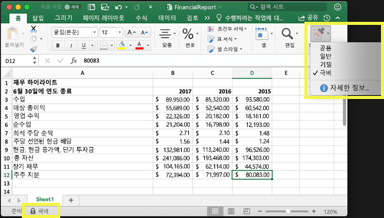

민감도 레이블을 사용하여 다음을 수행할 수 있습니다.You can use sensitivity labels to:
  
- **레이블이 지정된 콘텐츠에 암호화 또는 워터마크와 같은 보호 설정 적용.** 예를 들어 사용자가 문서 또는 전자 메일에 기밀 레이블을 적용하면 해당 레이블이 콘텐츠를 암호화하고 기밀 워터마크를 적용할 수 있습니다.**Enforce protection settings such as encryption or watermarks on labeled content.** For example, your users can apply a Confidential label to a document or email, and that label can encrypt the content and apply a Confidential watermark.    

- **여러 다른 플랫폼 및 장치에서 Office 앱의 콘텐츠 보호.** 민감도 레이블은 Windows, Mac, iOS 및 Android의 Office 앱에서 작동합니다. Office 웹앱에 대한 지원도 곧 제공될 예정입니다.**Protect content in Office apps across different platforms and devices.** Sensitivity labels work in Office apps on Windows, Mac, iOS, and Android. Support for Office web apps is coming soon.
    
- **Windows 실행 장치에 있는 중요한 콘텐츠가 조직 외부로 유출되지 않도록 방지.** 이를 위해 Microsoft Intune의 엔드포인트 보호 기능을 사용합니다. 민감도 레이블을 Windows 장치에 상주하는 콘텐츠에 적용하면 엔드포인트 보호 기능이 콘텐츠가 Twitter 또는 Gmail과 같은 타사 앱으로 복사되거나, USB 드라이브와 같은 이동식 저장소에 복사되지 않도록 할 수 있습니다.**Prevent sensitive content from leaving your organization on devices running Windows**, by using endpoint protection in Microsoft Intune. After a sensitivity label has been applied to content that resides on a Windows device, endpoint protection can prevent that content from being copied to a third-party app, such as Twitter or Gmail, or being copied to removable storage, such as a USB drive.

- **민감도 레이블을 타사 앱 및 서비스로 확장.** Microsoft Information Protection SDK를 사용할 경우 Windows, Mac 및 Linux의 타사 앱은 민감도 레이블을 읽고 보호 설정을 적용할 수 있습니다. iOS 및 Android 앱도 곧 지원될 예정입니다.**Extend sensitivity labels to third-party apps and services.** With the Microsoft Information Protection SDK, third-party apps on Windows, Mac, and Linux can read sensitivity labels and apply protection settings. Support for apps on iOS and Android is coming soon.

- **보호 설정을 사용하지 않고 콘텐츠 분류.** 콘텐츠가 사용 및 공유될 때 콘텐츠와 함께 유지 및 로밍되는 분류(예: 스티커)를 콘텐츠에 간단히 지정할 수 있습니다. 이러한 분류를 사용하여 중요한 콘텐츠에 대한 사용 현황 보고서를 생성하고 활동 데이터를 확인할 수 있습니다. 이 정보를 토대로, 나중에 언제든지 보호 설정을 적용하도록 선택할 수 있습니다.**Classify content without using any protection settings.** You can also simply assign a classification to content (like a sticker) that persists and roams with the content as it's used and shared. You can use this classification to generate usage reports and see activity data for your sensitive content. Based on this information, you can always choose at a later time to apply protection settings.
    
이러한 모든 경우에 Office 365에서 민감도 레이블은 올바른 콘텐츠에 대해 올바른 작업을 수행하는 데 도움이 될 수 있습니다. 민감도 레이블을 사용하여 조직의 데이터를 분류하고 해당 분류에 따라 보호 설정을 적용할 수 있습니다.In all of these cases, sensitivity labels in Office 365 can help you take the right actions on the right content. With sensitivity labels, you can classify data across your organization and enforce protection settings based on that classification.
  
Office 365 보안 및 준수 센터에서 민감도 레이블을 만듭니다. 이제 보안 및 준수 센터는 Azure Information Protection 및 Office 365에서 민감도 레이블 및 정책을 구성하기 위한 단일 위치로 사용됩니다. 이러한 민감도 레이블은 Azure Information Protection, Office 앱 및 Office 365 서비스에서 사용될 수 있습니다.You create sensitivity labels in the Office 365 Security &amp; Compliance Center. The Security & Compliance Center is now the single place to configure sensitivity labels and policies across Azure Information Protection and Office 365. These sensitivity labels can be used by Azure Information Protection, Office apps, and Office 365 services.

Azure Information Protection 고객을 위해 보안 및 준수 센터의 Azure Information Protection 레이블을 사용할 수 있습니다. 그러면 추가 또는 고급 구성을 수행하도록 선택할 경우 레이블이 Azure Portal과 동기화됩니다. **Azure Information Protection 레이블 및 Office 365 민감도 레이블은 서로 완전히 호환됩니다.** 즉, 예를 들어 Azure Information Protection로 레이블이 지정된 콘텐츠가 있는 경우 다시 분류하거나 다시 레이블을 지정할 필요가 없습니다.For Azure Information Protection customers, you can use your Azure Information Protection labels in the Security & Compliance center, and your labels will be synced with the Azure portal in case you choose to perform additional or advanced configuration. **Azure Information Protection labels and Office 365 sensitivity labels are fully compatible with each other.** This means, for example, if you have content labeled by Azure Information Protection, you won’t need to reclassify or relabel your content.

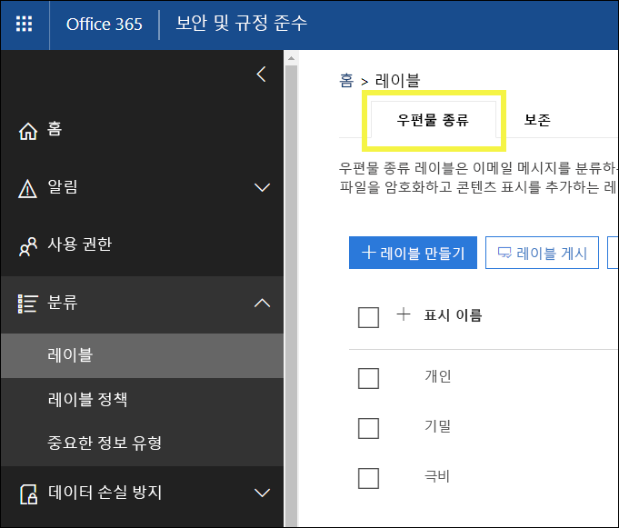

## 민감도 레이블이란?What a sensitivity label is

문서 또는 전자 메일에 민감도 레이블을 할당할 경우 다음과 같은 태그와 비슷합니다.When you assign a sensitivity label to a document or email, it’s simply like a tag that is:

- **사용자 지정 가능.** 조직에서다양한 수준의 중요한 콘텐츠에 대해 개인, 공개, 일반, 기밀 및 극비와 같은 범주를 만들 수 있습니다.**Customizable.** You can create categories for different levels of sensitive content in your organization, such as Personal, Public, General, Confidential, and Highly Confidential.

- **일반 텍스트.** 레이블은 일반 텍스트로 표시되므로 타사 앱 및 서비스에서 레이블이 지정된 콘텐츠에 보호 작업을 적용할 수 있습니다.**Clear text.** Because the label is in clear text, it’s available for third-party apps and services to apply protective actions to labeled content.

- **영구적.** 콘텐츠에 민감도 레이블을 적용하면 해당 전자 메일 또는 문서의 메타데이터에 유지됩니다. 즉, 보호 설정을 비롯한 레이블이 콘텐츠와 함께 로밍되며, 정책을 적용하는 토대가 됩니다.**Persistent.** After a sensitivity label is applied to content, it persists in the metadata of that email or document. This means the label roams with the content, including the protection settings, and becomes the basis for applying and enforcing policies.

Office 앱에서 민감도 레이블은 전자 메일 또는 문서에서 단순히 태그로 표시됩니다.In the Office apps, a sensitivity label simply appears as a tag on an email or document.

각 콘텐츠 항목에 단일 민감도 레이블을 적용할 수 있습니다. 그렇지만 하나의 항목에 단일 민감도 레이블과 단일 [보존 레이블](labels.md)을 모두 적용할 수 있습니다.Each item of content can have a single sensitivity label applied to it. But note that an item can have both a single sensitivity label and a single [retention label](labels.md) applied to it.

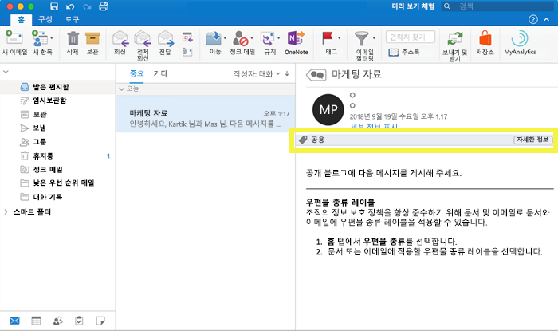

## 민감도 레이블이 수행하는 작업What sensitivity labels can do

민감도 레이블을 전자 메일이나 문서에 적용되면 해당 레이블의 보호 설정이 콘텐츠에 적용됩니다. 민감도 레이블을 사용하여 다음을 수행할 수 있습니다.After a sensitivity label is applied to an email or document, the protection settings for that label are enforced on the content. With a sensitivity label, you can:

- 전자 메일만 또는 전자 메일과 문서를 모두 **암호화**합니다. 어떤 사용자 또는 그룹에게 얼마의 기간 동안 어떤 작업을 수행할 수 있는 권한을 부여할지를 선택할 수 있습니다. 예를 들어, 조직 외부의 특정 도메인에 있는 사용자에게 콘텐츠에 레이블이 지정되고 7일 동안만 콘텐츠를 검토하기 위한 권한을 부여하도록 선택할 수 있습니다. 자세한 내용은 [민감도 레이블에서 암호화를 사용하여 콘텐츠 액세스 제한](encryption-sensitivity-labels.md)을 참조하세요.**Encrypt** email only or both email and documents. You can choose which users or group have permissions to perform which actions and for how long. For example, you can choose to allow users in a specific domain outside your organization to have permissions to review the content for only 7 days after the content is labeled. For more information, see [Restrict access to content by using encryption in sensitivity labels](encryption-sensitivity-labels.md).

- 레이블이 적용된 이메일 또는 문서에 사용자 지정 워터마크, 머리글 또는 바닥글을 추가하여 **콘텐츠를 표시**합니다. 워터마크는 이메일이 아닌 문서에만 적용되며 255자로 제한됩니다. 또한, 머리글과 바닥글은 1024자로 제한되는데, Excel에서는 문서에 다른 머리글 또는 바닥글 및 기타 요소가 포함되어 있는지 여부에 따 예외적으로 253자 이하로 제한됩니다.**Mark the content** by adding custom watermarks, headers, or footers to email or documents that have the label applied. Note that watermarks are applied only to documents, not email, and they're limited to 255 characters. Also, headers and footers are limited to 1024 characters (except in Excel, where they're limited to 255 characters or fewer, depending on whether the document contains other headers or footers and other factors.)

    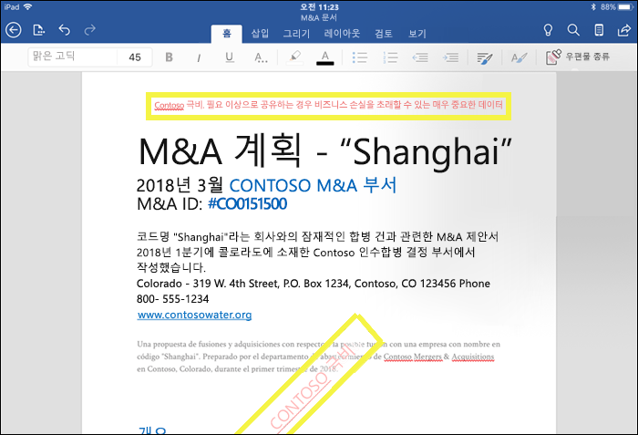

- Intune의 엔드포인트 보호를 켜서 **데이터 손실을 방지**합니다. 중요한 콘텐츠가 다운로드되면 Windows 장치에서 데이터가 손실되지 않도록 할 수 있습니다. 예를 들어, 레이블이 지정된 콘텐츠를 Dropbox, Gmail 또는 USB 드라이브에 복사할 수 없습니다. 민감도 레이블은 WIP(Windows Information Protection)를 사용하려면 먼저 Azure Portal에서 앱 보호 정책을 만들어야 합니다. 자세한 내용은 [Windows Information Protection로 민감도 레이블이 지정된 파일을 보호하는 방법](https://docs.microsoft.com/en-us/windows/security/information-protection/windows-information-protection/how-wip-works-with-labels?branch=vsts17546553)을 참조하세요.**Prevent data loss** by turning on endpoint protection in Intune. If sensitive content gets downloaded, you can help prevent the loss of data from Windows devices. For example, you can’t copy labeled content into Dropbox, Gmail, or USB drive. Before your sensitivity labels can use Windows Information Protection (WIP), you first need to create an app protection policy in the Azure portal. For more information, see [How Windows Information Protection protects files with a sensitivity label](https://docs.microsoft.com/en-us/windows/security/information-protection/windows-information-protection/how-wip-works-with-labels?branch=vsts17546553).

- **중요한 정보를 포함하고 있는 콘텐츠에 레이블을 자동으로 적용합니다.** 레이블을 지정할 중요한 정보의 유형을 선택할 수 있으며, 레이블을 자동으로 적용하거나 사용자가 추천 레이블을 적용할 수 있도록 메시지를 표시할 수 있습니다. 레이블을 추천하는 경우 어떤 텍스트를 선택해도 메시지가 표시됩니다. 자세한 내용은 [Apply a sensitivity label to content automatically](apply_sensitivity_label_automatically.md)(콘텐츠에 민감도 레이블을 자동으로 적용)를 참조하세요.**Apply the label automatically to content that contains sensitive information.** You can choose what types of sensitive information that you want labeled, and the label can either be applied automatically, or you can prompt users to apply the label that you recommend. If you recommend a label, the prompt displays whatever text you choose. For more information, see [Apply a sensitivity label to content automatically](apply_sensitivity_label_automatically.md).

    

이 모든 옵션은 보안 및 준수 센터에서 레이블을 만들 때 사용할 수 있습니다.All of these options are available when you create a label in the Security & Compliance Center.

### 레이블 우선 순위(순서가 중요함)Label priority (order matters)

보안 및 준수 센터에서 민감도 레이블을 만들 경우 **레이블** 페이지의 **민감도** 탭에 목록으로 표시됩니다. 이 목록에서 레이블의 순서는 우선 순위를 반영하므로 중요합니다. 극비와 같은 가장 제한적인 민감도 레이블을 목록 **맨 아래**에 표시하고, 공용과 같은 가장 덜 제한적인 민감도 레이블을 **맨 위**에 표시할 수 있습니다.When you create your sensitivity labels in the Security & Compliance Center, they appear in a list on the **Sensitivity** tab on the **Labels** page. In this list, the order of the labels is important because it reflects their priority. You want your most restrictive sensitivity label, such as Highly Confidential, to appear at the **bottom** of the list, and your least restrictive sensitivity label, such as Public, to appear at the **top**.

문서 또는 전자 메일에는 단일 민감도 레이블만 지정할 수 있습니다. 사용자에게 더 낮은 분류로 변경하려는 근거를 제공하도록 요구할 경우 이 목록의 순서에 따라 더 낮은 분류에 해당하는 항목이 결정됩니다.A document or email can have only a single sensitivity label applied to it. If you require your users to provide a justification for changing the label to a lower classification, the order of this list determines what's a lower classification.

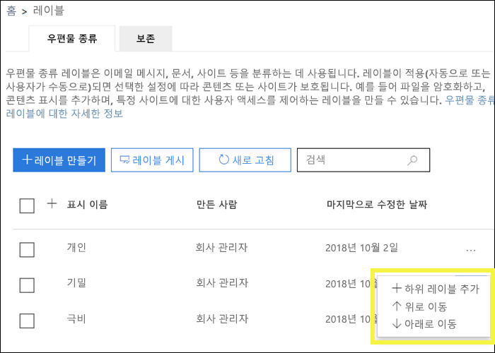

### 하위 레이블(레이블 그룹화)Sublabels (grouping labels)

하위 레이블을 사용하면 Office 앱에서 표시되는 하나 이상의 레이블을 머리글 아래에 그룹화할 수 있습니다. 예를 들어 조직은 기밀 아래에서 해당 분류의 특정 유형에 대해 여러 다른 레이블을 사용할 수 있습니다. 이 예에서 기밀 레이블은 보호 설정이 없는 텍스트 레이블에 불과하고 하위 레이블이 있기 때문에 콘텐츠에 적용할 수 없습니다. 대신, 사용자는 기밀을 선택하여 하위 레이블을 표시한 후 콘텐츠에 적용할 하위 레이블을 선택해야 합니다.With sublabels, you can group one or more labels below a header that a user sees in an Office app. For example, under Confidential, your organization might use several different labels for specific types of that classification. In this example, the label Confidential is simply a text label with no protection settings, and because it has sublabels, it can’t be applied to content. Instead, users must choose Confidential to view the sublabels, and then they can choose a sublabel to apply to content.

하위 레이블은 논리 그룹의 사용자에게 레이블을 제공하는 간단한 방법입니다. 하위 레이블은 상 레이블의 설정을 상속하지 않습니다.Sublabels are simply a way to present labels to users in logical groups. Sublabels don’t inherit any settings from the label they’re under.

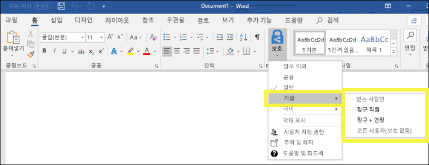

### 민감도 레이블 편집 또는 삭제Editing or deleting a sensitivity label

보안 및 준수 센터에서 민감도 레이블을 삭제할 경우 콘텐츠에서 레이블이 제거되지 않으며, 보호 설정이 콘텐츠에 계속 적용됩니다.If you delete a sensitivity label in the Security & Compliance Center, note that the label is not removed from content, and any protection settings continue to be enforced on the content.

보안 및 준수 센터에서 민감도 레이블을 편집하는 경우 콘텐츠에 적용된 레이블 버전이 해당 콘텐츠에 강제 적용됩니다.If you edit a sensitivity label in the Security & Compliance Center, the version of the label that was applied to content is what’s enforced on that content.

## 레이블 정책이 수행할 수 있는 작업What label policies can do

민감도 레이블을 만든 후 조직의 사용자들이 사용할 수 있게 게시해야 합니다. 그러면 사용자들은 해당 레이블을 콘텐츠에 적용할 수 있습니다. 모든 Exchange 사서함과 같은 위치에 게시되는 보존 레이블과 달리, 민감도 레이블은 사용자 또는 그룹에 게시됩니다. 그런 후 민감도 레이블은 해당 사용자 및 그룹을 위한 Office 앱에 나타납니다.After you create your sensitivity labels, you need to publish them, to make them available to people in your organization, who can then apply the labels to content. Unlike retention labels, which are published to locations, such as all Exchange mailboxes, sensitivity labels are published to users or groups. Sensitivity labels then appear in Office apps for those users and groups.

레이블 정책을 사용하여 다음 작업을 수행할 수 있습니다.With a label policy, you can:

- **레이블을 볼 수 있는 사용자 및 그룹을 선택합니다.** 레이블을 전자 메일 사용이 가능한 보안 그룹, 메일 그룹, Office 365 그룹 또는 동적 메일 그룹에 게시할 수 있습니다.**Choose which users and groups see the labels.** Labels can be published to any email-enabled security group, distribution group, Office 365 group, or dynamic distribution group.

- 레이블 정책에 포함된 사용자 및 그룹이 만든 모든 새 문서 및 전자 메일에 **기본 레이블을 적용합니다**. 이 기본 레이블은 모든 콘텐츠에 적용하려는 기본적인 보호 설정 수준을 설정할 수 있습니다.**Apply a default label** to all new documents and email created by the users and groups included in the label policy. This default label can set a base level of protection settings that you want applied to all your content.

- **레이블 변경 근거를 요구합니다.** 콘텐츠가 기밀로 표시되고, 사용자가 해당 레이블을 제거하거나 더 낮은 분류(예: 공용)로 바꾸려고 할 경우 사용자에게 해당 작업을 수행할 때 근거를 제공하도록 요구할 수 있습니다. 관리자는 이러한 근거를 검토할 수 있습니다. 현재, Microsoft는 관리자가 사용자 근거를 볼 수 있는 보고서를 제작하고 있습니다.**Require a justification for changing a label.** If content is marked Confidential and a user wants to remove that label or replace it with a lower classification, such as a label named Public, you can require that the user provide a justification when performing this action. These justifications will be available for the admin to review. We’re currently working on a report where admins can view the user justifications.

    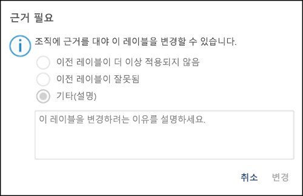

- **사용자가 전자 메일 및 문서에 레이블을 적용하도록 요구합니다.** 사용자의 모든 콘텐츠에 레이블을 지정하도록 하려는 경우, 사용자의 저장된 문서 및 보낸 전자 메일 모두에 레이블을 적용하도록 요구할 수 있습니다. 사용자가 레이블을 수동으로 할당하고, 레이블이 조건의 결과로 자동으로 할당되거나, 기본적으로 할당(위에 설명된 기본 레이블 옵션)될 수 있습니다. 사용자가 레이블 할당 요구를 받을 때 Outlook에 표시되는 메시지는 다음과 같습니다.**Require users to apply a label to their email and documents.** If you want all of a user's content to be labeled, you can require that a label must be applied to all of their saved documents and sent emails. The label can be assigned manually by the user, automatically as a result of a condition, or be assigned by default (the default label option described above). Here's the prompt shown in Outlook when a user is required to assign a label.

    > [!NOTE]
    > 필수 레이블 지정에는 Azure Information Protection 구독이 필요합니다. 이 기능을 사용하려면 [Azure Information Protection 클라이언트](https://www.microsoft.com/en-us/download/details.aspx?id=53018) 또는 이후 버전의 [Azure Information Protection 통합 레이블 지정 클라이언트](https://docs.microsoft.com/ko-KR/azure/information-protection/rms-client/install-unifiedlabelingclient-app)를 다운로드하여 설치해야 합니다. Microsoft는 Office 앱에서 이 기능을 위한 기본 지원을 마련하고 있으므로 Azure Information Protection 클라이언트가 필요하지 않습니다. 또한 클라이언트가 Windows에서만 실행되므로 아직 이 기능은 Mac, iOS 및 Android에서는 지원되지 않습니다.The capability to apply labels automatically requires an Azure Information Protection P2 subscription. To use this feature, you must Download and install the Azure Information Protection unified labeling client. We're working on native support for this feature in Office apps, so that it won't require the Azure Information Protection unified labeling client. Also, the unified labeling client runs only on Windows, so this feature is not yet supported on Mac, iOS, and Android.

    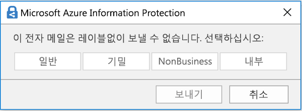

- **사용자 지정 도움말 페이지에 대한 도움말 링크를 제공합니다.** 사용자가 민감도 레이블의 의미나 사용 방식을 잘 모를 경우 Office 앱의 민감도 레이블 메뉴 하단에 자세히 알아보기 URL을 제공할 수 있습니다.**Provide help link to a custom help page.** If your users aren’t sure what your sensitivity labels mean or how they should be used, you can provide a Learn More URL that appears at the bottom of the Sensitivity label menu in the Office apps.

    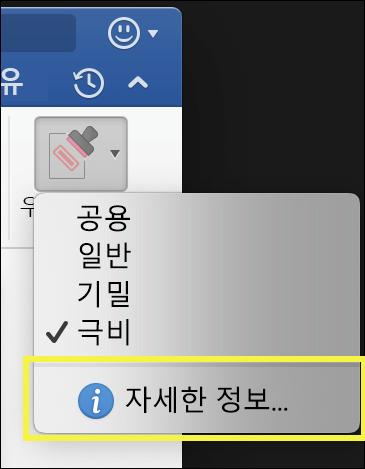

레이블 정책을 만들고 사용자 및 그룹에게 민감도 레이블을 할당하면 해당 사용자나 그룹은 1시간 이내에 Office 앱에서 해당 레이블이 사용 가능하다는 것을 확인할 수 있습니다.After you create a label policy and assign sensitivity labels to users and groups, those people will see those labels available in the Office apps in an hour or less.

## 시작하는 방법How to get started

민감도 레이블은 빠르게 시작할 수 있습니다.Getting started with sensitivity labels is a quick process:

1. **레이블 정의.** 먼저, 다양한 수준의 중요한 콘텐츠를 정의하기 위한 분류법을 설정하려고 합니다. 사용자에게 의미 있는 일반 이름 또는 용어를 사용하려고 합니다. 예를 들어, 개인, 공개, 일반, 기밀 및 극비와 같은 레이블로 시작할 수 있습니다. 하위 레이블을 사용하여 비슷한 레이블을 범주별로 그룹화할 수 있습니다. 또한 레이블을 만들 때는 리본의 레이블 옵션 위로 마우스를 가져갈 때 Office 앱에 나타나는 도구 설명이 필요합니다.**Define the labels.** First, you want to establish your taxonomy for defining different levels of sensitive content. You should use common names or terms that make sense to your users. For example, you can start with labels such as Personal, Public, General, Confidential, and Highly Confidential. You can use sublabels to group similar labels by category. Also, when you create a label, a tool tip is required, which appears in the Office apps when a user hovers over a label option on the Ribbon.

1. **각 레이블이 수행할 수 있는 작업 정의.** 그런 후, 각 레이블에 연결하려는 보호 설정을 구성합니다. 예를 들어, 우선 순위가 낮은 콘텐츠(“일반” 레이블)에는 간단히 머리글이나 바닥글을 적용하고, 민감도가 높은 콘텐츠("기밀" 레이블)에는 워터마크, 암호화 및 WIP를 적용하여 권한 있는 사용자만 액세스하도록 할 수 있습니다.**Define what each label can do.** Then, configure the protection settings you want associated with each label. For example, lower sensitivity content (a “General” label) might simply have a header or footer applied to it, while higher sensitivity content (a “Confidential” label) may have a watermark, encryption, and WIP applied to it, to help ensure that only privileged users can access it.
 
1. **레이블을 받는 사용자 정의.** 조직의 레이블을 정의한 후에 해당 레이블을 보는 사용자 및 그룹을 제어하는 레이블 정책에 게시합니다. 단일 레이블을 다시 사용할 수 있습니다. 즉, 한 번 정의한 후 다른 사용자에게 할당되는 여러 레이블 정책에 포함할 수 있습니다. 그렇지만 레이블을 콘텐츠에 할당하려면 Office 앱 및 기타 서비스에서 사용할 수 있도록 해당 레이블을 먼저 게시해야 합니다. 처음 사용하는 경우 소수의 사용자에게만 할당하여 민감도 레이블을 시험해볼 수 있습니다.**Define who gets the labels.** After you define your organization’s labels, you publish them in a label policy that controls which users and groups see those labels. A single label is reusable – you define it once, and then you can include it in several label policies assigned to different users. But in order for a label to be assigned to content, you must first publish that label so that it’s available in Office apps and other services. When just starting out, you can pilot your sensitivity labels by assigning them to just a few people.

다음은 관리자, 사용자 및 Office 앱이 민감도 레이블 사용을 위해 수행하는 작업의 기본 흐름입니다.Here’s the basic flow of what the admin, user, and Office app do to make sensitivity labels work.

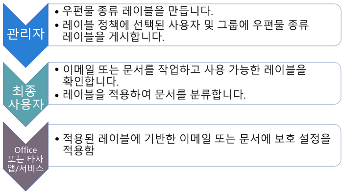

## 민감도 레이블이 표시될 수 있는 위치Where sensitivity labels can appear

민감도 레이블은 Office 앱의 UI에 나타납니다. 특정 앱 및 플랫폼의 현재 가용성을 보려면 **[해당 기능을 지금 사용할 수 있는 위치](https://support.office.com/ko-KR/article/apply-sensitivity-labels-to-your-documents-and-email-within-office-2f96e7cd-d5a4-403b-8bd7-4cc636bae0f9?ad=US&ui=en-US&rs=en-US#bkmk_whereavailable)** 를 참조하세요.Sensitivity labels appear in the UI of Office apps. To view the current availability for specific apps and platforms, see **[Where is the feature available today?](https://support.office.com/ko-KR/article/apply-sensitivity-labels-to-your-documents-and-email-within-office-2f96e7cd-d5a4-403b-8bd7-4cc636bae0f9?ad=US&ui=en-US&rs=en-US#bkmk_whereavailable)**

### Windows의 Office 앱Office apps on Windows

Windows를 실행하는 장치의 Office 앱에서 민감도 레이블은 리본의 **홈** 탭에 있는 **민감도** 단추에 표시됩니다. 적용된 레이블은 창 맨 아래의 상태 표시줄에도 표시됩니다.In Office apps on devices running Windows, sensitivity labels appear on the **Sensitivity** button, on the **Home** tab on the Ribbon. The label applied also appears in the Status bar at the bottom of the window.

Windows의 Office 앱에서 사용되는 민감도 레이블도 곧 기본적으로 지원될 예정입니다.Coming soon is native support for sensitivity labels in Office apps on Windows.

기존 Azure Information Protection 고객인 경우 민감도 레이블을 지원하는 Azure Information Protection 통합 레이블 클라이언트를 배포할 수 있습니다. 클라이언트 다운로드에 대한 자세한 내용은 [Azure Information Protection 통합 레이블 클라이언트: 버전 릴리스 정보](https://docs.microsoft.com/ko-KR/azure/information-protection/rms-client/unifiedlabelingclient-version-release-history)를 참조하십시오. 현재 Windows의 Office 앱에 사용되는 민감도 레이블을 기본적으로 지원하기 위해 작업 중이므로 앞으로 Azure Information Protection 통합 레이블 클라이언트는 더 이상 필요하지 않게 됩니다.If you're an existing Azure Information Protection customer, you can deploy the Azure Information Protection unified labeling client, which supports sensitivity labels. For more information about downloading the client, see [Azure Information Protection unified labeling client: Version release information](https://docs.microsoft.com/ko-KR/azure/information-protection/rms-client/unifiedlabelingclient-version-release-history). We’re currently working on native support for sensitivity labels in Office apps on Windows, so that the Azure Information Protection unified labeling client will no longer be required.

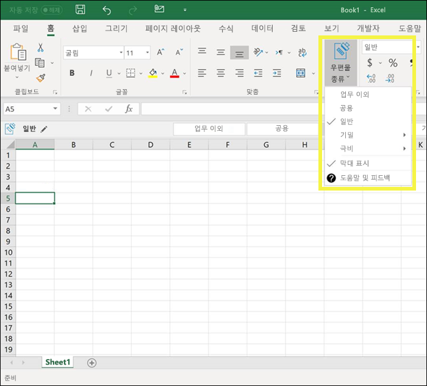

### Mac의 Office 앱Office apps on Mac

Mac 장치의 Office 앱에서 민감도 레이블은 리본의 **홈** 탭에 있는 **민감도** 단추에 표시됩니다. 적용된 레이블은 창 맨 아래의 상태 표시줄에도 표시됩니다.In Office apps on Mac devices, sensitivity labels appear on the **Sensitivity** button, on the **Home** tab on the Ribbon. The label applied also appears in the Status bar at the bottom of the window.

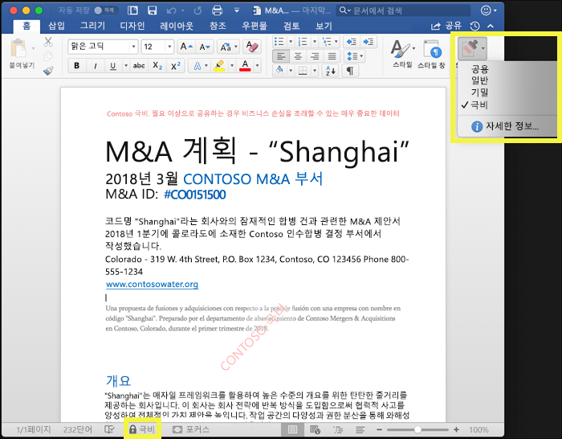

### iOS의 Office 앱Office apps on iOS

iOS 장치의 Office 앱에서 민감도 레이블은 리본의 **홈** 탭에 있는 **민감도** 단추에 표시됩니다. 적용된 레이블은 창 맨 아래의 상태 표시줄에도 표시됩니다.In Office apps on iOS devices, sensitivity labels appear on the **Sensitivity** button, on the **Home** tab on the Ribbon. The label applied also appears in the Status bar at the bottom of the window.

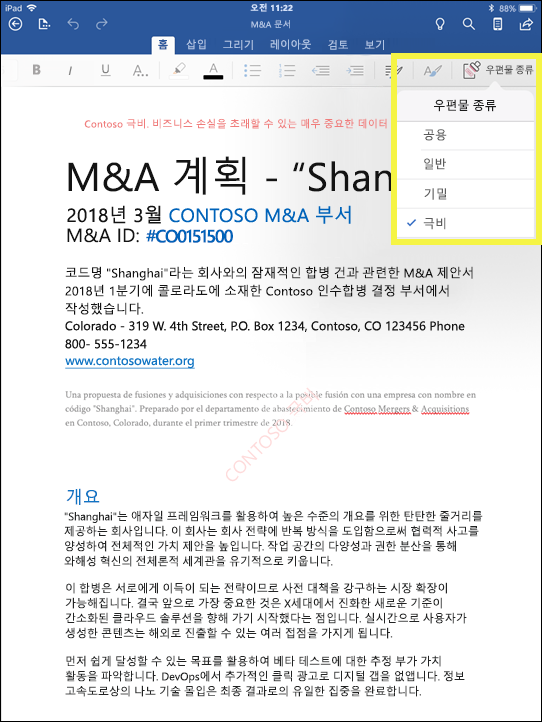

### Android의 Office 앱Office apps on Android

Android 장치의 Office 앱에서 민감도 레이블은 리본의 **홈** 탭에 있는 **민감도** 단추에 표시됩니다. 적용된 레이블은 창 맨 아래의 상태 표시줄에도 표시됩니다.In Office apps on Android devices, sensitivity labels appear on the **Sensitivity** button, on the **Home** tab on the Ribbon. The label applied also appears in the Status bar at the bottom of the window.

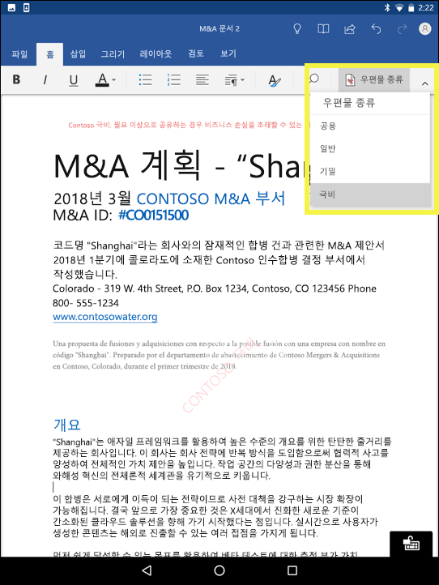

### Office 앱의 민감도 레이블에 대한 자세한 내용More information on sensitivity labels in Office apps

- [Office 내의 문서 및 전자 메일에 민감도 레이블 적용Apply sensitivity labels to your documents and email within Office](https://support.office.com/ko-KR/article/apply-sensitivity-labels-to-your-documents-and-email-within-office-2f96e7cd-d5a4-403b-8bd7-4cc636bae0f9)
- [Office 파일에 민감도 레이블을 적용할 때의 알려진 문제Known issues when you apply sensitivity labels to your Office files](https://support.office.com/ko-KR/article/known-issues-when-you-apply-sensitivity-labels-to-your-office-files-b169d687-2bbd-4e21-a440-7da1b2743edc)

## 민감도 레이블이 기존 Azure Information Protection 레이블에 작동하는 방식How sensitivity labels work with existing Azure Information Protection labels

Azure Information Protection 사용자는 현재 Azure Information Protection 통합 레이블 지정 클라이언트를 사용하여 Windows의 콘텐츠를 분류하고 레이블을 지정할 수 있습니다. 기존 Azure Information Protection 레이블은 새 민감도 레이블에만 원활하게 작동합니다. 따라서 다음을 수행할 수 있습니다.Azure Information Protection users are currently able to classify and label content on Windows by using the Azure Information Protection unified labeling client. Existing Azure Information Protection labels work seamlessly with new sensitivity labels. This means you can:

- 문서 및 전자 메일의 기존 Azure Information Protection 레이블을 유지합니다.Keep your existing Azure Information Protection labels on documents and email.
- 기존 Azure Information Protection 레이블 구성을 유지합니다.Keep your existing Azure Information Protection label configuration.

Azure Information Protection 레이블을 사용하는 경우, 마이그레이션을 완료한 이후까지 보안 및 준수 센터에서 새 레이블을 만들지 않는 것이 좋습니다. [Azure Information Protection 마이그레이션 항목](https://docs.microsoft.com/ko-KR/azure/information-protection/configure-policy-migrate-labels)에 중요한 정보 및 몇 가지 유의할 사항이 나와 있습니다. 아직 프로덕션 테넌트를 민감도 레이블로 마이그레이션할 준비가 되지 않았더라도 걱정할 필요가 없습니다. 당분간 사용자는 Azure Information Protection 클라이언트를 계속 사용할 수 있으며 관리자는 Azure Portal에서 계속 관리 작업을 수행할 수 있습니다.If you are using Azure Information Protection labels, for now we recommend that you avoid creating new labels in Security & Compliance Center until after you’ve completed your migration. The [Azure Information Protection migration topic](https://docs.microsoft.com/ko-KR/azure/information-protection/configure-policy-migrate-labels) has important information and some specific caveats. If you are not yet ready to migrate your production tenants to sensitivity labels, there is no cause for concern: for the moment, your users can continue using the Azure Information Protection client, and admins can continue using the Azure portal for management.

## Microsoft Intune의 엔드포인트 보호 기능을 사용하여 Windows 장치에서 콘텐츠 보호Protect content on Windows devices by using endpoint protection in Microsoft Intune

민감도 레이블을 만들 경우 이 레이블이 있는 파일이 중요하며, Windows 장치에 저장할 경우 데이터 누출로부터 보호해야 한다는 사실을 Windows 장치에 알려주는 옵션이 제공됩니다. 이 옵션을 사용하여 이 레이블이 있는 콘텐츠가 엔드포인트에 저장되어 있더라도 승인된 위치에만 공유 또는 복사하도록 할 수 있습니다. 기본적으로 민감도 레이블에 대해 이 옵션을 켜면 추가적인 사용 제약 조건을 보증하는 데 매우 중요한 데이터라는 것을 Windows에 알릴 수 있습니다.When you create a sensitivity label, you have the option to tell Windows that files with this label are sensitive and need to be protected against data leakage when stored on Windows devices. This option can help ensure that content with this label can be shared or copied only to sanctioned locations, even when it’s stored on an endpoint. In essence, turning on this option for a sensitivity label tells Windows that this is extra critical data that warrants additional usage constraints.

이 옵션을 설정하면 Windows는 문서의 민감도 레이블을 읽고, 이해하고, 관련 작업을 수행할 수 있으며, 관리되는 Windows 장치에 연결되는 방식에 관계없이, 콘텐트에 WIP(Windows Information Protection)를 자동으로 적용할 수 있습니다. 이를 통해 암호화 적용 여부에 관계없이, 레이블이 지정된 파일을 우연한 누출로부터 보호할 수 있습니다.When you turn on this option, Windows can read, understand, and act on sensitivity labels in documents and automatically apply Windows Information Protection (WIP) on content, no matter how it reaches a managed Windows device. This helps protect labeled files from accidental leakage, with or without applying encryption.

예를 들어 Windows는 사용자의 컴퓨터에 있는 Word 문서에 기밀 레이블이 적용되어 있음을 이해할 수 있고 WIP는 해당 디바이스에서 비작업 위치(예: 개인 OneDrive, 개인 전자 메일 계정, 소셜 미디어 또는 USB 드라이브)로 데이터를 복사 또는 공유하지 못하도록 하는 앱 보호 정책을 적용할 수 있습니다.For example, Windows can understand that a Word document residing on a user’s machine has a Confidential label applied to it, and WIP can apply an app protection policy to prevent the copying or sharing of the data to any non-work location from that device (such as a personal OneDrive, personal email accounts, social media, or USB drives).

사용자가 레이블이 지정된 콘텐츠를 개인 Gmail 계정에 업로드하려고 하면 이 메시지가 표시됩니다.If a user attempts to upload labeled content to a personal Gmail account, they see this message.

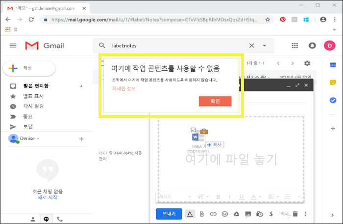

또한 사용자가 레이블이 지정된 콘텐츠를 USB 드라이브에 저장하려고 하면 다음 메시지가 표시됩니다.And if a user attempts to save labeled content to a USB drive, they see this message.

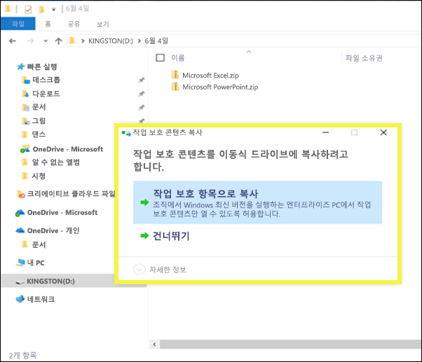

### 중요한 필수 구성 요소Important prerequisites

민감도 레이블이 WIP를 사용하려면, [Windows Information Protection이 민감도 레이블이 지정된 파일을 보호하는 방법](https://docs.microsoft.com/en-us/windows/security/information-protection/windows-information-protection/how-wip-works-with-labels?branch=vsts17546553)에 설명된 필수 구성 요소를 수행해야 합니다. 이 항목에서는 다음과 같은 필수 구성 요소에 대해 설명합니다.Before your sensitivity labels can use WIP, you first need to do the prerequisites described here: [How Windows Information Protection protects files with a sensitivity label](https://docs.microsoft.com/en-us/windows/security/information-protection/windows-information-protection/how-wip-works-with-labels?branch=vsts17546553). This topic describes the following prerequisites:

- Windows 10, 버전 1809 이상을 실행 중인지 확인합니다.Make sure you're running Windows 10, version 1809 or later.
- [WDATP(Windows Defender Advanced Threat Protection)를 설정](https://docs.microsoft.com/ko-KR/windows/security/threat-protection/windows-defender-atp/get-started)합니다. 이 기능은 콘텐츠에서 레이블을 검색하고 해당 WIP 보호를 적용합니다. ATP는 변칙 보고와 같은 일부 작업을 WIP와는 별도로 수행합니다.[Set up Windows Defender Advanced Threat Protection (WDATP)](https://docs.microsoft.com/ko-KR/windows/security/threat-protection/windows-defender-atp/get-started), which scans content for a label and applies the corresponding WIP protection. ATP performs some actions independently from WIP, such as reporting anomalies.
- 엔드포인트 장치에 적용되는 WIP(Windows Information Protection) 정책을 만듭니다. 다음 중 하나의 위치에서 이를 수행할 수 있습니다.Create a Windows Information Protection (WIP) policy that applies to endpoint devices. You can do this in either of these locations:
    - [Microsoft Intune용 Azure Portal을 사용하여 MDM으로 WIP(Windows Information Protection) 정책 만들기Create a Windows Information Protection (WIP) policy with MDM using the Azure portal for Microsoft Intune](https://docs.microsoft.com/ko-KR/windows/security/information-protection/windows-information-protection/create-wip-policy-using-intune-azure)
    - [System Center Configuration Manager를 사용하여 WIP(Windows Information Protection) 정책 만들기 및 배포Create and deploy a Windows Information Protection (WIP) policy using System Center Configuration Manager](https://docs.microsoft.com/ko-KR/windows/security/information-protection/windows-information-protection/create-wip-policy-using-sccm)

## Microsoft Information Protection SDK를 사용하여 타사 앱 및 서비스로 민감도 레이블 확장Extend sensitivity labels to third-party apps and services by using the Microsoft Information Protection SDK

민감도 레이블은 문서의 메타데이터에 일반 텍스트 형식으로 유지되므로 타사 앱 및 서비스에서 이러한 레이블이 포함된 콘텐츠의 식별 및 보호를 지원하도록 선택할 수 있습니다. 다른 앱 및 서비스의 지원도 항상 활장되고 있습니다.Because a sensitivity label is persisted as clear text in the metadata of a document, third-party apps and services can choose to support identifying and protecting content that contains such a label. Support in other apps and services is always expanding.

[Microsoft Information Protection SDK](https://docs.microsoft.com/ko-KR/information-protection/develop/)를 사용하여 타사 앱 및 서비스는 민감도 레이블 및 보호를 읽고 문서에 적용할 수 있습니다. 이 SDK는 Windows, Mac 및 Linux의 앱을 지원합니다. IOS 및 Android 앱도 곧 지원될 예정입니다.With the [Microsoft Information Protection SDK](https://docs.microsoft.com/ko-KR/information-protection/develop/), third-party apps and services can read and apply sensitivity labels and protection to documents. The SDK supports apps on Windows, Mac, and Linux. Coming soon is support for apps on iOS and Android.

이 SDK를 사용하여 Office 앱, Office 365 서비스, Azure Information Protection 검사 기능, Microsoft Cloud App Security 및 일부 기타 파트너 솔루션 등의 다른 Microsoft Information Protection 앱 및 서비스를 사용하는 방식으로 콘텐츠에 레이블을 지정하고 콘텐츠를 보호할 수 있습니다. 예를 들어, [Adobe Acrobat의 민감도 레이블 지원](https://techcommunity.microsoft.com/t5/Azure-Information-Protection/Starting-October-use-Adobe-Acrobat-Reader-for-PDFs-protected-by/ba-p/262738)에 대해 알아보세요.Using the SDK, you can label and protect content in a way that works with other Microsoft Information Protection apps and services, such as Office apps, Office 365 services, the Azure Information Protection scanner, Microsoft Cloud App Security, and several other partner solutions. For example, learn more about [support for sensitivity labels in Adobe Acrobat](https://techcommunity.microsoft.com/t5/Azure-Information-Protection/Starting-October-use-Adobe-Acrobat-Reader-for-PDFs-protected-by/ba-p/262738).

Microsoft Information Protection SDK에 대한 자세한 내용은 [기술 커뮤니티 블로그의 발표](https://techcommunity.microsoft.com/t5/Microsoft-Information-Protection/Microsoft-Information-Protection-SDK-Now-Generally-Available/ba-p/263144)를 참조하세요. [Microsoft Information Protection과 통합된 파트너 솔루션](https://techcommunity.microsoft.com/t5/Azure-Information-Protection/Microsoft-Information-Protection-showcases-integrated-partner/ba-p/262657)에 대해서도 알아볼 수 있습니다.To learn more about the Microsoft Information Protection SDK, see the [announcement on the Tech Community blog](https://techcommunity.microsoft.com/t5/Microsoft-Information-Protection/Microsoft-Information-Protection-SDK-Now-Generally-Available/ba-p/263144). You can also learn about [partner solutions that are integrated with Microsoft Information Protection](https://techcommunity.microsoft.com/t5/Azure-Information-Protection/Microsoft-Information-Protection-showcases-integrated-partner/ba-p/262657).

## 사용 권한Permissions

민감도 레이블을 만드는 규정 준수 팀의 구성원에게는 보안 및 준수 센터에 대한 권한이 필요합니다. 기본적으로 테넌트 관리자는 이 위치에 액세스할 수 있으며, 준수 관리자 및 기타 사용자에게 테넌트 관리를 위한 모든 권한을 부여하지는 않으면서, 보안 및 준수 센터에 대한 액세스 권한을 부여할 수 있습니다. 이렇게 하기 위해 보안 및 준수 센터의 **권한** 페이지로 이동한 후 **준수 관리자** 역할 그룹을 편집하고 해당 역할 그룹에 구성원을 추가하는 것이 좋습니다.Members of your compliance team who will create sensitivity labels need permissions to the Security & Compliance Center. By default, your tenant admin will have access to this location and can give compliance officers and other people access to the Security & Compliance Center, without giving them all of the permissions of a tenant admin. To do this, we recommend that you go to the **Permissions** page of the Security & Compliance Center, edit the **Compliance Administrator** role group, and add members to that role group.

자세한 내용은 사용자에게 Office 365 보안 및 준수 센터에 대한 액세스 권한 부여를 참조하세요.For more information, see Give users access to the Office 365 Security & Compliance Center.

이러한 정책은 레이블 및 레이블 정책을 만들고 적용하는 데만 필요합니다. 정책 적용을 위해서는 콘텐츠에 액세스하지 않아도 됩니다.These permissions are required only to create and apply labels and a label policy. Policy enforcement does not require access to the content.
