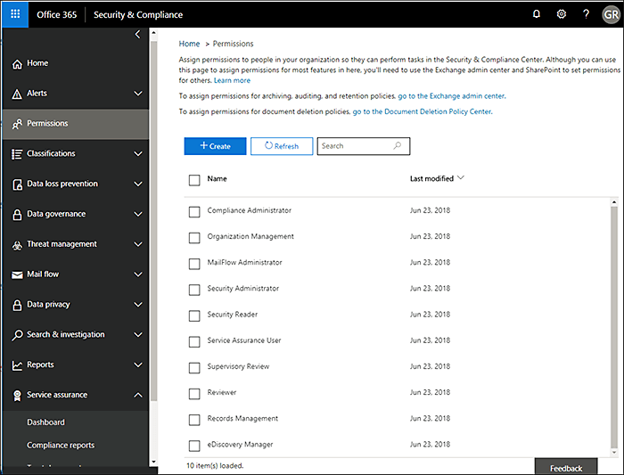

# Office 365 보안에 대 한 보증 서비스 &amp; 준수 센터

Office 365 보안에서 서비스 보증을 사용 하 여 &amp; 다양 한 항목을 포함 하 여 설명 하는 문서에 액세스 하려면 준수 센터: 
  
- Microsoft Office 365에 저장 된 고객 데이터에 대 한 보안 사례입니다. 
    
- Office 365의 보고서를 독립적으로 제 3 자 감사 합니다. 
    
- 구현 및 보안, 프라이버시 및 규정 준수 컨트롤에 대 한 테스트 세부 정보는 Office 365 데이터를 보호 하기 위해 사용 합니다. 
    
표준, 관련 법률, 및 규정 준수, 산업 분야와 같은 고객이 Office 365를 통해 하는 방법을 알아볼 수도 수는 있습니다.
  
-  국제 조직 표준화 27001 및 27018 (ISO) 
    
- HIPAA(Health Insurance Portability and Accountability Act of 1996)
    
- 연방 위험 및 권한 부여 관리 프로그램 (FedRAMP)
    
## Office 365 서비스 보증을 액세스할 수 있는 사용자 및 어떻게 합니까?

 **새로 고객과 Microsoft 온라인 서비스를 평가 하는 고객** Office 365 엔터프라이즈 E3 및 e 5 계획 (평가판 및 유료 구독)에 포함 된 서비스 보증에 액세스할 수 있습니다. 이러한 계획 중 하나를 사용할 서비스 보증을 시도 하려는 하지 경우 [Office 365 Enterprise e 5의 평가판 등록](https://go.microsoft.com/fwlink/p/?LinkID=698279)을 수 있습니다. 
  
 **비즈니스를 위한 Office 365의 기존 고객** 서비스 보증을 액세스할 수 있습니다. 조직에 있는 (회사 관리자가 라고도 함)는 Office 365 전역 관리자 인 경우 서비스 보증에 대 한 액세스를 이미 해야 하 고 있습니다 수 온보드 다른 사용자에 게 있습니다. 잘 Office 365 전역 관리자 조직에 대 한 보증 서비스에 액세스할 수 있어야 하는 경우 서비스 보증 사용자 역할 그룹에 추가 하 여 관리자에 게 문의 하십시오. 
  
 **O365 구독 구성원** 서비스 보증 역할 기반 액세스 구독에 구현 되지 않은 경우 기본적으로 서비스 보증 섹션 Office365 보호 센터에 액세스할 수 있습니다. 서비스 보증 보고서 및 Office 365에 저장 된 고객 데이터에 대 한 Microsoft의 보안 사례를 설명 하는 문서를 제공 합니다. 또한 Office 365에 독립적으로 제 3 자 감사 보고서를 제공 합니다. 
  
> [!NOTE]
> 참고: 하는 경우 회사 Service Assurance Roles-Based 대 한 액세스를 구현 하는 Office 365 구독 라이선스를 (있는 경우 조직 사용자 지정 보고서에 대 한 액세스 제공 되었습니다 수 있음)에서 하 고 보증 서비스에 대 한 액세스를 필요는 없지만 왼쪽에 포함 되지 않은 보안의 창 &amp; 준수 센터 **사용 권한** 페이지에서 서비스 보증 사용자 역할 그룹에 추가 하는 경우 Office 365 관리자에 게 문의 합니다. 자세한 내용은 다른 서비스 보증 사용자 또는 그룹에 온보드를 참조 하십시오. 
  
 **서비스 보증 역할 기반 액세스 프로 비전 된 사용자** 정보 보안 위험 관리, 준수를 포함 하는 모든 보안 및 규정 준수 담당자 서비스 보증 대 한 액세스를 제공 하 고 감사 팀 및 내 담당자 수 회사 서비스 보증 역할 기반 액세스를 구현 하는 경우에 조직입니다. 자세한 내용은 참조 [온보드 다른 서비스 보증 사용자 또는 그룹](service-assurance.md#addother)합니다.
  
보안을 사용 하 여 서비스 보증은 액세스할 수 있는 &amp; 준수 센터입니다. 여기에 방법은 다음과 같습니다.
  
1. 이동 [https://protection.office.com](https://protection.office.com)합니다.
    
2. 작업이 나 교육용 계정을 사용 하 여 Office 365에 로그인 합니다. 
    
3. 왼쪽된 창에서 **서비스 보증**을 선택 합니다. 다음을 [선택 하면 업계 및 국가별 설정](service-assurance.md#Chooseyourindustryregional) 및 [온보드 다른 서비스 보증 사용자 또는 그룹](service-assurance.md#addother)합니다.
    
    > [!NOTE]
    > 서비스 보증에 대 한 액세스 해야 하 고 보안의 왼쪽된 창에 포함 되지 않은 경우 &amp; 준수 센터 **사용 권한** 페이지에서 서비스 보증 사용자 역할 그룹에 추가 하는 경우 Office 365 관리자에 게 문의 합니다. 
  
## 업계 및 국가별 설정 선택

처음에 대 한 서비스 보증에 액세스 하면 업계 및 국가별 설정을 구성 하는 첫번째 단계가입니다. 언제 든 지 이러한 설정을 변경할 수 있습니다. 이러한 설정을 구성 하면 조직에 가장 관련이 있는 콘텐츠를 제공 하는 서비스 보증을 수 있습니다. 업계 및 지역 설정을 구성 합니다.
  
1. 서비스 보증을 액세스 한 후 다음 화면에 표시 된 것 처럼 페이지를 표시 하는 **설정** 및 지역 및 업계 설정을 선택 합니다. 
    
    
  
2. **설정** 페이지에서 **지역** 옆에 있는 아래쪽 화살표를 선택 하 고 조직에 대 한 적절 한 영역을 확인 합니다. 
    
3. **업계** 옆에 있는 아래쪽 화살표를 선택 하 고 조직에 대 한 적절 한 산업을 확인 합니다. 
    
4. 지역 및 산업을 선택한 후 **저장**을 선택 합니다.
    
## 찾기, 검토 및 규정 준수를 다운로드 및 콘텐츠를 신뢰 합니다.

검토 하 고 콘텐츠를 다운로드 하려면 탐색 창에서 옵션을 선택 합니다.
  
- 다음 화면에 표시 된 대로 독립 감사 하 고 Office 365 및 기타 Microsoft 클라우드 서비스에 대 한 평가 보려면 **준수 보고서** 샷 합니다. 
    
    
  
- 샷 다음 화면에 표시 된 것과 같이 Microsoft Office 365를 작동 하는 방법에 대 한 정보를 보려면 **문서를 신뢰** 합니다. 
    
    
  
- Office 365 제어 하는 방법에 대 한 정보를 볼 수 있는 **Audited 컨트롤** 나타내는 다음 스크린샷과 같이 보안과 규정 준수, 개인정보 보호 요구를 충족 합니다. 
    
    
  
다운로드, 하려는 보고서를 선택 하 고 사용자의 컴퓨터에 다운로드 하려면 **저장** 을 선택 합니다. Audited 컨트롤에 대 한 다음 **다운로드**를 선택 하 여 보고서를 선택 합니다. 아래 표에 각 서비스 보증 페이지에서 찾을 수 있는 보고서를 설명 합니다. 
  
> [!NOTE]
> 서비스 보증 보고서 및 문서를 게시 한 후 또는 문서의 새 버전을 사용할 수 있을 때까지 적어도 12 개월에 대 한 다운로드를 사용할 수 있는 합니다. 
  
|**서비스 보증 페이지**|**사용할 수 있는 콘텐츠**|**설명**|
|:-----|:-----|:-----|
|준수 보고서    | FedRamp     GRC 평가     ISO     SOC/SSAE    |서비스 준수 보고서를 사용 하 여 Office 365 서비스 배달 작업 독립 감사자 제 3 자에 의해 수행 되는 감사 평가 검토 합니다.    |
|트러스트 문서    | FAQ 및 백서     위험 관리 보고서    |백서, Faq, 년의 최종 보고서 및에서 사용할 수 있는 사용자 검토를 위해 비밀 유지 계약에 따라 / 위험 평가 하는 기타 3 비밀 우편 Microsoft 리소스를 사용 합니다.    |
|감사 컨트롤    |글로벌 표준 및 Office 365에서 구현한 규정 합니다.    | 도움말 (영문) 위험 요소 분석을 평가 하 고 때, 온 보 딩, 또는 Office 365 서비스를 사용 합니다. 알아 봐:     -어떻게 Office 365 모임 보안과 규정 준수, 개인정보 보호 요구를 제어합니다.   -에 대 한 Office 365에 있는 컨트롤의 테스트, 결과 이러한 테스트 및 완료 된 것입니다.    |
   
특정 사용자 설정에 따라 옵션 보기에 포함 된 약간의 차이가 있을 수 있습니다.
  
## 온보드 다른 서비스 보증 사용자 또는 그룹

모든 Microsoft 클라우드 구독에서 일반적으로 사용할 수 있는 기본 보고서에 액세스할 수 있도록, 서비스 보증 역할 기반 액세스 모델을 구현 하지 않아도 됩니다. 하 고이 단계를 건너뛸 수 있습니다. 그러나 조직은 사용자 지정 보고서에 대 한 액세스를 제공 하는 경우 다음 하십시오 다른 사용자 또는 그룹 추가 서비스 보증 역할을 합니다. 다른 사용자 또는 그룹을 추가 합니다.
  
1. 보안에서 &amp; 준수 센터, 다음 화면에 표시 된 대로 왼쪽된 창에서 **사용 권한** 을 선택 합니다. 
    
    
  
2. 오른쪽 창에서 **서비스 보증 사용자**선택 하 고 **역할 그룹 편집**선택 하 고 **구성원** 섹션에서 다음 스크린샷에 표시 된 대로 서비스 보증 사용자 역할에 구성원을 추가 하려면 **편집** 을 선택 합니다. 
    
    
  
3. 에 다음 대화 상자를 검색 하 고 개인 또는 서비스 보증 준수 보고서 보기 및 리소스를 신뢰 하는 그룹을 선택 하 고 확인 하 고 창의 오른쪽 위 모서리에 있는 **X** 를 클릭 하면 각 선택 영역에 대 한 **추가** 선택 하면 마친후 합니다. 
    
    
  
4. 모든 사용자 또는 서비스 보증 사용자 역할에 추가 하는 그룹 수 이제 서비스 보증을 찾아서 다운로드 보고서 및 기타 문서 보안에서 &amp; 준수 센터입니다.
    
언제 든 지 더 많은 사용자를 추가 하려면 **사용 권한** 페이지 돌아갑니다 또는 기존 오류를 제거 합니다. 
  
## 서비스 보증에 대 한 도움말 보기

[비즈니스 제품-관리자 도움말에 대 한 대화 상대 지원](https://support.office.com/article/32a17ca7-6fa0-4870-8a8d-e25ba4ccfd4b)합니다.
  
## 질문과 대답

 **문서 서비스 보증에서 손상 된 없다는 오류가 표시 이유는 무엇입니까?**
  
대부분의 서비스 보증 문서는 PDF 형식입니다. 이러한 파일을 저장 하려면 **저장** 을 선택한 다음 로컬 컴퓨터에서 엽니다. 
