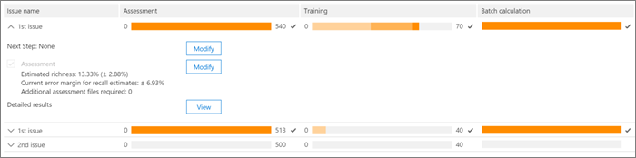
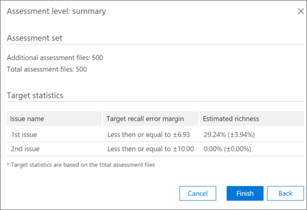

# Office 365 Advanced eDiscovery에서 태그 지정 및 평가Tagging and Assessment in Office 365 Advanced eDiscovery

> [!NOTE]
> Advanced eDiscovery를 사용하려면 Office 365 E3의 고급 준수 추가 기능이나 조직을 위한 E5 구독이 필요합니다. 이 요금제가 없는 상태에서 Advanced eDiscovery를 사용하려는 경우에는 [Office 365 Enterprise E5 평가판을 등록](https://go.microsoft.com/fwlink/p/?LinkID=698279)할 수 있습니다.Advanced eDiscovery requires an Office 365 E3 with the Advanced Compliance add-on or an E5 subscription for your organization. If you don't have that plan and want to try Advanced eDiscovery, you can [sign up for a trial of Office 365 Enterprise E5](https://go.microsoft.com/fwlink/p/?LinkID=698279). 
  
이 섹션에서는 고급 eDiscovery 관련성 평가 모듈의 절차에 대해 설명 합니다.This section describes the procedure for the Advanced eDiscovery Relevance Assessment module. 
  
## 평가 교육 및 분석 수행Performing Assessment training and analysis

1. \*\* \> 관련성 추적\*\* 탭에서 **평가** 를 클릭 하 여 사례 평가를 시작 합니다.In the **Relevance \> Track** tab, click **Assessment** to start case assessment. 
    
    이 절차의 목적을 예로 들면, 500 파일의 샘플 평가 집합을 만들고 태그 지정 패널, 표시 된 파일 콘텐츠 및 기타 태그 지정 옵션을 포함 하는 **Tag** 탭이 표시 됩니다.For example purposes in this procedure, a sample assessment set of 500 files is created and the **Tag** tab is displayed, which contains the Tagging panel, displayed file content and other tagging options. 
    
    
  
2. 예제에서 각 파일을 검토 하 고 각 사례 문제에 대 한 파일의 관련성을 확인 하 고 태그 지정 **패널** 창에서 관련성 (R), 관련 없음 (veiligheid) 및 Skip 단추를 사용 하 여 파일에 태그가 지정 됩니다.Review each file in the sample, determine the file's relevance for each case issue, and tag the file using the Relevance (R), Not relevant (NR) and Skip buttons in the **Tagging panel** pane. 
    
    > [!NOTE]
    >  평가에는 500 태그가 지정 된 파일이 필요 합니다.Assessment requires 500 tagged files. 파일을 "생략" 하면 더 많은 파일을 태그로 받게 됩니다.If files are "skipped", you will receive more files to tag. 
  
3. 샘플의 모든 파일에 태그를 지정 하 고 나면 **계산**을 클릭 합니다.After tagging all files in the sample, click **Calculate**. 
    
    평가 현재 오류 여백 및 다양성은 아래에 표시 된 것 처럼, 문제 당 세부 정보를 포함 하 여 **관련성 트랙** 탭에 계산 되어 표시 됩니다.The Assessment current error margin and richness are calculated and displayed in the **Relevance Track** tab, with expanded details per issue, as shown below. 이 대화 상자에 대 한 자세한 내용은 뒷부분에 나오는 "평가 결과 검토" 섹션에 설명 되어 있습니다.More details about this dialog are described in the later section "Reviewing Assessments results". 
    
    
  
    > [!TIP]
    > 기본적으로 문제에 대 한 평가 진행률 표시기가 완료 되 고 평가 샘플이 검토 되었으며 적절 한 관련 파일에 태그가 지정 되었음을 나타내는 경우에는 기본 다음 단계로 진행 하는 것이 좋습니다.By default, we recommend that you proceed to the default Next step when the Assessment progress indicator for the issue has completed, indicating that the assessment sample was reviewed and sufficient relevant files were tagged. > 그렇지 않고 **추적** 탭 결과를 확인 하 고 오류 여백 및 다음 단계를 제어 하려면 **다음 단계**옆에 있는 **수정을** 클릭 하 고 **평가 계속**을 선택한 다음 **확인**을 클릭 합니다.> Otherwise, if you want to view the **Track** tab results and control the margin of error and the next step, click **Modify** adjacent to **Next Step**, select **Continue assessment**, and then click **OK**. 
  
1. **평가** 확인란 오른쪽에 있는 **수정을** 클릭 하 여 문제 당 평가 매개 변수를 보고 지정 합니다.Click **Modify** to the right of the **Assessment** check box to view and specify assessment parameters per issue. 다음 예와 같이 각 문제에 대 한 **평가 수준** 대화 상자가 표시 됩니다.An **Assessment level** dialog for each issue is displayed, as shown in the following example: 
    
    
  
    문제에 대해 다음 매개 변수가 계산 되어 **평가 수준** 대화 상자에 표시 됩니다.The following parameters for the issue are calculated and displayed in the **Assessment level** dialog: 
    
    **회수 예측에 대 한 대상 오류 여백**:이 값에 따라 검토에 필요한 추가 파일의 예상 개수가 계산 됩니다.**Target error margin for recall estimates**: Based on this value, the estimated number of additional files necessary to review is calculated. 리콜에 사용 된 여백은 75%이 고 신뢰 수준이 95% 보다 큽니다.The margin used for recall is greater than 75% and with a 95% confidence level. 
    
    **추가 평가 파일 필요**: 현재 오류 여백의 요구 사항을 충족 하지 못한 경우 필요한 파일 수를 나타냅니다.**Additional assessment files required**: Indicates how many more files are necessary if the current error margin's requirements have not been met. 
    
2. 현재 오차 여백을 조정 하 고 각 문제에 대 한 다른 오류 여백의 영향을 확인 하려면 다음을 수행 합니다.To adjust the current error margin and see the effect of different error margins (per issue):
    
1. **문제점 선택** 목록에서 문제를 선택 합니다.In the **Select issue** list, select an issue. 
    
2. **회수 예측에 대 한 대상 오류 여백**에 새 값을 입력 합니다.In **Target error margin for recall estimates**, enter a new value.
    
3. **값 업데이트** 를 클릭 하 여 조정에 대 한 영향을 확인 합니다.Click **Update values** to see the impact of the adjustments. 
    
3. **평가 수준** 대화 상자에서 **고급** 을 클릭 하 여 다음과 같은 추가 매개 변수 및 세부 정보를 확인 합니다.Click **Advanced** in the **Assessment level** dialog to see the following additional parameters and details: 
    
    
  
    **예측 된 다양성**: 현재 평가 결과에 따라 예측 한 다양성**Estimated richness**: Estimated richness according to the current assessment results
    
    **가정으로 회수**: 기본적으로 대상 오류 여백은 75% 위의 리콜에 적용 됩니다.**For assumed recall**: By default, the target error margin applies to recall above 75%. 이 매개 변수를 변경 하 고 다른 회수 값 범위에서 오류 여백을 제어 하려면 **편집** 을 클릭 합니다.Click **Edit** if you want to change this parameter and control the margin of error on a different range of recall values. 
    
    **신뢰 수준**: 기본적으로 신뢰도에 대 한 권장 오차 여백은 95%입니다.**Confidence level**: By default, the recommended error margin for confidence is 95%. 이 매개 변수를 변경 하려면 **편집** 을 클릭 합니다.Click **Edit** if you want to change this parameter. 
    
    **예상 되는 오류 여백**: 업데이트 된 값이 제공 되 면, 모든 추가 평가 파일을 검토 한 후에는 풍부한 오류 여백이 됩니다.**Expected richness error margin**: Given the updated values, this is the expected margin of error of the richness, after all additional assessment files are reviewed.
    
    **추가 평가 파일 필요**: 업데이트 된 값이 제공 되 면 대상에 도달 하기 위해 검토 해야 하는 추가 평가 파일의 수입니다.**Additional assessment files required**: Given the updated values, the number of additional assessment files that need to be reviewed to reach the target.
    
    **필요한 평가 파일 개수**: 검토에 필요한 총 평가 파일 및 업데이트 된 값이 제공 됩니다.**Total assessment files required**: Given the updated values, total assessment files required for review.
    
    **평가 중인 관련 파일의 예상 개수**: 업데이트 된 값이 주어 지 며, 모든 추가 평가 파일을 검토 한 후에 전체 평가에서 예상 되는 관련 파일의 수입니다.**Expected number of relevant files in assessment**: Given the updated values, the expected number of relevant files in the entire assessment after all additional assessment files are reviewed.
    
4. 매개 변수가 변경 되 면 **값 다시 계산**을 클릭 합니다.Click **Recalculate values**, if parameters are changed. 작업이 완료 되 면 문제가 하나라도 발생 하면 **확인** 을 클릭 하 여 변경 내용을 저장 합니다 (또는 검토 하거나 수정 해야 하는 문제점이 여러 개 있는 경우에는 **다음** 에 **완료**).When you are done, if there is one issue, click **OK** to save the changes (or **Next** when there are multiple issues to review or modify and then **Finish**). 
    
    문제가 여러 개 있을 때 모든 문제가 검토 되거나 조정 되 면 다음 예제와 같이 **평가 수준: 요약** 대화 상자가 표시 됩니다.When there are multiple issues, after all issues have been reviewed or adjusted, an **Assessment level: summary** dialog is displayed, as shown in the following example. 
    
    
  
    평가가 성공적으로 완료 되 면 관련성 교육의 다음 단계로 진행 합니다.Upon successful completion of assessment, proceed to the next stage in Relevance training.
    
## 평가 결과 검토Reviewing assessment results

평가 샘플에 태그가 지정 되 면 평가 결과가 계산 되어 관련성 추적 탭에 표시 됩니다.After an Assessment sample is tagged, the assessment results are calculated and displayed in the Relevance Track tab.
  
확장 된 트랙 표시에는 다음과 같은 결과가 표시 됩니다.The following results are displayed in the expanded Track display: 
  
- 재호출 예측에 대 한 현재 오류 여백 평가Assessment current error margin for recall estimates
    
- 예측 한 다양성Estimated richness
    
- 추가 평가 파일 필요 (검토를 위해)Additional assessment files required (for review)
    
평가 현재 오류 여백은 고급 eDiscovery에서 권장 하는 오류 여백입니다.The Assessment current error margin is the error margin recommended by Advanced eDiscovery. "필요한 추가 평가 파일"에 표시 되는 번호는 해당 권장 사항에 해당 합니다.The number displayed for the "Additional assessment files required" corresponds to that recommendation.
  
평가 진행률 표시기에는 현재 오류 여백이 지정 된 평가 완료 수준이 표시 됩니다.The Assessment progress indicator shows the level of completion of the assessment, given the current error margin. 평가가 진행 되 면 사용자는 다른 평가 샘플에 태그를 표시 합니다.When assessment is underway, the user will tag another assessment sample.
  
평가 진행률 표시기에서 평가가 완료 된 것으로 표시 되 면 평가 샘플 검토가 완료 되었으며 관련 파일에 태그가 지정 된 충분 합니다.When the assessment progress indicator shows assessment as complete, that means the assessment sample review was completed and sufficient relevant files were tagged. 
  
확장 된 트랙 표시에는 다음 단계, 평가 통계 및 자세한 결과 액세스에 대 한 권장 정보가 표시 됩니다.The expanded Track display shows the recommended next step, the assessment statistics, and access to detailed results.
  
다양성을 아주 적게 사용할 경우 유용한 통계를 생성 하기 위해 최소한의 관련 파일에 연결 하는 데 필요한 추가 평가 파일의 수는 매우 높습니다.When richness is very low, the number of additional assessment files needed to reach a minimal number of relevant files to produce useful statistics is very high. 고급 eDiscovery는 교육으로 이동 하는 것이 좋습니다.Advanced eDiscovery will then recommend moving on to training. 평가 진행률 표시기는 회색으로 표시 되며 통계를 사용할 수 없습니다.The assessment progress indicator will be shaded, and no statistics will be available. 
  
통계적으로 기반 하는 안정화가 없으면 더 낮은 수준의 정확성과 신뢰 수준이 적용 됩니다.In the absence of statistically based stabilization, there will be results with a lower level of accuracy and confidence level. 그러나 찾은 관련 파일의 비율을 알 필요가 없는 경우 이러한 결과를 사용 하 여 관련 파일을 찾을 수 있습니다.However, these results can be used to find relevant files when you do not need to know the percentage of relevant files found. 마찬가지로이 상태를 사용 하 여 특정 문제와 관련 된 파일에 대 한 액세스를 가속화 하는 낮은 다양성의 문제를 교육할 수 있습니다.Similarly, this status can be used to train issues with low richness, where Relevance scores can accelerate access to files relevant to a specific issue.
  
> [!TIP]
> \*\* \> 관련성 트랙\*\* 탭에 확장 된 문제가 표시 되 면 다음 보기 옵션을 사용할 수 있습니다. 다음 단계를 > (문제 당) **태그** 를 무시할 수 있습니다. \*\*\*\* 오른쪽으로 이동 하 고 **다음 단계**에서 다른 단계를 선택 합니다.In the **Relevance \> Track** tab, expanded issue display, the following viewing options are available: > The recommended next step, such as **Next step: Tagging** can be bypassed (per issue) by clicking the **Modify** button to its right, and then selecting an different step in the **Next step**. 평가 진행률 표시기가 완료 되지 않은 경우 평가는 다음 옵션을 통해 더 많은 평가 파일에 태그를 추가 하 고 통계 정확성을 높이는 것이 좋습니다.When the assessment progress indicator has not completed, assessment will be the next recommended option, to tag more assessment files and increase statistics accuracy. > **수정을**클릭 하 고, **평가 수준 대화 상자**에서 **회수 예측에 대 한 대상 오류 여백을**변경 하 고 **값 업데이트**를 클릭 하 여 오류 여백을 변경 하 고 해당 영향을 평가할 수 있습니다.> You can change the error margin and assess its impact, by clicking **Modify**, and in the **Assessment level dialog**, changing the **Target error margin for recall estimates**, and clicking **Update values**. 또한이 대화 상자에서 고급을 클릭 하 여 고급 옵션을 볼 \*\*\*\* 수 있습니다.Also, in this dialog, you can view advanced options, by clicking **Advanced**. > **보기**를 클릭 하 여 추가 평가 수준 통계 및 해당 영향을 볼 수 있습니다.> You can view additional assessment level statistics and their impact by clicking **View**. 표시 된 세부 결과 대화 상자에서 최소 500 태그가 지정 된 평가 파일이 있고 최소 18 개 파일에 문제에 대 한 태그가 지정 된 경우 문제 당 통계를 사용할 수 있습니다.In the displayed Detail results dialog, statistics are available per issue, when there are at least 500 tagged assessment files and at least 18 files are tagged as Relevant for the issue. 
  
## 참고 항목See also

[Office 365 Advanced eDiscoveryOffice 365 Advanced eDiscovery](office-365-advanced-ediscovery.md)
  
[관련성 평가 이해Understanding Assessment in Relevance](assessment-in-relevance-in-advanced-ediscovery.md)
  
[태그 지정 및 관련성 교육Tagging and Relevance training](tagging-and-relevance-training-in-advanced-ediscovery.md)
  
[관련성 분석 추적Tracking Relevance analysis](track-relevance-analysis-in-advanced-ediscovery.md)
  
[결과를 기준으로 결정Deciding based on the results](decision-based-on-the-results-in-advanced-ediscovery.md)
  
[관련성 분석 테스트Testing Relevance analysis](test-relevance-analysis-in-advanced-ediscovery.md)

