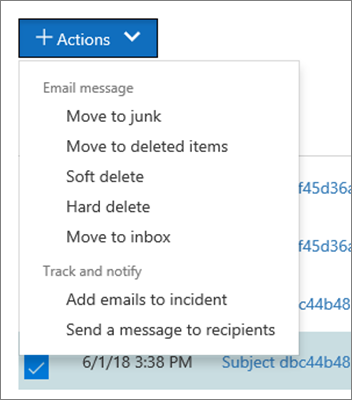

# 위협 탐색기 및 실시간 검색의 보기Views in Threat Explorer and real-time detections

[위협 탐색기](use-explorer-in-security-and-compliance.md) 실시간 검색 보고서는 보안 운영 팀에서 보안 &amp; 및 준수 센터의 위협에 대해 조사 하 고 대응 하는 데 도움이 되는 강력 하 고도 비슷한 실시간 도구입니다.[Threat Explorer](use-explorer-in-security-and-compliance.md) (and the real-time detections report) is a powerful, near real-time tool to help Security Operations teams investigate and respond to threats in the Security &amp; Compliance Center. Explorer (and 실시간 검색 보고서)에는 조직에 대 한 기타 보안 위협 및 위험 뿐 아니라 전자 메일 및 Office 365의 파일에 있는 의심 스러운 맬웨어 및 피싱에 대 한 정보가 표시 됩니다.Explorer (and the real-time detections report) displays information about suspected malware and phish in email and files in Office 365, as well as other security threats and risks to your organization. 

- [Office 365 ATP (Advanced Threat Protection](office-365-atp.md) ) 계획 2가 있는 경우 Explorer를 사용할 수 있습니다.If you have [Office 365 Advanced Threat Protection](office-365-atp.md) (ATP) Plan 2, then you have Explorer.
- Office 365 ATP 계획 1을 사용 하는 경우에는 실시간 검색이 가능 합니다.If you have Office 365 ATP Plan 1, then you have real-time detections.

Explorer (또는 실시간 검색 보고서)를 처음으로 열면 기본 보기에는 최근 7 일간의 전자 메일 맬웨어 검색이 표시 됩니다.When you first open Explorer (or the real-time detections report), the default view shows email malware detections for the past 7 days. [안전한 링크](atp-safe-links.md)에서 검색 되는 악성 Url, [안전한 첨부 파일](atp-safe-attachments.md)에서 검색 된 악의적인 파일 등의 ATP 검색이이 보고서에 표시 될 수도 있습니다.This report can also show ATP detections, such as malicious URLs detected by [Safe Links](atp-safe-links.md), and malicious files detected by [Safe Attachments](atp-safe-attachments.md). 평가판 구독을 사용 하는 경우가 아니면이 보고서를 수정 하 여 최근 30 일간의 데이터를 표시할 수 있습니다.This report can be modified to show data for the past 30 days (unless you are using a trial subscription). 평가판 구독에는 최근 7 일간의 데이터만 포함 됩니다.Trial subscriptions will include data for the past seven days only.

표시 되는 정보를 변경 하려면 **보기** 메뉴를 사용 합니다.Use the **View** menu to change what information is displayed. 도구 설명은 사용할 보기를 결정 하는 데 도움이 됩니다.Tooltips help you determine which view to use.
  

보기를 선택한 후에는 필터를 적용 하 고 추가 분석을 수행 하도록 쿼리를 설정할 수 있습니다.Once you have selected a view, you can apply filters and set up queries to conduct further analysis. 다음 섹션에서는 Explorer (또는 실시간 검색)에서 사용할 수 있는 다양 한 보기에 대 한 간략 한 개요를 제공 합니다.The following sections provide a brief overview of the various views available in Explorer (or real-time detections).  

## 전자 메일 > 맬웨어Email > Malware

이 보고서를 보려면 Explorer (또는 실시간 검색)에서**전자 메일** > **맬웨어** **보기** > 를 선택 합니다.To view this report, in Explorer (or real-time detections), choose **View** > **Email** > **Malware**. 이 보기에는 맬웨어를 포함 하는 것으로 확인 된 전자 메일 메시지에 대 한 정보가 표시 됩니다.This view shows information about email messages that were identified as containing malware.  

 

**보낸 사람** 을 클릭 하 여 보기 옵션 목록을 엽니다.Click **Sender** to open your list of viewing options. 이 목록을 사용 하 여 보낸 사람, 받는 사람, 보낸 사람 도메인, 제목, 검색 기술, 보호 상태 등의 데이터를 볼 수 있습니다.Use this list to view data by sender, recipients, sender domain, subject, detection technology, protection status, and more. 

예를 들어 검색 된 전자 메일 메시지에서 어떤 작업이 수행 되었는지 확인 하려면 목록에서 **보호 상태** 를 선택 합니다.For example, to see what actions were taken on detected email messages, choose **Protection status** in the list. 옵션을 선택한 다음 새로 고침 단추를 클릭 하 여 보고서에 해당 필터를 적용 합니다.Select an option, and then click the Refresh button to apply that filter to your report.

차트 아래에서 특정 메시지에 대 한 세부 정보를 확인 합니다.Below the chart, view more details about specific messages. 목록에서 항목을 선택 하면 선택한 항목에 대 한 자세한 정보를 볼 수 있는 플라이 아웃 창이 열립니다.When you select an item in the list, a fly-out pane opens, where you can learn more about the item you selected. 

## 전자 메일 > 피싱Email > Phish

이 보고서를 보려면 Explorer (또는 실시간 검색)에서**전자 메일** > **피싱** **보기** > 를 선택 합니다.To view this report, in Explorer (or real-time detections), choose **View** > **Email** > **Phish**. 이 보기에는 피싱 시도로 식별 된 전자 메일 메시지가 표시 됩니다.This view shows email messages identified as phishing attempts.  

 

**보낸 사람** 을 클릭 하 여 보기 옵션 목록을 엽니다.Click **Sender** to open your list of viewing options. 이 목록을 사용 하 여 보낸 사람, 받는 사람, 보낸 사람 도메인, 보낸 사람 IP, URL 도메인 별로 데이터를 확인 하 고 결과 등을 클릭 합니다.Use this list to view data by sender, recipients, sender domain, sender IP, URL domain, click verdict, and more. 

예를 들어 사용자가 피싱 시도로 식별 된 Url을 클릭 했을 때 수행한 작업을 확인 하려면 목록에서 **결과 클릭** 을 선택 하 고 옵션을 하나 이상 선택 하 고 새로 고침 단추를 클릭 합니다.For example, to see what actions were taken when people clicked on URLs that were identified as phishing attempts, choose **Click verdict** in the list, select one or more options, and then click the Refresh button.

차트 아래에서 특정 메시지, URL 클릭, Url 및 전자 메일 원본에 대 한 세부 정보를 확인 합니다.Below the chart, view more details about specific messages, URL clicks, URLs, and email origin. 

검색 된 URL과 같은 목록에서 항목을 선택 하는 경우 선택한 항목에 대 한 자세한 내용을 확인할 수 있는 플라이 아웃 창이 열립니다.When you select an item in the list, such as a URL that was detected, a fly-out pane opens, where you can learn more about the item you selected. 

## 전자 메일 > 사용자가 보고 됨Email > User-reported

이 보고서를 보려면 Explorer (또는 실시간 검색)에서**사용자가 보고**한**전자 메일** >  **보기** > 를 선택 합니다.To view this report, in Explorer (or real-time detections), choose **View** > **Email** > **User-reported**. 이 보기에는 사용자가 정크 메일로 보고 되거나, 정크 메일, 피싱 전자 메일이 표시 됩니다.This view shows email that users have reported as junk, not junk, or phishing email. 

 

**보낸 사람** 을 클릭 하 여 보기 옵션 목록을 엽니다.Click **Sender** to open your list of viewing options. 이 목록을 사용 하 여 보낸 사람, 받는 사람, 보고서 유형 (사용자가 정크 메일 인지, 정크 메일이 아님, 피싱 인지를 결정) 등의 정보를 볼 수 있습니다.Use this list to view information by sender, recipients, report type (the user's determination that the email was junk, not junk, or phish), and more. 

예를 들어 피싱 시도로 보고 된 전자 메일 메시지에 대 한 정보를 보려면 **Sender** > **Report type**을 클릭 하 고 **피싱**를 선택한 다음 새로 고침 단추를 클릭 합니다.For example, to view information about email messages that were reported as phishing attempts, click **Sender** > **Report type**, select **Phish**, and then click the Refresh button.

차트 아래에 있는 특정 전자 메일 메시지에 대 한 세부 정보 (예: 제목 줄, 보낸 사람의 IP 주소, 메시지를 정크로 보고 한 사용자, 정크 메일, 피싱 등)를 자세히 확인 합니다.Below the chart, view more details about specific email messages, such as subject line, the sender's IP address, the user that reported the message as junk, not junk, or phish, and more. 

목록에서 항목을 선택 하 여 추가 세부 정보를 확인 합니다.Select an item in the list to view additional details.

## 전자 메일 > 모든 전자 메일Email > All email

이 보고서를 보려면 탐색기에서**전자** > 메일**모든 메일** **보기** > 를 선택 합니다.To view this report, in Explorer, choose **View** > **Email** > **All mail**. 이 보기에는 모든 비 악성 메일 (일반 전자 메일, 스팸 및 대량 메일)과 마찬가지로 피싱 또는 맬웨어로 인 한 악성 전자 메일을 비롯 한 전자 메일 활동의 모든 보기가 표시 됩니다.This views shows an all-up view of email activity, including email identified as malicious due to phishing or malware, as well all non-malicious mail (normal email, spam, and bulk mail). 

> [!NOTE]
> **너무 많은 데이터를 표시 하는 데**오류가 발생 하는 경우 필터를 추가 하 고 필요한 경우 보고 있는 날짜 범위를 좁힐 수 있습니다.If you get an error that reads **Too much data to display**, add a filter and, if necessary, narrow the date range you're viewing. 

필터를 적용 하려면 **보낸 사람**을 선택 하 고 목록에서 항목을 선택한 다음 새로 고침 단추를 클릭 합니다.To apply a filter, choose **Sender**, select an item in the list, and then click the Refresh button. 이 예제에서는 **검색 기술을** 필터로 사용 했으며 몇 가지 옵션을 사용할 수 있습니다.In our example, we used **Detection technology** as a filter (there are several options available). 보낸 사람, 보낸 사람의 도메인, 받는 사람, 제목, 첨부 파일 이름, 맬웨어 제품군, 보호 상태 (Office 365의 위협 보호 기능 및 정책에 따라 수행 된 작업), 검색 기술 (맬웨어 감지 방법) 및 자세한.View information by sender, sender's domain, recipients, subject, attachment filename, malware family, protection status (actions taken by your threat protection features and policies in Office 365), detection technology (how the malware was detected), and more. 

 

차트 아래에 제목 줄, 받는 사람, 보낸 사람, 상태 등의 특정 전자 메일 메시지에 대 한 세부 정보를 확인 합니다.Below the chart, view more details about specific email messages, such as subject line, recipient, sender, status, and so on. 

## 콘텐츠 > 맬웨어Content > Malware

이 보고서를 보려면 Explorer (또는 실시간 검색)에서**콘텐츠** > **맬웨어** **보기** > 를 선택 합니다.To view this report, in Explorer (or real-time detections), choose **View** > **Content** > **Malware**. 이 보기는 [SharePoint Online, 비즈니스용 OneDrive 및 Microsoft 팀의 Office 365 Advanced Threat Protection에서](atp-for-spo-odb-and-teams.md)악의적으로 식별 된 파일을 보여 줍니다.This view shows files that were identified as malicious by [Office 365 Advanced Threat Protection in SharePoint Online, OneDrive for Business, and Microsoft Teams](atp-for-spo-odb-and-teams.md).

맬웨어 제품군, 검색 기술 (맬웨어가 감지 된 방법) 및 작업 (OneDrive, SharePoint 또는 팀)을 통해 정보를 확인 합니다.View information by malware family, detection technology (how the malware was detected), and workload (OneDrive, SharePoint, or Teams). 

  

차트 아래에서 첨부 파일 이름, 작업, 파일 크기, 파일을 마지막으로 수정한 사용자 등 특정 파일에 대 한 세부 정보를 확인 합니다.Below the chart, view more details about specific files, such as attachment filename, workload, file size, who last modified the file, and more. 
  
## 간편 필터 기능Click-to-filter capabilities

탐색기 (및 실시간 검색)를 사용 하 여 클릭 한 번으로 필터를 적용할 수 있습니다.With Explorer (and real-time detections), you can apply a filter in a click. 범례에서 항목을 클릭 하면 해당 항목이 보고서에 대 한 필터가 됩니다.Click an item in the legend, and that item becomes a filter for the report. 예를 들어 Explorer에서 맬웨어 보기를 보고 있다고 가정 합니다.For example, suppose we are looking at the Malware view in Explorer:
  

  
이 차트에서 **ATP 샌드 박싱** 를 클릭 하면 다음과 같은 보기가 만들어집니다.Clicking **ATP Detonation** in this chart results in a view like this: 
  

  
이 보기에서는 [Office 365 ATP 안전한 첨부](atp-safe-attachments.md)파일에서 열 된 파일에 대 한 데이터를 살펴봅니다.In this view, we are now looking at data for files that were detonated by [Office 365 ATP Safe Attachments](atp-safe-attachments.md). 이 차트 아래에서 ATP 안전한 첨부 파일에 의해 검색 된 첨부 파일이 있는 특정 전자 메일 메시지에 대 한 세부 정보를 확인할 수 있습니다.Below the chart, we can see details about specific email messages that had attachments that were detected by ATP Safe Attachments.
  

  
항목을 하나 이상 선택 하면 선택한 항목에 대해 선택할 수 있는 여러 선택 항목이 제공 되는 **작업** 메뉴가 활성화 됩니다.Selecting one or more items activates the **Actions** menu, which offers several choices from which to choose for the selected item(s). 
  

  
클릭 하 고 특정 세부 정보로 탐색 하는 기능을 통해 위협을 조사 하는 데 많은 시간을 절약할 수 있습니다.The ability to filter in a click and navigate to specific details can save you a lot of time in investigating threats.

## 쿼리 및 필터Queries and filters

Explorer (및 실시간 검색 보고서)에는 상위 대상 사용자, 최고 맬웨어 제품군, 검색 기술 등의 세부 정보를 확인할 수 있는 몇 가지 강력한 필터 및 쿼리 기능이 있습니다.Explorer (and the real-time detections report) has several powerful filters and querying capabilities that enable you to drill into details, such as top targeted users, top malware families, detection technology and more. 각 보고서 종류에서는 다양 한 방식으로 데이터를 보고 탐색할 수 있습니다.Each kind of report offers a variety of ways to view and explore data.

> [!IMPORTANT]
> 검색에 대 한 쿼리 표시줄 (또는 실시간 검색)에 별표 (\*) 또는 물음표 (?)와 같은 와일드 카드 문자를 사용 하지 마십시오.Do not use wildcard characters, such as an asterisk (\*) or a question mark (?), in the query bar for Explorer (or real-time detections). 전자 메일 메시지의 제목 필드를 검색 하면 Explorer (또는 실시간 검색)에서 부분 일치를 수행 하 고 와일드 카드 검색과 비슷한 결과를 반환 합니다.When you search on the Subject field for email messages, Explorer (or real-time detections) will perform partial matching and yield results similar to a wildcard search.
