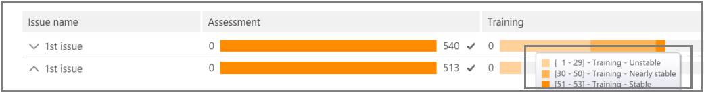
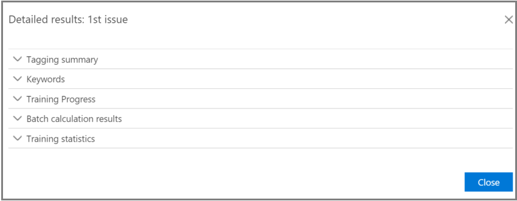

# Office 365 Advanced eDiscovery에서 관련성 분석 추적Track Relevance analysis in Office 365 Advanced eDiscovery

> [!NOTE]
> Advanced eDiscovery를 사용하려면 Office 365 E3의 고급 준수 추가 기능이나 조직을 위한 E5 구독이 필요합니다. 이 요금제가 없는 상태에서 Advanced eDiscovery를 사용하려는 경우에는 [Office 365 Enterprise E5 평가판을 등록](https://go.microsoft.com/fwlink/p/?LinkID=698279)할 수 있습니다.Advanced eDiscovery requires an Office 365 E3 with the Advanced Compliance add-on or an E5 subscription for your organization. If you don't have that plan and want to try Advanced eDiscovery, you can [sign up for a trial of Office 365 Enterprise E5](https://go.microsoft.com/fwlink/p/?LinkID=698279). 
  
고급 eDiscovery에서 관련성 추적 탭에는 태그 탭에서 수행 되는 관련성 학습의 계산 된 유효성이 표시 되며, 반복적인 교육 프로세스를 관련성이 있는 다음 단계를 나타냅니다.In Advanced eDiscovery, the Relevance Track tab displays the calculated validity of the Relevance training performed in the Tag tab and indicates the next step to take in the iterative training process in Relevance. 
  
## 관련성 교육 상태 추적Tracking Relevance training status

1. 아래 **문제 이름** 대화 상자와 같이 사례 문제에 대 한 관련성 추적에서 다음 세부 정보를 확인 합니다.View the following details in Relevance Track for the case issues, as shown in the following example of an **Issue name** dialog below. 
    
  - **평가**:이 지점에 대해 수행 된 관련성 교육이 오류 여백 측면에서 평가 목표를 달성 한 정도를 보여 주는이 진행률 표시기가 표시 됩니다. 관련성 교육 결과의 다양성도 표시 됩니다.**Assessment**: This progress indicator shows to what degree the Relevance training performed to this point has achieved the assessment target in terms of margin of error. The richness of the Relevance training results is also displayed. 
    
  - **교육**:이 색으로 구분 된 진행률 표시기 및 도구 설명 표시는 관련성 성향 습득 결과 안정성 및 각 문제에 대해 태그가 지정 된 관련성 교육 샘플의 수를 보여 주는 수치 배율을 나타냅니다. 전문가는 반복적인 관련성 교육 프로세스의 진행 상태를 모니터링 합니다.**Training**: This color-coded progress indicator and tool-tip display indicates the Relevance training results stability and a numeric scale showing the number of Relevance training samples tagged for each issue. The expert monitors the progress of the iterative Relevance training process. 
    
  - **일괄 처리**:이 진행률 표시기는 일괄 처리를 완료 하는 방법에 대 한 정보를 제공 합니다.**Batch calculation**: This progress indicator provides information about the completion of Batch calculation.
    
  - **다음 단계**: 수행할 다음 단계에 대 한 권장 사항을 표시 합니다.**Next step**: Displays the recommendation for the next step to be performed. 
    
    이 예제에서는 완료 된 색 진행률 표시기와 확인 표시가 표시 된 문제에 대 한 성공적인 평가가 표시 됩니다. 태깅이 진행 중이지만 대/소문자가 여전히 불안정 한 것으로 간주 됩니다 (도구 설명에도 안정성 상태에 표시 됨). 다음 단계 권장 구성은 "교육"입니다.In the example, a successfully completed Assessment for an issue is shown, indicated by the completed color progress indicator and the checkmark. Tagging is underway, but the case is still considered unstable (stability status also shown in a tool-tip). The next step recommendation is "Training". 
    
    
  
    확장 된 보기에는 추가 정보와 옵션이 표시 됩니다. 표시 된 현재 오류 여백은 기존 (태그가 지정 된) 평가 파일을 기준으로 현재 평가 상태의 리콜에 대 한 오류 여백입니다.The expanded view displays additional information and options. The displayed current error margin is the error margin of the recall in the current state of assessment, given the existing (already tagged) assessment files.
    
    > [!NOTE]
    >  각 문제에 대해 **평가** 확인란을 지우고 "모든 문제"를 확인 하 여 평가 단계를 무시할 수 있습니다. 그러나 따라서이 문제에 대 한 통계가 제공 되지 않습니다. **평가** 를 수행 하기 전에 > 확인 확인란을 선택 해야 합니다. 사례에 여러 문제가 있는 경우 각 문제에 대해 확인란이 선택 취소 되어 있는 경우에만 평가를 무시 합니다.The Assessment stage can be bypassed by clearing the **Assessment** check box per issue and then for "all issues". However, as a result, there will be no statistics for this issue. > Clearing the **Assessment** check box can only be done before assessment is performed. Where multiple issues exist in a case, assessment is bypassed only if the check box is cleared for each issue 
  
    첫 번째 샘플 파일 집합을 사용 하 여 평가가 완료 되지 않으면 더 많은 파일에 태그를 지정 하는 다음 단계가 평가에 포함 될 수 있습니다.When assessment is not completed with the first sample set of files, assessment might be the next step for tagging more files. 
    
    **관련성** \> **추적**에서 교육 진행률 표시기 및 도구-팁은 안정성을 달성 하는 데 필요한 추가 샘플의 예상 수를 나타냅니다. 이 추정치는 필요한 추가 교육에 대 한 지침을 제공 합니다.In **Relevance** \> **Track**, the training progress indicator and tool-tip indicate the estimated number of additional samples needed to reach stability. This estimate provides a guideline for the additional training needed.
    
    
  
2. 태그를 완성 하 고 훈련을 계속 해야 하는 경우 **교육**을 클릭 합니다. 추가 교육을 위해 로드 된 파일 집합에서 또 다른 샘플 파일 집합이 생성 됩니다. 그런 다음 태그 탭으로 다시 반환 되어 더 많은 파일을 태그를 추가 하 고 학습 합니다.When you're done tagging and if you need to continue training, click **Training**. Another sample set of files is generated from the loaded file set for additional training. You are then returned to the Tag tab to tag and train more files.
    
### 안정적인 교육 수준에 도달한 경우Reaching stable training levels

평가 파일에서 안정적인 교육 수준을 획득 한 후에는 고급 eDiscovery를 통해 일괄 계산할 수 있습니다.After the assessment files have attained a stable level of training, Advanced eDiscovery is ready for Batch calculation.
  
> [!NOTE]
> 일반적으로 3 개의 안정적인 교육 샘플이 발생 한 후에는 다음 단계는 "일괄 계산"입니다. 예를 들어 이전 예제에서 파일 태그를 변경 하거나 시드 파일을 추가한 경우에는 예외가 있을 수 있습니다.Usually, after three stable training samples, the next step is "Batch calculation". There may be exceptions, for example, when there were changes to the tagging of files from earlier samples or when seed files were added. 
  
### 일괄 계산 수행Performing Batch calculation

훈련을 성공적으로 완료 한 후에 일괄 처리는 다음 단계로 실행 됩니다 (안정적인 교육 상태를 진행률 표시줄로 표시 하는 경우 도구 설명에 확인 표시가 있고 안정적인 상태). 일괄 처리는 파일의 관련성을 평가 하 고 관련성 점수를 할당 하기 위해 전체 파일 채우기에 대 한 관련성 훈련 동안 얻은 정보를 적용 합니다.Batch calculation is executed as the next step after training is successfully completed (when a stable training status is shown by the progress bar, a checkmark and stable status in the tool-tip.) Batch calculation applies the knowledge acquired during the Relevance training to the entire file population, to assess the files' relevance and to assign Relevance scores.
  
문제가 두 개 이상 있으면 각 문제에 대 한 일괄 처리를 수행 합니다. 일괄 계산을 수행 하는 동안 모든 파일을 처리 하는 동안 진행률이 모니터링 됩니다.When there is more than one issue, Batch calculation is done per issue. During Batch calculation, progress is monitored while processing all of the files. 
  
여기서 권장 되는 다음 단계는 해당 시점에 추가 반복적인 관련성 교육이 필요 하지 않음을 나타내는 "None"입니다. 다음 단계는 **관련성 \> 결정** 탭입니다.Here, the recommended next step is "None", which indicates that no additional iterative Relevance training is required at this point. The next phase is the **Relevance \> Decide** tab. 
  
일괄 처리 후에 새 파일을 가져오려면 관리자가 가져온 파일을 새 부하에 추가할 수 있습니다.If you want to import new files after Batch calculation, the administrator can add the imported files to a new load.
  
> [!NOTE]
> 일괄 처리를 수행 하는 동안 **취소** 를 클릭 하면 이미 실행 된 항목이 저장 됩니다. 일괄 처리 계산을 다시 실행 하면 마지막으로 실행 된 지점부터 프로세스가 계속 됩니다.If you click **Cancel** during Batch calculation, the process saves what was already executed. If you run Batch calculation again, the process will continue from the last executed point. 
  
### 태그 지정 일관성 평가Assessing tagging consistency

파일 태그에 불일치가 있으면 분석에 영향을 줄 수 있습니다. 고급 eDiscovery 태그 지정 일관성 프로세스는 결과가 최적이 아니거나 일관성이 의심 스 러 우면 사용할 수 있습니다. 사용 가능한 일관 되지 않은 태그가 지정 된 파일 목록이 반환 되 고 필요에 따라 검토 하 고 다시 태그를 지정할 수 있습니다.If there are inconsistencies in file tagging, it can affect the analysis. The Advanced eDiscovery tagging consistency process can be used when results are not optimal or consistency is in doubt. A list of possible inconsistently tagged files is returned, and they can be reviewed and re-tagged, as necessary.
  
> [!NOTE]
> 7 \*\*\*\* \> 개 이상의 교육이 다음 평가를 내림 하면 관련 **트랙** \> **문제** \> **세부 결과** \> **교육 진행 상황**에서 태그 지정 일관성을 볼 수 있습니다. 이 검토는 한 번에 한 가지 문제에 대해 수행 됩니다.After seven or more training rounds following assessment, tagging consistency can be viewed in **Relevance** \> **Track** \> **Issue** \> **Detailed results** \> **Training progress**. This review is done for one issue at a time. 
  
1. **관련성 \> 추적**에서 문제점의 행을 확장 합니다.In **Relevance \> Track**, expand an issue's row.
    
2. **다음 단계의**오른쪽에서 **수정을**클릭 합니다.To the right of **Next step**, click **Modify**.
    
3. 교육 샘플 7 **번** 후에 **태그 불일치** 를 선택 하 고 **확인**을 클릭 합니다.Select **Tag inconsistencies** as the **Next step** option, after seven training samples and click **OK**.
    
4. **태그 불일치**를 선택 합니다. **태그** 탭에는 필요에 따라 다시 태그를 추가할 비일관성 목록이 표시 됩니다.Select **Tag inconsistencies**. The **Tag** tab opens displaying a list of the inconsistencies to re-tag as necessary. 
    
5. **계산** 을 클릭 하 여 변경 내용을 전송 합니다. 태그 불일치가 발생 한 후의 다음 단계는 "교육"입니다.Click **Calculate** to submit the changes. The next step after tagging inconsistencies is "Training". 
    
## 관련성 결과 보기 및 사용Viewing and using Relevance results

**관련성 \> 추적** 탭에서 문제점의 행을 확장 하 고 **자세한 결과**옆에 있는 **보기**를 클릭 합니다. 아래에 나와 있는 것 처럼 자세한 결과 창이 표시 됩니다.In the **Relevance \> Track** tab, expand an issue's row, and next to **Detailed results**, click **View**. The Detailed results panes are displayed, as shown and described below.
  

  
### 태그 지정 요약Tagging summary

 아래에 나와 있는 예에서 **태그 요약은** 각 평가, 교육 및 보완 파일 태그 지정 프로세스의 요약을 표시 합니다.In the example shown below, the **Tagging summary** displays totals for each of Assessment, Training, and Catch-up file tagging processes. 
  

  
### 키워드Keywords

키워드는 파일의 관련성을 나타내는 중요 한 지표로, 고급 eDiscovery로 식별 되는 파일의 고유한 문자열, 단어, 구 또는 일련의 단어입니다. "포함" 열 및 "제외" 열에는 관련성이 없는 파일의 키워드 및 가중치가 나열 되 고, "Exclude" 열의 경우에는 태그를 지정 하지 않은 파일에는 키워드가 나와 있습니다.A keyword is a unique string, word, phrase, or sequence of words in a file identified by Advanced eDiscovery as a significant indicator of whether a file is relevant. The "Include" columns list keyword and weights in files tagged as Relevant, and the "Exclude" columns lists keywords and weights in files tagged as Not relevant.
  
고급 eDiscovery는 음수 또는 양수 키워드 가중치 값을 할당 합니다. 가중치가 높을수록 일괄 계산을 수행 하는 동안 키워드가 표시 되는 파일에 관련성이 더 높은 확률이 높아집니다.Advanced eDiscovery assigns negative or positive keyword weight values. The higher the weight, the higher the likelihood that a file in which the keyword appears is assigned a higher Relevance score during Batch calculation. 
  
고급 eDiscovery 키워드 목록을 사용 하 여 전문가가 작성 한 목록을 보완 하거나 파일 검토 프로세스의 모든 시점에서 간접 온전성 검사로 사용할 수 있습니다.The Advanced eDiscovery list of keywords can be used to supplement a list built by an expert or as an indirect sanity check at any point in the file review process.
  
### 교육 진행 상황Training progress

**교육 진행 상황** 창에는 아래 예제에 나와 있는 것 처럼 교육 진행률 그래프 및 품질 지표 표시가 있습니다.The **Training Progress** pane includes a training progress graph and quality indicator display, as shown in the example below. 
  

  
 **교육 품질 지표**: 태그 일관성의 등급을 다음과 같이 표시 합니다.**Training quality indicator**: Displays the rating of the tagging consistency as follows:
  
- **양호**: 파일에 일관 되 게 태그가 지정 됩니다. (녹색 밝게 표시 됨)**Good**: Files are tagged consistently. (Green light displayed)
    
- **중간**: 일부 파일에 일관 되지 않은 태그가 있을 수 있습니다. (노란색 밝게 표시 됨)**Medium**: Some files may be tagged inconsistently. (Yellow light displayed)
    
- **경고**: 대부분의 파일에 일관 되지 않은 태그가 있을 수 있습니다. (빨간색 표시등 표시)**Warning**: Many files may be tagged inconsistently. (Red light displayed)
    
 **교육 진행률 그래프**: F-측정값 값과 비교 하 여 다양 한 관련성 훈련 주기가 완료 된 후 관련성 수준 교육 안정성을 보여 줍니다. 그래프의 왼쪽에서 오른쪽으로 이동 하는 경우 신뢰도 간격은 F-측정값과 함께 사용 되어 관련성 성향 습득 결과가 최적화 될 때 안정성을 확인 하는 데에도 적합 합니다.**Training progress graph**: Shows the degree of Relevance training stability after a number of Relevance training cycles in comparison to the F-measure value. As we move from the left to the right across the graph, the confidence interval narrows and is used, along with the F-measure, by Advanced eDiscovery Relevance to determine stability when the Relevance training results are optimized.
  
> [!NOTE]
> 관련성을 사용 하는 경우에는 회수가 보다 두 배의 크기를 유지 하는 F-측정값 메트릭으로 F2 높은 다양성 (25% 이상)을 사용 하는 경우 관련성은 F1 (1:1 비율)를 사용 합니다. F-측정값 비율은 **관련성 설정** \> **고급 설정**에서 구성할 수 있습니다.Relevance uses F2, an F-measure metric where Recall receives twice as much weight as Precision. For cases with high richness (over 25%), Relevance uses F1 (1:1 ratio). The F-measure ratio can be configured in **Relevance setup** \> **Advanced settings**. 
  
### 일괄 처리 결과Batch calculation results

**일괄 처리 결과** 창에는 관련성을 위해 점수가 다음과 같이 계산 된 파일 수가 포함 됩니다.The **Batch calculation results** pane includes the number of files that were scored for Relevance, as follows: 
  
- **Success****Success**
    
- **비어 있음**: 공백/탭과 같이 텍스트를 포함 하지 않습니다.**Empty**: Contains no text, for example, only spaces/tabs
    
- **실패**: 크기가 너무 크거나 읽을 수 없습니다.**Failed**: Due to excessive size or could not be read
    
- 너무 크게 인해 **무시**됨:**Ignored**: Due to excessive size
    
- **ne문서 ou**: 의미 없는 텍스트 또는 문제와 관련 된 기능을 포함 하지 않음**Nebulous**: Contains meaningless text or no features relevant to the issue
    
> [!NOTE]
> 비어 있음, 실패, 무시 또는 ne, ou는 관련성 점수가-1로 표시 됩니다.Empty, Failed, Ignored, or Nebulous will receive a Relevance score of -1. 
  
### 교육 통계Training statistics

**교육 통계** 창에는 고급 eDiscovery 관련성 교육의 결과에 따라 통계 및 그래프가 표시 됩니다.The **Training statistics** pane displays statistics and graphs based on results from Advanced eDiscovery Relevance training. 
  

  
이 보기에는 다음이 표시 됩니다.This view shows the following:
  
- **검토-회수 비율**: hypothetically 선형 검토의 관련성 점수에 따라 결과를 비교 합니다. 검토 설정 크기가 설정 된 경우 회수가 예상 됩니다.**Review-recall ratio**: Comparison of results according to Relevance scores in a hypothetically linear review. Recall is estimated given the review set size set.
    
- **매개 변수**: 전체 사례에 대 한 파일 채우기와 관련 하 여 검토 집합과 관련 된 누적 계산 통계입니다.**Parameters**: Cumulative calculated statistics pertaining to the review set in relation to the file population for the entire case.
    
- **검토**:이 구분에 따라 검토할 파일의 비율입니다.**Review**: Percentage of files to review based on this cutoff.
    
- **회수**: 검토 집합에서 관련 파일의 비율입니다.**Recall**: Percentage of Relevant files in the review set. 
    
- **관련성 점수를 통한 배포**: 어두운 회색 왼쪽에 표시 되는 파일은 컷오프 점수 아래에 있습니다. 도구-팁에는 총 파일을 기준으로 하 여 검토 파일에 설정 된 파일의 관련성 점수와 관련 백분율이 표시 됩니다.**Distribution by relevance score**: Files in the dark gray display to the left are below the cutoff score. A tool-tip displays the Relevance score and the related percentage of files in the review file set in relation to the total files.
    
## 참고 항목See also

[Office 365 Advanced eDiscoveryOffice 365 Advanced eDiscovery](office-365-advanced-ediscovery.md)
  
[관련성 평가 이해Understanding Assessment in Relevance](assessment-in-relevance-in-advanced-ediscovery.md)
  
[평가 수행 및 검토Performing and reviewing Assessment](tagging-and-assessment-in-advanced-ediscovery.md)
  
[관련성 교육 수행Performing Relevance training](tagging-and-relevance-training-in-advanced-ediscovery.md)
  
[결과에 따라 결정 수행Making decisions based on the results](decision-based-on-the-results-in-advanced-ediscovery.md)
  
[관련성 분석 테스트Testing Relevance analysis](test-relevance-analysis-in-advanced-ediscovery.md)

