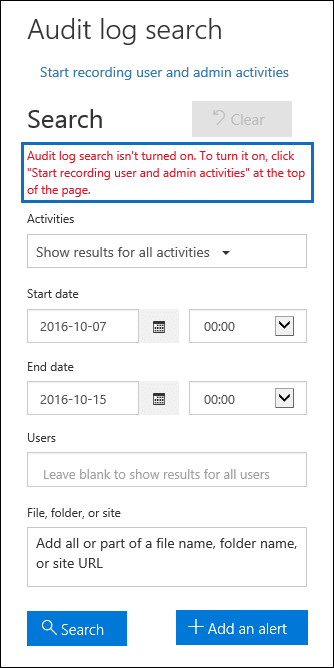

# <a name="turn-office-365-audit-log-search-on-or-off"></a>Office 365 감사 로그 검색 켜기 또는 끄기

사용자 (또는 다른 관리자) 감사 로깅 Office 365 감사 로그 검색을 시작 하기 전에 설정 해야 합니다. Office 365 보안에서 로그 검색 때 감사 &amp; 준수 센터 켜져, 조직에서 사용자 및 관리자 작업 감사 로그에 기록 하 고 90 일 동안 유지 됩니다. 그러나 조직 기록 하 고 감사 로그 데이터를 유지 하지 않을 수도 있습니다. 또는 사용 하 고 제 3 자 보안 정보 및 이벤트 관리 (SIEM) 응용 프로그램에 감사 데이터에 액세스할 수 있습니다. 이러한 경우에는 전역 관리자 Office 365에서 감사 로그 검색을 해제할 수 있습니다.
  
## <a name="before-you-begin"></a>시작하기 전에

- 감사 로그 역할 Exchange Online에 할당할 Office 365 조직에서 감사 로그 검색 설정 또는 해제 해야 합니다. 기본적으로이 역할은 Exchange 관리 센터에서 **사용 권한** 페이지에서 준수 관리 및 조직 관리 역할 그룹에 할당 됩니다. Office 365에서 전역 관리자가 조직 관리 역할 그룹의 구성원 Exchange 온라인 합니다. 
    
    > [!IMPORTANT]
    > 사용자 수에 사용 권한이 할당 Exchange Online 감사 로그 검색 설정 또는 해제 해야 합니다. 사용자 보안에서 **사용 권한** 페이지에서 감사 로그 역할을 할당 하는 경우 &amp; 준수 센터 수는 없습니다 감사 로그 검색을 설정 하거나 해제 합니다. Cmdlet은 원본으로 사용 되는 Exchange Online cmdlet은 때문입니다. 
  
- Office 365에서 감사 로그 검색을 해제 하는 경우 조직에 대 한 감사 데이터에 액세스 하는 Office 365 관리 활동 API을 사용할 수 있습니다. 보안을 사용 하 여 감사 로그를 검색 하는 경우는 결과가 없으면가 반환 의미이 문서의 단계를 수행 하 여 감사 로그 검색을 해제 하면 &amp; 준수 센터 또는 Exchange Online에서 **검색 UnifiedAuditLog** cmdlet을 실행 하면 PowerShell 합니다. 그러나 Office 365 관리 활동 API를 통해 조직의 감사 데이터에 액세스 하려면 해당 응용 프로그램을 부여한 경우 해당 응용 프로그램 계속 작동 합니다. 
    
- Office 365 검색에 대 한 단계별 지침 감사 로그를 참조 [Office 365 보안에서 감사 로그를 검색 &amp; 준수 센터](search-the-audit-log-in-security-and-compliance.md)합니다.
    
## <a name="turn-on-audit-log-search"></a>감사 로그 검색 설정

보안을 사용할 수 &amp; 준수 센터 또는 PowerShell Office 365에서 감사 로그 검색을 켤 수 있습니다. 감사 로그를 검색 하는 경우에 결과 반환할 수 전에 감사 로그 검색을 설정한 후 몇 시간이 걸릴 수 있습니다. 감사 로그 역할 Exchange Online에 할당할 감사 로그 검색으로 설정 해야 합니다.
  
### <a name="use-the-security-amp-compliance-center-to-turn-on-audit-log-search"></a>보안을 사용 하 여 &amp; 감사 로그 검색으로 설정 하려면 준수 센터

1. 보안에서 &amp; 준수 센터, 이동 **검색 &amp; 조사** \> **감사 로그 검색**합니다.
    
2. **사용자 및 관리자 작업을 녹음/녹화 시작**을 클릭 합니다.
    
    
  
    대화 상자는 Office 365 감사 로그에 기록 하 고 보고서에 표시할 수 있는 사용자 및 조직에서 관리 작업 수는 없다는 표시 됩니다. 
    
3. **켜기** 를 클릭합니다.
    
    메시지는 감사 로그를 준비 하는 메시지를 몇 시간 준비를 완료 한 후에 검색을 실행할 수 있습니다 라는 표시 됩니다.
    
### <a name="use-powershell-to-turn-on-audit-log-search"></a>PowerShell을 사용 하 여 감사 로그 검색 설정

1. [원격 PowerShell을 사용하여 Exchange Online에 연결](https://go.microsoft.com/fwlink/p/?LinkID=396554)
    
2. Office 365에서 감사 로그 검색으로 설정 하려면 다음 PowerShell 명령을 실행 합니다.
    
    ```
    Set-AdminAuditLogConfig -UnifiedAuditLogIngestionEnabled $true
    ```

    메시지 변경 내용을 적용 하려면 60 분까지 걸릴 수 없다는 표시 됩니다.
  
## <a name="turn-off-audit-log-search"></a>감사 로그 검색 해제

감사 로그 검색을 해제 하려면 Exchange Online 조직에 연결 된 원격 PowerShell을 사용 해야 합니다. 감사 로그 검색을 켜서 비슷합니다 해야 감사 로그 역할 Exchange Online에 할당할 감사 로그 검색을 해제 합니다.
  
1. [원격 PowerShell을 사용하여 Exchange Online에 연결](https://go.microsoft.com/fwlink/p/?LinkID=396554)
    
2. Office 365에서 감사 로그 검색을 해제 하려면 다음 PowerShell 명령을 실행 합니다.
    
    ```
    Set-AdminAuditLogConfig -UnifiedAuditLogIngestionEnabled $false
    ```

3. 잠시 후 해당 감사 로그 검색 됩니다 (사용 안함)를 해제를 확인 합니다. 두 가지 방법으로이 작업을 수행 합니다.
    
    - PowerShell에서 다음 명령을 실행 합니다.

        ```
        Get-AdminAuditLogConfig | FL UnifiedAuditLogIngestionEnabled
        ```

        값 `False` 속성 _UnifiedAuditLogIngestionEnabled_ 에 대 한 감사 로그 검색 꺼져를 나타냅니다. 
    
    - 보안에서 &amp; 준수 센터,으로 이동 하십시오 **검색 &amp; 조사** \> **감사 로그 검색**한 다음 **검색**을 클릭 합니다.
    
      메시지는 감사 로그 검색 설정 되지 않은 없다는 표시 됩니다. 
    
      
