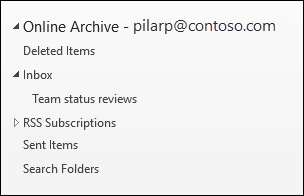

# Office 365의 무제한 보관 개요Overview of unlimited archiving in Office 365

Office 365에서 보관 사서함은 사용자에 게 사서함 저장소 공간을 추가로 제공 합니다. 사용자의 보관 사서함을 사용 하도록 설정한 후에는 최대 100의 추가 저장소를 사용할 수 있습니다. 100 GB 저장소 할당량에 도달 하면 조직에서 Microsoft에 문의 하 여 보관 사서함에 대 한 추가 저장소 공간을 요청 해야 했습니다. 더 이상 이러한 경우는 아닙니다. Office 365의 새로운 무제한 보관 기능 ( *자동 확장 보관*이라고 함)은 보관 사서함에 무제한의 저장소를 제공 합니다. 이제 보관 사서함의 저장소 할당량에 도달 하면 Office 365에서 자동으로 보관 함의 크기를 증가 시키며, 따라서 사용자에 게 사서함 저장소 공간이 부족 하지 않고 관리자가 보관 사서함에 대해 추가 저장소를 요청할 필요가 없습니다. .In Office 365, archive mailboxes provide users with additional mailbox storage space. After a user's archive mailbox is enabled, up to 100 GB of additional storage is available. When the 100 GB storage quota is reached, organizations had to contact Microsoft to request additional storage space for an archive mailbox. That's no longer the case. The new unlimited archiving feature in Office 365 (called *auto-expanding archiving*) provides an unlimited amount of storage in archive mailboxes. Now, when the storage quota in the archive mailbox is reached, Office 365 automatically increases the size of the archive, which means that users won't run out of mailbox storage space and administrators won't have to request additional storage for archive mailboxes.
  
자동 확장 보관을 설정 하는 단계별 지침은 [Office 365에서 무제한 보관을 사용 하도록 설정을](enable-unlimited-archiving.md)참조 하십시오.For step-by-step instructions for turning on auto-expanding archiving, see [Enable unlimited archiving in Office 365](enable-unlimited-archiving.md).
  
> [!NOTE]
> 자동 확장 보관은 공유 사서함도 지원 합니다. 공유 사서함에 대 한 보관 함을 사용 하도록 설정 하려면 exchange online 계획 2 라이선스 또는 교환 라이선스가 있는 exchange online 계획 1 라이선스가 필요 합니다.Auto-expanding archiving also supports shared mailboxes. To enable the archive for a shared mailbox, an Exchange Online Plan 2 license or an Exchange Online Plan 1 license with an Exchange Online Archiving license is required. 
  
## 자동 확장 보관의 작동 방식How auto-expanding archiving works

앞에서 설명한 것 처럼 사용자의 보관 사서함을 사용 하도록 설정 하면 추가 사서함 저장소 공간이 만들어집니다. 자동 확장 보관을 사용 하도록 설정 하면 Office 365에서 보관 사서함의 크기를 주기적으로 확인 합니다. 보관 사서함이 저장 용량 제한에 근접 하면 Office 365에서 자동으로 보관에 대 한 추가 저장소 공간을 만듭니다. 사용자가이 추가 저장 공간을 모두 실행 하는 경우 Office 365에서는 사용자의 보관 사서함에 저장 공간을 더 추가 합니다. 이 프로세스가 자동으로 수행 되므로 관리자가 추가 보관 저장소를 요청 하거나 자동 확장 보관을 관리할 필요가 없습니다.As previously explained, additional mailbox storage space is created when a user's archive mailbox is enabled. When auto-expanding archiving is enabled, Office 365 periodically checks the size of the archive mailbox. When an archive mailbox gets close to its storage limit, Office 365 automatically creates additional storage space for the archive. If the user runs out of this additional storage space, Office 365 adds more storage space to the user's archive. This process happens automatically, which means administrators don't have to request additional archive storage or manage auto-expanding archiving. 
  
프로세스에 대 한 간략 한 개요는 다음과 같습니다.Here's a quick overview of the process.
  

  
1. 사용자 사서함 또는 공유 사서함에 대해 보관을 사용 하도록 설정 합니다. 100 GB의 저장소 공간이 있는 보관 사서함이 만들어지고 보관 사서함에 대 한 경고 할당량이 90 g b로 설정 됩니다.Archiving is enabled for a user mailbox or a shared mailbox. An archive mailbox with 100 GB of storage space is created, and the warning quota for the archive mailbox is set to 90 GB.
    
2. 관리자가 사서함에 대해 자동 확장 보관을 사용 하도록 설정 합니다. 그런 다음 보관 사서함 (복구 가능한 항목 폴더 포함)이 90에 도달 하면 자동 확장 보관 함으로 변환 되 고 Office 365에서 보관 함에 저장 공간을 추가 합니다. 추가 저장 공간을 프로 비전 하는 데 최대 30 일이 걸릴 수 있습니다.An administrator enables auto-expanding archiving for the mailbox. Then, when the archive mailbox (including the Recoverable Items folder) reaches 90 GB, it's converted to an auto-expanding archive, and Office 365 adds storage space to the archive. Note that it can take up to 30 days for the additional storage space to be provisioned.
    
3. Office 365에서는 필요한 경우 보관 사서함에 저장 공간을 자동으로 추가 합니다.Office 365 automatically adds more storage space to the archive when necessary.
  
> [!IMPORTANT]
> 사서함이 보류 되거나 Office 365 보존 정책에 할당 된 경우에는 자동 확장 보관을 사용 하는 경우 보관 maibox의 저장소 할당량이 110 GB로 증가 합니다. 마찬가지로 보관 경고 할당량이 100 GB로 증가 합니다.If a mailbox is placed on hold or assigned to an Office 365 retention policy, the storage quota for the archive maibox is increased to 110 GB when auto-expanding archiving is enabled. Similarly, the archive warning quota is increased to 100 GB.

## 추가 보관 저장소 공간으로 이동 하는 것은 무엇 인가요?What gets moved to the additional archive storage space?

자동 확장 보관 저장소를 효율적으로 사용 하기 위해 폴더가 이동 될 수 있습니다. Office 365에서는 추가 저장소가 보관 사서함에 추가 될 때 이동할 폴더를 결정 합니다. 폴더를 이동 하면 Outlook 폴더 목록의 보관 부분에 있는 원래 폴더 아래에 하위 폴더가 자동으로 만들어집니다. 이 새 하위 폴더는 이동 된 항목을 가리킵니다. 이 폴더의 이름을 지정 하는 데 Office 365에서 사용 하는 명명 규칙은 \*\* \<\>_cm(mmm dd, yyyy h_mm에서 만들어짐)\*\* 이며, 여기에서 다음을 수행 합니다.To make efficient use of auto-expanding archive storage, folders might get moved. Office 365 determines which folders get moved when additional storage is added to the archive. When a folder is moved, a subfolder is automatically created under the original folder in the archive portion of the folder list in Outlook. This new subfolder points to the items that were moved. The naming convention that Office 365 uses to name this folder is **\<folder name\>_yyyy (Created on mmm dd, yyyy h_mm)**, where: 
  
- **yyyy** 는 폴더에서 메시지가 수신 된 연도입니다.**yyyy** is the year the messages in the folder were received. 
    
- **mmm dd, yyyy h_m** 는 사용자의 표준 시간대 및 Outlook의 국가별 설정에 따라 하위 폴더가 Office 365에서 만들어진 날짜 및 시간입니다.**mmm dd, yyyy h_m** is the date and time that the subfolder was created by Office 365, in UTC format, based on the user's time zone and regional settings in Outlook. 
    
다음 스크린샷은 자동 확장 보관 사서함에서 메시지가 이동 되기 전과 후의 폴더 목록을 보여 줍니다.The following screen shots show a folder list before and after messages are moved in an auto-expanded archive.
  
 **추가 저장소가 추가 되기 전에****Before additional storage is added**
  

  
 **추가 저장소가 추가 된 후****After additional storage is added**
  

  
## 자동 확장 보관 함의 항목에 액세스 하기 위한 Outlook 요구 사항Outlook requirements for accessing items in an auto-expanded archive

자동 확장 보관 사서함에 저장 된 메시지에 액세스 하려면 사용자는 다음 Outlook 클라이언트 중 하나를 사용 해야 합니다.To access messages that are stored in an auto-expanded archive, users have to use one of the following Outlook clients:
  
- Windows 용 outlook 2016 또는 outlook 2019Outlook 2016 or Outlook 2019 for Windows
    
- 웹용 OutlookOutlook on the web 
    
- Mac 용 outlook 2016 또는 outlook 2019Outlook 2016 or Outlook 2019 for Mac 
    
> [!NOTE]
> Outlook 2013 사용자는 원래 보관 사서함에 저장 된 항목에만 액세스할 수 있습니다. 추가 보관 저장소로 이동 되는 항목에는 액세스할 수 없습니다.Outlook 2013 users can only access items that were originally stored in their archive mailbox. They won't be able to access items that are moved to additional archive storage. 
  
다음은 outlook 또는 웹용 outlook을 사용 하 여 자동 확장 보관 함에 저장 된 메시지에 액세스 하는 경우 고려해 야 할 몇 가지 사항입니다.Here are some things to consider when using Outlook or Outlook on the web to access messages stored in an auto-expanded archive.
  
- 자동 확장 된 저장 영역으로 이동 된 폴더를 포함 하 여 보관 사서함의 모든 편지함에 액세스할 수 있습니다.You can access any folder in your archive mailbox, including ones that were moved to the auto-expanded storage area.
    
- 폴더 자체를 검색 해야만 추가 저장소 영역으로 이동한 항목을 검색할 수 있습니다. 즉, 검색 범위로 **현재 폴더** 옵션을 선택 하려면 폴더 목록에서 보관 폴더를 선택 해야 합니다. 마찬가지로 자동 확장 된 저장소 영역의 폴더에 하위 폴더가 있는 경우 각 하위 폴더를 개별적으로 검색 해야 합니다.You can search for items that were moved to an additional storage area only by searching the folder itself. This means you have to select the archive folder in the folder list to select the **Current Folder** option as the search scope. Similarly, if a folder in an auto-expanded storage area contains subfolders, you have to search each subfolder separately. 
    
- 자동 확장 보관 함에서 outlook 및 웹용 outlook의 항목 수가 정확 하지 않을 수 있습니다.Item counts in Outlook and Read/Unread counts (in Outlook and Outlook on the web ) in an auto-expanded archive might not be accurate.
    
- 자동 확장 된 저장 영역을 가리키는 하위 폴더의 항목을 삭제할 수는 있지만 해당 폴더 자체를 삭제할 수는 없습니다.You can delete items in a subfolder that points to an auto-expanded storage area, but the folder itself can't be deleted.
    
- 지운 편지함 복구 기능을 사용 하 여 자동 확장 된 저장소 영역에서 삭제 된 항목을 복구할 수는 없습니다.You can't use the Recover Deleted Items feature to recover an item that was deleted from an auto-expanded storage area.
  
## 보관 및 기타 Office 365 준수 기능 자동 확장Auto-expanding archiving and other Office 365 compliance features

이 섹션에서는 자동 확장 보관과 기타 Office 365 준수 및 데이터 거 버 넌 스 기능 간의 기능에 대해 설명 합니다.This section explains the functionality between auto-expanding archiving and other Office 365 compliance and data governance features.
  
- **eDiscovery** -콘텐츠 검색 또는 원본 위치 eDiscovery와 같은 Office 365 eDiscovery 도구를 사용 하면 자동 확장 보관 함의 추가 저장소 영역도 검색 됩니다.**eDiscovery** - When you use an Office 365 eDiscovery tool, such as Content Search or In-Place eDiscovery, the additional storage areas in an auto-expanded archive are also searched.
    
- **보존** -Exchange Online의 소송 보존, Office 365 보안 & 준수 센터의 보존 정책 등의 도구를 사용 하 여 사서함을 보류할 때 자동 확장 보관 함에 있는 콘텐츠도 함께 사용할 수 있습니다. 보류 되었습니다.**Retention** - When you put a mailbox on hold by using tools such as Litigation Hold in Exchange Online or eDiscovery case holds and retention policies in the Office 365 Security & Compliance Center, content located in an auto-expanded archive is also placed on hold.
    
- **mrm (메시징 레코드 관리)** -Exchange Online에서 mrm 삭제 정책을 사용 하 여 만료 된 사서함 항목을 영구적으로 삭제 하는 경우에는 자동 확장 보관 함에 있는 만료 됨 항목도 삭제 됩니다.**Messaging records management (MRM)** - If you use MRM deletion policies in Exchange Online to permanently delete expired mailbox items, expired items located in the auto-expanded archive will also be deleted.
    
- **서비스 가져오기** -Office 365 가져오기 서비스를 사용 하 여 PST 파일을 사용자의 자동 확장 보관으로 가져올 수 있습니다. PST 파일에서 사용자의 보관 사서함으로의 데이터를 최대 100 GB까지 가져올 수 있습니다.**Import service** - You can use the Office 365 Import service to import PST files to a user's auto-expanded archive. You can import up to 100 GB of data from PST files to the user's archive mailbox. 

## 추가 정보More information

자동 확장 보관에 대 한 자세한 기술 정보는 [Office 365: 자동 확장 보관 함 FAQ](https://blogs.technet.microsoft.com/exchange/2018/04/09/office-365-auto-expanding-archives-faq/)를 참조 하십시오.For more technical details about auto-expanding archiving, see [Office 365: Auto-Expanding Archives FAQ](https://blogs.technet.microsoft.com/exchange/2018/04/09/office-365-auto-expanding-archives-faq/).