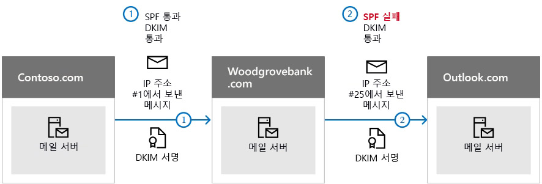

# <a name="use-dkim-to-validate-outbound-email-sent-from-your-custom-domain-in-office-365"></a>DKIM를 사용 하 여 Office 365에서 사용자 지정 도메인에서 보낸 아웃 바운드 전자 메일의 유효성을 검사 하려면

 **요약:** 이 문서에서는 사용 DomainKeys 식별 된 메일 (DKIM) Office 365를 사용 하는 방법을 확인 대상 전자 메일 시스템 사용자 지정 도메인에서 보낸 메시지를 신뢰 하는 설명 합니다. 
  
도메인에서 들어오는 처럼 보이게 하는 메시지를 보내지 못하도록 spoofers를 방지 하려면 SPF 및 DMARC 외에도 DKIM를 사용 해야 합니다. DKIM은 메시지 헤더에 전자 메일 메시지에 디지털 서명을 추가할 수 있습니다. 소리 복잡해 지는 없습니다. DKIM를 구성할 때에 대 한 권한 부여에 연결 하 고, 도메인 또는 서명, 암호화 인증을 사용 하 여 전자 메일 메시지에 해당 이름을 합니다. 도메인에서 전자 메일을 수신 하는 전자 메일 시스템 받는 전자 메일을 받을 수 있는 적절 한지 확인 하는 데 도움이 디지털 서명이 사용 수 있습니다.
  
개인 키를 사용 하 여 도메인의 보내는 전자 메일의 헤더를 암호화 하는 기본적으로, 합니다. 받는 서버에는 서명을 디코딩할 다음 사용할 수 있는 도메인의 DNS 레코드에는 공용 키를 게시 합니다. 때 확인 하는 메시지 사용자 로부터 실제로 연결 되 고 도메인 스푸핑 사람이 보낸 것이 아니라 공용 키를 사용 합니다.
  
Office 365 초기 도메인에 대 한 DKIM를 자동으로 설정합니다. 초기 도메인은 귀하가 등록 하면 contoso.onmicrosoft.com 등 서비스를 사용할 경우 Office 365를 생성 하는 도메인입니다. 초기 도메인에 대 한 DKIM를 설정 하는 모든 작업을 수행할 필요가 없습니다. 도메인에 대 한 자세한 내용은 [도메인 FAQ](https://support.office.com/article/Domains-FAQ-1272bad0-4bd4-4796-8005-67d6fb3afc5a#bkmk_whydoihaveanonmicrosoft.comdomain)를 참조 하십시오.
  
사용자 지정 도메인에 대 한 너무 DKIM 조건에 대해 수행 하도록 선택할 수 있습니다. 설정 하지 않으면 DKIM를 사용자 지정 도메인을 하는 경우 Office 365 개인 및 공용 키 쌍을 만듭니다 활성화 DKIM 서명 하 고 사용자 지정 도메인에 대 한 Office 365 기본 정책을 구성 합니다. 대부분의 Office 365 고객에 대 한 충분 한 검사가 이지만, 다음과 같은 상황에서 사용자 지정 도메인에 대 한 DKIM을 수동으로 구성 해야 합니다.
  
- Office 365에서 사용자 지정 도메인을 둘 이상 있습니다
    
- 너무 DMARC를 설정 하려면 (권장)
    
- 사용자의 개인 키에 대 한 제어를 원합니다
    
- CNAME 레코드를 사용자 지정
    
- 제 3 자 벌크 메일 발송을 사용 하는 경우 예 제 3 자 도메인 외부에서 들어오는 전자 메일에 대 한 DKIM 키를 설정 하려고 합니다.
    
이 문서의 내용
  
- [DKIM은 Office 365의 악의적인 스푸핑 방지 단독으로 SPF 보다 더 잘 작동 하는 방법](use-dkim-to-validate-outbound-email.md#HowDKIMWorks)
    
- [Office 365에서 DKIM를 수동으로 설정 하려면 수행 하는데 필요한](use-dkim-to-validate-outbound-email.md#SetUpDKIMO365)
    
- [Office 365에서 둘 이상의 사용자 지정 도메인에 대 한 DKIM를 구성 하려면](use-dkim-to-validate-outbound-email.md#DKIMMultiDomain)
    
- [Office 365에서 사용자 지정 도메인에 대 한 정책 서명 DKIM를 사용 하지 않도록 설정](use-dkim-to-validate-outbound-email.md#DisableDKIMSigningPolicy)
    
- [DKIM 및 Office 365에 대 한 기본 동작](use-dkim-to-validate-outbound-email.md#DefaultDKIMbehavior)
    
- [DKIM를 제 3 자 서비스 보내기, 또는 사용자 지정 도메인을 대신 하 여 전자 메일을 스푸핑할 수 있도록 설정](use-dkim-to-validate-outbound-email.md#SetUp3rdPartyspoof)
    
- [다음 단계: Office 365에 대 한 DKIM를 설정한 후](use-dkim-to-validate-outbound-email.md#DKIMNextSteps)
    
## <a name="how-dkim-works-better-than-spf-alone-to-prevent-malicious-spoofing-in-office-365"></a>DKIM은 Office 365의 악의적인 스푸핑 방지 단독으로 SPF 보다 더 잘 작동 하는 방법
<a name="HowDKIMWorks"> </a>

정보 메시지 봉투를 추가 하는 SPF 하지만 DKIM 실제로 메시지 헤더 내에서 서명을 암호화 합니다. 메시지를 전달 하면 전달 서버에서 자리 비움으로 해당 메시지 봉투의 일부를 제거할 수 있습니다. 디지털 서명 전자 메일 머리글의 일부 이기 때문에 전자 메일 메시지와 함께 유지, 이후 DKIM도 때 메시지를 전달 된 다음 예제와 같이 작동 합니다.
  

  
이 예제에서는 도메인에 대 한 SPF TXT 레코드를 게시만 했던 경우 받는 사람의 메일 서버도 전자 메일 스팸으로 표시 하 고 false 이면 양수 결과 생성 합니다. 이 시나리오에서 DKIM 추가 false 양의 스팸 보고 줄일 수 있습니다. 인증에 공개 키 암호화 및 아니라 IP 주소를 의존 하는 DKIM, 때문에 DKIM는 훨씬 더 강력한 형태의 인증 SPF 보다 것으로 간주 됩니다. SPF 및 DKIM, 모두를 사용 하는 것이 좋습니다 배포에서 DMARC와 합니다.
  
수행해 해보겠습니다: DKIM 개인 키를 사용 하 여 암호화 된 서명 된 메시지 헤더에 삽입 합니다. 서명 도메인 또는 아웃 바운드 도메인의 값으로 삽입 되는 **d =** 헤더에서 필드입니다. 확인 도메인 또는 받는 사람의 도메인을 사용 하 여는 **d =** DNS에서 공용 키를 조회 하 고 메시지 인증에 필드를 추가 합니다. 메시지를 확인 하는 경우 DKIM 검사를 통과 합니다. 
  
## <a name="what-you-need-to-do-to-manually-set-up-dkim-in-office-365"></a>Office 365에서 DKIM를 수동으로 설정 하려면 수행 하는데 필요한
<a name="SetUpDKIMO365"> </a>

DKIM를 구성 하려면 다음이 단계를 완료 합니다.
  
- [DNS에 사용자 지정 도메인에 대 한 두 CNAME 레코드를 게시 합니다.](use-dkim-to-validate-outbound-email.md#Publish2CNAME)
    
- [Office 365에서 사용자 지정 도메인에 대 한 서명 DKIM를 사용 하도록 설정](use-dkim-to-validate-outbound-email.md#EnableDKIMinO365)
    
### <a name="publish-two-cname-records-for-your-custom-domain-in-dns"></a>DNS에 사용자 지정 도메인에 대 한 두 CNAME 레코드를 게시 합니다.
<a name="Publish2CNAME"> </a>

DKIM 서명을 DNS에 추가 하려는 각 도메인에 대해 두 CNAME 레코드를 게시 해야 합니다. DNS CNAME 레코드를 사용 하는 도메인의 정식 이름은 다른 도메인 이름에 대 한 별칭을 지정 합니다. 
  
 Office 365 설정 하는 두 레코드를 사용 하 여 자동 키 회전을 수행 합니다. Office 365에서 초기 도메인 외에도 사용자 지정 도메인을 프로 비전 하는 경우에 각 추가 도메인에 대 한 두 CNAME 레코드를 게시 해야 합니다. 따라서 두 도메인을 사용 하는 경우 두 추가 CNAME 레코드를 게시 하 고 등 해야 있습니다.
  
CNAME 레코드에 대 한 다음 형식을 사용 합니다.

> [!IMPORTANT]
> GCC 고객 중 한 경우 domainGUID 메서드를 사용 하는 적합 하지 않습니다! 도메인에 대 한 적절 한 MX 값을 사용 해야 합니다. 사용: `selector2-<domain-key>._domainkey.<initialDomain>` 아래 예제에 대 한 합니다. [이 문서](https://docs.microsoft.com/en-us/office365/admin/get-help-with-domains/information-for-dns-records?view=o365-worldwide) 를 사용 하 여 사용자가 *도메인 키* 값에 필요한 MX 레코드를 찾습니다.
  
```
Host name:          selector1._domainkey
Points to address or value: selector1-<domainGUID>._domainkey.<initialDomain> 
TTL:                3600

Host name:          selector2._domainkey
Points to address or value: selector2-<domainGUID>._domainkey.<initialDomain> 
TTL:                3600
```

여기서 각 부분이 나타내는 의미는 다음과 같습니다.
  
- Office 365에 대 한 선택기는 항상 "selector1" 또는 "selector2"입니다. 
    
- _domainGUID_ mail.protection.outlook.com 하기 전에 표시 되는 사용자 지정 도메인에 대 한 사용자 지정 된 MX 레코드에 _domainGUID_ 와 동일 합니다. 예, contoso.com 도메인에 대 한 다음 MX 레코드를 _domainGUID_ 는 contoso com: 
    
    ```
    contoso.com.  3600  IN  MX   5 contoso-com.mail.protection.outlook.com
    ```

- _initialDomain_ 은 도메인 Office 365에 등록할 수 있을 때 사용한 것입니다. 초기 도메인 onmicrosoft.com 항상 종료 됩니다. 초기 도메인을 결정 하는 방법에 대 한 정보를 [도메인 FAQ](https://support.office.com/article/1272bad0-4bd4-4796-8005-67d6fb3afc5a#bkmk_whydoihaveanonmicrosoft.comdomain)를 참조 하십시오.
    
예는 초기 cohovineyardandwinery.onmicrosoft.com, 도메인 및 두 사용자 지정 도메인 cohovineyard.com 및 cohowinery.com을 설치한 경우에 총 4 개의 CNAME 레코드에 대 한 각 추가 도메인에 대 한 두 CNAME 레코드를 설정 해야 합니다.
  
```
Host name:          selector1._domainkey
Points to address or value: **selector1-cohovineyard-com**._domainkey.cohovineyardandwinery.onmicrosoft.com
TTL:                3600

Host name:          selector2._domainkey
Points to address or value: **selector2-cohovineyard-com**._domainkey.cohovineyardandwinery.onmicrosoft.com
TTL:                3600

Host name:          selector1._domainkey
Points to address or value: **selector1-cohowinery-com**._domainkey.cohovineyardandwinery.onmicrosoft.com 
TTL:                3600
 
Host name:          selector2._domainkey
Points to address or value: **selector2-cohowinery-com**._domainkey.cohovineyardandwinery.onmicrosoft.com 
TTL:                3600
```

### <a name="enable-dkim-signing-for-your-custom-domain-in-office-365"></a>Office 365에서 사용자 지정 도메인에 대 한 서명 DKIM를 사용 하도록 설정
<a name="EnableDKIMinO365"> </a>

DNS에서 CNAME 레코드를 게시 한 후 Office 365를 통해 DKIM 서명을 활성화 준비가 된 것입니다. Office 365 관리 센터를 통해 또는 PowerShell을 사용 하 여 수행할 수 있습니다.
  
#### <a name="to-enable-dkim-signing-for-your-custom-domain-through-the-office-365-admin-center"></a>Office 365 관리 센터를 통해 사용자 지정 도메인에 대 한 서명 DKIM를 사용 하도록 설정 하려면

1. 회사 또는 학교 계정로 [Office 365에 로그인](https://support.office.microsoft.com/article/e9eb7d51-5430-4929-91ab-6157c5a050b4)합니다. 
    
2. 왼쪽 위에서 앱 시작 관리자 아이콘을 선택하고 **관리자**를 선택합니다.
    
3. 왼쪽 탐색 영역에서 **관리** 를 확장 하 고 **Exchange**를 선택 합니다.
    
4. **보호** 이동 \> **dkim**합니다.
    
5. DKIM를 사용 하도록 설정 하 고 다음 **DKIM 서명 사용 하 여이 도메인에 대 한 로그인 메시지**대 한 **사용**을 선택 하려면 원하는 도메인을 선택 합니다. 각 사용자 지정 도메인에 대해이 단계를 반복 합니다.
    
#### <a name="to-enable-dkim-signing-for-your-custom-domain-by-using-powershell"></a>PowerShell을 사용 하 여 사용자 지정 도메인에 대 한 서명 DKIM를 사용 하도록 설정 하려면

1. [Exchange Online PowerShell에 연결합니다](https://technet.microsoft.com/library/jj984289.aspx).
    
2. 다음 명령을 실행합니다.
    
    ```
    New-DkimSigningConfig -DomainName <domain> -Enabled $true
    ```

   여기서 _도메인_ 은 DKIM에 대 한 로그인을 사용 하도록 설정 하려는 사용자 지정 도메인의 이름입니다. 
    
   예: contoso.com 도메인:
    
    ```
    New-DkimSigningConfig -DomainName contoso.com -Enabled $true
    ```

#### <a name="to-confirm-dkim-signing-is-configured-properly-for-office-365"></a>DKIM 확인 하려면 서명 제대로 구성 Office 365에 대 한

DKIM 제대로 구성 되었는지 확인 하려면 다음이 단계를 수행 하기 전에 몇 분정도 기다립니다. 이렇게 하면 네트워크 전체에 걸쳐 분산 될 도메인에 대 한 DKIM 정보에 대 한 시간입니다.
  
- 예: outlook.com 또는 Hotmail.com 다른 전자 메일 계정에 Office 365 DKIM 사용이 가능한 도메인 내 계정에서 메시지를 보냅니다.
    
- 테스트 목적으로 aol.com 계정을 사용 하지 마십시오. AOL은 SPF 검사를 통과 하는 경우 DKIM 확인을 건너뛸 수 있습니다. 이 테스트를 무효화 됩니다.
    
- 메시지를 열고 머리글을 살펴봅니다. 메시지에 대 한 헤더를 보기 위한 지침 메시징 클라이언트에 따라 달라 집니다. Outlook에서 메시지 헤더 보기에 대 한 지침을 [전자 메일 메시지 머리글 보기를](https://support.office.com/article/CD039382-DC6E-4264-AC74-C048563D212C)참조 하십시오.

  DKIM 서명 된 메시지는 호스트 이름 및 CNAME 항목을 게시 하는 경우를 정의 하는 도메인에 포함 됩니다. 메시지는이 예제에서는 같습니다. 
    
    ```
    From: Example User <example@contoso.com> 
    DKIM-Signature: v=1; a=rsa-sha256; q=dns/txt; c=relaxed/relaxed; 
        s=selector1; d=contoso.com; t=1429912795; 
        h=From:To:Message-ID:Subject:MIME-Version:Content-Type; 
        bh=<body hash>; 
        b=<signed field>;
    ```

- 인증 결과 헤더를 찾습니다. 결과 다음과 같이 포함 되도록 각 수신 서비스에서는 약간 다른 형식을 받는 메일을 스탬프 처리 하는 동안 **DKIM 통과 =** 또는 **DKIM 확인 =** 합니다. 
    
## <a name="to-configure-dkim-for-more-than-one-custom-domain-in-office-365"></a>Office 365에서 둘 이상의 사용자 지정 도메인에 대 한 DKIM를 구성 하려면
<a name="DKIMMultiDomain"> </a>

특정 시점 나중에 다른 사용자 지정 도메인을 추가 하려는 하 고 새 도메인에 대 한 DKIM를 사용 하려면, 경우에 각 도메인에 대 한이 문서의 단계를 완료 해야 합니다. 특히, [Office 365에서 DKIM를 수동으로 설정 하려면 수행 하는데 필요한](use-dkim-to-validate-outbound-email.md#SetUpDKIMO365)모든 단계를 완료 합니다.
  
## <a name="disabling-the-dkim-signing-policy-for-a-custom-domain-in-office-365"></a>Office 365에서 사용자 지정 도메인에 대 한 정책 서명 DKIM를 사용 하지 않도록 설정
<a name="DisableDKIMSigningPolicy"> </a>

서명 정책을 사용 하지 않으면 DKIM 완전히 해제 하지 않습니다. 시간이 지나면 Office 365 도메인에 대 한 기본 Office 365 정책을 자동으로 적용 됩니다. 자세한 내용은 [DKIM 및 Office 365의 기본 동작을](use-dkim-to-validate-outbound-email.md#DefaultDKIMbehavior)참조 하십시오.
  
### <a name="to-disable-the-dkim-signing-policy-by-using-windows-powershell"></a>Windows PowerShell을 사용 하 여 정책에 서명 DKIM를 사용 하지 않도록 설정 하려면

1. [Exchange Online PowerShell에 연결합니다](https://technet.microsoft.com/library/jj984289.aspx).
    
2. DKIM 로그인을 사용 하지 않도록 설정 하려는 각 도메인에 대 한 다음 명령 중 하나를 실행 해야 합니다.
    
    ```
    $p=Get-DkimSigningConfig -identity <domain>
    $p[0] | set-DkimSigningConfig -enabled $false
    ```

   예를 들면 다음과 같습니다.
    
    ```
    $p=Get-DkimSigningConfig -identity contoso.com
    $p[0] | set-DkimSigningConfig -enabled $false
    ```

   또는
    
    ```
    Set-DkimSigningConfig -identity $p[<number>].identity -enabled $false
    ```

    여기서 _번호_ 는 정책의 인덱스입니다. 예를 들어: 
    
    ```
    Set-DkimSigningConfig -identity $p[0].identity -enabled $false
    ```

## <a name="default-behavior-for-dkim-and-office-365"></a>DKIM 및 Office 365에 대 한 기본 동작
<a name="DefaultDKIMbehavior"> </a>

DKIM을 사용 하지 않는 경우 사용자 지정 도메인에 대 한 1024 비트 DKIM 공용 키 및이 데이터 센터에서 내부적으로 저장 하는 연결 된 개인 키가 자동으로 Office 365에 만듭니다. 기본적으로 Office 365에는 서명 되지 않은 정책을 전체에서 도메인에 대해 구성 하는 기본을 사용 합니다. 이 사용 함을 의미 설정 하지 않으면 DKIM를 자신을 하는 경우 Office 365가 해당 기본 정책 및 키 도메인에 대 한 DKIM을 사용 하기 위해 만듭니다.
  
또한 DKIM 서명 시간이 지난 후 활성화 한 후 사용 하지 않도록 설정 하는 경우 Office 365 도메인에 대 한 Office 365 기본 정책을 자동으로 적용 됩니다.
  
다음 예제에서는 DKIM fabrikam.com에 대해 사용 하도록 설정한 Office 365 도메인의 관리자가 아닌 경우를 가정해 보겠습니다. 이 필요한 Cname DNS에 존재 하지 않는 것을 의미 합니다. 이 도메인에서 전자 메일에 대 한 DKIM 서명은 다음과 같습니다.
  
```
From: Second Example <second.example@fabrikam.com> 
DKIM-Signature: v=1; a=rsa-sha256; q=dns/txt; c=relaxed/relaxed; 
    s=selector1-fabrikam-com; d=contoso.onmicrosoft.com; t=1429912795; 
    h=From:To:Message-ID:Subject:MIME-Version:Content-Type; 
    bh=<body hash>; 
    b=<signed field>;
```

이 예제에서는 호스트 이름 및 도메인 CNAME 도메인 관리자에 의해 활성화 되어 있던 fabrikam.com에 대 한 DKIM 서명 하는 경우에 가리키기 값이 포함 됩니다. 결국, Office 365에서 보낸 모든 단일 메시지 DKIM 서명 됩니다. 도메인에서에서 도메인 같을 수는 DKIM, 사용자가 직접 사용 하는 경우:이 사례 fabrikam.com 주소입니다. 이렇게 하지 않으면 맞추지 않습니다 하 고 대신 조직의 초기 도메인을 사용 합니다. 초기 도메인을 결정 하는 방법에 대 한 정보를 [도메인 FAQ](https://support.office.com/article/1272bad0-4bd4-4796-8005-67d6fb3afc5a#bkmk_whydoihaveanonmicrosoft.comdomain)를 참조 하십시오.
  
## <a name="set-up-dkim-so-that-a-third-party-service-can-send-or-spoof-email-on-behalf-of-your-custom-domain"></a>DKIM를 제 3 자 서비스 보내기, 또는 사용자 지정 도메인을 대신 하 여 전자 메일을 스푸핑할 수 있도록 설정
<a name="SetUp3rdPartyspoof"> </a>

일부 대량 전자 메일 서비스 공급자 또는 소프트웨어로-서비스 공급자를 통해 해당 서비스에서 전송 되는 전자 메일에 대 한 DKIM 키를 설정할 수 있습니다. 이 사용자가 직접 및 제 3 자가 사이 조정이 필요한 DNS 레코드를 설정 하기 위해 필요 합니다. 두 조직 없음 동일한 방식으로 수행 합니다. 대신 하는 프로세스는 전적으로 조직에 따라 다릅니다.
  
Contoso.com 및 bulkemailprovider.com 올바르게 구성 된 DKIM를 표시 하는 예제 메시지는 다음과 같습니다.
  
```
Return-Path: <communication@bulkemailprovider.com>
 From: <sender@contoso.com>
 DKIM-Signature: s=s1024; d=contoso.com
 Subject: Here is a message from Bulk Email Provider's infrastructure, but with a DKIM signature authorized by contoso.com
```

이 예제에서는이 결과 달성 하기 위해:
  
1. 대량 전자 메일 공급자 Contoso DKIM 공개키를 제공 했습니다.
    
2. Contoso는 해당 DNS 레코드를 DKIM 키를 게시합니다.
    
3. 전자 메일을 보낼 때 대량 전자 메일 공급자는 해당 개인 키를 사용 하 여 키에 서명 합니다. 이렇게 하 여 대량 전자 메일 공급자는 DKIM 서명을 메시지 헤더에 연결 합니다.
    
4. DKIM 서명 d를 인증 하 여 DKIM 확인을 수행 하는 받는 전자 메일 시스템 =\<도메인\> 에서 도메인에 대해 값: 메시지의 (5322.From) 주소입니다. 이 예제에서는 값과 일치합니다.
    
    **contoso.com** @ 보낸사람
    
    d**contoso.com** =
    
## <a name="next-steps-after-you-set-up-dkim-for-office-365"></a>다음 단계: Office 365에 대 한 DKIM를 설정한 후
<a name="DKIMNextSteps"> </a>

DKIM을 스푸핑을 방지 하기 위한 것 이지만 DKIM SPF 및 DMARC 더 잘 작동 합니다. SPF를 아직 설정 하지 않은 경우 DKIM을 설정한 후이 수행 해야 있습니다. SPF를 신속 하 게 구성 된 것을 간략하게 소개 합니다 [스푸핑을 방지 하기 위해 Office 365에서 SPF 설정](set-up-spf-in-office-365-to-help-prevent-spoofing.md)을 참조 하십시오. Office 365 SPF를 사용 하는 방법에 대 한 더 자세히 이해 또는 하이브리드 배포와 같은 문제해결 또는 비표준 배포에 대 한 [스푸핑을 방지 하기 위해 보낸 사람이 정책 프레임 워크 (SPF)을 사용 하 여 Office 365 방식](how-office-365-uses-spf-to-prevent-spoofing.md)으로 시작 합니다. 다음으로, [Office 365의 전자 메일의 유효성을 검사를 사용 하 여 DMARC](use-dmarc-to-validate-email.md)를 참조 하십시오. [스팸 방지 메시지 헤더](anti-spam-message-headers.md) DKIM 확인을 위한 Office 365에서 사용 되는 구문과 헤더 필드를 포함 합니다. 
  

