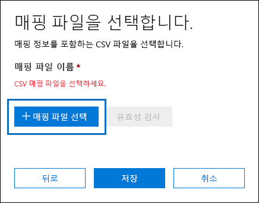
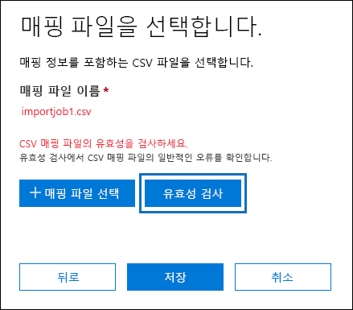
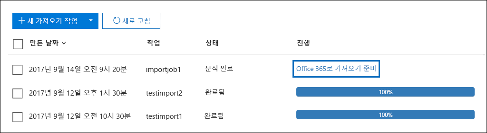
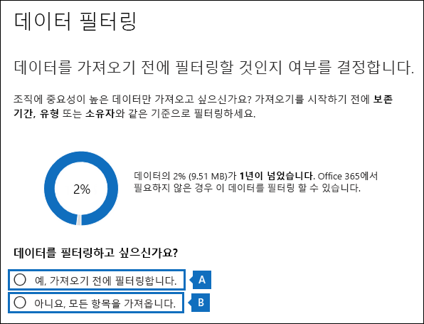
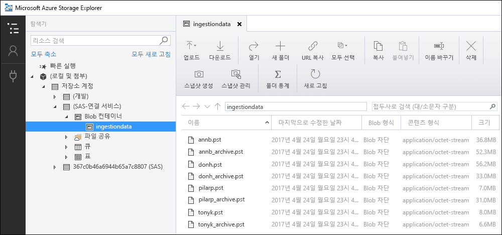

# <a name="use-drive-shipping-to-import-your-organization-pst-files-to-office-365"></a>드라이브 전달을 사용 하 여 조직 PST 파일을 Office 365로 가져오기

**이 문서는 관리자를 위한 것입니다. PST 파일을 자체 사서함으로 가져오시겠습니까? [Outlook .pst 파일에서 전자 메일, 연락처 및 일정 가져오기를](https://go.microsoft.com/fwlink/p/?LinkID=785075) 참조 하세요.**
   
Office 365 가져오기 서비스 및 드라이브 전달을 사용 하 여 사용자 사서함에 PST 파일을 대량으로 가져옵니다. 드라이브 발송은 PST 파일을 하드 디스크 드라이브로 복사한 후 실제로 해당 드라이브를 Microsoft로 발송하는 것을 의미합니다. Microsoft에서 사용자의 하드 드라이브를 받으면 데이터 센터 담당자는 하드 드라이브의 데이터를 Microsoft 클라우드의 저장소 영역으로 복사합니다. 그런 다음 가져올 데이터를 제어 하는 필터를 설정 하 여 대상 사서함에 실제로 가져온 PST 데이터를 트리밍할 수 있습니다. 가져오기 작업을 시작한 후에는 가져오기 서비스가 저장소 영역에서 사용자 사서함으로 PST 데이터를 가져옵니다. 드라이브 전달을 사용 하 여 PST 파일을 사용자 사서함으로 가져오는 것은 조직의 전자 메일을 Office 365로 마이그레이션하는 한 가지 방법입니다.
  
드라이브 전달을 사용 하 여 PST 파일을 Office 365 사서함으로 가져오는 데 필요한 단계는 다음과 같습니다.
  
[1 단계: 보안 저장소 키 및 PST 가져오기 도구 다운로드](#step-1-download-the-secure-storage-key-and-pst-import-tool)

[2 단계: PST 파일을 하드 드라이브에 복사](#step-2-copy-the-pst-files-to-the-hard-drive)

[3 단계: PST 가져오기 매핑 파일 만들기](#step-3-create-the-pst-import-mapping-file)

[4단계: Office 365에서 PST 가져오기 작업 만들기](#step-4-create-a-pst-import-job-in-office-365)

[5단계: Microsoft로 하드 드라이브 발송](#step-5-ship-the-hard-drive-to-microsoft)

[6 단계: 데이터 필터링 및 PST 가져오기 작업 시작](#step-6-filter-data-and-start-the-pst-import-job)
  
> [!IMPORTANT]
> 보안 저장소 키 및 가져오기 도구를 로드 하기 위해 1 단계를 한 번 수행 해야 합니다. 이러한 단계를 수행한 후에는 Microsoft에 하드 드라이브를 출시할 때마다 2 단계부터 6 단계까지 수행 합니다. 
  
드라이브 발송을 사용 하 여 pst 파일을 Office 365로 가져오는 방법에 대 한 질문과 대답은 [faq for drive 발송을 사용 하 여 pst 파일 가져오기](faqimporting-pst-files-to-office-365.md#using-drive-shipping-to-import-pst-files)를 참조 하세요. 
  
## <a name="before-you-begin"></a>시작하기 전에

- PST 파일을 Office 365 사서함으로 가져오려면 Exchange Online의 사서함 가져오기 내보내기 역할을 할당 받아야 합니다. 기본적으로이 역할은 Exchange Online의 어떠한 역할 그룹에도 할당 되지 않습니다. You can add the Mailbox Import Export role to the Organization Management role group. Or you can create a new role group, assign the Mailbox Import Export role, and then add yourself as a member. 자세한 내용은 [Manage role groups](https://go.microsoft.com/fwlink/p/?LinkId=730688)의 "역할 그룹에 역할 추가" 또는 "역할 그룹 만들기" 섹션을 참조 하십시오.
    
    또한 보안 & 준수 센터에서 가져오기 작업을 만들려면 다음 중 하나가 충족 되어야 합니다.
    
  - Exchange Online에서 Mail Recipients 역할을 할당 받아야 합니다. By default, this role is assigned to the Organization Management and Recipient Management roles groups.
    
    또는
    
  - Office 365 조 직의 전역 관리자 여야 합니다.
    
    > [!TIP]
    > Exchange Online에서 PST 파일을 Office 365로 가져오는 데 특별히 만들어진 새 역할 그룹을 만드는 것이 좋습니다. PST 파일을 가져오는 데 필요한 최소 수준의 권한으로는 사서함 가져오기 내보내기 및 메일 받는 사람 역할을 새 역할 그룹에 할당 하 고 구성원을 추가 합니다. 
  
- 조직의 파일 서버의 하드 드라이브 또는 공유 폴더에 복사하려면 PST 파일을 저장해야 합니다. 2 단계에서는이 파일 서버 또는 공유 폴더에 저장 된 PST 파일을 하드 드라이브에 복사 하는, Azure 가져오기 내보내기 도구 (waimportexport)를 실행 합니다.
    
- Office 365 가져오기 서비스와 함께 사용할 경우에는 2.5 인치 ssd (고체 드라이브) 또는 2.5 또는 3.5 인치 SATA II/III 내부 하드 드라이브만 지원 됩니다. You can use hard drives up to 10 TB. 가져오기 작업의 경우에는 하드 드라이브의 첫 번째 데이터 볼륨만 처리 됩니다. The data volume must be formatted with NTFS. 데이터를 하드 드라이브에 복사 하는 경우, 2.5 인치 ssd 또는 2.5 또는 3.5 인치 sata ii/iii 커넥터를 사용 하 여 직접 연결 하거나 외부 2.5 cm SSD 또는 2.5 또는 3.5 인치 sata ii/iii USB 어댑터를 사용 하 여 외부에서 연결할 수 있습니다.
    
    > [!IMPORTANT]
    > 기본 제공 USB 어댑터와 함께 제공 되는 외부 하드 드라이브는 Office 365 가져오기 서비스에서 지원 되지 않습니다. Additionally, the disk inside the casing of an external hard drive can't be used. Please don't ship external hard drives. 
  
- PST 파일을 복사하는 하드 드라이브는 BitLocker로 암호화되어야 합니다. 2단계에서 실행하는 WAImportExport.exe 도구는 BitLocker를 설정하는 데 도움이 됩니다. 또한 microsoft data center 직원이 microsoft 클라우드의 Azure storage 영역에 PST 파일을 업로드 하기 위해 드라이브에 액세스 하는 데 사용 하는 BitLocker 암호화 키도 생성 됩니다.
    
- Microsoft 엔터프라이즈 계약 (EA)을 통해 드라이브 전달을 사용할 수 있습니다. Microsoft 제품 및 서비스 계약 (mpsa)을 통해서는 드라이브 전달을 사용할 수 없습니다.
    
- 드라이브 전달을 사용 하 여 PST 파일을 Office 365 사서함으로 가져오는 비용은 데이터의 GB 당 $2 USD입니다. 예를 들어, 1000의 PST 파일을 포함 하는 하드 드라이브를 제공 하는 경우 비용은 $2000 USD입니다. You can work with a partner to pay the import fee. 파트너를 찾는 방법에 대 한 자세한 내용은 [Office 365 파트너 또는 대리점 찾기를](https://go.microsoft.com/fwlink/p/?LinkId=785197)참조 하세요.
    
- 사용자나 조직은 FedEx 또는 DHL 계정이 있어야 합니다. 
    
  - 미국, 브라질 및 유럽의 조직에는 FedEx 계정이 있어야 합니다.
    
  - 동아시아 지역의 조직, 동남 아시아, 일본, 공화국 한국, 오스트레일리아에는 DHL 계정이 있어야 합니다.
    
    Microsoft는 이 계정을 사용(및 충전)한 후 하드 드라이브를 사용자에게 반환합니다. 
    
- Microsoft로 하드 드라이브를 발송하기 위해 국경을 통과해야 할 수 있습니다. 이러한 경우 하드 드라이브와 포함된 데이터를 관련 법률에 따라 수출 및/또는 수입해야 합니다. 하드 드라이브를 발송하기 전에 드라이브 및 데이터가 확인된 Microsoft 데이터 센터에 합법적으로 발송될 수 있는지를 관리자에게 문의하세요. 그래야 하드 드라이브가 적시에 Microsoft로 발송될 수 있습니다.
    
- 이 절차 중에 보안 저장소 키와 BitLocker 암호화 키가 복사되고 저장됩니다. 암호나 기타 보안 관련 정보를 보호하는 것처럼 특히 주의해서 이러한 키를 보호해야 합니다. 예를 들어 암호로 보호된 Microsoft Word 문서에 저장하거나 암호화된 USB 드라이브에 저장할 수 있습니다. 이러한 키의 예는 [추가 정보](#more-information) 섹션을 참조 하십시오. 
    
- PST 파일을 Office 365 사서함으로 가져온 후에는 사서함에 대 한 보존 설정이 무기한 유지 되도록 설정 됩니다. 즉, 보존 보류를 해제 하거나 보류를 해제 하기 위해 날짜를 설정할 때까지 사서함에 할당 된 보존 정책이 처리 되지 않습니다. 이 작업을 수행 하는 이유는 무엇 인가요? 사서함으로 가져온 메시지가 오래 된 경우 사서함에 대해 구성 된 보존 설정에 따라 보존 기간이 만료 되어 영구적으로 삭제 (제거) 될 수 있습니다. 사서함을 보존 상태로 두면 사서함 소유자가 새로 가져온 메시지를 관리할 수 있는 시간을 제공 하거나 사서함의 보존 설정을 변경할 수 있는 시간을 제공 합니다. 보존 유지 관리에 대 한 제안은 [More information](#more-information) 섹션을 참조 하세요. 
    
- 기본적으로 Office 365 사서함에서 받을 수 있는 최대 메시지 크기는 35 MB입니다. 사서함에 대 한 *MaxReceiveSize* 속성의 기본값은 35 MB로 설정 되어 있기 때문입니다. 그러나 Office 365의 최대 메시지 수신 크기 제한은 150 MB입니다. 따라서 35 보다 큰 항목을 포함 하는 PST 파일을 가져올 경우 Office 365 가져오기 서비스는 대상 사서함의 *MaxReceiveSize* 속성 값을 150 mb로 자동 변경 합니다. 이를 통해 최대 150 MB까지 메시지를 사용자 사서함으로 가져올 수 있습니다. 
    
    > [!TIP]
    > 사서함에 대 한 메시지 수신 크기를 확인 하려면 Exchange Online PowerShell에서이 명령을 실행 하면 `Get-Mailbox <user mailbox> | FL MaxReceiveSize`됩니다. 
  
- PST 파일을 Office 365의 비활성 사서함으로 가져올 수 있습니다. PST 가져오기 매핑 파일의 `Mailbox` 매개 변수에 비활성 사서함의 GUID를 지정 하 여이 작업을 수행 합니다. 자세한 내용은 [3 단계: PST 가져오기 매핑 파일 만들기를](#step-3-create-the-pst-import-mapping-file) 참조 하세요. 
    
- Exchange 하이브리드 배포에서는 기본 사서함이 온-프레미스 인 사용자에 대해 PST 파일을 클라우드 기반 보관 사서함으로 가져올 수 있습니다. PST 가져오기 매핑 파일에서 다음을 수행 하 여이 작업을 수행 합니다.
    
  - `Mailbox` 매개 변수의 사용자 온-프레미스 사서함에 대 한 전자 메일 주소를 지정 합니다. 
    
  - `IsArchive` 매개 변수에 **TRUE** 값을 지정 합니다. 
    
    자세한 내용은 [3 단계: PST 가져오기 매핑 파일 만들기를](#step-3-create-the-pst-import-mapping-file) 참조 하세요. 

## <a name="step-1-download-the-secure-storage-key-and-pst-import-tool"></a>1 단계: 보안 저장소 키 및 PST 가져오기 도구 다운로드

첫 번째 단계는 2 단계에서 하드 드라이브에 PST 파일을 복사 하는 데 사용할 보안 저장소 키와 도구를 다운로드 하는 것입니다.
  
> [!IMPORTANT]
> drive 배송료 메서드를 사용 하 여 PST 파일을 가져오려면 Azure 가져오기/내보내기 도구 버전 1 (WAimportExportV1)을 사용 해야 합니다. Azure 가져오기/내보내기 도구 버전 2는 지원 되지 않으며이를 사용 하면 가져오기 작업에 대 한 하드 드라이브를 잘못 준비 하 게 됩니다. 이 단계의 절차에 따라 Security & 준수 센터에서 Azure 가져오기/내보내기 도구를 다운로드 해야 합니다. 
  
1. 으로 이동 [https://compliance.microsoft.com/](https://compliance.microsoft.com/) 하 고 Office 365 조직의 관리자 계정에 대 한 자격 증명을 사용 하 여 로그인 합니다. 
    
2. 보안 & 준수 센터의 왼쪽 창에서 **데이터 거 버 넌 스** \> **가져오기를**클릭 합니다.
    
    > [!NOTE]
    > 앞에서 설명한 것 처럼 보안 & 준수 센터의 **가져오기** 페이지에 액세스 하기 위한 적절 한 사용 권한을 할당 받아야 합니다. 
  
3. **가져오기**  추가 **새 가져오기 작업**을 클릭 합니다.
    
4. 작업 가져오기 마법사에서 PST 가져오기 작업의 이름을 입력 하 고 **다음**을 클릭 합니다. 소문자, 숫자, 하이픈 및 밑줄을 사용 합니다. 이름에는 대문자를 사용 하거나 공백을 포함할 수 없습니다.
    
5. **가져오기 작업 유형 선택** 페이지에서 **실제 위치 중 하나로 하드 드라이브 배송** 을 클릭 하 고 **다음**을 클릭 합니다.
    
    
  
6. **데이터 가져오기** 페이지에서 다음 두 가지 작업을 수행 합니다. 
    
    
  
    위한. 2 단계에서 **보안 저장소 키 복사**를 클릭 합니다. 저장소 키가 표시 되 면 **클립보드에 복사** 를 클릭 하 여 붙여 넣은 다음 나중에 액세스할 수 있도록 파일에 저장 합니다.
    
    b. 3 단계에서 **azure 가져오기/내보내기 도구를 다운로드** 하 여 azure 가져오기/내보내기 (버전 1) 도구를 다운로드 하 고 설치 합니다.
    
    - 팝업 창에서 다른 **** \> **이름으로 저장** 을 클릭 하 여 로컬 컴퓨터의 폴더에 WaImportExportV1 파일을 저장 합니다. 
    
    - WaImportExportV1 파일의 압축을 풉니다.
    
7. **취소** 를 클릭 하 여 마법사를 닫습니다. 
    
    4 단계에서 가져오기 작업을 만들 때 Security & 준수 센터의 **가져오기** 페이지로 돌아갑니다. 

## <a name="step-2-copy-the-pst-files-to-the-hard-drive"></a>2 단계: PST 파일을 하드 드라이브에 복사

다음 단계는 WAImportExport.exe 도구를 사용하여 하드 드라이브에 PST 파일을 복사하는 것입니다. 이 도구는 BitLocker로 하드 드라이브를 암호화하고 PST를 하드 드라이브에 복사한 다음 복사 프로세스에 대한 정보를 저장하는 저널 파일을 만듭니다. 이 단계를 완료하려면 PST 파일이 조직의 파일 공유 또는 파일 서버에 있어야 합니다. 다음 절차에서는 이것을 원본 디렉터리라고 합니다. 
  
> [!IMPORTANT]
> 하드 드라이브에 대해 처음으로 WAImportExport.exe 도구를 실행한 후에는 매번 다른 구문을 사용해야 합니다. 이 구문은이 절차의 4 단계에서 PST 파일을 하드 드라이브에 복사 하는 방법에 설명 되어 있습니다. 
  
1. 로컬 컴퓨터에서 명령 프롬프트를 엽니다.
    
    > [!TIP]
    > 관리자 권한으로 명령 프롬프트를 실행하는 경우(열 때 "관리자 권한으로 실행" 선택) 명령 프롬프트 창에 오류 메시지가 표시됩니다. 이 메시지는 WAImportExport.exe 도구를 실행할 때 발생하는 문제를 해결하는 데 도움이 됩니다. 
  
2. 1단계에서 WAImportExport.exe 도구를 설치한 디렉터리로 이동합니다.
    
3. WAImportExport.exe를 사용하여 하드 드라이브에 PST 파일을 처음 복사할 때 다음 명령을 실행합니다.

    ```
    WAImportExport.exe PrepImport /j:<Name of journal file> /t:<Drive letter> /id:<Name of session> /srcdir:<Location of PST files> /dstdir:<PST file path> /sk:<Storage account key> /encrypt /logdir:<Log file location>
    ```

    다음 표에서는 매개 변수와 해당 필수 값에 대해 설명합니다.
    
    |**매개 변수**|**설명**|**예제**|
    |:-----|:-----|:-----|
    | `/j:` <br/> |저널 파일의 이름을 지정합니다. 이 파일은 WAImportExport.exe 도구가 있는 동일한 폴더에 저장됩니다. Microsoft로 발송하는 각 하드 드라이브에는 하나의 저널 파일이 있어야 합니다. WAImportTool.exe를 실행하여 PST 파일을 하드 드라이브에 복사할 때마다 해당 드라이브에 대한 저널 파일에 정보가 추가됩니다.  <br/> microsoft 데이터 센터 직원은 저널 파일의 정보를 사용 하 여 하드 드라이브를 4 단계에서 만든 가져오기 작업에 연결 하 고 PST 파일을 Microsoft 클라우드의 Azure storage 영역에 업로드 합니다.  <br/> | `/j:PSTHDD1.jrn` <br/> |
    | `/t:` <br/> |로컬 컴퓨터에 연결될 때 하드 드라이브의 드라이브 문자를 지정합니다.  <br/> | `/t:h` <br/> |
    | `/id:` <br/> |복사 세션의 이름을 지정합니다. 세션은 WAImportExport.exe 도구를 실행하여 하드 드라이브에 파일을 복사할 때마다 정의됩니다. PST 파일이 이 매개 변수로 지정된 세션 이름의 폴더에 복사됩니다.   <br/> | `/id:driveship1` <br/> |
    | `/srcdir:` <br/> |조직에서 세션 중에 복사될 PST 파일이 들어 있는 원본 디렉터리를 지정합니다. 이 매개 변수의 값을 큰따옴표(" ")로 묶으세요.  <br/> | `/srcdir:"\\FILESERVER01\PSTs"` <br/> |
    | `/dstdir:` <br/> |pst가 업로드 될 Microsoft 클라우드의 Azure storage 영역에 있는 대상 디렉터리를 지정 합니다. 이 값 `ingestiondata/`을 사용 해야 합니다. 이 매개 변수의 값을 큰따옴표(" ")로 묶으세요.  <br/> 필요에 따라 추가 파일 경로를 이 매개 변수의 값에 추가할 수도 있습니다. 예를 들어 `/srcdir:` 매개 변수에 지정 된 하드 드라이브 (URL 형식으로 변환)에서 원본 디렉터리의 파일 경로를 사용할 수 있습니다. 예를 `\\FILESERVER01\PSTs` 들어로로 `FILESERVER01/PSTs`변경 됩니다. 이 경우에도 파일 경로를 포함 `ingestiondata` 해야 합니다. 따라서이 예제에서 `/dstdir:` 매개 변수의 값은 `"ingestiondata/FILESERVER01/PSTs"`입니다.  <br/> 다른 파일 경로를 추가하는 한 가지 이유는 파일 이름이 같은 PST 파일이 있는 경우입니다.  <br/> > [!NOTE]> (선택 사항) 경로 이름을 포함 하는 경우 Azure 저장소 영역에 업로드 된 pst 파일의 네임 스페이스에는 pst 파일의 경로 이름과 이름이 포함 됩니다. 예를 `FILESERVER01/PSTs/annb.pst`들면입니다. pathname을 포함 하지 않으면 네임 스페이스는 PST 파일 이름 뿐입니다. 예를 `annb.pst`들어           | `/dstdir:"ingestiondata/"` <br/> 또는  <br/>  `/dstdir:"ingestiondata/FILESERVER01/PSTs"` <br/> |
    | `/sk:` <br/> |1단계에서 구한 저장소 계정 키를 지정합니다. 이 매개 변수의 값을 큰따옴표(" ")로 묶으세요.  <br/> | `"yaNIIs9Uy5g25Yoak+LlSHfqVBGOeNwjqtBEBGqRMoidq6/e5k/VPkjOXdDIXJHxHvNoNoFH5NcVUJXHwu9ZxQ=="` <br/> |
    | `/encrypt` <br/> |이 스위치는 하드 드라이브에 대해 BitLocker를 켭니다. 이 매개 변수는 WAImportExport.exe 도구를 처음 실행할 때 필요합니다.  <br/> BitLocker 암호화 키는 저널 파일 및 `/logfile:` 매개 변수를 사용 하는 경우 생성 되는 로그 파일에 복사 됩니다. 앞서 설명한 것처럼 저널 파일은 WAImportExport.exe 도구가 있는 동일한 폴더에 저장됩니다.  <br/> | `/encrypt` <br/> |
    | `/logdir:` <br/> |이 선택적 매개 변수는 로그 파일을 저장할 폴더를 지정합니다. 지정하지 않으면 로그 파일은 WAImportExport.exe 도구가 있는 동일한 폴더에 저장됩니다. 이 매개 변수의 값을 큰따옴표(" ")로 묶으세요.  <br/> | `/logdir:"c:\users\admin\desktop\PstImportLogs"` <br/> |
   
    다음은 각 매개 변수에 대한 실제 값을 사용하는 WAImportExport.exe 도구에 대한 구문 예입니다.
    
    ```
    WAImportExport.exe PrepImport /j:PSTHDD1.jrn /t:f /id:driveship1 /srcdir:"\\FILESERVER01\PSTs" /dstdir:"ingestiondata/" /sk:"yaNIIs9Uy5g25Yoak+LlSHfqVBGOeNwjqtBEBGqRMoidq6/e5k/VPkjOXdDIXJHxHvNoNoFH5NcVUJXHwu9ZxQ==" /encrypt /logdir:"c:\users\admin\desktop\PstImportLogs"
    ```

    이 명령을 실행한 후 하드 드라이브에 대한 PST 파일 복사 진행률을 보여 주는 상태 메시지가 표시됩니다. 마지막 상태 메시지에는 성공적으로 복사된 파일의 총 수가 표시됩니다. 
    
4. WAImportExport.ext 도구를 실행하여 PST 파일을 동일한 하드 드라이브에 복사한 이후에 매번 이 명령을 실행합니다.

    ```
    WAImportExport.exe PrepImport /j:<Name of journal file> /id:<Name of new session> /srcdir:<Location of PST files> /dstdir:<PST file path> 
    ```

    다음은 PST 파일을 동일한 하드 드라이브에 복사하기 위한 후속 세션 실행 구문의 예입니다.  

    ```
    WAImportExport.exe PrepImport /j:PSTHDD1.jrn /id:driveship2 /srcdir:"\\FILESERVER01\PSTs\SecondBatch" /dstdir:"ingestiondata/"
    ```

## <a name="step-3-create-the-pst-import-mapping-file"></a>3 단계: PST 가져오기 매핑 파일 만들기

Microsoft data center 직원이 하드 드라이브에서 Azure storage 영역으로 pst 파일을 업로드 한 후에는 가져오기 서비스가 pst 가져오기 매핑 파일 (쉼표로 구분 된 값) 파일의 정보를 사용 하 여 사용자 사서함 파일을로 가져옵니다. PST 가져오기 작업을 만드는 다음 단계에서 이 CSV 파일을 제출합니다.
  
1. [PST 가져오기 매핑 파일의 복사본을 다운로드](https://go.microsoft.com/fwlink/p/?LinkId=544717)합니다.
    
2. CSV 파일을 열거나 로컬 컴퓨터에 저장합니다. 다음 예에서는 완료된 PST 가져오기 매핑 파일(메모장에서 열림)을 보여 줍니다. CSV 파일을 편집할 경우 Microsoft Excel을 사용하는 것이 훨씬 더 쉽습니다.

    ```
    Workload,FilePath,Name,Mailbox,IsArchive,TargetRootFolder,ContentCodePage,SPFileContainer,SPManifestContainer,SPSiteUrl
    Exchange,FILESERVER01/PSTs,annb.pst,annb@contoso.onmicrosoft.com,FALSE,/,,,,
    Exchange,FILESERVER01/PSTs,annb_archive.pst,annb@contoso.onmicrosoft.com,TRUE,/ImportedPst,,,,
    Exchange,FILESERVER01/PSTs,donh.pst,donh@contoso.onmicrosoft.com,FALSE,/,,,,
    Exchange,FILESERVER01/PSTs,donh_archive.pst,donh@contoso.onmicrosoft.com,TRUE,/ImportedPst,,,,
    Exchange,FILESERVER01/PSTs,pilarp.pst,pilarp@contoso.onmicrosoft.com,FALSE,/,,,,
    Exchange,FILESERVER01/PSTs,pilarp_archive.pst,pilarp@contoso.onmicrosoft.com,TRUE,/ImportedPst,,,,
    Exchange,,tonyk.pst,tonyk@contoso.onmicrosoft.com,FALSE,/,,,,
    Exchange,,tonyk_archive.pst,tonyk@contoso.onmicrosoft.com,TRUE,,,,,
    Exchange,,zrinkam.pst,zrinkam@contoso.onmicrosoft.com,FALSE,/,,,,
    Exchange,,zrinkam_archive.pst,zrinkam@contoso.onmicrosoft.com,TRUE,,,,,
    ```

    CSV 파일의 첫 번째 행 또는 머리글 행은 PST 가져오기 서비스에서 PST 파일을 사용자 사서함으로 가져오는 데 사용하는 매개 변수를 나열합니다. 각 매개 변수 이름은 쉼표로 구분됩니다. 머리글 행 아래의 각 행은 PST 파일을 특정 사서함으로 가져오기 위한 매개 변수 값을 나타냅니다. 하드 드라이브에 복사된 각 PST 파일에 대해 하나의 행이 필요합니다. 매핑 파일의 자리 표시자 데이터를 실제 데이터로 바꾸어야 합니다.

    > [!NOTE]
    > SharePoint 매개 변수를 포함하여 머리글 행의 어떤 내용도 변경하지 않도록 합니다. 변경한 내용은 PST 가져오기 프로세스 동안 무시됩니다. 
  
3. 다음 표의 정보를 사용하여 CSV 파일을 필요한 정보로 채웁니다.
    
    |**매개 변수**|**설명**|**예제**|
    |:-----|:-----|:-----|
    | `Workload` <br/> |데이터를 가져올 Office 365 서비스를 지정 합니다. PST 파일을 사용자 사서함으로 가져오려면을 사용 `Exchange`합니다.  <br/> | `Exchange` <br/> |
    | `FilePath` <br/> | 하드 드라이브를 Microsoft로 배송 했을 때 PST 파일이 복사 될 Azure storage 영역의 폴더 위치를 지정 합니다.  <br/>  CSV 파일에서이 열에 추가 하는 `/dstdir:` 작업은 이전 단계의 매개 변수에 대해 지정한 사항에 따라 달라 집니다. 원본 위치에 하위 폴더가 있는 경우 `FilePath` 매개 변수의 값은 하위 폴더의 상대 경로를 포함 해야 합니다. 예를 들면/folder1/user1/. 있습니다.  <br/>  를 사용한 `/dstdir:"ingestiondata/"`경우 CSV 파일에서이 매개 변수를 비워 둡니다.  <br/>  예 `/dstdir:` `/dstdir:"ingestiondata/FILESERVER01/PSTs"`를 들어, 매개 변수 값으로 선택적 경로 이름을 포함 한 경우 CSV 파일에서이 매개 변수에 대해이 경로를 사용 합니다 ("ingestiondata" 포함 안 됨). 이 매개 변수의 값은 대/소문자를 구분 합니다.  <br/>  두 방법 중 어느 것이 든 `FilePath` 매개 변수의 값에 "ingestiondata"를 포함 *하지 마십시오* . 이 매개 변수를 비워 두거나 optional pathname만 지정 합니다.  <br/> > [!IMPORTANT]> 파일 경로 이름의 대/소문자를 이전 단계의 `/dstdir:` 매개 변수에 지정한 것과 동일 하 게 지정 해야 합니다. 예를 들어 이전 단계에서 `"ingestiondata/FILESERVER01/PSTs"` 하위 폴더 이름을 사용 했지만 CSV 파일의 `fileserver01/psts` `FilePath` 매개 변수에서 사용 하는 경우 PST 파일에 대 한 가져오기가 실패 합니다. 두 인스턴스에서 같은 대/소문자를 사용 해야 합니다.           |(공백으로 둠)  <br/> 또는  <br/>  `FILESERVER01/PSTs` <br/> |
    | `Name` <br/> |사용자 사서함으로 가져올 PST 파일의 이름을 지정합니다. 이 매개 변수의 값은 대/소문자를 구분 합니다.  <br/> > [!IMPORTANT]> CSV 파일의 pst 파일 이름에 대 한 사례는 2 단계에서 Azure 저장소 위치로 업로드 된 pst 파일과 동일 해야 합니다. 예를 들어 CSV 파일의 `annb.pst` `Name` 매개 변수에서 사용 하는 경우 실제 PST 파일 `AnnB.pst`의 이름은 해당 pst 파일에 대 한 가져오기가 실패 합니다. CSV 파일의 PST 이름에 실제 PST 파일과 동일한 대/소문자가 사용 되는지 확인해 보십시오.           | `annb.pst` <br/> |
    | `Mailbox` <br/> |PST 파일을 가져올 사서함의 전자 메일 주소를 지정합니다.  PST 가져오기 서비스는 공용 폴더에 PST 파일 가져오기를 지원하지 않으므로 공용 폴더를 지정할 수 없습니다.  <br/> PST 파일을 비활성 사서함으로 가져오려면이 매개 변수의 사서함 GUID를 지정 해야 합니다. 이 GUID를 얻으려면 Exchange Online에서 다음 PowerShell 명령을 실행 합니다.`Get-Mailbox <identity of inactive mailbox> -InactiveMailboxOnly | FL Guid` <br/> > [!NOTE]> 경우에 따라 동일한 전자 메일 주소를 사용 하는 여러 개의 사서함이 있고, 하나의 사서함이 활성 사서함이 고, 다른 사서함이 일시 삭제 (또는 비활성 상태) 상태인 경우를 예로 들 수 있습니다. 이러한 상황에서는 PST 파일을 가져올 사서함을 고유 하 게 식별 하는 사서함 GUID를 지정 해야 합니다. 활성 사서함에 대해이 GUID를 가져오려면 다음 PowerShell 명령을 실행 `Get-Mailbox <identity of active mailbox> | FL Guid`합니다. 일시 삭제 된 (또는 비활성) 사서함의 GUID를 가져오려면 다음 `Get-Mailbox <identity of soft-deleted or inactive mailbox> -SoftDeletedMailbox | FL Guid`명령을 실행 합니다.           | `annb@contoso.onmicrosoft.com` <br/> 또는  <br/>  `2d7a87fe-d6a2-40cc-8aff-1ebea80d4ae7` <br/> |
    | `IsArchive` <br/> | PST 파일을 사용자의 보관 사서함으로 가져올 것인지 여부를 지정합니다. 다음 두 가지 옵션이 있습니다.  <br/> **FALSE** PST 파일을 사용자의 기본 사서함으로 가져옵니다.  <br/> **TRUE** PST 파일을 사용자의 보관 사서함으로 가져옵니다. This assumes that the [user's archive mailbox is enabled](enable-archive-mailboxes.md). 이 매개 변수를로 `TRUE` 설정 하 고 사용자의 보관 사서함을 사용할 수 없는 경우 해당 사용자에 대 한 가져오기가 실패 합니다. 해당 보관이 설정 되지 않고이 속성이로 `TRUE`설정 되어 있기 때문에 한 사용자에 대 한 가져오기가 실패 하면 가져오기 작업의 다른 사용자에 게 영향을 주지 않습니다.  <br/>  If you leave this parameter blank, the PST file is imported to the user's primary mailbox.  <br/> **참고:** 기본 사서함이 온-프레미스에 있는 사용자의 클라우드 기반 보관 사서함으로 PST 파일을 가져오려면이 매개 변수를 지정 `TRUE` 하 고 `Mailbox` 매개 변수의 사용자 온-프레미스 사서함에 대 한 전자 메일 주소를 지정 하면 됩니다.  <br/> | `FALSE` <br/> 또는  <br/>  `TRUE` <br/> |
    | `TargetRootFolder` <br/> | PST 파일을 가져올 사서함 폴더를 지정 합니다.  <br/>  이 매개 변수를 비워 두면 PST를 사서함의 루트 수준 (받은 편지함 폴더 및 **** 다른 기본 사서함 폴더와 같은 수준)에 있는 새 폴더로 가져오게 됩니다.  <br/>  지정 `/`하는 경우 PST 파일의 항목을 사용자의 받은 편지함 폴더로 직접 가져옵니다.  <br/>  지정 `/<foldername>`하는 경우 PST 파일의 항목을 * \<foldername\> * 이라는 폴더로 가져옵니다. 예를 들어를 사용 `/ImportedPst`하는 경우에는 항목을 **importedpst**라는 폴더로 가져옵니다. 이 폴더는 받은 편지함 폴더와 같은 수준에 있는 사용자의 사서함에 배치 됩니다.  <br/> |(공백으로 둠)  <br/> 또는  <br/>  `/` <br/> 또는  <br/>  `/ImportedPst` <br/> |
    | `ContentCodePage` <br/> |이 선택적 매개 변수는 ANSI 파일 형식으로 PST 파일을 가져오는 데 사용할 코드 페이지의 숫자 값을 지정 합니다. 이 매개 변수는 일반적으로 문자 인코딩에 DBCS (더블 바이트 문자 집합)를 사용 하므로 중국어, 일본어 및 한국어 (CJK) 조직에서 PST 파일을 가져오는 데 사용 됩니다. 이 매개 변수를 사용 하 여 사서함 폴더 이름에 DBCS를 사용 하는 언어에 대 한 PST 파일을 가져오지 않으면 가져온 후 폴더 이름이 왜곡 되는 경우가 많습니다.  <br/> 이 매개 변수에 사용할 지원 되는 값의 목록은 [코드 페이지 식별자](https://go.microsoft.com/fwlink/p/?LinkId=328514)를 참조 하십시오.  <br/> > [!NOTE]> 앞에서 설명한 것 처럼 이것은 선택적 매개 변수 이며 CSV 파일에 포함 하지 않아도 됩니다. 또는 하나 이상의 행에 대해 값을 비워 두면 됩니다.           |(공백으로 둠)  <br/> 또는  <br/>  `932`(ANSI/OEM 일본어에 대 한 코드 페이지 식별자)  <br/> |
    | `SPFileContainer` <br/> |PST 가져오기의 경우 이 매개 변수를 비워 둡니다.   <br/> |해당 없음  <br/> |
    | `SPManifestContainer` <br/> |PST 가져오기의 경우 이 매개 변수를 비워 둡니다.   <br/> |해당 없음  <br/> |
    | `SPSiteUrl` <br/> |PST 가져오기의 경우 이 매개 변수를 비워 둡니다.   <br/> |해당 없음  <br/> |

## <a name="step-4-create-a-pst-import-job-in-office-365"></a>4단계: Office 365에서 PST 가져오기 작업 만들기

다음 단계에서는 Office 365의 가져오기 서비스에 PST 가져오기 작업을 만듭니다. 앞서 설명한 것처럼 3단계에서 만든 PST 가져오기 매핑 파일을 전송합니다. 새 작업을 만든 후에는 가져오기 서비스가 매핑 파일의 정보를 사용 하 여 pst 파일이 하드 드라이브에서 Azure 저장소 영역으로 복사 된 후에 지정한 사용자 사서함으로 pst 파일을 가져오고 가져오기 작업을 만들고 시작 합니다.
  
1. 으로 이동 [https://compliance.microsoft.com](https://compliance.microsoft.com) 하 고 Office 365 조직의 관리자 계정에 대 한 자격 증명을 사용 하 여 로그인 합니다. 
    
2. 보안 & 준수 센터의 왼쪽 창에서 **데이터 관리** 를 클릭 하 고 **가져오기를**클릭 합니다.
    
3. **가져오기**  추가 **새 가져오기 작업**을 클릭 합니다.
    
    > [!NOTE]
    > 앞에서 설명한 것 처럼 보안 & 준수 센터의 **가져오기** 페이지에 액세스 하기 위한 적절 한 사용 권한을 할당 받아야 합니다. 
  
4. PST 가져오기 작업의 이름을 입력 하 고 **다음**을 클릭 합니다. 소문자, 숫자, 하이픈 및 밑줄을 사용 합니다. 이름에는 대문자를 사용 하거나 공백을 포함할 수 없습니다.
    
5. **가져오기 작업 유형 선택** 페이지에서 **실제 위치 중 하나로 하드 드라이브 배송** 을 클릭 하 고 **다음**을 클릭 합니다.
    
    
  
6. 6 단계에서 **필자가 준비한 하드 드라이브를 클릭 하 고 필요한 드라이브 저널 파일에 액세스할** 수 있으며 **매핑 파일에 액세스할** 수 있음 확인란을 선택 하 고 **다음**을 클릭 합니다.
    
    
  
7. **드라이브 파일 선택** 페이지에서 **드라이브 파일 선택을**클릭 한 다음 waimportexport .exe 도구가 있는 동일한 폴더로 이동 합니다. 2단계에서 만든 저널 파일이 이 폴더에 복사되었습니다.
    
    
  
8. 저널 파일을 선택 합니다. 예를 `PSTHDD1.jrn`들면입니다.
    
    > [!TIP]
    > 2 단계에서 waimportexport .exe 도구를 실행 하면 저널 파일의 이름이 `/j:` 매개 변수에 의해 지정 됩니다. 
  
9. 드라이브 파일 이름 아래의 드라이브 파일 이름을 확인 한 **** 후에는 **확인** 을 클릭 하 여 드라이브 파일에서 오류를 검사 합니다. 
    
    
  
    PST 가져오기 작업을 만들려면 드라이브 파일의 유효성을 검사 해야 합니다. 참고 유효성 검사가 성공적으로 완료 되 면 파일 이름이 녹색으로 변경 됩니다. 유효성 검사에 실패할 경우 **로그 보기** 링크를 클릭 합니다. 파일에 오류가 발생 한 이유에 대 한 정보와 함께 오류 메시지가 포함 된 유효성 검사 오류 보고서가 열립니다. 
    
    > [!NOTE]
    > Microsoft에 제공 하는 각 하드 드라이브에 대 한 저널 파일을 추가 하 고 유효성을 검사 해야 합니다. 
  
10. Microsoft에 제공할 각 하드 드라이브에 대 한 저널 파일을 추가 하 고 유효성을 검사 한 후에 **다음**을 클릭 합니다.
    
11. 아이콘  **** 추가를 클릭 하 여 3 단계에서 만든 PST 가져오기 매핑 파일을 제출 합니다. 
    
    
  
12. csv 파일 이름이 **매핑 파일 이름**아래에 표시 되 면 **유효성 검사** 를 클릭 하 여 csv 파일에 오류가 있는지 확인 합니다. 
    
    
  
    PST 가져오기 작업을 만들려면 CSV 파일의 유효성 검사가 성공해야 합니다. 참고 유효성 검사가 성공적으로 완료 되 면 파일 이름이 녹색으로 변경 됩니다. 유효성 검사에 실패할 경우 **로그 보기** 링크를 클릭 합니다. 실패 한 파일의 각 행에 대 한 오류 메시지와 함께 유효성 검사 오류 보고서가 열립니다. 
    
13. PST 매핑 파일의 유효성 검사가 완료 되 면 **다음**을 클릭 합니다.
    
14. **담당자 정보 제공** 페이지에서 해당 상자에 연락처 정보를 입력 합니다. 
    
    하드 드라이브를 출하할 Microsoft 위치의 주소가 표시 됩니다. 이 주소는 Office 365 데이터 센터 위치를 기반으로 자동 생성 됩니다. 이 주소를 파일에 복사하거나 스크린샷을 작성합니다.
    
15. 사용권 조항 문서를 읽고 확인란을 클릭 한 다음 **저장** 을 클릭 하 여 가져오기 작업을 제출 합니다. 
    
    가져오기 작업이 성공적으로 만들어지면 드라이브 전달 프로세스의 다음 단계를 설명 하는 상태 페이지가 표시 됩니다.
    
16. **가져오기**  **새로** 고침이 새로 고침을 클릭 하 여 가져오기 작업 목록에 새 드라이브 전달 가져오기 작업을 표시 합니다. 상태는 **추적 번호를 기다리는 중**으로 설정 됩니다. 가져오기 작업을 클릭 하 여 가져오기 작업에 대 한 자세한 정보가 포함 된 상태 플라이 아웃 페이지를 표시 하도록 할 수도 있습니다.
 
## <a name="step-5-ship-the-hard-drive-to-microsoft"></a>5단계: Microsoft로 하드 드라이브 발송

다음 단계에서는 하드 드라이브를 Microsoft에 배송 한 다음 드라이브 전달 작업에 대 한 배송 및 반품 발송 정보에 대 한 추적 번호를 제공 합니다. Microsoft에서 드라이브를 받은 후에는 데이터 센터 직원이 조직의 Azure storage 영역에 PST 파일을 업로드 하는 데 7 ~ 10 일이 걸립니다.
  
> [!NOTE]
> 가져오기 작업을 만들 때 14 일 이내에 추적 번호와 반품 정보를 입력 하지 않으면 가져오기 작업은 만료 됩니다. 이 경우에는 새 드라이브 전달 가져오기 작업 ( [Office 365에서 PST 가져오기 작업 만들기](#step-4-create-a-pst-import-job-in-office-365)참조)을 만들고 드라이브 파일과 PST 가져오기 매핑 파일을 다시 제출 해야 합니다. 
  
### <a name="ship-the-hard-drive"></a>하드 드라이브 발송

Microsoft로 하드 드라이브를 발송할 때는 다음 사항에 유의하세요.
  
- SATA와 USB 어댑터를 함께 사용 하지 마십시오. 하드 드라이브만 배송 해야 합니다.
    
- 드라이브를 제대로 포장했는지 확인합니다(예: 정전기 방지 포장 백 또는 완충 비닐 사용).
    
- 선택한 배송업체를 사용하여 Microsoft로 하드 드라이브를 발송합니다.
    
- 4단계에서 가져오기 작업을 만들 때 표시된 Microsoft 위치의 주소로 하드 드라이브를 발송합니다. 배송지 주소에 "Office 365 가져오기 서비스"를 포함해야 합니다.
    
- 하드 드라이브를 발송한 후 추적 번호와 운송업체 이름을 적어 둡니다. 다음 단계에 이러한 정보를 제공합니다.
    
### <a name="enter-the-tracking-number-and-other-shipping-information"></a>추적 번호 및 기타 발송 정보 입력

Microsoft에 하드 드라이브를 발송한 후 가져오기 서비스 페이지에서 다음 절차를 완료합니다.
  
1. 으로 이동 [https://compliance.microsoft.com](https://compliance.microsoft.com) 하 고 Office 365 조직의 관리자 계정에 대 한 자격 증명을 사용 하 여 로그인 합니다. 
    
2. 왼쪽 창에서 **데이터 관리** 를 클릭 하 고 **가져오기를**클릭 합니다.
    
3. **가져오기** 페이지에서 추적 번호를 입력할 드라이브 발송에 대 한 작업을 클릭 합니다. 
    
4. 상태 플라이 아웃 페이지에서 **추적 번호 입력**을 클릭 합니다.
    
5. 다음 발송 정보를 제공합니다.
    
1. **배달 반송파** Microsoft로 하드 드라이브를 발송 하는 데 사용한 배달 반송파의 이름을 입력 합니다. 
    
2. **추적 번호** 하드 드라이브 배송에 대 한 추적 번호를 입력 합니다. 
    
3. **반품 운송 업체 계정 번호** **반품 매체**에 나열 된 캐리어에 대 한 조직의 계정 번호를 입력 합니다. Microsoft는이 계정을 사용 (및 충전) 하 여 하드 드라이브를 다시 사용자에 게 제공 합니다. 미국 및 유럽의 조직에는 FedEx 계정이 있어야 합니다. 아시아 지역에 있는 조직에는 DHL 계정이 있어야 합니다.
    
6. **저장**을 클릭하여 가져오기 작업에 대한 이 정보를 저장합니다. 
    
    **가져오기**  **새로** 고침 새로고침을 클릭 하 여 드라이브 배달 가져오기 작업에 대 한 정보를 업데이트 합니다. 상태는 이제 **드라이브 전송 중**으로 설정됩니다.

## <a name="step-6-filter-data-and-start-the-pst-import-job"></a>6 단계: 데이터 필터링 및 PST 가져오기 작업 시작

Microsoft에서 하드 드라이브를 받은 후에는 **가져오기** 페이지에서 가져오기 작업의 상태가 **수신 된 드라이브로**변경 됩니다. 데이터 센터 직원은 저널 파일의 정보를 사용 하 여 PST 파일을 조직의 Azure storage 영역에 업로드 합니다. 이제 상태는 **가져오기 진행 중**으로 바뀝니다. 앞에서 설명한 것 처럼, PST 파일을 업로드 하기 위해 하드 드라이브를 받으면 7 일에서 영업일까지 소요 됩니다.
  
PST 파일이 Azure에 업로드 되 면 상태가 **분석 중**으로 변경 됩니다. 이는 Office 365이 pst 파일의 데이터를 안전 하 고 안전한 방식으로 분석 하 여 항목의 보존 기간 및 pst 파일에 포함 된 다양 한 메시지 유형을 식별 하는 것을 의미 합니다. 분석이 완료 되 고 데이터를 가져올 준비가 되 면 가져오기 작업의 상태가 **분석 완료**로 변경 됩니다. 이때 PST 파일에 포함 된 모든 데이터를 가져오거나 가져올 데이터를 제어 하는 필터를 설정 하 여 가져온 데이터를 잘라낼 수 있습니다.
  
1. 으로 이동 [https://compliance.microsoft.com](https://compliance.microsoft.com) 하 고 Office 365 조직의 관리자 계정에 대 한 자격 증명을 사용 하 여 로그인 합니다. 
    
2. 왼쪽 창에서 **데이터 거 버 넌 스** > **가져오기를**클릭 합니다.
    
3. **가져오기** 페이지에서 준비를 클릭 하 여 4 단계에서 만든 가져오기 작업에 대 한 **Office 365로 가져옵니다** . 
    
    
  
    가져오기 작업에 대 한 기타 정보 및 PST 파일에 대 한 정보가 포함 된 플라이 아웃 페이지가 표시 됩니다.
    
4. **Office 365로 가져오기를**클릭 합니다.
    
5. **데이터 필터링** 페이지가 표시 됩니다. 여기에는 데이터의 기간에 대 한 정보를 포함 하 여 Office 365에서 PST 파일에 대해 수행 된 분석 결과의 데이터 insights가 포함 되어 있습니다. 이때 가져올 데이터를 필터링 하는 옵션과 모든 데이터를 그대로 가져올 수 있는 옵션이 있습니다. 
    
    
  
6. 다음 중 하나를 수행합니다.
    
    위한. 가져오는 데이터를 트리밍하려면 **예, 가져오기 전에 필터링**합니다 .를 클릭 합니다.
    
    pst 파일의 데이터를 필터링 한 다음 가져오기 작업을 시작 하는 방법에 대 한 자세한 단계별 지침은 [pst 파일을 Office 365로 가져올 때 데이터 필터링](filter-data-when-importing-pst-files.md)을 참조 하십시오.
    
    또는
    
    b. PST 파일에 있는 모든 데이터를 가져오려면 **아니요, 모든 항목을 가져옵니다** .를 클릭 하 고 **다음**을 클릭 합니다.
    
7. 모든 데이터를 가져오도록 선택한 경우 **데이터 가져오기를** 클릭 하 여 가져오기 작업을 시작 합니다. 
    
    가져오기 작업의 상태가 **가져오기** 페이지에 표시 됩니다. 아이콘  **새로** 고침 새로 고침을 클릭 하 여 **상태** 열에 표시 되는 상태 정보를 업데이트 합니다. 가져오기 작업을 클릭 하 여 가져올 각 PST 파일에 대 한 상태 정보를 표시 하는 상태 플라이 아웃 페이지를 표시 합니다. 가져오기가 완료되고 PST 파일이 사용자 사서함으로 가져오기되면 상태는 **완료**로 바뀝니다.

## <a name="view-a-list-of-the-pst-files-uploaded-to-office-365"></a>Office 365에 업로드 된 PST 파일 목록 보기

microsoft azure storage Explorer (무료, 오픈 소스 도구)를 설치 및 사용 하 여 microsoft 데이터 센터 직원이 업로드 한 PST 파일 목록을 조직의 Azure Storage 영역에 볼 수 있습니다. 이 작업을 수행 하 여 Microsoft로 보낸 하드 드라이브의 PST 파일이 Azure storage 영역에 성공적으로 업로드 되었는지 확인할 수 있습니다.
  
Microsoft Azure Storage Explorer가 미리 보기에 있습니다.
  
 **중요:** Azure 저장소 탐색기를 사용 하 여 PST 파일을 업로드 하거나 수정할 수 없습니다. PST 파일을 Office 365로 가져오는 유일한 방법은 AzCopy을 사용 하는 것입니다. 또한 Azure blob에 업로드 한 PST 파일은 삭제할 수 없습니다. PST 파일을 삭제 하려고 하면 필요한 사용 권한이 없다는 오류 메시지가 표시 됩니다. 모든 PST 파일이 Azure 저장소 영역에서 자동으로 삭제 됩니다. 진행 중인 가져오기 작업이 없는 경우 * * ingestiondata * * 컨테이너의 모든 PST 파일은 가장 최근 가져오기 작업을 만든 후 30 일이 지나면 삭제 됩니다. 
  
azure 저장소 탐색기를 설치 하 고 azure storage 영역에 연결 하려면 다음을 수행 합니다.
  
1. 조직의 SAS (공유 액세스 서명) URL을 가져오려면 다음 단계를 수행 합니다. 이 URL은 조직에 대 한 Microsoft 클라우드의 Azure 저장소 위치 및 SAS 키에 대 한 네트워크 URL의 조합입니다. 이 키는 조직의 Azure 저장소 위치에 액세스 하는 데 필요한 사용 권한을 제공 합니다.
    
1. 으로 이동 [https://compliance.microsoft.com/](https://compliance.microsoft.com/) 하 고 Office 365 조직의 관리자 계정에 대 한 자격 증명을 사용 하 여 로그인 합니다. 
    
2. 보안 & 준수 센터의 왼쪽 창에서 **데이터 거 버 넌 스** \> **가져오기를**클릭 합니다.
    
3. **가져오기**  추가 **새 가져오기 작업**을 클릭 합니다.
    
4. 작업 가져오기 마법사에서 PST 가져오기 작업의 이름을 입력 하 고 **다음**을 클릭 합니다. 소문자, 숫자, 하이픈 및 밑줄을 사용 합니다. 이름에는 대문자를 사용 하거나 공백을 포함할 수 없습니다.
    
5. **가져오기 작업 유형 선택** 페이지에서 **데이터 업로드** 를 클릭 한 후 **다음**을 클릭 합니다.
    
6. 2 단계에서 **네트워크 업로드 SAS URL 표시**를 클릭 합니다.
    
7. URL이 표시 되 면 복사한 후 파일에 저장 합니다. 전체 URL을 복사해야 합니다.
    
    > [!IMPORTANT]
    > SAS URL을 보호 하기 위한 예방 조치를 취해야 합니다. 모든 사용자가 조직의 Azure storage 영역에 액세스 하는 데 사용할 수 있습니다. 
  
8. **취소** 를 클릭 하 여 작업 가져오기 마법사를 닫습니다. 
    
2. [Microsoft Azure 저장소 탐색기 도구](https://go.microsoft.com/fwlink/p/?LinkId=544842)를 다운로드 하 고 설치 합니다.
    
3. Microsoft Azure 저장소 탐색기를 시작 하 고 왼쪽 창에서 **저장소 계정을** 마우스 오른쪽 단추로 클릭 한 다음 **Azure Storage에 연결**을 클릭 합니다.
    
    
  
4. **SAS (공유 액세스 서명) URI 또는 연결 문자열 사용** 을 클릭 하 고 **다음**을 클릭 합니다.
    
5. **SAS uri 사용**을 클릭 하 고 1 단계에서 가져온 sas URL을 **URI**아래의 상자에 붙여넣은 후 **다음**을 클릭 합니다.
    
6. **연결 요약** 페이지에서 연결 정보를 검토 하 고 **연결**을 클릭할 수 있습니다.
    
    **ingestiondata** 컨테이너가 열려 있습니다. 하드 드라이브의 PST 파일이 들어 있습니다. **ingestiondata** 컨테이너는 **저장소 계정** \> **(SAS 연결 서비스)** \> **Blob 컨테이너**에 있습니다.
    
    
  
7. Microsoft Azure 저장소 탐색기 사용을 마친 후 **ingestiondata**를 마우스 오른쪽 단추로 클릭 하 고 **분리** 를 클릭 하 여 Azure 저장소 영역에서 연결을 끊습니다. 그러지 않으면 다음 번에 연결할 때 오류가 발생합니다. 
    
    
  

  
## <a name="troubleshooting-tips"></a>문제 해결 팁
<a name="troubleshootingtips"> </a>

- **PST 가져오기 CSV 매핑 파일의 오류로 인해 가져오기 작업이 실패 하는 경우 어떻게 되나요?** 매핑 파일의 오류로 인해 가져오기 작업이 실패 하는 경우 새 가져오기 작업을 만들기 위해 하드 드라이브를 Microsoft에 다시 제공 하지 않아도 됩니다. 드라이브 배달 가져오기 작업을 위해 제출한 하드 드라이브의 PST 파일이 조직의 Azure storage 영역에 이미 업로드 되었기 때문입니다. 이 경우 PST 가져오기 CSV 매핑 파일의 오류를 수정한 다음 새 "네트워크 업로드" 가져오기 작업을 만들고 수정한 CSV 매핑 파일을 전송 하기만 하면 됩니다. 새 네트워크 업로드 가져오기 작업을 만들고 시작 하려면 [5 단계: office 365에서 pst 가져오기 작업 만들기](use-network-upload-to-import-pst-files.md#step-5-create-a-pst-import-job-in-office-365) 및 6 단계: "네트워크 업로드를 사용 하 여 Office 365로 pst 파일 가져오기" 항목에서 [pst 가져오기 작업을 시작](use-network-upload-to-import-pst-files.md#step-6-filter-data-and-start-the-pst-import-job) 합니다. 
    
    > [!NOTE]
    > pst 가져오기 CSV 매핑 파일 문제를 해결 하는 데 도움이 되도록 [azure storage Explorer](#view-a-list-of-the-pst-files-uploaded-to-office-365) 도구를 사용 하 여 azure 저장소 영역으로 업로드 된 하드 드라이브의 PST 파일에 대 한 **ingestiondata** 컨테이너의 폴더 구조를 확인 합니다. 매핑 파일 오류는 일반적으로 FilePath 매개 변수에 잘못 된 값으로 인해 발생 합니다. 이 매개 변수는 Azure 저장소 영역에서 PST 파일의 위치를 지정 합니다. [3 단계의](#step-3-create-the-pst-import-mapping-file)표에서 FilePath 매개 변수에 대 한 설명을 참조 하십시오. 앞에서 설명한 것 처럼, [2 단계](#step-2-copy-the-pst-files-to-the-hard-drive)에서 waimportexport .exe 도구를 실행할 때 Azure `/dstdir:` 저장소 영역에 있는 PST 파일의 위치는 매개 변수로 지정 했습니다. 
  

  
## <a name="more-information"></a>추가 정보

- 드라이브 전달은 조직에서 사용할 수 있는 규정 준수 기능을 활용 하기 위해 대량의 보관 메시징 데이터를 Office 365로 가져오는 효율적인 방법입니다. 사용자 사서함에 대 한 보관 데이터를 가져온 후 다음 작업을 수행할 수 있습니다.
    
  - [보관 사서함](enable-archive-mailboxes.md) 및 [자동 확장 보관](enable-unlimited-archiving.md) 을 사용 하도록 설정 하 여 사용자에 게 데이터에 대 한 추가 사서함 저장 공간을 제공 합니다. 
    
  - 데이터를 보존 하려면 사서함을 [소송 보존 상태로](https://go.microsoft.com/fwlink/?linkid=856286) 설정 합니다. 
    
  - Microsoft [eDiscovery 도구](search-for-content.md) 를 사용 하 여 데이터를 검색 합니다. 
    
  - [Office 365 보존 정책을](retention-policies.md) 적용 하 여 데이터가 보존 되는 기간을 제어 하 고 보존 기간이 만료 된 후에 수행 해야 하는 작업을 제어할 수 있습니다. 
    
  - [Office 365 감사 로그](search-the-audit-log-in-security-and-compliance.md) 에서이 데이터와 관련 된 이벤트를 검색 합니다. 
    
  - 규정을 준수 하기 위해 데이터를 보관 하기 위해 [비활성 사서함](create-and-manage-inactive-mailboxes.md) 으로 데이터를 가져옵니다. 
    
  - 중요 한 정보의 [손실](data-loss-prevention-policies.md) 으로부터 조직을 보호 합니다. 
    
- 다음은 보안 저장소 계정 키와 BitLocker 암호화 키의 예입니다. 이 예에는 PST 파일을 하드 드라이브에 복사하기 위해 실행하는 WAImportExport.exe 명령 구문도 포함되어 있습니다. 암호나 기타 보안 관련 정보를 보호하는 것처럼 특히 주의해서 이러한 항목을 보호해야 합니다.
    

    ```
    Secure storage account key: 

    yaNIIs9Uy5g25Yoak+LlSHfqVBGOeNwjqtBEBGqRMoidq6/e5k/VPkjOXdDIXJHxHvNoNoFH5NcVUJXHwu9ZxQ==

    BitLocker encryption key:

    397386-221353-718905-535249-156728-127017-683716-083391

  COMMAND SYNTAX

  First time:

  WAImportExport.exe PrepImport /j:<Name of journal file> /t:<Drive letter> /id:<Name of session> /srcdir:<Location of PST files> /dstdir:<PST file path> /sk:<Storage account key> /encrypt /logdir:<Log file location>

  Subsequent times:

  WAImportExport.exe PrepImport /j:<Name of journal file> /id:<Name of new session> /srcdir:<Location of PST files> /dstdir:<PST file path> 

  EXAMPLES

  First time:

  WAImportExport.exe PrepImport /j:PSTHDD1.jrn /t:f /id:driveship1 /srcdir:"\\FILESERVER1\PSTs" /dstdir:"ingestiondata/" /sk:"yaNIIs9Uy5g25Yoak+LlSHfqVBGOeNwjqtBEBGqRMoidq6/e5k/VPkjOXdDIXJHxHvNoNoFH5NcVUJXHwu9ZxQ==" /encrypt /logdir:"c:\users\admin\desktop\PstImportLogs"

  Subsequent times:

  WAImportExport.exe PrepImport /j:PSTHDD1.jrn /id:driveship2 /srcdir:"\\FILESERVER1\PSTs\SecondBatch" /dstdir:"ingestiondata/"
    ```
   
- 앞에서 설명한 것 처럼 Office 365 가져오기 서비스는 PST 파일을 사서함으로 가져온 후 보존 보류 설정 (무기한 지속)을 설정 합니다. 즉, 사서함 ** 에 할당 된 보존 정책이 `True` 처리 되지 않도록 RentionHoldEnabled 속성이로 설정 됩니다. 이렇게 하면 삭제 또는 보관 정책이 이전 메시지를 삭제 하거나 보관할 수 없도록 하 여 사서함 소유자가 새로 가져온 메시지를 관리 하 게 됩니다. 이 보존 상태를 관리 하기 위해 수행할 수 있는 몇 가지 단계는 다음과 같습니다. 
    
  - 일정 기간이 지난 후에는 `Set-Mailbox -RetentionHoldEnabled $false` 명령을 실행 하 여 보존 상태를 해제할 수 있습니다. 자세한 내용은 [사서함을 보존 상태로 두기](https://go.microsoft.com/fwlink/p/?LinkId=544749)를 참조 하십시오.
    
  - 나중에 특정 날짜에 해제 되도록 보존 기능을 구성할 수 있습니다. `Set-Mailbox -EndDateForRetentionHold <date>` 명령을 실행 하 여이 작업을 수행 합니다. 예를 들어 오늘 날짜가 6 월 1 일, 30 일 이내에 보존을 해제 하려는 경우에는 다음 명령을 실행 합니다 `Set-Mailbox -EndDateForRetentionHold 7/1/2016`. 이 시나리오에서는 *RentionHoldEnabled* 속성을 *True*로 설정 합니다. 자세한 내용은 [Set-Mailbox](https://go.microsoft.com/fwlink/p/?LinkId=150317)를 참조 하십시오.
    
  - 사서함에 할당 된 보존 정책의 설정을 변경 하 여 가져온 이전 항목을 즉시 삭제 하거나 사용자의 보관 사서함으로 이동할 수는 없습니다. 예를 들어 사서함에 할당 된 삭제 또는 보관 정책의 보존 기간을 늘릴 수 있습니다. 이 시나리오에서는 보존 정책 설정을 변경한 후 사서함에 대 한 보존을 해제 합니다. 자세한 내용은 [Office 365 조 직에서 사서함에 대 한 보관 및 삭제 정책 설정을](set-up-an-archive-and-deletion-policy-for-mailboxes.md)참조 하십시오.
    

  

