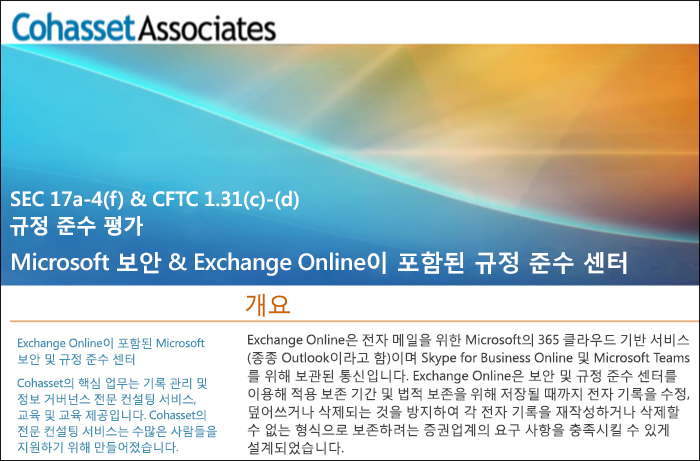

# SEC Rule 17a-4를 준수하기 위해 Exchange Online과 보안 및 준수 센터 사용Use Exchange Online and the Security & Compliance Center to comply with SEC Rule 17a-4

조직에서 데이터 보존 을위한 규제 표준을 준수해야하는 경우 Office 365 보안 및 준수 센터는 Exchange Online에서 데이터 수명주기를 관리하는 기능을 제공합니다. 여기에는 데이터를 보존, 감사, 검색 및 내보내기 기능이 포함됩니다. 이러한 기능은 대부분의 조직의 요구를 충족하기에 충분합니다.If your organization needs to comply with regulatory standards for retaining your data, the Office 365 Security & Compliance Center provides features to manage the lifecycle of your data in Exchange Online. This includes the ability to retain, audit, search, and export your data. These capabilities are sufficient to meet the needs of most organizations.

그러나 고도로 규제된 산업 분야의 일부 조직은 더 엄격한 규제 요건의 적용을 받습니다. 예를 들어, 은행이나 중개인과 같은 금융 기관은 증권 거래위원회 (SEC)에서 발급한 규칙 17a-4의 적용을 받습니다. 규칙 17a-4는 기록 보존의 기간, 형식, 품질, 가용성 및 책임과 같은 기록 관리의 여러 측면을 포함하여 전자 데이터 저장에 대한 특정 요구 사항을 규정하고 있습니다.However, some organizations in highly regulated industries are subject to more stringent regulatory requirements. For example, financial institutions such as banks or broker dealers are subject to Rule 17a-4 issued by the Securities and Exchange Commission (SEC). Rule 17a-4 has specific requirements for electronic data storage, including many aspects of record management, such as the duration, format, quality, availability, and accountability of records retention.

이러한 조직이 보안 및 준수 센터가 Exchange online에 대한 규정 의무, 특히 규칙 17a-4 요구 사항을 충족하기 위해 어떻게 활용될 수 있는지 더 잘 이해할 수 있도록 Cohasset Associates와의 파트너십을 통해 평가를 발표했습니다.To help these organizations better understand how the Security & Compliance Center can be leveraged to meet their regulatory obligations for Exchange Online, specifically in relation to Rule 17a-4 requirements, we have released an assessment in partnership with Cohasset Associates.

Cohasset은 Exchange Online 및 Security & Compliance Center가 권장대로 구성될 떄 CFTC 규칙 1.31 (c) - (d), FINRA 규칙 4511 및 SEC 규칙 17a-4의 관련 저장소 요구 사항을 충족하는 것을 확인했습니다. 우리는 금융 기관에 대한 기록 보존을 위해 전 세계적으로 가장 규범력이 강한 지침을 제시하기 때문에 이 규칙을 목표로 정했습니다.Cohasset validated that when Exchange Online and the Security & Compliance Center are configured as recommended, they meet the relevant storage requirements of CFTC Rule 1.31(c)-(d), FINRA Rule 4511, and SEC Rule 17a-4.  We targeted this set of rules because they represent the most prescriptive guidance globally for records retention for financial institutions.

## Cohasset 평가판 다운로드Download the Cohasset assessment

[Cohasset 평가판을 여기에서 다운로드](https://servicetrust.microsoft.com/ViewPage/TrustDocuments?command=Download&downloadType=Document&downloadId=9fa8349d-a0c9-47d9-93ad-472aa0fa44ec&docTab=6d000410-c9e9-11e7-9a91-892aae8839ad_FAQ_and_White_Papers)할 수 있습니다.You can [download the Cohasset assessment here](https://servicetrust.microsoft.com/ViewPage/TrustDocuments?command=Download&downloadType=Document&downloadId=9fa8349d-a0c9-47d9-93ad-472aa0fa44ec&docTab=6d000410-c9e9-11e7-9a91-892aae8839ad_FAQ_and_White_Papers).

## 이 평가는 Exchange Online에만 적용됩니다.This assessment is specific to Exchange Online

이 평가는 Exchange Online에만 적용됩니다. 이 평가에는 SharePoint Online 또는 비즈니스용 OneDrive와 같은 다른 Office 365 서비스는 포함되지 않지만 향후에는 SEC 17a-4와 관련하여 해당 서비스에 대한 지원을 계획하고 있습니다.Note that this assessment is specific to Exchange Online. The assessment does not include other Office 365 services such as SharePoint Online or OneDrive for Business, although we are planning support for those services with respect to SEC 17a-4 in the future.

Skype 비즈니스 및 팀도 Exchange Online에 데이터를 저장한다는 사실을 이해하는 것이 중요합니다. 따라서 평가는 Skype for Business의 메시지와 팀의 채널 및 채팅 메시지를 포함합니다.It’s important to understand that Skype for Business and Teams also store data in Exchange Online.  Therefore, the assessment does cover messages from Skype for Business and channel and chat messages from Teams.

## 보존 잠금을 사용하는 것이 권장 구성의 핵심입니다.Using Preservation Lock is key to the recommended configuration

고도로 규제된 산업은 종종 WORM(write once, read many) 요구사항을 충족시키기 위해 전자통신을 저장해야합니다. WORM 요구 사항은 레코드가 포함되어 있어야 하는 저장소 솔루션을 지정합니다.Highly regulated industries are often required to store electronic communications to meet the WORM (write once, read many) requirement. The WORM requirement dictates a storage solution in which a record must be:

- 보존 기간을 줄이면 보존할 수 있지만 보존 기간만 연장됩니다.Retained for a required retention period that cannot be shortened, only increased.
- 불변이란 필요한 보존 기간동안 해당 레코드를 덮어 쓰거나 지우거나 변경할 수 없음을 의미합니다.Immutable, meaning that the record cannot be overwritten, erased, or altered during the required retention period.

Exchange Online에서 [보존 정책](retention-policies.md)이 사용자의 사서함에 적용되면 정책의 기준에 따라 모든 사용자의 콘텐츠가 유지됩니다. 실제로 사용자가 전자 메일을 삭제 또는 수정하려고하면 변경되기 전의 전자 메일 복사본이 사용자의 사서함에 있는 숨겨진 안전한 위치에 보존됩니다. 보존 정책을 사용하면 조직에서 전자 통신을 유지할 수 있지만 이러한 정책은 수정될 수 있습니다.In Exchange Online, when a [retention policy](retention-policies.md) is applied to a user's mailbox, all of the user's content will be retained based on the criteria of the policy. In fact, if a user attempts to delete or modify an email, a copy of the email before the change is made will be preserved in a secure, hidden location in the user's mailbox. Retention polices can ensure that an organization retains electronic communications, but those policies can be modified.

보존 정책에 보존 잠금을 설정하면 정책을 수정할 수 없습니다. 실제로 보존 정책에 보존 잠금이 적용된 후에는 다음과 같은 작업이 제한됩니다.By placing a Preservation Lock on a retention policy, an organization ensures that the policy cannot be modified. In fact, after a Preservation Lock is applied to a retention policy, the following actions are restricted:

- 정책의 보존 기간은 단축되지 않고 늘릴 수 있습니다.The retention period of the policy can only be increased, not shortened.
- 사용자를 정책에 추가할 수는 있지만 사용자를 제거할 수는 없습니다.Users can be added to the policy, but no user can be removed.
- 보존 정책은 관리자가 삭제할 수 없습니다.The retention policy cannot be deleted by an administrator.

보존 잠금 장치는 SEC 17a-4 규정 요구사항을 충족하는 데 도움이 됩니다.Preservation Lock can help you meet the SEC 17a-4 regulatory requirements.

## 보존 잠금을 설정하는 방법How to set up Preservation Lock

PowerShell을 사용하여 보존 정책을 잠글 수 있습니다. 자세한 내용은 [ 보관 정책 잠금 ](retention-policies.md#locking-a-retention-policy)을 참조하십시오.You can lock a retention policy by using PowerShell. For more information, see [Locking a retention policy](retention-policies.md#locking-a-retention-policy).

## 알려진 제한Known limitations

Exchange Online의 몇 가지 제한 사항을 알고 있습니다. 저희은 이를 적극적으로 작업 중이며 2019년 7월에 이러한 시나리오에 대한 지원을 제공할 예정입니다.We’re aware of a few limitations in Exchange Online. We’re actively working on these and expect to release support for these scenarios in July 2019:

- 항목 수준 감사는 Office 365 그룹 사서함에서 사용할 수 없습니다.Item-level auditing is not available in Office 365 Group mailboxes.
- 팀 채팅 및 채널 메시지의 경우 스레드 통신을 사용할 수 없습니다.Threaded communications are not available for Teams chat and channel messages.
- 팀 채팅 및 채널 메시지에 좋아요는 포함되어 있지 않습니다.Likes are not retained for Teams chat and channel messages.
