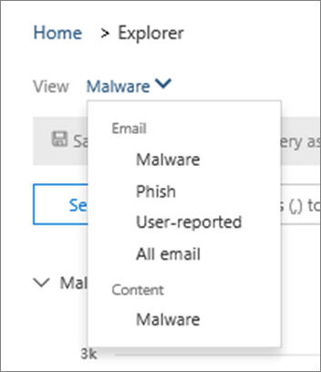
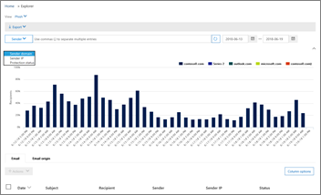

# 보안 &amp; 및 준수 센터에서 위협 탐색기 사용Use Threat Explorer in the Security &amp; Compliance Center

조직에 [Office 365 Advanced Threat Protection 계획 2](office-365-ti.md)가 있고 필요한 사용 권한이 있는 경우 위협 탐색기를 사용 하 여 위협을 식별 하 고 분석할 수 있습니다.If your organization has [Office 365 Advanced Threat Protection Plan 2](office-365-ti.md), and you have the necessary permissions, you can use Threat Explorer to identify and analyze threats. 예를 들어 배달 된 악성 전자 메일을 식별 하 고 삭제할 수 있으며, Office 365 보안 기능으로 인해 발견 된 맬웨어를 볼 수도 있습니다.For example, you can identify and delete malicious email that was delivered, or see malware that was caught by Office 365 security features. 위협 탐색기 (탐색기 라고도 함)는 보안 운영 팀에서 보안 &amp; 및 준수 센터의 위협에 대해 조사 하 고 대응 하는 데 도움이 되는 강력한 거의 실시간 도구입니다.Threat Explorer (also referred to as Explorer) is a powerful near real-time tool to help Security Operations teams investigate and respond to threats in the Security &amp; Compliance Center.
  

  
Explorer를 &amp; 사용 하려면 보안 및 준수 센터에서 **위협 관리** \> **탐색기**로 이동 합니다.To use Explorer, in the Security &amp; Compliance Center, go to **Threat management** \> **Explorer**.

> [!IMPORTANT]
> office 365 위협 인텔리전스는 이제 추가 위협 방지 기능을 사용 하 여 office 365 Advanced Threat protection 계획 2에 포함 되어 있습니다.Office 365 Threat Intelligence is now part of Office 365 Advanced Threat Protection Plan 2, with additional threat protection capabilities. 자세한 내용은 [office 365 advanced threat protection 요금제 및 가격](https://products.office.com/exchange/advance-threat-protection) 및 [office 365 advanced threat protection 서비스 설명을](https://docs.microsoft.com/office365/servicedescriptions/office-365-advanced-threat-protection-service-description)참조 하세요.To learn more, see [Office 365 Advanced Threat Protection plans and pricing](https://products.office.com/exchange/advance-threat-protection) and the [Office 365 Advanced Threat Protection Service Description](https://docs.microsoft.com/office365/servicedescriptions/office-365-advanced-threat-protection-service-description).
      
## 탐색기 개요Explorer overview

탐색기에는 조직에 대 한 기타 보안 위협 및 위험 뿐 아니라 전자 메일 및 Office 365의 파일에 있는 의심 스러운 맬웨어 및 피싱에 대 한 정보가 표시 됩니다.Explorer displays information about suspected malware and phish in email and files in Office 365, as well as other security threats and risks to your organization. 처음으로 탐색기를 열면 기본 보기에는 최근 7 일간의 전자 메일 맬웨어 검색이 표시 됩니다.When you first open Explorer, the default view shows email malware detections for the past 7 days. 또한 Explorer는 [안전한 링크](atp-safe-links.md) 및 [안전한 첨부 파일](atp-safe-attachments.md) 을 포함 하 여 Office 365의 보안 보호 기능을 표시할 수 있으며, 이전의 30 일간의 데이터를 표시 하도록 수정할 수 있습니다.Explorer can also show security protection features in Office 365, including [Safe Links](atp-safe-links.md) and [Safe Attachments](atp-safe-attachments.md) and can be modified to show data for the past 30 days. office 365 Advanced Threat Protection 계획 2 또는 Office 365 E5에 대 한 평가판 subcription 있는 경우에는 최근 7 일간의 검색 및 전자 메일 데이터만 볼 수 있습니다.If you have a trial subcription for Office 365 Advanced Threat Protection Plan 2 or Office 365 E5, you will only see detections and email data for the past 7 days.
  

  
표시 되는 정보를 변경 하려면 보기 메뉴를 사용 합니다.Use the View menu to change what information is displayed.
  

  
Explorer에는 상위 대상 사용자, 최고 맬웨어 제품군, 검색 기술 등의 세부 정보를 확인할 수 있는 다양 한 필터링 및 쿼리 기능이 있습니다.Explorer has several filtering and querying capabilities that enable you to drill into details, such as top targeted users, top malware families, detection technology and more. 각 보고서 종류에서는 다양 한 방식으로 데이터를 보고 탐색할 수 있습니다.Each kind of report offers a variety of ways to view and explore data.

> [!IMPORTANT]
> 별표 (\*) 또는 물음표 (?)와 같은 와일드 카드 문자는 탐색기에서 사용 하지 마십시오.Do not use wildcard characters, such as an asterisk (\*) or a question mark (?), with Explorer. 전자 메일 메시지의 제목 필드를 검색 하면 Explorer는 부분 일치를 수행 하 고 와일드 카드 검색과 비슷한 결과를 반환 합니다.When you search on the Subject field for email messages, Explorer will perform partial matching and yield results similar to a wildcard search.

## 전자 \> 메일 맬웨어Email \> Malware

이 보기에는 맬웨어를 포함 하는 것으로 확인 된 전자 메일 메시지가 표시 됩니다.This view shows email messages identified as containing malware.  

맬웨어 제품군, 보낸 사람 도메인, 보낸 사람 IP, 보호 상태 (Office 365의 위협 보호 기능 및 정책에 의해 수행 된 작업) 및 검색 기술 (맬웨어 검색 방법)에 따라 차트의 정보를 확인 합니다.View information in the chart by malware family, sender domain, sender IP, protection status (actions taken by your threat protection features and policies in Office 365), and detection technology (how the malware was detected).  

         

차트 아래에서 주요 맬웨어 패밀리, 상위 대상 사용자 및 특정 메시지에 대 한 세부 정보를 확인할 수 있습니다.Below the chart, view details about top malware families, top targeted users, and more details about specific messages. 

## 전자 \> 메일 피싱Email \> Phish

이 보기에는 피싱 시도로 식별 된 전자 메일 메시지가 표시 됩니다.This view shows email messages identified as phishing attempts.  

보낸 사람 도메인, 보낸 사람 IP 및 보호 상태 (Office 365의 위협 보호 기능 및 정책에 의해 수행 된 작업) 별로 정보를 확인 합니다.View information by sender domain, sender IP, and protection status (actions taken by your threat protection features and policies in Office 365). 

 

차트 아래에서 특정 메시지에 대 한 세부 정보를 확인 합니다.Below the chart, view more details about specific messages. 

## 전자 \> 메일 사용자가 보고 됨Email \> User-reported

이 보기에는 사용자가 정크 메일로 보고 되거나, 정크 메일, 피싱 전자 메일이 표시 됩니다.This view shows email that users have reported as junk, not junk, or phishing email.  

정보 보기 (사용자가 전자 메일을 정크 메일로, 정크 메일이 아님, 또는 피싱를 결정 함), 배달 사유 (스팸 필터 정책, 메일 흐름 규칙, 수신 거부 목록, 수신 허용-보낸 사람 목록 등을 사용 하 여 전자 메일을 특정 위치로 이동 해야 하는 이유) 등)View information by report type (the user's determination that the email was junk, not junk, or phish), and by delivery reason (reasons why email went to a specific location, such as a spam filter policy, a mail flow rule, a blocked-senders list, a safe-senders list, etc.).  

  

차트 아래에 있는 특정 전자 메일 메시지에 대 한 세부 정보 (예: 제목 줄, 보낸 사람의 IP 주소, 메시지를 정크로 보고 한 사용자, 정크 메일, 피싱 등)를 자세히 확인 합니다.Below the chart, view more details about specific email messages, such as subject line, the sender's IP address, the user that reported the message as junk, not junk, or phish, and more. 

## 전자 \> 메일 모든 메일Email \> All mail

이 보기에는 모든 비 악성 메일 (일반 전자 메일, 스팸 및 대량 메일)과 마찬가지로 피싱 또는 맬웨어로 인 한 악성 전자 메일을 비롯 한 전자 메일 활동의 모든 보기가 표시 됩니다.This views shows an all-up view of email activity, including email identified as malicious due to phishing or malware, as well all non-malicious mail (normal email, spam, and bulk mail). 

> [!NOTE]
> **너무 많은 데이터를 표시 하는 데**오류가 발생 하는 경우 필터를 추가 하 고 필요한 경우 보고 있는 날짜 범위를 좁힐 수 있습니다.If you get an error that reads **Too much data to display**, add a filter and, if necessary, narrow the date range you're viewing. 

필터를 적용 하려면 **보낸 사람**을 선택 하 고 목록에서 항목을 선택한 다음 새로 고침 단추를 클릭 합니다.To apply a filter, choose **Sender**, select an item in the list, and then click the Refresh button. 이 예제에서는 **검색 기술을** 필터로 사용 했으며 몇 가지 옵션을 사용할 수 있습니다.In our example, we used **Detection technology** as a filter (there are several options available). 보낸 사람, 보낸 사람의 도메인, 받는 사람, 제목, 첨부 파일 이름, 맬웨어 제품군, 보호 상태 (Office 365의 위협 보호 기능 및 정책에 따라 수행 된 작업), 검색 기술 (맬웨어 감지 방법) 및 자세한.View information by sender, sender's domain, recipients, subject, attachment filename, malware family, protection status (actions taken by your threat protection features and policies in Office 365), detection technology (how the malware was detected), and more. 

 

차트 아래에 제목 줄, 받는 사람, 보낸 사람, 상태 등의 특정 전자 메일 메시지에 대 한 세부 정보를 확인 합니다.Below the chart, view more details about specific email messages, such as subject line, recipient, sender, status, and so on. 

## 콘텐츠 \> 맬웨어Content \> Malware

이 보기는 SharePoint Online, 비즈니스용 OneDrive 및 Microsoft 팀의 Office 365 Advanced Threat Protection에서 악의적으로 식별 된 파일을 보여 줍니다.This view shows files that were identified as malicious by Office 365 Advanced Threat Protection in SharePoint Online, OneDrive for Business, and Microsoft Teams.

맬웨어 제품군, 검색 기술 (맬웨어가 감지 된 방법) 및 작업 (OneDrive, SharePoint 또는 팀)을 통해 정보를 확인 합니다.View information by malware family, detection technology (how the malware was detected), and workload (OneDrive, SharePoint, or Teams). 

  

차트 아래에서 첨부 파일 이름, 작업, 파일 크기, 파일을 마지막으로 수정한 사용자 등 특정 파일에 대 한 세부 정보를 확인 합니다.Below the chart, view more details about specific files, such as attachment filename, workload, file size, who last modified the file, and more. 
  
## (새로운 방법!) 간편 필터 기능(New!) Click-to-filter capabilities

새로 만들기 Explorer를 클릭 하 여 필터링 할 수 있습니다.New to Explorer is the ability to click to filter. 범례에서 항목을 클릭 하면 해당 항목이 보고서에 대 한 필터가 됩니다.When you click an item in the legend, that item becomes a filter for the report. 예를 들어 Explorer에서 맬웨어 보기를 보고 있다고 가정 합니다.For example, suppose we are looking at the Malware view in Explorer:
  

  
이 차트에서 **ATP 샌드 박싱** 를 클릭 하면 다음과 같은 보기가 만들어집니다.Clicking **ATP Detonation** in this chart results in a view like this: 
  

  
이 보기에서는 [Office 365 ATP 안전한 첨부](atp-safe-attachments.md)파일에서 열 된 파일에 대 한 데이터를 살펴봅니다.In this view, we are now looking at data for files that were detonated by [Office 365 ATP Safe Attachments](atp-safe-attachments.md). 이 차트 아래에서 ATP 안전한 첨부 파일에 의해 검색 된 첨부 파일이 있는 특정 전자 메일 메시지에 대 한 세부 정보를 확인할 수 있습니다.Below the chart, we can see details about specific email messages that had attachments that were detected by ATP Safe Attachments.
  

  
항목을 하나 이상 선택 하면 선택한 항목에 대해 선택할 수 있는 여러 선택 항목이 제공 되는 **작업** 메뉴가 활성화 됩니다.Selecting one or more items activates the **Actions** menu, which offers several choices from which to choose for the selected item(s). 
  

  
클릭 하 고 특정 세부 정보로 탐색 하는 기능을 통해 위협을 조사 하는 데 많은 시간을 절약할 수 있습니다.The ability to filter in a click and navigate to specific details can save you a lot of time in investigating threats.
  
## 탐색기를 가져오려면 어떻게 해야 합니까?How do I get Explorer?

Explorer는 [Office 365 Advanced Threat Protection 계획 2](office-365-ti.md)에 포함 되어 있습니다.Explorer is included in [Office 365 Advanced Threat Protection Plan 2](office-365-ti.md). 

Explorer를 보고 사용 하려면 보안 관리자 또는 보안 판독기에 부여 된 것과 같은 적절 한 사용 권한이 있어야 합니다.You must have appropriate permissions, such as those granted to a security administrator or security reader, in order to view and use Explorer. 자세한 내용은 [Office 365 보안 &amp; 및 준수 센터의 사용 권한](permissions-in-the-security-and-compliance-center.md)를 참조 하세요.To learn more, see [Permissions in the Office 365 Security &amp; Compliance Center](permissions-in-the-security-and-compliance-center.md).
  
## 관련 항목Related topics

[Office 365 보안 &amp; 및 준수 센터의 보고서 및 정보Reports and insights in the Office 365 Security &amp; Compliance Center](reports-and-insights-in-security-and-compliance.md)
  
[배달 된 악성 전자 메일 찾기 및 조사 (Office 365 Threat Invesitgation 및 응답)Find and investigate malicious email that was delivered (Office 365 Threat Invesitgation and Response)](investigate-malicious-email-that-was-delivered.md)
  
[Office 365의 스팸 방지 및 맬웨어 방지 보호Anti-spam and anti-malware protection in Office 365](anti-spam-and-anti-malware-protection.md)
  

