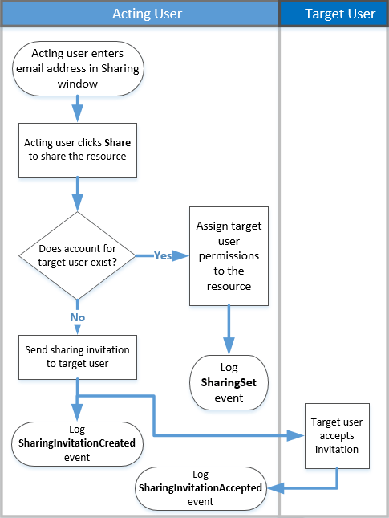

# 외부 사용자와 공유된 리소스를 찾기 위한 감사 공유

공유는 SharePoint Online 및 비즈니스용 OneDrive의 주요 활동 이며, Office 365 조직에서 널리 사용 되 고 있습니다. 이제 관리자는 Office 365 감사 로그의 공유 감사를 사용 하 여 조직에서 공유가 사용 되는 방식을 확인할 수 있습니다. 
  
## SharePoint 공유 스키마

공유 정책 및 공유 링크 이벤트를 제외 하 고 이벤트 공유가 파일 및 폴더 관련 이벤트와는 다른 사용자에 게 영향을 주는 한 가지 기본 방법으로 사용 됩니다. 예를 들어 user a는 사용자 B에 게 파일에 대 한 액세스 권한을 제공 합니다. 이 예에서는 사용자 A가 작업 중인 *사용자* 이 고 사용자 B가 *대상 사용자*입니다. SharePoint 파일 스키마에서 작동 중인 사용자의 작업은 파일 자체에만 영향을 줍니다. 사용자 a가 파일을 여는 경우, **fileaccessed** 한 이벤트에서 필요한 정보는 작업 중인 사용자입니다. 이러한 차이를 해결 하기 위해 *SharePoint 공유 스키마*라고 하는 별도의 스키마를 통해 공유 이벤트에 대 한 추가 정보를 캡처할 수 있습니다. 이렇게 하면 관리자가 리소스를 공유 하는 사람 및 리소스를 공유한 사용자에 대 한 자세한 정보를 파악할 수 있습니다. 
  
공유 스키마는 감사 로그에서 공유 이벤트와 관련 된 두 가지 추가 필드를 제공 합니다. 
  
- **targetuserorgroupname** -리소스를 공유 하는 대상 사용자 또는 그룹의 UPN 이나 이름을 저장 합니다 (이전 예제에서는 user B). 
    
- **TargetUserOrGroupType** -대상 사용자 또는 그룹이 구성원, 게스트, 그룹 또는 파트너 인지를 식별 합니다. 
    
이러한 두 필드는 사용자, 작업 및 날짜와 같은 Office 365 감사 로그 스키마의 다른 속성 외에, *누가 누구* 에 게 *어떤* 리소스를 공유 ** 하는지를 알려 줄 수 있습니다. ** 
  
공유 스토리에 중요 한 또 다른 스키마 속성이 있습니다. **EventData** 속성은 공유 이벤트에 대 한 추가 정보를 저장 합니다. 예를 들어 사용자가 다른 사용자와 사이트를 공유 하는 경우이 작업을 수행 하려면 SharePoint 그룹에 대상 사용자를 추가 합니다. **EventData** 속성은이 추가 정보를 캡처하여 관리자에 게 컨텍스트를 제공 합니다. 

## SharePoint 공유 모델 및 공유 이벤트

공유는 실제로 세 가지 개별 이벤트 인 **SharingSet**, **SharingInvitationCreated**및 **SharingInvitaitonAccepted**에 의해 정의 됩니다. 다음은 공유 이벤트가 Office 365 감사 로그에 기록 되는 방식에 대 한 워크플로입니다. 
  

  
사용자 (작업 중인 사용자)가 다른 사용자 (대상 사용자)와 리소스를 공유 하려는 경우 먼저 SharePoint (또는 비즈니스용 OneDrive)가 대상 사용자의 전자 메일 주소가 조직의 디렉터리에 있는 사용자 계정과 이미 연결 되어 있는지 확인 합니다. 대상 사용자가 조직의 디렉터리에 있는 경우 SharePoint는 다음을 수행 합니다.
  
-  리소스에 액세스할 수 있는 대상 사용자 권한을 즉시 할당 합니다. 
    
- 대상 사용자의 전자 메일 주소로 공유 알림을 보냅니다.
    
- **SharingSet** 이벤트를 기록 합니다. 
    
 대상 사용자에 대 한 사용자 계정이 조직의 디렉터리에 없으면 SharePoint는 다음을 수행 합니다. 
  
- 공유 초대를 만들어 대상 사용자의 전자 메일 주소로 보냅니다.
    
- **SharingInvitationCreated** 이벤트를 기록 합니다. 
    
    > [!NOTE]
    > **SharingInvitationCreated** 이벤트는 대상 사용자가 공유 된 리소스에 액세스할 수 없는 경우 항상 외부 또는 게스트 공유와 연결 됩니다. 
  
대상 사용자가 초대의 링크를 클릭 하 여 전송 된 공유 초대를 수락 하면 SharePoint에서 **SharingInvitationAccepted** 이벤트를 기록 하 고 리소스에 액세스 하기 위한 대상 사용자 권한을 할당 합니다. 초대를 보낸 사용자의 id와 실제로 초대를 수락한 사용자에 대 한 정보를 비롯 하 여 대상 사용자에 대 한 추가 정보도 기록 됩니다. 경우에 따라 이러한 사용자 (또는 전자 메일 주소)는 다를 수 있습니다. 
  

  
## 외부 사용자와 공유 된 리소스를 확인 하는 방법

관리자에 대 한 일반적인 요구 사항에는 조직 외부의 사용자와 공유 된 모든 리소스의 목록이 작성 됩니다. 이제 관리자는 Office 365의 공유 감사를 사용 하 여이 목록을 생성할 수 있습니다. 이 작업을 수행하는 방법은 다음과 같습니다.
  
### 1 단계: 공유 이벤트 검색 및 결과를 CSV 파일로 내보내기

첫 번째 단계는 공유 이벤트에 대 한 Office 365 감사 로그를 검색 하는 것입니다. 감사 로그 검색에 대 한 자세한 내용 (필요한 권한 포함)은 [Security & 준수 센터에서 감사 로그 검색](search-the-audit-log-in-security-and-compliance.md)을 참조 하십시오.
  
1. [https://protection.office.com](https://protection.office.com)으로 이동합니다.
    
2. 회사 또는 학교 계정을 사용하여 Office 365에 로그인합니다.
    
3. Security & 준수 센터의 왼쪽 창에서 **검색**  > **감사 로그 검색**을 클릭 합니다.
    
    **감사 로그 검색** 페이지가 표시 됩니다. 
    
4. **작업**아래에서 **공유 작업** 을 클릭 하 여 공유 이벤트만 검색 합니다. 
    
    
  
5.  날짜 및 시간 범위를 선택 하 여 해당 기간 내에 발생 한 공유 이벤트를 찾습니다. 
    
6. 검색 **** 을 클릭 하 여 검색을 실행 합니다. 
    
7. 검색 실행이 완료 되 고 결과가 표시 되 면 결과 **내보내기** \> **모든 결과 다운로드**를 클릭 합니다.
    
    내보내기 옵션을 선택한 후에는 CSV 파일을 열거나 저장 하 라는 메시지가 창 맨 아래에 표시 됩니다.
    
8. 다른 **** \> **이름으로 저장** 저장을 클릭 하 고 로컬 컴퓨터의 폴더에 CSV 파일을 저장 합니다. 
    

  
### 2 단계: 외부 사용자와 공유 되는 리소스에 대 한 CSV 파일 필터링

다음 단계는 **SharingSet** 및 **SharingInvitationCreated** 이벤트에 대 한 CSV를 필터링 하 고 **TargetUserOrGroupType** 속성이 **Guest**인 이벤트를 표시 하는 것입니다. Excel에서 파워 쿼리 기능을 사용 하 여이 작업을 수행 합니다. 다음은 Excel 2016에서 수행 하는 절차입니다. 
  
1. Excel 2016에서 빈 통합 문서를 엽니다.
    
2. **데이터** 탭을 클릭 합니다. 
    
3. \> **CSV에서** **파일에서** **새 쿼리** \> 를 클릭 합니다.
    
    
  
4. 1 단계에서 다운로드 한 CSV 파일을 엽니다.
    
    CSV 파일이 쿼리 편집기에서 열립니다. 여기에는 **Time**, **User**, **Action**및 **Detail**이라는 네 가지 열이 있습니다. **세부 정보** 열은 다중 속성 필드입니다. 다음 단계에서는 **세부** 정보 열의 각 속성에 대해 새 열을 만듭니다. 
    
5. **세부 정보** 열을 선택한 다음 **홈** 탭에서 **구분 기호로** **분할 열** \> 을 클릭 합니다.
    
    
  
6. **구분 기호 단위로 열 분할** 창에서 다음을 수행 합니다. 
    
      - **구분 기호 선택 또는 입력**에서 **쉼표**를 선택 합니다.
    
      - **분할**에서 **구분 기호의 각 항목**을 선택 합니다.
    
7. **확인**을 클릭합니다.
    
    **세부 정보** 열이 여러 열로 분할 됩니다. 각각의 새 열에는 detail 이라는 이름이 지정 됩니다. **1**, **detail. 2**, **세부 정보 3**등. **자세한 내용은 Detail** 의 각 셀에 있는 값에 속성 이름을 접두사로 사용 합니다. 예 **: SharingSet**, **Operation: SharingInvitationAccepted**및 **Operation: SharingInvitationCreated**
    
    
  
8. **파일** 탭에서 **로드 닫기를 &amp; ** 클릭 하 여 쿼리 편집기를 닫고 Excel 통합 문서에서 파일을 엽니다. 
    
    다음 단계는 **SharingSet** 및 **SharingInvitationCreated** 이벤트만 표시 하도록 파일을 필터링 하는 것입니다. 
    
9. **홈** 탭으로 이동한 다음 **작업** 열을 선택 합니다. 
    
10. **정렬 &amp; 필터** 드롭다운 목록에서 모든 선택을 취소 하 고 **SharingSet** 및 **SharingInvitationCreated**을 선택한 다음 **확인**을 클릭 합니다.
    
    Excel에 **SharingSet** 및 **SharingInvitationCreated** 이벤트에 대 한 행이 표시 됩니다. 
    
11. **Detail. 17** (또는 **TargetUserOrGroupType** 속성을 포함 하는 열)로 이동 하 여 선택 합니다. 
    
12. **정렬 &amp; 필터** 드롭다운 목록에서 모든 선택을 취소 하 고 **TargetUserOrGroupType: Guest**를 선택한 다음 **확인**을 클릭 합니다.
    
    이제 외부 사용자는 **TargetUserOrGroupType: Guest**값으로 식별 되므로 **SharingInvitationCreated** 및 **SharingSet** 이벤트와 대상 사용자가 조직 외부에 있는 위치에 대 한 행이 표시 됩니다. 
    
다음 표에는 지정 된 날짜 범위 내에서 게스트 사용자와 리소스를 공유 하는 조직의 모든 사용자가 나와 있습니다.
  

  
이 속성은 이전 표에는 포함 되어 있지 않지만, **자세히. 10 개** 열 또는 **ObjectId** 속성이 포함 된 모든 열에는 대상 사용자와 공유 된 리소스를 식별 합니다. 예를 `ObjectId:https:\/\/contoso-my.sharepoint.com\/personal\/sarad_contoso_com\/Documents\/Southwater Proposal.docx`들어
  
> [!TIP]
> 게스트 사용자에 게 실제로 리소스에 액세스 하기 위한 사용 권한이 할당 된 시간을 확인 하려면 (이러한 리소스와 공유 하는 리소스만 해당) 10, 11 및 12 단계를 반복 하 고 **SharingInvitationAccepted** 및 SharingSet의 필터를 적용 합니다. ** **10 단계의 이벤트 
