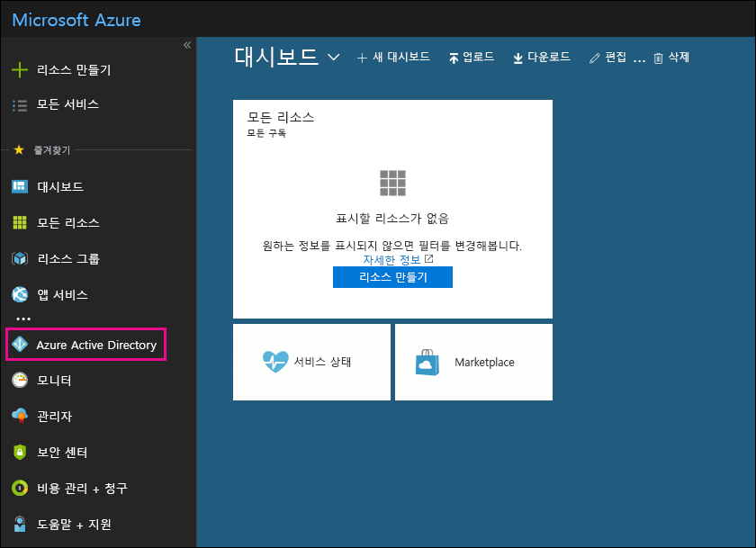

# Office 365에서 무료 Azure Active Directory 구독 사용Use your free Azure Active Directory subscription

조직에 Office 365, Microsoft Dynamics CRM Online, Enterprise Mobility Suite 또는 기타 Microsoft 서비스에 대한 유료 구독이 있는 경우 Microsoft Azure Active Directory는 무료 구독이 제공됩니다. 사용자 및 다른 관리자는 Azure AD를 사용하여 사용자 및 그룹 계정을 만들고 관리할 수 있습니다. Azure AD를 사용하려면 Azure Portal로 이동하고 Office 365 계정을 사용하여 로그인하면 됩니다.If your organization has a paid subscription to Office 365, Microsoft Dynamics CRM Online, Enterprise Mobility Suite, or other Microsoft services, you have a free subscription to Microsoft Azure Active Directory. You and other admins can use Azure AD to create and manage user and group accounts. To use Azure AD, just go to the Azure portal and sign in using your Office 365 account.
  
## 시작하기 전에Before you begin

비공개 브라우징 세션(일반 세션이 아님)을 사용하여 Azure Portal에 액세스합니다(아래 1단계). 이렇게 해야 현재 로그인된 자격 증명이 Azure로 전달되지 않습니다. Internet Explorer에서 InPrivate 브라우징 세션을 열거나 Mozilla FireFox에서 비공개 브라우징 세션을 열려면 Ctrl+Shift+P를 누르면 됩니다. Google Chrome에서 비공개 브라우징 세션(시크릿 모드 창이라고 함)을 열려면 Ctrl+Shift+N을 누릅니다.Use a private browsing session (not a regular session) to access the Azure portal (in step 1 below) because this will prevent the credential that you are currently logged on with from being passed to Azure. To open an InPrivate Browsing session in Internet Explorer or a Private Browsing session in Mozilla FireFox, just press CTRL+SHIFT+P. To open a private browsing session in Google Chrome (called an incognito window), press CTRL+SHIFT+N.
  
## Azure Active Directory에 액세스Isolation and Access Control in Azure Active Directory

1. [portal.azure.com](https://portal.azure.com)으로 이동한 후 Office 365 회사 또는 학생 계정으로 로그인합니다.Go to [portal.azure.com](https://portal.azure.com) and sign in with your Office 365 work or student account. 
    
2. Azure Portal의 왼쪽 탐색 창에서 **Azure Active Directory**를 클릭합니다.In the left navigation pane in the Azure portal, click **Azure Active Directory**.
    
    
  
    **Azure Active Directory** 관리 센터가 표시됩니다.The **Azure Active Directory** admin center is displayed. 
    
## 추가 정보More information

- Office 365 관리 센터에서 **Azure Active Directory** 관리 센터에 액세스할 수도 있습니다. Office 365 관리 센터의 왼쪽 탐색 창에서 **관리 센터** \> **Azure Active Directory**를 클릭합니다.You can also access the **Azure Active Directory** admin center from the Office 365 admin center. In the left navigation pane of the Office 365 admin center , click **Admin centers** \> **Azure Active Directory**.
    
- 사용자 및 그룹 관리와 기타 디렉터리 관리 작업 수행에 대한 자세한 내용은 [Azure AD 디렉터리 관리](https://docs.microsoft.com/azure/active-directory/active-directory-administer)를 참조하세요.For information about managing users and groups and performing other directory management tasks, see [Administering your Azure AD directoryhttp://go.microsoft.com/fwlink/p/?LinkId=512488](https://docs.microsoft.com/azure/active-directory/active-directory-administer).
