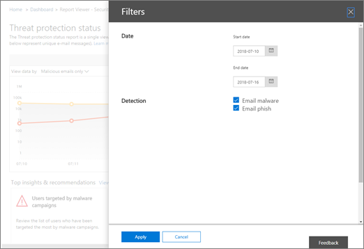

# 보안 &amp; 및 준수 센터의 전자 메일 보안 보고서 보기View email security reports in the Security &amp; Compliance Center

[ &amp; 보안 및 준수 센터](https://protection.office.com) 에서 다양 한 보고서를 사용할 수 있으므로 Office 365의 스팸 방지, 맬웨어 방지 및 암호화 기능과 같은 전자 메일 보안 기능에서 조직을 보호 하는 방법을 확인할 수 있습니다.A variety of reports are available in the [Security &amp; Compliance Center](https://protection.office.com) to help you see how email security features, such as anti-spam, anti-malware, and encryption features in Office 365 are protecting your organization. [필요한 권한이](#what-permissions-are-needed-to-view-these-reports) &amp; 있는 경우 **보고서** \> **대시보드로**이동 하 여 보안 및 준수 센터에서 이러한 보고서를 볼 수 있습니다.If you have the [necessary permissions](#what-permissions-are-needed-to-view-these-reports), you can view these reports in the Security &amp; Compliance Center by going to **Reports** \> **Dashboard**.
  

  
전자 메일 보안 보고서에는 다음이 포함 됩니다.Your email security reports include the following:
- [암호화 보고서](#encryption-report) (새로운 방법!)[Encryption report](#encryption-report) (NEW!)
- [위협 방지 상태 보고서Threat Protection Status report](#threat-protection-status-report) 
- [맬웨어 감지 보고서Malware Detections report](#malware-detections-report) 
- [주요 맬웨어 보고서Top Malware report](#top-malware-report)
- [상위 보낸 사람 및 받는 사람 보고서Top Senders and Recipients report](#top-senders-and-recipients-report)
- [스푸핑 감지 보고서Spoof Detections report](#spoof-detections-report)
- [스팸 감지 보고서Spam Detections report](#spam-detections-report)
- [보내고 받은 전자 메일 보고서Sent and received email report](#sent-and-received-email-report)
- [사용자가 보고 한 메시지 보고서User-reported messages report](#user-reported-messages-report)
    
## 암호화 보고서Encryption report

(**새로운 방법!**) **암호화 보고서** 에는 조직의 정책 또는 최종 사용자 컨트롤을 통해 암호화 된 전자 메일 메시지에 대 한 정보가 표시 됩니다.(**NEW!**) The **Encryption report** shows information about email messages that were encrypted, either through your organization's policies, or through end-user controls. 조직의 보안 팀은이 보고서의 정보를 사용 하 여 패턴을 식별 하 고 중요 한 전자 메일 메시지에 대 한 정책을 사전에 적용 하거나 조정할 수 있습니다.Your organization's security team can use information in this report to identify patterns and proactively apply or adjust policies for sensitive email messages.

이 보고서를 보려면 보안 & 준수 센터에서 **보고서** \> **대시보드** \> **암호화 보고서**로 이동 합니다.To view this report, in the Security & Compliance Center, go to **Reports** \> **Dashboard** \> **Encryption report**.

 

보고서를 처음 열면 전자 메일 메시지에 사용 되는 암호화 방법에 대 한 데이터가 이전의 7 일 (7)로 표시 됩니다.When the report first opens, you'll see data about encryption methods used on email messages for the past seven (7) days. 화면 오른쪽 위 모서리에 있는 **필터** 를 클릭 하 여 보고서에 표시 되는 날짜 범위 및 세부 정보를 변경할 수 있습니다.You can change the date range and the details that are displayed in the report by clicking **Filters** in the upper right corner of the screen.

   

또한 **아래로 나누기** 메뉴를 사용 하 여 암호화 서식 파일 (또는 방법)을 통해 데이터를 볼 수도 있습니다.You can also use the **Break down by** menu to view data by encryption template (or method).

또한 **데이터 보기 기준** 메뉴를 사용 하 여 상위 5 개 받는 사람 도메인에 대 한 암호화 된 메시지 수를 확인 하기 위해 보기를 변경할 수 있습니다.And, you can use the **View data by** menu to change the view to see counts of encrypted messages to the top five recipient domains.

새 암호화 보고서를 유연 하 게 사용 하 여 추세를 확인 하 고 적절 한 조치를 취할 수 있습니다.With the flexibility of the new Encryption report, you can view trends and take appropriate actions. 예를 들어 사용자가 암호화 한 전자 메일 메시지가 많은 경우 특정 사용 사례에 대 한 암호화를 자동화 하는 암호화 정책을 추가할 수 있습니다.For example, if you see a high number of email messages encrypted by users, you might want to add an encryption policy to automate encryption for certain use cases. 도움말을 보려면 [Office 365에서 전자 메일 메시지를 암호화 하는 메일 흐름 규칙 정의](define-mail-flow-rules-to-encrypt-email.md)를 참조 하세요. 또 다른 예로, 사용할 수 있는 암호화 서식 파일이 있지만 아무도 사용 하지 않는 경우에는 사용자가 해당 기능에 대 한 교육을 받아야 하는지 여부를 탐색할 수 있습니다.(To get help with that, see [Define mail flow rules to encrypt email messages in Office 365](define-mail-flow-rules-to-encrypt-email.md).) As another example, if you have a number of encryption templates available but no one is using them, you might explore whether users need training for that feature. 

이 보고서를 사용 하면 조직의 보안 및 규정 준수 팀이 메시지 암호화를 사용 하는 방법과 추가 작업이 필요한 지 여부를 모니터링할 수 있습니다.Use this report enables your organization's security and compliance team to monitor how message encryption is being used, and whether further actions are needed. 암호화에 대 한 자세한 내용은 [Office 365의 전자 메일 암호화](email-encryption.md)를 참조 하세요.To learn more about encryption, see [Email encryption in Office 365](email-encryption.md).

## 위협 방지 상태 보고서Threat Protection Status report

**위협 방지 상태** 보고서는 Exchange Online Protection에서 검색 하 여 차단한 악성 전자 메일을 보여 주는 스마트 보고서입니다.The **Threat Protection Status** report is a smart report that shows malicious email that was detected and blocked by Exchange Online Protection. 이 보고서는 맬웨어 또는 시간에 따른 피싱 시도 (최대 90 일)로 식별 된 전자 메일을 확인 하는 데 유용 하며, 보안 관리자가 경향을 식별 하거나 정책 조정이 필요한 지 여부를 결정할 수 있습니다.This report is useful for viewing email identified as malware or a phishing attempt over time (up to 90 days), and it enables security administrators to identify trends or determine whether policies need adjustments.

> [!NOTE]
> [Office 365 ATP](office-365-atp.md) 또는 [Exchange Online Protection](eop/exchange-online-protection-eop.md) (EOP)이 있는 고객은 위협 보호 상태 보고서를 사용할 수 있습니다. 그러나 ATP 고객에 대 한 위협 방지 상태 보고서에 표시 되는 정보에는 고객에 게 표시 될 수 있는 것과 다른 데이터가 포함 될 가능성이 EOP.A Threat Protection Status report is available to customers who have either [Office 365 ATP](office-365-atp.md) or [Exchange Online Protection](eop/exchange-online-protection-eop.md) (EOP); however, the information that is displayed in the Threat Protection Status report for ATP customers will likely contain different data than what EOP customers might see. 예를 들어 EOP 고객은 전자 메일로 검색 된 맬웨어에 대 한 정보를 볼 수 있지만, [SharePoint Online, OneDrive 또는 Microsoft 팀에서 검색 된 악성 파일](atp-for-spo-odb-and-teams.md)에 대 한 정보는 ATP 관련 기능입니다.For example, EOP customers can view information about malware detected in email, but not information about [malicious files detected in SharePoint Online, OneDrive, or Microsoft Teams](atp-for-spo-odb-and-teams.md), an ATP-specific capability. [ATP 보고서에 대해 자세히 알아보세요](view-reports-for-atp.md).([Learn more about ATP reports](view-reports-for-atp.md).)
  
이 보고서를 보려면 [보안 &amp; 및 준수 센터](https://protection.office.com)에서 **보고서** \> **대시보드** \> **위협 보호 상태로**이동 합니다.To view this report, in the [Security &amp; Compliance Center](https://protection.office.com), go to **Reports** \> **Dashboard** \> **Threat Protection Status**.
  

  
위협 방지 상태 보고서를 처음 열면 보고서에는 기본적으로 이전의 7 일간의 데이터가 표시 됩니다. 그러나 **필터** 를 클릭 하 고 날짜 범위를 최대 90 일 정도 변경할 수 있습니다.When you first open the Threat Protection Status report, the report shows data for the past seven days by default; however, you can click **Filters** and change the date range for up to 90 days of detail. 평가판 구독을 사용 하는 경우에는 30 일간의 데이터를 제한할 수 있습니다.(If you are using a trial subscription, you might be limited to 30 days' of data.)

이 보고서는 조직의 [Exchange Online 보호 기능과](eop/eop-features.md)장기적인 추세에 대 한 영향을 확인 하는 데 유용 합니다.This report is useful for viewing the effectiveness and impact of your organization's [Exchange Online Protection features](eop/eop-features.md), and for longer-term trending. 
  

  
또한 해로운 것으로 확인 된 전자 메일, 피싱 시도로 식별 되는 전자 메일 또는 맬웨어로 식별 된 전자 메일에 대 한 데이터를 볼 수도 있습니다.You can also choose whether to view data for email identified as malicious, email identified as a phishing attempts, or email identified as containing malware.
  

  
## 맬웨어 감지 보고서Malware Detections report

**맬웨어 감지** 보고서에는 조직에 대 한 맬웨어를 포함 하는 것으로 검색 된 수신 및 발신 메시지의 수가 표시 됩니다.The **Malware Detections** report shows how many incoming and outgoing messages were detected as containing malware for your organization. 
  
이 보고서를 보려면 [보안 &amp; 및 준수 센터](https://protection.office.com)에서 **보고서** \> **대시보드** \> **맬웨어 감지**로 이동 합니다.To view this report, in the [Security &amp; Compliance Center](https://protection.office.com), go to **Reports** \> **Dashboard** \> **Malware Detections**.
  

  
[위협 방지 상태 보고서](#threat-protection-status-report)와 같은 다른 보고서와 마찬가지로 보고서에는 최근 7 일간의 데이터가 기본적으로 표시 됩니다.Similar to other reports, like the [Threat Protection Status report](#threat-protection-status-report), the report displays data for the past seven days by default. 그러나 **필터** 를 선택 하 여 날짜 범위를 변경할 수는 있습니다.However, you can choose **Filters** to change the date range. 
  
## 주요 맬웨어 보고서Top Malware report

**주요 맬웨어** 보고서에는 [Exchange Online](eop/eop-features.md)에서 검색 된 다양 한 유형의 맬웨어가 표시 됩니다.The **Top Malware** report shows the various kinds of malware that was detected by [Exchange Online](eop/eop-features.md). 
  
이 보고서를 보려면 [보안 &amp; 및 준수 센터](https://protection.office.com)에서 **보고서** \> **대시보드** \> **최상위 맬웨어로**이동 합니다.To view this report, in the [Security &amp; Compliance Center](https://protection.office.com), go to **Reports** \> **Dashboard** \> **Top Malware**.
  

  
원형 차트의 쐐기형 위에 마우스를 가져가면 맬웨어 종류와 해당 맬웨어가 있는 것으로 검색 된 메시지의 수를 볼 수 있습니다.When you hover over a wedge in the pie chart, you can see the name of a kind of malware and how many messages were detected as having that malware.
  
보고서를 클릭 하거나 탭 하 여 새 브라우저 창에서 보고서를 열 수 있습니다.Click (or tap) the report to open it in a new browser window, where you can get a more detailed view of the report.
  

  
이 차트 아래에는 검색 된 맬웨어 목록과 해당 맬웨어가 있는 것으로 검색 한 메시지 수가 표시 됩니다.Below the chart, you'll see a list of detected malware and how many messages were detected as having that malware.
  
## 상위 보낸 사람 및 받는 사람 보고서Top Senders and Recipients report

**상위 보낸 사람 및 받는 사람** 보고서는 상위 전자 메일 보낸 사람을 표시 하는 원형 차트입니다.The **Top Senders and Recipients** report is a pie chart showing your top email senders. 
  
이 보고서를 보려면 [보안 &amp; 및 준수 센터](https://protection.office.com)에서 **보고서** \> **대시보드의** \> **가장 큰 보낸 사람 및 받는 사람**으로 이동 합니다.To view this report, in the [Security &amp; Compliance Center](https://protection.office.com), go to **Reports** \> **Dashboard** \> **Top Senders and Recipients**.
  

  
원형 차트의 쐐기형 위에 마우스를 올리면 보내거나 받은 메시지 수가 표시 됩니다.When you hover over a wedge in the pie chart, you can see a count of messages sent or received.
  
보고서를 클릭 하거나 탭 하 여 새 브라우저 창에서 보고서를 열 수 있습니다.Click (or tap) the report to open it in a new browser window, where you can get a more detailed view of the report.
  
**데이터 표시** 순서 목록을 사용 하 여 상위 보낸 사람, 받는 사람, 스팸 및 맬웨어 받는 사람에 대 한 데이터를 볼 지 여부를 선택 합니다.Use the **Show data for** list to choose whether to view data for top senders, receivers, spam recipients, and malware recipients. [Exchange Online Protection](eop/exchange-online-protection-overview.md)에서 검색 된 맬웨어를 받은 사용자도 볼 수 있습니다.You can also see who received malware that was detected by [Exchange Online Protection](eop/exchange-online-protection-overview.md). 
  

  
차트 아래에는 지정 된 기간 동안 보내거나 받은 메시지 수와 함께 맨 위에 있는 전자 메일 보낸 사람 또는 받는 사람이 표시 되는 사람을 볼 수 있습니다.Below the chart, you'll see who the top email senders or recipients were, along with a count of messages sent or received for the given time period.
  
## 스푸핑 감지 보고서Spoof Detections report

**스푸핑** 감지 보고서에는 얼마나 많은 스푸핑 메일 메시지가 검색 되었는지, 즉 합법적인 비즈니스 이유로 인해 스푸핑 메일을 "양호" 한 것으로 간주 되는 메시지 들이 표시 됩니다.The **Spoof Detections** report shows how many spoof mail messages were detected, and of those, which ones were considered "good" (spoof mail done for legitimate business reasons). 
  
이 보고서를 보려면 [보안 &amp; 및 준수 센터](https://protection.office.com)에서 **보고서** \> **대시보드** \> **스푸핑 메일로**이동 합니다.To view this report, in the [Security &amp; Compliance Center](https://protection.office.com), go to **Reports** \> **Dashboard** \> **Spoof Mail**.
  

  
차트에서 특정 날짜를 마우스로 가리키면 위장 메일 메시지의 수를 확인할 수 있습니다.When you hover over a day in the chart, you can see how many spoof mail messages came through.
  
보고서를 클릭 하거나 탭 하 여 새 브라우저 창에서 보고서를 열 수 있습니다.Click (or tap) the report to open it in a new browser window, where you can get a more detailed view of the report. 스푸핑 방지 보호에 대 한 자세한 내용은 [Office 365에서 스푸핑 방지 보호](anti-spoofing-protection.md)를 참조 하세요.To learn more about anti-spoof protection, see [Anti-spoofing protection in Office 365](anti-spoofing-protection.md).
  
## 스팸 감지 보고서Spam Detections report

**스팸 감지** 보고서에는 Exchange Online에서 차단 된 모든 스팸 콘텐츠가 표시 됩니다.The **Spam Detections** report shows all the spam content blocked by Exchange Online. 
  
이 보고서를 보려면 [보안 &amp; 및 준수 센터](https://protection.office.com)에서 **보고서** \> **대시보드** \> **스팸 감지**로 이동 합니다.To view this report, in the [Security &amp; Compliance Center](https://protection.office.com), go to **Reports** \> **Dashboard** \> **Spam Detections**.
  

  
차트에서 특정 날짜를 가리키면 해당 항목을 분류 한 방법 뿐 아니라 해당 요일이 차단 된 항목의 개수를 확인할 수 있습니다.When you hover over a day in the chart, you can see how many items were blocked that day, as well as how those items are categorized. 예를 들어 필터링 된 스팸 메시지 수와 IP (인터넷 프로토콜) 주소에서 가져온 항목 수를 확인할 수 있습니다.For example, you can see how many spam messages were filtered, and how many items came from a blocked Internet Protocol (IP) address.
  
보고서를 클릭 하거나 탭 하 여 새 브라우저 창에서 보고서를 열 수 있습니다.Click (or tap) the report to open it in a new browser window, where you can get a more detailed view of the report.
  

  
차트 아래에 검색 된 스팸 항목 목록이 표시 됩니다.Below the chart, you'll see a list of spam items that were detected. 항목을 선택 하 여 스팸 항목이 인바운드 인지, 아웃 바운드 인지, 메시지 ID 및 받는 사람과 같은 추가 정보를 확인 합니다.Select an item to view additional information, such as whether the spam item was inbound or outbound, its message ID, and its recipient. 스팸 방지 보호 기능에 대 한 자세한 내용은 [Office 365 전자 메일 스팸 방지 보호](anti-spam-protection.md)를 참조 하세요.To learn more about anti-spam protection, see [Office 365 email anti-spam protection](anti-spam-protection.md).
  
## 보내고 받은 전자 메일 보고서Sent and received email report

**Sent and received email** 보고서는 스팸 감지, 맬웨어 및 "양호"로 식별 된 전자 메일을 포함 하 여 수신 및 발신 전자 메일에 대 한 정보를 표시 하는 스마트 보고서입니다.The **Sent and received email** report is a smart report that shows information about incoming and outgoing email, including spam detections, malware, and email identified as "good." 
  
이 보고서를 보려면 [ &amp; 보안 준수 센터](https://protection.office.com)에서 **보고서** \> **대시보드** \> **보내기 및 받기 전자 메일로**이동 합니다.To view this report, in the [Security &amp; Compliance Center](https://protection.office.com), go to **Reports** \> **Dashboard** \> **Sent and received email**.
  

  
차트에서 특정 날짜를 가리키면 메시지 수와 해당 메시지가 분류 되는 방식을 볼 수 있습니다.When you hover over a day in the chart, you can see how many messages came in, and how those messages are categorized. 예를 들어 맬웨어가 있는 것으로 검색 된 메시지의 수와 스팸으로 식별 된 횟수를 확인할 수 있습니다.For example, you can see how many messages were detected as containing malware, and how many were identified as spam.
  
보고서를 클릭 하거나 탭 하 여 새 브라우저 창에서 보고서를 열 수 있습니다.Click (or tap) the report to open it in a new browser window, where you can get a more detailed view of the report.
  
**아래로 나누기** 목록을 사용 하 여 유형별로 정보를 보거나 방향 (수신 및 송신)을 기준으로 볼 수 있습니다.You can use the **Break down by** list to view information by type or by direction (incoming and outgoing). 
  

  
차트 아래에는 **GoodMail**, **spamcontentfiltered**등의 전자 메일 범주 목록이 표시 됩니다.Below the chart, you'll see a list of email categories, such as **GoodMail**, **SpamContentFiltered**, and so on. 맬웨어에 대해 수행 된 작업과 같은 추가 정보와 전자 메일이 들어오거나 나가는 지를 보려면 범주를 선택 합니다.Select a category to view additional information, such as actions that were taken for malware, and whether email was incoming or outgoing.
  

전자 메일 인텔리전스에 대 한 자세한 내용은 [Mail flow intelligence In Office 365](mail-flow-intelligence-in-office-365.md)을 참조 하십시오.To learn more about email intelligence, see [Mail flow intelligence in Office 365](mail-flow-intelligence-in-office-365.md).
  
## 사용자가 보고 한 메시지 보고서User-reported messages report

**사용자가 보고 한 메시지** 보고서에는 사용자가 [보고서 메시지 추가 기능](enable-the-report-message-add-in.md)을 사용 하 여 정크 메일, 피싱 시도 또는 좋은 메일로 보고 한 전자 메일 메시지에 대 한 정보가 표시 됩니다.The **User-reported messages** report shows information about email messages that users have reported as junk, phishing attempts, or good mail by using the [Report Message add-in](enable-the-report-message-add-in.md).
  
각 메시지에 대 한 자세한 내용은 스팸 정책 예외 또는 조직에 대해 구성 된 메일 흐름 규칙과 같은 배달 이유를 포함 합니다.Details are available for each message, including the delivery reason, such a spam policy exception or mail flow rule configured for your organization. 세부 정보를 보려면 사용자-보고서 목록에서 항목을 선택한 다음 **요약** 및 **세부 정보** 탭에서 해당 정보를 확인 합니다.To view details, select an item in the user-reports list, and then view the information on the **Summary** and **Details** tabs. 
  

  
이 보고서를 보려면 [ &amp; 보안 및 준수 센터](https://protection.office.com)에서 다음 중 하나를 수행 합니다.To view this report, in the [Security &amp; Compliance Center](https://protection.office.com), do one of the following:
  
- **위협 관리** \> **대시보드** \> **사용자가 보고 한 메시지로**이동 합니다.Go to **Threat management** \> **Dashboard** \> **User-reported messages**.
    
- **위협 관리** \> 로 이동 하 여 **사용자가 보고 한 메시지**를 **검토** \> 합니다.Go to **Threat management** \> **Review** \> **User-reported messages**.
    

  
> [!IMPORTANT]
> 사용자가 보고 한 메시지 보고서가 제대로 작동 하도록 하려면 Office 365 환경에 대해 **감사 로깅을 켜야 합니다** .In order for the User-reported messages report to work correctly, **audit logging must be turned on** for your Office 365 environment. 이 작업은 일반적으로 Exchange Online에서 감사 로그 역할이 할당 된 사용자가 수행 합니다.This is typically done by someone who has the Audit Logs role assigned in Exchange Online. 자세한 내용은 [Turn Office 365 감사 로그 검색 켜기 또는 끄기를](turn-audit-log-search-on-or-off.md)참조 하세요.For more information, see [Turn Office 365 audit log search on or off](turn-audit-log-search-on-or-off.md). 
  
## 이러한 보고서를 표시 하는 데 필요한 사용 권한은 무엇입니까?What permissions are needed to view these reports?

이 문서에서 설명 하는 보고서를 보고 사용 하려면 **보안 &amp; 및 준수 센터와 Exchange 관리 센터 둘 다에 대해 적절 한 역할이 할당 되어 있어야 합니다**.In order to view and use the reports described in this article, **you must have an appropriate role assigned for both the Security &amp; Compliance Center and the Exchange admin center**.

- 보안 &amp; 및 준수 센터에는 다음 역할 중 하나가 할당 되어 있어야 합니다.For the Security &amp; Compliance Center, you must have one of the following roles assigned:
    - 조직 관리Organization Management
    - 보안 관리자 (Azure Active Directory 관리 센터에서 할당할 수 있음[https://aad.portal.azure.com](https://aad.portal.azure.com))Security Administrator (this can be assigned in the Azure Active Directory admin center ([https://aad.portal.azure.com](https://aad.portal.azure.com))
    - 보안 독자Security Reader

- Exchange Online의 경우 Exchange 관리 센터 ([https://outlook.office365.com/ecp](https://outlook.office365.com/ecp)) 또는 PowerShell Cmdlet ( [Exchange Online PowerShell](https://docs.microsoft.com/powershell/exchange/exchange-online/exchange-online-powershell?view=exchange-ps)참조)에서 다음 역할 중 하나를 할당 받아야 합니다.For Exchange Online, you must have one of the following roles assigned in either the Exchange admin center ([https://outlook.office365.com/ecp](https://outlook.office365.com/ecp)) or with PowerShell cmdlets (See [Exchange Online PowerShell](https://docs.microsoft.com/powershell/exchange/exchange-online/exchange-online-powershell?view=exchange-ps)):
    - 조직 관리Organization Management
    - 보기 전용 조직 관리View-only Organization Management
    - 보기 권한만 있는 받는 사람 역할View-Only Recipients role
    - 준수 관리Compliance Management

자세한 내용은 다음 리소스를 참조 하십시오.To learn more, see the following resources:

- [Permissions in the Office 365 Security &amp; Compliance CenterPermissions in the Office 365 Security &amp; Compliance Center](permissions-in-the-security-and-compliance-center.md)

- [Exchange Online의 기능 사용 권한Feature permissions in Exchange Online](https://docs.microsoft.com/exchange/permissions-exo/feature-permissions)
   
   
## 보고서에 데이터가 표시 되지 않으면 어떻게 하나요?What if the reports aren't showing data?

보고서에 데이터가 표시 되지 않는 경우 정책이 올바르게 설정 되어 있는지 다시 확인 합니다.If you are not seeing data in your reports, double-check that your policies are set up correctly. 자세한 내용은 [Office 365에서 위협 으로부터 보호](protect-against-threats.md)를 참조 하세요.To learn more, see [Protect against threats in Office 365](protect-against-threats.md).
  
## 관련 항목Related topics

[Office 365 이메일 스팸 방지 보호Office 365 Email Anti-Spam Protection](anti-spam-protection.md)
  
[Office 365 보안 &amp; 및 준수 센터의 보고서 및 정보Reports and insights in the Office 365 Security &amp; Compliance Center](reports-and-insights-in-security-and-compliance.md)
  
[보안 &amp; 및 준수 센터에서 보고서 일정 만들기Create a schedule for a report in the Security &amp; Compliance Center](create-a-schedule-for-a-report.md)
  
[보안 &amp; 및 준수 센터에서 사용자 지정 보고서 설정 및 다운로드Set up and download a custom report in the Security &amp; Compliance Center](set-up-and-download-a-custom-report.md)
  

