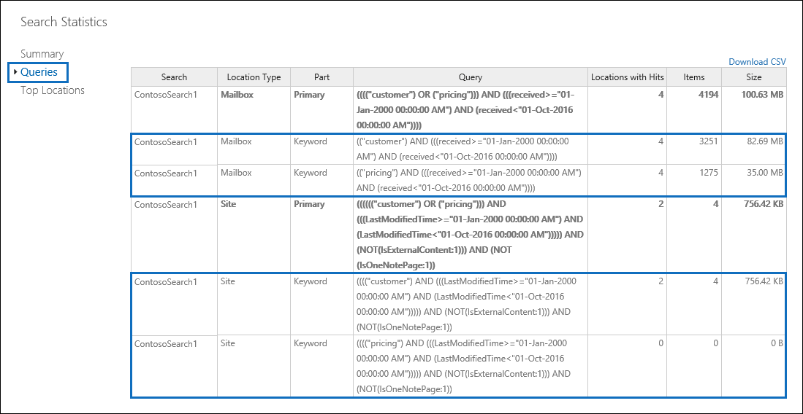

# 콘텐츠 검색 결과에 대한 키워드 통계 보기

콘텐츠 검색을 만들고 실행 한 후에는 예상 검색 결과에 대 한 통계 정보를 볼 수 있습니다. 여기에는 검색 결과에 대 한 요약, 세부 정보 창에 표시 되는 예상 검색 결과 요약, 검색 쿼리와 일치 하는 항목이 있는 콘텐츠 위치 수, 콘텐츠 위치 이름 등의 쿼리 통계도 포함 됩니다. 가장 일치 하는 항목이 있는 항목입니다. 하나 이상의 콘텐츠 검색에 대 한 통계를 표시할 수 있습니다. 이렇게 하면 여러 검색에 대 한 결과를 빠르게 비교 하 고 검색 쿼리의 효율성을 결정할 수 있습니다.
  
또한 검색 쿼리의 각 키워드에 대 한 통계를 반환 하도록 신규 및 기존 검색을 구성할 수 있습니다. 이를 통해 쿼리의 각 키워드에 대 한 결과 수를 비교 하 고 여러 검색의 키워드 통계를 비교할 수 있습니다.
  
또한 검색 통계 및 키워드 통계를 CSV 파일에 다운로드할 수 있습니다. 이렇게 하면 Excel의 필터링 및 정렬 기능을 사용 하 여 결과를 비교 하 고 보고서를 검색 결과에 대해 준비할 수 있습니다.
  
## 콘텐츠 검색에 대 한 통계 가져오기

콘텐츠 검색에 대 한 통계를 표시 하려면:
  
1. 보안 & 준수 센터에서 **검색** \> **콘텐츠 검색**으로 이동 합니다.
    
2. 검색 목록에서 검색을 하나 이상 선택 하 고 **검색 통계**를 클릭 합니다.
    
    
  
3. **검색 통계** 페이지에서 다음 링크 중 하나를 클릭 하 여 선택한 검색에 대 한 통계를 표시 합니다. 
    
    **간략하게**
    
    이 페이지는 **콘텐츠 검색** 페이지의 세부 정보 창에 표시 되는 것과 비슷한 통계를 표시 합니다. 선택한 모든 검색에 대 한 통계가 표시 됩니다. 이 페이지에서 선택한 검색을 다시 실행 하 여 통계를 업데이트할 수도 있습니다. 
    
    
  
    위한.  콘텐츠 검색의 이름입니다. 앞서 설명한 것 처럼 여러 검색에 대 한 통계를 표시 하 고 비교할 수 있습니다.
    
    b. 검색 된 콘텐츠 위치의 형식입니다. 각 행은 지정 된 검색에서 사서함, 사이트 및 공용 폴더에 대 한 통계를 표시 합니다.
    
    &. 검색 쿼리와 일치 하는 항목을 포함 하는 콘텐츠 위치의 수입니다. 사서함의 경우이 통계에는 검색 쿼리와 일치 하는 항목을 포함 하는 보관 사서함의 수도 포함 됩니다.
    
    &. 검색 쿼리와 일치 하는 지정 된 모든 콘텐츠 위치의 총 항목 수입니다. 항목 유형의 예로는 전자 메일 메시지, 일정 항목, 문서 등이 있습니다. 항목에 검색 중인 키워드의 인스턴스가 여러 개 포함 되어 있으면 총 항목 수에 한 번만 계산 됩니다. 예를 들어 "stock" 또는 "사기" 라는 단어를 검색 하는 경우 전자 메일 메시지에 단어 "stock"의 인스턴스가 세 개 포함 되어 있으면 **항목** 열에서 한 번만 계산 됩니다. 
    
    e-learning. 지정한 콘텐츠 위치에서 검색 쿼리와 일치 하는 모든 항목의 총 크기입니다. 
    
    **쿼리하도록**
    
    이 페이지에는 검색 쿼리에 대 한 통계가 표시 됩니다.
    
    
  
    위한. 행이 쿼리 통계를 포함 하는 콘텐츠 검색의 이름입니다.
    
    b. 쿼리 통계를 적용할 수 있는 콘텐츠 위치의 유형입니다.
    
    &. 이 열은 검색 쿼리 중에서 통계를 적용할 수 있는 부분을 나타냅니다. **Primary** 전체 검색 쿼리를 나타냅니다. 검색 쿼리를 만들거나 편집할 때 키워드 목록을 사용 하면 쿼리의 각 구성 요소에 대 한 통계가이 테이블에 포함 됩니다. 자세한 내용은이 문서의 [콘텐츠 검색에 대 한 키워드 통계 받기](#get-keyword-statistics-for-content-searches) 섹션을 참조 하세요. 
    
    &. 이 열에는 콘텐츠 검색 도구에서 실행 되는 실제 검색 쿼리가 포함 됩니다. 이 도구는 사용자가 만드는 쿼리에 몇 가지 추가 구성 요소를 자동으로 추가 합니다. 

    - 키워드를 지정 하지 않고 사서함의 모든 콘텐츠를 검색 하는 경우 실제 키 단어 쿼리는 모든 항목이 반환 `size>=0` 되도록 되어 있습니다. 
    
     - SharePoint Online 및 비즈니스용 OneDrive 사이트를 검색 하면 다음과 같은 두 가지 구성 요소가 추가 됩니다.
    
          **IsExternalContent NOT: 1** -온-프레미스 SharePoint 조직에서 모든 콘텐츠를 제외 합니다. 
    
          **NOT IsOneNotePage: 1** -모든 OneNote 파일은 검색 쿼리와 일치 하는 모든 문서와 중복 되므로 제외 합니다. 

    
    e-learning. **쿼리** 열에 나열 된 검색 쿼리와 일치 하는 항목을 포함 하는 콘텐츠 위치 (* * 위치 유형 * * 열로 지정)의 번호입니다. 
    
    식량. 지정한 콘텐츠 위치에서 **쿼리** 열에 나열 된 검색 쿼리와 일치 하는 항목의 개수입니다. 앞에서 설명한 것 처럼 항목에 검색 중인 키워드의 인스턴스가 여러 개 포함 되어 있으면이 열에서 한 번만 계산 됩니다. 
    
    1g. 지정한 콘텐츠 위치에 있는 검색 쿼리와 일치 하는 모든 항목의 총 크기입니다. **** 
    
    **상위 위치**
    
    이 페이지에는 검색 쿼리와 일치 하는 항목 수에 대 한 통계를 검색 된 각 콘텐츠 위치에서 표시 합니다. 주요 1000 위치가 표시 됩니다. 여러 검색에 대 한 통계를 확인 하는 경우 각 검색에 대 한 최상위 1000 위치가 표시 됩니다. 검색 쿼리와 일치 하는 항목이 포함 되어 있지 않은 콘텐츠 위치는이 페이지에 포함 되지 않습니다.
    
    
  
    위한. 콘텐츠 위치의 이름입니다.
    
    b. 위치 통계를 적용할 수 있는 콘텐츠 위치의 유형입니다.
    
    &. 통계를 표시 하는 각 검색에 대 한 열이 있습니다. 이 열에는 각 콘텐츠 위치의 검색 쿼리와 일치 하는 항목의 수와 총 크기가 표시 됩니다. 여러 검색에 대 한 통계를 표시 하는 경우이 열에서 "NA"는 콘텐츠 위치가 해당 검색에 포함 되지 않았음을 나타냅니다. 

## 콘텐츠 검색에 대 한 키워드 통계 가져오기

앞에서 설명한 것 처럼, **쿼리** 페이지에는 검색 쿼리와 쿼리와 일치 하는 항목의 수와 크기가 표시 됩니다. 검색 쿼리를 만들거나 편집할 때 키워드 목록을 사용 하는 경우 각 키워드나 키워드 구와 일치 하는 항목 수를 보여 주는 통계를 향상 시킬 수 있습니다. 이를 통해 가장 (및 최소) 쿼리 부분을 빠르게 확인할 수 있습니다. 예를 들어 키워드에서 많은 수의 항목을 반환 하는 경우 키워드 쿼리를 구체화 하 여 검색 결과의 범위를 좁힐 수 있습니다. 콘텐츠 검색을 만들거나 편집할 때 키워드 목록을 설정할 수 있습니다. 

콘텐츠 검색에 대 한 키워드 목록을 만들고 키워드 통계를 보려면:
  
1. 보안 & 준수 센터에서 **검색** \> **콘텐츠 검색**으로 이동 합니다.
    
2. 콘텐츠 검색 목록에서 및 검색을 클릭 하 고 편집 아이콘](media/ebd260e4-3556-4fb0-b0bb-cc489773042c.gif) **편집** 
  
    위한. **키워드 목록 표시** 확인란을 클릭 합니다. 
    
    b. 키워드 테이블의 행에 키워드나 키워드 단계를 입력 합니다. 예를 들어 첫 번째 행에 **예산을** 입력 한 다음 두 번째 행에 **security** 를 입력 합니다. 
    
4. 검색 하려는 키워드를 추가 하 고 통계를 가져오려면 **검색** 을 클릭 하 여 수정 된 검색을 실행 합니다. 
    
5. 검색이 완료 되 면 검색 목록에서 검색을 선택 하 고 **검색 통계** 를 클릭 합니다. 또한 여러 검색에 대 한 키워드 통계를 표시 하 고 비교할 수 있습니다.
    
6. **검색 통계** 페이지에서 **쿼리** 를 클릭 하 여 선택한 검색에 대 한 키워드 통계를 표시 합니다. 
    
    
  
    이전 스크린샷에 표시 된 것 처럼 각 키워드에 대 한 통계가 표시 됩니다. 여기에는 다음이 포함 됩니다. 
    
    - 검색에 포함 된 각 콘텐츠 위치 유형의 키워드 통계입니다.
    
    - 각 키워드에 대 한 실제 검색 쿼리는 검색 쿼리의 모든 조건을 포함 합니다. 
    
    - 전체 검색 쿼리 ( **파트** 열에서 **기본** 으로 식별 됨) 및 전체 쿼리에 대 한 통계입니다. 참고이 통계는 **요약** 페이지에 표시 되는 것과 동일 합니다. 

> [!NOTE]
> 큰 키워드 목록으로 인해 발생 하는 문제를 줄이기 위해 이제는 검색 쿼리의 키워드 목록에서 최대 20 개의 행으로 제한 됩니다.
