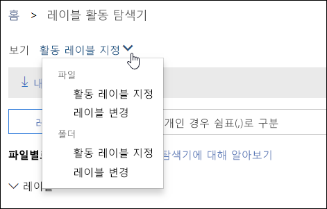
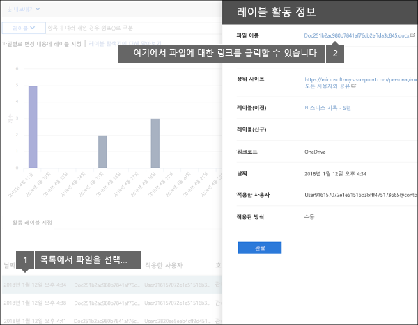
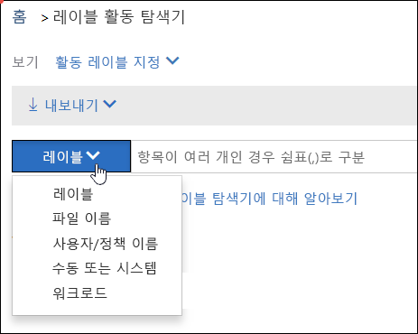

# 문서에 대한 레이블 활동 보기

레이블을 만든 후에 의도대로 콘텐츠에 적용되는지 확인할 수 있습니다. Office 365 보안 및 준수 센터의 레이블 활동 탐색기를 사용하면 지난 30일 동안 SharePoint 및 비즈니스용 OneDrive에서 수행된 모든 콘텐츠에 대한 레이블 활동을 빠르게 검색하고 확인할 수 있습니다.
  
예를 들어 레이블 활동 탐색기로 다음을 수행할 수 있습니다.
  
- 각 레이블이 각 날에 적용된 횟수를 확인합니다(최대 30일).
    
- 누가 어떤 파일에 언제 레이블을 지정했는지와 해당 파일이 있는 사이트에 대한 링크를 확인합니다.
    
- 레이블이 변경 또는 제거된 파일, 어느 것이 이전 및 새 레이블인지 및 변경한 사람을 확인합니다.
    
- 특정 레이블, 파일 또는 사용자에 대한 모든 레이블 활동을 보려면 데이터를 필터링합니다. 레이블 활동을 위치(SharePoint 또는 비즈니스용 OneDrive)별로, 그리고 레이블을 수동으로 적용했는지 또는 자동으로 적용했는지에 따라 필터링할 수도 있습니다.
    
- 개별 문서 뿐만 아니라 폴더에 대한 레이블 활동을 확인합니다. 폴더에 레이블이 지정된 결과로, 해당 폴더 내에서 레이블이 지정된 파일 수를 확인하는 기능도 곧 제공될 예정입니다.
    
보안 및 준수 센터 \> **데이터 거버넌스** \> **레이블 활동 탐색기**에서 레이블 활동 탐색기를 찾을 수 있습니다.
  
레이블 활동 탐색기를 사용하려면 Office 365 Enterprise E5 구독이 있어야 합니다.
  

  
## 파일 또는 폴더에 대한 레이블 활동 보기

레이블 활동 탐색기의 맨 위에서 파일 또는 폴더에 대한 활동을 선택할 수 있습니다. 폴더 활동에는 폴더 내의 파일이 아닌 폴더 자체만 포함됩니다.
  
폴더에 레이블을 지정하면 해당 폴더 내의 모든 파일에도 레이블이 지정되므로 (명시적으로 레이블이 지정된 파일 제외) 폴더에 대한 레이블 활동을 확인하고 싶을 수 있습니다. 따라서 폴더에 레이블을 지정하면 많은 파일에 영향을 줄 수 있습니다. 자세한 내용은 [SharePoint 라이브러리, 폴더 또는 문서 집합의 모든 콘텐츠에 기본 레이블 적용](labels.md#applying-a-default-label-to-all-content-in-a-sharepoint-library-folder-or-document-set)을 참조하세요.
  

  
### 레이블 활동

 **레이블 활동**에는 레이블 **추가**, **제거** 또는 **변경**을 비롯한 모든 레이블 작업이 포함됩니다. 이 보기에서 해당 일에 각 레이블이 적용된 파일 수를 포괄적으로 확인할 수 있습니다. 
  
### 레이블 변경

 **레이블 변경**에는 잠재적으로 위험할 수 있는 레이블 **제거** 또는 **변경** 작업이 포함됩니다. 이 보기에서는 이러한 위험한 작업과 수행한 사용자를 빠르게 확인할 수 있습니다. 차트 아래의 활동 목록에서 파일을 선택한 후 오른쪽의 세부 정보 창에서 해당 파일에 대한 링크를 클릭할 수 있습니다. 
  

  
## 레이블 활동 필터링

데이터를 빠르게 필터링하여 특정 레이블, 파일 또는 사용자에 대한 모든 레이블 활동을 볼 수 있습니다. 레이블 활동을 위치(SharePoint 또는 비즈니스용 OneDrive)별로, 그리고 레이블을 수동으로 적용했는지 또는 자동으로 적용했는지에 따라 필터링할 수도 있습니다.
  

  

