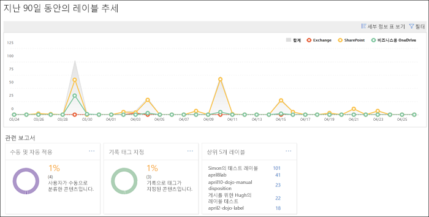
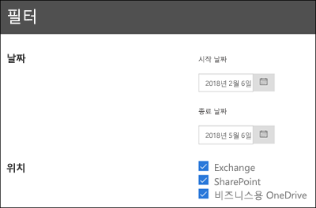

# 데이터 거버넌스 보고서 보기View the data governance reports

레이블을 만든 후 콘텐츠에 의도대로 적용되는지 확인하고 싶을 것입니다. Office 365 보안 및 준수 센터의 데이터 거버넌스 보고서를 사용하면 다음 항목을 빠르게 확인할 수 있습니다.After you create your labels, you'll want to verify that they're being applied to content as you intended. With the data governance reports in the Office 365 Security &amp; Compliance Center, you can quickly view:
  
- **상위 5개 레이블** 이 보고서 는 콘텐츠에 적용된 상위 5개 레이블을 보여 줍니다. 이 보고서를 클릭하면 최근에 콘텐츠에 적용된 모든 레이블의 목록을 볼 수 있습니다. 각 레이블의 개수, 위치, 적용된 방식, 해당 보존 작업, 기록인지 여부 및 처리 유형도 확인할 수 있습니다.**Top 5 labels** This report shows the count of the top 5 labels that have been applied to content. Click this report to view a list of all labels that have been recently applied to content. You can see each label's count, location, how it was applied, its retention actions, whether it's a record, and its disposition type. 
    
- **수동 및 자동 적용** 이 보고서는 수동으로 또는 자동으로 레이블이 지정된 모든 콘텐츠의 개수와 수동 및 자동으로 레이블이 지정된 콘텐츠의 비율을 표시합니다.**Manual vs Auto apply** This report shows the count of all content that's been labeled manually or automatically, and the percentage of content that's been labeled manually vs automatically. 
    
- **기록 태그 지정** 이 보고서는 기록 또는 비기록으로 태그가 지정된 모든 콘텐츠의 개수와 기록 및 비기록으로 태그가 지정된 콘텐츠의 비율을 표시합니다.**Records tagging** This report shows the count of all content that's been tagged as a record or non-record, and the percentage of content that's been tagged as a record vs. non-record. 
    
- **지난 90일 동안의 레이블 추세** 이 보고서는 지난 90일 동안 적용된 모든 레이블의 개수와 위치를 표시합니다.**Labels trend over the past 90 days** This report shows the count and location of all labels that have been applied in the last 90 days. 
    
이러한 모든 보고서는 Exchange, SharePoint 및 비즈니스용 OneDrive에서 레이블이 지정된 콘텐츠를 표시합니다.All these reports show labeled content from Exchange, SharePoint, and OneDrive for Business.
  
보안 및 준수 센터 \> **데이터 관리** \> **대시보드**에서 이러한 보고서를 찾을 수 있습니다.You can find these reports in the Security &amp; Compliance Center \> **Data Governance** \> **Dashboard**.
  

  
데이터 거버넌스 보고서를 날짜(최대 90일) 및 위치(Exchange, SharePoint 및 비즈니스용 OneDrive) 기준으로 필터링할 수 있습니다. 가장 최근 데이터가 보고서에 표시되는 데 최대 24시간이 걸릴 수 있습니다.You can filter the data governance reports by date (up to 90 days) and location (Exchange, SharePoint, and OneDrive for Business). The most recent data can take up to 24 hours to appear in the reports.
  

  

