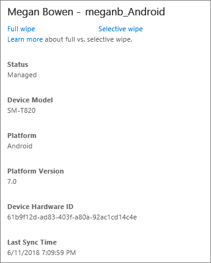

# Office 365의 모바일 장치 지우기 시도
  
조직 정보를 제거 하려면 선택적 지우기 또는 모바일 장치에서 모든 정보를 삭제 하 고 공장 설정으로 복원할 수 있는 전체 지우기 기능을 수행 하려면 Office 365에 대 한 기본 제공 모바일 장치 관리를 사용할 수 있습니다.
  
## 시작 하기 전에 알아야 할 사항

- 모바일 장치 수 있는 중요 한 조직 구성 정보를 저장 하 고 조직의 Office 365 리소스에 대 한 액세스를 제공 합니다. 조직의 정보를 보호 하려면 전체 지우기 또는 선택적 지우기를 수행할 수 있습니다.
    
  - **전체 지우기**: 설치 된 응용 프로그램, 사진 및 개인 정보를 포함 하 여 사용자의 모바일 장치에서 모든 데이터를 삭제 합니다. 지우기를 완료 되 면 장치를 공장 설정으로 복원 됩니다. 
    
  - **선택적으로 닦아내기**: 조직 데이터 및 떠난 설치 된 응용 프로그램, 사진 및 사용자의 모바일 장치에서 개인정보를 제거 합니다. 
    
- 장치 (전체 지우기 또는 선택적 지우기) 지워지도록, 장치 관리 되는 장치 목록에서 제거 됩니다.
    
- 설정할 수 있습니다 (전체 지우기)을 자동으로 제거 하는 모바일 장치 관리 정책을 장치는 사용자가 실패 한 장치의 암호를 입력 하려고 한 후 특정 횟수입니다. 단계에 따라 [만들기 및 장치 보안 정책 배포](create-device-security-policies.md)합니다.
    
- 해당 장치를 초기화 하는 경우 사용자가 경험을 확인 하려는 경우 참조 [사용자 및 장치 영향 란?](wipe-a-mobile-device.md#BKMK_Impact)합니다.
    
## 모바일 장치 지우기 시도

1. 이동 하는 합니다.

2. 이동 [Office 365 보안으로 이동 &amp; 준수 센터](https://support.office.com/article/7e696a40-b86b-4a20-afcc-559218b7b1b8) \> **데이터 손실 방지** \> **장치 관리**합니다.
    
3. 초기화 하려는 장치를 선택 합니다.
    
4. 원격 지우기 수행 하려는의 유형을 선택 합니다.
    
  - 선택적 지우기 수행 하 고만 Office 365 조직 정보를 오른쪽 창에서 삭제를 **선택적으로 닦아내기**를 선택 합니다.
    
  - 전체 지우기 수행 하 고 오른쪽 창에서 해당 공장 설정 하는 장치를 복원 하려면 **전체 지우기**를 선택 합니다.
    

  
5. **예** 를 선택 합니다. 
    
지우기를 완료 될 때까지 **장치 상태** **RetirePending** 또는 **RetireIssued**로 표시 됩니다.
  
### 작동 하는지 어떻게 알 수 있습니까?

더이상의 관리 되는 장치 목록에서 모바일 장치를 볼 수 없습니다.
  
## 장치를 초기화 하는 이유는 무엇 일까요?

장치 지우기에 대 한 다음과 같은 경우:
  
- 스마트폰 및 태블릿 같은 모바일 장치는 되 고 보다 완전 한 기능의 항상 있습니다. 즉, 중요 한 회사 정보 (예: 개인 id 또는 유지 3 비밀 우편 통신)를 저장 하 고 이동 중에 액세스 하 여 사용자에 대 한 더 쉽습니다. 이러한 모바일 장치 중 하나를 분실 하거나 도난당, 하는 경우 장치를 즉시 닦아내기을 방지할 수 있는 조직의 정보 유출 되더라도에서 끝에서 합니다.
    
- 사용자의 Office 365에 대 한 MDM에 등록 되는 개인 장치와 조직 벗어나면 선택적 지우기 수행 하 여 해당 사용자와 들어갈에서 조직 정보를 방지할 수 있습니다.
    
- 모바일 장치 사용자에 게 제공 하는 조직, 때때로 장치를 다시 할당 하려면 필요할 수 있습니다. 새 사용자 수를 할당 하기 전에 장치에서 전체 지우기 수행 하을 선택 하면 모든 중요 한 정보를 이전 소유자 삭제 됩니다.
    
## 사용자 및 장치 영향 이란 무엇입니까?

모바일 장치에는 지우기 즉시 전송 됩니다. 장치는로 표시 AAD 호환 되지 않습니다.
  
다음 표에서 장치를 선택적으로 지워지도록 때 각 장치 유형에 대 한 제거 콘텐츠를 설명 합니다.
  
|**콘텐츠 영향**|**Windows Phone 8.1**|**iOS 7.1+**|**Android 4+**|
|:-----|:-----|:-----|:-----|
|회사 포털 app\* 를 제거 합니다.    |해당 없음    |✔    |해당 없음    |
|Office 365에 대 한 액세스 제어 MDM 하 여 지원 여기에서 응용 프로그램에서 호스트 하는 office 365 응용 프로그램 데이터를 제거 된 (현재 Outlook와 비즈니스용 OneDrive). 응용 프로그램은 제거 되지 않습니다.    Android 용 outlook에서 캐시 된 전자 메일을 제거 하지 않습니다.    |✔    |✔    |✔    |
|장치에서 Office 365에 대 한 장치 MDM 하 여 적용 된 정책 설정이 적용 되는 더이상 및 사용자 설정을 변경할 수 없습니다.    |✔    |✔    |✔    |
|Office 365에 대 한 MDM 하 여 만든 전자 메일 프로필 제거 하 고 장치에서 캐시 된 전자 메일 삭제 됩니다.    |해당 없음    |✔    |해당 없음    |
   
> [!NOTE]
> \*회사 포털 응용 프로그램은 iOS에 대 한 응용 프로그램 저장소 및 Android 장치에 대 한 재생 저장소에서 사용할 수 있습니다. 
  
## 관련 콘텐츠

[Office 365의 모바일 장치 관리](set-up-mobile-device-management.md)
  

