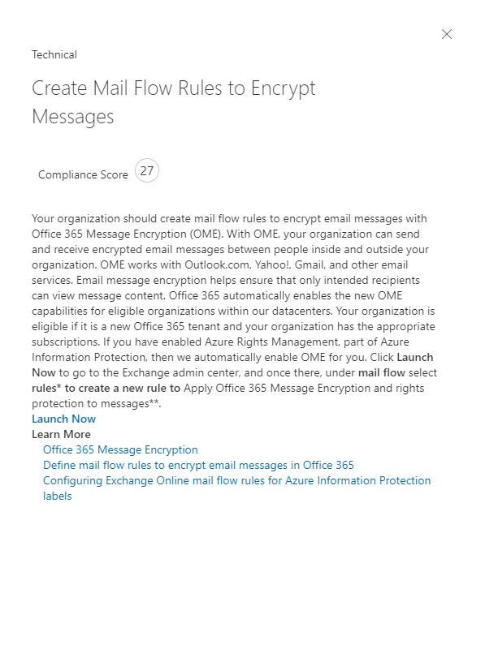
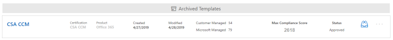

# <a name="work-with-microsoft-compliance-manager-preview"></a><span data-ttu-id="ee7a9-104">Microsoft 준수 관리자 사용 (미리 보기)</span><span class="sxs-lookup"><span data-stu-id="ee7a9-104">Work with Microsoft Compliance Manager (Preview)</span></span>

> [!IMPORTANT]
> <span data-ttu-id="ee7a9-105">Microsoft 준수 관리자는 데이터 보호 및 규정 준수를 개선 하기 위한 준수 기간 및 권장 사항에 대 한 요약을 제공 하는 대시보드 및 관리 도구입니다.</span><span class="sxs-lookup"><span data-stu-id="ee7a9-105">Microsoft Compliance Manager is a dashboard and management tool that provides a summary of your data protection and compliance stature and recommendations to improve data protection and compliance.</span></span> <span data-ttu-id="ee7a9-106">준수 관리자에 제공 되는 고객 작업은 권장 사항입니다. 구현 하기 전에 해당 규정 환경에서 이러한 권장 사항의 효과를 평가 하는 것이 조직에 게 있습니다.</span><span class="sxs-lookup"><span data-stu-id="ee7a9-106">The customer actions provided in Compliance Manager are recommendations; it is up to your organization to evaluate the effectiveness of these recommendations in their respective regulatory environment prior to implementation.</span></span> <span data-ttu-id="ee7a9-107">준수 관리자에 게 제공 되는 권장 사항은 준수 보장으로 해석 되어서는 안 됩니다.</span><span class="sxs-lookup"><span data-stu-id="ee7a9-107">Recommendations found in Compliance Manager should not be interpreted as a guarantee of compliance.</span></span>

## <a name="access-compliance-manager"></a><span data-ttu-id="ee7a9-108">액세스 준수 관리자</span><span class="sxs-lookup"><span data-stu-id="ee7a9-108">Access Compliance Manager</span></span>

<span data-ttu-id="ee7a9-p103">Service Trust Portal에서 준수 관리자에 액세스할 수 있습니다. Microsoft 계정이 나 Azure Active Directory 조직 계정을 가진 사용자라면 누구나 준수 관리자에 액세스할 수 있습니다.</span><span class="sxs-lookup"><span data-stu-id="ee7a9-p103">You access Compliance Manager from the Service Trust Portal. Anyone with a Microsoft account or Azure Active Directory organizational account can access Compliance Manager.</span></span>
  
1. <span data-ttu-id="ee7a9-111">[https://servicetrust.microsoft.com](https://servicetrust.microsoft.com/)으로 이동합니다.</span><span class="sxs-lookup"><span data-stu-id="ee7a9-111">Go to [https://servicetrust.microsoft.com](https://servicetrust.microsoft.com/).</span></span>

2. <span data-ttu-id="ee7a9-112">Microsoft 서비스 계정으로 로그인 합니다.</span><span class="sxs-lookup"><span data-stu-id="ee7a9-112">Sign in with your Microsoft service account.</span></span> <span data-ttu-id="ee7a9-113">Office 365, Microsoft 365 또는 Azure Active Directory (Azure AD) 사용자 계정입니다.</span><span class="sxs-lookup"><span data-stu-id="ee7a9-113">This is your Office 365, Microsoft 365, or Azure Active Directory (Azure AD) user account.</span></span>

3. <span data-ttu-id="ee7a9-114">서비스 신뢰 포털에서 **준수 관리자**를 선택 합니다.</span><span class="sxs-lookup"><span data-stu-id="ee7a9-114">In the Service Trust Portal, select **Compliance Manager**.</span></span> <span data-ttu-id="ee7a9-115">다음은 준수 관리자의 미리 보기 버전입니다.</span><span class="sxs-lookup"><span data-stu-id="ee7a9-115">This is the preview version of Compliance Manager.</span></span> <span data-ttu-id="ee7a9-116">**준수 관리자 (클래식)** 는 준수 관리자의 이전 버전에 대 한 링크입니다.</span><span class="sxs-lookup"><span data-stu-id="ee7a9-116">**Compliance Manager (Classic)** is the link to the previous version of Compliance Manager.</span></span>

4. <span data-ttu-id="ee7a9-117">비밀 유지 계약이 표시 되 면이를 읽고 계속 하려면 **동의** 함을 선택 합니다.</span><span class="sxs-lookup"><span data-stu-id="ee7a9-117">When the Non-Disclosure Agreement is displayed, read it, and select **Agree** to continue.</span></span> <span data-ttu-id="ee7a9-118">한 번 동의 하 고 준수 관리자 대시보드가 표시 되어야 합니다.</span><span class="sxs-lookup"><span data-stu-id="ee7a9-118">You must agree once, and then the Compliance Manager dashboard is displayed.</span></span>

<span data-ttu-id="ee7a9-119">시작 하기 위해 Office 365에 대 한 ISO/IEC 27001:2103 평가가 조직에 기본적으로 표시 됩니다.</span><span class="sxs-lookup"><span data-stu-id="ee7a9-119">To get you started, an ISO/IEC 27001:2103 Assessment for Office 365 appears by default for your organization.</span></span>

## <a name="administration"></a><span data-ttu-id="ee7a9-120">관리</span><span class="sxs-lookup"><span data-stu-id="ee7a9-120">Administration</span></span>

<span data-ttu-id="ee7a9-121">테 넌 트 관리자만 사용할 수 있고 전역 관리자 계정으로 로그인 한 경우에만 표시 되는 특정 관리 기능이 있습니다.</span><span class="sxs-lookup"><span data-stu-id="ee7a9-121">There are specific administrative functions that are only available to the tenant administrator and only visible when logged in with a global administrator account.</span></span> <span data-ttu-id="ee7a9-122">그러나 관리자가 준수 관리자 역할을 사용자에 게 할당 하기 전 까지는 준수 관리자의 데이터가 조직의 모든 사용자에 게 표시 됩니다.</span><span class="sxs-lookup"><span data-stu-id="ee7a9-122">However, until the administrator assigns Compliance Manager roles to users, data in Compliance Manager is visible to all users in your organization.</span></span> <span data-ttu-id="ee7a9-123">준수 관리자에서 액세스 하 고 작업을 수행할 수 있는 사용자를 결정 하기 위해 역할 기반 액세스 제어를 구현 하는 것이 좋습니다.</span><span class="sxs-lookup"><span data-stu-id="ee7a9-123">We recommend implementing role-based access control to determine who can access and perform actions in Compliance Manager.</span></span>
  
### <a name="assigning-compliance-manager-roles-to-users"></a><span data-ttu-id="ee7a9-124">사용자에게 준수 관리자 역할 할당</span><span class="sxs-lookup"><span data-stu-id="ee7a9-124">Assigning Compliance Manager roles to users</span></span>

<span data-ttu-id="ee7a9-125">각 준수 관리자 역할에는 약간 다른 사용 권한이 있습니다.</span><span class="sxs-lookup"><span data-stu-id="ee7a9-125">Each Compliance Manager role has slightly different permissions.</span></span> <span data-ttu-id="ee7a9-126">각 역할에 할당 된 사용 권한을 보고, 어떤 사용자가 역할을 하 고 있는지 확인 하 고, 서비스 트러스트 포털을 통해 해당 역할에서 사용자를 추가 하거나 제거할 수 있습니다.</span><span class="sxs-lookup"><span data-stu-id="ee7a9-126">You can view the permissions assigned to each role, see which users are in which roles, and add or remove users from that role through the Service Trust Portal.</span></span> <span data-ttu-id="ee7a9-127">**관리** 메뉴 항목을 선택 하 고 보려는 **설정을** 선택 합니다.</span><span class="sxs-lookup"><span data-stu-id="ee7a9-127">Select the **Admin** menu item, and choose **Settings** to view.</span></span>
  

  
<span data-ttu-id="ee7a9-129">준수 관리자 역할에서 사용자를 추가하거나 제거하려면</span><span class="sxs-lookup"><span data-stu-id="ee7a9-129">To add or remove users from Compliance Manager roles.</span></span>
  
1. <span data-ttu-id="ee7a9-130">[https://servicetrust.microsoft.com](https://servicetrust.microsoft.com)으로 이동합니다.</span><span class="sxs-lookup"><span data-stu-id="ee7a9-130">Go to [https://servicetrust.microsoft.com](https://servicetrust.microsoft.com).</span></span>

2. <span data-ttu-id="ee7a9-131">Azure Active Directory 전역 관리자 계정으로 로그인합니다.</span><span class="sxs-lookup"><span data-stu-id="ee7a9-131">Sign in with your Azure Active Directory global administrator account.</span></span>

3. <span data-ttu-id="ee7a9-132">서비스 보안 포털의 위쪽 메뉴 모음에서 **관리자** 를 선택 하 고 **설정을**선택 합니다.</span><span class="sxs-lookup"><span data-stu-id="ee7a9-132">On the Service Trust Portal top menu bar, select **Admin** and then choose **Settings**.</span></span>

4. <span data-ttu-id="ee7a9-133">**역할 선택** 드롭다운 목록에서 관리 하려는 역할을 선택 합니다.</span><span class="sxs-lookup"><span data-stu-id="ee7a9-133">In the **Select Role** drop-down list, select the role that you want to manage.</span></span>

5. <span data-ttu-id="ee7a9-134">각 역할에 추가 된 사용자는 **역할 선택** 페이지에 표시 됩니다.</span><span class="sxs-lookup"><span data-stu-id="ee7a9-134">Users added to each role are listed on the **Select Role** page.</span></span>

6. <span data-ttu-id="ee7a9-135">이 역할에 사용자를 추가 하려면 **추가**를 선택 합니다.</span><span class="sxs-lookup"><span data-stu-id="ee7a9-135">To add users to this role, select **Add**.</span></span> <span data-ttu-id="ee7a9-136">**사용자 추가** 대화 상자에서 사용자 필드를 선택 합니다.</span><span class="sxs-lookup"><span data-stu-id="ee7a9-136">In the **Add Users** dialog, select the user field.</span></span> <span data-ttu-id="ee7a9-137">사용 가능한 사용자 목록을 스크롤하거나 사용자 이름을 입력 하 여 검색 용어에 따라 목록을 필터링 할 수 있습니다.</span><span class="sxs-lookup"><span data-stu-id="ee7a9-137">You can scroll through the list of available users or begin typing the user name to filter the list based on your search term.</span></span> <span data-ttu-id="ee7a9-138">해당 역할을 사용 하 여 프로 비전 된 **사용자 추가** 목록에 해당 계정을 추가할 사용자를 선택 합니다.</span><span class="sxs-lookup"><span data-stu-id="ee7a9-138">Select the user to add that account to the **Add Users** list provisioned with that role.</span></span> <span data-ttu-id="ee7a9-139">여러 사용자를 동시에 추가 하려면 목록을 필터링 하는 사용자 이름을 입력 하기 시작한 다음 목록에 추가할 사용자를 선택 합니다.</span><span class="sxs-lookup"><span data-stu-id="ee7a9-139">If you would like to add multiple users concurrently, begin typing a user name to filter the list, and then select the user to add to the list.</span></span> <span data-ttu-id="ee7a9-140">**저장** 을 선택 하 여 해당 사용자에 게 선택한 역할을 프로 비전 합니다.</span><span class="sxs-lookup"><span data-stu-id="ee7a9-140">Select **Save** to provision the selected role to these users.</span></span> 

    
  
7. <span data-ttu-id="ee7a9-142">이 역할에서 사용자를 제거 하려면 사용자를 선택 하 고 **삭제**를 선택 합니다.</span><span class="sxs-lookup"><span data-stu-id="ee7a9-142">To remove users from this role, select the users and select **Delete**.</span></span>

    

## <a name="groups"></a><span data-ttu-id="ee7a9-144">그룹</span><span class="sxs-lookup"><span data-stu-id="ee7a9-144">Groups</span></span>

<span data-ttu-id="ee7a9-145">그룹을 사용 하면 평가를 논리적으로 구성 하 고, 동일 하거나 관련 된 고객 관리 컨트롤이 있는 평가 간에 일반 정보 및 워크플로 작업을 공유할 수 있습니다.</span><span class="sxs-lookup"><span data-stu-id="ee7a9-145">Groups allow you to logically organize Assessments and that share common information and workflow tasks between Assessments that have the same or related customer-managed controls.</span></span> <span data-ttu-id="ee7a9-146">조직 내의 연, 표준, 서비스, 팀, 부서 또는 기관 별로 평가를 그룹화 하 여 고객 관리 작업을 최소화할 수 있습니다.</span><span class="sxs-lookup"><span data-stu-id="ee7a9-146">You can group Assessments by year, standard, service, team, division, or agencies within your organization to help minimize customer-managed Actions:</span></span>
  
- <span data-ttu-id="ee7a9-147">**FFIEC는 평가 2019**</span><span class="sxs-lookup"><span data-stu-id="ee7a9-147">**FFIEC IS Assessments 2019**</span></span>
  - <span data-ttu-id="ee7a9-148">Office 365 + FFIEC가</span><span class="sxs-lookup"><span data-stu-id="ee7a9-148">Office 365 + FFIEC IS</span></span>
  - <span data-ttu-id="ee7a9-149">Intune + FFIEC가</span><span class="sxs-lookup"><span data-stu-id="ee7a9-149">Intune + FFIEC IS</span></span>
- <span data-ttu-id="ee7a9-150">**데이터 보안 및 개인 정보 보호 평가**</span><span class="sxs-lookup"><span data-stu-id="ee7a9-150">**Data Security and Privacy Assessments**</span></span>
  - <span data-ttu-id="ee7a9-151">Office 365 + ISO 27001:2013</span><span class="sxs-lookup"><span data-stu-id="ee7a9-151">Office 365 + ISO 27001:2013</span></span>
  - <span data-ttu-id="ee7a9-152">Office 365 + ISO 27018:2014</span><span class="sxs-lookup"><span data-stu-id="ee7a9-152">Office 365 + ISO 27018:2014</span></span>

<span data-ttu-id="ee7a9-153">새 평가를 만들 때 평가를 위한 새 그룹을 만들거나 기존 그룹에 평가를 할당 해야 합니다.</span><span class="sxs-lookup"><span data-stu-id="ee7a9-153">When you create a new Assessment, you must create a new group for the Assessment or assign the Assessment to an existing group.</span></span> <span data-ttu-id="ee7a9-154">독립 실행형 엔터티로 그룹을 만들 수는 없습니다.</span><span class="sxs-lookup"><span data-stu-id="ee7a9-154">Groups cannot be created as stand-alone entities.</span></span> <span data-ttu-id="ee7a9-155">새 평가를 추가 *하기 전에 먼저* 조직에 대 한 그룹화 전략을 결정 하는 것이 좋습니다.</span><span class="sxs-lookup"><span data-stu-id="ee7a9-155">It's recommended that you determine a grouping strategy for your organization *before* adding new assessments.</span></span> <span data-ttu-id="ee7a9-156">기본적으로 초기 평가를 위해 "기본 그룹" 이라는 그룹을 사용할 수 있습니다.</span><span class="sxs-lookup"><span data-stu-id="ee7a9-156">By default, a Group named "Default Group" is available for your initial Assessments.</span></span> <span data-ttu-id="ee7a9-157">그룹에 보안 속성이 없습니다.</span><span class="sxs-lookup"><span data-stu-id="ee7a9-157">Groups do not have any security properties.</span></span> <span data-ttu-id="ee7a9-158">모든 사용 권한은 평가와 연결 됩니다.</span><span class="sxs-lookup"><span data-stu-id="ee7a9-158">All permissions are associated with Assessments.</span></span>

<span data-ttu-id="ee7a9-159">그룹으로 작업할 때는 다음 사항을 염두에 두어야 합니다.</span><span class="sxs-lookup"><span data-stu-id="ee7a9-159">When you work with groups, remember:</span></span>
  
- <span data-ttu-id="ee7a9-160">같은 그룹 내의 서로 다른 평가에서 관련 평가 컨트롤은 완료 시 자동으로 업데이트 됩니다.</span><span class="sxs-lookup"><span data-stu-id="ee7a9-160">Related assessment controls in different assessments within the same Group automatically update when completed.</span></span>
- <span data-ttu-id="ee7a9-161">새 그룹은 새로운 평가를 만들 때 기존 그룹에서 정보를 복사할 수 있습니다.</span><span class="sxs-lookup"><span data-stu-id="ee7a9-161">New groups can copy information from an existing group when you create a new Assessment.</span></span> <span data-ttu-id="ee7a9-162">복사 하는 그룹의 평가에서 고객 관리 되는 컨트롤의 구현 세부 정보 및 테스트 계획 및 관리 응답 필드에 추가 되는 모든 정보가 새 사용자의 동일한 (또는 관련) 고객 관리 컨트롤로 복사 됩니다. 평가.</span><span class="sxs-lookup"><span data-stu-id="ee7a9-162">Any information added to the Implementation Details and Test Plan and Management Response fields of customer-managed controls from Assessments in the group that you're copying from are copied to the same (or related) customer-managed controls in the new Assessment.</span></span> <span data-ttu-id="ee7a9-163">기존 그룹에 새 평가를 추가 하는 경우 해당 그룹의 평가에 대 한 공통 정보가 새 평가로 복사 됩니다.</span><span class="sxs-lookup"><span data-stu-id="ee7a9-163">If you're adding a new Assessment to an existing group, common information from Assessments in that group are copied to the new Assessment.</span></span>
- <span data-ttu-id="ee7a9-164">그룹 이름 ( *그룹 id*라고도 함)은 조직 내에서 고유 해야 합니다.</span><span class="sxs-lookup"><span data-stu-id="ee7a9-164">Group names (also called *Group IDs*) must be unique within your organization.</span></span>
- <span data-ttu-id="ee7a9-165">그룹에는 동일한 인증/규정에 대 한 평가가 포함 될 수 있지만, 각 그룹에는 특정 클라우드 서비스/인증 쌍에 대 한 평가를 하나만 포함할 수 있습니다.</span><span class="sxs-lookup"><span data-stu-id="ee7a9-165">Groups can contain Assessments for the same certification/regulation, but each group can only contain one Assessment for a specific cloud service/certification pair.</span></span> <span data-ttu-id="ee7a9-166">예를 들어 그룹에는 Office 365 및 NIST CSF에 대 한 두 가지 평가를 포함할 수 없습니다.</span><span class="sxs-lookup"><span data-stu-id="ee7a9-166">For example, a group can't contain two Assessments for Office 365 and NIST CSF.</span></span> <span data-ttu-id="ee7a9-167">그룹은 각각에 대 한 해당 하는 인증/규정을 서로 다른 경우에만 동일한 클라우드 서비스에 대 한 여러 평가를 포함할 수 있습니다.</span><span class="sxs-lookup"><span data-stu-id="ee7a9-167">A group can contain multiple Assessments for the same cloud service only if the corresponding certification/regulation for each one is different.</span></span>
- <span data-ttu-id="ee7a9-168">평가가 평가 그룹에 추가 되 면 그룹화를 변경할 수 없습니다.</span><span class="sxs-lookup"><span data-stu-id="ee7a9-168">Once an assessment has been added to an assessment group, the grouping cannot be changed.</span></span> <span data-ttu-id="ee7a9-169">평가 그룹의 이름을 바꾸어 해당 그룹과 연결 된 모든 평가에 대 한 평가 그룹화의 이름을 변경할 수 있습니다.</span><span class="sxs-lookup"><span data-stu-id="ee7a9-169">You can rename the assessment group, which changes the name of the assessment grouping for all the assessments associated with that group.</span></span> <span data-ttu-id="ee7a9-170">평가 및 새 평가 그룹을 만들고 기존 평가에서 정보를 복사 하 여 다른 평가 그룹에 해당 평가의 복제본을 효과적으로 만들 수 있습니다.</span><span class="sxs-lookup"><span data-stu-id="ee7a9-170">You can create an assessment and a new assessment group and copy information from an existing assessment, which effectively creates a duplicate of that assessment in a different assessment group.</span></span>
- <span data-ttu-id="ee7a9-171">보관 평가와 그룹 간의 관계를 중단 합니다.</span><span class="sxs-lookup"><span data-stu-id="ee7a9-171">Archiving an assessment breaks the relationship between that assessment and the group.</span></span> <span data-ttu-id="ee7a9-172">다른 관련 평가에 대 한 추가 업데이트가 더 이상 보관 된 평가에 반영 되지 않습니다.</span><span class="sxs-lookup"><span data-stu-id="ee7a9-172">Any further updates to other related assessments are no longer reflected in the archived assessment.</span></span>

## <a name="tenant-management"></a><span data-ttu-id="ee7a9-173">테 넌 트 관리</span><span class="sxs-lookup"><span data-stu-id="ee7a9-173">Tenant Management</span></span>

<span data-ttu-id="ee7a9-174">준수 관리자 (미리 보기)에는 **테 넌 트 관리**라는 새 데이터 요소를 관리 하기 위한 새로운 인터페이스가 포함 되어 있습니다.</span><span class="sxs-lookup"><span data-stu-id="ee7a9-174">Compliance Manager (Preview) includes a new interface for managing new data elements called **Tenant Management**.</span></span> <span data-ttu-id="ee7a9-175">이 인터페이스를 사용 하 여 테 넌 트 전체 설정을 관리할 수 있습니다.</span><span class="sxs-lookup"><span data-stu-id="ee7a9-175">This interface enables you to manage tenant-wide settings:</span></span>

- <span data-ttu-id="ee7a9-176">**차원:** 필터의 사용자 지정 피벗을 만들 수 있는 템플릿, 평가 및 작업 항목에 대 한 메타 데이터를 보고, 추가 하 고, 사용자 지정 합니다.</span><span class="sxs-lookup"><span data-stu-id="ee7a9-176">**Dimensions:** View, add and customize metadata for Templates, Assessments, and Action Items that allow you to create custom pivots for filters.</span></span>
- <span data-ttu-id="ee7a9-177">**소유자:** 각 작업 항목의 소유자를 지정 합니다.</span><span class="sxs-lookup"><span data-stu-id="ee7a9-177">**Owners:** Specify an owner for each Action Item.</span></span>
- <span data-ttu-id="ee7a9-178">**고객 작업:** 준수 관리자 (미리 보기)에 포함 된 작업 항목의 전체 목록과 보안 점수와 통합 된 작업에 대 한 보안 점수 모니터링 사용/사용 안 함을 관리 합니다.</span><span class="sxs-lookup"><span data-stu-id="ee7a9-178">**Customer Actions:** Manage the complete list of Actions Items included in Compliance Manager (Preview) and enable/disable Secure Score monitoring for Actions that are integrated with Secure Score.</span></span>

<span data-ttu-id="ee7a9-179">**테 넌 트 관리** 를 선택 하 여 관리 인터페이스를 열고 다음 단계를 수행 하 여 **차원**, **소유자**및 **고객 작업**을 관리 합니다.</span><span class="sxs-lookup"><span data-stu-id="ee7a9-179">Select **Tenant Management** to open the management interface, and use the following steps to manage **Dimensions**, **Owners**, and **Customer Actions**.</span></span>

### <a name="dimensions"></a><span data-ttu-id="ee7a9-180">높이</span><span class="sxs-lookup"><span data-stu-id="ee7a9-180">Dimensions</span></span>

<span data-ttu-id="ee7a9-181">차원은 템플릿, 평가 또는 작업 항목에 대 한 정보를 제공 하는 메타 데이터 집합입니다.</span><span class="sxs-lookup"><span data-stu-id="ee7a9-181">Dimensions are sets of metadata that provide information about a Template, an Assessment, or an Action Item.</span></span> <span data-ttu-id="ee7a9-182">차원은 차원 키가 속성을 나타내는 키 및 값의 개념을 사용 하 고, 차원 값은 속성의 유효한 값을 나타냅니다.</span><span class="sxs-lookup"><span data-stu-id="ee7a9-182">Dimensions use the concept of Keys and Values, where the Dimension Key represents a property, and Dimension Value represents valid values for the property.</span></span> <span data-ttu-id="ee7a9-183">예를 들어 준수 관리자에서 다음 세 가지 유형의 작업을 수행할 수 있습니다.</span><span class="sxs-lookup"><span data-stu-id="ee7a9-183">For example, in Compliance Manager there are three types of Actions.</span></span> <span data-ttu-id="ee7a9-184">**설명서**, **운영**및 **기술**에 대 한 **작업 유형** 및 차원 값의 차원 키로 정의 됩니다.</span><span class="sxs-lookup"><span data-stu-id="ee7a9-184">They are defined by a Dimension Key of **Action Type** and Dimension Values of **Documentation**, **Operational**, and **Technical**.</span></span> <span data-ttu-id="ee7a9-185">기존 차원을 수정 하거나 자체를 추가할 수 있습니다.</span><span class="sxs-lookup"><span data-stu-id="ee7a9-185">You can modify existing Dimensions or add your own.</span></span> <span data-ttu-id="ee7a9-186">사용자 지정 서식 파일을 가져올 때는 차원 추가가 필요한 경우가 많습니다.</span><span class="sxs-lookup"><span data-stu-id="ee7a9-186">Adding Dimensions is often necessary when importing custom Templates.</span></span>

#### <a name="add-a-dimension"></a><span data-ttu-id="ee7a9-187">차원 추가</span><span class="sxs-lookup"><span data-stu-id="ee7a9-187">Add a Dimension</span></span>

1. <span data-ttu-id="ee7a9-188">**테 넌 트 관리** 를 열고 **차원을**선택 합니다.</span><span class="sxs-lookup"><span data-stu-id="ee7a9-188">Open **Tenant Management** and select **Dimensions**.</span></span>
2. <span data-ttu-id="ee7a9-189">**+ 차원 추가**를 선택 합니다.</span><span class="sxs-lookup"><span data-stu-id="ee7a9-189">Select **+ Add Dimension**.</span></span>
3. <span data-ttu-id="ee7a9-190">**키** 필드에 고유한 이름을 입력 합니다.</span><span class="sxs-lookup"><span data-stu-id="ee7a9-190">Enter a unique name in the **Key** field.</span></span>
4. <span data-ttu-id="ee7a9-191">선택적으로 여러 값을 같은 키에 대해 동시에 사용할 수 있도록 설정 하려면 **차원에 대해 다중 선택을** 사용 하도록 설정/해제를 선택 합니다.</span><span class="sxs-lookup"><span data-stu-id="ee7a9-191">Optionally enable multiple values to be used concurrently for the same Key, slide the toggle for **Allow multi selection for dimensions** to on.</span></span>
5. <span data-ttu-id="ee7a9-192">**+ 추가** 를 선택 하 여 고유한 이름을 입력 하 고 저장 아이콘을 클릭 하 여 값을 추가 합니다.</span><span class="sxs-lookup"><span data-stu-id="ee7a9-192">Select **+ Add** to add a value by providing a unique name and clicking the save icon.</span></span>
6. <span data-ttu-id="ee7a9-193">추가할 각 값에 대해 5 단계를 반복 합니다.</span><span class="sxs-lookup"><span data-stu-id="ee7a9-193">Repeat Step 5 for each value you want to add.</span></span>
7. <span data-ttu-id="ee7a9-194">**저장** 을 선택 하 여 새 차원을 저장 합니다.</span><span class="sxs-lookup"><span data-stu-id="ee7a9-194">Select **Save** to save the new Dimension.</span></span>

#### <a name="edit-a-dimension"></a><span data-ttu-id="ee7a9-195">차원 편집</span><span class="sxs-lookup"><span data-stu-id="ee7a9-195">Edit a Dimension</span></span>

<span data-ttu-id="ee7a9-196">차원 키의 이름을 바꿀 수 있지만 사용자 지정 차원에 대 한 값을 수정할 수 있습니다.</span><span class="sxs-lookup"><span data-stu-id="ee7a9-196">You can rename a Dimension Key, but you can modify the values for custom Dimensions.</span></span>

1. <span data-ttu-id="ee7a9-197">**테 넌 트 관리** 를 열고 **차원을**선택 합니다.</span><span class="sxs-lookup"><span data-stu-id="ee7a9-197">Open **Tenant Management** and select **Dimensions**.</span></span>
2. <span data-ttu-id="ee7a9-198">편집할 차원을 찾은 다음 옆에 있는 줄임표 (...)를 선택 하 고 **편집**을 선택 합니다.</span><span class="sxs-lookup"><span data-stu-id="ee7a9-198">Locate the Dimension you want to edit, select the ellipses (…) next to it, and select **Edit**.</span></span>
3. <span data-ttu-id="ee7a9-199">**+ 더하기** 를 선택 하 여 고유한 이름을 입력 하 고 저장 아이콘을 클릭 하 여 값을 추가 하거나 편집 하거나 삭제할 값을 선택 하 고 **제거** 또는 **편집**을 선택 합니다.</span><span class="sxs-lookup"><span data-stu-id="ee7a9-199">Select **+ Add** to add a value by providing a unique name and clicking the save icon, or select the value you want to edit or delete, and select **Remove** or **Edit**.</span></span>
4. <span data-ttu-id="ee7a9-200">변경을 마쳤으면 **저장** 을 선택 합니다.</span><span class="sxs-lookup"><span data-stu-id="ee7a9-200">Select **Save** when you have finished making changes.</span></span>

#### <a name="delete-a-dimension"></a><span data-ttu-id="ee7a9-201">차원 삭제</span><span class="sxs-lookup"><span data-stu-id="ee7a9-201">Delete a Dimension</span></span>

<span data-ttu-id="ee7a9-202">필요한 경우 사용자 지정 차원을 삭제할 수 있습니다.</span><span class="sxs-lookup"><span data-stu-id="ee7a9-202">You can delete custom Dimensions if needed.</span></span>

1. <span data-ttu-id="ee7a9-203">**테 넌 트 관리** 를 열고 **차원을**선택 합니다.</span><span class="sxs-lookup"><span data-stu-id="ee7a9-203">Open **Tenant Management** and select **Dimensions**.</span></span>
2. <span data-ttu-id="ee7a9-204">삭제할 차원을 찾은 다음 옆에 있는 줄임표 (...)를 선택 하 고 **삭제**를 선택 합니다.</span><span class="sxs-lookup"><span data-stu-id="ee7a9-204">Locate the Dimension you want to delete, select the ellipses (…) next to it, and select **Delete**.</span></span>
3. <span data-ttu-id="ee7a9-205">확인 메시지가 표시 되 면 **삭제**를 선택 합니다.</span><span class="sxs-lookup"><span data-stu-id="ee7a9-205">When the confirmation message appears, select **Delete**.</span></span>

### <a name="owners"></a><span data-ttu-id="ee7a9-206">이사</span><span class="sxs-lookup"><span data-stu-id="ee7a9-206">Owners</span></span>

<span data-ttu-id="ee7a9-207">소유자는 각 컨트롤에 대 한 책임 당사자를 식별 하는 데 사용 됩니다.</span><span class="sxs-lookup"><span data-stu-id="ee7a9-207">Owners are used to identify the responsible party for each control.</span></span> <span data-ttu-id="ee7a9-208">모든 기본 제공 컨트롤은 Microsoft, 고객 또는 둘 모두에 의해 소유 됩니다.</span><span class="sxs-lookup"><span data-stu-id="ee7a9-208">All built-in controls are owned by Microsoft, by customers, or by both.</span></span> <span data-ttu-id="ee7a9-209">소유자에 대해 사용자 지정 값을 만들어 조직 내에서 보다 세부적인 책임을 지정 하는 데 사용할 수 있습니다.</span><span class="sxs-lookup"><span data-stu-id="ee7a9-209">You can create custom values for Owners that can be used to specify more granular responsibilities within your organization.</span></span> <span data-ttu-id="ee7a9-210">예를 들어 조직 내의 특정 그룹, 팀 또는 비즈니스 단위를 나타내는 소유자를 만들 수 있습니다.</span><span class="sxs-lookup"><span data-stu-id="ee7a9-210">For example, you could create Owners that represent specific groups, teams, or business units within your organization.</span></span>

#### <a name="add-an-owner"></a><span data-ttu-id="ee7a9-211">소유자 추가</span><span class="sxs-lookup"><span data-stu-id="ee7a9-211">Add an Owner</span></span>

1. <span data-ttu-id="ee7a9-212">**테 넌 트 관리** 를 열고 **소유자**를 선택 합니다.</span><span class="sxs-lookup"><span data-stu-id="ee7a9-212">Open **Tenant Management** and select **Owners**.</span></span>
2. <span data-ttu-id="ee7a9-213">**+ 소유자 추가**를 선택 합니다.</span><span class="sxs-lookup"><span data-stu-id="ee7a9-213">Select **+ Add owner**.</span></span>
3. <span data-ttu-id="ee7a9-214">소유자의 이름과 설명을 입력 하 고 **저장**을 선택 합니다.</span><span class="sxs-lookup"><span data-stu-id="ee7a9-214">Provide a Name and Description for the Owner and select **Save**.</span></span> <span data-ttu-id="ee7a9-215">설명은 소유자 열에 표시 됩니다.</span><span class="sxs-lookup"><span data-stu-id="ee7a9-215">The description is displayed in the Owner column.</span></span>

#### <a name="edit-an-owner"></a><span data-ttu-id="ee7a9-216">소유자 편집</span><span class="sxs-lookup"><span data-stu-id="ee7a9-216">Edit an Owner</span></span>

<span data-ttu-id="ee7a9-217">소유자 이름은 편집할 수 없지만 소유자 열에 표시 되는 설명은 수정할 수 있습니다.</span><span class="sxs-lookup"><span data-stu-id="ee7a9-217">You can’t edit an Owner name, but you can modify the description that is displayed in the Owner column.</span></span>

1. <span data-ttu-id="ee7a9-218">**테 넌 트 관리** 를 열고 **소유자**를 선택 합니다.</span><span class="sxs-lookup"><span data-stu-id="ee7a9-218">Open **Tenant Management** and select **Owners**.</span></span>
2. <span data-ttu-id="ee7a9-219">편집할 소유자를 찾은 다음 옆에 있는 줄임표 (...)를 선택 하 고 **편집**을 선택 합니다.</span><span class="sxs-lookup"><span data-stu-id="ee7a9-219">Locate the Owner you want to edit, select the ellipses (…) next to it, and select **Edit**.</span></span>
3. <span data-ttu-id="ee7a9-220">필요에 따라 설명을 수정 하 고 **저장**을 선택 합니다.</span><span class="sxs-lookup"><span data-stu-id="ee7a9-220">Modify the Description as needed and select **Save**.</span></span>

#### <a name="delete-an-owner"></a><span data-ttu-id="ee7a9-221">소유자 삭제</span><span class="sxs-lookup"><span data-stu-id="ee7a9-221">Delete an Owner</span></span>

1. <span data-ttu-id="ee7a9-222">**테 넌 트 관리** 를 열고 **소유자**를 선택 합니다.</span><span class="sxs-lookup"><span data-stu-id="ee7a9-222">Open **Tenant Management** and select **Owners**.</span></span>
2. <span data-ttu-id="ee7a9-223">삭제할 소유자를 찾고 옆에 있는 줄임표 (...)를 선택한 다음 **삭제**를 선택 합니다.</span><span class="sxs-lookup"><span data-stu-id="ee7a9-223">Locate the Owner you want to delete, select the ellipses (…) next to it, and select **Delete**.</span></span>
3. <span data-ttu-id="ee7a9-224">확인 메시지가 표시 되 면 **삭제**를 선택 합니다.</span><span class="sxs-lookup"><span data-stu-id="ee7a9-224">When the confirmation message appears, select **Delete**.</span></span>

### <a name="customer-actions"></a><span data-ttu-id="ee7a9-225">고객 작업</span><span class="sxs-lookup"><span data-stu-id="ee7a9-225">Customer Actions</span></span>

<span data-ttu-id="ee7a9-226">고객 작업 영역에는 준수 관리자 (미리 보기)의 모든 템플릿 및 평가에 대 한 모든 고객 작업이 표시 됩니다.</span><span class="sxs-lookup"><span data-stu-id="ee7a9-226">The Customer Actions area shows all the customer actions for all Templates and Assessments in Compliance Manager (Preview).</span></span>


<span data-ttu-id="ee7a9-228">작업의 제목, 소유자, 범주, 적용 및 점수를 한눈에 확인 하 고 보안 점수와 통합 되어 있는지 확인할 수 있습니다.</span><span class="sxs-lookup"><span data-stu-id="ee7a9-228">At-a-glance, you can see an Action’s title, owner, category, enforcement, and score, and determine if it is integrated with Secure Score.</span></span> <span data-ttu-id="ee7a9-229">작업을 확장 하 고 **자세히 읽기** 를 선택 하 여 작업의 설명을 읽고 설명에 있는 링크에 액세스할 수 있습니다.</span><span class="sxs-lookup"><span data-stu-id="ee7a9-229">You can expand an Action and select **Read More** to read the Action’s description and access any links in the description.</span></span> <span data-ttu-id="ee7a9-230">또한이 인터페이스를 사용 하 여 동작 별로 보안 점수 통합을 사용 하거나 사용 하지 않도록 설정 하 고 사용자 지정 작업을 추가할 수 있습니다.</span><span class="sxs-lookup"><span data-stu-id="ee7a9-230">You can also use this interface to enable and disable Secure Score integration on a per-action basis, and to add custom actions.</span></span> <span data-ttu-id="ee7a9-231">보안 점수 통합 기능을 가진 작업에는 줄임표 (...)가 있습니다 (사용자 지정 작업 옆에는 줄임표 (...))가 있습니다.</span><span class="sxs-lookup"><span data-stu-id="ee7a9-231">Actions that have Secure Score integration capabilities have an ellipsis (…) next to them (note that custom actions also have an ellipsis next to them).</span></span>

#### <a name="enable-or-disable-secure-score-integration"></a><span data-ttu-id="ee7a9-232">보안 점수 통합 사용 또는 사용 안 함</span><span class="sxs-lookup"><span data-stu-id="ee7a9-232">Enable or disable Secure Score integration</span></span>

1. <span data-ttu-id="ee7a9-233">수정할 작업의 줄임표 (...)를 선택 하 고 **편집**을 선택 합니다.</span><span class="sxs-lookup"><span data-stu-id="ee7a9-233">Select the ellipses (…) for the Action you want to modify and select **Edit**.</span></span>
2. <span data-ttu-id="ee7a9-234">보안 점수를 통한 지속적인 모니터링을 사용 하거나 사용 하지 않도록 설정 하려면 안전한 점수 연속 업데이트에 대 한 스위치를 설정 또는 해제로 전환 합니다.</span><span class="sxs-lookup"><span data-stu-id="ee7a9-234">Toggle the switch for Secure Score continuous update to On or Off to enable or disable continuous monitoring through Secure Score.</span></span>
3. <span data-ttu-id="ee7a9-235">**저장**을 선택합니다.</span><span class="sxs-lookup"><span data-stu-id="ee7a9-235">Select **Save**.</span></span>

#### <a name="add-a-customer-action"></a><span data-ttu-id="ee7a9-236">고객 작업 추가</span><span class="sxs-lookup"><span data-stu-id="ee7a9-236">Add a customer action</span></span>

1. <span data-ttu-id="ee7a9-237">**+ Customer 추가 작업**을 선택 합니다.</span><span class="sxs-lookup"><span data-stu-id="ee7a9-237">Select **+ Add Customer Action**.</span></span>
2. <span data-ttu-id="ee7a9-238">**제목** 필드에 작업에 대 한 고유한 제목을 입력 합니다.</span><span class="sxs-lookup"><span data-stu-id="ee7a9-238">Provide a unique title for the Action in the **Title** field.</span></span>
3. <span data-ttu-id="ee7a9-239">**최대 준수 점수** 필드에 작업에 대 한 준수 점수를 제공 합니다 (이 값은 1-99에서 숫자가 될 수 있음).</span><span class="sxs-lookup"><span data-stu-id="ee7a9-239">Provide a Compliance Score for the Action in the **Maximum Compliance Score** field (this can be any number from 1-99).</span></span>
4. <span data-ttu-id="ee7a9-240">**작업 유형** 드롭다운을 사용 하 여 추가 하려는 작업의 유형을 지정 합니다.</span><span class="sxs-lookup"><span data-stu-id="ee7a9-240">Use the **Action Type** dropdown to specify the type of Action you are adding.</span></span> <span data-ttu-id="ee7a9-241">동작 유형이 없는 경우 작업 유형 차원 키에 값을 추가 하 여 해당 유형을 추가할 수 있습니다.</span><span class="sxs-lookup"><span data-stu-id="ee7a9-241">If the Action Type does not exist, you can add it by adding the value to the Action Type dimension key.</span></span>
5. <span data-ttu-id="ee7a9-242">**차원** 드롭다운을 사용 하 여 작업에 대해 차원 키와 값을 지정 하거나 추가 합니다.</span><span class="sxs-lookup"><span data-stu-id="ee7a9-242">Use the **Dimensions** dropdown to specify or add dimension keys and values for the Action.</span></span>
6. <span data-ttu-id="ee7a9-243">**소유자** 드롭다운을 사용 하 여 작업의 소유자를 지정 합니다.</span><span class="sxs-lookup"><span data-stu-id="ee7a9-243">Use the **Owner** dropdown to specify the owner for Action.</span></span>
7. <span data-ttu-id="ee7a9-244">작업 **+** 에 대 한 설명 및 설명 제목을 추가 하려면 선택 합니다.</span><span class="sxs-lookup"><span data-stu-id="ee7a9-244">Select **+** to add a description and description title for the Action.</span></span>
8. <span data-ttu-id="ee7a9-245">**X** 를 선택 하 여 설명 블레이드를 닫습니다.</span><span class="sxs-lookup"><span data-stu-id="ee7a9-245">Select the **X** to close the Description blade.</span></span>
9. <span data-ttu-id="ee7a9-246">**저장** 을 선택 하 여 고객 작업을 저장 합니다.</span><span class="sxs-lookup"><span data-stu-id="ee7a9-246">Select **Save** to save the Customer Action.</span></span>

#### <a name="edit-a-customer-action"></a><span data-ttu-id="ee7a9-247">고객 작업 편집</span><span class="sxs-lookup"><span data-stu-id="ee7a9-247">Edit a customer action</span></span>

1. <span data-ttu-id="ee7a9-248">수정할 작업의 줄임표 (...)를 선택 하 고 **편집**을 선택 합니다.</span><span class="sxs-lookup"><span data-stu-id="ee7a9-248">Select the ellipses (…) for the Action you want to modify and select **Edit**.</span></span>
2. <span data-ttu-id="ee7a9-249">원하는 대로 작업을 편집 하 고 **저장**을 선택 합니다.</span><span class="sxs-lookup"><span data-stu-id="ee7a9-249">Edit the Action as desired, and select **Save**.</span></span>

#### <a name="delete-a-customer-action"></a><span data-ttu-id="ee7a9-250">고객 작업 삭제</span><span class="sxs-lookup"><span data-stu-id="ee7a9-250">Delete a customer action</span></span>

1. <span data-ttu-id="ee7a9-251">수정할 작업의 줄임표 (...)를 선택 하 고 **삭제**를 선택 합니다.</span><span class="sxs-lookup"><span data-stu-id="ee7a9-251">Select the ellipses (…) for the Action you want to modify and select **Delete**.</span></span>
2. <span data-ttu-id="ee7a9-252">확인 메시지가 표시 되 면 **삭제**를 선택 합니다.</span><span class="sxs-lookup"><span data-stu-id="ee7a9-252">When the confirmation message appears, select **Delete**.</span></span>

## <a name="assessments"></a><span data-ttu-id="ee7a9-253">평가가</span><span class="sxs-lookup"><span data-stu-id="ee7a9-253">Assessments</span></span>

### <a name="add-an-assessment"></a><span data-ttu-id="ee7a9-254">평가 추가</span><span class="sxs-lookup"><span data-stu-id="ee7a9-254">Add an Assessment</span></span>
  
1. <span data-ttu-id="ee7a9-255">평가 대시보드에서 **+ 평가 추가**를 선택 합니다.</span><span class="sxs-lookup"><span data-stu-id="ee7a9-255">In the Assessments dashboard, select **+ Add Assessment**.</span></span>

2. <span data-ttu-id="ee7a9-256">블레이드가 열리면 다음 정보를 입력 합니다.</span><span class="sxs-lookup"><span data-stu-id="ee7a9-256">When the blade opens, enter the following information:</span></span>

    - <span data-ttu-id="ee7a9-257">**제목 (필수):** 평가의 제목 입력</span><span class="sxs-lookup"><span data-stu-id="ee7a9-257">**Title (required):** Enter a title for your Assessment</span></span>
    - <span data-ttu-id="ee7a9-258">**서식 파일을 선택 하세요 (필수).** 표준 또는 사용자 지정 서식 파일 선택</span><span class="sxs-lookup"><span data-stu-id="ee7a9-258">**Please select a template (required):** Select a standard or custom template</span></span>
    - <span data-ttu-id="ee7a9-259">**그룹을 선택 하거나 새 그룹을 추가 하세요 (필수).** 기존 그룹을 선택 하거나 새 그룹 추가를 선택 하 고 고유한 그룹 이름을 지정 합니다.</span><span class="sxs-lookup"><span data-stu-id="ee7a9-259">**Please select a group or add a new group (required):** Select an existing group or choose to add a new group, and provide a unique group name</span></span>
    - <span data-ttu-id="ee7a9-260">**기존 그룹에서 데이터를 복사 하 시겠습니까? (선택 사항):** 컨트롤을 전환 하 여 그룹 복사본을 사용 하도록 설정 하 고 다음을 수행 합니다.</span><span class="sxs-lookup"><span data-stu-id="ee7a9-260">**Would you like to copy the data from an existing group? (optional):** Toggle the control to enable group copy and then:</span></span>
        - <span data-ttu-id="ee7a9-261">**그룹을 선택 합니다 (선택 사항).** 그룹 복사본을 사용 하도록 설정 된 경우 복사할 그룹을 선택 합니다.</span><span class="sxs-lookup"><span data-stu-id="ee7a9-261">**Select a group (optional):** If group copy is enabled, select the group to copy from</span></span>
            - <span data-ttu-id="ee7a9-262">**구현 세부 정보 (선택 사항):** 구현 세부 정보를 새 그룹으로 복사 하려면 선택 합니다.</span><span class="sxs-lookup"><span data-stu-id="ee7a9-262">**Implementation Details (optional):** Select to copy implementation details to the new group</span></span>
            - <span data-ttu-id="ee7a9-263">**테스트 계획 & 추가 정보 (선택 사항):** 테스트 계획 및 추가 정보 세부 정보를 새 그룹에 복사 하려면 선택 합니다.</span><span class="sxs-lookup"><span data-stu-id="ee7a9-263">**Test plan & additional information (optional):** Select to copy test plan and additional information details to the new group</span></span>
            - <span data-ttu-id="ee7a9-264">**문서 (선택 사항):** 문서를 새 그룹으로 복사 하려면 선택 합니다.</span><span class="sxs-lookup"><span data-stu-id="ee7a9-264">**Documents (optional):** Select to copy documents to the new group</span></span>

3. <span data-ttu-id="ee7a9-265">**저장** 을 선택 하 여 평가를 만듭니다.</span><span class="sxs-lookup"><span data-stu-id="ee7a9-265">Select **Save** to create the Assessment.</span></span>

 <span data-ttu-id="ee7a9-266">평가 대시보드에 새 평가가 나타나고 다음 정보가 표시 됩니다.</span><span class="sxs-lookup"><span data-stu-id="ee7a9-266">The new Assessment appears on the Assessment dashboard and displays the following information:</span></span>

- <span data-ttu-id="ee7a9-267">평가의 제목입니다.</span><span class="sxs-lookup"><span data-stu-id="ee7a9-267">The title of the Assessment.</span></span>
- <span data-ttu-id="ee7a9-268">인증, 환경 및 평가에 적용 된 제품을 포함 하는 평가 차원입니다.</span><span class="sxs-lookup"><span data-stu-id="ee7a9-268">The dimensions of the Assessment, including certification, environment, and product applied to the Assessment.</span></span>
- <span data-ttu-id="ee7a9-269">만들어진 날짜 및 마지막으로 수정한 날짜입니다.</span><span class="sxs-lookup"><span data-stu-id="ee7a9-269">The date it was created and date when it was last modified.</span></span>
- <span data-ttu-id="ee7a9-270">평가 점수가 백분율로 표시 됩니다.</span><span class="sxs-lookup"><span data-stu-id="ee7a9-270">The Assessment Score shown as a percentage.</span></span>
- <span data-ttu-id="ee7a9-271">평가 된 Microsoft 관리 및 고객 manged 컨트롤 수를 보여 주는 진행률 표시기입니다.</span><span class="sxs-lookup"><span data-stu-id="ee7a9-271">Progress indicators that show the number of assessed Microsoft-managed and customer-manged controls.</span></span>

### <a name="copying-information-from-existing-assessments"></a><span data-ttu-id="ee7a9-272">기존 평가의 정보 복사</span><span class="sxs-lookup"><span data-stu-id="ee7a9-272">Copying information from existing Assessments</span></span>

<span data-ttu-id="ee7a9-273">평가를 만들 때 기존 그룹에서 정보를 복사할 수 있는 옵션이 있습니다.</span><span class="sxs-lookup"><span data-stu-id="ee7a9-273">When you create an Assessment, you have the option to copy information from an existing group.</span></span> <span data-ttu-id="ee7a9-274">이렇게 하면 복사 된 평가에 입력 한 정보를 새 평가의 동일한 컨트롤에 적용할 수 있습니다.</span><span class="sxs-lookup"><span data-stu-id="ee7a9-274">This allows you to apply the information entered into the copied assessment to the same controls in the new Assessment.</span></span> <span data-ttu-id="ee7a9-275">예를 들어 조직에서 모든 FFIEC 관련 평가에 대 한 그룹을 사용 하는 경우 기존 평가에서 다음 정보를 복사할 수 있습니다.</span><span class="sxs-lookup"><span data-stu-id="ee7a9-275">For example, if you have a group for all FFIEC-related Assessments in your organization, you can copy the following information from existing assessments:</span></span>

- <span data-ttu-id="ee7a9-276">구현 세부 정보</span><span class="sxs-lookup"><span data-stu-id="ee7a9-276">Implementation Details</span></span>
- <span data-ttu-id="ee7a9-277">테스트 계획 & 추가 정보</span><span class="sxs-lookup"><span data-stu-id="ee7a9-277">Test Plan & Additional Information</span></span>
- <span data-ttu-id="ee7a9-278">문서</span><span class="sxs-lookup"><span data-stu-id="ee7a9-278">Documents</span></span>

#### <a name="copy-information-from-an-existing-assessment-to-a-new-assessment"></a><span data-ttu-id="ee7a9-279">기존 평가에서 새 평가로 정보를 복사 합니다.</span><span class="sxs-lookup"><span data-stu-id="ee7a9-279">Copy information from an existing Assessment to a new Assessment</span></span>
  
1. <span data-ttu-id="ee7a9-280">평가 대시보드에서 **+ 평가 추가**를 선택 합니다.</span><span class="sxs-lookup"><span data-stu-id="ee7a9-280">In the Assessment dashboard, select **+ Add Assessment**.</span></span>
    
2. <span data-ttu-id="ee7a9-281">**평가 추가** 창에서 다음 정보를 입력 합니다.</span><span class="sxs-lookup"><span data-stu-id="ee7a9-281">In the **Add an Assessment** window, complete the following information</span></span>

    - <span data-ttu-id="ee7a9-282">**제목 (필수):** 평가 제목을 입력 합니다.</span><span class="sxs-lookup"><span data-stu-id="ee7a9-282">**Title (required):** Enter a title for your Assessment.</span></span>
    - <span data-ttu-id="ee7a9-283">**서식 파일을 선택 하세요 (필수).** 표준 또는 사용자 지정 서식 파일을 선택 합니다.</span><span class="sxs-lookup"><span data-stu-id="ee7a9-283">**Please select a template (required):** Select a standard or custom template.</span></span>
    - <span data-ttu-id="ee7a9-284">**그룹을 선택 하거나 새 그룹을 추가 하세요 (필수).** **새 그룹 추가** 를 선택 하 고 고유한 그룹 이름을 지정 합니다.</span><span class="sxs-lookup"><span data-stu-id="ee7a9-284">**Please select a group or add a new group (required):** Choose **Add a new group** and provide a unique group name.</span></span>
    - <span data-ttu-id="ee7a9-285">**기존 그룹에서 데이터를 복사 하 시겠습니까? (선택 사항):** 그룹 복사본을 사용 하도록 설정 하려면 컨트롤을 설정/해제 하 고 다음을 **선택 합니다 (선택 사항).** 그룹 복사가 사용 하도록 설정 된 경우 복사할 그룹을 선택 합니다.</span><span class="sxs-lookup"><span data-stu-id="ee7a9-285">**Would you like to copy the data from an existing group? (optional):** Toggle the control to On to enable group copy and then: - **Select a group (optional):** If group copy is enabled, select the group to copy from.</span></span>
            <span data-ttu-id="ee7a9-286">- **구현 세부 정보 (선택 사항):** 구현 세부 정보를 새 그룹으로 복사 하려면 선택 합니다.</span><span class="sxs-lookup"><span data-stu-id="ee7a9-286">- **Implementation Details (optional):** Select to copy implementation details to the new group.</span></span>
            <span data-ttu-id="ee7a9-287">- **테스트 계획 & 추가 정보 (선택 사항):** 테스트 계획 및 추가 정보 세부 정보를 새 그룹에 복사 하려면 선택 합니다.</span><span class="sxs-lookup"><span data-stu-id="ee7a9-287">- **Test plan & additional information (optional):** Select to copy test plan and additional information details to the new group.</span></span>
            <span data-ttu-id="ee7a9-288">- **문서 (선택 사항):** 문서를 새 그룹으로 복사 하려면 선택 합니다.</span><span class="sxs-lookup"><span data-stu-id="ee7a9-288">- **Documents (optional):** Select to copy documents to the new group.</span></span>

3. <span data-ttu-id="ee7a9-289">**저장** 을 선택 하 여 평가를 만듭니다.</span><span class="sxs-lookup"><span data-stu-id="ee7a9-289">Select **Save** to create the Assessment.</span></span>

### <a name="viewing-assessments"></a><span data-ttu-id="ee7a9-290">평가 보기</span><span class="sxs-lookup"><span data-stu-id="ee7a9-290">Viewing Assessments</span></span>

#### <a name="view-an-assessment"></a><span data-ttu-id="ee7a9-291">평가 보기</span><span class="sxs-lookup"><span data-stu-id="ee7a9-291">View an Assessment</span></span>
  
1. <span data-ttu-id="ee7a9-292">평가 대시보드에서 평가 이름을 선택 하 여 열고 작업 항목 및 컨트롤 정보를 확인 합니다.</span><span class="sxs-lookup"><span data-stu-id="ee7a9-292">In the Assessments dashboard, select the assessment name to open it and view the Action Items and Controls Info.</span></span>

<span data-ttu-id="ee7a9-293">다음은 Office 365 및 ISO 27001에 대 한 평가의 예입니다.</span><span class="sxs-lookup"><span data-stu-id="ee7a9-293">Here's an example of the Assessment for Office 365 and ISO 27001.</span></span> <span data-ttu-id="ee7a9-294">첫 번째 보기는 준수 관리자 (미리 보기)의 새 작업 항목 보기를 보여 줍니다.</span><span class="sxs-lookup"><span data-stu-id="ee7a9-294">The first view illustrates the new Action Items view in Compliance Manager (Preview).</span></span>


<span data-ttu-id="ee7a9-296">작업은 사전순으로 나열 되며 각 작업에는 점수와 소유자가 할당 됩니다.</span><span class="sxs-lookup"><span data-stu-id="ee7a9-296">The Actions are listed in alphabetical order, and each Action is assigned a score and an owner.</span></span> <span data-ttu-id="ee7a9-297">**자세히 읽기** 링크를 선택 하 여 각 작업의 세부 정보를 확인 합니다.</span><span class="sxs-lookup"><span data-stu-id="ee7a9-297">Select  the **Read More** link to read the details of each Action.</span></span> 



<span data-ttu-id="ee7a9-299">**검토** 링크를 선택 하 여 작업을 관리, 할당, 구현 및 테스트 합니다.</span><span class="sxs-lookup"><span data-stu-id="ee7a9-299">Select the **Review** link to manage, assign, implement, and test the action.</span></span> <span data-ttu-id="ee7a9-300">예제 작업은 다음과 같습니다.</span><span class="sxs-lookup"><span data-stu-id="ee7a9-300">Below is an example Action.</span></span>


<span data-ttu-id="ee7a9-302">이전 버전의 준수 관리자에서 요구 사항을 구현 하기 위한 워크플로는 제어 수준에서 수행 되었습니다.</span><span class="sxs-lookup"><span data-stu-id="ee7a9-302">In previous versions of Compliance Manager, the workflow for implementing requirements was performed at the Control level.</span></span> <span data-ttu-id="ee7a9-303">규정 준수 책임자는 컨트롤을 구현할 컨트롤을 다른 사람에 게 할당 합니다.</span><span class="sxs-lookup"><span data-stu-id="ee7a9-303">A compliance officer would assign a control to someone to implement the control.</span></span> <span data-ttu-id="ee7a9-304">다음과 같은 두 가지 단점이 있었습니다.</span><span class="sxs-lookup"><span data-stu-id="ee7a9-304">There were two drawbacks to this:</span></span>

- <span data-ttu-id="ee7a9-305">컨트롤에 여러 동작이 연결 되어 있고, 컨트롤이 할당 된 사용자가 컨트롤을 구현 하는 데 필요한 모든 작업을 완료 하지 못할 수도 있는 경우가 많습니다.</span><span class="sxs-lookup"><span data-stu-id="ee7a9-305">Controls often had multiple actions associated with them, and the user to whom a control was assigned, might not be the right person to complete all actions that were required to implement the control</span></span>
- <span data-ttu-id="ee7a9-306">개별 작업을 단일 작업으로 결합 하면 준수 관리자 (미리 보기)에서 테 넌 트 구성 변경 내용을 자동으로 기록 하는 데 사용 되는 신호 및 원격 분석을 수집할 수 없습니다.</span><span class="sxs-lookup"><span data-stu-id="ee7a9-306">Combining separate tasks into a single Action prevented the collection of the signals and telemetry that is used to automatically record tenant configuration changes in Compliance Manager (Preview).</span></span>

<span data-ttu-id="ee7a9-307">준수 관리자 (미리 보기)에서 워크플로 프로세스는 컨트롤 수준에서 작업 수준으로 이동 되었습니다.</span><span class="sxs-lookup"><span data-stu-id="ee7a9-307">In Compliance Manager (Preview), the workflow process has moved from the Control level to the Action level.</span></span> <span data-ttu-id="ee7a9-308">작업을 검토할 때 작업 워크플로를 관리 하는 데 사용할 수 있는 필드는 다음과 같습니다.</span><span class="sxs-lookup"><span data-stu-id="ee7a9-308">When reviewing an Action, the following fields can be used to manage the Action workflow:</span></span>

- <span data-ttu-id="ee7a9-309">**사용자 할당:** 이 필드를 선택 하 여이 동작을 할당할 사용자를 선택 하거나 입력 합니다.</span><span class="sxs-lookup"><span data-stu-id="ee7a9-309">**Assign User:** Select this field to choose or enter the user to whom this Action should be assigned.</span></span> <span data-ttu-id="ee7a9-310">목록을 스크롤하거나 이름을 입력 하 여 찾은 다음 선택 합니다.</span><span class="sxs-lookup"><span data-stu-id="ee7a9-310">You can scroll through the list, or type a name to find it, and then select it.</span></span>
- <span data-ttu-id="ee7a9-311">**문서 관리:** 구현 증거를 Office 문서, 이미지 파일 및 스크린샷, PowerShell 출력을 CSV 또는 TXT로 업로드 하 고 Pdf로 업로드할 수 있습니다.</span><span class="sxs-lookup"><span data-stu-id="ee7a9-311">**Manage Documents:** You can upload evidence of implementation in the form of Office documents, image files and screenshots, PowerShell output in CSV or TXT, and PDFs.</span></span>
- <span data-ttu-id="ee7a9-312">**구현 상태:** 작업의 현재 구현 상태를 나타내는 데 사용 됩니다.</span><span class="sxs-lookup"><span data-stu-id="ee7a9-312">**Implementation Status:** Used to indicate the Action’s current implementation status.</span></span> <span data-ttu-id="ee7a9-313">가능한 값은 범위에서 구현, 구현, 대체 구현, 계획 됨 및 그렇지 않을 수 있습니다.</span><span class="sxs-lookup"><span data-stu-id="ee7a9-313">Possible values are Not Implemented, Implemented, Alternative Implementation, Planned, and Not in Scope.</span></span>
- <span data-ttu-id="ee7a9-314">**구현 날짜:** 작업을 수행한 날짜입니다.</span><span class="sxs-lookup"><span data-stu-id="ee7a9-314">**Implementation Date:** The date on which the Action was taken.</span></span>
- <span data-ttu-id="ee7a9-315">**테스트 결과:** 구현 유효성 검사의 결과를 표시 하는 데 사용 됩니다.</span><span class="sxs-lookup"><span data-stu-id="ee7a9-315">**Test Result:** Used to indicate the results of implementation validation.</span></span> <span data-ttu-id="ee7a9-316">가능한 값은 평가, 성공, 실패-낮은 위험, 실패-보통 위험, 실패-높은 위험, 장애 되지 않음 및 범위에 속하지 않습니다.</span><span class="sxs-lookup"><span data-stu-id="ee7a9-316">Possible values are Not Assessed, Passed, Failed-Low Risk, Failed-Medium Risk, Failed-High Risk, and Not in Scope.</span></span>
- <span data-ttu-id="ee7a9-317">**테스트 날짜:** 유효성 검사가 발생 한 날짜입니다.</span><span class="sxs-lookup"><span data-stu-id="ee7a9-317">**Test Date:** The date on which validation occurred.</span></span>
- <span data-ttu-id="ee7a9-318">**구현 참고 사항:** 포함 하려는 메모와 함께 조직의 구현 세부 정보를 입력 합니다.</span><span class="sxs-lookup"><span data-stu-id="ee7a9-318">**Implementation Notes:** Enter implementation details for your organization, along with any notes that you want to include.</span></span>
- <span data-ttu-id="ee7a9-319">**테스트 계획:** 포함 하려는 메모와 함께이 작업에 대 한 테스트 계획 세부 정보를 입력 합니다.</span><span class="sxs-lookup"><span data-stu-id="ee7a9-319">**Test Plan:** Enter the test plan details for this action, along with any notes that you want to include.</span></span>
- <span data-ttu-id="ee7a9-320">**추가 정보:** 포함 하려는 메모와 함께이 작업에 대 한 추가 정보나 조직에서 구현 된 방식을 입력 합니다.</span><span class="sxs-lookup"><span data-stu-id="ee7a9-320">**Additional Information:** Enter any additional information about this Action or how it was implemented in your organization, along with any notes you want to include.</span></span>

<span data-ttu-id="ee7a9-321">준수 관리자 (미리 보기)에는 이전 버전에서 찾은 컨트롤 기반 피벗도 포함 됩니다.</span><span class="sxs-lookup"><span data-stu-id="ee7a9-321">Compliance Manager (Preview) also includes the control-based pivot found in previous versions.</span></span> <span data-ttu-id="ee7a9-322">**컨트롤 정보** 대시보드를 선택 하 여 확인 합니다.</span><span class="sxs-lookup"><span data-stu-id="ee7a9-322">Select the **Controls Info** dashboard to view it.</span></span> <span data-ttu-id="ee7a9-323">평가 및 템플릿 수준에서 컨트롤에 대 한 정보를 볼 수 있습니다.</span><span class="sxs-lookup"><span data-stu-id="ee7a9-323">You can view information for controls at the Assessment and Template level.</span></span> <span data-ttu-id="ee7a9-324">다음은 평가를 위한 컨트롤 정보 대시보드의 예입니다.</span><span class="sxs-lookup"><span data-stu-id="ee7a9-324">Below is an example of the Controls Info dashboard for Assessments.</span></span>


<span data-ttu-id="ee7a9-326">평가의 경우 컨트롤 정보 대시보드가 표시 됩니다.</span><span class="sxs-lookup"><span data-stu-id="ee7a9-326">For Assessments, the Controls Info dashboard displays:</span></span>

- <span data-ttu-id="ee7a9-327">**그룹** 드롭다운-보려는 그룹을 선택 합니다 (여러 그룹을 사용 하는 경우).</span><span class="sxs-lookup"><span data-stu-id="ee7a9-327">A **Group** dropdown to select which Group to view (when using multiple groups).</span></span>
- <span data-ttu-id="ee7a9-328">확인할 평가를 선택 하는 **평가** 드롭다운입니다.</span><span class="sxs-lookup"><span data-stu-id="ee7a9-328">An **Assessment** dropdown to select which Assessment to view.</span></span>
- <span data-ttu-id="ee7a9-329">다음을 포함 하 여 선택한 평가에 대 한 메타 데이터입니다.</span><span class="sxs-lookup"><span data-stu-id="ee7a9-329">Metadata about the selected Assessment, including:</span></span>
    - <span data-ttu-id="ee7a9-330">전체 컨트롤 수에 대 한 평가 컨트롤 수를 보여 주는 **평가 컨트롤** 의 진행률 표시기입니다.</span><span class="sxs-lookup"><span data-stu-id="ee7a9-330">A progress indicator for **Assessed Controls** showing the number of assessed controls over the total number of controls.</span></span>
    - <span data-ttu-id="ee7a9-331">평가에 대 한 현재 **준수 점수** 이며 백분율로 표시 됩니다.</span><span class="sxs-lookup"><span data-stu-id="ee7a9-331">The current **Compliance Score** for the Assessment, shown as a percentage.</span></span>
    - <span data-ttu-id="ee7a9-332">평가에 사용 되는 **인증** 및 **제품** 에 대 한 세부 정보입니다.</span><span class="sxs-lookup"><span data-stu-id="ee7a9-332">Details about the **Certification** and **Product** used in the Assessment.</span></span>
    - <span data-ttu-id="ee7a9-333">평가의 현재 **상태** 및 마지막으로 **수정한** 날짜입니다.</span><span class="sxs-lookup"><span data-stu-id="ee7a9-333">The current **Status** of and last **Modified** date for the Assessment.</span></span>
- <span data-ttu-id="ee7a9-334">평가에 대 한 **범위 서비스의** 목록입니다.</span><span class="sxs-lookup"><span data-stu-id="ee7a9-334">A list of **In Scope Services** for the Assessment.</span></span>
- <span data-ttu-id="ee7a9-335">고객 작업에 대 한 링크 및 Microsoft 구현 세부 정보를 포함 하는 컨트롤에 대 한 세부 정보 (컨트롤 패밀리가 그룹화 됨)</span><span class="sxs-lookup"><span data-stu-id="ee7a9-335">Details of the controls, grouped by Control Family, with links to customer actions and Microsoft implementation details:</span></span>
    - <span data-ttu-id="ee7a9-336">이 **작업** 을 수행 하면 일부 또는 모든 컨트롤의 요구 사항을 충족 하기 위해 수행할 수 있는 고객 작업이 표시 됩니다.</span><span class="sxs-lookup"><span data-stu-id="ee7a9-336">**Your Actions** displays the customer actions that you can perform to satisfy some or all the control’s requirements.</span></span> <span data-ttu-id="ee7a9-337">대부분의 컨트롤에는 여러 개의 동작이 연결 되어 있으며, 컨트롤에 연결 된 모든 동작이 여기에 표시 됩니다.</span><span class="sxs-lookup"><span data-stu-id="ee7a9-337">Many controls have multiple Actions associated with them, and all Actions associated with a control are displayed here.</span></span> <span data-ttu-id="ee7a9-338">여기에 나와 있는 작업은 Actions 대시보드에 나열 된 것과 같은 UI를 포함 합니다.</span><span class="sxs-lookup"><span data-stu-id="ee7a9-338">The Actions here have the same UI as those listed in the Actions dashboard.</span></span>
    - <span data-ttu-id="ee7a9-339">**Microsoft Actions** 는 선택한 인증 컨트롤에 적용 되는 microsoft 내부 프레임 워크의 컨트롤 목록을 표시 합니다.</span><span class="sxs-lookup"><span data-stu-id="ee7a9-339">**Microsoft Actions** displays the list of controls from Microsoft’s internal framework that apply to the selected certification control.</span></span> <span data-ttu-id="ee7a9-340">각 내부 컨트롤에 대해 아래와 같이 테스트 결과 및 테스트 날짜와 함께 Microsoft의 구현 및 테스트 세부 정보를 보려면 **구현** 됨을 선택 합니다.</span><span class="sxs-lookup"><span data-stu-id="ee7a9-340">For each internal control, select **Implemented** to see Microsoft’s implementation and test details, along with the test result and test date, as shown below.</span></span>


### <a name="export-an-assessment"></a><span data-ttu-id="ee7a9-342">평가 내보내기</span><span class="sxs-lookup"><span data-stu-id="ee7a9-342">Export an Assessment</span></span>

<span data-ttu-id="ee7a9-343">조직의 규정 준수 관계자 또는 외부 감사자 및 조정기에 대 한 Excel 파일에 대 한 평가를 내보낼 수 있습니다.</span><span class="sxs-lookup"><span data-stu-id="ee7a9-343">You can export an Assessment to an Excel file for compliance stakeholders in your organization or for external auditors and regulators.</span></span> <span data-ttu-id="ee7a9-344">보고서는 보고서가 만들어진 날짜 및 시간을 평가 하는 스냅숏입니다.</span><span class="sxs-lookup"><span data-stu-id="ee7a9-344">The report is a snapshot of the Assessment as of the date and time that the report is created.</span></span> <span data-ttu-id="ee7a9-345">이 보고서에는 평가, 컨트롤 구현 상태, 컨트롤 테스트 날짜 및 테스트 결과에 대 한 모든 Microsoft 및 고객 관리 컨트롤에 대 한 세부 정보 및 업로드 된 증거 문서에 대 한 링크를 제공 하는 정보가 포함 되어 있습니다.</span><span class="sxs-lookup"><span data-stu-id="ee7a9-345">The report contains the details for all Microsoft and customer-managed controls for the Assessment, control implementation status, control test date, test results, and provides links to uploaded evidence documents.</span></span> <span data-ttu-id="ee7a9-346">보관 된 평가는 업로드 한 문서에 대 한 링크를 보존 하지 않으므로 평가 보고서를 보관 하기 전에이를 내보내야 합니다.</span><span class="sxs-lookup"><span data-stu-id="ee7a9-346">You should export the Assessment report prior to archiving an assessment because archived assessments do not retain links to uploaded documents.</span></span>
  
### <a name="export-an-assessment-report"></a><span data-ttu-id="ee7a9-347">평가 보고서 내보내기</span><span class="sxs-lookup"><span data-stu-id="ee7a9-347">Export an Assessment report</span></span>
  
1. <span data-ttu-id="ee7a9-348">준수 관리자 대시보드에서 **컨트롤 정보** 탭을 선택 합니다.</span><span class="sxs-lookup"><span data-stu-id="ee7a9-348">On the Compliance Manager dashboard, select **Controls Info** tab.</span></span>
2. <span data-ttu-id="ee7a9-349">내보내려는 평가의 드롭다운 메뉴에서 **그룹** 및 **평가** 를 선택 합니다.</span><span class="sxs-lookup"><span data-stu-id="ee7a9-349">Select the **Group** and **Assessment** in the drop-down menus for the Assessment you want to export.</span></span>
3. <span data-ttu-id="ee7a9-350">**내보내기** 단추를 선택 합니다.</span><span class="sxs-lookup"><span data-stu-id="ee7a9-350">Select the **Export** button.</span></span>

<span data-ttu-id="ee7a9-351">평가 보고서는 브라우저 세션에서 Excel 파일로 다운로드 됩니다.</span><span class="sxs-lookup"><span data-stu-id="ee7a9-351">The assessment report is downloaded as an Excel file in your browser session.</span></span> <span data-ttu-id="ee7a9-352">Excel 파일의 파일 이름은 기본적으로 평가의 제목에 해당 합니다.</span><span class="sxs-lookup"><span data-stu-id="ee7a9-352">The files name for the Excel file defaults to the title of the Assessment.</span></span>

### <a name="archive-a-template-or-an-assessment"></a><span data-ttu-id="ee7a9-353">서식 파일 또는 평가 보관</span><span class="sxs-lookup"><span data-stu-id="ee7a9-353">Archive a Template or an Assessment</span></span>

<span data-ttu-id="ee7a9-354">템플릿이나 평가가 완료 되 고 더 이상 규정을 준수 하기 위해 필요 하지 않은 경우에는 보관할 수 있습니다.</span><span class="sxs-lookup"><span data-stu-id="ee7a9-354">When you are finished with a Template or Assessment and no longer need it for compliance purposes, you can archive it.</span></span> <span data-ttu-id="ee7a9-355">템플릿이나 평가가 보관 되 면 기본 보기에서 제거 되 고 보관 된 개체 표시 확인란을 선택 하 여 표시 해야 합니다.</span><span class="sxs-lookup"><span data-stu-id="ee7a9-355">When a Template or Assessment is archived, it is removed from the default view, and you must check the Show Archived checkbox to display it.</span></span>


  
> [!IMPORTANT]
> <span data-ttu-id="ee7a9-357">보관 된 평가에는 업로드 된 증거 문서에 대 한 링크가 보존 되지 않습니다.</span><span class="sxs-lookup"><span data-stu-id="ee7a9-357">Archived Assessments do not retain their links to uploaded evidence documents.</span></span> <span data-ttu-id="ee7a9-358">보관 전에 평가를 내보내서 보고서의 증거 문서에 대 한 링크를 유지 하는 것이 좋습니다.</span><span class="sxs-lookup"><span data-stu-id="ee7a9-358">It is highly recommended that you export the Assessment before archiving to retain links to the evidence documents in the report.</span></span>
  
#### <a name="archive-a-template"></a><span data-ttu-id="ee7a9-359">서식 파일 보관</span><span class="sxs-lookup"><span data-stu-id="ee7a9-359">Archive a Template</span></span>

1. <span data-ttu-id="ee7a9-360">**서식 파일** 대시보드를 엽니다.</span><span class="sxs-lookup"><span data-stu-id="ee7a9-360">Open the **Templates** dashboard.</span></span>
2. <span data-ttu-id="ee7a9-361">보관할 서식 파일을 찾아 보관 아이콘을 선택 합니다.</span><span class="sxs-lookup"><span data-stu-id="ee7a9-361">Locate the Template you want to archive and select the archive icon.</span></span>
3. <span data-ttu-id="ee7a9-362">확인 메시지가 표시 되 면 **보관**을 선택 합니다.</span><span class="sxs-lookup"><span data-stu-id="ee7a9-362">When you see the confirmation message, select **Archive**.</span></span>

#### <a name="archive-an-assessment"></a><span data-ttu-id="ee7a9-363">평가 보관</span><span class="sxs-lookup"><span data-stu-id="ee7a9-363">Archive an Assessment</span></span>

1. <span data-ttu-id="ee7a9-364">**평가** 대시보드를 엽니다.</span><span class="sxs-lookup"><span data-stu-id="ee7a9-364">Open the **Assessments** dashboard.</span></span>
2. <span data-ttu-id="ee7a9-365">보관 하려는 평가가 포함 된 드롭다운 목록에서 **그룹** 을 선택 합니다.</span><span class="sxs-lookup"><span data-stu-id="ee7a9-365">Select the **Group** from the dropdown that contains the Assessment you want to archive.</span></span>
3. <span data-ttu-id="ee7a9-366">보관 하려는 평가를 찾고 보관 아이콘을 선택 합니다.</span><span class="sxs-lookup"><span data-stu-id="ee7a9-366">Locate the Assessment you want to archive and select the archive icon.</span></span>
4. <span data-ttu-id="ee7a9-367">확인 메시지가 표시 되 면 **보관**을 선택 합니다.</span><span class="sxs-lookup"><span data-stu-id="ee7a9-367">When you see the confirmation message, select **Archive**.</span></span>

#### <a name="view-archived-assessments"></a><span data-ttu-id="ee7a9-368">보관 된 평가 보기</span><span class="sxs-lookup"><span data-stu-id="ee7a9-368">View archived Assessments</span></span>
  
1. <span data-ttu-id="ee7a9-369">**평가** 대시보드 탭을 열고 **보관 된 프로그램 표시** 확인란을 선택 합니다.</span><span class="sxs-lookup"><span data-stu-id="ee7a9-369">Open the **Assessments** dashboard tab and check the **Show Archived** checkbox.</span></span>
2. <span data-ttu-id="ee7a9-370">아카이브된 평가가 **보관 된 평가** 섹션에 표시 됩니다.</span><span class="sxs-lookup"><span data-stu-id="ee7a9-370">The archived assessments appear in the **Archived Assessments** section.</span></span>
3. <span data-ttu-id="ee7a9-371">평가 이름을 선택 하 여 열고 평가를 확인 합니다.</span><span class="sxs-lookup"><span data-stu-id="ee7a9-371">Select the Assessment name to open and view the Assessment.</span></span>

#### <a name="activate-an-archived-assessment"></a><span data-ttu-id="ee7a9-372">보관 된 평가 활성화</span><span class="sxs-lookup"><span data-stu-id="ee7a9-372">Activate an archived Assessment</span></span>

1. <span data-ttu-id="ee7a9-373">**평가** 탭에서 **보관 된 프로그램 표시** 확인란을 선택 합니다.</span><span class="sxs-lookup"><span data-stu-id="ee7a9-373">On the **Assessments** tab and select the **Show Archived** checkbox.</span></span>
2. <span data-ttu-id="ee7a9-374">아카이브된 평가가 **보관 된 평가** 섹션에 표시 됩니다.</span><span class="sxs-lookup"><span data-stu-id="ee7a9-374">The archived assessments appear in the **Archived Assessments** section.</span></span>
3. <span data-ttu-id="ee7a9-375">정품 인증 하려는 평가를 찾고 활성화 아이콘을 선택 합니다.</span><span class="sxs-lookup"><span data-stu-id="ee7a9-375">Locate the Assessment you want to activate and select the activate icon.</span></span>
4. <span data-ttu-id="ee7a9-376">확인 메시지가 표시 되 면 **활성화**를 선택 합니다.</span><span class="sxs-lookup"><span data-stu-id="ee7a9-376">When you see the confirmation message, select **Activate**.</span></span>

## <a name="controls-and-actions"></a><span data-ttu-id="ee7a9-377">컨트롤 및 작업</span><span class="sxs-lookup"><span data-stu-id="ee7a9-377">Controls and Actions</span></span>

<span data-ttu-id="ee7a9-378">컨트롤 및 작업은 준수 관리자 (미리 보기)에서 사용 되는 기본 데이터 피벗입니다.</span><span class="sxs-lookup"><span data-stu-id="ee7a9-378">Controls and Actions are the primary data pivots used in Compliance Manager (Preview).</span></span> <span data-ttu-id="ee7a9-379">이전 버전의 준수 관리자에 있던 컨트롤 피벗은 동일한 제어 패밀리에서 Microsoft 및 고객 컨트롤을 표시 하도록 향상 되었습니다.</span><span class="sxs-lookup"><span data-stu-id="ee7a9-379">The Control pivot, which existed in previous versions of Compliance Manager, has been enhanced to show the Microsoft and customer controls in the same control families.</span></span> <span data-ttu-id="ee7a9-380">이 통합 보기를 사용 하면 전체 공유 책임 모델을 각 컨트롤 별로 쉽게 볼 수 있습니다.</span><span class="sxs-lookup"><span data-stu-id="ee7a9-380">This consolidated view makes it easier to see the complete shared responsibility model on a per-control basis.</span></span> <span data-ttu-id="ee7a9-381">Pivot Action은 준수 관리자의 새로운 기능 (미리 보기) 이며 Microsoft에서 권장 하는 모든 작업을 효율적으로 확인할 수 있도록 디자인 되었습니다.</span><span class="sxs-lookup"><span data-stu-id="ee7a9-381">The Action pivot is new in Compliance Manager (Preview) and it is designed to provide a streamlined view of all of actions recommended by Microsoft.</span></span>

### <a name="controls"></a><span data-ttu-id="ee7a9-382">컨트롤</span><span class="sxs-lookup"><span data-stu-id="ee7a9-382">Controls</span></span>

<span data-ttu-id="ee7a9-383">컨트롤은 Controls Info 대시보드에서 볼 수 있습니다.</span><span class="sxs-lookup"><span data-stu-id="ee7a9-383">Controls can be viewed from the Controls Info dashboard.</span></span> <span data-ttu-id="ee7a9-384">컨트롤은 표준, 인증, 규정 또는 프레임 워크의 요구 사항을 나타냅니다.</span><span class="sxs-lookup"><span data-stu-id="ee7a9-384">Controls represent the requirements from a standard, certification, regulation, or framework.</span></span> <span data-ttu-id="ee7a9-385">이러한 요구 사항을 여러 표준, 규정 등으로 매핑하고,이를 작업에 연결 하려면 모든 항목이 컨트롤 프레임 워크 처럼 취급 됩니다.</span><span class="sxs-lookup"><span data-stu-id="ee7a9-385">To map these requirements across multiple standards, regulations, etc., and to associate them with Actions, everything is treated as if it were a control framework.</span></span> <span data-ttu-id="ee7a9-386">예를 들어 제어 프레임 워크와 같이 HIPAA와 같은 규정은 다음과 같이 섹션 별로 구분 되며 준수 관리자의 HIPAA 컨트롤은 아래와 같은 번호 매기기 체계를 사용 합니다.</span><span class="sxs-lookup"><span data-stu-id="ee7a9-386">For example, like a control framework, regulations, such as HIPAA, have been broken down by section, and the HIPAA controls in Compliance Manager use the same numbering scheme as those sections, as shown below:</span></span>


<span data-ttu-id="ee7a9-388">컨트롤에는 다음과 같은 세 가지 유형이 있습니다.</span><span class="sxs-lookup"><span data-stu-id="ee7a9-388">There are three types of controls.</span></span> <span data-ttu-id="ee7a9-389">기본적으로 제공 되는 서식 파일은 Microsoft에서 두 가지 기능을 제공 하며, 세 번째는 사용자 지정 서식 파일의 고객이 만들고 관리 합니다.</span><span class="sxs-lookup"><span data-stu-id="ee7a9-389">Two are provided by Microsoft in the built-in Templates, and the third is created and managed by customers in custom Templates.</span></span> <span data-ttu-id="ee7a9-390">다음과 같은 세 가지 유형이 있습니다.</span><span class="sxs-lookup"><span data-stu-id="ee7a9-390">The three types are:</span></span>

1. <span data-ttu-id="ee7a9-391">**Microsoft 관리 되는 컨트롤 (MM):** microsoft만 책임 지는 컨트롤입니다.</span><span class="sxs-lookup"><span data-stu-id="ee7a9-391">**Microsoft-managed controls (MM):** these are controls for which only Microsoft has responsibility.</span></span> <span data-ttu-id="ee7a9-392">이러한 사용자는 box 서식 파일에 나타나며 Microsoft의 준수 관리자에 게 추가 됩니다.</span><span class="sxs-lookup"><span data-stu-id="ee7a9-392">They appear in the in-box Templates and are added to Compliance Manager by Microsoft.</span></span>
2. <span data-ttu-id="ee7a9-393">**CM (고객 관리 컨트롤):** 고객 에게만 책임을 지는 컨트롤입니다.</span><span class="sxs-lookup"><span data-stu-id="ee7a9-393">**Customer-managed controls (CM):** these are controls for which only customers have responsibility.</span></span> <span data-ttu-id="ee7a9-394">이러한 사용자는 원본으로 사용 되는 서식 파일에 나타나며 Microsoft 또는 고객이 준수 관리자에 게 추가 됩니다.</span><span class="sxs-lookup"><span data-stu-id="ee7a9-394">They appear in the in-box Templates and are added to Compliance Manager by Microsoft or customers.</span></span> <span data-ttu-id="ee7a9-395">고객은 Microsoft에서 제공 하는 고객 관리 컨트롤을 편집 하거나 사용 하지 않도록 설정할 수도 있습니다.</span><span class="sxs-lookup"><span data-stu-id="ee7a9-395">Customer can also edit or disable Microsoft-provided customer-managed controls.</span></span>
3. <span data-ttu-id="ee7a9-396">**공유 컨트롤 (SM):** Microsoft와 고객 간에 책임이 공유 되는 컨트롤입니다.</span><span class="sxs-lookup"><span data-stu-id="ee7a9-396">**Shared controls (SM):** these are controls where responsibility is shared between Microsoft and customer.</span></span> <span data-ttu-id="ee7a9-397">이러한 파일은 in box 템플릿에 나타나며 Microsoft의 준수 관리자에 게 추가 됩니다.</span><span class="sxs-lookup"><span data-stu-id="ee7a9-397">These appear in the in-box Templates and are added to Compliance Manager by Microsoft.</span></span>

### <a name="actions-items"></a><span data-ttu-id="ee7a9-398">작업 항목</span><span class="sxs-lookup"><span data-stu-id="ee7a9-398">Actions Items</span></span>

<span data-ttu-id="ee7a9-399">작업 항목은 표준 또는 규제 요구 사항을 구현 하는 데 권장 되는 작업 이거나 조직의 구현 요구 사항을 테스트, 확인 및 문서화 하기 위한 것입니다.</span><span class="sxs-lookup"><span data-stu-id="ee7a9-399">Actions Items are the recommended tasks for implementing the requirements of a standard or regulation, or to test, verify, and document your organization's implementation requirements.</span></span> <span data-ttu-id="ee7a9-400">작업은 하나 이상의 컨트롤과 연결 됩니다.</span><span class="sxs-lookup"><span data-stu-id="ee7a9-400">Actions are associated with one or more Controls.</span></span> <span data-ttu-id="ee7a9-401">각 컨트롤에는 하나 이상의 동작이 연결 되어 있으며 각 작업을 하나 이상의 컨트롤에 연결할 수 있습니다.</span><span class="sxs-lookup"><span data-stu-id="ee7a9-401">Each Control has one or more Action associated with it, and each Action can be associated with one or more Controls.</span></span> <span data-ttu-id="ee7a9-402">작업은 조직에서 할당 하 고 추적 하 고 유효성을 검사 하는 개체 이기 때문에 준수 관리자 (미리 보기)의 핵심 워크플로에 포함 됩니다.</span><span class="sxs-lookup"><span data-stu-id="ee7a9-402">Actions are part of the core workflow in Compliance Manager (Preview), as they are the objects that are assigned, tracked, and validated by your organization.</span></span>

#### <a name="assign-action-items"></a><span data-ttu-id="ee7a9-403">작업 항목 할당</span><span class="sxs-lookup"><span data-stu-id="ee7a9-403">Assign Action Items</span></span>
  
1. <span data-ttu-id="ee7a9-404">**작업 항목** 대시보드에서 작업을 할당 하려는 평가를 포함 하는 **그룹** 을 선택 합니다.</span><span class="sxs-lookup"><span data-stu-id="ee7a9-404">On the **Action Items** dashboard, select the **Group** containing the Assessment(s) whose Action you want to assign.</span></span>
2. <span data-ttu-id="ee7a9-405">**평가** 드롭다운에서 작업을 할당 하려는 평가를 선택 하거나 드롭다운 목록에서 **모두** 를 선택 하 여 사용 가능한 모든 작업을 표시 합니다.</span><span class="sxs-lookup"><span data-stu-id="ee7a9-405">In the **Assessment** dropdown, select the Assessment whose Action you want to assign, or select **All** from the dropdown to see all available Actions.</span></span>
3. <span data-ttu-id="ee7a9-406">할당 하려는 작업을 찾은 다음 **소유자** 열에서 **검토**, **구현** 또는 **테스트할**링크를 선택 합니다.</span><span class="sxs-lookup"><span data-stu-id="ee7a9-406">Locate the Action you want to assign, and in the **Owner** column, select the link for **Review**, **Implemented** or **Test**.</span></span>
4. <span data-ttu-id="ee7a9-407">**사용자 지정** 필드를 선택 하면 조직의 사용자 목록이 표시 됩니다.</span><span class="sxs-lookup"><span data-stu-id="ee7a9-407">Select the **Assign User** field, and a list of users in your organization appear.</span></span> <span data-ttu-id="ee7a9-408">목록을 스크롤하여 사용자 이름에 입력 하 여 사용자를 선택 합니다.</span><span class="sxs-lookup"><span data-stu-id="ee7a9-408">Scroll the list and select user or filter the list to select a user by typing in the user’s name.</span></span>
5. <span data-ttu-id="ee7a9-409">구현 메모 필드에 할당 된 사용자에 게 전달할 메모를 입력 합니다.</span><span class="sxs-lookup"><span data-stu-id="ee7a9-409">In the Implementation Notes field, enter any notes you wish to convey to the assigned user.</span></span>
6. <span data-ttu-id="ee7a9-410">**저장** 을 선택 하 여 작업을 할당 합니다.</span><span class="sxs-lookup"><span data-stu-id="ee7a9-410">Select **Save** to assign the Action.</span></span>

#### <a name="reassign-action-items"></a><span data-ttu-id="ee7a9-411">작업 항목 다시 할당</span><span class="sxs-lookup"><span data-stu-id="ee7a9-411">Reassign Action Items</span></span>

<span data-ttu-id="ee7a9-412">이 기능을 사용 하면 조직이 새 사용자에 게 작업을 다시 할당 하 여 사용자 계정에서 활성 또는 미해결 종속성을 제거할 수 있습니다.</span><span class="sxs-lookup"><span data-stu-id="ee7a9-412">This function enables an organization to remove any active or outstanding dependencies on the user account by reassigning an Action to a new user.</span></span>

1. <span data-ttu-id="ee7a9-413">**작업 항목** 대시보드에서 작업을 다시 할당 하려는 평가가 포함 된 **그룹** 을 선택 합니다.</span><span class="sxs-lookup"><span data-stu-id="ee7a9-413">On the **Action Items** dashboard, select the **Group** containing the Assessment(s) whose Action you want to reassign.</span></span>
2. <span data-ttu-id="ee7a9-414">**평가** 드롭다운에서 작업을 다시 할당 하려는 평가를 선택 하거나 드롭다운 목록에서 **모두** 를 선택 하 여 사용 가능한 모든 작업을 표시 합니다.</span><span class="sxs-lookup"><span data-stu-id="ee7a9-414">In the **Assessment** dropdown, select the Assessment whose Action you want to reassign, or select **All** from the dropdown to see all available Actions.</span></span>
3. <span data-ttu-id="ee7a9-415">다시 할당 하려는 작업을 찾은 다음 **소유자** 열에서 **검토**, **구현**또는 **테스트할**링크를 선택 합니다.</span><span class="sxs-lookup"><span data-stu-id="ee7a9-415">Locate the Action you want to reassign, and in the **Owner** column, select the link for **Review**, **Implemented**, or **Test**.</span></span>
4. <span data-ttu-id="ee7a9-416">**사용자 지정** 필드에서 기존 사용자를 삭제 하 고 사용자 목록에서 다른 사용자를 선택 하거나 목록을 필터링 하 여 사용자 이름에 입력 하 여 사용자를 선택 합니다.</span><span class="sxs-lookup"><span data-stu-id="ee7a9-416">Delete the existing user from the **Assign User** field, and either choose a different user from the list of users or filter the list to select a user by typing in the user’s name.</span></span>
5. <span data-ttu-id="ee7a9-417">구현 메모 필드에 사용자에 게 전달할 메모를 입력 합니다.</span><span class="sxs-lookup"><span data-stu-id="ee7a9-417">In the Implementation Notes field, enter any notes you wish to convey to the user.</span></span>
6. <span data-ttu-id="ee7a9-418">**저장** 을 선택 하 여 작업을 다시 할당 합니다.</span><span class="sxs-lookup"><span data-stu-id="ee7a9-418">Select **Save** to reassign the Action.</span></span>

## <a name="templates"></a><span data-ttu-id="ee7a9-419">템플릿</span><span class="sxs-lookup"><span data-stu-id="ee7a9-419">Templates</span></span>

<span data-ttu-id="ee7a9-420">템플릿은 제품 및 인증 (예: 표준, 규정, 제어 프레임 워크 등)과 관련 된 준수 관리자 (미리 보기)의 기본 개체입니다.</span><span class="sxs-lookup"><span data-stu-id="ee7a9-420">A Template is the base object in Compliance Manager (Preview) that is associated with a Product and a Certification (for example, standard, regulation, control framework, etc.).</span></span> <span data-ttu-id="ee7a9-421">서식 파일 대시보드에서 템플릿을 보고 추가할 수 있습니다.</span><span class="sxs-lookup"><span data-stu-id="ee7a9-421">Templates can be viewed and added from the Templates dashboard.</span></span>


 
<span data-ttu-id="ee7a9-423">이 대시보드에는 서식 파일에 연결 된 인증 및 제품과 함께 각 서식 파일이 표시 되며, 서식 파일을 만들고 마지막으로 수정한 날짜, 고객 및 Microsoft가 관리 하는 컨트롤의 수, 사용자의 최대 준수 점수가 서식 파일의 상태 (예: 승인 됨, 승인 보류 중, 가져옴)입니다.</span><span class="sxs-lookup"><span data-stu-id="ee7a9-423">The dashboard displays each Template, along with the Certification and Product associated with the Template, the dates on which the Template was created and last modified, the number of customer and Microsoft-managed controls, the maximum Compliance Score for the Template, and the status of the Template (for example, Approved, Pending Approval, Imported).</span></span>

<span data-ttu-id="ee7a9-424">기본적으로 제공 되는 서식 파일에는 기본적으로 제공 되는 분석 기능이 있지만 기본 제공 서식 파일을 기반으로 하는 추가 평가를 만들 수 있으며, 고유한 서식 파일을 가져오고이를 기반으로 사용자 지정 평가를 만들 수 있습니다.</span><span class="sxs-lookup"><span data-stu-id="ee7a9-424">The built-in Templates each have a built-in Assessment associated with them, but you can create additional Assessments based on built-in Templates, and you can import your own Templates, and create custom Assessments based off those.</span></span>

### <a name="create-a-template"></a><span data-ttu-id="ee7a9-425">서식 파일 만들기</span><span class="sxs-lookup"><span data-stu-id="ee7a9-425">Create a Template</span></span>

<span data-ttu-id="ee7a9-426">기존 서식 파일을 복사 하거나 사용자 지정 템플릿을 가져와서 서식 파일을 만들 수 있습니다.</span><span class="sxs-lookup"><span data-stu-id="ee7a9-426">You can create a Template by copying an existing Template or by importing a custom Template.</span></span> <span data-ttu-id="ee7a9-427">서식 파일 데이터에 사용 해야 하는 특정 형식 및 스키마가 있거나 준수 관리자로 가져오지 않습니다.</span><span class="sxs-lookup"><span data-stu-id="ee7a9-427">There is a specific format and schema that must be used for Template data or it will not import into Compliance Manager.</span></span> <span data-ttu-id="ee7a9-428">올바른 스키마 및 예제 데이터를 포함 하는 파일을 여기에서 다운로드할 수 있습니다.</span><span class="sxs-lookup"><span data-stu-id="ee7a9-428">A file with the correct schema and sample data can be downloaded from here.</span></span>
<span data-ttu-id="ee7a9-429">각 사용자 지정 서식 파일은 다섯 개의 탭이 포함 된 별도의 Excel 통합 문서 (.xls 또는 .xlsx 형식)에 있어야 합니다.</span><span class="sxs-lookup"><span data-stu-id="ee7a9-429">Each custom Template should be in a separate Excel workbook (in .xls or .xlsx format) that contains five tabs:</span></span>

1. <span data-ttu-id="ee7a9-430">서식 파일-평가</span><span class="sxs-lookup"><span data-stu-id="ee7a9-430">Template-Assessment</span></span>
2. <span data-ttu-id="ee7a9-431">ControlFamily</span><span class="sxs-lookup"><span data-stu-id="ee7a9-431">ControlFamily</span></span>
3. <span data-ttu-id="ee7a9-432">작업</span><span class="sxs-lookup"><span data-stu-id="ee7a9-432">Actions</span></span>
4. <span data-ttu-id="ee7a9-433">소유권</span><span class="sxs-lookup"><span data-stu-id="ee7a9-433">Ownership</span></span>
5. <span data-ttu-id="ee7a9-434">높이</span><span class="sxs-lookup"><span data-stu-id="ee7a9-434">Dimensions</span></span>

<span data-ttu-id="ee7a9-435">각 탭에서 사용 되는 스키마는 아래에 자세히 설명 되어 있습니다.</span><span class="sxs-lookup"><span data-stu-id="ee7a9-435">The schema used within each tab is detailed below.</span></span>

#### <a name="template-assessment-tab"></a><span data-ttu-id="ee7a9-436">템플릿-평가 탭</span><span class="sxs-lookup"><span data-stu-id="ee7a9-436">Template-Assessment tab</span></span>

<span data-ttu-id="ee7a9-437">이 탭에는 단일 열이 있습니다.</span><span class="sxs-lookup"><span data-stu-id="ee7a9-437">This tab has a single column:</span></span>

- <span data-ttu-id="ee7a9-438">**inScopeServices**: 서식 파일의 범위 내에 있는 제품 또는 서비스의 쉼표로 구분 된 목록입니다.</span><span class="sxs-lookup"><span data-stu-id="ee7a9-438">**inScopeServices**: Comma-delimited list of products or services that are in-scope for the Template.</span></span>

#### <a name="controlfamily-tab"></a><span data-ttu-id="ee7a9-439">ControlFamily 탭</span><span class="sxs-lookup"><span data-stu-id="ee7a9-439">ControlFamily tab</span></span>

<span data-ttu-id="ee7a9-440">이 탭에는 동작 탭에 나열 된 작업에 매핑되는 컨트롤을 정의 하는 열 및 컨트롤 이름, 패밀리, 제목 및 설명과 같은 세부 정보가 포함 되어 있습니다.</span><span class="sxs-lookup"><span data-stu-id="ee7a9-440">This tab includes columns that define the controls that are mapped to the Actions listed on the Actions tab, and includes details like control name, family, title, and description.</span></span>  <span data-ttu-id="ee7a9-441">아래 나열 된 순서 대로 Excel 내에서 주문 해야 하는이 탭의 열은 다음과 같습니다.</span><span class="sxs-lookup"><span data-stu-id="ee7a9-441">The columns for this tab, which must be ordered within Excel in the order listed below, are:</span></span> 

- <span data-ttu-id="ee7a9-442">**Controlname:** 인증/표준/규정의 제어 이름 등</span><span class="sxs-lookup"><span data-stu-id="ee7a9-442">**controlName:** Control name from certification/standard/regulation, etc.</span></span>
- <span data-ttu-id="ee7a9-443">**Controlfamily:** 인증/표준, 규정 등의 제어 패밀리</span><span class="sxs-lookup"><span data-stu-id="ee7a9-443">**controlFamily:** Control family from certification/standard, regulation, etc.</span></span>
- <span data-ttu-id="ee7a9-444">**컨트롤 제목:** 인증/표준/규제의 제어 제목 등</span><span class="sxs-lookup"><span data-stu-id="ee7a9-444">**controlTitle:** Control title from certification/standard/regulation, etc.</span></span>
- <span data-ttu-id="ee7a9-445">**Controldescription:** 인증/표준/규정 등의 제어 설명</span><span class="sxs-lookup"><span data-stu-id="ee7a9-445">**controlDescription:** Control description from certification/standard/regulation, etc.</span></span>
- <span data-ttu-id="ee7a9-446">**Controlversion:** 선택적 컨트롤 버전 정보입니다.</span><span class="sxs-lookup"><span data-stu-id="ee7a9-446">**controlVersion:** Optional control version info.</span></span>  <span data-ttu-id="ee7a9-447">예: NIST 800-53의 경우 현재 값은 Rev 4 이므로 controlVersion은 4입니다.</span><span class="sxs-lookup"><span data-stu-id="ee7a9-447">Example: for NIST 800-53, the current value is Rev 4, so the controlVersion is 4.</span></span>  <span data-ttu-id="ee7a9-448">CSA CCM의 경우에는 3.0.1입니다.</span><span class="sxs-lookup"><span data-stu-id="ee7a9-448">For CSA CCM, it is 3.0.1.</span></span>
- <span data-ttu-id="ee7a9-449">**Isdisabled:** 컨트롤이 사용 하지 않도록 설정 되었는지 여부를 나타내려면 TRUE 또는 FALSE를 사용 합니다.</span><span class="sxs-lookup"><span data-stu-id="ee7a9-449">**isDisabled:** Use TRUE or FALSE to indicate whether the control has been disabled.</span></span>
- <span data-ttu-id="ee7a9-450">**controlType:** 이는 고객 관리 컨트롤인 경우 CM를 사용 하 여 표시 합니다.</span><span class="sxs-lookup"><span data-stu-id="ee7a9-450">**controlType:** Use CM to indicate these are customer-managed controls.</span></span>
- <span data-ttu-id="ee7a9-451">**controlComplianceScore:** 컨트롤에 할당 된 모든 작업의 점수를 합한 값입니다.</span><span class="sxs-lookup"><span data-stu-id="ee7a9-451">**controlComplianceScore:** Sum of the score of all Actions assigned to the Control.</span></span>
- <span data-ttu-id="ee7a9-452">**Controlactiontitle:** 작업 탭에 나열 된이 컨트롤에 대 한 모든 actionTitles 더블 세미콜론으로 구분 된 목록입니다.</span><span class="sxs-lookup"><span data-stu-id="ee7a9-452">**controlActionTitle:** Double semi-colon-delimited list of all actionTitles for this control as listed on the Actions tab.</span></span> 

#### <a name="actions-tab"></a><span data-ttu-id="ee7a9-453">동작 탭</span><span class="sxs-lookup"><span data-stu-id="ee7a9-453">Actions tab</span></span>

<span data-ttu-id="ee7a9-454">이 탭에는 개별 작업을 정의 하는 열과 작업 제목, 소유권 및 차원과 같은 세부 내용이 포함 되어 있습니다.</span><span class="sxs-lookup"><span data-stu-id="ee7a9-454">This tab includes columns that define individual Actions, and it includes details like action title, ownership, and dimensions.</span></span> <span data-ttu-id="ee7a9-455">아래 나열 된 순서 대로 Excel 내에서 주문 해야 하는이 탭의 열은 다음과 같습니다.</span><span class="sxs-lookup"><span data-stu-id="ee7a9-455">The columns for this tab, which must be ordered within Excel in the order listed below, are:</span></span> 

- <span data-ttu-id="ee7a9-456">**Actiontitle:** 작업의 제목입니다.</span><span class="sxs-lookup"><span data-stu-id="ee7a9-456">**actionTitle:** Title of the action.</span></span> <span data-ttu-id="ee7a9-457">각 제목은 고유 해야 하며 파스칼식 대/소문자를 사용 하는 것이 좋습니다.</span><span class="sxs-lookup"><span data-stu-id="ee7a9-457">Each title must be unique, and we recommend using Pascal case.</span></span>
- <span data-ttu-id="ee7a9-458">**actionRelatedODVs:** Actiontitles 열에 나열 된 자식의 부모에 해당 하는 두 개의 actionTitles 목록입니다.</span><span class="sxs-lookup"><span data-stu-id="ee7a9-458">**actionRelatedODVs:** Double semicolon-delimited list of actionTitles that are parents of the child listed in the actionTitle column.</span></span> <span data-ttu-id="ee7a9-459">부모/자식 관계에서 상위 항목은 상위 워터 마크를 나타냅니다.</span><span class="sxs-lookup"><span data-stu-id="ee7a9-459">In a parent/child relationship, the parent represents the high watermark.</span></span> <span data-ttu-id="ee7a9-460">따라서 부모 작업을 완료 하면 모든 하위 작업도 완료 됩니다.</span><span class="sxs-lookup"><span data-stu-id="ee7a9-460">Thus, if you complete a parent action, you also complete all child actions.</span></span> <span data-ttu-id="ee7a9-461">예를 들어 암호 길이와 같이 요구 사항이 유사 하지만 표준/규정에 따라 최소 15 자가 필요 하며, 하나는 최소 12 또는 10이 필요한 경우</span><span class="sxs-lookup"><span data-stu-id="ee7a9-461">For example, when you have similar requirements but different standard-defined values, such as password length, where one standard/regulation requires a minimum of 15 characters, and another requires a minimum of 12 or 10.</span></span> <span data-ttu-id="ee7a9-462">15는이 예제의 상위이 고, 최소 15 자를 구성 하는 경우 다른 평가에서 12 자 또는 10 자의 권장 작업도 충족 합니다.</span><span class="sxs-lookup"><span data-stu-id="ee7a9-462">15 would be the parent in this example, and if you configure a minimum of 15 characters, you also satisfy the actions that recommend 12 or 10 characters in other assessments.</span></span>

    > [!NOTE]
    > <span data-ttu-id="ee7a9-463">ActionRelatedODVs 열은 스키마에 대 한 필수 열입니다. 그러나 준수 관리자 (미리 보기)에서는 기능 (관련 작업)을 사용할 수 없습니다.</span><span class="sxs-lookup"><span data-stu-id="ee7a9-463">The actionRelatedODVs column is a required column for the schema; however, the feature (related actions) is not available in Compliance Manager (Preview).</span></span>  <span data-ttu-id="ee7a9-464">이후 릴리스에서 추가 될 예정입니다.</span><span class="sxs-lookup"><span data-stu-id="ee7a9-464">It is scheduled to be added in a later release.</span></span>

- <span data-ttu-id="ee7a9-465">**Actiondimensionvalues:** 다음 형식을 사용 하 여 차원 탭에서 적용 가능한 차원에 대 한 두 개의 세미콜론으로 구분 된 목록입니다.</span><span class="sxs-lookup"><span data-stu-id="ee7a9-465">**actionDimensionValues:** Double semicolon-delimited list of applicable dimensions from the Dimensions tab, using the following format:</span></span>

    ```
    Dimension Key::Dimension Value;;Dimension Key::Dimension Value.
    ```
    
    <span data-ttu-id="ee7a9-466">예를 들면 다음과 같습니다.</span><span class="sxs-lookup"><span data-stu-id="ee7a9-466">For example:</span></span>

    ```
    Product::Office 365;;Certification::NIST CSF
    ```

    <span data-ttu-id="ee7a9-467">사용자 지정 서식 파일에 사용 되는 모든 차원은 차원 대시보드에 이미 나열 되어 있더라도 가져오기 파일의 차원 탭에 나열 되어야 합니다.</span><span class="sxs-lookup"><span data-stu-id="ee7a9-467">All Dimensions that are used in a custom Template must be listed on the Dimensions tab of the import file, even if they are already listed on the Dimensions dashboard.</span></span> <span data-ttu-id="ee7a9-468">새 차원 키 또는 값을 추가 하는 경우 차원 대시보드를 먼저 추가 해야 합니다.</span><span class="sxs-lookup"><span data-stu-id="ee7a9-468">If you are adding new Dimension Keys or Values, you must add them first to the Dimensions dashboard.</span></span>
- <span data-ttu-id="ee7a9-469">**Actionscore:** 각 작업의 점수를 나타내는 숫자 값입니다.</span><span class="sxs-lookup"><span data-stu-id="ee7a9-469">**actionScore:** Numeric value for each Action, which represents the score for that action.</span></span> <span data-ttu-id="ee7a9-470">각 작업의 목적과 적용을 기반으로 하는 기본 제공 평가에서 사용 하는 점수 매기기 모델을 따르는 것이 좋습니다.</span><span class="sxs-lookup"><span data-stu-id="ee7a9-470">We recommend following the scoring model used by the built-in assessments, which is based on each Action’s purpose and enforcement.</span></span>
- <span data-ttu-id="ee7a9-471">**Actionownership 다음과 같이 나타납니다.** 세미콜론으로 구분 된 소유자 목록입니다.</span><span class="sxs-lookup"><span data-stu-id="ee7a9-471">**actionOwnership:** Double semicolon-delimited list of Owners.</span></span> <span data-ttu-id="ee7a9-472">나열 된 모든 소유자는 소유권 탭에 포함 되어야 합니다.</span><span class="sxs-lookup"><span data-stu-id="ee7a9-472">All listed Owners must be included on the Ownership tab.</span></span>
- <span data-ttu-id="ee7a9-473">**Actiondescription:** 각각 고유 해야 하는 각 작업의 텍스트입니다.</span><span class="sxs-lookup"><span data-stu-id="ee7a9-473">**actionDescription:** Text of each Action, which must be unique.</span></span> <span data-ttu-id="ee7a9-474">이 필드는 아래 설명 된 Markdown 언어를 지원 합니다.</span><span class="sxs-lookup"><span data-stu-id="ee7a9-474">This field supports Markdown Language as described below.</span></span>

#### <a name="ownership-tab"></a><span data-ttu-id="ee7a9-475">소유권 탭</span><span class="sxs-lookup"><span data-stu-id="ee7a9-475">Ownership tab</span></span>

<span data-ttu-id="ee7a9-476">이 탭에는 각 작업의 소유자를 정의 하는 열이 포함 되어 있습니다.</span><span class="sxs-lookup"><span data-stu-id="ee7a9-476">This tab includes columns that define owners for each action.</span></span>  <span data-ttu-id="ee7a9-477">아래 나열 된 순서 대로 Excel 내에서 주문 해야 하는이 탭의 열은 다음과 같습니다.</span><span class="sxs-lookup"><span data-stu-id="ee7a9-477">The columns for this tab, which must be ordered within Excel in the order listed below, are:</span></span>

- <span data-ttu-id="ee7a9-478">**ownershipName:** 소유자/담당 파티의 고유 이름입니다.</span><span class="sxs-lookup"><span data-stu-id="ee7a9-478">**ownershipName:** Unique name of owner/responsible party.</span></span>
- <span data-ttu-id="ee7a9-479">**소유자 정보 설명:** 소유자/담당 파티에 대 한 설명입니다.</span><span class="sxs-lookup"><span data-stu-id="ee7a9-479">**ownershipDescription:** Description of the owner/responsible party.</span></span>

#### <a name="dimensions-tab"></a><span data-ttu-id="ee7a9-480">차원 탭</span><span class="sxs-lookup"><span data-stu-id="ee7a9-480">Dimensions tab</span></span>

<span data-ttu-id="ee7a9-481">이 탭에는 작업과 연결할 수 있는 차원을 정의 하는 열이 포함 되어 있습니다.</span><span class="sxs-lookup"><span data-stu-id="ee7a9-481">This tab includes columns that define the Dimensions that can be associated with an Action.</span></span>  <span data-ttu-id="ee7a9-482">아래 나열 된 순서 대로 Excel 내에서 주문 해야 하는이 탭의 열은 다음과 같습니다.</span><span class="sxs-lookup"><span data-stu-id="ee7a9-482">The columns for this tab, which must be ordered within Excel in the order listed below, are:</span></span>

- <span data-ttu-id="ee7a9-483">**Dimensionkey:** 차원에 사용 되는 키 목록입니다.</span><span class="sxs-lookup"><span data-stu-id="ee7a9-483">**dimensionKey:** List of Keys used for Dimensions.</span></span> <span data-ttu-id="ee7a9-484">예를 들면 제품, 인증 등이 있습니다.</span><span class="sxs-lookup"><span data-stu-id="ee7a9-484">For example, Product, Certification, etc.</span></span>
- <span data-ttu-id="ee7a9-485">**Dimensionvalue:** 각 차원 키에 대 한 고유 값입니다.</span><span class="sxs-lookup"><span data-stu-id="ee7a9-485">**dimensionValue:** Unique value for each dimension key.</span></span> <span data-ttu-id="ee7a9-486">예를 들면 Office 365, Intune, Azure, 사용자 지정 제품 등이 있습니다.</span><span class="sxs-lookup"><span data-stu-id="ee7a9-486">For example, Office 365, Intune, Azure, Custom Product, etc.</span></span>
- <span data-ttu-id="ee7a9-487">**Allowmultiselect:** 단일 차원 키에 대해 여러 차원 값을 선택할 수 있음을 나타내려면 TRUE 또는 FALSE를 사용 합니다.</span><span class="sxs-lookup"><span data-stu-id="ee7a9-487">**allowMultiSelect:** Use TRUE or FALSE to indicate that multiple dimension values can be selected for a single dimension key.</span></span>

#### <a name="using-markdown-language-in-description-fields"></a><span data-ttu-id="ee7a9-488">설명 필드에 Markdown 언어 사용</span><span class="sxs-lookup"><span data-stu-id="ee7a9-488">Using Markdown Language in Description Fields</span></span>

<span data-ttu-id="ee7a9-489">서식 파일 및 평가에서는 일부 텍스트 요소 및 서식에 Markdown 언어 사용을 지원 합니다.</span><span class="sxs-lookup"><span data-stu-id="ee7a9-489">Templates and Assessments support the use of Markdown language for some text elements and formatting.</span></span>  <span data-ttu-id="ee7a9-490">준수 관리자에서 사용 되는 Markdown 언어의 세 가지 서식 요소는 다음과 같습니다.</span><span class="sxs-lookup"><span data-stu-id="ee7a9-490">There are three formatting elements of Markdown language that are used in Compliance Manager:</span></span>

- <span data-ttu-id="ee7a9-491">글머리 기호 및 번호 매기기 목록</span><span class="sxs-lookup"><span data-stu-id="ee7a9-491">Bullets and Numbered lists</span></span>
- <span data-ttu-id="ee7a9-492">하이퍼링크</span><span class="sxs-lookup"><span data-stu-id="ee7a9-492">Hyperlinks</span></span>
- <span data-ttu-id="ee7a9-493">굵은</span><span class="sxs-lookup"><span data-stu-id="ee7a9-493">Boldface</span></span>

<span data-ttu-id="ee7a9-494">글머리 기호는 Word 또는 Excel 글머리 기호 대신 별표로 표시 됩니다.</span><span class="sxs-lookup"><span data-stu-id="ee7a9-494">Bullets are represented as asterisks instead of Word or Excel bullets.</span></span> <span data-ttu-id="ee7a9-495">예를 들면 다음과 같습니다.</span><span class="sxs-lookup"><span data-stu-id="ee7a9-495">For example:</span></span>

```
* Item A
* Item B
* Item C
```

<span data-ttu-id="ee7a9-496">숫자는 숫자로 나타내지만 들여쓰기가 필요한 경우 공백을 사용 하 고, 각 하위 수준에는 숫자만 사용 합니다 (예: 문자 없음).</span><span class="sxs-lookup"><span data-stu-id="ee7a9-496">Numbers are represented as numbers, but with spaces for indentation (three spaces per level) and only numbers used for all sublevels (for example, no letters).</span></span>  <span data-ttu-id="ee7a9-497">예를 들면 다음과 같습니다.</span><span class="sxs-lookup"><span data-stu-id="ee7a9-497">For example:</span></span>
   1. <span data-ttu-id="ee7a9-498">항목 A</span><span class="sxs-lookup"><span data-stu-id="ee7a9-498">Item A</span></span>
   2. <span data-ttu-id="ee7a9-499">항목 B</span><span class="sxs-lookup"><span data-stu-id="ee7a9-499">Item B</span></span>
      1. <span data-ttu-id="ee7a9-500">하위 항목 A</span><span class="sxs-lookup"><span data-stu-id="ee7a9-500">Sub-item A</span></span>
      2. <span data-ttu-id="ee7a9-501">하위 항목 B</span><span class="sxs-lookup"><span data-stu-id="ee7a9-501">Sub-item B</span></span>
   3. <span data-ttu-id="ee7a9-502">항목 C</span><span class="sxs-lookup"><span data-stu-id="ee7a9-502">Item C</span></span>
   4. <span data-ttu-id="ee7a9-503">항목 D</span><span class="sxs-lookup"><span data-stu-id="ee7a9-503">Item D</span></span>
      1. <span data-ttu-id="ee7a9-504">하위 항목 A</span><span class="sxs-lookup"><span data-stu-id="ee7a9-504">Sub-item A</span></span>
      2. <span data-ttu-id="ee7a9-505">하위 항목 B</span><span class="sxs-lookup"><span data-stu-id="ee7a9-505">Sub-item B</span></span>
   5. <span data-ttu-id="ee7a9-506">항목 E</span><span class="sxs-lookup"><span data-stu-id="ee7a9-506">Item E</span></span>

<span data-ttu-id="ee7a9-507">하이퍼링크 텍스트를 대괄호로 묶고 닫는 대괄호 바로 다음에 하이퍼링크를 괄호로 묶어 구성 합니다.</span><span class="sxs-lookup"><span data-stu-id="ee7a9-507">Hyperlinks are constructed by placing brackets around the hyperlink text and the hyperlink itself in parentheses immediately next to the close bracket.</span></span>  <span data-ttu-id="ee7a9-508">예를 들면 다음과 같습니다.</span><span class="sxs-lookup"><span data-stu-id="ee7a9-508">For example:</span></span>

```
Click [here](https://www.microsoft.com) to go to Microsoft’s home page.
```
<span data-ttu-id="ee7a9-509">이 텍스트는 다음과 같이 렌더링 됩니다. [여기](https://www.microsoft.com) 를 클릭 하 여 Microsoft의 홈 페이지로 이동 합니다.</span><span class="sxs-lookup"><span data-stu-id="ee7a9-509">This text renders as follows:  Click [here](https://www.microsoft.com) to go to Microsoft’s home page.</span></span>
<span data-ttu-id="ee7a9-510">위의 예제에 나와 있는 것 처럼 준수 관리자는 밑줄을 사용 하 여 Url을 렌더링 하지 않습니다.</span><span class="sxs-lookup"><span data-stu-id="ee7a9-510">As shown in the above example, Compliance Manager does not render URLs with underlining.</span></span>

<span data-ttu-id="ee7a9-511">굵은 텍스트는 텍스트의 양쪽에 모두 굵게 표시 되는 두 개의 별표가 됩니다.</span><span class="sxs-lookup"><span data-stu-id="ee7a9-511">Boldface text is just two asterisks on each side of the text to be bolded.</span></span>  <span data-ttu-id="ee7a9-512">예를 들면 다음과 같습니다.</span><span class="sxs-lookup"><span data-stu-id="ee7a9-512">For example:</span></span>

```
**This text will render in bold**
```
<span data-ttu-id="ee7a9-513">**이 텍스트는 굵게 렌더링 됩니다.**</span><span class="sxs-lookup"><span data-stu-id="ee7a9-513">**This text renders in bold**</span></span>

### <a name="create-a-template"></a><span data-ttu-id="ee7a9-514">서식 파일 만들기</span><span class="sxs-lookup"><span data-stu-id="ee7a9-514">Create a Template</span></span>

<span data-ttu-id="ee7a9-515">기존 서식 파일을 복사 하거나 Excel에서 서식 파일 데이터를 가져와 서식 파일을 만들 수 있습니다.</span><span class="sxs-lookup"><span data-stu-id="ee7a9-515">You can create a Template by copying an existing Template or by importing Template data from Excel.</span></span> <span data-ttu-id="ee7a9-516">Excel에서 데이터를 가져올 때 서식 파일에는 두 가지 준수 관리자 관리자가 데이터 (게시할 대상 및 승인할 항목)를 게시 해야 합니다.</span><span class="sxs-lookup"><span data-stu-id="ee7a9-516">When importing data from Excel, the Template requires two different Compliance Manager Administrators to publish the data (one to publish, and one to approve).</span></span>

#### <a name="create-a-template-by-copying-an-existing-template"></a><span data-ttu-id="ee7a9-517">기존 서식 파일을 복사 하 여 서식 파일 만들기</span><span class="sxs-lookup"><span data-stu-id="ee7a9-517">Create a Template by copying an existing Template</span></span>

1. <span data-ttu-id="ee7a9-518">**서식 파일** 대시보드를 열고 **+ 서식 파일 추가**를 선택 합니다.</span><span class="sxs-lookup"><span data-stu-id="ee7a9-518">Open the **Templates** dashboard and select **+ Add Template**.</span></span>
2. <span data-ttu-id="ee7a9-519">**서식 파일 이름 입력** 필드에 서식 파일의 고유 이름을 지정 합니다.</span><span class="sxs-lookup"><span data-stu-id="ee7a9-519">In the **Enter template name** field, provide a unique name for the Template.</span></span>
3. <span data-ttu-id="ee7a9-520">**기존 서식 파일에서 복사** 확인란을 선택 하 고 드롭다운 목록에서 복사 하려는 서식 파일을 클릭 합니다.</span><span class="sxs-lookup"><span data-stu-id="ee7a9-520">Check the **Copy from an existing template** checkbox and select the template you want to copy from the dropdown.</span></span>
4. <span data-ttu-id="ee7a9-521">필요한 경우 추가 차원을 추가 합니다.</span><span class="sxs-lookup"><span data-stu-id="ee7a9-521">Optionally add any additional Dimensions.</span></span>
5. <span data-ttu-id="ee7a9-522">**대시보드에 추가를**선택 합니다.</span><span class="sxs-lookup"><span data-stu-id="ee7a9-522">Select **Add to Dashboard**.</span></span>

#### <a name="create-a-template-by-importing-data"></a><span data-ttu-id="ee7a9-523">데이터를 가져와서 서식 파일 만들기</span><span class="sxs-lookup"><span data-stu-id="ee7a9-523">Create a Template by importing data</span></span>

1. <span data-ttu-id="ee7a9-524">**서식 파일** 대시보드를 열고 **+ 서식 파일 추가**를 선택 합니다.</span><span class="sxs-lookup"><span data-stu-id="ee7a9-524">Open the **Templates** dashboard and select **+ Add Template**.</span></span>
2. <span data-ttu-id="ee7a9-525">**서식 파일 이름 입력** 필드에 서식 파일의 고유 이름을 지정 합니다.</span><span class="sxs-lookup"><span data-stu-id="ee7a9-525">In the **Enter template name** field, provide a unique name for the Template.</span></span>
3. <span data-ttu-id="ee7a9-526">차원을 하나 이상 추가 합니다.</span><span class="sxs-lookup"><span data-stu-id="ee7a9-526">Add one or more Dimensions.</span></span> <span data-ttu-id="ee7a9-527">사용 하는 차원이 차원 대시보드에 이미 나열 되어 있더라도 가져오기 파일에 여전히 나열 되어 있어야 합니다.</span><span class="sxs-lookup"><span data-stu-id="ee7a9-527">Even if the Dimensions you use are already listed on the Dimensions dashboard, they must still be listed in the import file.</span></span>
4. <span data-ttu-id="ee7a9-528">**찾아보기를** 선택 하 여 가져올 파일의 위치를 탐색 하 고 선택 하 고 **열기**를 선택 합니다.</span><span class="sxs-lookup"><span data-stu-id="ee7a9-528">Select **Browse** to navigate to the location of the import file, select it, and select **Open**.</span></span>
5. <span data-ttu-id="ee7a9-529">가져오기 파일의 유효성이 검사 되 고 검색 된 컨트롤 및 컨트롤 패밀리의 수가 표시 됩니다.</span><span class="sxs-lookup"><span data-stu-id="ee7a9-529">The import file will be validated and indicate the number of controls and control families that were detected.</span></span> <span data-ttu-id="ee7a9-530">오류가 있으면 오류 세부 정보가 포함 된 수정 된 버전의 가져오기 파일에 링크가 제공 됩니다.</span><span class="sxs-lookup"><span data-stu-id="ee7a9-530">If there are errors, a link will be provided to a modified version of the import file that includes error details.</span></span> <span data-ttu-id="ee7a9-531">데이터를 가져오기 전에 모든 오류를 해결 해야 합니다.</span><span class="sxs-lookup"><span data-stu-id="ee7a9-531">All errors must be resolved before the data will be imported.</span></span>
6. <span data-ttu-id="ee7a9-532">데이터가 유효성 검사를 통과 하면 **대시보드에 추가**를 선택 합니다.</span><span class="sxs-lookup"><span data-stu-id="ee7a9-532">Once the data passes validation, select **Add to Dashboard**.</span></span>
7. <span data-ttu-id="ee7a9-533">가져온 템플릿은 **템플릿** 대시보드에 나타나며 **가져온 템플릿이 가져오기**상태입니다.</span><span class="sxs-lookup"><span data-stu-id="ee7a9-533">The imported Template appears on the **Templates** dashboard and it has a status of **Imported**.</span></span> <span data-ttu-id="ee7a9-534">줄임표 (...)를 선택 하 고 **게시** 를 선택 하 여 서식 파일을 게시 합니다.</span><span class="sxs-lookup"><span data-stu-id="ee7a9-534">Select the ellipses (…) and select **Publish** to publish the Template.</span></span> <span data-ttu-id="ee7a9-535">확인 메시지가 표시 되 면 **게시**를 선택 합니다.</span><span class="sxs-lookup"><span data-stu-id="ee7a9-535">When the confirmation message appears, select **Publish**.</span></span> <span data-ttu-id="ee7a9-536">서식 파일 상태가 **보류 중 승인**으로 변경 됩니다.</span><span class="sxs-lookup"><span data-stu-id="ee7a9-536">The Template status changes to **Pending Approval**.</span></span>
8. <span data-ttu-id="ee7a9-537">준수 관리자 관리자 역할을 가진 다른 사용자는 템플릿 대시보드의 템플릿을 승인 해야 합니다.</span><span class="sxs-lookup"><span data-stu-id="ee7a9-537">Another user with the Compliance Manager Administrator role must approve the Template in the Templates dashboard.</span></span> <span data-ttu-id="ee7a9-538">줄임표 (...)를 선택 하 고 **승인을**선택 해야 합니다.</span><span class="sxs-lookup"><span data-stu-id="ee7a9-538">They must select the ellipses (…) and select **Approve**.</span></span> <span data-ttu-id="ee7a9-539">확인 메시지가 표시 되 면 **승인을**선택 합니다.</span><span class="sxs-lookup"><span data-stu-id="ee7a9-539">When the confirmation message appears, select **Approve**.</span></span> <span data-ttu-id="ee7a9-540">이제 서식 파일을 사용할 준비가 되었습니다.</span><span class="sxs-lookup"><span data-stu-id="ee7a9-540">The Template is now ready for use.</span></span>

### <a name="customize-a-template"></a><span data-ttu-id="ee7a9-541">서식 파일 사용자 지정</span><span class="sxs-lookup"><span data-stu-id="ee7a9-541">Customize a Template</span></span>

<span data-ttu-id="ee7a9-542">사용자 지정 컨트롤을 추가 하 여 서식 파일을 사용자 지정할 수 있습니다.</span><span class="sxs-lookup"><span data-stu-id="ee7a9-542">Templates can be customized through the additional of custom controls.</span></span> <span data-ttu-id="ee7a9-543">모든 사용자 지정 컨트롤은 고객 관리 컨트롤로 간주 됩니다.</span><span class="sxs-lookup"><span data-stu-id="ee7a9-543">All custom controls are considered customer-managed Controls.</span></span>

#### <a name="add-a-custom-control-to-a-template"></a><span data-ttu-id="ee7a9-544">서식 파일에 사용자 지정 컨트롤 추가</span><span class="sxs-lookup"><span data-stu-id="ee7a9-544">Add a custom control to a Template</span></span>

1. <span data-ttu-id="ee7a9-545">수정할 **서식 파일** 을 엽니다.</span><span class="sxs-lookup"><span data-stu-id="ee7a9-545">Open the **Template** you want to modify.</span></span>
2. <span data-ttu-id="ee7a9-546">**+** 사용자 지정 컨트롤을 선택 합니다.</span><span class="sxs-lookup"><span data-stu-id="ee7a9-546">Select **+ Add** custom control.</span></span>
3. <span data-ttu-id="ee7a9-547">드롭다운 목록에서 **컨트롤 패밀리** 를 선택 하거나 새 컨트롤 패밀리가 없는 경우 해당 패밀리를 입력 합니다.</span><span class="sxs-lookup"><span data-stu-id="ee7a9-547">Select a **Control Family** from the dropdown or enter a new control family if it does not exist.</span></span>
4. <span data-ttu-id="ee7a9-548">컨트롤 **id** 필드에 컨트롤의 고유 이름이 나 ID를 입력 합니다.</span><span class="sxs-lookup"><span data-stu-id="ee7a9-548">Provide a unique name or ID for the control in the **Control ID** field.</span></span>
5. <span data-ttu-id="ee7a9-549">**제목** 필드에 컨트롤의 제목을 입력 합니다.</span><span class="sxs-lookup"><span data-stu-id="ee7a9-549">Provide the control title in the **Title** field.</span></span>
6. <span data-ttu-id="ee7a9-550">**설명** 필드에 컨트롤에 대 한 요구 사항 및 기타 정보를 제공 합니다.</span><span class="sxs-lookup"><span data-stu-id="ee7a9-550">Provide the requirements and other information for the control in the **Description** field.</span></span>
7. <span data-ttu-id="ee7a9-551">**고객 작업 할당** 을 선택 합니다.</span><span class="sxs-lookup"><span data-stu-id="ee7a9-551">Select **Assign Customer** Action.</span></span>
8. <span data-ttu-id="ee7a9-552">컨트롤에 할당 하려는 작업을 찾습니다.</span><span class="sxs-lookup"><span data-stu-id="ee7a9-552">Locate the Action(s) you want to assign to the control:</span></span>
    - <span data-ttu-id="ee7a9-553">차원에 대 한 **필터** 를 사용 하 여 작업에 할당 된 차원을 찾아서 나열 합니다.</span><span class="sxs-lookup"><span data-stu-id="ee7a9-553">Use **Filter by Dimension** to use dimensions assigned to the Action(s) to locate and list them.</span></span>
    - <span data-ttu-id="ee7a9-554">**소유자가 만든 필터** 를 사용 하 여 작업에 할당 된 소유자를 사용 하 여 찾아서 나열 합니다.</span><span class="sxs-lookup"><span data-stu-id="ee7a9-554">Use **Filter by Owner** to use the owner(s) assigned to the Action(s) to locate and list them.</span></span>
    - <span data-ttu-id="ee7a9-555">드롭다운 목록에서 **작업 유형을** 선택 하 여 유형별로 작업을 나열할 수 있습니다.</span><span class="sxs-lookup"><span data-stu-id="ee7a9-555">Select an **Action Type** from the dropdown to list Actions by type.</span></span>
    - <span data-ttu-id="ee7a9-556">찾은 작업의 제목을 입력 하 여 나열 합니다.</span><span class="sxs-lookup"><span data-stu-id="ee7a9-556">Enter the title of the Action to locate and list it.</span></span>
9. <span data-ttu-id="ee7a9-557">8 단계에 나와 있는 조건을 사용 하 여 일치 하는 **작업** 목록이 표시 됩니다.</span><span class="sxs-lookup"><span data-stu-id="ee7a9-557">Using the criteria in Step 8, a list of **Matching Action(s)** will appear.</span></span> <span data-ttu-id="ee7a9-558">컨트롤에 할당 하려는 첫 번째 작업을 선택 합니다.</span><span class="sxs-lookup"><span data-stu-id="ee7a9-558">Select the first Action you want to assign to the control.</span></span>
10. <span data-ttu-id="ee7a9-559">작업에 대 한 세부 정보가 표시 됩니다.</span><span class="sxs-lookup"><span data-stu-id="ee7a9-559">The details of the Action appear.</span></span> <span data-ttu-id="ee7a9-560">사용 하려는 **설명을** 선택 하 고 **완료**를 선택 합니다.</span><span class="sxs-lookup"><span data-stu-id="ee7a9-560">Select the **Description** you want to use and select **Done**.</span></span>
11. <span data-ttu-id="ee7a9-561">할당 하려는 각 추가 작업에 대해 9-10 단계를 반복 합니다.</span><span class="sxs-lookup"><span data-stu-id="ee7a9-561">Repeat Steps 9 and 10 for each additional Action you want to assign.</span></span>
12. <span data-ttu-id="ee7a9-562">해당 하는 모든 작업이 선택 되었으면 **할당**을 선택 합니다.</span><span class="sxs-lookup"><span data-stu-id="ee7a9-562">When all applicable Actions have been selected, select **Assign**.</span></span>
13. <span data-ttu-id="ee7a9-563">**저장** 을 선택 하 여 새 컨트롤을 저장 합니다.</span><span class="sxs-lookup"><span data-stu-id="ee7a9-563">Select **Save** to save the new control.</span></span>

### <a name="export-a-template-to-json"></a><span data-ttu-id="ee7a9-564">JSON으로 템플릿 내보내기</span><span class="sxs-lookup"><span data-stu-id="ee7a9-564">Export a Template to JSON</span></span>

<span data-ttu-id="ee7a9-565">준수 관리자 (미리 보기)에서는 JavaScript 개체 표기법 (JSON) 형식으로 템플릿을 내보낼 수도 있습니다.</span><span class="sxs-lookup"><span data-stu-id="ee7a9-565">Compliance Manager (Preview) also supports exporting Templates to JavaScript Object Notation (JSON) format.</span></span> <span data-ttu-id="ee7a9-566">이를 통해 준수 관리자 데이터를 JSON을 지 원하는 다른 시스템과 교환할 수 있습니다.</span><span class="sxs-lookup"><span data-stu-id="ee7a9-566">This enables you to exchange Compliance Manager data with other systems that support JSON.</span></span>

## <a name="reports"></a><span data-ttu-id="ee7a9-567">보고서</span><span class="sxs-lookup"><span data-stu-id="ee7a9-567">Reports</span></span>

<span data-ttu-id="ee7a9-568">조직의 규정 준수 관계자 또는 외부 감사자 및 조정기에 대 한 Excel 파일에 대 한 평가를 내보낼 수 있습니다.</span><span class="sxs-lookup"><span data-stu-id="ee7a9-568">You can export an Assessment to an Excel file for compliance stakeholders in your organization or for external auditors and regulators.</span></span> <span data-ttu-id="ee7a9-569">이 보고서는 내보내기의 날짜 및 시간에 대 한 평가의 스냅샷입니다.</span><span class="sxs-lookup"><span data-stu-id="ee7a9-569">The report is a snapshot of the Assessment as of the date and time of the export.</span></span> <span data-ttu-id="ee7a9-570">이 보고서에는 평가, 컨트롤 구현 상태, 컨트롤 테스트 날짜, 테스트 결과 및 업로드 된 증거 문서에 대 한 링크에 대 한 Microsoft 및 고객 관리 컨트롤에 대 한 세부 정보가 포함 되어 있습니다.</span><span class="sxs-lookup"><span data-stu-id="ee7a9-570">The report contains the details for Microsoft and customer-managed controls for the Assessment, control implementation status, control test date, test results, and links to uploaded evidence documents.</span></span> <span data-ttu-id="ee7a9-571">보관 된 평가에서는 업로드 된 문서에 대 한 링크를 유지 하지 않으므로 평가를 보관 하기 전에 내보내야 합니다.</span><span class="sxs-lookup"><span data-stu-id="ee7a9-571">You should export Assessments before archiving them because archived Assessments do not retain links to uploaded documents.</span></span>

### <a name="export-an-assessment"></a><span data-ttu-id="ee7a9-572">평가 내보내기</span><span class="sxs-lookup"><span data-stu-id="ee7a9-572">Export an Assessment</span></span>

1. <span data-ttu-id="ee7a9-573">준수 관리자 대시보드에서 **컨트롤 정보** 탭을 선택 합니다.</span><span class="sxs-lookup"><span data-stu-id="ee7a9-573">On the Compliance Manager dashboard, select **Controls Info** tab.</span></span>
2. <span data-ttu-id="ee7a9-574">내보내려는 평가의 드롭다운 메뉴에서 그룹 및 평가를 선택 합니다.</span><span class="sxs-lookup"><span data-stu-id="ee7a9-574">Select the Group and Assessment in the dropdown menus for the Assessment you want to export.</span></span>
3. <span data-ttu-id="ee7a9-575">내보내기를 선택 합니다.</span><span class="sxs-lookup"><span data-stu-id="ee7a9-575">Select Export.</span></span> <span data-ttu-id="ee7a9-576">평가 내보내기가 Excel 파일로 다운로드 됩니다.</span><span class="sxs-lookup"><span data-stu-id="ee7a9-576">The Assessment export is downloaded as an Excel file.</span></span>


## <a name="permissions"></a><span data-ttu-id="ee7a9-578">사용 권한</span><span class="sxs-lookup"><span data-stu-id="ee7a9-578">Permissions</span></span>

<span data-ttu-id="ee7a9-579">다음 표에서는 각 준수 관리자 권한 및 사용자가 수행할 수 있는 작업에 대해 설명 합니다.</span><span class="sxs-lookup"><span data-stu-id="ee7a9-579">The following table describes each Compliance Manager permission and what it allows the user do.</span></span> <span data-ttu-id="ee7a9-580">또한이 표에서는 각 사용 권한에 할당 되는 역할을 나타냅니다.</span><span class="sxs-lookup"><span data-stu-id="ee7a9-580">The table also indicates the role that each permission is assigned.</span></span>

||<span data-ttu-id="ee7a9-581">**준수 관리자 읽기 권한자**</span><span class="sxs-lookup"><span data-stu-id="ee7a9-581">**Compliance Manager Reader**</span></span>|<span data-ttu-id="ee7a9-582">**준수 관리자 참가자**</span><span class="sxs-lookup"><span data-stu-id="ee7a9-582">**Compliance Manager Contributor**</span></span>|<span data-ttu-id="ee7a9-583">**준수 관리자 평가자**</span><span class="sxs-lookup"><span data-stu-id="ee7a9-583">**Compliance Manager Assessor**</span></span>|<span data-ttu-id="ee7a9-584">**준수 관리자의 관리자**</span><span class="sxs-lookup"><span data-stu-id="ee7a9-584">**Compliance Manager Administrator**</span></span>|<span data-ttu-id="ee7a9-585">**포털 관리자**</span><span class="sxs-lookup"><span data-stu-id="ee7a9-585">**Portal Admin**</span></span>|
|:-----|:-----|:-----|:-----|:-----|:-----|
|<span data-ttu-id="ee7a9-586">**데이터 읽기:** 사용자는 서식 파일 데이터 및 테 넌 트 관리를 제외 하 고는 데이터를 읽을 수는 없습니다.</span><span class="sxs-lookup"><span data-stu-id="ee7a9-586">**Read data:** Users can read but not edit data (except for Template data and Tenant Management).</span></span>  <br> | <span data-ttu-id="ee7a9-587">X</span><span class="sxs-lookup"><span data-stu-id="ee7a9-587">X</span></span> | <span data-ttu-id="ee7a9-588">X</span><span class="sxs-lookup"><span data-stu-id="ee7a9-588">X</span></span> | <span data-ttu-id="ee7a9-589">X</span><span class="sxs-lookup"><span data-stu-id="ee7a9-589">X</span></span> | <span data-ttu-id="ee7a9-590">X</span><span class="sxs-lookup"><span data-stu-id="ee7a9-590">X</span></span>  | <span data-ttu-id="ee7a9-591">X</span><span class="sxs-lookup"><span data-stu-id="ee7a9-591">X</span></span> |
|<span data-ttu-id="ee7a9-592">**데이터 편집:** 사용자는 테스트 결과 및 테스트 날짜 필드를 제외한 모든 필드를 편집할 수 있습니다 (템플릿 데이터 및 테 넌 트 관리 제외).</span><span class="sxs-lookup"><span data-stu-id="ee7a9-592">**Edit data:** Users can edit all fields, except the Test Result and Test Date fields (except for Template data and Tenant Management).</span></span>  <br> || <span data-ttu-id="ee7a9-593">X</span><span class="sxs-lookup"><span data-stu-id="ee7a9-593">X</span></span> | <span data-ttu-id="ee7a9-594">X</span><span class="sxs-lookup"><span data-stu-id="ee7a9-594">X</span></span>  | <span data-ttu-id="ee7a9-595">X</span><span class="sxs-lookup"><span data-stu-id="ee7a9-595">X</span></span> | <span data-ttu-id="ee7a9-596">X</span><span class="sxs-lookup"><span data-stu-id="ee7a9-596">X</span></span> |
|<span data-ttu-id="ee7a9-597">**테스트 결과 편집:** 사용자는 테스트 결과 및 테스트 날짜 필드를 편집할 수 있습니다.</span><span class="sxs-lookup"><span data-stu-id="ee7a9-597">**Edit test results:** Users can edit the Test Result and Test Date fields.</span></span>  <br> ||| <span data-ttu-id="ee7a9-598">X</span><span class="sxs-lookup"><span data-stu-id="ee7a9-598">X</span></span> | <span data-ttu-id="ee7a9-599">X</span><span class="sxs-lookup"><span data-stu-id="ee7a9-599">X</span></span> | <span data-ttu-id="ee7a9-600">X</span><span class="sxs-lookup"><span data-stu-id="ee7a9-600">X</span></span> |
|<span data-ttu-id="ee7a9-601">**평가 관리:** 사용자는 평가를 만들고 보관 하 고 삭제할 수 있습니다.</span><span class="sxs-lookup"><span data-stu-id="ee7a9-601">**Manage assessments:** Users can create, archive, and delete Assessments.</span></span>  <br> |||| <span data-ttu-id="ee7a9-602">X</span><span class="sxs-lookup"><span data-stu-id="ee7a9-602">X</span></span> | <span data-ttu-id="ee7a9-603">X</span><span class="sxs-lookup"><span data-stu-id="ee7a9-603">X</span></span> |
|<span data-ttu-id="ee7a9-604">**마스터 데이터 관리:** 사용자는 템플릿 데이터 및 테 넌 트 관리 데이터를 보고, 편집 하 고, 삭제할 수 있습니다.</span><span class="sxs-lookup"><span data-stu-id="ee7a9-604">**Manage master data:** Users can view, edit, and delete template data and tenant management data.</span></span>  <br> |||| <span data-ttu-id="ee7a9-605">X</span><span class="sxs-lookup"><span data-stu-id="ee7a9-605">X</span></span> | <span data-ttu-id="ee7a9-606">X</span><span class="sxs-lookup"><span data-stu-id="ee7a9-606">X</span></span> |
|<span data-ttu-id="ee7a9-607">**사용자 관리:** 사용자는 조직의 다른 사용자를 독자, 참가자, 평가자 및 관리자 역할에 추가할 수 있습니다.</span><span class="sxs-lookup"><span data-stu-id="ee7a9-607">**Manage users:** Users can add other users in their organization to the Reader, Contributor, Assessor, and Administrator roles.</span></span> <span data-ttu-id="ee7a9-608">조직에서 전역 관리자 역할이 있는 사용자만 포털 관리자 역할에서 사용자를 추가 하거나 제거할 수 있습니다.</span><span class="sxs-lookup"><span data-stu-id="ee7a9-608">Only those users with the Global Administrator role in your organization can add or remove users from the Portal Admin role.</span></span>  <br> ||||| <span data-ttu-id="ee7a9-609">X</span><span class="sxs-lookup"><span data-stu-id="ee7a9-609">X</span></span> |

### <a name="guest-access"></a><span data-ttu-id="ee7a9-610">게스트 액세스</span><span class="sxs-lookup"><span data-stu-id="ee7a9-610">Guest access</span></span>
  
<span data-ttu-id="ee7a9-611">준수 관리자 액세스를 구성한 후에는 프로 비전 된 역할을 사용 하지 않는 모든 사용자가 기본적으로 **게스트 액세스** 역할에 있습니다 (개인 Microsoft 계정과 같은 조직에서 프로 비전 되지 않은 모든 계정의 환경 이기도).</span><span class="sxs-lookup"><span data-stu-id="ee7a9-611">After Compliance Manager access is configured, any user that does not have a provisioned role is in the **Guest access** role by default (which is also the experience of any non-organization-provisioned accounts like personal Microsoft Accounts).</span></span> <span data-ttu-id="ee7a9-612">게스트 액세스 사용자는 모든 준수 관리자 기능에 대 한 모든 권한이 없습니다.</span><span class="sxs-lookup"><span data-stu-id="ee7a9-612">Guest Access users do not have full access to all Compliance Manager features.</span></span> <span data-ttu-id="ee7a9-613">조직의 규정 준수 평가 데이터를 볼 수는 없지만 준수 관리자를 사용 하 여 Microsoft의 준수 평가 보고서 및 서비스 신뢰 문서를 볼 수는 있습니다.</span><span class="sxs-lookup"><span data-stu-id="ee7a9-613">They are not able to see any of the organization's compliance assessment data, however they are able to use Compliance Manager to view Microsoft's compliance assessment reports and Service Trust documents.</span></span>